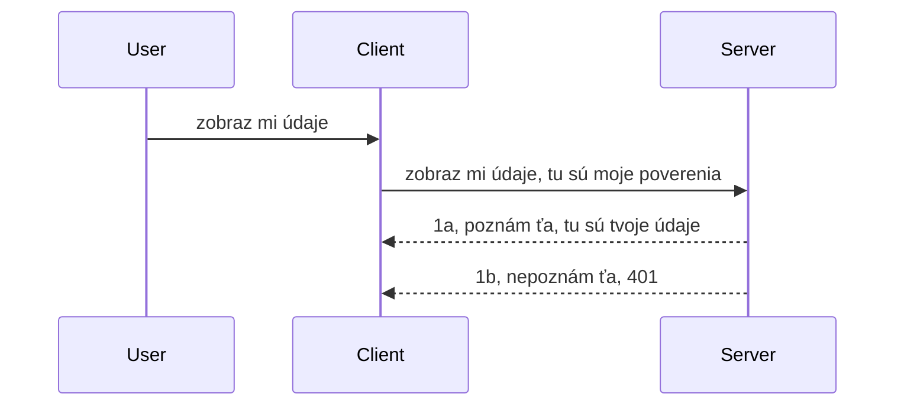

# Jednoduchá autentifikácia

MCP SDK podporujú používanie OAuth 2.1, čo je úprimne dosť komplexný proces, ktorý zahŕňa koncepty ako auth server, resource server, odosielanie prihlasovacích údajov, získavanie kódu, výmenu kódu za bearer token, až kým konečne nezískate dáta z vašich zdrojov. Ak nie ste zvyknutí na OAuth, čo je skvelá vec na implementovanie, je dobrý nápad začať s nejakou základnou úrovňou autentifikácie a postupne prejsť na lepšiu a lepšiu bezpečnosť. Preto táto kapitola existuje, aby vás vybudovala k pokročilejšej autentifikácii.

## Autentifikácia, čo tým myslíme?

Autentifikácia je skratka pre overovanie identity a autorizáciu. Myšlienka je, že musíme urobiť dve veci:

- **Autentifikácia**, čo je proces zistenia, či pustíme osobu do nášho domu, že má právo byť „tu“, teda mať prístup k nášmu resource serveru, kde sú funkcie MCP Servera.
- **Autorizácia**, je proces zisťovania, či má užívateľ prístup k týmto konkrétnym zdrojom, o ktoré žiada, napríklad tieto objednávky alebo tieto produkty, alebo či má napríklad právo čítať obsah, ale nie ho vymazať.

## Prihlasovacie údaje: ako systému hovoríme, kto sme

No, väčšina webových vývojárov začne rozmýšľať v zmysle poskytnutia prihlasovacieho údaja serveru, zvyčajne nejakej tajnej hodnoty, ktorá hovorí, či majú právo byť tu („autentifikácia“). Tento údaj je zvyčajne base64 kódovaná verzia používateľského mena a hesla alebo API kľúč, ktorý jednoznačne identifikuje konkrétneho používateľa.

Toto sa posiela cez hlavičku nazvanú „Authorization“ takto:

```json
{ "Authorization": "secret123" }
```

Toto sa zvyčajne nazýva základná autentifikácia (basic authentication). Celý tok potom funguje nasledovne:


Teraz keď rozumieme, ako to funguje z hľadiska toku, ako to implementujeme? Väčšina webových serverov má koncept middleware, kus kódu, ktorý sa spúšťa ako súčasť požiadavky, ktorý môže overiť prihlasovacie údaje a ak sú platné, umožní požiadavke prejsť. Ak požiadavka nemá platné prihlasovacie údaje, dostanete chybu autentifikácie. Pozrime sa, ako sa to dá implementovať:

**Python**

```python
class AuthMiddleware(BaseHTTPMiddleware):
    async def dispatch(self, request, call_next):

        has_header = request.headers.get("Authorization")
        if not has_header:
            print("-> Missing Authorization header!")
            return Response(status_code=401, content="Unauthorized")

        if not valid_token(has_header):
            print("-> Invalid token!")
            return Response(status_code=403, content="Forbidden")

        print("Valid token, proceeding...")
       
        response = await call_next(request)
        # pridajte akékoľvek zákaznícke hlavičky alebo nejako zmeňte odpoveď
        return response


starlette_app.add_middleware(CustomHeaderMiddleware)
```

Tu máme:

- Vytvorený middleware nazvaný `AuthMiddleware`, kde sa metóda `dispatch` volá webovým serverom.
- Middleware pridaný do webového servera:

    ```python
    starlette_app.add_middleware(AuthMiddleware)
    ```

- Napísanú validačnú logiku, ktorá kontroluje, či je prítomná hlavička Authorization a či je odoslané tajomstvo platné:

    ```python
    has_header = request.headers.get("Authorization")
    if not has_header:
        print("-> Missing Authorization header!")
        return Response(status_code=401, content="Unauthorized")

    if not valid_token(has_header):
        print("-> Invalid token!")
        return Response(status_code=403, content="Forbidden")
    ```

    ak je tajomstvo prítomné a platné, umožníme požiadavke prejsť volaním `call_next` a vrátime odpoveď.

    ```python
    response = await call_next(request)
    # pridajte akékoľvek vlastné hlavičky zákazníka alebo zmeňte odpoveď nejakým spôsobom
    return response
    ```

Funguje to tak, že ak je webová požiadavka smerovaná na server, middleware sa vyvolá a na základe implementácie buď požiadavku prepustí, alebo vráti chybu, ktorá naznačuje, že klient nesmie pokračovať.

**TypeScript**

Tu vytvárame middleware v populárnom framewoku Express a zachytávame požiadavku pred jej dosiahnutím MCP Servera. Tu je kód:

```typescript
function isValid(secret) {
    return secret === "secret123";
}

app.use((req, res, next) => {
    // 1. Je prítomný autorizačný hlavička?
    if(!req.headers["Authorization"]) {
        res.status(401).send('Unauthorized');
    }
    
    let token = req.headers["Authorization"];

    // 2. Skontrolujte platnosť.
    if(!isValid(token)) {
        res.status(403).send('Forbidden');
    }

   
    console.log('Middleware executed');
    // 3. Odovzdá požiadavku do ďalšieho kroku v procese spracovania požiadavky.
    next();
});
```

V tomto kóde:

1. Kontrolujeme, či je hlavička Authorization prítomná, ak nie, posielame chybu 401.
2. Overujeme platnosť prihlasovacích údajov/tokenu, ak nie je platný, posielame chybu 403.
3. Nakoniec posunieme požiadavku ďalej v pipeline a vrátime požadovaný zdroj.

## Cvičenie: Implementujte autentifikáciu

Použime naše vedomosti a skúste to implementovať. Plán je:

Server

- Vytvoriť webový server a MCP inštanciu.
- Implementovať middleware pre server.

Klient

- Poslať webovú požiadavku s prihlasovacím údajom cez hlavičku.

### -1- Vytvorenie webového servera a MCP inštancie

V prvom kroku potrebujeme vytvoriť inštanciu webového servera a MCP Server.

**Python**

Tu vytvárame MCP server inštanciu, vytvoríme starlette web app a hosťujeme ju pomocou uvicorn.

```python
# vytváranie MCP Servera

app = FastMCP(
    name="MCP Resource Server",
    instructions="Resource Server that validates tokens via Authorization Server introspection",
    host=settings["host"],
    port=settings["port"],
    debug=True
)

# vytváranie webovej aplikácie starlette
starlette_app = app.streamable_http_app()

# poskytovanie aplikácie cez uvicorn
async def run(starlette_app):
    import uvicorn
    config = uvicorn.Config(
            starlette_app,
            host=app.settings.host,
            port=app.settings.port,
            log_level=app.settings.log_level.lower(),
        )
    server = uvicorn.Server(config)
    await server.serve()

run(starlette_app)
```

V tomto kóde:

- Vytvoríme MCP Server.
- Zkonštruujeme starlette web app z MCP Servera cez `app.streamable_http_app()`.
- Hosťujeme a spúšťame web app cez uvicorn `server.serve()`.

**TypeScript**

Tu vytvárame MCP Server inštanciu.

```typescript
const server = new McpServer({
      name: "example-server",
      version: "1.0.0"
    });

    // ... nastaviť zdroje servera, nástroje a výzvy ...
```

Toto vytvorenie MCP Servera musí prebehnúť v definícii POST /mcp cesty, takže kód presunieme takto:

```typescript
import express from "express";
import { randomUUID } from "node:crypto";
import { McpServer } from "@modelcontextprotocol/sdk/server/mcp.js";
import { StreamableHTTPServerTransport } from "@modelcontextprotocol/sdk/server/streamableHttp.js";
import { isInitializeRequest } from "@modelcontextprotocol/sdk/types.js"

const app = express();
app.use(express.json());

// Mapa na ukladanie transportov podľa ID relácie
const transports: { [sessionId: string]: StreamableHTTPServerTransport } = {};

// Spracovanie POST požiadaviek pre komunikáciu klient-server
app.post('/mcp', async (req, res) => {
  // Skontrolujte existujúce ID relácie
  const sessionId = req.headers['mcp-session-id'] as string | undefined;
  let transport: StreamableHTTPServerTransport;

  if (sessionId && transports[sessionId]) {
    // Znovu použiť existujúci transport
    transport = transports[sessionId];
  } else if (!sessionId && isInitializeRequest(req.body)) {
    // Nová inicializačná požiadavka
    transport = new StreamableHTTPServerTransport({
      sessionIdGenerator: () => randomUUID(),
      onsessioninitialized: (sessionId) => {
        // Uložiť transport podľa ID relácie
        transports[sessionId] = transport;
      },
      // Ochrana proti DNS rebindingu je predvolene vypnutá pre spätnú kompatibilitu. Ak tento server spúšťate
      // lokálne, uistite sa, že nastavíte:
      // enableDnsRebindingProtection: true,
      // allowedHosts: ['127.0.0.1'],
    });

    // Vyčistiť transport po zatvorení
    transport.onclose = () => {
      if (transport.sessionId) {
        delete transports[transport.sessionId];
      }
    };
    const server = new McpServer({
      name: "example-server",
      version: "1.0.0"
    });

    // ... nastaviť serverové zdroje, nástroje a výzvy ...

    // Pripojiť sa k MCP serveru
    await server.connect(transport);
  } else {
    // Neplatná požiadavka
    res.status(400).json({
      jsonrpc: '2.0',
      error: {
        code: -32000,
        message: 'Bad Request: No valid session ID provided',
      },
      id: null,
    });
    return;
  }

  // Spracovať požiadavku
  await transport.handleRequest(req, res, req.body);
});

// Znovupoužiteľný handler pre GET a DELETE požiadavky
const handleSessionRequest = async (req: express.Request, res: express.Response) => {
  const sessionId = req.headers['mcp-session-id'] as string | undefined;
  if (!sessionId || !transports[sessionId]) {
    res.status(400).send('Invalid or missing session ID');
    return;
  }
  
  const transport = transports[sessionId];
  await transport.handleRequest(req, res);
};

// Spracovať GET požiadavky pre notifikácie zo servera klientovi cez SSE
app.get('/mcp', handleSessionRequest);

// Spracovať DELETE požiadavky na ukončenie relácie
app.delete('/mcp', handleSessionRequest);

app.listen(3000);
```

Teraz vidíte, ako bolo vytvorenie MCP Servera presunuté do `app.post("/mcp")`.

Prejdime teraz na ďalší krok – vytvorenie middleware, aby sme mohli validovať prichádzajúci credential.

### -2- Implementácia middleware pre server

Pokračujme s middleware. Tu vytvoríme middleware, ktorý hľadá prihlasovací údaj v hlavičke `Authorization` a validuje ho. Ak je akceptovateľný, tak požiadavka bude pokračovať v vykonaní svojich úloh (napr. výpis nástrojov, čítanie zdroja alebo čokoľvek z MCP funkcionality, ktorú klient požaduje).

**Python**

Pre vytvorenie middleware musíme vytvoriť triedu, ktorá dedí z `BaseHTTPMiddleware`. Sú tu dve zaujímavé časti:

- požiadavka `request`, z ktorej čítame hlavičku.
- `call_next` callback, ktorý musíme vyvolať, ak klient priniesol akceptovateľný údaj.

Najprv musíme riešiť situáciu, ak hlavička `Authorization` chýba:

```python
has_header = request.headers.get("Authorization")

# žiadny hlavička prítomná, zlyhať s 401, inak pokračovať ďalej.
if not has_header:
    print("-> Missing Authorization header!")
    return Response(status_code=401, content="Unauthorized")
```

Tu posielame správu 401 unauthorized, pretože klient zlyháva v autentifikácii.

Ďalej, ak bol údaj odoslaný, overujeme jeho platnosť takto:

```python
 if not valid_token(has_header):
    print("-> Invalid token!")
    return Response(status_code=403, content="Forbidden")
```

Všimnite si, že posielame správu 403 forbidden. Kompletný middleware s implementáciou vyššie uvedeného vyzerá takto:

```python
class AuthMiddleware(BaseHTTPMiddleware):
    async def dispatch(self, request, call_next):

        has_header = request.headers.get("Authorization")
        if not has_header:
            print("-> Missing Authorization header!")
            return Response(status_code=401, content="Unauthorized")

        if not valid_token(has_header):
            print("-> Invalid token!")
            return Response(status_code=403, content="Forbidden")

        print("Valid token, proceeding...")
        print(f"-> Received {request.method} {request.url}")
        response = await call_next(request)
        response.headers['Custom'] = 'Example'
        return response

```

Skvelé, ale čo funkcia `valid_token`? Tu je jej kód:

```python
# NEPOUŽÍVAJTE do produkcie - zlepšite to !!
def valid_token(token: str) -> bool:
    # odstráňte predponu "Bearer "
    if token.startswith("Bearer "):
        token = token[7:]
        return token == "secret-token"
    return False
```

Toto by sa samozrejme malo zlepšiť.

DÔLEŽITÉ: Nikdy by ste nemali mať takéto tajomstvá priamo v kóde. Hodnotu by ste mali ideálne získavať z dátového zdroja alebo od IDP (poskytovateľa identity) alebo ešte lepšie nechať overovanie na IDP.

**TypeScript**

Na implementáciu v Express musíme použiť metódu `use`, ktorá prijíma middleware funkcie.

Musíme:

- Interagovať s premennou request a kontrolovať prihlasovacie údaje v property `Authorization`.
- Validovať prihlasovacie údaje a ak sú akceptovateľné, nechať požiadavku pokračovať a klientov MCP request urobiť, čo má (napr. výpis nástrojov, čítanie zdroja atď.).

Tu kontrolujeme, či je hlavička `Authorization` prítomná, ak nie, zastavíme požiadavku:

```typescript
if(!req.headers["authorization"]) {
    res.status(401).send('Unauthorized');
    return;
}
```

Ak hlavička nie je prítomná, dostanete chybu 401.

Ďalej kontrolujeme platnosť prihlasovacích údajov, ak nie sú platné, opäť zastavíme požiadavku, ale s trochu iným hlásením:

```typescript
if(!isValid(token)) {
    res.status(403).send('Forbidden');
    return;
} 
```

Všimnite si, že dostanete chybu 403.

Kompletný kód vyzerá takto:

```typescript
app.use((req, res, next) => {
    console.log('Request received:', req.method, req.url, req.headers);
    console.log('Headers:', req.headers["authorization"]);
    if(!req.headers["authorization"]) {
        res.status(401).send('Unauthorized');
        return;
    }
    
    let token = req.headers["authorization"];

    if(!isValid(token)) {
        res.status(403).send('Forbidden');
        return;
    }  

    console.log('Middleware executed');
    next();
});
```

Nastavili sme webový server na prijatie middleware, ktorý kontroluje prihlasovacie údaje, ktoré nám klient dúfajme posiela. Čo klient sám?

### -3- Poslať webovú požiadavku s prihlasovacím údajom cez hlavičku

Musíme zabezpečiť, že klient posiela prihlasovací údaj cez hlavičku. Keďže použijeme MCP klienta, musíme sa dozvedieť, ako to urobiť.

**Python**

Pre klienta musíme poslať hlavičku s prihlasovacím údajom takto:

```python
# NENECHÁVAJ hodnotu pevne zakódovanú, maj ju minimálne v premennej prostredia alebo v bezpečnejšom úložisku
token = "secret-token"

async with streamablehttp_client(
        url = f"http://localhost:{port}/mcp",
        headers = {"Authorization": f"Bearer {token}"}
    ) as (
        read_stream,
        write_stream,
        session_callback,
    ):
        async with ClientSession(
            read_stream,
            write_stream
        ) as session:
            await session.initialize()
      
            # TODO, čo chceš, aby sa robilo na klientovi, napr. zoznam nástrojov, volanie nástrojov atď.
```

Všimnite si, že nastavujeme `headers` takto ` headers = {"Authorization": f"Bearer {token}"}`.

**TypeScript**

Toto vyriešime v dvoch krokoch:

1. Naplniť konfiguračný objekt prihlasovacími údajmi.
2. Poslať tento konfiguračný objekt do transportu.

```typescript

// NEtvrdokódujte hodnotu ako je to tu ukázané. Minimálne ju majte ako premennú prostredia a používajte niečo ako dotenv (v režime vývoja).
let token = "secret123"

// definujte objekt možností klientskeho transportu
let options: StreamableHTTPClientTransportOptions = {
  sessionId: sessionId,
  requestInit: {
    headers: {
      "Authorization": "secret123"
    }
  }
};

// odovzdajte objekt možností transportu
async function main() {
   const transport = new StreamableHTTPClientTransport(
      new URL(serverUrl),
      options
   );
```

Tu vidíte, že sme museli vytvoriť objekt `options` a umiestniť naše hlavičky pod vlastnosť `requestInit`.

DÔLEŽITÉ: Ako to však zlepšiť? Aktuálna implementácia má problémy. Najprv, posielanie prihlasovacích údajov takto je rizikové, pokiaľ nemáte aspoň HTTPS. Aj vtedy môže byť údaj odcudzený, preto potrebujete systém, kde môžete ľahko zrušiť token a pridať dodatočné kontroly, napríklad odkiaľ sa požiadavka posiela, či sa opakuje príliš často (správanie podobné botovi) a podobne. Úplne je tu veľa obáv.

Treba však povedať, že pre veľmi jednoduché API, kde nechcete, aby bol ktokoľvek volavný bez autentifikácie, je toto dobrý začiatok.

S tým povedaným, skúste posilniť bezpečnosť použitím štandardizovaného formátu ako JSON Web Token, známeho aj ako JWT alebo „JOT“ tokeny.

## JSON Web Tokeny, JWT

Takže snažíme sa zlepšiť veci od jednoduchých prihlasovacích údajov. Aké bezprostredné výhody prináša prijatie JWT?

- **Bezpečnostné vylepšenia**. V základnej autentifikácii posielate používateľské meno a heslo ako base64 kódovaný token (alebo posielate API kľúč) znova a znova, čo zvyšuje riziko. Pri JWT pošlete svoje používateľské meno a heslo a dostanete token na používanie, ktorý je časovo obmedzený a vyprší. JWT vám umožňuje jednoducho používať jemnozrnnú kontrolu prístupu pomocou rolí, rozsahov a oprávnení.
- **Bezstavovosť a škálovateľnosť**. JWT sú samoobsiahnuté, nesú všetky informácie o užívateľovi a eliminujú potrebu uchovávania sessions na serveri. Token môže byť overený aj lokálne.
- **Interoperabilita a federácia**. JWT je centrálnym prvkom Open ID Connect a používa sa s známymi poskytovateľmi identity ako Entra ID, Google Identity a Auth0. Tiež umožňuje single sign-on a oveľa viac, čo je podnikové riešenie.
- **Modulárnosť a flexibilita**. JWT sa dajú používať aj s API bránami ako Azure API Management, NGINX a ďalšie. Podporuje overovanie používateľov a server-to-server komunikáciu vrátane scenárov impersonácie a delegácie.
- **Výkon a cachovanie**. JWT môžu byť cacheované po dekódovaní, čo znižuje nutnosť opakovaného parsovania. To pomáha najmä pri aplikáciách s veľkým zaťažením, zvyšuje priepustnosť a znižuje záťaž infraštruktúry.
- **Pokročilé funkcie**. Tiež podporuje introspekciu (overenie platnosti na serveri) a revokáciu (neplatnosť tokenu).

So všetkými týmito benefitmi, poďme sa pozrieť, ako posunúť implementáciu na ďalšiu úroveň.

## Premena základnej autentifikácie na JWT

Zmeny, ktoré musíme urobiť vo veľkej nahliadnutí, sú:

- **Naučiť sa konštruovať JWT token** a pripraviť ho na odoslanie klientom serveru.
- **Validovať JWT token** a ak je platný, umožniť klientovi prístup k našim zdrojom.
- **Bezpečné ukladanie tokenu**. Ako tento token skladovať.
- **Chrániť cesty**. Musíme chrániť cesty, v našom prípade tie MCP cesty a konkrétne funkcie.
- **Pridať refresh tokeny**. Vytvárať krátkodobé tokeny a dlhodobé refresh tokeny, ktoré umožňujú získanie nových tokenov po vypršaní. Zabezpečiť refresh endpoint a stratégiu rotácie.

### -1- Konštrukcia JWT tokenu

JWT token má nasledujúce časti:

- **header**, použitý algoritmus a typ tokenu.
- **payload**, nároky (claims), ako sub (používateľ alebo entita, ktorú token reprezentuje, zvyčajne userid), exp (expiration - keď vyprší), role (rola)
- **signature**, podpísané tajomstvom alebo súkromným kľúčom.

Preto musíme zostaviť header, payload a zakódovaný token.

**Python**

```python

import jwt
import jwt
from jwt.exceptions import ExpiredSignatureError, InvalidTokenError
import datetime

# Tajný kľúč používaný na podpísanie JWT
secret_key = 'your-secret-key'

header = {
    "alg": "HS256",
    "typ": "JWT"
}

# informácie o používateľovi, jeho nároky a čas vypršania
payload = {
    "sub": "1234567890",               # Predmet (ID používateľa)
    "name": "User Userson",                # Vlastný nárok
    "admin": True,                     # Vlastný nárok
    "iat": datetime.datetime.utcnow(),# Vydané o
    "exp": datetime.datetime.utcnow() + datetime.timedelta(hours=1)  # Vyprší
}

# zakódovať to
encoded_jwt = jwt.encode(payload, secret_key, algorithm="HS256", headers=header)
```

V kóde vyššie sme:

- Definovali header s použitím algoritmu HS256 a typom JWT.
- Zostavili payload obsahujúci subject alebo id používateľa, užívateľské meno, rolu, čas vydania a čas vypršania, čím implementujeme časové obmedzenie, ktoré sme spomenuli.

**TypeScript**

Budeme potrebovať závislosti, ktoré nám pomôžu konštruovať JWT token.

Závislosti

```sh

npm install jsonwebtoken
npm install --save-dev @types/jsonwebtoken
```

Teraz keď to máme, vytvorme header, payload a zakódovaný token.

```typescript
import jwt from 'jsonwebtoken';

const secretKey = 'your-secret-key'; // Použite premenné prostredia v produkcii

// Definujte obsah správy
const payload = {
  sub: '1234567890',
  name: 'User usersson',
  admin: true,
  iat: Math.floor(Date.now() / 1000), // Vystavené
  exp: Math.floor(Date.now() / 1000) + 60 * 60 // Platnosť vyprší za 1 hodinu
};

// Definujte hlavičku (voliteľné, jsonwebtoken nastavuje predvolené hodnoty)
const header = {
  alg: 'HS256',
  typ: 'JWT'
};

// Vytvorte token
const token = jwt.sign(payload, secretKey, {
  algorithm: 'HS256',
  header: header
});

console.log('JWT:', token);
```

Tento token je:

Podpísaný pomocou HS256
Platný 1 hodinu
Obsahuje súdy (claims) ako sub, name, admin, iat a exp.

### -2- Validácia tokenu

Token musíme validovať, to je potrebné robiť na serveri, aby sme zabezpečili, že to, čo klient posiela, je platné. Robíme rôzne kontroly od validácie štruktúry až po platnosť. Je vhodné pridať ďalšie kontroly, aby sme skontrolovali, či token poukazuje na existujúceho používateľa v systéme a že má potrebné práva.

Pre validáciu tokenu ho dekódujeme, aby sme ho mohli čítať a začať overovať jeho platnosť:

**Python**

```python

# Dekódujte a overte JWT
try:
    decoded = jwt.decode(token, secret_key, algorithms=["HS256"])
    print("✅ Token is valid.")
    print("Decoded claims:")
    for key, value in decoded.items():
        print(f"  {key}: {value}")
except ExpiredSignatureError:
    print("❌ Token has expired.")
except InvalidTokenError as e:
    print(f"❌ Invalid token: {e}")

```

V kóde voláme `jwt.decode` s tokenom, tajným kľúčom a algoritmom. Používame try-catch, lebo neúspešná validácia vyvolá chybu.

**TypeScript**

Tu voláme `jwt.verify`, aby sme získali dekódovanú verziu tokenu na ďalšiu analýzu. Ak toto zlyhá, znamená to, že token je nesprávneho formátu alebo už nie je platný.

```typescript

try {
  const decoded = jwt.verify(token, secretKey);
  console.log('Decoded Payload:', decoded);
} catch (err) {
  console.error('Token verification failed:', err);
}
```

POZNÁMKA: ako sme už spomenuli, mali by sme vykonať ďalšie kontroly, aby sme zaistili, že token sa viaže na používateľa v systéme a že má práva, ktoré tvrdí.

Ďalej sa pozrieme na riadenie prístupu podľa rolí, známe aj ako RBAC.
## Pridávanie riadenia prístupu na základe rolí

Myšlienka je, že chceme vyjadriť, že rôzne role majú rôzne oprávnenia. Napríklad predpokladáme, že administrátor môže robiť všetko, bežný používateľ môže čítať a zapisovať a hosť môže iba čítať. Preto sú tu niektoré možné úrovne oprávnení:

- Admin.Write 
- User.Read
- Guest.Read

Pozrime sa, ako môžeme implementovať takéto riadenie pomocou middleware. Middleware sa dá pridať pre konkrétnu trasu, ako aj pre všetky trasy.

**Python**

```python
from starlette.middleware.base import BaseHTTPMiddleware
from starlette.responses import JSONResponse
import jwt

# NEumiestňujte tajný kód priamo v kóde, toto je len na demonštračné účely. Prečítajte ho z bezpečného miesta.
SECRET_KEY = "your-secret-key" # uložte to do premennej prostredia
REQUIRED_PERMISSION = "User.Read"

class JWTPermissionMiddleware(BaseHTTPMiddleware):
    async def dispatch(self, request, call_next):
        auth_header = request.headers.get("Authorization")
        if not auth_header or not auth_header.startswith("Bearer "):
            return JSONResponse({"error": "Missing or invalid Authorization header"}, status_code=401)

        token = auth_header.split(" ")[1]
        try:
            decoded = jwt.decode(token, SECRET_KEY, algorithms=["HS256"])
        except jwt.ExpiredSignatureError:
            return JSONResponse({"error": "Token expired"}, status_code=401)
        except jwt.InvalidTokenError:
            return JSONResponse({"error": "Invalid token"}, status_code=401)

        permissions = decoded.get("permissions", [])
        if REQUIRED_PERMISSION not in permissions:
            return JSONResponse({"error": "Permission denied"}, status_code=403)

        request.state.user = decoded
        return await call_next(request)


```

Existuje niekoľko rôznych spôsobov, ako pridať middleware, napríklad takto:

```python

# Alt 1: pridať middleware počas konštrukcie starlette aplikácie
middleware = [
    Middleware(JWTPermissionMiddleware)
]

app = Starlette(routes=routes, middleware=middleware)

# Alt 2: pridať middleware po konštrukcii starlette aplikácie
starlette_app.add_middleware(JWTPermissionMiddleware)

# Alt 3: pridať middleware pre každú cestu
routes = [
    Route(
        "/mcp",
        endpoint=..., # spracovateľ
        middleware=[Middleware(JWTPermissionMiddleware)]
    )
]
```

**TypeScript**

Môžeme použiť `app.use` a middleware, ktorý sa spustí pre všetky požiadavky.

```typescript
app.use((req, res, next) => {
    console.log('Request received:', req.method, req.url, req.headers);
    console.log('Headers:', req.headers["authorization"]);

    // 1. Skontrolujte, či bol odoslaný autorizačný hlavička

    if(!req.headers["authorization"]) {
        res.status(401).send('Unauthorized');
        return;
    }
    
    let token = req.headers["authorization"];

    // 2. Skontrolujte, či je token platný
    if(!isValid(token)) {
        res.status(403).send('Forbidden');
        return;
    }  

    // 3. Skontrolujte, či používateľ tokenu existuje v našom systéme
    if(!isExistingUser(token)) {
        res.status(403).send('Forbidden');
        console.log("User does not exist");
        return;
    }
    console.log("User exists");

    // 4. Overte, či má token správne oprávnenia
    if(!hasScopes(token, ["User.Read"])){
        res.status(403).send('Forbidden - insufficient scopes');
    }

    console.log("User has required scopes");

    console.log('Middleware executed');
    next();
});

```

Existuje dosť vecí, ktoré môžeme nechať robiť náš middleware a ktoré by náš middleware MAL robiť, menovite:

1. Overiť, či je prítomný hlavičkový parameter autorizácie
2. Overiť, či je token platný, voláme `isValid`, ktorý je metóda, ktorú sme napísali na kontrolu integrity a platnosti JWT tokenu.
3. Overiť, či používateľ existuje v našom systéme, toto by sme mali skontrolovať.

   ```typescript
    // používatelia v DB
   const users = [
     "user1",
     "User usersson",
   ]

   function isExistingUser(token) {
     let decodedToken = verifyToken(token);

     // TODO, skontrolovať, či používateľ existuje v DB
     return users.includes(decodedToken?.name || "");
   }
   ```

   Hore sme vytvorili veľmi jednoduchý zoznam `users`, ktorý by samozrejme mal byť v databáze.

4. Okrem toho by sme mali tiež skontrolovať, či token má správne oprávnenia.

   ```typescript
   if(!hasScopes(token, ["User.Read"])){
        res.status(403).send('Forbidden - insufficient scopes');
   }
   ```

   V tomto kóde middleware vyššie kontrolujeme, či token obsahuje oprávnenie User.Read, ak nie, posielame chybu 403. Nižšie je pomocná metóda `hasScopes`.

   ```typescript
   function hasScopes(scope: string, requiredScopes: string[]) {
     let decodedToken = verifyToken(scope);
    return requiredScopes.every(scope => decodedToken?.scopes.includes(scope));
  }
   ```

Have a think which additional checks you should be doing, but these are the absolute minimum of checks you should be doing.

Using Express as a web framework is a common choice. There are helpers library when you use JWT so you can write less code.

- `express-jwt`, helper library that provides a middleware that helps decode your token.
- `express-jwt-permissions`, this provides a middleware `guard` that helps check if a certain permission is on the token.

Here's what these libraries can look like when used:

```typescript
const express = require('express');
const jwt = require('express-jwt');
const guard = require('express-jwt-permissions')();

const app = express();
const secretKey = 'your-secret-key'; // put this in env variable

// Decode JWT and attach to req.user
app.use(jwt({ secret: secretKey, algorithms: ['HS256'] }));

// Check for User.Read permission
app.use(guard.check('User.Read'));

// multiple permissions
// app.use(guard.check(['User.Read', 'Admin.Access']));

app.get('/protected', (req, res) => {
  res.json({ message: `Welcome ${req.user.name}` });
});

// Error handler
app.use((err, req, res, next) => {
  if (err.code === 'permission_denied') {
    return res.status(403).send('Forbidden');
  }
  next(err);
});

```

Teraz ste videli, ako sa middleware dá použiť na autentifikáciu aj autorizáciu, ale čo MCP, či to mení spôsob, akým robíme autentifikáciu? Zistime to v nasledujúcej sekcii.

### -3- Pridanie RBAC do MCP

Doteraz ste videli, ako sa dá pridať RBAC cez middleware, avšak pre MCP neexistuje jednoduchý spôsob, ako pridať RBAC pre každú MCP funkciu, tak čo robíme? No, jednoducho musíme pridať kód, ktorý v tomto prípade skontroluje, či klient má práva volať konkrétny nástroj:

Máte niekoľko možností, ako dosiahnuť RBAC pre jednotlivé funkcie, tu sú niektoré:

- Pridať kontrolu pre každý nástroj, zdroj, prompt, kde potrebujete overiť úroveň oprávnenia.

   **python**

   ```python
   @tool()
   def delete_product(id: int):
      try:
          check_permissions(role="Admin.Write", request)
      catch:
        pass # klient zlyhal pri autorizácii, vyvolajte chybu autorizácie
   ```

   **typescript**

   ```typescript
   server.registerTool(
    "delete-product",
    {
      title: Delete a product",
      description: "Deletes a product",
      inputSchema: { id: z.number() }
    },
    async ({ id }) => {
      
      try {
        checkPermissions("Admin.Write", request);
        // todo, odoslať id do productService a vzdialeného vstupu
      } catch(Exception e) {
        console.log("Authorization error, you're not allowed");  
      }

      return {
        content: [{ type: "text", text: `Deletected product with id ${id}` }]
      };
    }
   );
   ```


- Použiť pokročilý prístup na strane servera a request handlery, aby ste minimalizovali počet miest, kde je potrebné kontrolu robiť.

   **Python**

   ```python
   
   tool_permission = {
      "create_product": ["User.Write", "Admin.Write"],
      "delete_product": ["Admin.Write"]
   }

   def has_permission(user_permissions, required_permissions) -> bool:
      # používateľské oprávnenia: zoznam oprávnení, ktoré používateľ má
      # požadované oprávnenia: zoznam oprávnení potrebných pre nástroj
      return any(perm in user_permissions for perm in required_permissions)

   @server.call_tool()
   async def handle_call_tool(
     name: str, arguments: dict[str, str] | None
   ) -> list[types.TextContent]:
    # Predpokladaj, že request.user.permissions je zoznam oprávnení pre používateľa
     user_permissions = request.user.permissions
     required_permissions = tool_permission.get(name, [])
     if not has_permission(user_permissions, required_permissions):
        # Vyvolaj chybu "Nemáte oprávnenie používať nástroj {name}"
        raise Exception(f"You don't have permission to call tool {name}")
     # pokračuj a zavolaj nástroj
     # ...
   ```   
   

   **TypeScript**

   ```typescript
   function hasPermission(userPermissions: string[], requiredPermissions: string[]): boolean {
       if (!Array.isArray(userPermissions) || !Array.isArray(requiredPermissions)) return false;
       // Vrátiť true, ak má používateľ aspoň jedno vyžadované oprávnenie
       
       return requiredPermissions.some(perm => userPermissions.includes(perm));
   }
  
   server.setRequestHandler(CallToolRequestSchema, async (request) => {
      const { params: { name } } = request;
  
      let permissions = request.user.permissions;
  
      if (!hasPermission(permissions, toolPermissions[name])) {
         return new Error(`You don't have permission to call ${name}`);
      }
  
      // pokračujte..
   });
   ```

   Poznámka, musíte zabezpečiť, že váš middleware priradí dekódovaný token k vlastnosti user požiadavky, aby bol kód vyššie jednoduchý.

### Zhrnutie

Teraz, keď sme diskutovali, ako pridať podporu pre RBAC všeobecne a pre MCP konkrétne, je čas skúsiť implementovať bezpečnosť sami, aby ste sa uistili, že ste pochopili prezentované koncepty.

## Zadanie 1: Vytvorte MCP server a MCP klienta s použitím základnej autentifikácie

Tu použijete to, čo ste sa naučili o prenose prihlasovacích údajov cez hlavičky.

## Riešenie 1

[Riešenie 1](./code/basic/README.md)

## Zadanie 2: Vylepšiť riešenie zo Zadania 1 tak, aby používalo JWT

Vezmite prvé riešenie, ale tentokrát ho vylepšíme.

Namiesto Basic Auth použijeme JWT.

## Riešenie 2

[Riešenie 2](./solution/jwt-solution/README.md)

## Výzva

Pridajte RBAC pre každý nástroj, ako popisujeme v sekcii "Pridanie RBAC do MCP".

## Zhrnutie

Dúfame, že ste sa v tejto kapitole veľa naučili, od žiadnej bezpečnosti cez základnú bezpečnosť až po JWT a ako ho možno pridať do MCP.

Vybudovali sme pevný základ s vlastnými JWT, no ako škálujeme, smerujeme k štandardnému modelu identity. Prijatie IdP ako Entra alebo Keycloak nám umožňuje odľahčiť vydávanie tokenov, ich overovanie a správu životného cyklu na dôveryhodnú platformu — čo nám uvoľňuje ruky sústrediť sa na logiku aplikácie a užívateľský zážitok.

Pre to máme pokročilejšiu [kapitolu o Entre](../../05-AdvancedTopics/mcp-security-entra/README.md)

## Čo ďalej

- Ďalej: [Nastavenie MCP hostiteľov](../12-mcp-hosts/README.md)

---

<!-- CO-OP TRANSLATOR DISCLAIMER START -->
**Zrieknutie sa zodpovednosti**:  
Tento dokument bol preložený pomocou AI prekladateľskej služby [Co-op Translator](https://github.com/Azure/co-op-translator). Hoci sa snažíme o presnosť, majte, prosím, na pamäti, že automatizované preklady môžu obsahovať chyby alebo nepresnosti. Originálny dokument v jeho pôvodnom jazyku by mal byť považovaný za autoritatívny zdroj. Pre dôležité informácie sa odporúča profesionálny ľudský preklad. Nie sme zodpovední za akékoľvek nedorozumenia alebo nesprávne interpretácie vyplývajúce z použitia tohto prekladu.
<!-- CO-OP TRANSLATOR DISCLAIMER END -->