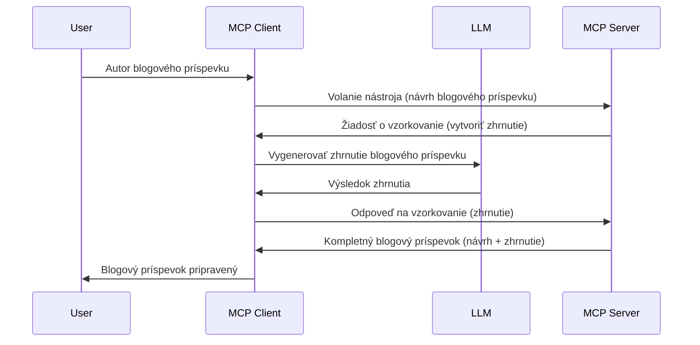

# Sampling - delegovanie funkcií klientovi

Niekedy potrebujete, aby MCP klient a MCP server spolupracovali na dosiahnutí spoločného cieľa. Môže sa stať, že server potrebuje pomoc LLM, ktorý je na kliente. Pre takúto situáciu by ste mali použiť sampling.

Pozrime sa na niektoré prípady použitia a ako vybudovať riešenie zahŕňajúce sampling.

## Prehľad

V tejto lekcii sa zameriame na vysvetlenie, kedy a kde používať sampling a ako ho nakonfigurovať.

## Ciele učenia

V tejto kapitole:

- Vysvetlíme, čo je sampling a kedy ho používať.
- Ukážeme ako nakonfigurovať sampling v MCP.
- Poskytneme príklady použitia samplingu v praxi.

## Čo je sampling a prečo ho používať?

Sampling je pokročilá funkcia, ktorá funguje nasledujúcim spôsobom:


### Požiadavka na sampling

Dobre, teraz máme celkový pohľad na vierohodný scenár, poďme sa porozprávať o požiadavke na sampling, ktorú server odosiela klientovi. Takto môže vyzerať taká požiadavka vo formáte JSON-RPC:

```json
{
  "jsonrpc": "2.0",
  "id": 1,
  "method": "sampling/createMessage",
  "params": {
    "messages": [
      {
        "role": "user",
        "content": {
          "type": "text",
          "text": "Create a blog post summary of the following blog post: <BLOG POST>"
        }
      }
    ],
    "modelPreferences": {
      "hints": [
        {
          "name": "claude-3-sonnet"
        }
      ],
      "intelligencePriority": 0.8,
      "speedPriority": 0.5
    },
    "systemPrompt": "You are a helpful assistant.",
    "maxTokens": 100
  }
}
```

Tu je niekoľko vecí, ktoré stojí za to vyzdvihnúť:

- Prompt, pod content -> text, je naša výzva, ktorá je inštrukciou pre LLM na zhrnutie obsahu blogového príspevku.

- **modelPreferences**. Táto časť predstavuje preferenciu, odporúčanie, akú konfiguráciu použiť s LLM. Používateľ si môže zvoliť, či bude tieto odporúčania dodržiavať alebo ich zmeniť. V tomto prípade sú odporúčania týkajúce sa modelu na použitie a priorít rýchlosti a inteligencie.
- **systemPrompt**, toto je váš bežný systémový prompt, ktorý dáva vašemu LLM osobnosť a obsahuje pokyny.
- **maxTokens**, ďalšia vlastnosť, ktorá uvádza, koľko tokenov sa odporúča použiť pre túto úlohu.

### Odpoveď na sampling

Táto odpoveď je to, čo MCP klient nakoniec pošle späť MCP serveru, je výsledkom toho, že klient zavolá LLM, počká na odpoveď a potom vytvorí túto správu. Takto to môže vyzerať vo formáte JSON-RPC:

```json
{
  "jsonrpc": "2.0",
  "id": 1,
  "result": {
    "role": "assistant",
    "content": {
      "type": "text",
      "text": "Here's your abstract <ABSTRACT>"
    },
    "model": "gpt-5",
    "stopReason": "endTurn"
  }
}
```

Všimnite si, že odpoveď je abstrakt blogového príspevku presne tak, ako sme požadovali. Tiež všimnite, že použitý `model` nie je ten, ktorý sme požadovali, ale "gpt-5" namiesto "claude-3-sonnet". Toto ilustruje, že používateľ si môže zmeniť názor, čo použiť, a že vaša požiadavka na sampling je odporúčanie.

Dobre, teraz keď chápeme hlavný tok a užitočnú úlohu na ktorú ho použiť "vytváranie blogového príspevku + abstrakt", pozrime sa, čo je potrebné spraviť, aby to fungovalo.

### Typy správ

Sampling správy nie sú obmedzené len na text, môžete tiež posielať obrázky a zvuk. Takto vyzerá JSON-RPC v rôznych prípadoch:

**Text**

```json
{
  "type": "text",
  "text": "The message content"
}
```

**Obsah obrázka**

```json
{
  "type": "image",
  "data": "base64-encoded-image-data",
  "mimeType": "image/jpeg"
}
```

**Audio obsah**

```json
{
  "type": "audio",
  "data": "base64-encoded-audio-data",
  "mimeType": "audio/wav"
}
```

> NOTE: pre podrobnejšie informácie o samplingu, pozrite si [oficiálnu dokumentáciu](https://modelcontextprotocol.io/specification/2025-06-18/client/sampling)

## Ako nakonfigurovať sampling v klientovi

> Poznámka: ak vytvárate iba server, nemusíte tu robiť veľa.

V klientovi musíte zadať túto funkciu nasledovne:

```json
{
  "capabilities": {
    "sampling": {}
  }
}
```

Táto konfigurácia bude zachytená, keď sa zvolený klient inicializuje so serverom.

## Príklad samplingu v praxi - vytvorenie blogového príspevku

Naprogramujme sampling server spolu, musíme urobiť nasledovné:

1. Vytvoriť nástroj na serveri.
1. Tento nástroj by mal vytvoriť sampling požiadavku.
1. Nástroj by mal počkať na odpoveď na sampling požiadavku od klienta.
1. Následne by sa mal vyprodukovať výsledok nástroja.

Pozrime sa na kód krok po kroku:

### -1- Vytvorenie nástroja

**python**

```python
@mcp.tool()
async def create_blog(title: str, content: str, ctx: Context[ServerSession, None]) -> str:
    """Create a blog post and generate a summary"""

```

### -2- Vytvorenie sampling požiadavky

Rozšírte svoj nástroj o nasledujúci kód:

**python**

```python
post = BlogPost(
        id=len(posts) + 1,
        title=title,
        content=content,
        abstract=""
    )

prompt = f"Create an abstract of the following blog post: title: {title} and draft: {content} "

result = await ctx.session.create_message(
        messages=[
            SamplingMessage(
                role="user",
                content=TextContent(type="text", text=prompt),
            )
        ],
        max_tokens=100,
)

```

### -3- Čakanie na odpoveď a vrátenie odpovede

**python**

```python
post.abstract = result.content.text

posts.append(post)

# vrátiť kompletný produkt
return json.dumps({
    "id": post.title,
    "abstract": post.abstract
})
```

### -4- Komplet kód

**python**

```python
from starlette.applications import Starlette
from starlette.routing import Mount, Host

from mcp.server.fastmcp import Context, FastMCP

from mcp.server.session import ServerSession
from mcp.types import SamplingMessage, TextContent

import json


from uuid import uuid4
from typing import List
from pydantic import BaseModel


mcp = FastMCP("Blog post generator")

# app = FastAPI()

posts = []

class BlogPost(BaseModel):
    id: int
    title: str
    content: str
    abstract: str

posts: List[BlogPost] = []

@mcp.tool()
async def create_blog(title: str, content: str, ctx: Context[ServerSession, None]) -> str:
    """Create a blog post and generate a summary"""

    post = BlogPost(
        id=len(posts) + 1,
        title=title,
        content=content,
        abstract=""
    )

    prompt = f"Create an abstract of the following blog post: title: {title} and draft: {content} "

    result = await ctx.session.create_message(
        messages=[
            SamplingMessage(
                role="user",
                content=TextContent(type="text", text=prompt),
            )
        ],
        max_tokens=100,
    )

    post.abstract = result.content.text

    posts.append(post)

    # vrátiť celý blogový príspevok
    return json.dumps({
        "id": post.title,
        "abstract": post.abstract
    })

if __name__ == "__main__":
    print("Starting server...")
    # mcp.run()
    mcp.run(transport="streamable-http")

# spustiť aplikáciu príkazom: python server.py
```

### -5- Testovanie vo Visual Studio Code

Ak to chcete otestovať vo Visual Studio Code, urobte nasledovné:

1. Spustite server v termináli
1. Pridajte ho do *mcp.json* (a uistite sa, že je spustený), napríklad takto:

   ```json
   "servers": {
      "blog-server": {
        "type": "http",
        "url": "http://localhost:8000/mcp"
      }
   }
   ```

1. Zadajte výzvu:

   ```text
   create a blog post named "Where Python comes from", the content is "Python is actually named after Monty Python Flying Circus"
   ```

1. Povoliť sampling. Pri prvom teste sa zobrazí ďalší dialóg, ktorý musíte potvrdiť a potom uvidíte bežný dialóg na spustenie nástroja.

1. Skontrolujte výsledky. Výsledky uvidíte pekne zobrazené v GitHub Copilot Chate, ale môžete tiež pozrieť surovú JSON odpoveď.

**Bonus**. Nástroje vo Visual Studio Code majú výbornú podporu pre sampling. Sampling prístup môžete nastaviť na vašom nainštalovanom serveri takto:

1. Prejdite do sekcie rozšírení.
1. Vyberte ikonu ozubeného kolieska pre váš nainštalovaný server v sekcii "MCP SERVERS - INSTALLED".
1 Vyberte "Configure Model Access", tu môžete vybrať, ktoré modely môže GitHub Copilot použiť pri vykonávaní samplingu. Tiež môžete vidieť všetky nedávne sampling požiadavky výberom "Show Sampling requests".

## Zadanie

V tomto zadaní vytvoríte trochu iný sampling, konkrétne sampling integráciu, ktorá podporuje generovanie popisu produktu. Tu je váš scenár:

**Scenár**: Zamestnanec back office e-shopu potrebuje pomoc, generovanie popisov produktov mu zaberá príliš veľa času. Preto máte vytvoriť riešenie, kde zavoláte nástroj "create_product" s argumentmi "title" a "keywords" a mal by vygenerovať kompletný produkt vrátane poľa "description", ktoré by mal vyplniť LLM na klientovi.

TIP: použite, čo ste sa naučili skôr na vytvorenie tohto servera a jeho nástroja pomocou sampling požiadavky.

## Riešenie

[Riešenie](./solution/README.md)

## Kľúčové zhrnutie

Sampling je silná funkcia, ktorá umožňuje serveru delegovať úlohy klientovi, keď potrebuje pomoc LLM.

## Čo ďalej

- [Kapitola 4 - Praktická implementácia](../../04-PracticalImplementation/README.md)

---

<!-- CO-OP TRANSLATOR DISCLAIMER START -->
**Upozornenie**:  
Tento dokument bol preložený pomocou AI prekladateľskej služby [Co-op Translator](https://github.com/Azure/co-op-translator). Aj keď sa snažíme o presnosť, vezmite prosím na vedomie, že automatizované preklady môžu obsahovať chyby alebo nepresnosti. Originálny dokument v jeho pôvodnom jazyku by mal byť považovaný za autoritatívny zdroj. Pre kritické informácie sa odporúča profesionálny ľudský preklad. Nie sme zodpovední za akékoľvek nedorozumenia alebo nesprávne interpretácie vyplývajúce z použitia tohto prekladu.
<!-- CO-OP TRANSLATOR DISCLAIMER END -->