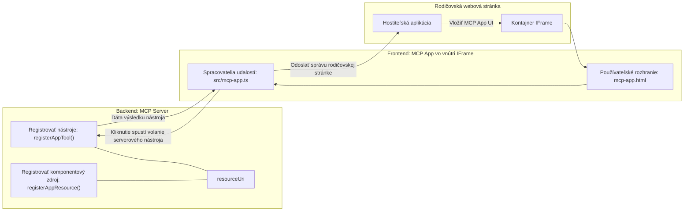

# MCP Aplikácie

MCP Aplikácie sú nový paradigmat v MCP. Myšlienka je v tom, že nielenže vrátite dáta z volania nástroja, ale poskytujete aj informácie o tom, ako by sa s týmito informáciami malo interagovať. To znamená, že výsledky nástrojov teraz môžu obsahovať informácie o používateľskom rozhraní. Prečo by sme to však chceli? No, zvážte, ako toho robíte dnes. Pravdepodobne spotrebúvate výsledky MCP Servera tým, že pred neho umiestnite nejaký typ frontendu, čo je kód, ktorý musíte písať a udržiavať. Niekedy je to to, čo chcete, ale niekedy by bolo skvelé, keby ste mohli jednoducho priniesť úryvok informácií, ktorý je samostatný a má všetko od dát po používateľské rozhranie.

## Prehľad

Táto lekcia poskytuje praktické usmernenie o MCP Aplikáciách, ako s nimi začať a ako ich integrovať do vašich existujúcich webových aplikácií. MCP Aplikácie sú veľmi novým prídavkom do MCP Štandardu.

## Ciele učenia

Na konci tejto lekcie budete schopní:

- Vysvetliť čo sú MCP Aplikácie.
- Kedy použiť MCP Aplikácie.
- Postaviť a integrovať svoje vlastné MCP Aplikácie.

## MCP Aplikácie - ako to funguje

Myšlienkou MCP Aplikácií je poskytnúť odpoveď, ktorá je v podstate komponentom na vykreslenie. Takýto komponent môže mať ako vizuály, tak aj interaktivitu, napríklad kliknutia na tlačidlo, vstup od používateľa a viac. Začnime na strane servera a našim MCP Serverom. Na vytvorenie MCP App komponentu je potrebné vytvoriť nástroj, ale aj aplikačný zdroj. Tieto dve polovice sú prepojené resourceUri.

Tu je príklad. Skúsme si vizualizovať, čo všetko to zahŕňa a ktoré časti čo robia:

```text
server.ts -- responsible for registering tools and the component as a UI component
src/
  mcp-app.ts -- wiring up event handlers
mcp-app.html -- the user interface
```

Tento obrázok popisuje architektúru vytvorenia komponentu a jeho logiku.


Skúsme opísať zodpovednosti backendu a frontendu.

### Backend

Musíme tu splniť dve veci:

- Registrovať nástroje, s ktorými chceme komunikovať.
- Definovať komponent.

**Registrácia nástroja**

```typescript
registerAppTool(
    server,
    "get-time",
    {
      title: "Get Time",
      description: "Returns the current server time.",
      inputSchema: {},
      _meta: { ui: { resourceUri } }, // Prepojí tento nástroj s jeho zdrojom používateľského rozhrania
    },
    async () => {
      const time = new Date().toISOString();
      return { content: [{ type: "text", text: time }] };
    },
  );

```

Predchádzajúci kód popisuje správanie, kde sa vystavuje nástroj s názvom `get-time`. Neprijíma žiadne vstupy, ale produkuje aktuálny čas. Máme možnosť definovať `inputSchema` pre nástroje, kde potrebujeme prijať vstup od používateľa.

**Registrácia komponentu**

V tom istom súbore potrebujeme tiež registrovať komponent:

```typescript
const resourceUri = "ui://get-time/mcp-app.html";

// Zaregistrujte zdroj, ktorý vráti zabalený HTML/JavaScript pre rozhranie užívateľa.
registerAppResource(
  server,
  resourceUri,
  resourceUri,
  { mimeType: RESOURCE_MIME_TYPE },
  async () => {
    const html = await fs.readFile(path.join(DIST_DIR, "mcp-app.html"), "utf-8");

    return {
    contents: [
        { uri: resourceUri, mimeType: RESOURCE_MIME_TYPE, text: html },
    ],
    };
  },
);
```

Všimnite si, že spomíname `resourceUri` na prepojenie komponentu s jeho nástrojmi. Zaujímavý je tiež callback, kde sa načíta súbor UI a vráti komponent.

### Frontend komponentu

Rovnako ako backend, aj tu sú dve časti:

- Frontend napísaný v čistej HTML.
- Kód, ktorý spracováva udalosti a čo robiť, napr. volať nástroje alebo posielať správy rodičovskému oknu.

**Používateľské rozhranie**

Pozrime sa na používateľské rozhranie.

```html
<!-- mcp-app.html -->
<!DOCTYPE html>
<html lang="en">
  <head>
    <meta charset="UTF-8" />
    <title>Get Time App</title>
  </head>
  <body>
    <p>
      <strong>Server Time:</strong> <code id="server-time">Loading...</code>
    </p>
    <button id="get-time-btn">Get Server Time</button>
    <script type="module" src="/src/mcp-app.ts"></script>
  </body>
</html>
```

**Pripájanie udalostí**

Poslednou časťou je pripájanie eventov. To znamená, že identifikujeme, ktorá časť nášho UI potrebuje event handlery a čo robiť, ak sa udalosti spustia:

```typescript
// mcp-app.ts

import { App } from "@modelcontextprotocol/ext-apps";

// Získať referencie na elementy
const serverTimeEl = document.getElementById("server-time")!;
const getTimeBtn = document.getElementById("get-time-btn")!;

// Vytvoriť inštanciu aplikácie
const app = new App({ name: "Get Time App", version: "1.0.0" });

// Spracovať výsledky nástrojov zo servera. Nastavte pred `app.connect()`, aby sa zabránilo
// strate počiatočného výsledku nástroja.
app.ontoolresult = (result) => {
  const time = result.content?.find((c) => c.type === "text")?.text;
  serverTimeEl.textContent = time ?? "[ERROR]";
};

// Pripojiť kliknutie tlačidla
getTimeBtn.addEventListener("click", async () => {
  // `app.callServerTool()` umožňuje používateľskému rozhraniu požadovať čerstvé údaje zo servera
  const result = await app.callServerTool({ name: "get-time", arguments: {} });
  const time = result.content?.find((c) => c.type === "text")?.text;
  serverTimeEl.textContent = time ?? "[ERROR]";
});

// Pripojiť sa k hostiteľovi
app.connect();
```

Ako vidíte vyššie, je to bežný kód na pripájanie DOM elementov k udalostiam. Za zmienku stojí volanie `callServerTool`, ktoré nakoniec volá nástroj na backende.

## Spracovanie vstupu používateľa

Doteraz sme videli komponent, ktorý má tlačidlo, ktoré po kliknutí volá nástroj. Skúsme pridať ďalšie prvky UI, ako vstupné pole a zistiť, či môžeme posielať argumenty nástroju. Implementujme funkciu FAQ. Fungovať by to malo takto:

- Malo by byť tlačidlo a vstupné pole, kde používateľ zadá kľúčové slovo na vyhľadávanie napríklad "Shipping". Toto by malo volať nástroj na backend, ktorý vyhľadá v dátach FAQ.
- Nástroj, ktorý podporuje uvedené vyhľadávanie v FAQ.

Najprv pridajme potrebnú podporu na backend:

```typescript
const faq: { [key: string]: string } = {
    "shipping": "Our standard shipping time is 3-5 business days.",
    "return policy": "You can return any item within 30 days of purchase.",
    "warranty": "All products come with a 1-year warranty covering manufacturing defects.",
  }

registerAppTool(
    server,
    "get-faq",
    {
      title: "Search FAQ",
      description: "Searches the FAQ for relevant answers.",
      inputSchema: zod.object({
        query: zod.string().default("shipping"),
      }),
      _meta: { ui: { resourceUri: faqResourceUri } }, // Pripája tento nástroj k jeho UI zdroju
    },
    async ({ query }) => {
      const answer: string = faq[query.toLowerCase()] || "Sorry, I don't have an answer for that.";
      return { content: [{ type: "text", text: answer }] };
    },
  );
```

Vidíme tu, ako napĺňame `inputSchema` a dávame mu `zod` schému takto:

```typescript
inputSchema: zod.object({
  query: zod.string().default("shipping"),
})
```

V uvedenej schéme deklarujeme vstupný parameter `query`, ktorý je voliteľný s predvolenou hodnotou "shipping".

Dobre, pokračujme do *mcp-app.html*, aby sme videli, aké UI musíme vytvoriť:

```html
<div class="faq">
    <h1>FAQ response</h1>
    <p>FAQ Response: <code id="faq-response">Loading...</code></p>
    <input type="text" id="faq-query" placeholder="Enter FAQ query" />
    <button id="get-faq-btn">Get FAQ Response</button>
  </div>
```

Výborne, teraz máme vstupné pole a tlačidlo. Poďme na *mcp-app.ts* ďalej na prepojenie týchto udalostí:

```typescript
const getFaqBtn = document.getElementById("get-faq-btn")!;
const faqQueryInput = document.getElementById("faq-query") as HTMLInputElement;

getFaqBtn.addEventListener("click", async () => {
  const query = faqQueryInput.value;
  const result = await app.callServerTool({ name: "get-faq", arguments: { query } });
  const faq = result.content?.find((c) => c.type === "text")?.text;
  faqResponseEl.textContent = faq ?? "[ERROR]";
});
```

V kóde vyššie sme:

- Vytvorili odkazy na interaktívne UI prvky.
- Spracovali kliknutie tlačidla tak, že vyparsujeme hodnotu z vstupného poľa a tiež voláme `app.callServerTool()` s `name` a `arguments`, kde posledný odovzdáva hodnotu `query`.

Čo sa vlastne deje pri volaní `callServerTool`, je to, že sa posiela správa rodičovskému oknu, ktoré následne zavolá MCP Server.

### Vyskúšajte si to

Pri vyskúšaní by sme mali vidieť toto:


a tu skúšame s vstupom ako "warranty"


Na spustenie tohto kódu navštívte [sekcia kódu](./code/README.md)

## Testovanie vo Visual Studio Code

Visual Studio Code má skvelú podporu pre MCP Aplikácie a je pravdepodobne jedným z najjednoduchších spôsobov, ako testovať vaše MCP Aplikácie. Na použitie Visual Studio Code pridajte záznam servera do *mcp.json* takto:

```json
"my-mcp-server-7178eca7": {
    "url": "http://localhost:3001/mcp",
    "type": "http"
  }
```

Potom spustite server, mali by ste byť schopní komunikovať so svojou MCP App cez chat okno, pokiaľ máte nainštalovaný GitHub Copilot.

Môžete ho vyvolať napríklad príkazom "#get-faq":


a rovnako ako keď ste to spustili cez webový prehliadač, zobrazuje to UI rovnako takto:


## Zadanie

Vytvorte hru kameň, papier, nožnice. Mala by pozostávať z nasledovného:

UI:

- rozbaľovací zoznam s možnosťami
- tlačidlo na potvrdenie voľby
- štítok, ktorý ukáže, kto čo vybral a kto vyhral

Server:

- mal by mať nástroj rock paper scissor, ktorý prijíma "choice" ako vstup. Mal by tiež vykresliť výber počítača a určiť víťaza

## Riešenie

[Riešenie](./assignment/README.md)

## Zhrnutie

Naučili sme sa o tomto novom paradigmate MCP Aplikácií. Je to nový paradigmat, ktorý umožňuje MCP Serverom mať názor nielen na dáta, ale aj na to, ako by tieto dáta mali byť prezentované.

Okrem toho sme sa naučili, že tieto MCP Aplikácie sú hosťované v IFrame a na komunikáciu s MCP Servermi musia odosielať správy do rodičovskej webovej aplikácie. Existuje niekoľko knižníc pre čistý JavaScript, React a ďalšie, ktoré túto komunikáciu uľahčujú.

## Kľúčové poznatky

Tu je to, čo ste sa naučili:

- MCP Aplikácie sú nový štandard, ktorý môže byť užitočný, keď chcete doručiť dáta aj funkcie UI.
- Tieto typy aplikácií bežia v IFrame z bezpečnostných dôvodov.

## Čo ďalej

- [Kapitola 4](../../04-PracticalImplementation/README.md)

---

<!-- CO-OP TRANSLATOR DISCLAIMER START -->
**Zrieknutie sa zodpovednosti**:  
Tento dokument bol preložený pomocou AI prekladateľskej služby [Co-op Translator](https://github.com/Azure/co-op-translator). Aj keď sa snažíme o presnosť, vezmite prosím na vedomie, že automatické preklady môžu obsahovať chyby alebo nepresnosti. Originálny dokument v jeho pôvodnom jazyku by mal byť považovaný za autoritatívny zdroj. Pre kritické informácie sa odporúča profesionálny ľudský preklad. Nie sme zodpovední za akékoľvek nedorozumenia alebo nesprávne interpretácie vzniknuté použitím tohto prekladu.
<!-- CO-OP TRANSLATOR DISCLAIMER END -->