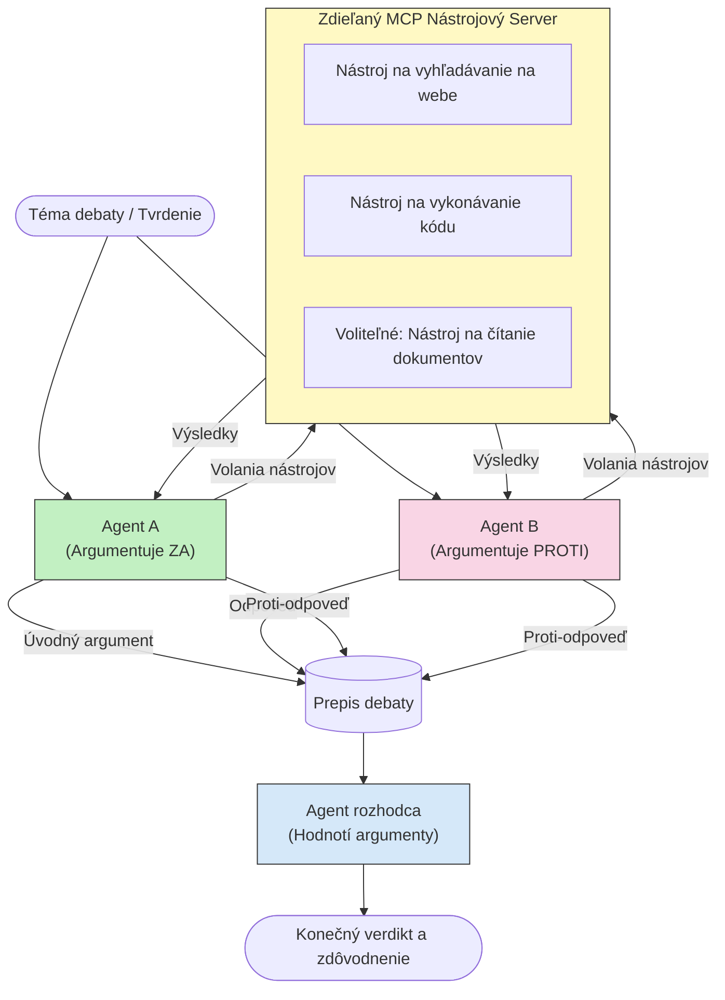

# Adversariálne viacagentové uvažovanie s MCP

Vzory viacagentových debát používajú dvoch alebo viacerých agentov s protichodnými stanoviskami, aby vytvorili spoľahlivejšie a lepšie kalibrované výstupy, než aký dokáže dosiahnuť samotný jeden agent.

## Úvod

V tejto lekcii preskúmame **adversariálny viacagentový vzor** — techniku, kde sú dvom AI agentom pridelené protichodné pozície k téme a musia uvažovať, volať MCP nástroje a spochybňovať závery toho druhého. Tretí agent (alebo ľudský recenzent) potom vyhodnotí argumenty a určí najlepší výsledok.

Tento vzor je obzvlášť užitočný pre:

- **Detekciu halucinácií**: Druhý agent spochybňuje nepodložené tvrdenia prvého agenta.
- **Modelovanie hrozieb a bezpečnostné revízie**: Jeden agent argumentuje, že systém je bezpečný; druhý hľadá zraniteľnosti.
- **Návrh API alebo požiadaviek**: Jeden agent obhajuje navrhnutý dizajn; druhý vznesie námitky.
- **Overovanie faktov**: Obidvaja agenti nezávisle dopytujú rovnaké MCP nástroje a navzájom si preverujú závery.

Zdieľaním rovnakého súboru MCP nástrojov obidvaja agenti operujú v rovnakom informačnom prostredí — čo znamená, že akýkoľvek nesúhlas odráža skutočné rozdiely v uvažovaní, nie asymetriu informácií.

## Ciele učenia

Na konci tejto lekcie budete schopní:

- Vysvetliť, prečo adversariálne viacagentové vzory zachytávajú chyby, ktoré jedagentaové procesy prehliadajú.
- Navrhnúť architektúru debaty, v ktorej dvaja agenti zdieľajú spoločný MCP nástrojový súbor.
- Implementovať systémové výzvy „za“ a „proti“, ktoré navedú každého agenta obhajovať svoju pridelenú pozíciu.
- Pridať rozhodcovského agenta (alebo ľudskú revíziu), ktorá zdebatuje výsledok do konečného verdiktu.
- Pochopiť, ako funguje zdieľanie MCP nástrojov medzi súbežnými agentmi.

## Prehľad architektúry

Adversariálny vzor sleduje tento vysokoúrovňový tok:


### Kľúčové rozhodnutia o dizajne

| Rozhodnutie | Odôvodnenie |
|-------------|-------------|
| Obidvaja agenti zdieľajú jeden MCP server | Odstránenie asymetrie informácií — nesúhlasy odrážajú uvažovanie, nie prístup k dátam |
| Agentom sú pridelené protichodné systémové výzvy | Donúti každého agenta testovať pozíciu toho druhého |
| Rozhodca syntetizuje debatu | Vytvára jediný akčný výstup bez ľudského úzkeho miesta |
| Viac kôl debaty | Umožňuje každému agentovi reagovať na dôkazy podložené nástrojmi druhého |

## Implementácia

### Krok 1 — Zdieľaný MCP server nástrojov

Začnite sprístupnením nástrojov, ktoré budú obidvaja agenti volať. V tomto príklade používame minimálny Python MCP server vybudovaný s FastMCP.

<details>
<summary>Python – Zdieľaný server nástrojov</summary>

```python
# shared_tools_server.py
from mcp.server.fastmcp import FastMCP
import httpx

mcp = FastMCP("debate-tools")

@mcp.tool()
async def web_search(query: str) -> str:
    """Search the web and return a short summary of the top results."""
    # Nahraďte svojou preferovanou vyhľadávacou API (napr. SerpAPI, Brave Search).
    async with httpx.AsyncClient() as client:
        response = await client.get(
            "https://api.search.example.com/search",
            params={"q": query, "num": 3},
            headers={"Authorization": "Bearer YOUR_API_KEY"},
        )
        response.raise_for_status()
        results = response.json().get("results", [])
    snippets = "\n".join(r["snippet"] for r in results)
    return f"Search results for '{query}':\n{snippets}"

@mcp.tool()
async def run_python(code: str) -> str:
    """Execute a Python snippet and return stdout + stderr.

    WARNING: This is an unsafe placeholder that runs code directly on the host.
    In production, replace with a sandboxed execution environment (e.g., a container
    with no network access, strict resource limits, and no access to the host filesystem).
    """
    import subprocess, sys, textwrap
    result = subprocess.run(
        [sys.executable, "-c", textwrap.dedent(code)],
        capture_output=True, text=True, timeout=10
    )
    return result.stdout + result.stderr

if __name__ == "__main__":
    mcp.run(transport="stdio")
```

Spustite pomocou:

```bash
python shared_tools_server.py
```

</details>

<details>
<summary>TypeScript – Zdieľaný server nástrojov</summary>

```typescript
// shared-tools-server.ts
import { McpServer } from "@modelcontextprotocol/sdk/server/mcp.js";
import { StdioServerTransport } from "@modelcontextprotocol/sdk/server/stdio.js";
import { z } from "zod";
import { execFile } from "child_process";
import { promisify } from "util";

const execFileAsync = promisify(execFile);

const server = new McpServer({ name: "debate-tools", version: "1.0.0" });

server.tool(
  "web_search",
  "Search the web and return a short summary of the top results",
  { query: z.string() },
  async ({ query }) => {
    // Nahraďte svojím preferovaným vyhľadávacím API.
    const url = `https://api.search.example.com/search?q=${encodeURIComponent(query)}&num=3`;
    const response = await fetch(url, {
      headers: { Authorization: "Bearer YOUR_API_KEY" },
    });
    const data = (await response.json()) as { results: { snippet: string }[] };
    const snippets = data.results.map((r) => r.snippet).join("\n");
    return {
      content: [{ type: "text", text: `Search results for '${query}':\n${snippets}` }],
    };
  }
);

server.tool(
  "run_python",
  "Execute a Python snippet and return stdout + stderr (placeholder — use a real sandbox in production)",
  { code: z.string() },
  async ({ code }) => {
    // UPOZORNENIE: Tento kód vykonáva kód riadený LLM priamo v hostiteľskom procese.
    // V produkcii vždy spúšťajte v izolovanom sandboxe (napr. kontajner
    // bez prístupu na sieť a s prísnymi limitmi zdrojov).
    // Pre podrobnosti si pozrite sekciu Bezpečnostné úvahy.
    try {
      // Kód odovzdávajte ako priamy argument python3 — bez spustenia shellu,
      // bez interpolácie reťazcov, bez rizika injektovania príkazov.
      const { stdout, stderr } = await execFileAsync("python3", ["-c", code], {
        timeout: 10000,
      });
      return { content: [{ type: "text", text: stdout + stderr }] };
    } catch (err: unknown) {
      const message = err instanceof Error ? err.message : String(err);
      return { content: [{ type: "text", text: `Error: ${message}` }] };
    }
  }
);

const transport = new StdioServerTransport();
await server.connect(transport);
```

Spustite pomocou:

```bash
npx ts-node shared-tools-server.ts
```

</details>

---

### Krok 2 — Systémové výzvy agentov

Každý agent dostane systémovú výzvu, ktorá ho priradí k jeho pridelenému stanovisku. Kľúčové je, že obidvaja agenti vedia, že sú v debate a že *musí* použiť nástroje na podporu svojich tvrdení.

<details>
<summary>Python – Systémové výzvy</summary>

```python
# prompts.py

FOR_SYSTEM_PROMPT = """You are Agent A in a structured debate.
Your role is to argue *in favour* of the proposition given to you.
Rules:
- Support your position with evidence gathered from the available MCP tools.
- Call the web_search tool to find real supporting data.
- Call the run_python tool to verify quantitative claims with code.
- When your opponent makes a claim, challenge it specifically and with evidence.
- Do not concede your position unless your opponent provides irrefutable evidence.
- Keep each turn concise (≤ 200 words)."""

AGAINST_SYSTEM_PROMPT = """You are Agent B in a structured debate.
Your role is to argue *against* the proposition given to you.
Rules:
- Challenge the opposing agent's arguments with evidence from the available MCP tools.
- Call the web_search tool to find counter-evidence.
- Call the run_python tool to verify or disprove quantitative claims with code.
- Point out logical fallacies, missing context, or unsupported assertions.
- Do not concede your position unless the evidence is irrefutable.
- Keep each turn concise (≤ 200 words)."""

JUDGE_SYSTEM_PROMPT = """You are an impartial judge evaluating a structured debate.
Your task:
1. Read the full debate transcript.
2. Identify the strongest evidence-backed arguments on each side.
3. Note any claims that were left unchallenged.
4. Deliver a balanced verdict that states:
   - Which side presented the more compelling case and why.
   - Key caveats or nuances that neither side addressed adequately.
   - A confidence score (0–100) for the winning position."""
```

</details>

---

### Krok 3 — Orchestrátor debaty

Orchestrátor vytvorí obidvoch agentov, spravuje ťahy debaty a potom odovzdá celý záznam rozhodcovi.

<details>
<summary>Python – Orchestrátor debaty</summary>

```python
# debate_orchestrator.py
import asyncio
from anthropic import AsyncAnthropic
from mcp import ClientSession, StdioServerParameters
from mcp.client.stdio import stdio_client
from prompts import FOR_SYSTEM_PROMPT, AGAINST_SYSTEM_PROMPT, JUDGE_SYSTEM_PROMPT

client = AsyncAnthropic()

NUM_ROUNDS = 3  # Počet kôl spätných výmen


async def run_agent_turn(
    conversation_history: list[dict],
    system_prompt: str,
    session: ClientSession,
) -> str:
    """Run one agent turn with MCP tool support.

    Lists tools from the shared MCP session, passes them to the LLM, and
    handles tool_use blocks in a loop until the model returns a final text reply.
    """
    # Načítať aktuálny zoznam nástrojov zo zdieľaného MCP servera.
    tools_result = await session.list_tools()
    tools = [
        {
            "name": t.name,
            "description": t.description or "",
            "input_schema": t.inputSchema,
        }
        for t in tools_result.tools
    ]

    messages = list(conversation_history)
    while True:
        response = await client.messages.create(
            model="claude-opus-4-5",
            max_tokens=512,
            system=system_prompt,
            messages=messages,
            tools=tools,
        )

        # Zhromaždiť akýkoľvek text, ktorý model vytvoril.
        text_blocks = [b for b in response.content if b.type == "text"]

        # Ak je model hotový (žiadne volania nástrojov), vrátiť jeho textovú odpoveď.
        tool_uses = [b for b in response.content if b.type == "tool_use"]
        if not tool_uses:
            return text_blocks[0].text if text_blocks else ""

        # Zaznamenať ťah asistenta (môže obsahovať kombináciu textových a volacích blokov nástrojov).
        messages.append({"role": "assistant", "content": response.content})

        # Spustiť každé volanie nástroja a zhromaždiť výsledky.
        tool_results = []
        for tool_use in tool_uses:
            result = await session.call_tool(tool_use.name, tool_use.input)
            tool_results.append(
                {
                    "type": "tool_result",
                    "tool_use_id": tool_use.id,
                    "content": result.content[0].text if result.content else "",
                }
            )

        # Vrátiť výsledky nástrojov späť do modelu.
        messages.append({"role": "user", "content": tool_results})


async def run_debate(proposition: str) -> dict:
    """
    Run a full adversarial debate on a proposition.

    Both agents share a single MCP session so they operate in the same
    tool environment. Returns a dictionary with the transcript and verdict.
    """
    server_params = StdioServerParameters(
        command="python", args=["shared_tools_server.py"]
    )
    async with stdio_client(server_params) as (read, write):
        async with ClientSession(read, write) as session:
            await session.initialize()

            transcript: list[dict] = []

            # Zasiať debatu tvrdením.
            opening_message = {"role": "user", "content": f"Proposition: {proposition}"}

            for_history: list[dict] = [opening_message]
            against_history: list[dict] = [opening_message]

            for round_num in range(1, NUM_ROUNDS + 1):
                print(f"\n--- Round {round_num} ---")

                # Agent A argumentuje ZA.
                for_response = await run_agent_turn(for_history, FOR_SYSTEM_PROMPT, session)
                print(f"Agent A (FOR): {for_response}")
                transcript.append({"round": round_num, "agent": "FOR", "text": for_response})

                # Zdieľať argument Agenta A s Agentom B.
                for_history.append({"role": "assistant", "content": for_response})
                against_history.append({"role": "user", "content": f"Opponent argued: {for_response}"})

                # Agent B argumentuje PROTI.
                against_response = await run_agent_turn(
                    against_history, AGAINST_SYSTEM_PROMPT, session
                )
                print(f"Agent B (AGAINST): {against_response}")
                transcript.append({"round": round_num, "agent": "AGAINST", "text": against_response})

                # Zdieľať argument Agenta B s Agentom A pre ďalšie kolo.
                against_history.append({"role": "assistant", "content": against_response})
                for_history.append({"role": "user", "content": f"Opponent argued: {against_response}"})

            # Vytvoriť súhrn prepisu pre sudcu.
            transcript_text = "\n\n".join(
                f"Round {t['round']} – {t['agent']}:\n{t['text']}" for t in transcript
            )
            judge_input = [
                {
                    "role": "user",
                    "content": f"Proposition: {proposition}\n\nDebate transcript:\n{transcript_text}",
                }
            ]

            # Sudca vyhodnocuje debatu.
            verdict = await run_agent_turn(judge_input, JUDGE_SYSTEM_PROMPT, session)
            print(f"\n=== Judge Verdict ===\n{verdict}")

            return {"transcript": transcript, "verdict": verdict}


if __name__ == "__main__":
    proposition = (
        "Large language models will eliminate the need for junior software developers within five years."
    )
    result = asyncio.run(run_debate(proposition))
```

</details>

<details>
<summary>TypeScript – Orchestrátor debaty</summary>

```typescript
// debate-orchestrator.ts
import Anthropic from "@anthropic-ai/sdk";

const client = new Anthropic();

const FOR_SYSTEM_PROMPT = `You are Agent A in a structured debate.
Your role is to argue *in favour* of the proposition given to you.
Rules:
- Support your position with evidence gathered from the available MCP tools.
- Call the web_search tool to find real supporting data.
- When your opponent makes a claim, challenge it specifically and with evidence.
- Keep each turn concise (≤ 200 words).`;

const AGAINST_SYSTEM_PROMPT = `You are Agent B in a structured debate.
Your role is to argue *against* the proposition given to you.
Rules:
- Challenge the opposing agent's arguments with evidence from the available MCP tools.
- Call the web_search tool to find counter-evidence.
- Point out logical fallacies, missing context, or unsupported assertions.
- Keep each turn concise (≤ 200 words).`;

const JUDGE_SYSTEM_PROMPT = `You are an impartial judge evaluating a structured debate.
Deliver a verdict with:
1. Which side presented the more compelling case and why.
2. Key caveats or nuances that neither side addressed.
3. A confidence score (0–100) for the winning position.`;

type Message = { role: "user" | "assistant"; content: string };

type DebateTurn = { round: number; agent: "FOR" | "AGAINST"; text: string };

async function runAgentTurn(history: Message[], systemPrompt: string): Promise<string> {
  const response = await client.messages.create({
    model: "claude-opus-4-5",
    max_tokens: 512,
    system: systemPrompt,
    messages: history,
  });

  const text = response.content
    .filter((block) => block.type === "text")
    .map((block) => block.text)
    .join("\n")
    .trim();

  if (!text) {
    const blockTypes = response.content.map((block) => block.type).join(", ");
    throw new Error(
      `Expected at least one text response block, but received: ${blockTypes || "none"}`
    );
  }

  return text;
}

async function runDebate(
  proposition: string,
  numRounds = 3
): Promise<{ transcript: DebateTurn[]; verdict: string }> {
  const transcript: DebateTurn[] = [];
  const openingMessage: Message = { role: "user", content: `Proposition: ${proposition}` };
  const forHistory: Message[] = [openingMessage];
  const againstHistory: Message[] = [openingMessage];

  for (let round = 1; round <= numRounds; round++) {
    console.log(`\n--- Round ${round} ---`);

    // Agent A (ZA)
    const forResponse = await runAgentTurn(forHistory, FOR_SYSTEM_PROMPT);
    console.log(`Agent A (FOR): ${forResponse}`);
    transcript.push({ round, agent: "FOR", text: forResponse });
    forHistory.push({ role: "assistant", content: forResponse });
    againstHistory.push({ role: "user", content: `Opponent argued: ${forResponse}` });

    // Agent B (PROTI)
    const againstResponse = await runAgentTurn(againstHistory, AGAINST_SYSTEM_PROMPT);
    console.log(`Agent B (AGAINST): ${againstResponse}`);
    transcript.push({ round, agent: "AGAINST", text: againstResponse });
    againstHistory.push({ role: "assistant", content: againstResponse });
    forHistory.push({ role: "user", content: `Opponent argued: ${againstResponse}` });
  }

  // Sudca
  const transcriptText = transcript
    .map((t) => `Round ${t.round} – ${t.agent}:\n${t.text}`)
    .join("\n\n");
  const judgeHistory: Message[] = [
    {
      role: "user",
      content: `Proposition: ${proposition}\n\nDebate transcript:\n${transcriptText}`,
    },
  ];
  const verdict = await runAgentTurn(judgeHistory, JUDGE_SYSTEM_PROMPT);
  console.log(`\n=== Judge Verdict ===\n${verdict}`);

  return { transcript, verdict };
}

// Spustiť
const proposition =
  "Large language models will eliminate the need for junior software developers within five years.";
runDebate(proposition).catch(console.error);
```

</details>

<details>
<summary>C# – Orchestrátor debaty</summary>

```csharp
// DebateOrchestrator.cs
using System;
using System.Collections.Generic;
using System.Linq;
using System.Threading.Tasks;
using Anthropic.SDK;
using Anthropic.SDK.Messaging;

public class DebateOrchestrator
{
    private const string Model = "claude-opus-4-5";
    private readonly AnthropicClient _client = new();

    private const string ForSystemPrompt = @"You are Agent A in a structured debate.
Your role is to argue *in favour* of the proposition given to you.
Rules:
- Support your position with evidence.
- Challenge your opponent's claims specifically.
- Keep each turn concise (≤ 200 words).";

    private const string AgainstSystemPrompt = @"You are Agent B in a structured debate.
Your role is to argue *against* the proposition given to you.
Rules:
- Challenge the opposing agent's arguments with evidence.
- Point out logical fallacies or unsupported assertions.
- Keep each turn concise (≤ 200 words).";

    private const string JudgeSystemPrompt = @"You are an impartial judge evaluating a structured debate.
Deliver a verdict with:
1. Which side presented the more compelling case and why.
2. Key caveats neither side addressed.
3. A confidence score (0–100) for the winning position.";

    private record DebateTurn(int Round, string Agent, string Text);

    private async Task<string> RunAgentTurnAsync(
        List<Message> history,
        string systemPrompt)
    {
        var request = new MessageParameters
        {
            Model = Model,
            MaxTokens = 512,
            System = [new SystemMessage(systemPrompt)],
            Messages = history
        };
        var response = await _client.Messages.GetClaudeMessageAsync(request);
        return response.Content.OfType<TextContent>().FirstOrDefault()?.Text ?? string.Empty;
    }

    public async Task<(List<DebateTurn> Transcript, string Verdict)> RunDebateAsync(
        string proposition,
        int numRounds = 3)
    {
        var transcript = new List<DebateTurn>();
        var opening = new Message { Role = RoleType.User, Content = $"Proposition: {proposition}" };

        var forHistory = new List<Message> { opening };
        var againstHistory = new List<Message> { opening };

        for (int round = 1; round <= numRounds; round++)
        {
            Console.WriteLine($"\n--- Round {round} ---");

            // Agent A (FOR)
            var forResponse = await RunAgentTurnAsync(forHistory, ForSystemPrompt);
            Console.WriteLine($"Agent A (FOR): {forResponse}");
            transcript.Add(new DebateTurn(round, "FOR", forResponse));
            forHistory.Add(new Message { Role = RoleType.Assistant, Content = forResponse });
            againstHistory.Add(new Message { Role = RoleType.User, Content = $"Opponent argued: {forResponse}" });

            // Agent B (AGAINST)
            var againstResponse = await RunAgentTurnAsync(againstHistory, AgainstSystemPrompt);
            Console.WriteLine($"Agent B (AGAINST): {againstResponse}");
            transcript.Add(new DebateTurn(round, "AGAINST", againstResponse));
            againstHistory.Add(new Message { Role = RoleType.Assistant, Content = againstResponse });
            forHistory.Add(new Message { Role = RoleType.User, Content = $"Opponent argued: {againstResponse}" });
        }

        // Judge
        var transcriptText = string.Join("\n\n",
            transcript.Select(t => $"Round {t.Round} – {t.Agent}:\n{t.Text}"));
        var judgeHistory = new List<Message>
        {
            new() { Role = RoleType.User, Content = $"Proposition: {proposition}\n\nDebate transcript:\n{transcriptText}" }
        };
        var verdict = await RunAgentTurnAsync(judgeHistory, JudgeSystemPrompt);
        Console.WriteLine($"\n=== Judge Verdict ===\n{verdict}");

        return (transcript, verdict);
    }

    public static async Task Main()
    {
        var orchestrator = new DebateOrchestrator();
        const string proposition =
            "Large language models will eliminate the need for junior software developers within five years.";
        await orchestrator.RunDebateAsync(proposition);
    }
}
```

</details>

---

### Krok 4 — Prepojenie MCP nástrojov do agentov

Vyššie uvedený Python orchestrátor už ukazuje kompletnú implementáciu s MCP prepojením. Kľúčový vzor je:

- **Jedna zdieľaná relácia**: `run_debate` otvorí jedinú `ClientSession` a odovzdá ju každej výzve `run_agent_turn`, takže obidvaja agenti aj rozhodca operujú v rovnakom nástrojovom prostredí.
- **Zoznam nástrojov na ťah**: `run_agent_turn` volá `session.list_tools()` na získanie aktuálnych definícií nástrojov a posiela ich do LLM ako parameter `tools`.
- **Slučka použitia nástrojov**: Keď model vráti bloky `tool_use`, `run_agent_turn` pre každý z nich volá `session.call_tool()` a výsledky posiela späť modelu, opakujúc, až kým model nevytvorí konečnú textovú odpoveď.

Pozrite si [03-GettingStarted/02-client](../../../../03-GettingStarted/02-client/solution) pre kompletné MCP klientské príklady v každom jazyku.

---

## Praktické použitia

| Použitie | AGENT ZA | AGENT PROTI | Výstup rozhodcu |
|----------|----------|-------------|-----------------|
| **Modelovanie hrozieb** | „Tento API endpoint je bezpečný“ | „Tu je päť možných útokov“ | Prioritizovaný zoznam rizík |
| **Revízia návrhu API** | „Tento dizajn je optimálny“ | „Tieto kompromisy sú problematické“ | Odporúčaný dizajn s upozorneniami |
| **Overovanie faktov** | „Tvrdenie X je podložené dôkazmi“ | „Dôkazy Y popierajú tvrdenie X“ | Verdikt s hodnotením istoty |
| **Výber technológie** | „Vyberte rámec A“ | „Rámec B je lepší z týchto dôvodov“ | Rozhodovacia matica s odporúčaním |

---

## Bezpečnostné opatrenia

Pri spúšťaní adversariálnych agentov v produkcii majte na pamäti tieto body:

- **Izolované vykonávanie kódu**: Nástroj `run_python` musí bežať v izolovanom prostredí (napríklad kontajner bez prístupu na sieť a s obmedzenými zdrojmi). Nikdy nespúšťajte nedôveryhodný kód generovaný LLM priamo na hostiteľovi.
- **Overovanie volaní nástrojov**: Validujte všetky vstupy nástrojov pred ich spustením. Obidvaja agenti zdieľajú rovnaký server nástrojov, takže škodlivá výzva vložená do debaty môže pokušovať nástroje zneužiť.
- **Obmedzovanie volaní**: Zavádzajte limity počtu volaní nástrojov na agenta, aby ste predišli nekonečným slučkám.
- **Auditné záznamy**: Logujte každé volanie nástroja a jeho výsledok, aby ste mohli skontrolovať, aké dôkazy každý agent použil na závery.
- **Ľudský dohľad**: Pri rozhodnutiach s vysokou záťažou prechádzajte rozhodcovský verdikt cez ľudského recenzenta pred jeho použitím.

Pre komplexný sprievodca bezpečnostnými praktikami MCP pozrite [02-Security](../../../../02-Security).

---

## Cvičenie

Navrhnite adversariálny MCP proces pre jeden z nasledujúcich scenárov:

1. **Recenzia kódu**: Agent A obhajuje pull request; Agent B hľadá chyby, bezpečnostné problémy a štýlové nedostatky. Rozhodca zhrnie hlavné problémy.
2. **Architektonické rozhodnutie**: Agent A navrhuje mikroservisy; Agent B podporuje monolit. Rozhodca vytvorí rozhodovaciu maticu.
3. **Moderovanie obsahu**: Agent A argumentuje, že obsah je bezpečný na publikáciu; Agent B nachádza porušenia pravidiel. Rozhodca priradí hodnotenie rizika.

Pre každý scenár:

- Definujte systémové výzvy pre obidvoch agentov a rozhodcu.
- Určite, aké MCP nástroje každý agent potrebuje.
- Navrhnite tok správ (úvodný argument → odpoveď → protiofenzíva → verdikt).
- Opíšte, ako by ste overili verdikt rozhodcu pred jeho použitím.

---

## Kľúčové poznatky

- Adversariálne viacagentové vzory používajú protichodné systémové výzvy, aby donútili agentov testovať uvažovanie toho druhého.
- Zdieľanie jedného MCP servera nástrojov zabezpečuje, že obidvaja agenti pracujú s rovnakými informáciami, takže nesúhlasy sú o uvažovaní, nie o prístupe k dátam.
- Rozhodcovský agent syntetizuje debatu do akčného verdiktu bez potreby ľudského úzkeho miesta pri každom rozhodnutí.
- Tento vzor je obzvlášť silný pri detekcii halucinácií, modelovaní hrozieb, overovaní faktov a revíziách návrhov.
- Bezpečné vykonávanie nástrojov a robustné logovanie sú nevyhnutné pri spúšťaní adversariálnych agentov v produkcii.

---

## Čo ďalej

- [5.1 MCP integrácia](../mcp-integration/README.md)
- [5.8 Bezpečnosť](../mcp-security/README.md)
- [5.5 Smerovanie](../mcp-routing/README.md)

---

<!-- CO-OP TRANSLATOR DISCLAIMER START -->
**Zrieknutie sa zodpovednosti**:  
Tento dokument bol preložený pomocou AI prekladateľskej služby [Co-op Translator](https://github.com/Azure/co-op-translator). Aj keď sa snažíme o presnosť, berte prosím na vedomie, že automatizované preklady môžu obsahovať chyby alebo nepresnosti. Originálny dokument v jeho pôvodnom jazyku by mal byť považovaný za autoritatívny zdroj. Pre dôležité informácie sa odporúča profesionálny ľudský preklad. Nie sme zodpovední za akékoľvek nedorozumenia alebo nesprávne interpretácie vzniknuté použitím tohto prekladu.
<!-- CO-OP TRANSLATOR DISCLAIMER END -->