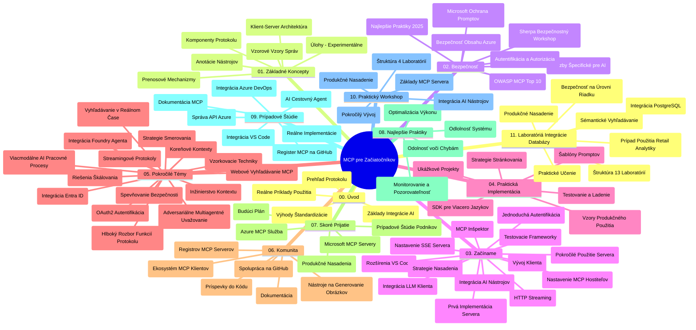

# Model Context Protocol (MCP) pre začiatočníkov - študijný sprievodca

Tento študijný sprievodca poskytuje prehľad štruktúry a obsahu repozitára pre kurz „Model Context Protocol (MCP) pre začiatočníkov“. Použite tento sprievodca na efektívnu navigáciu v repozitári a maximálne využitie dostupných zdrojov.

## Prehľad repozitára

Model Context Protocol (MCP) je štandardizovaný rámec pre interakcie medzi AI modelmi a klientskymi aplikáciami. MCP pôvodne vytvorila spoločnosť Anthropic, teraz ho udržiava širšia komunita MCP prostredníctvom oficiálnej GitHub organizácie. Tento repozitár poskytuje komplexný učebný plán s praktickými príkladmi kódu v C#, Java, JavaScript, Python a TypeScript, ktorý je určený pre AI vývojárov, systémových architektov a softvérových inžinierov.

## Vizualizácia učebného plánu

## Štruktúra repozitára

Repozitár je organizovaný do jedenástich hlavných sekcií, pričom každá sa zameriava na rôzne aspekty MCP:

1. **Úvod (00-Introduction/)**
   - Prehľad Model Context Protocolu
   - Prečo je štandardizácia dôležitá v AI pipeline
   - Praktické prípady použitia a výhody

2. **Základné koncepty (01-CoreConcepts/)**
   - Klient-server architektúra
   - Kľúčové komponenty protokolu
   - Vzory odosielania správ v MCP

3. **Bezpečnosť (02-Security/)**
   - Hrozby bezpečnosti v systémoch založených na MCP
   - Najlepšie postupy pre zabezpečenie implementácií
   - Stratégie autentifikácie a autorizácie
   - **Komplexná bezpečnostná dokumentácia**:
     - MCP bezpečnostné najlepšie postupy 2025
     - Príručka implementácie Azure Content Safety
     - MCP bezpečnostné kontroly a techniky
     - Rýchla referencia najlepších MCP praktík
   - **Kľúčové bezpečnostné témy**:
     - Útoky založené na vkladaní promptov a zatrucovaní nástrojov
     - Únos relácií a problémy s nejasným sprostredkovateľom
     - Zraniteľnosti pri prenose tokenov
     - Nadmerné oprávnenia a kontrola prístupu
     - Zabezpečenie dodávateľského reťazca pre AI komponenty
     - Integrácia Microsoft Prompt Shields

4. **Začínáme (03-GettingStarted/)**
   - Nastavenie a konfigurácia prostredia
   - Vytváranie základných MCP serverov a klientov
   - Integrácia s existujúcimi aplikáciami
   - Obsahuje sekcie pre:
     - Prvú implementáciu servera
     - Vývoj klienta
     - Integráciu LLM klienta
     - Integráciu do VS Code
     - Server-Sent Events (SSE) server
     - Pokročilé využitie servera
     - HTTP streamovanie
     - Integráciu AI Toolkit
     - Testovacie stratégie
     - Pokyny pre nasadenie

5. **Praktická implementácia (04-PracticalImplementation/)**
   - Použitie SDK v rôznych programovacích jazykoch
   - Ladenie, testovanie a techniky overovania
   - Vytváranie znovupoužiteľných prompt šablón a pracovných tokov
   - Ukážkové projekty s príkladmi implementácií

6. **Pokročilé témy (05-AdvancedTopics/)**
   - Techniky inžinierstva kontextu
   - Integrácia Foundry agenta
   - Multi-modálne AI pracovné toky
   - Ukážky autentifikácie OAuth2
   - Schopnosti vyhľadávania v reálnom čase
   - Streamovanie v reálnom čase
   - Implementácia root kontextov
   - Stratégie smerovania
   - Techniky sampling-u
   - Prístupy k škálovaniu
   - Bezpečnostné úvahy
   - Integrácia bezpečnosti Entra ID
   - Integrácia webového vyhľadávania
   - Adversariálne multi-agentné uvažovanie (vzor debát)

7. **Príspevky komunity (06-CommunityContributions/)**
   - Ako prispievať kódom a dokumentáciou
   - Spolupráca cez GitHub
   - Vylepšenia a spätná väzba riadená komunitou
   - Používanie rôznych MCP klientov (Claude Desktop, Cline, VSCode)
   - Práca s populárnymi MCP servermi vrátane generovania obrázkov

8. **Lekcie z raného prijatia (07-LessonsfromEarlyAdoption/)**
   - Reálne implementácie a úspešné príbehy
   - Budovanie a nasadzovanie riešení založených na MCP
   - Trendy a budúca roadmapa
   - **Sprievodca Microsoft MCP servermi**: Komplexný sprievodca 10 produkčne pripravenými Microsoft MCP servermi vrátane:
     - Microsoft Learn Docs MCP Server
     - Azure MCP Server (15+ špecializovaných konektorov)
     - GitHub MCP Server
     - Azure DevOps MCP Server
     - MarkItDown MCP Server
     - SQL Server MCP Server
     - Playwright MCP Server
     - Dev Box MCP Server
     - Azure AI Foundry MCP Server
     - Microsoft 365 Agents Toolkit MCP Server

9. **Najlepšie praktiky (08-BestPractices/)**
   - Ladenie výkonu a optimalizácia
   - Návrh MCP systémov odolných voči chybám
   - Testovanie a stratégie odolnosti

10. **Prípadové štúdie (09-CaseStudy/)**
    - **Sedem komplexných prípadových štúdií** demonštrujúcich všestrannosť MCP naprieč rozmanitými scénarmi:
    - **Azure AI Travel Agents**: viac-agentná orchestrácia s Azure OpenAI a AI Vyhľadávaním
    - **Integrácia Azure DevOps**: automatizácia workflow procesov s aktualizáciami dát z YouTube
    - **Získavanie dokumentácie v reálnom čase**: Python konzolový klient so streamovaním HTTP
    - **Interaktívny generátor študijného plánu**: Chainlit webová aplikácia s konverzačnou AI
    - **Dokumentácia priamo v editore**: Integrácia VS Code s GitHub Copilot pracovnými tokmi
    - **Azure API Management**: podniková API integrácia s tvorbou MCP servera
    - **GitHub MCP Registry**: vývoj ekosystému a platforma agentickej integrácie
    - Príklady implementácií pokrývajúce podnikové integrácie, produktivitu vývojárov a rozvoj ekosystému

11. **Praktický workshop (10-StreamliningAIWorkflowsBuildingAnMCPServerWithAIToolkit/)**
    - Komplexný praktický workshop kombinujúci MCP s AI Toolkit
    - Budovanie inteligentných aplikácií prepájajúcich AI modely s nástrojmi reálneho sveta
    - Praktické moduly pokrývajúce základy, vývoj vlastného servera a stratégie produkčného nasadenia
    - **Štruktúra laboratórií**:
      - Laboratórium 1: Základy MCP servera
      - Laboratórium 2: Pokročilý vývoj MCP servera
      - Laboratórium 3: Integrácia AI Toolkit
      - Laboratórium 4: Produkčné nasadenie a škálovanie
    - Laboratórny prístup s krokmi na každý krok

12. **Laboratória integrácie MCP server databázy (11-MCPServerHandsOnLabs/)**
    - **Komplexná vzdelávacia cesta s 13 laboratóriami** pre tvorbu produkčne pripravených MCP serverov s PostgreSQL integráciou
    - **Reálna implementácia retailovej analytiky** použitím prípadu Zava Retail
    - **Podnikové vzory** vrátane Row Level Security (RLS), sémantického vyhľadávania a viacnájomníckeho prístupu k dátam
    - **Kompletná štruktúra laboratórií**:
      - **Laboratóriá 00-03: Základy** - Úvod, architektúra, bezpečnosť, nastavenie prostredia
      - **Laboratóriá 04-06: Tvorba MCP servera** - návrh databázy, implementácia MCP servera, vývoj nástrojov
      - **Laboratóriá 07-09: Pokročilé funkcie** - sémantické vyhľadávanie, testovanie a ladenie, integrácia VS Code
      - **Laboratóriá 10-12: Produkcia a najlepšie praktiky** - nasadenie, monitorovanie, optimalizácia
    - **Použité technológie**: FastMCP framework, PostgreSQL, Azure OpenAI, Azure Container Apps, Application Insights
    - **Výsledky učenia**: Produkčne pripravené MCP servery, vzory integrácie databázy, analytika poháňaná AI, podniková bezpečnosť

## Ďalšie zdroje

Repozitár obsahuje podporné zdroje:

- **Zložka obrázkov**: obsahuje diagramy a ilustrácie používané v celom učebnom pláne
- **Preklady**: podpora viacerých jazykov s automatizovanými prekladmi dokumentácie
- **Oficiálne MCP zdroje**:
  - [MCP Dokumentácia](https://modelcontextprotocol.io/)
  - [MCP Špecifikácia](https://spec.modelcontextprotocol.io/)
  - [MCP GitHub Repozitár](https://github.com/modelcontextprotocol)

## Ako používať tento repozitár

1. **Sekvenčné učenie**: Prejdite kapitoly v poriadku (od 00 do 11) pre štruktúrovaný vzdelávací zážitok.
2. **Jazykovo špecifické zameranie**: Ak vás zaujíma konkrétny programovací jazyk, preskúmajte adresáre so vzorkami v preferovanom jazyku.
3. **Praktická implementácia**: Začnite sekciou „Začínáme“ pre nastavenie prostredia a vytvorenie prvého MCP servera a klienta.
4. **Pokročilé skúmanie**: Po zvládnutí základov sa ponorte do pokročilých tém na rozšírenie vedomostí.
5. **Zapojenie komunity**: Pridajte sa ku komunite MCP prostredníctvom diskusií na GitHube a kanálov Discordu, aby ste sa spojili s odborníkmi a ďalšími vývojármi.

## MCP klienti a nástroje

Kurz pokrýva rôznych MCP klientov a nástrojov:

1. **Oficiálni klienti**:
   - Visual Studio Code
   - MCP vo Visual Studio Code
   - Claude Desktop
   - Claude vo VSCode
   - Claude API

2. **Klienti komunity**:
   - Cline (terminálový)
   - Cursor (editor kódu)
   - ChatMCP
   - Windsurf

3. **Nástroje na správu MCP**:
   - MCP CLI
   - MCP Manager
   - MCP Linker
   - MCP Router

## Populárne MCP servery

Repozitár predstavuje rôzne MCP servery vrátane:

1. **Oficiálne Microsoft MCP servery**:
   - Microsoft Learn Docs MCP Server
   - Azure MCP Server (15+ špecializovaných konektorov)
   - GitHub MCP Server
   - Azure DevOps MCP Server
   - MarkItDown MCP Server
   - SQL Server MCP Server
   - Playwright MCP Server
   - Dev Box MCP Server
   - Azure AI Foundry MCP Server
   - Microsoft 365 Agents Toolkit MCP Server

2. **Oficiálne referenčné servery**:
   - Filesystem
   - Fetch
   - Memory
   - Sequential Thinking

3. **Generovanie obrázkov**:
   - Azure OpenAI DALL-E 3
   - Stable Diffusion WebUI
   - Replicate

4. **Nástroje pre vývoj**:
   - Git MCP
   - Terminal Control
   - Code Assistant

5. **Špecializované servery**:
   - Salesforce
   - Microsoft Teams
   - Jira & Confluence

## Príspevky do repozitára

Tento repozitár vítá príspevky od komunity. Pozrite sekciu Príspevky komunity pre návod, ako efektívne prispievať do MCP ekosystému.

----

*Tento študijný sprievodca bol naposledy aktualizovaný 5. februára 2026, reflektujúc najnovšiu MCP Špecifikáciu 2025-11-25 a poskytuje prehľad repozitára k tomuto dátumu. Obsah repozitára môže byť po tomto dátume aktualizovaný.*

---

<!-- CO-OP TRANSLATOR DISCLAIMER START -->
**Zrieknutie sa zodpovednosti**:
Tento dokument bol preložený pomocou AI prekladateľskej služby [Co-op Translator](https://github.com/Azure/co-op-translator). Aj keď sa snažíme o presnosť, majte prosím na pamäti, že automatické preklady môžu obsahovať chyby alebo nepresnosti. Originálny dokument v jeho pôvodnom jazyku by mal byť považovaný za autoritatívny zdroj. Pre kritické informácie sa odporúča profesionálny ľudský preklad. Nezodpovedáme za žiadne nedorozumenia alebo nesprávne interpretácie vyplývajúce z použitia tohto prekladu.
<!-- CO-OP TRANSLATOR DISCLAIMER END -->