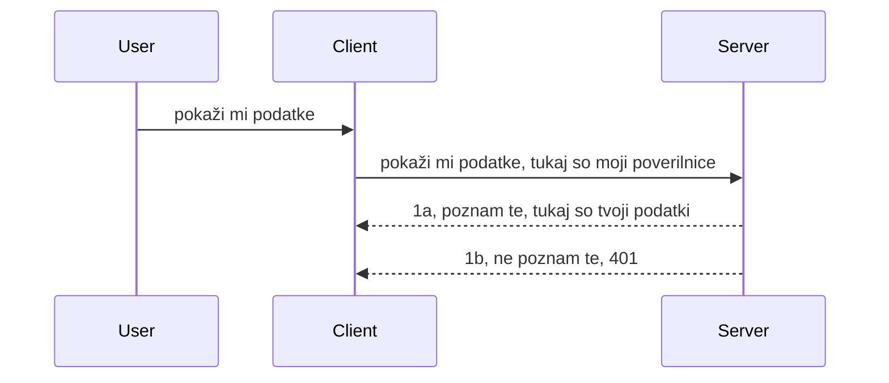

# Enostavna avtentikacija

MCP SDK-ji podpirajo uporabo OAuth 2.1, kar je pošteno rečeno precej zapleten proces, ki vključuje pojme, kot so avtentikacijski strežnik, strežnik virov, pošiljanje poverilnic, pridobitev kode, zamenjava kode za nosilec žeton, dokler končno ne dobite podatkov virov. Če niste vajeni OAuth, kar je odlična stvar za implementacijo, je dobro začeti z osnovno avtentikacijo in postopoma graditi na boljšo in boljšo varnost. Zato ta poglavje obstaja, da vas pripravi na bolj napredno avtentikacijo.

## Avtentikacija, kaj mislimo?

Avtentikacija je kratica za overjanje in avtorizacijo. Ideja je, da moramo narediti dve stvari:

- **Overjanje** (authentication), kar je proces ugotavljanja, ali dovolimo osebi vstopiti v naš dom, da ima pravico biti "tukaj", torej imeti dostop do našega strežnika virov, kjer živijo funkcije MCP strežnika.
- **Avtorizacija** (authorization), je proces ugotavljanja, ali bi moral uporabnik imeti dostop do teh specifičnih virov, za katere prosi, na primer do teh naročil ali teh izdelkov, ali pa sme brati vsebino, vendar ne brisati kot drugi primer.

## Poverilnice: kako sistemu povemo, kdo smo

Večina spletnih razvijalcev začne razmišljati o zagotavljanju poverilnic strežniku, običajno skrivnost, ki pove, ali imajo dovoljenje biti tukaj ("avtentikacija"). Te poverilnice so običajno osnovno64 kodirana različica uporabniškega imena in gesla ali API ključ, ki enolično identificira določenega uporabnika.

To vključuje pošiljanje preko glave imenovane "Authorization" (Avtentikacija) tako:

```json
{ "Authorization": "secret123" }
```

To se običajno imenuje osnovna avtentikacija. Kako potem deluje celoten tok, je naslednje:


Zdaj, ko razumemo, kako to deluje iz vidika toka, kako to implementiramo? Večina spletnih strežnikov ima pojem imenovan middleware, kos kode, ki teče kot del zahteve in lahko preveri poverilnice, ter če so poverilnice veljavne, dovolijo zahtevi prohod. Če zahteva nima veljavnih poverilnic, potem dobite napako avtorizacije. Poglejmo, kako to lahko implementiramo:

**Python**

```python
class AuthMiddleware(BaseHTTPMiddleware):
    async def dispatch(self, request, call_next):

        has_header = request.headers.get("Authorization")
        if not has_header:
            print("-> Missing Authorization header!")
            return Response(status_code=401, content="Unauthorized")

        if not valid_token(has_header):
            print("-> Invalid token!")
            return Response(status_code=403, content="Forbidden")

        print("Valid token, proceeding...")
       
        response = await call_next(request)
        # dodajte poljubne uporabniške glave ali na kakršen koli način spremenite odziv
        return response


starlette_app.add_middleware(CustomHeaderMiddleware)
```

Tukaj imamo:

- Ustvarjen middleware z imenom `AuthMiddleware`, kjer njegova metoda `dispatch` kliče spletni strežnik.
- Dodan middleware spletnemu strežniku:

    ```python
    starlette_app.add_middleware(AuthMiddleware)
    ```

- Napisan logiko za preverjanje, če je glava Authorization prisotna in ali je poslana skrivnost veljavna:

    ```python
    has_header = request.headers.get("Authorization")
    if not has_header:
        print("-> Missing Authorization header!")
        return Response(status_code=401, content="Unauthorized")

    if not valid_token(has_header):
        print("-> Invalid token!")
        return Response(status_code=403, content="Forbidden")
    ```

    če je skrivnost prisotna in veljavna, potem dovolimo zahtevi, da nadaljuje tako, da pokličemo `call_next` in vrnemo odgovor.

    ```python
    response = await call_next(request)
    # dodajte katerikoli uporabniški glavi ali na nek način spremenite odgovor
    return response
    ```

Deluje tako, da če se spletna zahteva pošlje strežniku, se middleware aktivira in glede na svojo implementacijo bodisi dovoli zahtevi prehod ali pa vrne napako, ki nakazuje, da stranki ni dovoljeno nadaljevati.

**TypeScript**

Tukaj ustvarimo middleware s priljubljenim ogrodjem Express in prestrežemo zahtevo, preden doseže MCP strežnik. Tukaj je koda za to:

```typescript
function isValid(secret) {
    return secret === "secret123";
}

app.use((req, res, next) => {
    // 1. Ali je prisoten Authorization header?
    if(!req.headers["Authorization"]) {
        res.status(401).send('Unauthorized');
    }
    
    let token = req.headers["Authorization"];

    // 2. Preveri veljavnost.
    if(!isValid(token)) {
        res.status(403).send('Forbidden');
    }

   
    console.log('Middleware executed');
    // 3. Povzroči, da zahteva preide na naslednji korak v procesu obdelave zahtevka.
    next();
});
```

V tej kodi:

1. Preverimo, če je glava Authorization prisotna, če ni, pošljemo napako 401.
2. Zagotovimo, da so poverilnice/žeton veljavni, če ne, pošljemo napako 403.
3. Nazadnje nadaljujemo zahtevo v poteku zahtev in jo vrnemo.

## Vaja: Implementirajmo avtentikacijo

Vzemimo naše znanje in ga poskusimo implementirati. Tukaj je načrt:

Strežnik

- Ustvarite spletni strežnik in MCP instanco.
- Implementirajte middleware za strežnik.

Odjemalec

- Pošljite spletno zahtevo z poverilnicami preko glave.

### -1- Ustvarite spletni strežnik in MCP instanco

V prvem koraku moramo ustvariti instanco spletnega strežnika in MCP strežnika.

**Python**

Tukaj ustvarimo MCP strežnik, nato ustvarimo spletno aplikacijo starlette in jo gostimo z uvicorn.

```python
# ustvarjanje MCP strežnika

app = FastMCP(
    name="MCP Resource Server",
    instructions="Resource Server that validates tokens via Authorization Server introspection",
    host=settings["host"],
    port=settings["port"],
    debug=True
)

# ustvarjanje web aplikacije starlette
starlette_app = app.streamable_http_app()

# streženje aplikacije preko uvicorn
async def run(starlette_app):
    import uvicorn
    config = uvicorn.Config(
            starlette_app,
            host=app.settings.host,
            port=app.settings.port,
            log_level=app.settings.log_level.lower(),
        )
    server = uvicorn.Server(config)
    await server.serve()

run(starlette_app)
```

V tej kodi:

- Ustvarimo MCP strežnik.
- Sestavimo spletno aplikacijo starlette iz MCP strežnika, `app.streamable_http_app()`.
- Gostimo in strežemo spletno aplikacijo z uvicorn `server.serve()`.

**TypeScript**

Tukaj ustvarimo MCP strežnik.

```typescript
const server = new McpServer({
      name: "example-server",
      version: "1.0.0"
    });

    // ... nastavite strežniške vire, orodja in pozive ...
```

To ustvarjanje MCP strežnika mora potekati znotraj definicije poti POST /mcp, zato vzemimo zgornjo kodo in jo premaknemo tako:

```typescript
import express from "express";
import { randomUUID } from "node:crypto";
import { McpServer } from "@modelcontextprotocol/sdk/server/mcp.js";
import { StreamableHTTPServerTransport } from "@modelcontextprotocol/sdk/server/streamableHttp.js";
import { isInitializeRequest } from "@modelcontextprotocol/sdk/types.js"

const app = express();
app.use(express.json());

// Zemljevid za shranjevanje transportov po ID-ju seje
const transports: { [sessionId: string]: StreamableHTTPServerTransport } = {};

// Obdelava POST zahtevkov za komunikacijo od odjemalca do strežnika
app.post('/mcp', async (req, res) => {
  // Preverite, ali obstaja ID seje
  const sessionId = req.headers['mcp-session-id'] as string | undefined;
  let transport: StreamableHTTPServerTransport;

  if (sessionId && transports[sessionId]) {
    // Ponovna uporaba obstoječega transporta
    transport = transports[sessionId];
  } else if (!sessionId && isInitializeRequest(req.body)) {
    // Nova zahteva za inicializacijo
    transport = new StreamableHTTPServerTransport({
      sessionIdGenerator: () => randomUUID(),
      onsessioninitialized: (sessionId) => {
        // Shranite transport po ID-ju seje
        transports[sessionId] = transport;
      },
      // Zaščita proti DNS rebindingu je privzeto onemogočena zaradi združljivosti z preteklimi različicami. Če poganjate ta strežnik
      // lokalno, poskrbite, da nastavite:
      // enableDnsRebindingProtection: true,
      // allowedHosts: ['127.0.0.1'],
    });

    // Počiščenje transporta, ko je zaprt
    transport.onclose = () => {
      if (transport.sessionId) {
        delete transports[transport.sessionId];
      }
    };
    const server = new McpServer({
      name: "example-server",
      version: "1.0.0"
    });

    // ... nastavite strežniške vire, orodja in pojave ...

    // Povežite se s strežnikom MCP
    await server.connect(transport);
  } else {
    // Neveljavna zahteva
    res.status(400).json({
      jsonrpc: '2.0',
      error: {
        code: -32000,
        message: 'Bad Request: No valid session ID provided',
      },
      id: null,
    });
    return;
  }

  // Obdelaj zahtevo
  await transport.handleRequest(req, res, req.body);
});

// Ponovno uporabljiv obdelovalec za GET in DELETE zahtevke
const handleSessionRequest = async (req: express.Request, res: express.Response) => {
  const sessionId = req.headers['mcp-session-id'] as string | undefined;
  if (!sessionId || !transports[sessionId]) {
    res.status(400).send('Invalid or missing session ID');
    return;
  }
  
  const transport = transports[sessionId];
  await transport.handleRequest(req, res);
};

// Obdelava GET zahtev za obvestila strežnika do odjemalca preko SSE
app.get('/mcp', handleSessionRequest);

// Obdelava DELETE zahtev za prekinitev seje
app.delete('/mcp', handleSessionRequest);

app.listen(3000);
```

Zdaj vidite, kako je bilo ustvarjanje MCP strežnika premaknjeno znotraj `app.post("/mcp")`.

Gremo k naslednjemu koraku ustvarjanja middleware, da lahko preverjamo prihajajoče poverilnice.

### -2- Implementirajte middleware za strežnik

Če pogledamo middleware del. Tukaj bomo ustvarili middleware, ki išče poverilnico v glavi `Authorization` in jo validira. Če je sprejemljiva, bo zahteva nadaljevala, da naredi potrebno (npr. seznam orodij, branje vira ali karkoli drugega, kar klient zahteva od MCP).

**Python**

Za ustvarjanje middleware moramo ustvariti razred, ki podeduje od `BaseHTTPMiddleware`. Obstajata dva zanimiva elementa:

- Zahteva `request`, iz katere beremo informacije iz glave.
- `call_next`, klic, ki ga moramo poklicati, če je poverilnica sprejemljiva.

Najprej moramo obravnavati primer, če glava `Authorization` manjka:

```python
has_header = request.headers.get("Authorization")

# glave ni prisotne, vrni napako 401, sicer nadaljuj.
if not has_header:
    print("-> Missing Authorization header!")
    return Response(status_code=401, content="Unauthorized")
```

Tukaj pošljemo sporočilo 401 nepooblaščen, ker odjemalec ni uspel pri avtentikaciji.

Naslednje, če je bila poverilnica poslana, preverimo njeno veljavnost takole:

```python
 if not valid_token(has_header):
    print("-> Invalid token!")
    return Response(status_code=403, content="Forbidden")
```

Opazite, da zgoraj pošljemo sporočilo 403 prepovedano. Tukaj je celoten middleware, ki implementira vse, kar smo omenili zgoraj:

```python
class AuthMiddleware(BaseHTTPMiddleware):
    async def dispatch(self, request, call_next):

        has_header = request.headers.get("Authorization")
        if not has_header:
            print("-> Missing Authorization header!")
            return Response(status_code=401, content="Unauthorized")

        if not valid_token(has_header):
            print("-> Invalid token!")
            return Response(status_code=403, content="Forbidden")

        print("Valid token, proceeding...")
        print(f"-> Received {request.method} {request.url}")
        response = await call_next(request)
        response.headers['Custom'] = 'Example'
        return response

```

Odlično, a kaj pa funkcija `valid_token`? Tukaj je:

```python
# NE uporabljajte za proizvodnjo - izboljšajte to !!
def valid_token(token: str) -> bool:
    # odstranite predpono "Bearer "
    if token.startswith("Bearer "):
        token = token[7:]
        return token == "secret-token"
    return False
```

To bi seveda morali izboljšati.

POMEMBNO: Nikoli ne smete imeti takšnih skrivnosti v kodi. Idealno je, da vrednost, s katero primerjate, pridobite iz podatkovnega vira ali od IDP (ponudnika identitete) ali še bolje, da IDP opravi validacijo.

**TypeScript**

Za implementacijo z Express morate poklicati metodo `use`, ki sprejme middleware funkcije.

Moramo:

- Interakcijo z zahtevami, da preverimo poslane poverilnice v lastnosti `Authorization`.
- Validirati poverilnice in če so veljavne, dovoliti nadaljevanje zahteve, da naredi, kar mora (npr. seznam orodij, branje vira ali karkoli drugega povezano z MCP).

Tukaj preverjamo, ali je glava `Authorization` prisotna in če ni, ustavimo zahtevo:

```typescript
if(!req.headers["authorization"]) {
    res.status(401).send('Unauthorized');
    return;
}
```

Če glava ni poslana, dobite napako 401.

Nato preverimo, ali so poverilnice veljavne, če ne, ponovno ustavimo zahtevo, vendar z malo drugačnim sporočilom:

```typescript
if(!isValid(token)) {
    res.status(403).send('Forbidden');
    return;
} 
```

Opazite, da dobite napako 403.

Tukaj je celotna koda:

```typescript
app.use((req, res, next) => {
    console.log('Request received:', req.method, req.url, req.headers);
    console.log('Headers:', req.headers["authorization"]);
    if(!req.headers["authorization"]) {
        res.status(401).send('Unauthorized');
        return;
    }
    
    let token = req.headers["authorization"];

    if(!isValid(token)) {
        res.status(403).send('Forbidden');
        return;
    }  

    console.log('Middleware executed');
    next();
});
```

Pripravili smo spletni strežnik, ki sprejema middleware za preverjanje poverilnic, ki jih upamo, da nam jih stranka pošlje. Kaj pa sam odjemalec?

### -3- Pošlji spletno zahtevo s poverilnicami preko glave

Moramo zagotoviti, da odjemalec posreduje poverilnice skozi glavo. Ker bomo uporabljali MCP odjemalca, moramo ugotoviti, kako se to naredi.

**Python**

Za odjemalca moramo poslati glavo z našo poverilnico tako:

```python
# NE zakodirajte vrednosti na trdo, vsaj shranite jo v okoljsko spremenljivko ali varnejšo shrambo
token = "secret-token"

async with streamablehttp_client(
        url = f"http://localhost:{port}/mcp",
        headers = {"Authorization": f"Bearer {token}"}
    ) as (
        read_stream,
        write_stream,
        session_callback,
    ):
        async with ClientSession(
            read_stream,
            write_stream
        ) as session:
            await session.initialize()
      
            # TODO, kaj želite narediti na odjemalcu, npr. seznam orodij, klic orodij itd.
```

Opazite, kako napolnimo lastnost `headers`, kot je `headers = {"Authorization": f"Bearer {token}"}`.

**TypeScript**

Lahko to rešimo v dveh korakih:

1. Napolnimo konfiguracijski objekt z našimi poverilnicami.
2. Posredujemo konfiguracijski objekt transportu.

```typescript

// NE trdo kodirajte vrednosti, kot je prikazano tukaj. Najmanj je naj bo kot okoljska spremenljivka in uporabite nekaj, kot je dotenv (v razvojnem načinu).
let token = "secret123"

// definirajte objekt možnosti za odjemalski transport
let options: StreamableHTTPClientTransportOptions = {
  sessionId: sessionId,
  requestInit: {
    headers: {
      "Authorization": "secret123"
    }
  }
};

// posredujte objekt možnosti transportu
async function main() {
   const transport = new StreamableHTTPClientTransport(
      new URL(serverUrl),
      options
   );
```

Tukaj zgoraj vidite, kako smo ustvarili objekt `options` in postavili glave v lastnost `requestInit`.

POMEMBNO: Kako lahko to izboljšamo? Trenutna implementacija ima nekaj težav. Najprej, pošiljanje poverilnic na tak način je precej tvegano, razen če imate vsaj HTTPS. Tudi takrat je poverilnica lahko ukradena, zato potrebujete sistem, kjer lahko enostavno prekličete žeton in dodate dodatne preverjanja, kot je od kod izvira, ali se zahteva pošilja prepogosto (obnašanje bota) in podobno. Obstaja namreč cela vrsta pomislekov.

Je pa res, da je to dober začetek za zelo preproste API-je, kjer ne želite, da kdorkoli kliče vaš API brez avtentikacije.

S tem v mislih poskušajmo še nekoliko okrepiti varnost z uporabo standardiziranega formata kot je JSON Web Token, znan tudi kot JWT ali "JOT" žetoni.

## JSON Web Tokeni (JWT)

Poskušamo izboljšati stvari od pošiljanja zelo preprostih poverilnic. Kakšna so takojšnja izboljšanja z uporabo JWT?

- **Izboljšave varnosti**. Pri osnovni avtentikaciji vedno pošljete uporabniško ime in geslo kot base64 kodiran žeton (ali API ključ), kar povečuje tveganje. Pri JWT pošljete uporabniško ime in geslo in dobite žeton v zameno, ki je časovno omejen in bo potekel. JWT omogoča enostavno uporabo nadzora dostopa z natančnimi pravicami preko vlog, obsegov in dovoljenj.
- **Brezstanje in skalabilnost**. JWT-ji so samostojni, nosijo vse uporabniške informacije in odpravijo potrebo po strežniškem shranjevanju sej. Žeton je mogoče tudi lokalno validirati.
- **Medsebojna združljivost in federacija**. JWT je osrednji del Open ID Connecta in uporablja znane ponudnike identitete, kot so Entra ID, Google Identity in Auth0. Omogoča enotno prijavo in še več, ter je primeren za poslovno uporabo.
- **Modularnost in prilagodljivost**. JWT-je je mogoče uporabiti z API prehodi, kot so Azure API Management, NGINX in drugi. Podpira uporabniške scenarije avtentikacije in komunikacijo strežnik-storitev vključno z osebno predstavitvijo in pooblastili.
- **Zmogljivost in predpomnjenje**. JWT-je je mogoče predpomniti po dekodiranju, kar zmanjša potrebo po parsiranju. To je posebej koristno pri aplikacijah z veliko prometa, saj izboljša zmogljivost in zmanjša obremenitev infrastrukture.
- **Napredne funkcije**. Podpira introspekcijo (preverjanje veljavnosti na strežniku) in preklic (onemogočanje žetonov).

Z vsemi temi prednostmi poglejmo, kako lahko nadgradimo našo implementacijo.

## Sprememba osnovne avtentikacije v JWT

Tako, spremembe na visoki ravni so:

- **Naučiti se sestaviti JWT žeton** in ga pripraviti za pošiljanje od odjemalca do strežnika.
- **Validirati JWT žeton** in če je veljaven, omogočiti dostop do virov.
- **Varnostno shranjevanje žetonov**. Kako ta žeton shranjujemo.
- **Zaščita poti**. Moramo zaščititi poti, v našem primeru zaščititi poti in specifične MCP funkcionalnosti.
- **Dodajanje osvežitvenih žetonov**. Zagotoviti moramo kratkožive žetone in dolgoročne osvežitvene žetone, ki se lahko uporabijo za pridobitev novih, če potečejo. Zagotoviti moramo tudi osvežitveno končno točko in strategijo rotacije.

### -1- Sestavite JWT žeton

JWT žeton ima naslednje dele:

- **glava (header)**, uporabljeni algoritem in tip žetona.
- **telo (payload)**, trditve, kot je sub (uporabnik ali entiteta, ki jo žeton predstavlja, običajno ID uporabnika), exp (potek), role (vloga)
- **podpis (signature)**, podpisan s skrivnostjo ali zasebnim ključem.

Za to moramo sestaviti glavo, telo in kodiran žeton.

**Python**

```python

import jwt
import jwt
from jwt.exceptions import ExpiredSignatureError, InvalidTokenError
import datetime

# Skrivni ključ, uporabljen za podpisovanje JWT
secret_key = 'your-secret-key'

header = {
    "alg": "HS256",
    "typ": "JWT"
}

# informacije o uporabniku in njegove trditve ter čas poteka
payload = {
    "sub": "1234567890",               # Zadeva (ID uporabnika)
    "name": "User Userson",                # Prilagojena trditev
    "admin": True,                     # Prilagojena trditev
    "iat": datetime.datetime.utcnow(),# Čas izdaje
    "exp": datetime.datetime.utcnow() + datetime.timedelta(hours=1)  # Potek
}

# kodiraj to
encoded_jwt = jwt.encode(payload, secret_key, algorithm="HS256", headers=header)
```

V zgornji kodi smo:

- Določili glavo z algoritmom HS256 in tipom JWT.
- Sestavili telo, ki vsebuje zadevo ali uporabniški ID, uporabniško ime, vlogo, kdaj je bil izdan in kdaj poteče, s čimer implementira časovno omejitev, kot smo omenili.

**TypeScript**

Tu bomo potrebovali nekaj odvisnosti, ki nam pomagajo sestaviti JWT žeton.

Odvisnosti

```sh

npm install jsonwebtoken
npm install --save-dev @types/jsonwebtoken
```

Zdaj, ko imamo to, ustvarimo glavo, telo in skozi to ustvarimo kodiran žeton.

```typescript
import jwt from 'jsonwebtoken';

const secretKey = 'your-secret-key'; // Uporabi okoljske spremenljivke v produkciji

// Določi vsebino
const payload = {
  sub: '1234567890',
  name: 'User usersson',
  admin: true,
  iat: Math.floor(Date.now() / 1000), // Izdan ob
  exp: Math.floor(Date.now() / 1000) + 60 * 60 // Poteče čez 1 uro
};

// Določi glavo (neobvezno, jsonwebtoken nastavi privzete vrednosti)
const header = {
  alg: 'HS256',
  typ: 'JWT'
};

// Ustvari žeton
const token = jwt.sign(payload, secretKey, {
  algorithm: 'HS256',
  header: header
});

console.log('JWT:', token);
```

Ta žeton je:

Podpisan z uporabo HS256
Veljaven 1 uro
Vsebuje trditve, kot so sub, name, admin, iat in exp.

### -2- Validirajte žeton

Potrebno bo tudi validirati žeton, to naj bi delali na strežniku, da zagotovimo, da je tisto, kar stranka pošilja, dejansko veljavno. Opraviti je treba številne preglede od validacije strukture do veljavnosti. Spodbujeni ste tudi, da dodate dodatne preglede, da zagotovite, ali je uporabnik v vašem sistemu in več.

Za validacijo žetona ga moramo dekodirati, da ga preberemo in nato začnemo preverjati veljavnost:

**Python**

```python

# Dekodiraj in preveri JWT
try:
    decoded = jwt.decode(token, secret_key, algorithms=["HS256"])
    print("✅ Token is valid.")
    print("Decoded claims:")
    for key, value in decoded.items():
        print(f"  {key}: {value}")
except ExpiredSignatureError:
    print("❌ Token has expired.")
except InvalidTokenError as e:
    print(f"❌ Invalid token: {e}")

```

V tej kodi kliče `jwt.decode` z žetonom, skrivnim ključem in izbranim algoritmom kot vhod. Vidite, da uporabljamo konstrukcijo try-catch, saj neuspešna validacija sproži izjemo.

**TypeScript**

Tukaj je treba poklicati `jwt.verify`, da dobimo dekodirano različico žetona, ki jo lahko nadalje analiziramo. Če ta klic ne uspe, pomeni, da je struktura žetona napačna ali ni več veljavna.

```typescript

try {
  const decoded = jwt.verify(token, secretKey);
  console.log('Decoded Payload:', decoded);
} catch (err) {
  console.error('Token verification failed:', err);
}
```

OPOMBA: kot smo že omenili, bi morali opraviti dodatne preglede, da zagotovite, da ta žeton kaže na uporabnika v vašem sistemu in da ima uporabnik pravice, ki jih trdi, da jih ima.

Nato poglejmo nadzor dostopa, temelječ na vlogah, znan tudi kot RBAC.
## Dodajanje nadzora dostopa na podlagi vlog

Ideja je, da želimo izraziti, da imajo različne vloge različne pravice. Na primer, domnevamo, da lahko admin naredi vse, navaden uporabnik lahko bere/piše, gost pa lahko samo bere. Zato so tukaj možne ravni dovoljenj:

- Admin.Write 
- User.Read
- Guest.Read

Poglejmo, kako lahko tak nadzor izvedemo z vmesnim programom (middleware). Vmesne programe je mogoče dodati za posamezno pot pa tudi za vse poti.

**Python**

```python
from starlette.middleware.base import BaseHTTPMiddleware
from starlette.responses import JSONResponse
import jwt

# NE imejte skrivnosti v kodi, kot je ta, to je samo za demonstracijske namene. Preberite jo iz varnega mesta.
SECRET_KEY = "your-secret-key" # dajte to v okoljsko spremenljivko
REQUIRED_PERMISSION = "User.Read"

class JWTPermissionMiddleware(BaseHTTPMiddleware):
    async def dispatch(self, request, call_next):
        auth_header = request.headers.get("Authorization")
        if not auth_header or not auth_header.startswith("Bearer "):
            return JSONResponse({"error": "Missing or invalid Authorization header"}, status_code=401)

        token = auth_header.split(" ")[1]
        try:
            decoded = jwt.decode(token, SECRET_KEY, algorithms=["HS256"])
        except jwt.ExpiredSignatureError:
            return JSONResponse({"error": "Token expired"}, status_code=401)
        except jwt.InvalidTokenError:
            return JSONResponse({"error": "Invalid token"}, status_code=401)

        permissions = decoded.get("permissions", [])
        if REQUIRED_PERMISSION not in permissions:
            return JSONResponse({"error": "Permission denied"}, status_code=403)

        request.state.user = decoded
        return await call_next(request)


```

Obstaja nekaj različnih načinov, kako dodati vmesni program, na primer spodaj:

```python

# Alt 1: dodajte middleware med konstrukcijo starlette aplikacije
middleware = [
    Middleware(JWTPermissionMiddleware)
]

app = Starlette(routes=routes, middleware=middleware)

# Alt 2: dodajte middleware po tem, ko je starlette aplikacija že konstruirana
starlette_app.add_middleware(JWTPermissionMiddleware)

# Alt 3: dodajte middleware za vsako pot posebej
routes = [
    Route(
        "/mcp",
        endpoint=..., # upravljalec
        middleware=[Middleware(JWTPermissionMiddleware)]
    )
]
```

**TypeScript**

Lahko uporabimo `app.use` in vmesni program, ki bo tekel za vse zahtevke.

```typescript
app.use((req, res, next) => {
    console.log('Request received:', req.method, req.url, req.headers);
    console.log('Headers:', req.headers["authorization"]);

    // 1. Preverite, ali je bil poslan avtentikacijski naslov

    if(!req.headers["authorization"]) {
        res.status(401).send('Unauthorized');
        return;
    }
    
    let token = req.headers["authorization"];

    // 2. Preverite, ali je žeton veljaven
    if(!isValid(token)) {
        res.status(403).send('Forbidden');
        return;
    }  

    // 3. Preverite, ali uporabnik žetona obstaja v našem sistemu
    if(!isExistingUser(token)) {
        res.status(403).send('Forbidden');
        console.log("User does not exist");
        return;
    }
    console.log("User exists");

    // 4. Preverite, ali ima žeton ustrezna dovoljenja
    if(!hasScopes(token, ["User.Read"])){
        res.status(403).send('Forbidden - insufficient scopes');
    }

    console.log("User has required scopes");

    console.log('Middleware executed');
    next();
});

```

Obstaja kar nekaj stvari, ki jih lahko in KI jih NAJ bi naš vmesni program počel, in sicer:

1. Preveri, če je prisoten avtentikacijski header
2. Preveri, če je token veljaven, pokličemo `isValid`, ki je metoda, ki smo jo napisali in preverja integriteto in veljavnost JWT tokena.
3. Preveri, če uporabnik obstaja v našem sistemu, to bi morali preveriti.

   ```typescript
    // uporabniki v podatkovni bazi
   const users = [
     "user1",
     "User usersson",
   ]

   function isExistingUser(token) {
     let decodedToken = verifyToken(token);

     // TODO, preveri, če uporabnik obstaja v podatkovni bazi
     return users.includes(decodedToken?.name || "");
   }
   ```

   Zgoraj smo ustvarili zelo preprost seznam `users`, ki bi moral biti seveda v bazi podatkov.

4. Poleg tega bi morali tudi preveriti, ali ima token ustrezna dovoljenja.

   ```typescript
   if(!hasScopes(token, ["User.Read"])){
        res.status(403).send('Forbidden - insufficient scopes');
   }
   ```

   V zgornji kodi iz vmesnega programa preverimo, da token vsebuje dovoljenje User.Read, če ne, vrnemo napako 403. Spodaj je metoda pomoči `hasScopes`.

   ```typescript
   function hasScopes(scope: string, requiredScopes: string[]) {
     let decodedToken = verifyToken(scope);
    return requiredScopes.every(scope => decodedToken?.scopes.includes(scope));
  }
   ```

Have a think which additional checks you should be doing, but these are the absolute minimum of checks you should be doing.

Using Express as a web framework is a common choice. There are helpers library when you use JWT so you can write less code.

- `express-jwt`, helper library that provides a middleware that helps decode your token.
- `express-jwt-permissions`, this provides a middleware `guard` that helps check if a certain permission is on the token.

Here's what these libraries can look like when used:

```typescript
const express = require('express');
const jwt = require('express-jwt');
const guard = require('express-jwt-permissions')();

const app = express();
const secretKey = 'your-secret-key'; // put this in env variable

// Decode JWT and attach to req.user
app.use(jwt({ secret: secretKey, algorithms: ['HS256'] }));

// Check for User.Read permission
app.use(guard.check('User.Read'));

// multiple permissions
// app.use(guard.check(['User.Read', 'Admin.Access']));

app.get('/protected', (req, res) => {
  res.json({ message: `Welcome ${req.user.name}` });
});

// Error handler
app.use((err, req, res, next) => {
  if (err.code === 'permission_denied') {
    return res.status(403).send('Forbidden');
  }
  next(err);
});

```

Zdaj ste videli, kako lahko vmesni program uporabimo za avtentikacijo in avtorizacijo, kako pa je z MCP? Ali to spremeni način, kako izvajamo avtentikacijo? Poglejmo v naslednjem razdelku.

### -3- Dodajanje RBAC v MCP

Do zdaj ste videli, kako lahko dodate RBAC preko vmesnega programa, vendar za MCP ni enostavnega načina za dodajanje RBAC na raven posamezne funkcije MCP, kaj storimo? Enostavno moramo dodati kodo, ki v tem primeru preverja, ali ima odjemalec pravice za klic določenega orodja:

Imate nekaj različnih možnosti, kako izvesti RBAC na raven funkcije, tukaj je nekaj:

- Dodajte preverjanje za vsako orodje, vir, poziv, kjer morate preveriti raven dovoljenj.

   **python**

   ```python
   @tool()
   def delete_product(id: int):
      try:
          check_permissions(role="Admin.Write", request)
      catch:
        pass # odjemalec ni uspel z avtentikacijo, sproži napako avtentikacije
   ```

   **typescript**

   ```typescript
   server.registerTool(
    "delete-product",
    {
      title: Delete a product",
      description: "Deletes a product",
      inputSchema: { id: z.number() }
    },
    async ({ id }) => {
      
      try {
        checkPermissions("Admin.Write", request);
        // naredi, pošlji ID v productService in oddaljeno vstopno točko
      } catch(Exception e) {
        console.log("Authorization error, you're not allowed");  
      }

      return {
        content: [{ type: "text", text: `Deletected product with id ${id}` }]
      };
    }
   );
   ```


- Uporabite napredno strežniško pristop in ročnike zahtev, da zmanjšate število mest, kjer morate narediti preverjanje.

   **Python**

   ```python
   
   tool_permission = {
      "create_product": ["User.Write", "Admin.Write"],
      "delete_product": ["Admin.Write"]
   }

   def has_permission(user_permissions, required_permissions) -> bool:
      # user_permissions: seznam dovoljenj, ki jih ima uporabnik
      # required_permissions: seznam dovoljenj, potrebnih za orodje
      return any(perm in user_permissions for perm in required_permissions)

   @server.call_tool()
   async def handle_call_tool(
     name: str, arguments: dict[str, str] | None
   ) -> list[types.TextContent]:
    # Predpostavimo, da je request.user.permissions seznam dovoljenj za uporabnika
     user_permissions = request.user.permissions
     required_permissions = tool_permission.get(name, [])
     if not has_permission(user_permissions, required_permissions):
        # Povzroči napako "Nimate dovoljenja za klic orodja {name}"
        raise Exception(f"You don't have permission to call tool {name}")
     # nadaljuj in pokliči orodje
     # ...
   ```   
   

   **TypeScript**

   ```typescript
   function hasPermission(userPermissions: string[], requiredPermissions: string[]): boolean {
       if (!Array.isArray(userPermissions) || !Array.isArray(requiredPermissions)) return false;
       // Vrni true, če ima uporabnik vsaj eno zahtevano dovoljenje
       
       return requiredPermissions.some(perm => userPermissions.includes(perm));
   }
  
   server.setRequestHandler(CallToolRequestSchema, async (request) => {
      const { params: { name } } = request;
  
      let permissions = request.user.permissions;
  
      if (!hasPermission(permissions, toolPermissions[name])) {
         return new Error(`You don't have permission to call ${name}`);
      }
  
      // nadaljuj..
   });
   ```

   Opomba, morali boste zagotoviti, da vaš vmesni program dodeli dekodiran token v lastnost user zahteve, da je zgornja koda preprosta.

### Povzetek

Zdaj, ko smo razpravljali, kako splošno dodati podporo za RBAC in posebej za MCP, je čas, da poskusite sami implementirati varnost, da zagotovite, da ste razumeli predstavljene koncepte.

## Naloga 1: Zgradite MCP strežnik in MCP odjemalca z osnovno avtentikacijo

Tukaj boste uporabili to, kar ste se naučili o pošiljanju poverilnic preko headerjev.

## Rešitev 1

[Rešitev 1](./code/basic/README.md)

## Naloga 2: Nadgradnja rešitve iz Naloge 1 z uporabo JWT

Vzemite prvo rešitev, a tokrat jo izboljšajte.

Namesto uporabe Basic Auth uporabite JWT.

## Rešitev 2

[Rešitev 2](./solution/jwt-solution/README.md)

## Izziv

Dodajte RBAC na raven orodja, kot smo opisali v razdelku "Dodajanje RBAC v MCP".

## Povzetek

Upamo, da ste v tem poglavju veliko izvedeli, od popolne odsotnosti varnosti, preko osnovne varnosti, do JWT in kako ga dodati v MCP.

Zgradili smo trdno osnovo z lastnimi JWT, vendar se ob rasti premikamo proti identitetnemu modelu, temelječemu na standardih. Sprejemanje IdP kot sta Entra ali Keycloak nam omogoča, da prenesemo izdajo, preverjanje in upravljanje življenjskega cikla tokenov na zaupanja vreden sistem — kar nam omogoča, da se osredotočimo na logiko aplikacije in uporabniško izkušnjo.

Za to imamo bolj [napredno poglavje o Entra](../../05-AdvancedTopics/mcp-security-entra/README.md)

## Kaj sledi

- Naslednje: [Nastavitev MCP gostiteljev](../12-mcp-hosts/README.md)

---

<!-- CO-OP TRANSLATOR DISCLAIMER START -->
**Izjava o omejitvi odgovornosti**:
Ta dokument je bil preveden z uporabo AI prevajalske storitve [Co-op Translator](https://github.com/Azure/co-op-translator). Čeprav si prizadevamo za natančnost, bodite pozorni, da lahko avtomatizirani prevodi vsebujejo napake ali netočnosti. Izvirni dokument v svojem domačem jeziku velja za avtoritativni vir. Za ključne informacije je priporočljiv profesionalni človeški prevod. Nismo odgovorni za kakršnakoli nesporazume ali napačne interpretacije, ki izhajajo iz uporabe tega prevoda.
<!-- CO-OP TRANSLATOR DISCLAIMER END -->