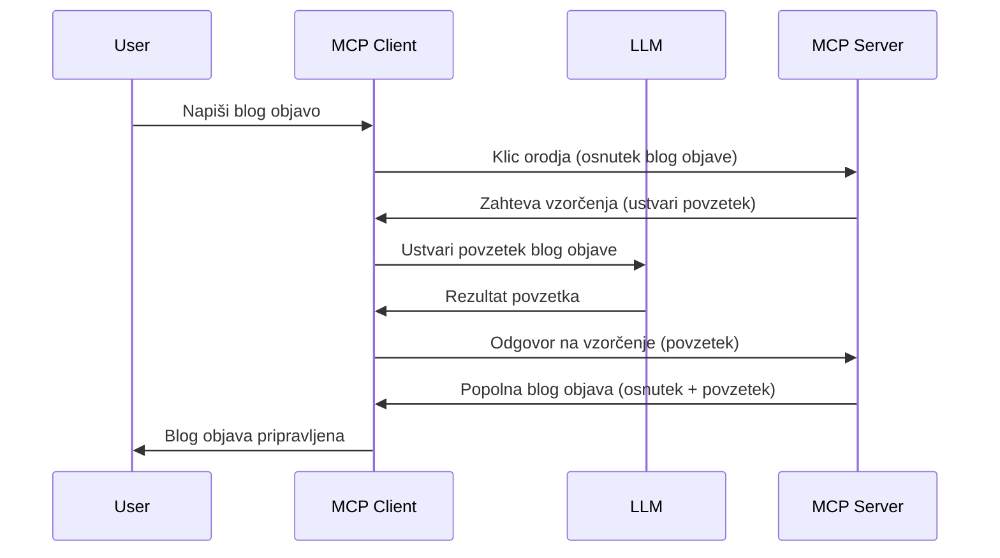

# Vzorcevanje - delegiranje funkcij odjemalcu

Včasih je potrebno, da MCP odjemalec in MCP strežnik sodelujeta za dosego skupnega cilja. Lahko imate primer, ko strežnik potrebuje pomoč LLM, ki se nahaja na odjemalcu. V takšni situaciji je vzorcevanje tisto, kar bi morali uporabiti.

Raziščimo nekaj primerov uporabe in kako zgraditi rešitev, ki vključuje vzorcevanje.

## Pregled

V tem poglavju se osredotočamo na razlago, kdaj in kje uporabiti vzorcevanje ter kako ga konfigurirati.

## Cilji učenja

V tem poglavju bomo:

- Razložili, kaj je vzorcevanje in kdaj ga uporabiti.
- Pokažemo, kako konfigurirati vzorcevanje v MCP.
- Podali primere vzorcevanja v praksi.

## Kaj je vzorcevanje in zakaj ga uporabiti?

Vzorcevanje je napredna funkcija, ki deluje na naslednji način:


### Zahteva za vzorcevanje

Ok, zdaj imamo širok pregled verodostojnega scenarija, pogovorimo se o zahtevi za vzorcevanje, ki jo strežnik pošlje odjemalcu. Tako lahko izgleda taka zahteva v formatu JSON-RPC:

```json
{
  "jsonrpc": "2.0",
  "id": 1,
  "method": "sampling/createMessage",
  "params": {
    "messages": [
      {
        "role": "user",
        "content": {
          "type": "text",
          "text": "Create a blog post summary of the following blog post: <BLOG POST>"
        }
      }
    ],
    "modelPreferences": {
      "hints": [
        {
          "name": "claude-3-sonnet"
        }
      ],
      "intelligencePriority": 0.8,
      "speedPriority": 0.5
    },
    "systemPrompt": "You are a helpful assistant.",
    "maxTokens": 100
  }
}
```

Tu je nekaj stvari vrednih poudarka:

- Poziv, pod content -> text, je naš poziv, ki je navodilo za LLM, da povzame vsebino blog članka.

- **modelPreferences**. Ta razdelek je pravzaprav želja, priporočilo, katero konfiguracijo uporabiti z LLM. Uporabnik lahko izbere, ali bo sledil tem priporočilom ali jih spremenil. V tem primeru so priporočila glede modela, hitrosti in prioritete inteligence.  
- **systemPrompt**, to je vaš običajen sistemski poziv, ki daje LLM osebnost in vsebuje navodila.
- **maxTokens**, to je še ena lastnost, ki določa, koliko tokenov je priporočeno uporabiti za to nalogo.

### Odgovor na vzorcevanje

Ta odgovor je tisti, ki ga MCP odjemalec nazaj pošlje MCP strežniku in je rezultat klica LLM, čakanja na odgovor ter nato sestave tega sporočila. Tako lahko izgleda v JSON-RPC formatu:

```json
{
  "jsonrpc": "2.0",
  "id": 1,
  "result": {
    "role": "assistant",
    "content": {
      "type": "text",
      "text": "Here's your abstract <ABSTRACT>"
    },
    "model": "gpt-5",
    "stopReason": "endTurn"
  }
}
```

Opazite, da je odgovor povzetek blog članka, tako kot smo zahtevali. Prav tako opazite, da uporabljen `model` ni tisti, ki smo ga zahtevali, ampak "gpt-5" namesto "claude-3-sonnet". To ilustrira, da lahko uporabnik spremeni mnenje o uporabi modela in da je vaša zahteva za vzorcevanje le priporočilo.

Ok, zdaj ko razumemo glavni potek in uporabno nalogo za "ustvarjanje blog objave + povzetka", poglejmo, kaj moramo storiti, da to deluje.

### Vrste sporočil

Vzorcevalna sporočila niso omejena samo na besedilo, lahko pošljete tudi slike in zvok. Tako se JSON-RPC razlikuje:

**Besedilo**

```json
{
  "type": "text",
  "text": "The message content"
}
```

**Vsebina slike**

```json
{
  "type": "image",
  "data": "base64-encoded-image-data",
  "mimeType": "image/jpeg"
}
```

**Vsebina zvoka**

```json
{
  "type": "audio",
  "data": "base64-encoded-audio-data",
  "mimeType": "audio/wav"
}
```

> OPOMBA: za podrobnejše informacije o vzorcevanju si oglejte [uradne dokumente](https://modelcontextprotocol.io/specification/2025-06-18/client/sampling)

## Kako konfigurirati vzorcevanje v odjemalcu

> Opomba: če gradite samo strežnik, tu ni potrebno veliko.

V odjemalcu morate določiti naslednjo funkcijo tako:

```json
{
  "capabilities": {
    "sampling": {}
  }
}
```

To bo nato zaznano, ko vaš izbrani odjemalec vzpostavi povezavo s strežnikom.

## Primer vzorcevanja v praksi - ustvarjanje blog objave

Napišimo skupaj vzorcevalni strežnik, potrebovali bomo naslednje:

1. Ustvariti orodje na strežniku.
1. To orodje naj ustvari zahtevo za vzorcevanje.
1. Orodje naj počaka na odgovor na zahtevo odjemalca.
1. Nato naj orodje vrne rezultat.

Poglejmo kodo korak za korakom:

### -1- Ustvari orodje

**python**

```python
@mcp.tool()
async def create_blog(title: str, content: str, ctx: Context[ServerSession, None]) -> str:
    """Create a blog post and generate a summary"""

```

### -2- Ustvari zahtevo za vzorcevanje

Razširite orodje z naslednjo kodo:

**python**

```python
post = BlogPost(
        id=len(posts) + 1,
        title=title,
        content=content,
        abstract=""
    )

prompt = f"Create an abstract of the following blog post: title: {title} and draft: {content} "

result = await ctx.session.create_message(
        messages=[
            SamplingMessage(
                role="user",
                content=TextContent(type="text", text=prompt),
            )
        ],
        max_tokens=100,
)

```

### -3- Počakajte na odgovor in ga vrnite

**python**

```python
post.abstract = result.content.text

posts.append(post)

# vrni končni izdelek
return json.dumps({
    "id": post.title,
    "abstract": post.abstract
})
```

### -4- Celotna koda

**python**

```python
from starlette.applications import Starlette
from starlette.routing import Mount, Host

from mcp.server.fastmcp import Context, FastMCP

from mcp.server.session import ServerSession
from mcp.types import SamplingMessage, TextContent

import json


from uuid import uuid4
from typing import List
from pydantic import BaseModel


mcp = FastMCP("Blog post generator")

# app = FastAPI()

posts = []

class BlogPost(BaseModel):
    id: int
    title: str
    content: str
    abstract: str

posts: List[BlogPost] = []

@mcp.tool()
async def create_blog(title: str, content: str, ctx: Context[ServerSession, None]) -> str:
    """Create a blog post and generate a summary"""

    post = BlogPost(
        id=len(posts) + 1,
        title=title,
        content=content,
        abstract=""
    )

    prompt = f"Create an abstract of the following blog post: title: {title} and draft: {content} "

    result = await ctx.session.create_message(
        messages=[
            SamplingMessage(
                role="user",
                content=TextContent(type="text", text=prompt),
            )
        ],
        max_tokens=100,
    )

    post.abstract = result.content.text

    posts.append(post)

    # vrni celoten blog zapis
    return json.dumps({
        "id": post.title,
        "abstract": post.abstract
    })

if __name__ == "__main__":
    print("Starting server...")
    # mcp.run()
    mcp.run(transport="streamable-http")

# zaženite aplikacijo z ukazom: python server.py
```

### -5- Testiranje v Visual Studio Code

Za testiranje v Visual Studio Code storite naslednje:

1. Zaženite strežnik v terminalu
1. Dodajte ga v *mcp.json* (in poskrbite, da je zagnan), nekaj takšnega:

   ```json
   "servers": {
      "blog-server": {
        "type": "http",
        "url": "http://localhost:8000/mcp"
      }
   }
   ```

1. Vnesite poziv:

   ```text
   create a blog post named "Where Python comes from", the content is "Python is actually named after Monty Python Flying Circus"
   ```

1. Dovolite vzorcevanje. Ob prvem testiranju boste prejeli dodatno pogovorno okno, ki ga morate sprejeti, nato boste videli običajno okno za zagon orodja.

1. Preglejte rezultate. Rezultate boste videli lepo izpisane v GitHub Copilot Chat, lahko pa tudi pregledate neobdelan JSON odgovor.

**Bonus**. Orodja Visual Studio Code zelo dobro podpirajo vzorcevanje. Vzorcevalni dostop za vaš nameščeni strežnik lahko konfigurirate tako:

1. Pojdite v razdelek razširitev.
1. Izberite ikonico zobnika za vaš nameščeni strežnik v razdelku "MCP SERVERS - INSTALLED".
1. Izberite "Configure Model Access", tukaj lahko izberete, katere modele sme GitHub Copilot uporabiti pri vzorcevanju. Prav tako si lahko ogledate vse nedavne zahteve za vzorcevanje s klikom na "Show Sampling requests".

## Naloga

V tej nalogi boste ustvarili nekoliko drugačno vzorcevanje, in sicer integracijo vzorcevanja, ki podpira generiranje opisa izdelka. Tukaj je vaš scenarij:

**Scenarij**: Delavec v back office e-trgovine potrebuje pomoč, saj prevaja veliko časa ustvarjanje opisov izdelkov. Zato morate zgraditi rešitev, kjer lahko pokličete orodje "create_product" z argumentoma "title" in "keywords", in naj ustvari popoln izdelek, ki vsebuje polje "description", ki naj ga napolni LLM odjemalca.

NAMIG: uporabite prej pridobljeno znanje za konstrukcijo tega strežnika in njegovega orodja z uporabo zahteve za vzorcevanje.

## Rešitev

[Rešitev](./solution/README.md)

## Ključni poudarki

Vzorcevanje je močna funkcija, ki omogoča strežniku, da delegira naloge odjemalcu, ko potrebuje pomoč LLM.

## Kaj sledi

- [Poglavje 4 - Praktična izvedba](../../04-PracticalImplementation/README.md)

---

<!-- CO-OP TRANSLATOR DISCLAIMER START -->
**Omejitev odgovornosti**:
Ta dokument je bil preveden s pomočjo AI prevajalske storitve [Co-op Translator](https://github.com/Azure/co-op-translator). Čeprav si prizadevamo za natančnost, vas prosimo, da upoštevate, da avtomatizirani prevodi lahko vsebujejo napake ali netočnosti. Izvirni dokument v njegovem izvirnem jeziku velja za avtoritativni vir. Za ključne informacije je priporočljivo uporabiti strokovni človeški prevod. Nismo odgovorni za morebitne nesporazume ali napačne interpretacije, ki bi izhajale iz uporabe tega prevoda.
<!-- CO-OP TRANSLATOR DISCLAIMER END -->