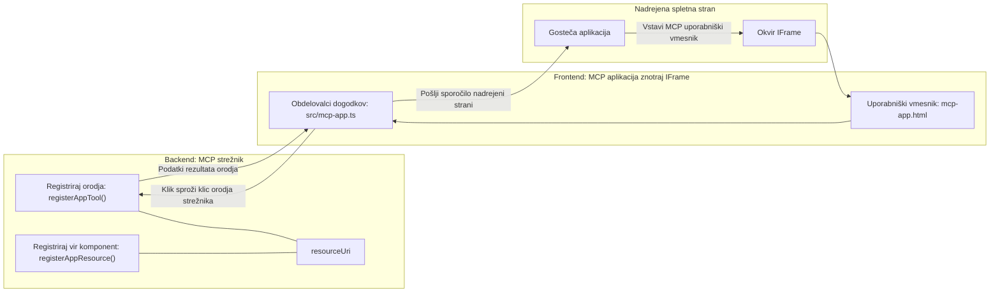

# MCP Aplikacije

MCP Aplikacije so nov pristop v MCP. Ideja je, da ne odgovarjate samo z vrnjenimi podatki iz orodja, ampak tudi zagotovite informacije o tem, kako naj se s temi informacijami upravlja. To pomeni, da lahko rezultati orodij zdaj vsebujejo informacije o uporabniškem vmesniku (UI). Zakaj bi to hoteli? No, pomislite, kako stvari počnete danes. Verjetno uporabljate rezultate MCP Strežnika tako, da pred njega postavite neko vrsto sprednjega dela, to je koda, ki jo morate napisati in vzdrževati. Včasih je to tisto, kar želite, drugič pa bi bilo odlično, če bi lahko preprosto vključili samostojen kos informacij, ki vsebuje vse – od podatkov do uporabniškega vmesnika.

## Pregled

Ta lekcija ponuja praktična navodila o MCP Aplikacijah, kako začeti z njimi in kako jih integrirati v vaše obstoječe spletne aplikacije. MCP Aplikacije so zelo nova dodana vrednost v MCP Standard.

## Cilji učenja

Na koncu te lekcije boste znali:

- Razložiti, kaj so MCP Aplikacije.
- Kdaj uporabljati MCP Aplikacije.
- Izdelati in integrirati svoje MCP Aplikacije.

## MCP Aplikacije - kako delujejo

Ideja MCP Aplikacij je zagotoviti odgovor, ki je v bistvu komponenta za prikaz. Takšna komponenta lahko vsebuje tako vizualno podobo kot interaktivnost, npr. klike na gumbe, vnos uporabnika in še več. Začnimo na strežniški strani z našim MCP Strežnikom. Za ustvarjanje MCP App komponente morate ustvariti orodje, pa tudi aplikacijski vir. Ti dve polovici sta povezani preko resourceUri.

Tukaj je primer. Poskusimo vizualizirati, kaj vse je vključeno in kateri deli kaj počnejo:

```text
server.ts -- responsible for registering tools and the component as a UI component
src/
  mcp-app.ts -- wiring up event handlers
mcp-app.html -- the user interface
```

Ta vizualna predstavitev opisuje arhitekturo za ustvarjanje komponente in njene logike.


Poskusimo opisati odgovornosti za backend in frontend posebej.

### Backend

Tu moramo doseči dve stvari:

- Registrirati orodja, s katerimi želimo komunicirati.
- Definirati komponento.

**Registracija orodja**

```typescript
registerAppTool(
    server,
    "get-time",
    {
      title: "Get Time",
      description: "Returns the current server time.",
      inputSchema: {},
      _meta: { ui: { resourceUri } }, // Poveže to orodje z njegovim UI virom
    },
    async () => {
      const time = new Date().toISOString();
      return { content: [{ type: "text", text: time }] };
    },
  );

```

Zgornja koda opisuje obnašanje, kjer razkriva orodje z imenom `get-time`. Ne sprejema vhodnih podatkov, ampak daje trenutno uro. Imamo možnost opredeliti `inputSchema` za orodja, kjer moramo sprejeti uporabniški vnos.

**Registracija komponente**

V isti datoteki moramo tudi registrirati komponento:

```typescript
const resourceUri = "ui://get-time/mcp-app.html";

// Registrirajte vir, ki vrne združeni HTML/JavaScript za uporabniški vmesnik.
registerAppResource(
  server,
  resourceUri,
  resourceUri,
  { mimeType: RESOURCE_MIME_TYPE },
  async () => {
    const html = await fs.readFile(path.join(DIST_DIR, "mcp-app.html"), "utf-8");

    return {
    contents: [
        { uri: resourceUri, mimeType: RESOURCE_MIME_TYPE, text: html },
    ],
    };
  },
);
```

Opazite, da omenjamo `resourceUri` za povezavo komponente z orodji. Zanimiv je tudi povratni klic, kjer naložimo datoteko UI in vrnemo komponento.

### Frontend komponente

Tako kot backend, ima tudi frontend dve področji:

- Frontend, napisan v čistem HTML-ju.
- Koda, ki obravnava dogodke in kaj storiti, npr. klic orodij ali pošiljanje sporočil nadrejenemu oknu.

**Uporabniški vmesnik**

Poglejmo si uporabniški vmesnik.

```html
<!-- mcp-app.html -->
<!DOCTYPE html>
<html lang="en">
  <head>
    <meta charset="UTF-8" />
    <title>Get Time App</title>
  </head>
  <body>
    <p>
      <strong>Server Time:</strong> <code id="server-time">Loading...</code>
    </p>
    <button id="get-time-btn">Get Server Time</button>
    <script type="module" src="/src/mcp-app.ts"></script>
  </body>
</html>
```

**Povezava dogodkov**

Zadnji del je povezava dogodkov. To pomeni, da identificiramo, kateri del v našem UI potrebuje obdelovalce dogodkov in kaj naj se zgodi, če so dogodki sproženi:

```typescript
// mcp-app.ts

import { App } from "@modelcontextprotocol/ext-apps";

// Pridobi reference elementov
const serverTimeEl = document.getElementById("server-time")!;
const getTimeBtn = document.getElementById("get-time-btn")!;

// Ustvari instanco aplikacije
const app = new App({ name: "Get Time App", version: "1.0.0" });

// Obdelaj rezultate orodja s strežnika. Nastavi pred `app.connect()`, da se izogneš
// zamujanju začetnega rezultata orodja.
app.ontoolresult = (result) => {
  const time = result.content?.find((c) => c.type === "text")?.text;
  serverTimeEl.textContent = time ?? "[ERROR]";
};

// Poveži klik gumba
getTimeBtn.addEventListener("click", async () => {
  // `app.callServerTool()` omogoča uporabniškemu vmesniku, da zahteva sveže podatke s strežnika
  const result = await app.callServerTool({ name: "get-time", arguments: {} });
  const time = result.content?.find((c) => c.type === "text")?.text;
  serverTimeEl.textContent = time ?? "[ERROR]";
});

// Poveži se z gostiteljem
app.connect();
```

Kot vidite zgoraj, je to običajna koda za povezavo DOM elementov z dogodki. Pomembno je omeniti klic `callServerTool`, ki na koncu pokliče orodje na backendu.

## Delo z uporabniškim vnosom

Doslej smo videli komponento z gumbom, ki pri kliku kliče orodje. Oglejmo si, ali lahko dodamo več UI elementov, kot je polje za vnos, in pošljemo argumente orodju. Implementirajmo funkcionalnost FAQ. Tako naj bi delovalo:

- Naj bo gumb in vnosni element, kjer uporabnik vpiše ključno besedo za iskanje, na primer "Shipping". To naj kliče orodje na backendu, ki išče v FAQs.
- Orodje, ki podpira prej omenjeno iskanje v FAQ.

Najprej dodajmo potrebne podporne funkcije na backend:

```typescript
const faq: { [key: string]: string } = {
    "shipping": "Our standard shipping time is 3-5 business days.",
    "return policy": "You can return any item within 30 days of purchase.",
    "warranty": "All products come with a 1-year warranty covering manufacturing defects.",
  }

registerAppTool(
    server,
    "get-faq",
    {
      title: "Search FAQ",
      description: "Searches the FAQ for relevant answers.",
      inputSchema: zod.object({
        query: zod.string().default("shipping"),
      }),
      _meta: { ui: { resourceUri: faqResourceUri } }, // Poveže to orodje z njegovim UI virom
    },
    async ({ query }) => {
      const answer: string = faq[query.toLowerCase()] || "Sorry, I don't have an answer for that.";
      return { content: [{ type: "text", text: answer }] };
    },
  );
```

Kar vidimo tukaj, je, kako zapolnimo `inputSchema` in mu damo `zod` shemo na sledeč način:

```typescript
inputSchema: zod.object({
  query: zod.string().default("shipping"),
})
```

V zgornji shemi smo opisali, da imamo vhodni parameter z imenom `query` in da je neobvezen z privzeto vrednostjo "shipping".

Dobro, pojdimo na *mcp-app.html*, da vidimo, kakšen UI moramo ustvariti za to:

```html
<div class="faq">
    <h1>FAQ response</h1>
    <p>FAQ Response: <code id="faq-response">Loading...</code></p>
    <input type="text" id="faq-query" placeholder="Enter FAQ query" />
    <button id="get-faq-btn">Get FAQ Response</button>
  </div>
```

Odlično, zdaj imamo vhodni element in gumb. Nadaljujmo na *mcp-app.ts*, da povežemo dogodke:

```typescript
const getFaqBtn = document.getElementById("get-faq-btn")!;
const faqQueryInput = document.getElementById("faq-query") as HTMLInputElement;

getFaqBtn.addEventListener("click", async () => {
  const query = faqQueryInput.value;
  const result = await app.callServerTool({ name: "get-faq", arguments: { query } });
  const faq = result.content?.find((c) => c.type === "text")?.text;
  faqResponseEl.textContent = faq ?? "[ERROR]";
});
```

V zgornji kodi:

- Ustvarimo reference na interaktivne UI elemente.
- Obdelamo klik gumba, da razberemo vrednost iz vhodnega elementa, prav tako kliče `app.callServerTool()` z `name` in `arguments`, pri čemer slednji posreduje `query` kot vrednost.

Ko dejansko kličeš `callServerTool`, to pošlje sporočilo nadrejenemu oknu, ki na koncu pokliče MCP Strežnik.

### Preizkusite

Če to preizkusite, bi morali zdaj videti naslednje:


in tukaj, ko poskusimo z vnosom, kot je "warranty":


Za zagon te kode pojdite na [kodo](./code/README.md)

## Testiranje v Visual Studio Code

Visual Studio Code ima odlično podporo za MCP Aplikacije in je verjetno eden najlažjih načinov za testiranje vaših MCP Aplikacij. Za uporabo Visual Studio Code dodajte v *mcp.json* strežniški vnos, kot je ta:

```json
"my-mcp-server-7178eca7": {
    "url": "http://localhost:3001/mcp",
    "type": "http"
  }
```

Nato zaženite strežnik, in morali bi lahko komunicirali z vašo MCP Aplikacijo preko Čat okna, če imate nameščen GitHub Copilot.

Lahko ga sprožite s pozivom, na primer "#get-faq":


In tako kot če ga zaženete preko spletnega brskalnika, se izriše enako:


## Naloga

Ustvarite igro kamen, škarje, papir. Naj vsebuje naslednje:

UI:

- spustni seznam z možnostmi
- gumb za oddajo izbire
- oznaka, ki prikazuje, kdo je kaj izbral in kdo je zmagal

Strežnik:

- naj ima orodje rock paper scissor, ki sprejema "choice" kot vhod. Prav tako naj izriše izbiro računalnika in določi zmagovalca.

## Rešitev

[Rešitev](./assignment/README.md)

## Povzetek

Naučili smo se o novem pristopu MCP Apps. To je nov pristop, ki MCP Strežnikom omogoča, da imajo mnenje ne samo o podatkih, ampak tudi o tem, kako naj se ti podatki prikazujejo.

Poleg tega smo se naučili, da so te MCP Aplikacije gostovane v IFrame in za komunikacijo z MCP Strežniki morajo pošiljati sporočila nadrejenemu spletnemu programu. Obstaja več knjižnic za čisti JavaScript, React in druge, ki olajšajo to komunikacijo.

## Ključne ugotovitve

Tukaj je, kar ste se naučili:

- MCP Apps je nov standard, ki je uporaben, ko želite pošiljati tako podatke kot tudi UI funkcionalnosti.
- Takšne aplikacije tečejo v IFrame zaradi varnostnih razlogov.

## Kaj sledi

- [Poglavje 4](../../04-PracticalImplementation/README.md)

---

<!-- CO-OP TRANSLATOR DISCLAIMER START -->
**Omejitev odgovornosti**:
Ta dokument je bil preveden z uporabo storitve za prevajanje z umetno inteligenco [Co-op Translator](https://github.com/Azure/co-op-translator). Čeprav si prizadevamo za natančnost, upoštevajte, da avtomatizirani prevodi lahko vsebujejo napake ali netočnosti. Izvirni dokument v njegovi izvorni jezikovni različici velja za avtoritativni vir. Za kritične informacije je priporočljiv profesionalni človeški prevod. Za kakršne koli nesporazume ali napačne interpretacije, ki izhajajo iz uporabe tega prevoda, ne odgovarjamo.
<!-- CO-OP TRANSLATOR DISCLAIMER END -->