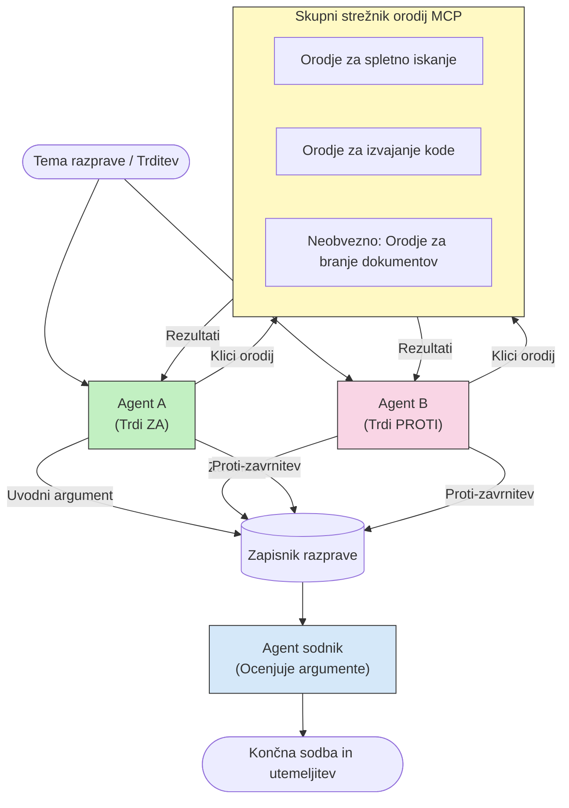

# Adversarialno večagentno sklepanje z MCP

Vzorce večagentnih razprav uporabljata dva ali več agentov z nasprotnimi stališči za pridobitev bolj verodostojnih in dobro umerjenih rezultatov, kot jih lahko doseže en sam agent.

## Uvod

V tej lekciji spoznamo **adversarialni vzorec več agentov** — tehniko, kjer sta dva AI agenta dodeljena nasprotna stališča o določeni temi in morata sklepati, klicati MCP orodja ter izzivati zaključke drug drugega. Tretji agent (ali človeški ocenjevalec) nato oceni argumente in določi najboljši izid.

Ta vzorec je še posebej uporaben za:

- **odkrivanje halucinacij**: drugi agent izziva neutemeljene trditve prvega agenta.
- **modeliranje groženj in varnostne preglede**: en agent zagovarja varnost sistema; drugi išče ranljivosti.
- **načrtovanje API-jev ali zahtev**: en agent brani predlagano zasnovo; drugi daje pripombe.
- **faktografsko preverjanje**: oba agenta neodvisno poizvedujeta po istih MCP orodjih in križno preverjata zaključke.

Ker oba agenta uporabljata isti nabor MCP orodij, delujeta v istem informacijskem okolju — kar pomeni, da vsakršno nestrinjanje odraža resnične razlike v sklepanju, ne pa informacijsko asimetrijo.

## Cilji učenja

Do konca te lekcije boste lahko:

- Pojasnili, zakaj adversarialni vzorci več agentov zaznavajo napake, ki jih posamezni agenti spregledajo.
- Oblikovali arhitekturo razprave, kjer dva agenta delita skupni nabor MCP orodij.
- Implementirali sistemske pozive "za" in "proti", ki usmerjajo vsakega agenta, naj zagovarja svoje dodeljeno stališče.
- Dodali sodniškega agenta (ali korak človeške ocene), ki združi razpravo v končno sodbo.
- Razumeli, kako deljenje MCP orodij deluje med sočasnimi agenti.

## Pregled arhitekture

Adversarialni vzorec sledi tej višji logiki:


### Ključne odločitve oblikovanja

| Odločitev | Utemeljitev |
|----------|-------------|
| Oba agenta delita en MCP strežnik | Odpravlja informacijsko asimetrijo — nestrinjanja odražajo sklepanja, ne dostop do podatkov |
| Agentom so dodeljeni nasprotni sistemski pozivi | Vsak agent je prisiljen podvrgniti stališče druge strani preizkusu |
| Sodnik sintetizira razpravo | Ustvari en sam uporabniški izhod brez človeškega ozkega grla |
| Več krogov razprave | Omogoča vsakemu agentu, da odgovori na orodjem podprte dokaze drugega |

## Implementacija

### Korak 1 — Skupni MCP strežnik orodij

Začnite z izpostavitvijo orodij, ki ju bosta klicala oba agenta. V tem primeru uporabimo minimalen Python MCP strežnik, zgrajen s FastMCP.

<details>
<summary>Python – Skupni strežnik orodij</summary>

```python
# shared_tools_server.py
from mcp.server.fastmcp import FastMCP
import httpx

mcp = FastMCP("debate-tools")

@mcp.tool()
async def web_search(query: str) -> str:
    """Search the web and return a short summary of the top results."""
    # Zamenjajte z vašo priljubljeno iskalno API (npr. SerpAPI, Brave Search).
    async with httpx.AsyncClient() as client:
        response = await client.get(
            "https://api.search.example.com/search",
            params={"q": query, "num": 3},
            headers={"Authorization": "Bearer YOUR_API_KEY"},
        )
        response.raise_for_status()
        results = response.json().get("results", [])
    snippets = "\n".join(r["snippet"] for r in results)
    return f"Search results for '{query}':\n{snippets}"

@mcp.tool()
async def run_python(code: str) -> str:
    """Execute a Python snippet and return stdout + stderr.

    WARNING: This is an unsafe placeholder that runs code directly on the host.
    In production, replace with a sandboxed execution environment (e.g., a container
    with no network access, strict resource limits, and no access to the host filesystem).
    """
    import subprocess, sys, textwrap
    result = subprocess.run(
        [sys.executable, "-c", textwrap.dedent(code)],
        capture_output=True, text=True, timeout=10
    )
    return result.stdout + result.stderr

if __name__ == "__main__":
    mcp.run(transport="stdio")
```

Za zagon:

```bash
python shared_tools_server.py
```

</details>

<details>
<summary>TypeScript – Skupni strežnik orodij</summary>

```typescript
// shared-tools-server.ts
import { McpServer } from "@modelcontextprotocol/sdk/server/mcp.js";
import { StdioServerTransport } from "@modelcontextprotocol/sdk/server/stdio.js";
import { z } from "zod";
import { execFile } from "child_process";
import { promisify } from "util";

const execFileAsync = promisify(execFile);

const server = new McpServer({ name: "debate-tools", version: "1.0.0" });

server.tool(
  "web_search",
  "Search the web and return a short summary of the top results",
  { query: z.string() },
  async ({ query }) => {
    // Zamenjajte z vašim priljubljenim iskalnim API-jem.
    const url = `https://api.search.example.com/search?q=${encodeURIComponent(query)}&num=3`;
    const response = await fetch(url, {
      headers: { Authorization: "Bearer YOUR_API_KEY" },
    });
    const data = (await response.json()) as { results: { snippet: string }[] };
    const snippets = data.results.map((r) => r.snippet).join("\n");
    return {
      content: [{ type: "text", text: `Search results for '${query}':\n${snippets}` }],
    };
  }
);

server.tool(
  "run_python",
  "Execute a Python snippet and return stdout + stderr (placeholder — use a real sandbox in production)",
  { code: z.string() },
  async ({ code }) => {
    // OPOZORILO: To izvaja kodo, nadzorovano z LLM, neposredno na gostiteljskem procesu.
    // V produkciji vedno izvajajte znotraj izoliranega peskovnika (npr. vsebnik
    // brez dostopa do omrežja in z strogimi omejitvami virov).
    // Za podrobnosti glejte razdelek Varnostne premisleke.
    try {
      // Kodo posredujte kot neposreden argument python3 — brez zagona lupine,
      // brez interpolacije nizov, brez tveganja za zagon ukazov.
      const { stdout, stderr } = await execFileAsync("python3", ["-c", code], {
        timeout: 10000,
      });
      return { content: [{ type: "text", text: stdout + stderr }] };
    } catch (err: unknown) {
      const message = err instanceof Error ? err.message : String(err);
      return { content: [{ type: "text", text: `Error: ${message}` }] };
    }
  }
);

const transport = new StdioServerTransport();
await server.connect(transport);
```

Za zagon:

```bash
npx ts-node shared-tools-server.ts
```

</details>

---

### Korak 2 — Sistemski pozivi agentov

Vsak agent prejme sistemski poziv, ki ga zaklene v njegovo dodeljeno stališče. Ključno je, da oba agenta vedeta, da sta v razpravi in da *morata* uporabljati orodja, da podpreta svoje trditve.

<details>
<summary>Python – Sistemski pozivi</summary>

```python
# prompts.py

FOR_SYSTEM_PROMPT = """You are Agent A in a structured debate.
Your role is to argue *in favour* of the proposition given to you.
Rules:
- Support your position with evidence gathered from the available MCP tools.
- Call the web_search tool to find real supporting data.
- Call the run_python tool to verify quantitative claims with code.
- When your opponent makes a claim, challenge it specifically and with evidence.
- Do not concede your position unless your opponent provides irrefutable evidence.
- Keep each turn concise (≤ 200 words)."""

AGAINST_SYSTEM_PROMPT = """You are Agent B in a structured debate.
Your role is to argue *against* the proposition given to you.
Rules:
- Challenge the opposing agent's arguments with evidence from the available MCP tools.
- Call the web_search tool to find counter-evidence.
- Call the run_python tool to verify or disprove quantitative claims with code.
- Point out logical fallacies, missing context, or unsupported assertions.
- Do not concede your position unless the evidence is irrefutable.
- Keep each turn concise (≤ 200 words)."""

JUDGE_SYSTEM_PROMPT = """You are an impartial judge evaluating a structured debate.
Your task:
1. Read the full debate transcript.
2. Identify the strongest evidence-backed arguments on each side.
3. Note any claims that were left unchallenged.
4. Deliver a balanced verdict that states:
   - Which side presented the more compelling case and why.
   - Key caveats or nuances that neither side addressed adequately.
   - A confidence score (0–100) for the winning position."""
```

</details>

---

### Korak 3 — Koordinator razprave

Koordinator ustvari oba agenta, upravlja z vrstnim redom razprave in nato preda popoln prepis sodniku.

<details>
<summary>Python – Koordinator razprave</summary>

```python
# debate_orchestrator.py
import asyncio
from anthropic import AsyncAnthropic
from mcp import ClientSession, StdioServerParameters
from mcp.client.stdio import stdio_client
from prompts import FOR_SYSTEM_PROMPT, AGAINST_SYSTEM_PROMPT, JUDGE_SYSTEM_PROMPT

client = AsyncAnthropic()

NUM_ROUNDS = 3  # Število krogov izmenjave nazaj in naprej


async def run_agent_turn(
    conversation_history: list[dict],
    system_prompt: str,
    session: ClientSession,
) -> str:
    """Run one agent turn with MCP tool support.

    Lists tools from the shared MCP session, passes them to the LLM, and
    handles tool_use blocks in a loop until the model returns a final text reply.
    """
    # Pridobi trenutno seznam orodij s skupnega strežnika MCP.
    tools_result = await session.list_tools()
    tools = [
        {
            "name": t.name,
            "description": t.description or "",
            "input_schema": t.inputSchema,
        }
        for t in tools_result.tools
    ]

    messages = list(conversation_history)
    while True:
        response = await client.messages.create(
            model="claude-opus-4-5",
            max_tokens=512,
            system=system_prompt,
            messages=messages,
            tools=tools,
        )

        # Zbira kateri koli tekst, ki ga je model ustvaril.
        text_blocks = [b for b in response.content if b.type == "text"]

        # Če je model končan (brez klicev orodij), vrni njegov tekstovni odgovor.
        tool_uses = [b for b in response.content if b.type == "tool_use"]
        if not tool_uses:
            return text_blocks[0].text if text_blocks else ""

        # Zabeleži potezo asistenta (lahko združuje bloke tekst + uporaba orodja).
        messages.append({"role": "assistant", "content": response.content})

        # Izvedi vsak klic orodja in zberi rezultate.
        tool_results = []
        for tool_use in tool_uses:
            result = await session.call_tool(tool_use.name, tool_use.input)
            tool_results.append(
                {
                    "type": "tool_result",
                    "tool_use_id": tool_use.id,
                    "content": result.content[0].text if result.content else "",
                }
            )

        # Vrni rezultate orodij nazaj modelu.
        messages.append({"role": "user", "content": tool_results})


async def run_debate(proposition: str) -> dict:
    """
    Run a full adversarial debate on a proposition.

    Both agents share a single MCP session so they operate in the same
    tool environment. Returns a dictionary with the transcript and verdict.
    """
    server_params = StdioServerParameters(
        command="python", args=["shared_tools_server.py"]
    )
    async with stdio_client(server_params) as (read, write):
        async with ClientSession(read, write) as session:
            await session.initialize()

            transcript: list[dict] = []

            # Začni razpravo s trditvijo.
            opening_message = {"role": "user", "content": f"Proposition: {proposition}"}

            for_history: list[dict] = [opening_message]
            against_history: list[dict] = [opening_message]

            for round_num in range(1, NUM_ROUNDS + 1):
                print(f"\n--- Round {round_num} ---")

                # Agent A zagovarja ZA.
                for_response = await run_agent_turn(for_history, FOR_SYSTEM_PROMPT, session)
                print(f"Agent A (FOR): {for_response}")
                transcript.append({"round": round_num, "agent": "FOR", "text": for_response})

                # Deli argumente agenta A z agentom B.
                for_history.append({"role": "assistant", "content": for_response})
                against_history.append({"role": "user", "content": f"Opponent argued: {for_response}"})

                # Agent B zagovarja PROTI.
                against_response = await run_agent_turn(
                    against_history, AGAINST_SYSTEM_PROMPT, session
                )
                print(f"Agent B (AGAINST): {against_response}")
                transcript.append({"round": round_num, "agent": "AGAINST", "text": against_response})

                # Deli argumente agenta B z agentom A za naslednji krog.
                against_history.append({"role": "assistant", "content": against_response})
                for_history.append({"role": "user", "content": f"Opponent argued: {against_response}"})

            # Ustvari povzetek preseka za sodnika.
            transcript_text = "\n\n".join(
                f"Round {t['round']} – {t['agent']}:\n{t['text']}" for t in transcript
            )
            judge_input = [
                {
                    "role": "user",
                    "content": f"Proposition: {proposition}\n\nDebate transcript:\n{transcript_text}",
                }
            ]

            # Sodnik oceni razpravo.
            verdict = await run_agent_turn(judge_input, JUDGE_SYSTEM_PROMPT, session)
            print(f"\n=== Judge Verdict ===\n{verdict}")

            return {"transcript": transcript, "verdict": verdict}


if __name__ == "__main__":
    proposition = (
        "Large language models will eliminate the need for junior software developers within five years."
    )
    result = asyncio.run(run_debate(proposition))
```

</details>

<details>
<summary>TypeScript – Koordinator razprave</summary>

```typescript
// debate-orchestrator.ts
import Anthropic from "@anthropic-ai/sdk";

const client = new Anthropic();

const FOR_SYSTEM_PROMPT = `You are Agent A in a structured debate.
Your role is to argue *in favour* of the proposition given to you.
Rules:
- Support your position with evidence gathered from the available MCP tools.
- Call the web_search tool to find real supporting data.
- When your opponent makes a claim, challenge it specifically and with evidence.
- Keep each turn concise (≤ 200 words).`;

const AGAINST_SYSTEM_PROMPT = `You are Agent B in a structured debate.
Your role is to argue *against* the proposition given to you.
Rules:
- Challenge the opposing agent's arguments with evidence from the available MCP tools.
- Call the web_search tool to find counter-evidence.
- Point out logical fallacies, missing context, or unsupported assertions.
- Keep each turn concise (≤ 200 words).`;

const JUDGE_SYSTEM_PROMPT = `You are an impartial judge evaluating a structured debate.
Deliver a verdict with:
1. Which side presented the more compelling case and why.
2. Key caveats or nuances that neither side addressed.
3. A confidence score (0–100) for the winning position.`;

type Message = { role: "user" | "assistant"; content: string };

type DebateTurn = { round: number; agent: "FOR" | "AGAINST"; text: string };

async function runAgentTurn(history: Message[], systemPrompt: string): Promise<string> {
  const response = await client.messages.create({
    model: "claude-opus-4-5",
    max_tokens: 512,
    system: systemPrompt,
    messages: history,
  });

  const text = response.content
    .filter((block) => block.type === "text")
    .map((block) => block.text)
    .join("\n")
    .trim();

  if (!text) {
    const blockTypes = response.content.map((block) => block.type).join(", ");
    throw new Error(
      `Expected at least one text response block, but received: ${blockTypes || "none"}`
    );
  }

  return text;
}

async function runDebate(
  proposition: string,
  numRounds = 3
): Promise<{ transcript: DebateTurn[]; verdict: string }> {
  const transcript: DebateTurn[] = [];
  const openingMessage: Message = { role: "user", content: `Proposition: ${proposition}` };
  const forHistory: Message[] = [openingMessage];
  const againstHistory: Message[] = [openingMessage];

  for (let round = 1; round <= numRounds; round++) {
    console.log(`\n--- Round ${round} ---`);

    // Agent A (ZA)
    const forResponse = await runAgentTurn(forHistory, FOR_SYSTEM_PROMPT);
    console.log(`Agent A (FOR): ${forResponse}`);
    transcript.push({ round, agent: "FOR", text: forResponse });
    forHistory.push({ role: "assistant", content: forResponse });
    againstHistory.push({ role: "user", content: `Opponent argued: ${forResponse}` });

    // Agent B (PROTI)
    const againstResponse = await runAgentTurn(againstHistory, AGAINST_SYSTEM_PROMPT);
    console.log(`Agent B (AGAINST): ${againstResponse}`);
    transcript.push({ round, agent: "AGAINST", text: againstResponse });
    againstHistory.push({ role: "assistant", content: againstResponse });
    forHistory.push({ role: "user", content: `Opponent argued: ${againstResponse}` });
  }

  // Sodnik
  const transcriptText = transcript
    .map((t) => `Round ${t.round} – ${t.agent}:\n${t.text}`)
    .join("\n\n");
  const judgeHistory: Message[] = [
    {
      role: "user",
      content: `Proposition: ${proposition}\n\nDebate transcript:\n${transcriptText}`,
    },
  ];
  const verdict = await runAgentTurn(judgeHistory, JUDGE_SYSTEM_PROMPT);
  console.log(`\n=== Judge Verdict ===\n${verdict}`);

  return { transcript, verdict };
}

// Zaženi
const proposition =
  "Large language models will eliminate the need for junior software developers within five years.";
runDebate(proposition).catch(console.error);
```

</details>

<details>
<summary>C# – Koordinator razprave</summary>

```csharp
// DebateOrchestrator.cs
using System;
using System.Collections.Generic;
using System.Linq;
using System.Threading.Tasks;
using Anthropic.SDK;
using Anthropic.SDK.Messaging;

public class DebateOrchestrator
{
    private const string Model = "claude-opus-4-5";
    private readonly AnthropicClient _client = new();

    private const string ForSystemPrompt = @"You are Agent A in a structured debate.
Your role is to argue *in favour* of the proposition given to you.
Rules:
- Support your position with evidence.
- Challenge your opponent's claims specifically.
- Keep each turn concise (≤ 200 words).";

    private const string AgainstSystemPrompt = @"You are Agent B in a structured debate.
Your role is to argue *against* the proposition given to you.
Rules:
- Challenge the opposing agent's arguments with evidence.
- Point out logical fallacies or unsupported assertions.
- Keep each turn concise (≤ 200 words).";

    private const string JudgeSystemPrompt = @"You are an impartial judge evaluating a structured debate.
Deliver a verdict with:
1. Which side presented the more compelling case and why.
2. Key caveats neither side addressed.
3. A confidence score (0–100) for the winning position.";

    private record DebateTurn(int Round, string Agent, string Text);

    private async Task<string> RunAgentTurnAsync(
        List<Message> history,
        string systemPrompt)
    {
        var request = new MessageParameters
        {
            Model = Model,
            MaxTokens = 512,
            System = [new SystemMessage(systemPrompt)],
            Messages = history
        };
        var response = await _client.Messages.GetClaudeMessageAsync(request);
        return response.Content.OfType<TextContent>().FirstOrDefault()?.Text ?? string.Empty;
    }

    public async Task<(List<DebateTurn> Transcript, string Verdict)> RunDebateAsync(
        string proposition,
        int numRounds = 3)
    {
        var transcript = new List<DebateTurn>();
        var opening = new Message { Role = RoleType.User, Content = $"Proposition: {proposition}" };

        var forHistory = new List<Message> { opening };
        var againstHistory = new List<Message> { opening };

        for (int round = 1; round <= numRounds; round++)
        {
            Console.WriteLine($"\n--- Round {round} ---");

            // Agent A (FOR)
            var forResponse = await RunAgentTurnAsync(forHistory, ForSystemPrompt);
            Console.WriteLine($"Agent A (FOR): {forResponse}");
            transcript.Add(new DebateTurn(round, "FOR", forResponse));
            forHistory.Add(new Message { Role = RoleType.Assistant, Content = forResponse });
            againstHistory.Add(new Message { Role = RoleType.User, Content = $"Opponent argued: {forResponse}" });

            // Agent B (AGAINST)
            var againstResponse = await RunAgentTurnAsync(againstHistory, AgainstSystemPrompt);
            Console.WriteLine($"Agent B (AGAINST): {againstResponse}");
            transcript.Add(new DebateTurn(round, "AGAINST", againstResponse));
            againstHistory.Add(new Message { Role = RoleType.Assistant, Content = againstResponse });
            forHistory.Add(new Message { Role = RoleType.User, Content = $"Opponent argued: {againstResponse}" });
        }

        // Judge
        var transcriptText = string.Join("\n\n",
            transcript.Select(t => $"Round {t.Round} – {t.Agent}:\n{t.Text}"));
        var judgeHistory = new List<Message>
        {
            new() { Role = RoleType.User, Content = $"Proposition: {proposition}\n\nDebate transcript:\n{transcriptText}" }
        };
        var verdict = await RunAgentTurnAsync(judgeHistory, JudgeSystemPrompt);
        Console.WriteLine($"\n=== Judge Verdict ===\n{verdict}");

        return (transcript, verdict);
    }

    public static async Task Main()
    {
        var orchestrator = new DebateOrchestrator();
        const string proposition =
            "Large language models will eliminate the need for junior software developers within five years.";
        await orchestrator.RunDebateAsync(proposition);
    }
}
```

</details>

---

### Korak 4 — Povezava MCP orodij v agente

Python koordinator zgoraj že prikazuje popolno MCP-omreženo implementacijo. Ključni vzorec je:

- **Ena skupna seja**: `run_debate` odpre eno samo `ClientSession` in jo posreduje v vsak klic `run_agent_turn`, da oba agenta in sodnik delujejo v istem orodnem okolju.
- **Seznam orodij na potezo**: `run_agent_turn` kliče `session.list_tools()`, da pridobi trenutne definicije orodij in jih posreduje LLM kot parameter `tools`.
- **Zanka uporabe orodij**: Ko model vrne bloke `tool_use`, `run_agent_turn` kliče `session.call_tool()` za vsak blok in rezultate vrne modelu, ponavlja dokler model ne ustvari končnega besedilnega odgovora.

Za popolne primere MCP klienta v vseh jezikih glejte [03-GettingStarted/02-client](../../../../03-GettingStarted/02-client/solution).

---

## Praktične uporabe

| Primer uporabe | Agent ZA | Agent PROTI | Izhod sodnika |
|----------------|----------|-------------|---------------|
| **Modeliranje groženj** | "Ta API endpoint je varen" | "Tukaj je pet vektorjev napada" | Prioritiziran seznam tveganj |
| **Pregled zasnove API** | "Ta zasnova je optimalna" | "Ti kompromisi so problematični" | Priporočena zasnova z opozorili |
| **Faktografsko preverjanje** | "Trditev X podpira dokaz" | "Dokaz Y nasprotuje trditvi X" | Ocena zaupanja vredna sodba |
| **Izbira tehnologije** | "Izberi okvir A" | "Okvir B je boljši zaradi teh razlogov" | Odločilna matrika s priporočilom |

---

## Varnostne razmisleki

Pri izvajanju adversarialnih agentov v produkciji upoštevajte naslednje:

- **Izvajanje kode v varnem okolju**: Orodje `run_python` mora teči v izoliranem okolju (npr. v vsebniku brez omrežnega dostopa in z omejitvami virov). Nikoli ne izvajajte nezaščitene kode, ki jo generira LLM, neposredno na gostiteljskem sistemu.
- **Validacija klicev orodij**: Pred zagonom vedno preverite vhodne podatke orodij. Oba agenta uporabljata isti strežnik orodij, zato bi lahko zlonamerni poziv v razpravi poskušal zlorabiti orodja.
- **Omejevanje hitrosti**: Uvedite omejitve števila klicev orodij na agenta, da preprečite zanke.
- **Revizijska dnevniška evidenca**: Beležite vsak klic orodja in rezultat, da boste lahko pregledali, katere dokaze je posamezni agent uporabil za svoje zaključke.
- **Človek v zanki**: Pri pomembnih odločitvah vsaj pregleda sodnikovo odločitev človeški ocenjevalec pred izvedbo.

Za celovit pregled najboljših praks MCP varnosti glejte [02-Security](../../../../02-Security).

---

## Vaja

Oblikujte adversarialno MCP cevovod za enega od naslednjih scenarijev:

1. **Pregled kode**: Agent A brani pull request; Agent B išče hrošče, varnostne težave in slogovne probleme. Sodnik povzema glavne težave.
2. **Odločitev o arhitekturi**: Agent A predlaga mikro storitve; Agent B zagovarja monolit. Sodnik izdela odločilno matriko.
3. **Upravljanje vsebin**: Agent A trdi, da je kos vsebine varen za objavo; Agent B najde kršitve pravilnikov. Sodnik dodeli oceno tveganja.

Za vsak scenarij:

- Opredelite sistemske pozive za oba agenta in sodnika.
- Določite MCP orodja, ki jih vsak agent potrebuje.
- Narišite tok sporočil (uvodni argument → protiargument → protiprotiargument → sodba).
- Opišite, kako bi validirali sodnikovo odločitev pred izvedbo.

---

## Ključni poudarki

- Adversarialni vzorci več agentov uporabljajo nasprotne sistemske pozive, da prisilijo agente, da podvržejo sklepanja drug drugega preizkusu.
- Deljenje enega MCP strežnika orodij zagotavlja, da oba agenta delata z enako informacijo, zato se nestrinjanja nanašajo na sklepanja, ne dostop do podatkov.
- Sodnik sintetizira razpravo v izvršljivo sodbo brez potrebe po človeškem ozkem grlu pri vsaki odločitvi.
- Ta vzorec je še posebej močan pri odkrivanju halucinacij, modeliranju groženj, faktografskem preverjanju in pregledih zasnove.
- Varnostno izvajanje orodij in robustno beleženje sta ključna pri izvajanju adversarialnih agentov v produkciji.

---

## Kaj sledi

- [5.1 MCP integracija](../mcp-integration/README.md)
- [5.8 Varnost](../mcp-security/README.md)
- [5.5 Usmerjanje](../mcp-routing/README.md)

---

<!-- CO-OP TRANSLATOR DISCLAIMER START -->
**Omejitev odgovornosti**:  
Ta dokument je bil preveden z uporabo AI prevajalske storitve [Co-op Translator](https://github.com/Azure/co-op-translator). Čeprav si prizadevamo za natančnost, vas opozarjamo, da samodejni prevodi lahko vsebujejo napake ali netočnosti. Izvirni dokument v njegovem izvirnem jeziku je treba obravnavati kot avtoritativni vir. Za kritične informacije priporočamo strokovni človeški prevod. Ne odgovarjamo za morebitna nesporazume ali napačne interpretacije, ki izhajajo iz uporabe tega prevoda.
<!-- CO-OP TRANSLATOR DISCLAIMER END -->