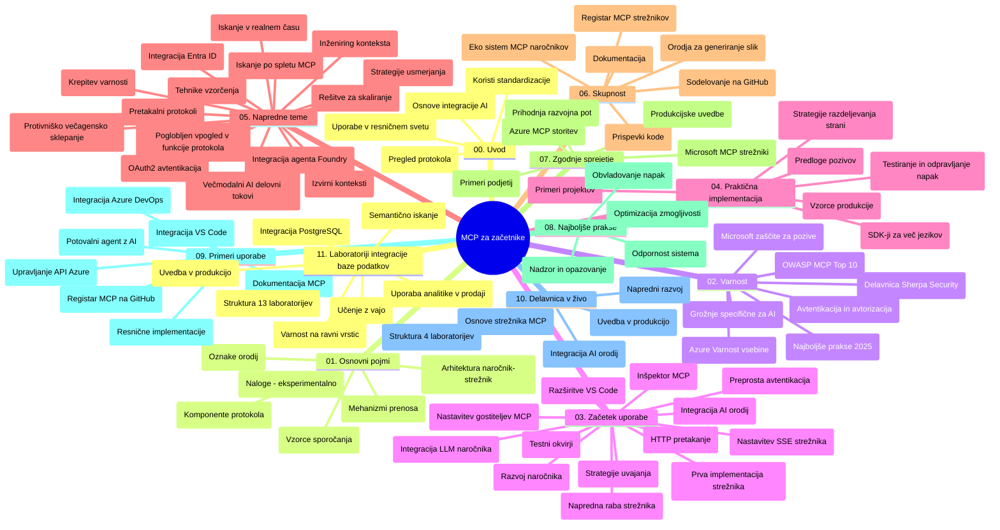

# Protokol konteksta modela (MCP) za začetnike - vodič za študij

Ta vodič za študij ponuja pregled strukture in vsebine repozitorija za učni načrt "Protokol konteksta modela (MCP) za začetnike". Uporabite ta vodič za učinkovito navigacijo po repozitoriju in kar najboljše izkoriščanje razpoložljivih virov.

## Pregled repozitorija

Protokol konteksta modela (MCP) je standardiziran okvir za interakcije med AI modeli in odjemalskimi aplikacijami. Sprva ga je ustvaril Anthropic, zdaj pa MCP vzdržuje širša skupnost MCP prek uradne organizacije na GitHubu. Ta repozitorij ponuja obsežen učni načrt z praktičnimi primeri kode v C#, Javi, JavaScriptu, Pythonu in TypeScriptu, namenjen razvijalcem AI, sistemskim arhitektom in programskim inženirjem.

## Vizualna karta učnega načrta

## Struktura repozitorija

Repozitorij je organiziran v enajst glavnih sekcij, od katerih se vsaka osredotoča na različne vidike MCP:

1. **Uvod (00-Introduction/)**
   - Pregled protokola konteksta modela
   - Zakaj je standardizacija pomembna v AI pipelinah
   - Praktični primeri uporabe in prednosti

2. **Osnovni koncepti (01-CoreConcepts/)**
   - Arhitektura odjemalec-strežnik
   - Ključne komponente protokola
   - Vzorce sporočanja v MCP

3. **Varnost (02-Security/)**
   - Varnostne grožnje v sistemih na podlagi MCP
   - Najboljše prakse za varno implementacijo
   - Strategije preverjanja pristnosti in avtorizacije
   - **Celovita dokumentacija o varnosti**:
     - Najboljše varnostne prakse MCP 2025
     - Vodnik za izvajanje varnosti vsebin Azure
     - Varnostni nadzori in tehnike MCP
     - Hiter referenčni vodnik najboljših praks MCP
   - **Ključne varnostne teme**:
     - Napadi z vstavljanjem pozivov in zastrupitvijo orodij
     - Prevzemanje sej in težave z zmedenimi pooblaščenci
     - Ranljivosti pri posredovanju žetonov
     - Prevelike privilegije in nadzor dostopa
     - Varnost dobavne verige komponent AI
     - Integracija Microsoft Prompt Shields

4. **Začetek (03-GettingStarted/)**
   - Nastavitev in konfiguracija okolja
   - Ustvarjanje osnovnih MCP strežnikov in odjemalcev
   - Integracija z obstoječimi aplikacijami
   - Vključuje oddelke za:
     - Prvo implementacijo strežnika
     - Razvoj odjemalca
     - Integracijo LLM odjemalca
     - Integracijo z VS Code-om
     - SSE strežnik (Server-Sent Events)
     - Napredno uporabo strežnika
     - HTTP pretočenje
     - Integracijo AI orodjarne
     - Testne strategije
     - Navodila za uvajanje

5. **Praktična implementacija (04-PracticalImplementation/)**
   - Uporaba SDK-jev v različnih programskih jezikih
   - Tehnike odpravljanja napak, testiranja in validacije
   - Oblikovanje ponovno uporabnih predlog pozivov in delovnih tokov
   - Vzorčni projekti z implementacijskimi primeri

6. **Napredne teme (05-AdvancedTopics/)**
   - Tehnike inženiringa konteksta
   - Integracija Foundry agenta
   - Večmodalni AI delovni tokovi
   - Demonstracije OAuth2 preverjanja pristnosti
   - Iskanje v realnem času
   - Pretakanje v realnem času
   - Implementacije root kontekstov
   - Strategije usmerjanja
   - Tehnike vzorčenja
   - Pristopi skaliranja
   - Varnostne razmere
   - Integracija varnosti Entra ID
   - Integracija spletnega iskanja
   - Nasprotujoče si večagentno razmišljanje (vzorce razprav)

7. **Prispevki skupnosti (06-CommunityContributions/)**
   - Kako prispevati kodo in dokumentacijo
   - Sodelovanje prek GitHuba
   - Izboljšave in povratne informacije, ki jih vodi skupnost
   - Uporaba različnih MCP odjemalcev (Claude Desktop, Cline, VSCode)
   - Delo s priljubljenimi MCP strežniki vključno s generiranjem slik

8. **Lekcije zgodnje uvedbe (07-LessonsfromEarlyAdoption/)**
   - Praktične implementacije in uspešne zgodbe
   - Gradnja in uvajanje rešitev na podlagi MCP
   - Trend in prihodnja razvojna pot
   - **Vodnik za Microsoft MCP strežnike**: Celovit vodnik za 10 Microsoft MCP strežnikov, pripravljenih za produkcijo, vključno z:
     - Microsoft Learn Docs MCP strežnik
     - Azure MCP strežnik (15+ specializiranih konektorjev)
     - GitHub MCP strežnik
     - Azure DevOps MCP strežnik
     - MarkItDown MCP strežnik
     - SQL Server MCP strežnik
     - Playwright MCP strežnik
     - Dev Box MCP strežnik
     - Azure AI Foundry MCP strežnik
     - Microsoft 365 Agents Toolkit MCP strežnik

9. **Najboljše prakse (08-BestPractices/)**
   - Prilagajanje zmogljivosti in optimizacija
   - Oblikovanje odpornosti MCP sistemov
   - Strategije testiranja in odpornosti

10. **Primeri študij (09-CaseStudy/)**
    - **Sedem obsežnih študij primerov**, ki prikazujejo vsestranskost MCP v različnih scenarijih:
    - **Azure AI Travel Agents**: Večagentna orkestracija z Azure OpenAI in AI Search
    - **Integracija Azure DevOps**: Avtomatizacija delovnih procesov z osvežitvami podatkov YouTube
    - **Pridobivanje dokumentacije v realnem času**: Python konzolni odjemalec s pretočnim HTTP-jem
    - **Generator interaktivnih učnih načrtov**: Chainlit spletna aplikacija s konverzacijskim AI
    - **Dokumentacija v urejevalniku**: Integracija VS Code z delovnimi tokovi GitHub Copilot
    - **Upravljanje z Azure API**: Podjetniška API integracija z ustvarjanjem MCP strežnika
    - **GitHub MCP Register**: Razvoj ekosistema in integracijska platforma agentov
    - Primeri implementacij, ki zajemajo podjetniško integracijo, produktivnost razvijalcev in razvoj ekosistema

11. **Praktična delavnica (10-StreamliningAIWorkflowsBuildingAnMCPServerWithAIToolkit/)**
    - Celovita praktična delavnica, ki združuje MCP z AI Toolkit
    - Gradnja inteligentnih aplikacij, ki povezujejo AI modele z resničnimi orodji
    - Praktični moduli, ki zajemajo osnove, razvoj po meri strežnika in strategije uvajanja v produkcijo
    - **Struktura laboratorij**:
      - Laboratorij 1: Osnove MCP strežnika
      - Laboratorij 2: Napredni razvoj MCP strežnika
      - Laboratorij 3: Integracija AI orodjarne
      - Laboratorij 4: Uvajanje v produkcijo in skaliranje
    - Pristop učenja na podlagi laboratorijskih vaj z navodili po korakih

12. **Laboratoriji za integracijo MCP strežnika z bazo podatkov (11-MCPServerHandsOnLabs/)**
    - **Celovita učna pot s 13 laboratoriji** za gradnjo MCP strežnikov, pripravljenih za produkcijo, z integracijo PostgreSQL
    - **Praktična implementacija za trgovinsko analitiko** z uporabo primera uporabe Zava Retail
    - **Podjetniški vzorci** vključno z zagotavljanjem varnosti na ravni vrstic (RLS), semantičnim iskanjem in večstrankarskim dostopom do podatkov
    - **Popolna struktura laboratorijev**:
      - **Laboratoriji 00-03: Osnove** - Uvod, arhitektura, varnost, nastavitev okolja
      - **Laboratoriji 04-06: Gradnja MCP strežnika** - Oblikovanje baze podatkov, implementacija MCP strežnika, razvoj orodij
      - **Laboratoriji 07-09: Napredne funkcije** - Semantično iskanje, testiranje in odpravljanje napak, integracija z VS Code
      - **Laboratoriji 10-12: Produkcija in najboljše prakse** - Uvajanje, nadzor, optimizacija
    - **Pokrite tehnologije**: FastMCP okvir, PostgreSQL, Azure OpenAI, Azure Container Apps, Application Insights
    - **Učni izidi**: MCP strežniki, pripravljeni za produkcijo, vzorci integracije baz podatkov, AI podprta analitika, podjetniška varnost

## Dodatni viri

Repozitorij vključuje podporne vire:

- **Mapa slik**: Vsebuje diagrame in ilustracije, uporabljene v celotnem učnem načrtu
- **Prevodi**: Podpora za več jezikov z avtomatiziranimi prevodi dokumentacije
- **Uradni viri MCP**:
  - [Dokumentacija MCP](https://modelcontextprotocol.io/)
  - [Specifikacija MCP](https://spec.modelcontextprotocol.io/)
  - [MCP GitHub repozitorij](https://github.com/modelcontextprotocol)

## Kako uporabljati ta repozitorij

1. **Zaporedno učenje**: Sledite poglavjem po vrsti (00 do 11) za strukturirano učno izkušnjo.
2. **Jezikovno osredotočenje**: Če vas zanima določen programski jezik, raziščite mape vzorcev za implementacije v vašem priljubljenem jeziku.
3. **Praktična implementacija**: Začnite s sekcijo "Začetek" za nastavitev okolja in ustvarjanje prvega MCP strežnika in odjemalca.
4. **Napredno raziskovanje**: Ko obvladate osnove, se poglobite v napredne teme, da razširite svoje znanje.
5. **Sodelovanje v skupnosti**: Pridružite se MCP skupnosti prek GitHub razprav in Discord kanalov za povezovanje z strokovnjaki in ostalimi razvijalci.

## MCP odjemalci in orodja

Učni načrt zajema različne MCP odjemalce in orodja:

1. **Uradni odjemalci**:
   - Visual Studio Code
   - MCP v Visual Studio Code
   - Claude Desktop
   - Claude v VSCode
   - Claude API

2. **Skupnostni odjemalci**:
   - Cline (na osnovi terminala)
   - Cursor (urejevalnik kode)
   - ChatMCP
   - Windsurf

3. **Orodja za upravljanje MCP**:
   - MCP CLI
   - MCP Manager
   - MCP Linker
   - MCP Router

## Priljubljeni MCP strežniki

Repozitorij predstavlja različne MCP strežnike, vključno z:

1. **Uradni Microsoft MCP strežniki**:
   - Microsoft Learn Docs MCP strežnik
   - Azure MCP strežnik (15+ specializiranih konektorjev)
   - GitHub MCP strežnik
   - Azure DevOps MCP strežnik
   - MarkItDown MCP strežnik
   - SQL Server MCP strežnik
   - Playwright MCP strežnik
   - Dev Box MCP strežnik
   - Azure AI Foundry MCP strežnik
   - Microsoft 365 Agents Toolkit MCP strežnik

2. **Uradni referenčni strežniki**:
   - Datotečni sistem
   - Fetch
   - Pomnilnik
   - Zaporedno razmišljanje

3. **Generiranje slik**:
   - Azure OpenAI DALL-E 3
   - Stable Diffusion WebUI
   - Replicate

4. **Razvojna orodja**:
   - Git MCP
   - Terminal Control
   - Code Assistant

5. **Specializirani strežniki**:
   - Salesforce
   - Microsoft Teams
   - Jira & Confluence

## Prispevanje

Ta repozitorij sprejema prispevke skupnosti. Za navodila, kako učinkovito prispevati k MCP ekosistemu, si oglejte razdelek Prispevki skupnosti.

----

*Ta vodič za študij je bil nazadnje posodobljen 5. februarja 2026, odraža najnovejšo MCP specifikacijo 2025-11-25 in ponuja pregled repozitorija do tega datuma. Vsebina repozitorija je lahko po tem datumu posodobljena.*

---

<!-- CO-OP TRANSLATOR DISCLAIMER START -->
**Omejitev odgovornosti**:
To besedilo je bilo prevedeno z uporabo AI prevajalske storitve [Co-op Translator](https://github.com/Azure/co-op-translator). Čeprav si prizadevamo za natančnost, upoštevajte, da avtomatizirani prevodi lahko vsebujejo napake ali netočnosti. Izvirni dokument v izvirnem jeziku velja za avtoritativni vir. Za ključne informacije priporočamo strokovni človeški prevod. Za morebitna nesporazume ali napačne interpretacije, ki izhajajo iz uporabe tega prevoda, nismo odgovorni.
<!-- CO-OP TRANSLATOR DISCLAIMER END -->