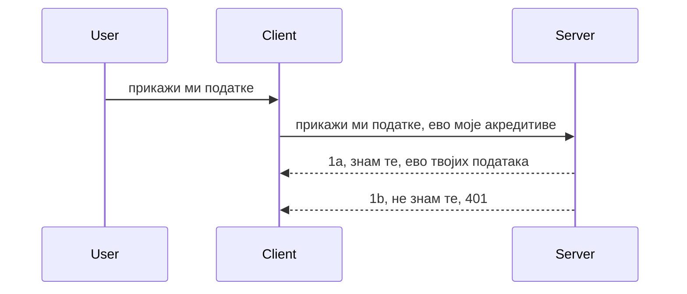

# Једноставна аутентификација

MCP SDK-ови подржавају коришћење OAuth 2.1 што је, да будемо искрени, прилично сложен процес који укључује концепте као што су сервер за аутентификацију, сервер ресурса, слање акредитива, добијање кода, размена кода за беруер токен док на крају не можете добити своје податке ресурса. Ако нисте навикли на OAuth што је одлична ствар за имплементацију, добро је да почнете са неким основним нивоом аутентификације и постепено градите бољу и бољу безбедност. Зато овај поглавље постоји, да вас припреми за напреднију аутентификацију.

## Аутентификација, шта мислимо?

Аутх је скраћеница за аутентификацију и ауторизацију. Идеја је да треба да урадимо две ствари:

- **Аутентификација**, што је процес утврђивања да ли ћемо дозволити некој особи да уђе у нашу кућу, односно да ли има право да буде „овде“ и да има приступ нашем серверу ресурса где живе функције нашег MCP сервера.
- **Ауторизација**, је процес провере да ли корисник треба да има приступ одређеним ресурсима за које тражи приступ, на пример тим поруџбинама или тим производима, или да ли је дозвољено само читање садржаја али не и брисање као други пример.

## Акредитиви: како кажемо систему ко смо

Па, већина веб програмера обично размишља у терминима пружања акредитива серверу, обично једне тајне која говори да ли им је дозвољено да буду овде „Аутентификација“. Тај акредитив је обично base64 енкодирана верзија корисничког имена и лозинке или API кључ који јединствено идентификује конкретног корисника.

То укључује слање преко хедера под називом "Authorization" овако:

```json
{ "Authorization": "secret123" }
```

Ово се обично назива основна аутентификација. Како тај процес у целини функционише је на следећи начин:


Сада када разумемо како то ради из угла тока, како то имплементирати? Па, већина веб сервера има концепт зван middleware, део кода који се извршава као део захтева који може да провери акредитиве, и ако су акредитиви валидни може дозволити захтеву да прође. Ако захтев нема важеће акредитиве, добијате аутентификациони грешку. Хајде да видимо како ово може бити имплементирано:

**Python**

```python
class AuthMiddleware(BaseHTTPMiddleware):
    async def dispatch(self, request, call_next):

        has_header = request.headers.get("Authorization")
        if not has_header:
            print("-> Missing Authorization header!")
            return Response(status_code=401, content="Unauthorized")

        if not valid_token(has_header):
            print("-> Invalid token!")
            return Response(status_code=403, content="Forbidden")

        print("Valid token, proceeding...")
       
        response = await call_next(request)
        # додати било које заглавље купца или на неки начин променити одговор
        return response


starlette_app.add_middleware(CustomHeaderMiddleware)
```

Овде имамо:

- Креиран middleware зван `AuthMiddleware` где се његова метода `dispatch` позива од стране веб сервера.
- Додавање middleware-а на веб сервер:

    ```python
    starlette_app.add_middleware(AuthMiddleware)
    ```

- Написана логика за валидацију која проверава да ли хедер Authorization постоји и да ли је послата тајна важећа:

    ```python
    has_header = request.headers.get("Authorization")
    if not has_header:
        print("-> Missing Authorization header!")
        return Response(status_code=401, content="Unauthorized")

    if not valid_token(has_header):
        print("-> Invalid token!")
        return Response(status_code=403, content="Forbidden")
    ```

    ако је тајна присутна и важећа, онда дозвољавамо захтеву да прође позивајући `call_next` и враћамо одговор.

    ```python
    response = await call_next(request)
    # додајте било које корисничке заглавља или промените одговор на неки начин
    return response
    ```

Како ради је да ако се направи веб захтев ка серверу, middleware ће бити позван и с обзиром на његову имплементацију или ће дозволити пролазак захтева или ће вратити грешку која указује да клијенту није дозвољено да настави.

**TypeScript**

Овде креирамо middleware уз помоћ популарног фрејмворка Express и пресрећемо захтев пре него што стигне до MCP сервера. Ево кода за то:

```typescript
function isValid(secret) {
    return secret === "secret123";
}

app.use((req, res, next) => {
    // 1. Да ли је заглавље за овлашћење присутно?
    if(!req.headers["Authorization"]) {
        res.status(401).send('Unauthorized');
    }
    
    let token = req.headers["Authorization"];

    // 2. Проверите ваљаност.
    if(!isValid(token)) {
        res.status(403).send('Forbidden');
    }

   
    console.log('Middleware executed');
    // 3. Проследите захтев следећем кораку у току обраде захтева.
    next();
});
```

У овом коду ми:

1. Проверавамо да ли Authorization хедер постоји, ако не, шаљемо 401 грешку.
2. Осигуравајући да је акредитив/токен валидан, ако није шаљемо 403 грешку.
3. На крају прослеђује захтев у даљи ток захтева и враћа тражени ресурс.

## Вежба: Имплементирај аутентификацију

Хајде да искористимо наше знање и покушамо да је имплементирамо. Ево плана:

Сервер

- Креирај веб сервер и MCP инстанцу.
- Имплементирај middleware за сервер.

Клијент

- Пошаљи веб захтев са акредитивом преко хедера.

### -1- Креирај веб сервер и MCP инстанцу

У првом кораку треба да креирамо инстанцу веб сервера и MCP сервера.

**Python**

Овде креирамо MCP сервер инстанцу, направимо starlette веб апликацију и покрећемо је уз помоћ uvicorn-а.

```python
# креирање MCP сервера

app = FastMCP(
    name="MCP Resource Server",
    instructions="Resource Server that validates tokens via Authorization Server introspection",
    host=settings["host"],
    port=settings["port"],
    debug=True
)

# креирање starlette веб апликације
starlette_app = app.streamable_http_app()

# сервисирање апликације преко uvicorn-а
async def run(starlette_app):
    import uvicorn
    config = uvicorn.Config(
            starlette_app,
            host=app.settings.host,
            port=app.settings.port,
            log_level=app.settings.log_level.lower(),
        )
    server = uvicorn.Server(config)
    await server.serve()

run(starlette_app)
```

У овом коду ми:

- Креирамо MCP сервер.
- Конструишемо starlette веб апликацију из MCP сервера, `app.streamable_http_app()`.
- Покрећемо и сервирајмо веб апликацију користећи uvicorn `server.serve()`.

**TypeScript**

Овде креирамо MCP сервер инстанцу.

```typescript
const server = new McpServer({
      name: "example-server",
      version: "1.0.0"
    });

    // ... подесити серверске ресурсе, алате и упите ...
```

Креирање овог MCP сервера треба да се догоди унутар дефиниције руте POST /mcp, па хајде да претходни код померимо овако:

```typescript
import express from "express";
import { randomUUID } from "node:crypto";
import { McpServer } from "@modelcontextprotocol/sdk/server/mcp.js";
import { StreamableHTTPServerTransport } from "@modelcontextprotocol/sdk/server/streamableHttp.js";
import { isInitializeRequest } from "@modelcontextprotocol/sdk/types.js"

const app = express();
app.use(express.json());

// Мапа за чување транспорта по ИД сесије
const transports: { [sessionId: string]: StreamableHTTPServerTransport } = {};

// Обрада POST захтева за комуникацију клијент-сервер
app.post('/mcp', async (req, res) => {
  // Провера постојећег ИД сесије
  const sessionId = req.headers['mcp-session-id'] as string | undefined;
  let transport: StreamableHTTPServerTransport;

  if (sessionId && transports[sessionId]) {
    // Поново користи постојећи транспорт
    transport = transports[sessionId];
  } else if (!sessionId && isInitializeRequest(req.body)) {
    // Нови захтев за иницијализацију
    transport = new StreamableHTTPServerTransport({
      sessionIdGenerator: () => randomUUID(),
      onsessioninitialized: (sessionId) => {
        // Чување транспорта по ИД сесије
        transports[sessionId] = transport;
      },
      // Заштита од DNS ребајндинга је подразумевано онемогућена ради назадне компатибилности. Ако покрећете овај сервер
      // локално, уверите се да сте подесили:
      // enableDnsRebindingProtection: true,
      // allowedHosts: ['127.0.0.1'],
    });

    // Обриши транспорт када се затвори
    transport.onclose = () => {
      if (transport.sessionId) {
        delete transports[transport.sessionId];
      }
    };
    const server = new McpServer({
      name: "example-server",
      version: "1.0.0"
    });

    // ... подеси серверске ресурсе, алате и упите ...

    // Повежи се са MCP сервером
    await server.connect(transport);
  } else {
    // Неважећи захтев
    res.status(400).json({
      jsonrpc: '2.0',
      error: {
        code: -32000,
        message: 'Bad Request: No valid session ID provided',
      },
      id: null,
    });
    return;
  }

  // Обради захтев
  await transport.handleRequest(req, res, req.body);
});

// Поново употребљив хендлер за GET и DELETE захтеве
const handleSessionRequest = async (req: express.Request, res: express.Response) => {
  const sessionId = req.headers['mcp-session-id'] as string | undefined;
  if (!sessionId || !transports[sessionId]) {
    res.status(400).send('Invalid or missing session ID');
    return;
  }
  
  const transport = transports[sessionId];
  await transport.handleRequest(req, res);
};

// Обрада GET захтева за обавештења са сервера ка клијенту путем SSE
app.get('/mcp', handleSessionRequest);

// Обрада DELETE захтева за завршетак сесије
app.delete('/mcp', handleSessionRequest);

app.listen(3000);
```

Сада видите како је креирање MCP сервера померено унутар `app.post("/mcp")`.

Хајде сада да пређемо на следећи корак — креирање middleware-а да бисмо могли да валидају акредитив.

### -2- Имплементирај middleware за сервер

Следе приступамо делу са middleware-ом. Овде ћемо направити middleware који тражи акредитив у хедеру `Authorization` и валидаје га. Ако је прихватљив онда захтев иде даље да ради оно што треба (нпр. листање алата, читање ресурса или било која MCP функционалност коју клијент тражи).

**Python**

Да направимо middleware, треба да направимо класу која наследи `BaseHTTPMiddleware`. Постоје два интересантна дела:

- Захтев `request`, из кога читамо информације из хедера.
- `call_next`, callback који треба да позовемо ако клијент доноси прихватљив акредитив.

Прво, треба да обрадимо случај ако хедер `Authorization` недостаје:

```python
has_header = request.headers.get("Authorization")

# нема заглавља, отказује са 401, у супротном наставља.
if not has_header:
    print("-> Missing Authorization header!")
    return Response(status_code=401, content="Unauthorized")
```

Овде шаљемо поруку 401 unauthorized јер клијент не пролази аутентификацију.

Затим, ако је акредитив послат, морамо проверити његову ваљаност овако:

```python
 if not valid_token(has_header):
    print("-> Invalid token!")
    return Response(status_code=403, content="Forbidden")
```

Примећујемо да овде шаљемо 403 forbidden поруку. Хајде да видимо целокупни middleware који имплементира све што смо горе рекли:

```python
class AuthMiddleware(BaseHTTPMiddleware):
    async def dispatch(self, request, call_next):

        has_header = request.headers.get("Authorization")
        if not has_header:
            print("-> Missing Authorization header!")
            return Response(status_code=401, content="Unauthorized")

        if not valid_token(has_header):
            print("-> Invalid token!")
            return Response(status_code=403, content="Forbidden")

        print("Valid token, proceeding...")
        print(f"-> Received {request.method} {request.url}")
        response = await call_next(request)
        response.headers['Custom'] = 'Example'
        return response

```

Супер, али шта је са функцијом `valid_token`? Ево је испод:

```python
# НЕ користите за продукцију - унапредите ово !!
def valid_token(token: str) -> bool:
    # уклоните префикс "Bearer "
    if token.startswith("Bearer "):
        token = token[7:]
        return token == "secret-token"
    return False
```

Ово, наравно, треба додатно унапредити.

ВАЖНО: НИКАДА не треба имати тајне овакве у коду. Идеално је да вредност са којом поредимо дохватите из извора података или од IDP (identity service provider) или још боље, да IDP обави валидацију.

**TypeScript**

Да имплементирамо ово са Express-ом, треба да позовемо метод `use` који узима middleware функције.

Треба да:

- Интергујемо са захтевом да проверимо прослеђени акредитив у својству `Authorization`.
- Валидајемо акредитив, и уколико је важећи дозволити захтеву да настави и омогућити MCP захтеву клијента да уради оно што треба (нпр. листање алата, читање ресурса или шта год што је MCP).

Овде проверавамо да ли хедер `Authorization` постоји и ако не, заустављамо захтев:

```typescript
if(!req.headers["authorization"]) {
    res.status(401).send('Unauthorized');
    return;
}
```

Ако хедер није послат, добија се 401.

Затим проверавамо да ли је акредитив валидан, ако није поново заустављамо захтев, али са мало другачијом поруком:

```typescript
if(!isValid(token)) {
    res.status(403).send('Forbidden');
    return;
} 
```

Примећујемо 403 грешку.

Ево целог кода:

```typescript
app.use((req, res, next) => {
    console.log('Request received:', req.method, req.url, req.headers);
    console.log('Headers:', req.headers["authorization"]);
    if(!req.headers["authorization"]) {
        res.status(401).send('Unauthorized');
        return;
    }
    
    let token = req.headers["authorization"];

    if(!isValid(token)) {
        res.status(403).send('Forbidden');
        return;
    }  

    console.log('Middleware executed');
    next();
});
```

Подесили смо веб сервер да прихвата middleware који проверава акредитив који нам клијент шаље. А шта је са самим клијентом?

### -3- Пошаљи веб захтев са акредитивом у хедеру

Треба да обезбедимо да клијент шаље акредитив преко хедера. Пошто ћемо користити MCP клијента за то, треба да сазнамо како се то ради.

**Python**

За клијента, треба да проследимо хедер са нашим акредитивом овако:

```python
# НЕ унетакавај вредност директно у код, држи је најмање у променљивој окружења или на безбеднијем месту за складиштење
token = "secret-token"

async with streamablehttp_client(
        url = f"http://localhost:{port}/mcp",
        headers = {"Authorization": f"Bearer {token}"}
    ) as (
        read_stream,
        write_stream,
        session_callback,
    ):
        async with ClientSession(
            read_stream,
            write_stream
        ) as session:
            await session.initialize()
      
            # ЗАДАЦИ, шта желиш да се уради на клијенту, нпр. набрајање алата, позив алата итд.
```

Примећујемо како попуњавамо својство `headers` овако ` headers = {"Authorization": f"Bearer {token}"}`.

**TypeScript**

Ово можемо решити у два корака:

1. Попунити конфигурациони објекат са нашим акредитивом.
2. Проследити конфигурациони објекат транспорту.

```typescript

// НЕ треба везивати вредност као што је приказано овде. Најмање, имајте је као променљиву окружења и користите нешто као dotenv (у развојном режиму).
let token = "secret123"

// дефиниши опцију објекта транспорта клијента
let options: StreamableHTTPClientTransportOptions = {
  sessionId: sessionId,
  requestInit: {
    headers: {
      "Authorization": "secret123"
    }
  }
};

// проследи опције објекта транспорту
async function main() {
   const transport = new StreamableHTTPClientTransport(
      new URL(serverUrl),
      options
   );
```

Овде видите како смо морали да направимо објекат `options` и ставимо наше хедере у својство `requestInit`.

ВАЖНО: Како то даље унапредити? Тренутна имплементација има неке проблеме. Прво, слање акредитива овако је прилично ризично, осим ако немате HTTPS као минимум. Чак и тада, акредитив може бити украден, па вам треба систем где лако можете поништити токен и додати додатне провере као што су одакле долази, да ли захтева долазе превише често (понашање слично боту), ускратимо је цела гомила брига.

Међутим, треба рећи да је ово добар почетак за врло једноставне API-је где не желите да било ко позива ваш API без аутентификације.

Са тим у вези, хајде да мало ојачамо безбедност коришћењем стандаризованог формата као што је JSON Web Token, познат као JWT или "ЈОТ" токени.

## JSON Web Tokens, JWT

Дакле, покушавамо да унапредимо ствари у односу на слање веома једноставних акредитива. Које су непосредне предности када прихватимо JWT?

- **Безбедносна побољшања**. У основном аутх-у шаљете корисничко име и лозинку као base64 кодирани токен (или API кључ) изнова и изнова што повећава ризик. Са JWT, шаљете корисничко име и лозинку и добијате токен који је временски ограничен што значи да ће истећи. JWT омогућава лаку примену фино зрна приступне контроле коришћењем улога, домена и дозвола.
- **Бесдржавност и скалабилност**. JWT су самодовољни, носе све информације о кориснику и елиминишу потребу за чувaњем сесије на серверу. Токен може бити валидиран локално.
- **Интероперабилност и Федерација**. JWT је централни део Open ID Connect-а и користи се са познатим провајдерима идентитета као што су Entra ID, Google Identity и Auth0. Такође омогућава једнонарачну пријаву и много више што га чини корпоративног нивоа.
- **Модуларност и флексибилност**. JWT се могу користити са API Gateway-јима као што су Azure API Management, NGINX и други. Подржавају и сценарије аутентификације и комуникације сервер-сервер укључујући империјимацију и делегацију.
- **Перформансе и кеширање**. JWT могу бити кеширани након декодирања што смањује потребу за парсирањем. Ово посебно помаже апликацијама са великим саобраћајем јер побољшава пропусност и смањује оптерећење ваше инфраструктуре.
- **Напредне функције**. Подржавају интроспекцију (провера валидности на серверу) и ревокацију (учинити токен неважећим).

Са свим овим предностима, хајде да видимо како можемо пребацити нашу имплементацију на виши ниво.

## Пребацивање основне аутентификације на JWT

Дакле, промене које треба да урадимо на високом нивоу су:

- **Научити како се конструише JWT токен** и припремити га за слање са клијента на сервер.
- **Валидирати JWT токен**, и ако је важећи, омогућити клијенту приступ ресурсима.
- **Безбедно чување токена**. Како чувамо овај токен.
- **Заштитити руте**. Треба да заштитимо руте, у нашем случају руте и одређене MCP функције.
- **Додати refresh токене**. Осигурати креирање краткотрајних токена али и refresh токена који су дугорочни и могу се користити за добијање нових токена ако истекну. Такође обезбедити refresh endpoint и стратегију ротације.

### -1- Конструиши JWT токен

Прво, JWT токен има следеће делове:

- **хедер**, коришћени алгоритам и тип токена.
- **паи로드**, тврдње, као што су sub (корисник или ентитет који токен представља, у аутх сценарију обично је то userid), exp (рок важења) role (улога)
- **потпис**, потписан са тајном или приватним кључем.

За ово треба да конструишемо хедер, паилоад и енкодирани токен.

**Python**

```python

import jwt
import jwt
from jwt.exceptions import ExpiredSignatureError, InvalidTokenError
import datetime

# Тајни кључ који се користи за потписивање JWT-а
secret_key = 'your-secret-key'

header = {
    "alg": "HS256",
    "typ": "JWT"
}

# подаци о кориснику, његове тврдње и време истека
payload = {
    "sub": "1234567890",               # Субјект (ИД корисника)
    "name": "User Userson",                # Прилагођена тврдња
    "admin": True,                     # Прилагођена тврдња
    "iat": datetime.datetime.utcnow(),# Време издавања
    "exp": datetime.datetime.utcnow() + datetime.timedelta(hours=1)  # Време истека
}

# кодирај то
encoded_jwt = jwt.encode(payload, secret_key, algorithm="HS256", headers=header)
```

У горе наведеном коду:

- Дефинисали смо хедер користећи HS256 као алгоритам и тип JWT.
- Конструисали паилоад који садржи subject или кориснички ИД, корисничко име, улогу, време издавања и време истека чиме имплементирамо временско ограничење које смо раније поменули.

**TypeScript**

Овде ће нам требати неке зависности које ће нам помоћи да конструишемо JWT токен.

Зависности

```sh

npm install jsonwebtoken
npm install --save-dev @types/jsonwebtoken
```

Сада када то имамо, хајде да креирамо хедер, паилоад и тако добијемо енкодирани токен.

```typescript
import jwt from 'jsonwebtoken';

const secretKey = 'your-secret-key'; // Користите променљиве окружења у продукцији

// Дефинишите садржај поруке
const payload = {
  sub: '1234567890',
  name: 'User usersson',
  admin: true,
  iat: Math.floor(Date.now() / 1000), // Време издавања
  exp: Math.floor(Date.now() / 1000) + 60 * 60 // Истиче за 1 сат
};

// Дефинишите заглавље (опционо, jsonwebtoken поставља подразумеване вредности)
const header = {
  alg: 'HS256',
  typ: 'JWT'
};

// Креирајте токен
const token = jwt.sign(payload, secretKey, {
  algorithm: 'HS256',
  header: header
});

console.log('JWT:', token);
```

Овај токен је:

Потписан уз помоћ HS256
Важећи 1 сат
Укључује тврдње као sub, name, admin, iat и exp.

### -2- Валидирај токен

Треба нам и валидација токена, то је нешто што треба урадити на серверу да бисмо били сигурни да је оно што клијент шаље важеће. Много провера треба урадити, од валидације структуре до провере важења. Такође се препоручује додавање других провера као што је провера да ли корисник постоји у систему и да ли има права која тврди.

Да бисмо валидирали токен, треба га декодирати да бисмо га прочитали и онда почети провере:

**Python**

```python

# Декодирајте и проверите JWT
try:
    decoded = jwt.decode(token, secret_key, algorithms=["HS256"])
    print("✅ Token is valid.")
    print("Decoded claims:")
    for key, value in decoded.items():
        print(f"  {key}: {value}")
except ExpiredSignatureError:
    print("❌ Token has expired.")
except InvalidTokenError as e:
    print(f"❌ Invalid token: {e}")

```

У овом коду позивамо `jwt.decode` користећи токен, тајни кључ и изабрани алгоритам као улаз. Примећујемо да користимо try-catch конструкцију јер неуспела валидација доводи до изузетка.

**TypeScript**

Овде треба позвати `jwt.verify` да добијемо декодирани токен који даље можемо анализирати. Ако овај позив не успе, то значи да је структура токена некоректна или више није важећи.

```typescript

try {
  const decoded = jwt.verify(token, secretKey);
  console.log('Decoded Payload:', decoded);
} catch (err) {
  console.error('Token verification failed:', err);
}
```

НАПОМЕНА: као што је горе речено, треба урадити додатне провере да ли овај токен одговара кориснику у нашем систему и да ли корисник има права која тврди.

Следеће, погледајмо контролу приступа засновану на улогама, познату као RBAC.
## Додавање контроле приступа засноване на улогама

Идеја је да желимо да изразимо да различите улоге имају различите дозволе. На пример, претпостављамо да администратор може све, да нормални корисник може читати/писати и да гост може само читати. Дакле, ево неких могућих нивоа дозвола:

- Admin.Write 
- User.Read
- Guest.Read

Погледајмо како можемо имплементирати такву контролу коришћењем middleware-а. Middleware-и могу бити додати по рутама као и за све руте.

**Python**

```python
from starlette.middleware.base import BaseHTTPMiddleware
from starlette.responses import JSONResponse
import jwt

# НЕ држите тајну у коду, као овде, ово је само за демонстрацију. Прочитајте је са безбедног места.
SECRET_KEY = "your-secret-key" # ставите ово у променљиву окружења
REQUIRED_PERMISSION = "User.Read"

class JWTPermissionMiddleware(BaseHTTPMiddleware):
    async def dispatch(self, request, call_next):
        auth_header = request.headers.get("Authorization")
        if not auth_header or not auth_header.startswith("Bearer "):
            return JSONResponse({"error": "Missing or invalid Authorization header"}, status_code=401)

        token = auth_header.split(" ")[1]
        try:
            decoded = jwt.decode(token, SECRET_KEY, algorithms=["HS256"])
        except jwt.ExpiredSignatureError:
            return JSONResponse({"error": "Token expired"}, status_code=401)
        except jwt.InvalidTokenError:
            return JSONResponse({"error": "Invalid token"}, status_code=401)

        permissions = decoded.get("permissions", [])
        if REQUIRED_PERMISSION not in permissions:
            return JSONResponse({"error": "Permission denied"}, status_code=403)

        request.state.user = decoded
        return await call_next(request)


```

Постоји неколико различитих начина да се дода middleware као испод:

```python

# Алт 1: додајте middleware приликом конструисања starlette апликације
middleware = [
    Middleware(JWTPermissionMiddleware)
]

app = Starlette(routes=routes, middleware=middleware)

# Алт 2: додајте middleware након што је starlette апликација већ конструисана
starlette_app.add_middleware(JWTPermissionMiddleware)

# Алт 3: додајте middleware за сваки руту
routes = [
    Route(
        "/mcp",
        endpoint=..., # обрађивач
        middleware=[Middleware(JWTPermissionMiddleware)]
    )
]
```

**TypeScript**

Можемо користити `app.use` и middleware који ће се извршавати за све захтеве.

```typescript
app.use((req, res, next) => {
    console.log('Request received:', req.method, req.url, req.headers);
    console.log('Headers:', req.headers["authorization"]);

    // 1. Проверите да ли је заглавље ауторизације послато

    if(!req.headers["authorization"]) {
        res.status(401).send('Unauthorized');
        return;
    }
    
    let token = req.headers["authorization"];

    // 2. Проверите да ли је токен важећи
    if(!isValid(token)) {
        res.status(403).send('Forbidden');
        return;
    }  

    // 3. Проверите да ли корисник токена постоји у нашем систему
    if(!isExistingUser(token)) {
        res.status(403).send('Forbidden');
        console.log("User does not exist");
        return;
    }
    console.log("User exists");

    // 4. Потврдите да токен има исправне дозволе
    if(!hasScopes(token, ["User.Read"])){
        res.status(403).send('Forbidden - insufficient scopes');
    }

    console.log("User has required scopes");

    console.log('Middleware executed');
    next();
});

```

Постоји доста ствари које можемо дозволити нашем middleware-у да ради и које наш middleware ТРЕБА да ради, а то су:

1. Проверити да ли је заглавље authorization присутно
2. Проверити да ли је token валидан, позивамо `isValid` који је метода коју смо написали и која проверава интегритет и валидност JWT token-а.
3. Верификовати да корисник постоји у нашем систему, ово би требало проверити.

   ```typescript
    // корисници у бази података
   const users = [
     "user1",
     "User usersson",
   ]

   function isExistingUser(token) {
     let decodedToken = verifyToken(token);

     // TODO, провери да ли корисник постоји у бази података
     return users.includes(decodedToken?.name || "");
   }
   ```

   Горe смо креирали веома једноставну листу `users`, која би природно требало да буде у бази података.

4. Поред тога, требало би да проверимо да ли token има одговарајуће дозволе.

   ```typescript
   if(!hasScopes(token, ["User.Read"])){
        res.status(403).send('Forbidden - insufficient scopes');
   }
   ```

   У овом коду из middleware-а, проверавамо да ли token садржи дозволу User.Read, ако не, шаљемо 403 грешку. Испод је помоћна метода `hasScopes`.

   ```typescript
   function hasScopes(scope: string, requiredScopes: string[]) {
     let decodedToken = verifyToken(scope);
    return requiredScopes.every(scope => decodedToken?.scopes.includes(scope));
  }
   ```

Have a think which additional checks you should be doing, but these are the absolute minimum of checks you should be doing.

Using Express as a web framework is a common choice. There are helpers library when you use JWT so you can write less code.

- `express-jwt`, helper library that provides a middleware that helps decode your token.
- `express-jwt-permissions`, this provides a middleware `guard` that helps check if a certain permission is on the token.

Here's what these libraries can look like when used:

```typescript
const express = require('express');
const jwt = require('express-jwt');
const guard = require('express-jwt-permissions')();

const app = express();
const secretKey = 'your-secret-key'; // put this in env variable

// Decode JWT and attach to req.user
app.use(jwt({ secret: secretKey, algorithms: ['HS256'] }));

// Check for User.Read permission
app.use(guard.check('User.Read'));

// multiple permissions
// app.use(guard.check(['User.Read', 'Admin.Access']));

app.get('/protected', (req, res) => {
  res.json({ message: `Welcome ${req.user.name}` });
});

// Error handler
app.use((err, req, res, next) => {
  if (err.code === 'permission_denied') {
    return res.status(403).send('Forbidden');
  }
  next(err);
});

```

Сада сте видели како middleware може да се користи и за аутентификацију и за ауторизацију, али шта је са MCP-ом, да ли мења начин на који радимо аутентификацију? Хајде да сазнамо у наредном одељку.

### -3- Додајте RBAC у MCP

До сада сте видели како можете додати RBAC путем middleware-а, међутим, за MCP нема једноставан начин да се дода RBAC по функцији MCP-а, па шта онда радимо? Па, једноставно морамо додати код попут овог који проверава у овом случају да ли клијент има права да позове одређени алат:

Имате неколико различитих опција како да остварите RBAC по функцији, ево неких:

- Додајте проверу за сваки алат, ресурс, prompt где треба проверити ниво дозволе.

   **python**

   ```python
   @tool()
   def delete_product(id: int):
      try:
          check_permissions(role="Admin.Write", request)
      catch:
        pass # клијент није успео у ауторизацији, избаците грешку ауторизације
   ```

   **typescript**

   ```typescript
   server.registerTool(
    "delete-product",
    {
      title: Delete a product",
      description: "Deletes a product",
      inputSchema: { id: z.number() }
    },
    async ({ id }) => {
      
      try {
        checkPermissions("Admin.Write", request);
        // уради, пошаљи ид до productService и удаљеног улаза
      } catch(Exception e) {
        console.log("Authorization error, you're not allowed");  
      }

      return {
        content: [{ type: "text", text: `Deletected product with id ${id}` }]
      };
    }
   );
   ```


- Користите напреднији приступ сервера и обрађиваче захтева тако да сведете на минимум број места на којима треба проверити.

   **Python**

   ```python
   
   tool_permission = {
      "create_product": ["User.Write", "Admin.Write"],
      "delete_product": ["Admin.Write"]
   }

   def has_permission(user_permissions, required_permissions) -> bool:
      # user_permissions: листа дозвола које корисник има
      # required_permissions: листа дозвола потребних за алат
      return any(perm in user_permissions for perm in required_permissions)

   @server.call_tool()
   async def handle_call_tool(
     name: str, arguments: dict[str, str] | None
   ) -> list[types.TextContent]:
    # Претпоставити да је request.user.permissions листа дозвола за корисника
     user_permissions = request.user.permissions
     required_permissions = tool_permission.get(name, [])
     if not has_permission(user_permissions, required_permissions):
        # Подигнути грешку "Немате дозволу да користите алат {name}"
        raise Exception(f"You don't have permission to call tool {name}")
     # наставити и позвати алат
     # ...
   ```   
   

   **TypeScript**

   ```typescript
   function hasPermission(userPermissions: string[], requiredPermissions: string[]): boolean {
       if (!Array.isArray(userPermissions) || !Array.isArray(requiredPermissions)) return false;
       // Врати true ако корисник има бар једно потребно овлашћење
       
       return requiredPermissions.some(perm => userPermissions.includes(perm));
   }
  
   server.setRequestHandler(CallToolRequestSchema, async (request) => {
      const { params: { name } } = request;
  
      let permissions = request.user.permissions;
  
      if (!hasPermission(permissions, toolPermissions[name])) {
         return new Error(`You don't have permission to call ${name}`);
      }
  
      // настави...
   });
   ```

   Имајте на уму, мораћете да обезбедите да ваш middleware додељује декодовани token као својство user у захтеву тако да код изнад буде једноставан.

### Сумирање

Сада када смо разговарали о томе како додати подршку за RBAC опште и за MCP конкретно, време је да покушате да реализујете безбедност сами како бисте били сигурни да сте разумели презентоване концепте.

## Задатак 1: Направите MCP сервер и MCP клијент користећи основну аутентификацију

Овде ћете применити оно што сте научили у вези са слањем акредитива кроз заглавља.

## Решење 1

[Решење 1](./code/basic/README.md)

## Задатак 2: Надоградите решење из Задака 1 да користи JWT

Узмите прво решење, али овог пута, хајде да га побољшамо.

Уместо да користимо Basic Auth, користићемо JWT.

## Решење 2

[Решење 2](./solution/jwt-solution/README.md)

## Изазов

Додајте RBAC по алату како описујемо у одељку „Додајте RBAC у MCP“.

## Сажетак

Надамо се да сте у овом поглављу научили много тога, од потпуно безбедносног система, преко основне безбедности, до JWT-а и како он може бити додат MCP-у.

Изградили смо солидну основу са прилагођеним JWT-овима, али како скалирамо, крећемо се ка моделу идентитета заснованом на стандардима. Усвајање IdP-а као што је Entra или Keycloak омогућава нам да пренесемо издавање, проверу и управљање животним циклусом token-а на поуздану платформу — омогућавајући нам да се фокусирамо на логику апликације и корисничко искуство.

За то имамо једно [напредно поглавље о Entra](../../05-AdvancedTopics/mcp-security-entra/README.md)

## Шта следи

- Следеће: [Подешавање MCP хостова](../12-mcp-hosts/README.md)

---

<!-- CO-OP TRANSLATOR DISCLAIMER START -->
**Одрицање од одговорности**:  
Овај документ је преведен коришћењем AI сервиса за превођење [Co-op Translator](https://github.com/Azure/co-op-translator). Иако се трудимо да превод буде прецизан, молимо имајте у виду да аутоматизовани преводи могу садржати грешке или нетачности. Оригинални документ на његовом матерњем језику треба сматрати ауторитетним извором. За критичне информације препоручује се професионални људски превод. Нисмо одговорни за било какве неспоразуме или погрешне тумачења настала коришћењем овог превода.
<!-- CO-OP TRANSLATOR DISCLAIMER END -->