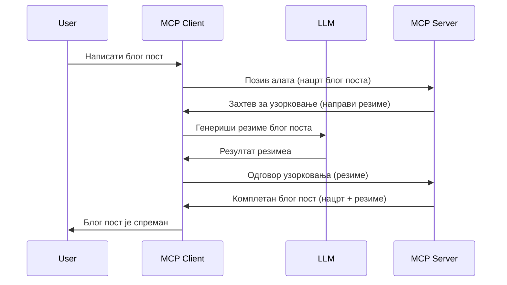

# Узорак - делегирање функција клијенту

Понекад је потребно да MCP клијент и MCP сервер сарађују како би постигли заједнички циљ. Можда имате ситуацију у којој сервер треба помоћ LLM-а који се налази на клијенту. За овакву ситуацију треба користити узорковање.

Хајде да истражимо неке случајеве употребе и како изградити решење које укључује узорковање.

## Преглед

У овој лекцији фокусирамо се на објашњење када и где користити узорковање и како га конфигурисати.

## Циљеви учења

У овом поглављу ћемо:

- Објаснити шта је узорковање и када га користити.
- Показати како конфигурисати узорковање у MCP-у.
- Пружити примере употребе узорковања.

## Шта је узорковање и зашто га користити?

Узорковање је напредна функција која ради на следећи начин:


### Захтев за узорковање

У реду, сада имамо широк преглед релевантног сценарија, хајде да причамо о захтеву за узорковање који сервер шаље назад клијенту. Ево како такав захтев може изгледати у JSON-RPC формату:

```json
{
  "jsonrpc": "2.0",
  "id": 1,
  "method": "sampling/createMessage",
  "params": {
    "messages": [
      {
        "role": "user",
        "content": {
          "type": "text",
          "text": "Create a blog post summary of the following blog post: <BLOG POST>"
        }
      }
    ],
    "modelPreferences": {
      "hints": [
        {
          "name": "claude-3-sonnet"
        }
      ],
      "intelligencePriority": 0.8,
      "speedPriority": 0.5
    },
    "systemPrompt": "You are a helpful assistant.",
    "maxTokens": 100
  }
}
```

Постоје неке ствари које вреди истаћи:

- Подразумевани текст, у content -> text, је наш упит који је инструкција LLM-у да сумирати садржај блог поста.

- **modelPreferences**. Овај део је баш то, преференца, препорука о којој конфигурацији да се користи са LLM-ом. Корисник може изабрати да ли ће пратити ове препоруке или их променити. У овом случају постоје препоруке о моделу који треба користити као и приоритету брзине и интелигенције.
- **systemPrompt**, ово је ваш уобичајени системски упит који вашем LLM-у даје личност и садржи упутства.
- **maxTokens**, ово је још једно својство које каже колико токена је препоручено за овај задатак.

### Одговор на узорковање

Овај одговор MCP клијент на крају шаље назад MCP серверу и резултат је клијентовог позива LLM-у, чекања тог одговора и затим конструисања ове поруке. Ево како може изгледати у JSON-RPC формату:

```json
{
  "jsonrpc": "2.0",
  "id": 1,
  "result": {
    "role": "assistant",
    "content": {
      "type": "text",
      "text": "Here's your abstract <ABSTRACT>"
    },
    "model": "gpt-5",
    "stopReason": "endTurn"
  }
}
```

Приметите како је одговор апстракт блог поста баш онакав какав смо тражили. Такође, обратите пажњу да коришћени `model` није онај за који смо тражили, већ "gpt-5" уместо "claude-3-sonnet". Ово илуструје да корисник може променити мишљење о томе шта да користи и да је захтев за узорковање препорука.

У реду, сада када разумемо главни ток, и користан задатак за његову употребу "креирање блог поста + апстракт", погледајмо шта треба да урадимо да би функционисало.

### Типови порука

Поруке за узорковање нису ограничене само на текст, већ можете слати и слике и аудио. Ево како JSON-RPC изгледа другачије:

**Текст**

```json
{
  "type": "text",
  "text": "The message content"
}
```

**Садржај слике**

```json
{
  "type": "image",
  "data": "base64-encoded-image-data",
  "mimeType": "image/jpeg"
}
```

**Аудио садржај**

```json
{
  "type": "audio",
  "data": "base64-encoded-audio-data",
  "mimeType": "audio/wav"
}
```

> НАПОМЕНА: за детаљније информације о узорковању, погледајте [званичну документацију](https://modelcontextprotocol.io/specification/2025-06-18/client/sampling)

## Како конфигурисати узорковање у клијенту

> Напомена: ако градиш само сервер, овде нема много посла.

У клијенту потребно је на следећи начин одредити ову функцију:

```json
{
  "capabilities": {
    "sampling": {}
  }
}
```

Ово ће бити препознато када ваш изабрани клијент инициализује везу са сервером.

## Пример узорковања у акцији - Креирање блог поста

Хајде да заједно кодирамо сервер за узорковање, морамо да урадимо следеће:

1. Креирати алатку на серверу.
1. Та алатка треба да направи захтев за узорковање.
1. Алатка треба да сачека одговор на захтев за узорковање клијента.
1. Затим треба произвести резултат алатке.

Погледајмо код корак по корак:

### -1- Креирање алатке

**python**

```python
@mcp.tool()
async def create_blog(title: str, content: str, ctx: Context[ServerSession, None]) -> str:
    """Create a blog post and generate a summary"""

```

### -2- Креирање захтева за узорковање

Проширите вашу алатку следећим кодом:

**python**

```python
post = BlogPost(
        id=len(posts) + 1,
        title=title,
        content=content,
        abstract=""
    )

prompt = f"Create an abstract of the following blog post: title: {title} and draft: {content} "

result = await ctx.session.create_message(
        messages=[
            SamplingMessage(
                role="user",
                content=TextContent(type="text", text=prompt),
            )
        ],
        max_tokens=100,
)

```

### -3- Чекање одговора и враћање одговора

**python**

```python
post.abstract = result.content.text

posts.append(post)

# врати цео производ
return json.dumps({
    "id": post.title,
    "abstract": post.abstract
})
```

### -4- Потпуни код

**python**

```python
from starlette.applications import Starlette
from starlette.routing import Mount, Host

from mcp.server.fastmcp import Context, FastMCP

from mcp.server.session import ServerSession
from mcp.types import SamplingMessage, TextContent

import json


from uuid import uuid4
from typing import List
from pydantic import BaseModel


mcp = FastMCP("Blog post generator")

# app = FastAPI()

posts = []

class BlogPost(BaseModel):
    id: int
    title: str
    content: str
    abstract: str

posts: List[BlogPost] = []

@mcp.tool()
async def create_blog(title: str, content: str, ctx: Context[ServerSession, None]) -> str:
    """Create a blog post and generate a summary"""

    post = BlogPost(
        id=len(posts) + 1,
        title=title,
        content=content,
        abstract=""
    )

    prompt = f"Create an abstract of the following blog post: title: {title} and draft: {content} "

    result = await ctx.session.create_message(
        messages=[
            SamplingMessage(
                role="user",
                content=TextContent(type="text", text=prompt),
            )
        ],
        max_tokens=100,
    )

    post.abstract = result.content.text

    posts.append(post)

    # вратити цео блог пост
    return json.dumps({
        "id": post.title,
        "abstract": post.abstract
    })

if __name__ == "__main__":
    print("Starting server...")
    # mcp.run()
    mcp.run(transport="streamable-http")

# покренути апликацију са: python server.py
```

### -5- Тестирање у Visual Studio Code

За тестирање у Visual Studio Code урадите следеће:

1. Покрените сервер у терминалу
1. Додајте га у *mcp.json* (и уверите се да је покренут) нпр. овако:

   ```json
   "servers": {
      "blog-server": {
        "type": "http",
        "url": "http://localhost:8000/mcp"
      }
   }
   ```

1. Унесите упит:

   ```text
   create a blog post named "Where Python comes from", the content is "Python is actually named after Monty Python Flying Circus"
   ```

1. Дозволите узорковање. При првом тесту добићете додатни дијалог који треба да прихватите, затим ћете видети уобичајени дијалог који вас тражи да покренете алатку

1. Прегледајте резултате. Резултате ћете видети лепо приказане у GitHub Copilot Chat-у али можете погледати и сиромашни JSON одговор.

**Бонус**. Visual Studio Code алатке имају одличну подршку за узорковање. Можете подесити приступ узорковању на вашем инсталираном серверу на следећи начин:

1. Идите у одељак са екстензијама.
1. Изаберите икону зупчаника за ваш инсталирани сервер у одељку "MCP SERVERS - INSTALLED".
1. Изаберите "Configure Model Access", овде можете изабрати које моделе GitHub Copilot може користити током узорковања. Такође можете видети све недавно извршене захтеве за узорковање кликом на "Show Sampling requests".

## Задатак

У овом задатку направићете мало другачију интеграцију узорковања, конкретно интеграцију за генерисање описа производа. Ево вашег сценарија:

**Сценарио**: Радник у позадинском одељењу е-трговине треба помоћ, предуго му траје да генерише описе производа. Зато треба да направите решење где можете позвати алатку "create_product" са аргументима "title" и "keywords" и требало би да произведе комплетан производ укључујући и поље "description" које треба да попуни LLM са клијентове стране.

САВЕТ: искористите оно што сте раније научили о конструкцији овог сервера и његове алатке користећи захтев за узорковање.

## Решење

[Решење](./solution/README.md)

## Главне поуке

Узорковање је јака функција која омогућава серверу да делегира задатке клијенту када му треба помоћ LLM-а.

## Шта следи

- [Поглавље 4 - Практична примена](../../04-PracticalImplementation/README.md)

---

<!-- CO-OP TRANSLATOR DISCLAIMER START -->
**Одрицање од одговорности**:  
Овај документ је преведен помоћу AI сервиса за превођење [Co-op Translator](https://github.com/Azure/co-op-translator). Иако тежимо прецизности, молимо имајте у виду да аутоматизовани преводи могу садржати грешке или нетачности. Изворни документ на његовом оригиналном језику треба сматрати ауторитетним извором. За критичне информације препоручује се професионални превод од стране стручних људи. Нисмо одговорни за било каква неспоразума или погрешне тумачења настала коришћењем овог превода.
<!-- CO-OP TRANSLATOR DISCLAIMER END -->