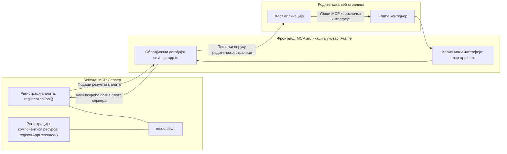

# MCP апликације

MCP апликације су нови парадигма у MCP-у. Идеја је да не само што враћате податке као резултат позива алата, већ и да пружите информације о томе како би се са тим подацима требало интерактивно радити. То значи да резултати алата сада могу да садрже информације о корисничком интерфејсу. Зашто бисмо то желели? Па, размислите како данас радите ствари. Вероватно конзумирате резултате MCP сервера тако што стављате неки фронтенд испред њега, то је код који морате да пишете и одржавате. Понекад је то оно што желите, али понекад би било сјајно ако бисте могли једноставно донети исечак информација који је самосталан и има све од података до корисничког интерфејса.

## Преглед

Ова лекција пружа практичне смернице о MCP апликацијама, како да почнете са њима и како да их интегришете у ваше постојеће веб апликације. MCP апликације су врло нов додатак MCP стандарду.

## Циљеви учења

До краја ове лекције бићете у могућности да:

- Објасните шта су MCP апликације.
- Када користити MCP апликације.
- Израдите и интегришете своје MCP апликације.

## MCP апликације – како функционишу

Идеја MCP апликација је да се обезбеди одговор који је суштински компонентa за рендеровање. Такав компонент може имати и визуеле и интерактивност, нпр. кликове тастера, унос корисника и друго. Хајде да почнемо са серверском страном и нашим MCP сервером. Да бисте креирали MCP апликацију као компоненту, потребно је да направите алат али и ресурс апликације. Ове две половине повезане су преко resourceUri.

Ево једног примера. Хајде да покушамо визуализовати шта је укључено и које делове шта раде:

```text
server.ts -- responsible for registering tools and the component as a UI component
src/
  mcp-app.ts -- wiring up event handlers
mcp-app.html -- the user interface
```

Ова визуелизација описује архитектуру за креирање компоненте и његове логике.


Хајде да опишемо одговорности за backend и frontend редом.

### Бекенд

Постоје две ствари које треба да постигнемо овде:

- Регистрацију алата са којима желимо да интерагујемо.
- Дефинисање компоненте.

**Регистрација алата**

```typescript
registerAppTool(
    server,
    "get-time",
    {
      title: "Get Time",
      description: "Returns the current server time.",
      inputSchema: {},
      _meta: { ui: { resourceUri } }, // Повезује овај алат са његовим UI ресурсом
    },
    async () => {
      const time = new Date().toISOString();
      return { content: [{ type: "text", text: time }] };
    },
  );

```

Горњи код описује понашање, где излаже алат зван `get-time`. Он не прима уносе, али производи тренутно време. Имамо могућност да дефинишемо `inputSchema` за алате када треба да прихвате унос корисника.

**Регистрација компоненте**

У истом фајлу, такође треба да региструјемо компоненту:

```typescript
const resourceUri = "ui://get-time/mcp-app.html";

// Региструјте ресурс, који враћа упаковани HTML/JavaScript за кориснички интерфејс.
registerAppResource(
  server,
  resourceUri,
  resourceUri,
  { mimeType: RESOURCE_MIME_TYPE },
  async () => {
    const html = await fs.readFile(path.join(DIST_DIR, "mcp-app.html"), "utf-8");

    return {
    contents: [
        { uri: resourceUri, mimeType: RESOURCE_MIME_TYPE, text: html },
    ],
    };
  },
);
```

Обратите пажњу како се помиње `resourceUri` да би се повезала компонента са својим алатима. Такође је занимљив callback где се учитава UI фајл и враћа компонента.

### Фронтенд компоненте

Као и за бекенд, постоје два дела овде:

- Фронтенд написан у чистом HTML-у.
- Код који обрађује догађаје и шта треба урадити, нпр. позив алата или слање порука родитељском прозору.

**Кориснички интерфејс**

Погледајмо кориснички интерфејс.

```html
<!-- mcp-app.html -->
<!DOCTYPE html>
<html lang="en">
  <head>
    <meta charset="UTF-8" />
    <title>Get Time App</title>
  </head>
  <body>
    <p>
      <strong>Server Time:</strong> <code id="server-time">Loading...</code>
    </p>
    <button id="get-time-btn">Get Server Time</button>
    <script type="module" src="/src/mcp-app.ts"></script>
  </body>
</html>
```

**Повезивање догађаја**

Последњи део је повезивање догађаја. То значи да идентификујемо који део у нашем UI-ју треба handlere догађаја и шта урадити када се догађаји покрену:

```typescript
// mcp-app.ts

import { App } from "@modelcontextprotocol/ext-apps";

// Узми референце елемената
const serverTimeEl = document.getElementById("server-time")!;
const getTimeBtn = document.getElementById("get-time-btn")!;

// Креирај инстанцу апликације
const app = new App({ name: "Get Time App", version: "1.0.0" });

// Обради резултате алата са сервера. Постави пре `app.connect()` да би се избегло
// пропуштање почетног резултата алата.
app.ontoolresult = (result) => {
  const time = result.content?.find((c) => c.type === "text")?.text;
  serverTimeEl.textContent = time ?? "[ERROR]";
};

// Повежи кликове на дугме
getTimeBtn.addEventListener("click", async () => {
  // `app.callServerTool()` омогућава корисничком интерфејсу да затражи нове податке са сервера
  const result = await app.callServerTool({ name: "get-time", arguments: {} });
  const time = result.content?.find((c) => c.type === "text")?.text;
  serverTimeEl.textContent = time ?? "[ERROR]";
});

// Повежи се на хост
app.connect();
```

Као што видите из горе наведеног, ово је нормалан код за повезивање DOM елемената са догађајима. Вредно је истаћи позив `callServerTool` који позива алат на бекенду.

## Рад са уносом корисника

До сада смо видели компоненту која има тастер који када се кликне позива алат. Хајде да додамо више UI елемената као што је поље за унос и видимо можемо ли послати аргументе алату. Имплементираћемо FAQ функционалност. Ево како треба да ради:

- Треба да постоји тастер и поље за унос где корисник укуца кључну реч за претрагу, на пример "Shipping". Ово треба да позове алат на бекенду који ради претрагу у FAQ подацима.
- Алат који подржава поменуту FAQ претрагу.

Прво додајмо неопходну подршку на бекенду:

```typescript
const faq: { [key: string]: string } = {
    "shipping": "Our standard shipping time is 3-5 business days.",
    "return policy": "You can return any item within 30 days of purchase.",
    "warranty": "All products come with a 1-year warranty covering manufacturing defects.",
  }

registerAppTool(
    server,
    "get-faq",
    {
      title: "Search FAQ",
      description: "Searches the FAQ for relevant answers.",
      inputSchema: zod.object({
        query: zod.string().default("shipping"),
      }),
      _meta: { ui: { resourceUri: faqResourceUri } }, // Повезује овај алат са његовим UI ресурсом
    },
    async ({ query }) => {
      const answer: string = faq[query.toLowerCase()] || "Sorry, I don't have an answer for that.";
      return { content: [{ type: "text", text: answer }] };
    },
  );
```

Овде видимо како попуњавамо `inputSchema` и дајемо му `zod` шему овако:

```typescript
inputSchema: zod.object({
  query: zod.string().default("shipping"),
})
```

У горе наведеном примеру шеме декларишемо да имамо параметар уноса зван `query` и да је опционалан са подразумеваном вредношћу "shipping".

У реду, хајде да пређемо на *mcp-app.html* да видимо који UI треба да направимо:

```html
<div class="faq">
    <h1>FAQ response</h1>
    <p>FAQ Response: <code id="faq-response">Loading...</code></p>
    <input type="text" id="faq-query" placeholder="Enter FAQ query" />
    <button id="get-faq-btn">Get FAQ Response</button>
  </div>
```

Сјајно, сада имамо поље за унос и тастер. Хајде да одмах идемо у *mcp-app.ts* да повежемо ове догађаје:

```typescript
const getFaqBtn = document.getElementById("get-faq-btn")!;
const faqQueryInput = document.getElementById("faq-query") as HTMLInputElement;

getFaqBtn.addEventListener("click", async () => {
  const query = faqQueryInput.value;
  const result = await app.callServerTool({ name: "get-faq", arguments: { query } });
  const faq = result.content?.find((c) => c.type === "text")?.text;
  faqResponseEl.textContent = faq ?? "[ERROR]";
});
```

У горе наведеном коду ми:

- Креирамо референце на интерактивне UI елементе.
- Обрађујемо клик на тастер да раздвојимо вредност из поља за унос и такође позивамо `app.callServerTool()` са `name` и `arguments` где се у овом случају прослеђује `query` као вредност.

Шта се заправо дешава када позовете `callServerTool` је да шаље поруку родитељском прозору и тај прозор позива MCP сервер.

### Испробајте

Када ово испробамо треба да видимо следеће:


А овако изгледа када пробамо са уносом као што је "warranty"


Да бисте покренули овај код, идите у [Code секцију](./code/README.md).

## Тестирање у Visual Studio Code-у

Visual Studio Code има одличну подршку за MCP апликације и вероватно је један од најлакших начина за тестирање ваших MCP апликација. Да бисте користили Visual Studio Code, додајте унос сервера у *mcp.json* овако:

```json
"my-mcp-server-7178eca7": {
    "url": "http://localhost:3001/mcp",
    "type": "http"
  }
```

Затим покрените сервер, требало би да будете у могућности да комуницирате са вашом MCP апликацијом кроз Чат прозор под условом да имате инсталиран GitHub Copilot.

Можете га покренути кроз prompt, на пример „#get-faq“:


и баш као када сте га покренули преко веб прегледача, приказује се на исти начин овако:


## Задатак

Направите игру пијан камен маказе. Требало би да се састоји од следећег:

UI:

- падајућа листа са опцијама
- тастер за слање избора
- етикета која показује ко је шта изабрао и ко је победио

Сервер:

- треба да има алат пијан камен маказе који узима "choice" као унос. Требало би такође да генерише избор рачунара и одреди победника

## Решење

[Решење](./assignment/README.md)

## Резиме

Учимо о овом новом парадигму MCP апликација. То је нови парадигма који омогућава MCP серверима да имају став не само о подацима већ и о томе како ти подаци треба да буду приказани.

Поред тога, научили смо да су ове MCP апликације хостоване у IFrame-у и да би комуницирале са MCP серверима морале да шаљу поруке родитељској веб апликацији. Постоје бројне библиотеке како за чисти JavaScript тако и React и друге које олакшавају ову комуникацију.

## Кључне поуке

Ево шта сте научили:

- MCP апликације су нови стандард који може бити користан када желите да испоручите како податке тако и UI функционалности.
- Ове апликације се покрећу у IFrame-у из безбедносних разлога.

## Следеће

- [Поглавље 4](../../04-PracticalImplementation/README.md)

---

<!-- CO-OP TRANSLATOR DISCLAIMER START -->
**Одрицање од одговорности**:  
Овај документ је преведен помоћу AI услуге за превођење [Co-op Translator](https://github.com/Azure/co-op-translator). Иако тежимо прецизности, молимо имајте у виду да аутоматизовани преводи могу садржати грешке или нетачности. Оригинални документ на његовом изворном језику треба сматрати ауторитетом. За критичне информације препоручује се професионалан људски превод. Нисмо одговорни за било каква неспоразума или погрешна тумачења која могу настати коришћењем овог превода.
<!-- CO-OP TRANSLATOR DISCLAIMER END -->