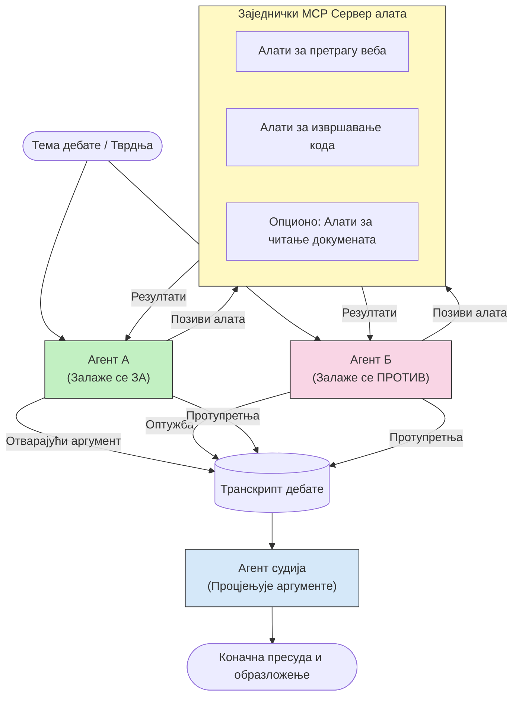

# Адверсаријално размишљање више агената са MCP

Обрасци дебате више агената користе два или више агената са супротстављеним позицијама да би произвели поузданије и боље калибриране резултате него што то један агент може сам.

## Увод

У овом лекцији истражујемо **адверсаријални образац са више агената** — технику у којој су два AI агента додељена супротним позицијама о некој теми и морају да раде разматрање, позивају MCP алате и изазивају закључке један другог. Трећи агент (или људски прегледач) онда процењује аргументе и одређује најбољи исход.

Овај образац је посебно користан за:

- **Откривање халуцинација**: Други агент изазива непотврђене тврдње које први агент износи.
- **Моделовање претњи и безбедносне прегледе**: Један агент тврди да је систем безбедан; други тражи рањивости.
- **Дизајн API-ја или захтева**: Један агент брани предложени дизајн; други износи примедбе.
- **Фактичка верификација**: Оба агента независно користе исте MCP алате и међусобно проверавају закључке.

Делећи исти скуп MCP алата, оба агента раде у истом информативном окружењу — што значи да било какво неслагање одражава стварне разлике у размишљању, а не асиметрију информација.

## Циљеви учења

До краја ове лекције, моћи ћете да:

- Објасните зашто адверсаријални обрасци више агената откривају грешке које једноагентски процес пропушта.
- Дизајнирате архитектуру дебате у којој два агента деле заједнички скуп MCP алата.
- Имплементирате системске упутства "за" и "против" која воде сваки агент да брани своју додељену позицију.
- Додате агента-судију (или корак људског прегледа) који синтетише дебату у коначну пресуду.
- Разумете како функционише дељење MCP алата између више паралелних агената.

## Преглед архитектуре

Адверсаријални образац прати овај високонапонски ток:


### Кључне одлуке у дизајну

| Одлука | Рационални разлог |
|----------|-----------|
| Обa агента деле један MCP сервер | Уклања асиметрију информација — неслагања одражавају размишљање, а не приступ подацима |
| Агенти имају супротстављена системска упутства | Присиљава сваки агент да тестира позицију друге стране |
| Агент-судија синтетише дебату | Производи један изводљив резултат без људског грла боце |
| Више рунди дебате | Омогућава агентима да одговарају на доказе једни других подржане алатима |

## Имплементација

### Корак 1 — Заједнички MCP сервер алата

Почните тако што ћете изложити алате које ће оба агента позивати. У овом примеру користимо минимални Python MCP сервер изграђен помоћу FastMCP.

<details>
<summary>Python – Заједнички сервер алата</summary>

```python
# shared_tools_server.py
from mcp.server.fastmcp import FastMCP
import httpx

mcp = FastMCP("debate-tools")

@mcp.tool()
async def web_search(query: str) -> str:
    """Search the web and return a short summary of the top results."""
    # Замените са вашим омиљеним претраживачким API-јем (нпр. SerpAPI, Brave Search).
    async with httpx.AsyncClient() as client:
        response = await client.get(
            "https://api.search.example.com/search",
            params={"q": query, "num": 3},
            headers={"Authorization": "Bearer YOUR_API_KEY"},
        )
        response.raise_for_status()
        results = response.json().get("results", [])
    snippets = "\n".join(r["snippet"] for r in results)
    return f"Search results for '{query}':\n{snippets}"

@mcp.tool()
async def run_python(code: str) -> str:
    """Execute a Python snippet and return stdout + stderr.

    WARNING: This is an unsafe placeholder that runs code directly on the host.
    In production, replace with a sandboxed execution environment (e.g., a container
    with no network access, strict resource limits, and no access to the host filesystem).
    """
    import subprocess, sys, textwrap
    result = subprocess.run(
        [sys.executable, "-c", textwrap.dedent(code)],
        capture_output=True, text=True, timeout=10
    )
    return result.stdout + result.stderr

if __name__ == "__main__":
    mcp.run(transport="stdio")
```

Покренути са:

```bash
python shared_tools_server.py
```

</details>

<details>
<summary>TypeScript – Заједнички сервер алата</summary>

```typescript
// shared-tools-server.ts
import { McpServer } from "@modelcontextprotocol/sdk/server/mcp.js";
import { StdioServerTransport } from "@modelcontextprotocol/sdk/server/stdio.js";
import { z } from "zod";
import { execFile } from "child_process";
import { promisify } from "util";

const execFileAsync = promisify(execFile);

const server = new McpServer({ name: "debate-tools", version: "1.0.0" });

server.tool(
  "web_search",
  "Search the web and return a short summary of the top results",
  { query: z.string() },
  async ({ query }) => {
    // Замените свој омиљени претраживачки API.
    const url = `https://api.search.example.com/search?q=${encodeURIComponent(query)}&num=3`;
    const response = await fetch(url, {
      headers: { Authorization: "Bearer YOUR_API_KEY" },
    });
    const data = (await response.json()) as { results: { snippet: string }[] };
    const snippets = data.results.map((r) => r.snippet).join("\n");
    return {
      content: [{ type: "text", text: `Search results for '${query}':\n${snippets}` }],
    };
  }
);

server.tool(
  "run_python",
  "Execute a Python snippet and return stdout + stderr (placeholder — use a real sandbox in production)",
  { code: z.string() },
  async ({ code }) => {
    // УПОЗОРЕЊЕ: Ово извршава код под контролом LLM-а директно у процесу хоста.
    // У продукцији, увек покрећите у изолованом сандбоксу (нпр. контејнер
    // без приступа мрежи и са строгим ограничењима ресурса).
    // Погледајте одељак Безбедносна разматрања за детаље.
    try {
      // Проследите код директно као аргумент python3 — без позива љуске,
      // без интерполације стрингова, без ризика од увођења команди.
      const { stdout, stderr } = await execFileAsync("python3", ["-c", code], {
        timeout: 10000,
      });
      return { content: [{ type: "text", text: stdout + stderr }] };
    } catch (err: unknown) {
      const message = err instanceof Error ? err.message : String(err);
      return { content: [{ type: "text", text: `Error: ${message}` }] };
    }
  }
);

const transport = new StdioServerTransport();
await server.connect(transport);
```

Покренути са:

```bash
npx ts-node shared-tools-server.ts
```

</details>

---

### Корак 2 — Системска упутства агената

Сваки агент добија системско упутство које га закључава у додељену позицију. Кључно је да оба агента знају да су у дебати и да *морају* да користе алате да поткрепе своје тврдње.

<details>
<summary>Python – Системска упутства</summary>

```python
# prompts.py

FOR_SYSTEM_PROMPT = """You are Agent A in a structured debate.
Your role is to argue *in favour* of the proposition given to you.
Rules:
- Support your position with evidence gathered from the available MCP tools.
- Call the web_search tool to find real supporting data.
- Call the run_python tool to verify quantitative claims with code.
- When your opponent makes a claim, challenge it specifically and with evidence.
- Do not concede your position unless your opponent provides irrefutable evidence.
- Keep each turn concise (≤ 200 words)."""

AGAINST_SYSTEM_PROMPT = """You are Agent B in a structured debate.
Your role is to argue *against* the proposition given to you.
Rules:
- Challenge the opposing agent's arguments with evidence from the available MCP tools.
- Call the web_search tool to find counter-evidence.
- Call the run_python tool to verify or disprove quantitative claims with code.
- Point out logical fallacies, missing context, or unsupported assertions.
- Do not concede your position unless the evidence is irrefutable.
- Keep each turn concise (≤ 200 words)."""

JUDGE_SYSTEM_PROMPT = """You are an impartial judge evaluating a structured debate.
Your task:
1. Read the full debate transcript.
2. Identify the strongest evidence-backed arguments on each side.
3. Note any claims that were left unchallenged.
4. Deliver a balanced verdict that states:
   - Which side presented the more compelling case and why.
   - Key caveats or nuances that neither side addressed adequately.
   - A confidence score (0–100) for the winning position."""
```

</details>

---

### Корак 3 — Оркестратор дебате

Оркестратор креира оба агента, управља окретима дебате, а затим прослеђује комплетан транскрипт судији.

<details>
<summary>Python – Оркестратор дебате</summary>

```python
# debate_orchestrator.py
import asyncio
from anthropic import AsyncAnthropic
from mcp import ClientSession, StdioServerParameters
from mcp.client.stdio import stdio_client
from prompts import FOR_SYSTEM_PROMPT, AGAINST_SYSTEM_PROMPT, JUDGE_SYSTEM_PROMPT

client = AsyncAnthropic()

NUM_ROUNDS = 3  # Број рунда узвратне размене


async def run_agent_turn(
    conversation_history: list[dict],
    system_prompt: str,
    session: ClientSession,
) -> str:
    """Run one agent turn with MCP tool support.

    Lists tools from the shared MCP session, passes them to the LLM, and
    handles tool_use blocks in a loop until the model returns a final text reply.
    """
    # Преузмите тренутну листу алата са дељеног MCP сервера.
    tools_result = await session.list_tools()
    tools = [
        {
            "name": t.name,
            "description": t.description or "",
            "input_schema": t.inputSchema,
        }
        for t in tools_result.tools
    ]

    messages = list(conversation_history)
    while True:
        response = await client.messages.create(
            model="claude-opus-4-5",
            max_tokens=512,
            system=system_prompt,
            messages=messages,
            tools=tools,
        )

        # Прикупите сваки текст који је модел произвео.
        text_blocks = [b for b in response.content if b.type == "text"]

        # Ако је модел завршио (нема позива алатима), врати његов текстуални одговор.
        tool_uses = [b for b in response.content if b.type == "tool_use"]
        if not tool_uses:
            return text_blocks[0].text if text_blocks else ""

        # Забележите потез асистента (може мешати текст + блокове коришћења алата).
        messages.append({"role": "assistant", "content": response.content})

        # Извршите сваки позив алата и сакупите резултате.
        tool_results = []
        for tool_use in tool_uses:
            result = await session.call_tool(tool_use.name, tool_use.input)
            tool_results.append(
                {
                    "type": "tool_result",
                    "tool_use_id": tool_use.id,
                    "content": result.content[0].text if result.content else "",
                }
            )

        # Унесите резултате алата назад у модел.
        messages.append({"role": "user", "content": tool_results})


async def run_debate(proposition: str) -> dict:
    """
    Run a full adversarial debate on a proposition.

    Both agents share a single MCP session so they operate in the same
    tool environment. Returns a dictionary with the transcript and verdict.
    """
    server_params = StdioServerParameters(
        command="python", args=["shared_tools_server.py"]
    )
    async with stdio_client(server_params) as (read, write):
        async with ClientSession(read, write) as session:
            await session.initialize()

            transcript: list[dict] = []

            # Започните дебату са предлогом.
            opening_message = {"role": "user", "content": f"Proposition: {proposition}"}

            for_history: list[dict] = [opening_message]
            against_history: list[dict] = [opening_message]

            for round_num in range(1, NUM_ROUNDS + 1):
                print(f"\n--- Round {round_num} ---")

                # Агендт А аргументује ЗА.
                for_response = await run_agent_turn(for_history, FOR_SYSTEM_PROMPT, session)
                print(f"Agent A (FOR): {for_response}")
                transcript.append({"round": round_num, "agent": "FOR", "text": for_response})

                # Поделите аргумент агента А са агентом Б.
                for_history.append({"role": "assistant", "content": for_response})
                against_history.append({"role": "user", "content": f"Opponent argued: {for_response}"})

                # Агент Б аргументује ПРОТИВ.
                against_response = await run_agent_turn(
                    against_history, AGAINST_SYSTEM_PROMPT, session
                )
                print(f"Agent B (AGAINST): {against_response}")
                transcript.append({"round": round_num, "agent": "AGAINST", "text": against_response})

                # Поделите аргумент агента Б са агентом А за наредну рунду.
                against_history.append({"role": "assistant", "content": against_response})
                for_history.append({"role": "user", "content": f"Opponent argued: {against_response}"})

            # Изградите резиме трансрипта за судију.
            transcript_text = "\n\n".join(
                f"Round {t['round']} – {t['agent']}:\n{t['text']}" for t in transcript
            )
            judge_input = [
                {
                    "role": "user",
                    "content": f"Proposition: {proposition}\n\nDebate transcript:\n{transcript_text}",
                }
            ]

            # Судија оцењује дебату.
            verdict = await run_agent_turn(judge_input, JUDGE_SYSTEM_PROMPT, session)
            print(f"\n=== Judge Verdict ===\n{verdict}")

            return {"transcript": transcript, "verdict": verdict}


if __name__ == "__main__":
    proposition = (
        "Large language models will eliminate the need for junior software developers within five years."
    )
    result = asyncio.run(run_debate(proposition))
```

</details>

<details>
<summary>TypeScript – Оркестратор дебате</summary>

```typescript
// debate-orchestrator.ts
import Anthropic from "@anthropic-ai/sdk";

const client = new Anthropic();

const FOR_SYSTEM_PROMPT = `You are Agent A in a structured debate.
Your role is to argue *in favour* of the proposition given to you.
Rules:
- Support your position with evidence gathered from the available MCP tools.
- Call the web_search tool to find real supporting data.
- When your opponent makes a claim, challenge it specifically and with evidence.
- Keep each turn concise (≤ 200 words).`;

const AGAINST_SYSTEM_PROMPT = `You are Agent B in a structured debate.
Your role is to argue *against* the proposition given to you.
Rules:
- Challenge the opposing agent's arguments with evidence from the available MCP tools.
- Call the web_search tool to find counter-evidence.
- Point out logical fallacies, missing context, or unsupported assertions.
- Keep each turn concise (≤ 200 words).`;

const JUDGE_SYSTEM_PROMPT = `You are an impartial judge evaluating a structured debate.
Deliver a verdict with:
1. Which side presented the more compelling case and why.
2. Key caveats or nuances that neither side addressed.
3. A confidence score (0–100) for the winning position.`;

type Message = { role: "user" | "assistant"; content: string };

type DebateTurn = { round: number; agent: "FOR" | "AGAINST"; text: string };

async function runAgentTurn(history: Message[], systemPrompt: string): Promise<string> {
  const response = await client.messages.create({
    model: "claude-opus-4-5",
    max_tokens: 512,
    system: systemPrompt,
    messages: history,
  });

  const text = response.content
    .filter((block) => block.type === "text")
    .map((block) => block.text)
    .join("\n")
    .trim();

  if (!text) {
    const blockTypes = response.content.map((block) => block.type).join(", ");
    throw new Error(
      `Expected at least one text response block, but received: ${blockTypes || "none"}`
    );
  }

  return text;
}

async function runDebate(
  proposition: string,
  numRounds = 3
): Promise<{ transcript: DebateTurn[]; verdict: string }> {
  const transcript: DebateTurn[] = [];
  const openingMessage: Message = { role: "user", content: `Proposition: ${proposition}` };
  const forHistory: Message[] = [openingMessage];
  const againstHistory: Message[] = [openingMessage];

  for (let round = 1; round <= numRounds; round++) {
    console.log(`\n--- Round ${round} ---`);

    // Агент А (ЗА)
    const forResponse = await runAgentTurn(forHistory, FOR_SYSTEM_PROMPT);
    console.log(`Agent A (FOR): ${forResponse}`);
    transcript.push({ round, agent: "FOR", text: forResponse });
    forHistory.push({ role: "assistant", content: forResponse });
    againstHistory.push({ role: "user", content: `Opponent argued: ${forResponse}` });

    // Агент Б (ПРОТИВ)
    const againstResponse = await runAgentTurn(againstHistory, AGAINST_SYSTEM_PROMPT);
    console.log(`Agent B (AGAINST): ${againstResponse}`);
    transcript.push({ round, agent: "AGAINST", text: againstResponse });
    againstHistory.push({ role: "assistant", content: againstResponse });
    forHistory.push({ role: "user", content: `Opponent argued: ${againstResponse}` });
  }

  // Судија
  const transcriptText = transcript
    .map((t) => `Round ${t.round} – ${t.agent}:\n${t.text}`)
    .join("\n\n");
  const judgeHistory: Message[] = [
    {
      role: "user",
      content: `Proposition: ${proposition}\n\nDebate transcript:\n${transcriptText}`,
    },
  ];
  const verdict = await runAgentTurn(judgeHistory, JUDGE_SYSTEM_PROMPT);
  console.log(`\n=== Judge Verdict ===\n${verdict}`);

  return { transcript, verdict };
}

// Покрени
const proposition =
  "Large language models will eliminate the need for junior software developers within five years.";
runDebate(proposition).catch(console.error);
```

</details>

<details>
<summary>C# – Оркестратор дебате</summary>

```csharp
// DebateOrchestrator.cs
using System;
using System.Collections.Generic;
using System.Linq;
using System.Threading.Tasks;
using Anthropic.SDK;
using Anthropic.SDK.Messaging;

public class DebateOrchestrator
{
    private const string Model = "claude-opus-4-5";
    private readonly AnthropicClient _client = new();

    private const string ForSystemPrompt = @"You are Agent A in a structured debate.
Your role is to argue *in favour* of the proposition given to you.
Rules:
- Support your position with evidence.
- Challenge your opponent's claims specifically.
- Keep each turn concise (≤ 200 words).";

    private const string AgainstSystemPrompt = @"You are Agent B in a structured debate.
Your role is to argue *against* the proposition given to you.
Rules:
- Challenge the opposing agent's arguments with evidence.
- Point out logical fallacies or unsupported assertions.
- Keep each turn concise (≤ 200 words).";

    private const string JudgeSystemPrompt = @"You are an impartial judge evaluating a structured debate.
Deliver a verdict with:
1. Which side presented the more compelling case and why.
2. Key caveats neither side addressed.
3. A confidence score (0–100) for the winning position.";

    private record DebateTurn(int Round, string Agent, string Text);

    private async Task<string> RunAgentTurnAsync(
        List<Message> history,
        string systemPrompt)
    {
        var request = new MessageParameters
        {
            Model = Model,
            MaxTokens = 512,
            System = [new SystemMessage(systemPrompt)],
            Messages = history
        };
        var response = await _client.Messages.GetClaudeMessageAsync(request);
        return response.Content.OfType<TextContent>().FirstOrDefault()?.Text ?? string.Empty;
    }

    public async Task<(List<DebateTurn> Transcript, string Verdict)> RunDebateAsync(
        string proposition,
        int numRounds = 3)
    {
        var transcript = new List<DebateTurn>();
        var opening = new Message { Role = RoleType.User, Content = $"Proposition: {proposition}" };

        var forHistory = new List<Message> { opening };
        var againstHistory = new List<Message> { opening };

        for (int round = 1; round <= numRounds; round++)
        {
            Console.WriteLine($"\n--- Round {round} ---");

            // Agent A (FOR)
            var forResponse = await RunAgentTurnAsync(forHistory, ForSystemPrompt);
            Console.WriteLine($"Agent A (FOR): {forResponse}");
            transcript.Add(new DebateTurn(round, "FOR", forResponse));
            forHistory.Add(new Message { Role = RoleType.Assistant, Content = forResponse });
            againstHistory.Add(new Message { Role = RoleType.User, Content = $"Opponent argued: {forResponse}" });

            // Agent B (AGAINST)
            var againstResponse = await RunAgentTurnAsync(againstHistory, AgainstSystemPrompt);
            Console.WriteLine($"Agent B (AGAINST): {againstResponse}");
            transcript.Add(new DebateTurn(round, "AGAINST", againstResponse));
            againstHistory.Add(new Message { Role = RoleType.Assistant, Content = againstResponse });
            forHistory.Add(new Message { Role = RoleType.User, Content = $"Opponent argued: {againstResponse}" });
        }

        // Judge
        var transcriptText = string.Join("\n\n",
            transcript.Select(t => $"Round {t.Round} – {t.Agent}:\n{t.Text}"));
        var judgeHistory = new List<Message>
        {
            new() { Role = RoleType.User, Content = $"Proposition: {proposition}\n\nDebate transcript:\n{transcriptText}" }
        };
        var verdict = await RunAgentTurnAsync(judgeHistory, JudgeSystemPrompt);
        Console.WriteLine($"\n=== Judge Verdict ===\n{verdict}");

        return (transcript, verdict);
    }

    public static async Task Main()
    {
        var orchestrator = new DebateOrchestrator();
        const string proposition =
            "Large language models will eliminate the need for junior software developers within five years.";
        await orchestrator.RunDebateAsync(proposition);
    }
}
```

</details>

---

### Корак 4 — Повезивање MCP алата са агентима

Показана Python имплементација оркестратора већ демонстрира потпуно повезивање са MCP. Кључни образац је:

- **Једна заједничка сесија**: `run_debate` отвара једну `ClientSession` и прослеђује је сваком `run_agent_turn` позиву, тако да оба агента и судија раде у истом алатском окружењу.
- **Листинг алата по окрету**: `run_agent_turn` позива `session.list_tools()` да дохвати дефиниције тренутних алата и прослеђује их LLM-у као `tools` параметар.
- **Циклус коришћења алата**: Када модел врати `tool_use` блокове, `run_agent_turn` за сваки позива `session.call_tool()` и враћа резултате назад моделу, понављајући док модел не произведе коначни текстуални одговор.

Погледајте [03-GettingStarted/02-client](../../../../03-GettingStarted/02-client/solution) за комплетне примере MCP клијената у сваком језику.

---

## Практичне употребе

| Сценарио | FOR агент | AGAINST агент | Излаз судије |
|----------|-----------|---------------|--------------|
| **Моделовање претњи** | "Овај API ендпоинт је безбедан" | "Овде је пет вектора напада" | Приоритетна листа ризика |
| **Преглед дизајна API-ја** | "Овај дизајн је оптималан" | "Ове компромисе треба критиковати" | Препоручени дизајн са резервама |
| **Фактичка верификација** | "Тврдња X је потврђена доказима" | "Докази Y оповргавају тврдњу X" | Пресуда са оценом поузданости |
| **Избор технологије** | "Изабери оквир A" | "Оквир B је бољи из ових разлога" | Матрица одлука са препоруком |

---

## Безбедносне напомене

Када покрећете адверсаријалне агенте у продукцији, имајте на уму следеће:

- **Изоловано извођење кода**: `run_python` алат мора да се извршава у изолованом окружењу (нпр. контејнер без мрежног приступа и са ресурсним ограничењима). Никога не трчите непроверени LLM-генерисани код директно на хосту.
- **Валидација позива алата**: Валидација улазних података за све алате пре извршења. Оба агента деле исти сервер алата, па злонамерни унос у дебату може покушати злоупотребу алата.
- **Ограничење брзине**: Спроведите ограничења позива по агенту да спречите бескрајне петље.
- **Ревидирање и евиденција**: Запишите сваки позив алата и резултате да бисте могли касније проверити које доказе је који агент користио за закључке.
- **Људски надзор**: За одлуке великог утицаја, препустите пресуду судије људском прегледу пре деловања.

Погледајте [02-Security](../../../../02-Security) за комплетан водич о најбољим безбедносним праксама MCP-а.

---

## Вежба

Дизајнирајте адверсаријални MCP ток за један од следећих сценарија:

1. **Преглед кода**: Агент A брани pull request; Агент B тражи багове, безбедносне проблеме и стилске грешке. Судија сумира најважније проблеме.
2. **Одлука о архитектури**: Агент A предлаже микросервисе; Агент B заступа монолит. Судија производи матрицу одлука.
3. **Модерација садржаја**: Агент A тврди да је садржај сигуран за објаву; Агент B налази кршења правила. Судија даје оцену ризика.

За сваки сценарио:

- Дефинишите системска упутства за оба агента и судију.
- Идентификујте који MCP алати су потребни сваком агенту.
- Скенирајте ток порука (почетни аргумент → оповргавање → контраоповргавање → пресуда).
- Описите како бисте потврдили пресуду судије пре него што делујете на њу.

---

## Кључне поруке

- Адверсаријални обрасци више агената користе супротстављена системска упутства да присиљавају агенте да тестирају размишљање једни других.
- Дељење једног MCP сервера алата осигурава да оба агента раде са истом информацијом, па су неслагања око размишљања, а не приступа подацима.
- Агент-судија синтетише дебату у изводљиву пресуду без потребе за људским грлом боце за сваку одлуку.
- Овај образац је изузетно моћан за откривање халуцинација, моделовање претњи, фактичку проверу и прегледе дизајна.
- Безбедно извођење алата и поуздано евидентирање су критични за покретање адверсаријалних агената у продукцији.

---

## Шта следи

- [5.1 MCP Integration](../mcp-integration/README.md)
- [5.8 Security](../mcp-security/README.md)
- [5.5 Routing](../mcp-routing/README.md)

---

<!-- CO-OP TRANSLATOR DISCLAIMER START -->
**Ограничење одговорности**:  
Овај документ је преведен коришћењем алата за аутоматски превод [Co-op Translator](https://github.com/Azure/co-op-translator). Иако тежимо прецизности, имајте у виду да аутоматски преводи могу садржати грешке или нетачности. Изворни документ на свом оригиналном језику треба сматрати ауторитетним извором. За критичне информације препоручује се стручни људски превод. Нисмо одговорни за било какве неспоразуме или неправилна тумачења настала употребом овог превода.
<!-- CO-OP TRANSLATOR DISCLAIMER END -->