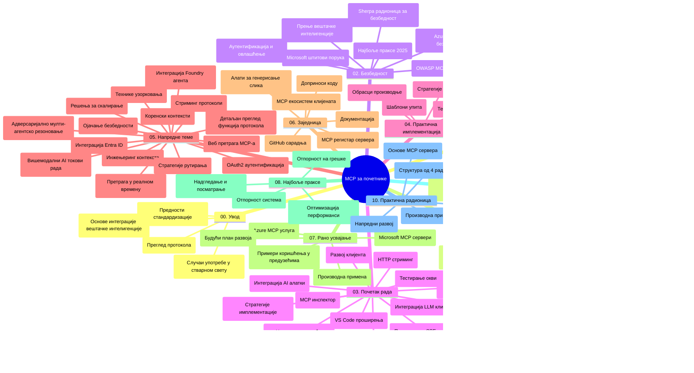

# Протокол контекста модела (MCP) за почетнике - Водич за учење

Овај водич за учење пружа преглед структуре и садржаја репозиторијума за курикулум "Протокол контекста модела (MCP) за почетнике". Користите овај водич да ефикасно навигирате репозиторијумом и искористите доступне ресурсе.

## Преглед репозиторијума

Протокол контекста модела (MCP) је стандардизован оквир за интеракцију између AI модела и клијент апликација. Почетно креиран од стране Anthropic-а, MCP сада одржава шира заједница MCP-а кроз званичну GitHub организацију. Овај репозиторијум пружа свеобухватан курикулум са практичним примерима кода у C#, Java, JavaScript, Python и TypeScript, намењен AI развојним инжењерима, архитектама система и софтверским инжењерима.

## Визуелна мапа курикулума

## Структура репозиторијума

Репозиторијум је организован у једанаест главних секција, од којих се свака фокусира на различите аспекте MCP-а:

1. **Увод (00-Introduction/)**
   - Преглед Протокола контекста модела
   - Зашто је стандардизација важна у AI процесима
   - Практични случајеви употребе и предности

2. **Основни појмови (01-CoreConcepts/)**
   - Клијент-сервер архитектура
   - Кључне компоненте протокола
   - Обрасци слања порука у MCP

3. **Безбедност (02-Security/)**
   - Безбедносне претње у MCP базираним системима
   - Најбоље праксе за осигурање имплементација
   - Стратегије аутентификације и ауторизације
   - **Свеобухватна документација о безбедности**:
     - MCP Безбедносне најбоље праксе 2025
     - Руковање безбедношћу садржаја Azure
     - Контроле и технике безбедности MCP-а
     - Брзи преглед најбољих пракси MCP-а
   - **Кључне безбедносне теме**:
     - Напади убризгавања упутстава и тровање алата
     - Отмица сесије и проблем "помешаног повереника"
     - Ранџирање токена
     - Прекомерна права и контролa приступа
     - Безбедност ланца снабдевања за AI компоненте
     - Интеграција Microsoft Prompt Shields-а

4. **Почетак рада (03-GettingStarted/)**
   - Постављање и конфигурација окружења
   - Креирање основних MCP сервера и клијената
   - Интеграција са постојећим апликацијама
   - Укључује секције за:
     - Прву имплементацију сервера
     - Развој клијента
     - Интеграцију LLM клијента
     - Интеграцију VS Code
     - Server-Sent Events (SSE) сервер
     - Напредну употребу сервера
     - HTTP стриминг
     - Интеграцију AI Toolkit
     - Стратегије тестирања
     - Упутства за деплои

5. **Практична имплементација (04-PracticalImplementation/)**
   - Коришћење SDK-ова у различитим програмским језицима
   - Технике дебаговања, тестирања и валидације
   - Креирање реупотребљивих шаблона упутстава и токова рада
   - Примери пројеката са имплементацијама

6. **Напредне теме (05-AdvancedTopics/)**
   - Технике инжењеринга контекста
   - Интеграција Foundry агента
   - Мулти-модални AI токови рада
   - Демонстрације OAuth2 аутентификације
   - Реал-тиме претраживање
   - Реал-тиме стриминг
   - Имплементација основних (root) контекста
   - Стратегије рутирања
   - Технике узорковања
   - Приступи масштабирању
   - Безбедносне разматрања
   - Интеграција Entra ID безбедности
   - Интеграција веб претраге
   - Адверзијално мулти-агентско разумевање (патерни дебате)

7. **Заједнички доприноси (06-CommunityContributions/)**
   - Како допринети кодом и документацијом
   - Сарадња преко GitHub-а
   - Побољшања и повратне информације од заједнице
   - Коришћење различитих MCP клијената (Claude Desktop, Cline, VSCode)
   - Рад са популарним MCP серверима укључујући генерисање слика

8. **Усвојене лекције (07-LessonsfromEarlyAdoption/)**
   - Реалне имплементације и успешне приче
   - Изградња и деплој MCP базираних решења
   - Трендови и будућа карта пута
   - **Водич за Microsoft MCP сервере**: Свеобухватан водич за 10 Microsoft MCP сервера спремних за продукцију укључујући:
     - Microsoft Learn Docs MCP сервер
     - Azure MCP сервер (15+ специјализованих конектора)
     - GitHub MCP сервер
     - Azure DevOps MCP сервер
     - MarkItDown MCP сервер
     - SQL Server MCP сервер
     - Playwright MCP сервер
     - Dev Box MCP сервер
     - Azure AI Foundry MCP сервер
     - Microsoft 365 Agents Toolkit MCP сервер

9. **Најбоље праксе (08-BestPractices/)**
   - Подешавање перформанси и оптимизација
   - Дизајн мањкавих и поузданих MCP система
   - Тестирање и стратегије отпорности

10. **Студије случајева (09-CaseStudy/)**
    - **Седам свеобухватних студија случаја** које показују флексибилност MCP-а у различитим сценаријима:
    - **Azure AI Travel Agents**: Оркестрација мулти-агената са Azure OpenAI и AI претрагом
    - **Интеграција Azure DevOps**: Аутоматизација радних токова са ажурирањима YouTube података
    - **Претраживање документације у реалном времену**: Python конзолни клијент са HTTP стримингом
    - **Интерактивни генератор студијског плана**: Chainlit веб апликација са конверзационим AI
    - **Документација у едитору**: VS Code интеграција са GitHub Copilot токовима рада
    - **Azure API управљање**: Интеграција ентерпрајз API-а са креирањем MCP сервера
    - **GitHub MCP Registry**: Развој екосистема и платформа за агентску интеграцију
    - Примери имплементација из области ентерпрајз интеграције, продуктивности програмера и развоја екосистема

11. **Практична радионица (10-StreamliningAIWorkflowsBuildingAnMCPServerWithAIToolkit/)**
    - Свеобухватна практична радионица која комбинује MCP са AI Toolkit-ом
    - Изградња интелигентних апликација које спајају AI моделе са алатима из стварног света
    - Практични модули који покривају основе, развој прилагођених сервера и стратегије продукционог деплоија
    - **Структура лабораторија**:
      - Лабораторија 1: Основи MCP сервера
      - Лабораторија 2: Напредни развој MCP сервера
      - Лабораторија 3: Интеграција AI Toolkit-а
      - Лабораторија 4: Деплој и масштабирање у продукцији
    - Приступ учењу заснованом на лабораторијама са корак-по-корак упутствима

12. **MCP сервер лабораторије са интеграцијом базе података (11-MCPServerHandsOnLabs/)**
    - **Свеобухватна учења са 13 лабораторија** за изградњу продукцијско спремних MCP сервера са интеграцијом PostgreSQL
    - **Примена аналитике у реалном свету за малопродају** користећи Zava Retail пример
    - **Обрасци класе ентерпрајз** укључујући Безбедност на нивоу редова (Row Level Security - RLS), семантичку претрагу и приступ мулти-најмтантима
    - **Комплетна структура лабораторија**:
      - **Лабораторије 00-03: Основе** - Увод, Архитектура, Безбедност, Постављање окружења
      - **Лабораторије 04-06: Изградња MCP сервера** - Дизајн базе података, Имплементација MCP сервера, Развој алата
      - **Лабораторије 07-09: Напредне функције** - Семантичка претрага, Тестирање и дебаговање, VS Code интеграција
      - **Лабораторије 10-12: Продукција и најбоље праксе** - Деплој, Мониторинг, Оптимизација
    - **Технологије које се користе**: FastMCP framework, PostgreSQL, Azure OpenAI, Azure Container Apps, Application Insights
    - **Резултати учења**: MCP сервери спремни за продукцију, обрасци интеграције са базама података, AI покретана аналитика, ентерпрајз безбедност

## Додатни ресурси

Репозиторијум укључује пратеће ресурсе:

- **Фолдер са сликама**: Садржи дијаграме и илустрације коришћене током курикулума
- **Преводи**: Подршка за више језика са аутоматизованим преводима документације
- **Званични MCP ресурси**:
  - [MCP документација](https://modelcontextprotocol.io/)
  - [MCP спецификација](https://spec.modelcontextprotocol.io/)
  - [MCP GitHub репозиторијум](https://github.com/modelcontextprotocol)

## Како користити овај репозиторијум

1. **Секвенцијално учење**: Пратите поглавља по реду (од 00 до 11) за структурисано искуство учења.
2. **Фокус на одређени језик**: Ако сте заинтересовани за одређени програмски језик, прегледајте директоријуме са примерима имплементација на жељеном језику.
3. **Практична имплементација**: Започните са секцијом "Почетак рада" да бисте поставили окружење и креирали први MCP сервер и клијента.
4. **Напредно истраживање**: Када савладате основе, подмакните у напредне теме за проширење знања.
5. **Заједничко ангажовање**: Придружите се MCP заједници кроз GitHub дискусије и Discord канале да бисте се повезали са стручњацима и другим програмерима.

## MCP клијенти и алати

Курикулум обухвата разне MCP клијенте и алате:

1. **Званични клијенти**:
   - Visual Studio Code
   - MCP у Visual Studio Code-у
   - Claude Desktop
   - Claude у VSCode
   - Claude API

2. **Клијенти заједнице**:
   - Cline (терминал)
   - Cursor (уређивач кода)
   - ChatMCP
   - Windsurf

3. **Управљачки алати за MCP**:
   - MCP CLI
   - MCP Manager
   - MCP Linker
   - MCP Router

## Популарни MCP сервери

Репозиторијум представља разне MCP сервере, укључујући:

1. **Званични Microsoft MCP сервери**:
   - Microsoft Learn Docs MCP сервер
   - Azure MCP сервер (15+ специјализованих конектора)
   - GitHub MCP сервер
   - Azure DevOps MCP сервер
   - MarkItDown MCP сервер
   - SQL Server MCP сервер
   - Playwright MCP сервер
   - Dev Box MCP сервер
   - Azure AI Foundry MCP сервер
   - Microsoft 365 Agents Toolkit MCP сервер

2. **Званични референтни сервери**:
   - Фајл систем
   - Fetch
   - Memory
   - Sequential Thinking

3. **Генерисање слика**:
   - Azure OpenAI DALL-E 3
   - Stable Diffusion WebUI
   - Replicate

4. **Развојни алати**:
   - Git MCP
   - Terminal Control
   - Code Assistant

5. **Специјализовани сервери**:
   - Salesforce
   - Microsoft Teams
   - Jira & Confluence

## Доприноси

Овај репозиторијум поздравља доприносе заједнице. Погледајте одељак Заједнички доприноси за упутства како ефикасно допринети MCP екосистему.

----

*Овај водич за учење је последњи пут ажуриран 5. фебруара 2026. године, одражавајући најновију MCP спецификацију 2025-11-25 и пружа преглед репозиторијума према том дату. Садржај репозиторијума може бити ажуриран и после овог датума.*

---

<!-- CO-OP TRANSLATOR DISCLAIMER START -->
**Одрицање од одговорности**:
Овај документ је преведен коришћењем АИ услуге за превођење [Co-op Translator](https://github.com/Azure/co-op-translator). Иако тежимо прецизности, имајте у виду да аутоматизовани преводи могу садржати грешке или нетачности. Оригинални документ на његовом изворном језику треба сматрати ауторитетним извором. За критичне информације препоручује се професионални људски превод. Нисмо одговорни за било каква неспоразумевања или погрешне тумачења настала употребом овог превода.
<!-- CO-OP TRANSLATOR DISCLAIMER END -->