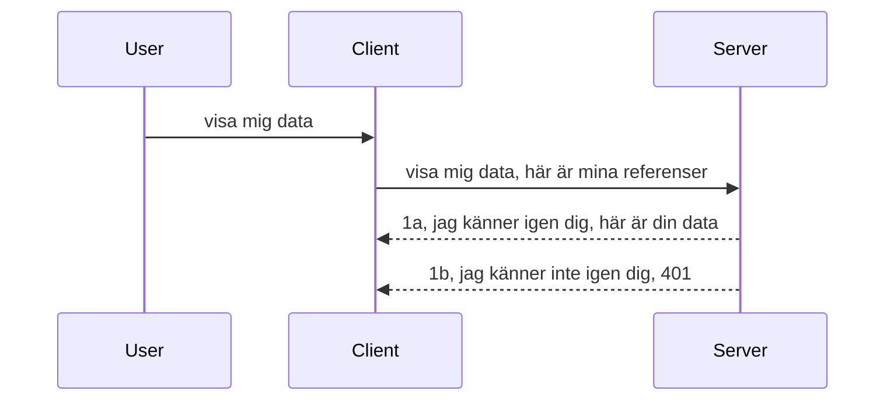

# Enkel autentisering

MCP SDK:er stöder användningen av OAuth 2.1 vilket är en ganska invecklad process som involverar begrepp som autentiseringsserver, resurserver, att skicka in uppgifter, få en kod, byta koden mot en behörighetstoken tills du slutligen kan få dina resursdata. Om du är ovan med OAuth, vilket är en bra sak att implementera, är det en god idé att börja med en grundläggande nivå av autentisering och bygga upp till bättre och bättre säkerhet. Det är därför detta kapitel finns, för att bygga upp dig till mer avancerad autentisering.

## Autentisering, vad menar vi?

Autentisering är en förkortning för autentisering och auktorisering. Idén är att vi behöver göra två saker:

- **Autentisering**, vilket är processen att ta reda på om vi låter en person komma in i vårt hus, att de har rätt att vara "här", det vill säga ha tillgång till vår resurserver där våra MCP Server-funktioner finns.
- **Auktorisering**, är processen att ta reda på om en användare ska ha tillgång till specifika resurser de efterfrågar, till exempel dessa beställningar eller dessa produkter eller om de tillåts läsa innehållet men inte ta bort som ett annat exempel.

## Uppgifter: hur vi talar om för systemet vem vi är

De flesta webbprogrammerare börjar tänka i termer av att tillhandahålla ett intyg till servern, oftast en hemlighet som säger om de får vara här "Autentisering". Detta intyg är vanligtvis en base64-kodad version av användarnamn och lösenord eller en API-nyckel som unikt identifierar en specifik användare.

Detta innebär att skicka det via en header som heter "Authorization" på detta sätt:

```json
{ "Authorization": "secret123" }
```

Detta kallas vanligtvis för basic authentication. Hur det övergripande flödet fungerar är på följande sätt:


Nu när vi förstår hur det fungerar ur ett flödesperspektiv, hur implementerar vi det? De flesta webbservrar har ett koncept som kallas middleware, en kodbit som körs som en del av förfrågan och kan verifiera intyg, och om intyget är giltigt kan låta förfrågan passera. Om förfrågan inte har giltiga uppgifter får du ett autentiseringsfel. Låt oss se hur detta kan implementeras:

**Python**

```python
class AuthMiddleware(BaseHTTPMiddleware):
    async def dispatch(self, request, call_next):

        has_header = request.headers.get("Authorization")
        if not has_header:
            print("-> Missing Authorization header!")
            return Response(status_code=401, content="Unauthorized")

        if not valid_token(has_header):
            print("-> Invalid token!")
            return Response(status_code=403, content="Forbidden")

        print("Valid token, proceeding...")
       
        response = await call_next(request)
        # lägg till eventuella kundhuvuden eller ändra svaret på något sätt
        return response


starlette_app.add_middleware(CustomHeaderMiddleware)
```

Här har vi:

- Skapat en middleware som heter `AuthMiddleware` där dess `dispatch`-metod anropas av webbservern.
- Lagt till middleware:n till webbservern:

    ```python
    starlette_app.add_middleware(AuthMiddleware)
    ```

- Skrivit valideringslogik som kontrollerar om Authorization-headern finns och om hemligheten som skickas är giltig:

    ```python
    has_header = request.headers.get("Authorization")
    if not has_header:
        print("-> Missing Authorization header!")
        return Response(status_code=401, content="Unauthorized")

    if not valid_token(has_header):
        print("-> Invalid token!")
        return Response(status_code=403, content="Forbidden")
    ```

    om hemligheten är närvarande och giltig låter vi förfrågan passera genom att anropa `call_next` och returnerar svaret.

    ```python
    response = await call_next(request)
    # lägg till eventuella kundhuvuden eller ändra svaret på något sätt
    return response
    ```

Hur det fungerar är att om en webbförfrågan görs mot servern, kommer middleware:n att anropas och med dess implementation släppa förfrågan igenom eller returnera ett fel som indikerar att klienten inte får fortsätta.

**TypeScript**

Här skapar vi en middleware med det populära ramverket Express och avlyssnar förfrågan innan den når MCP Servern. Här är koden för det:

```typescript
function isValid(secret) {
    return secret === "secret123";
}

app.use((req, res, next) => {
    // 1. Auktoriseringshuvud närvarande?
    if(!req.headers["Authorization"]) {
        res.status(401).send('Unauthorized');
    }
    
    let token = req.headers["Authorization"];

    // 2. Kontrollera giltighet.
    if(!isValid(token)) {
        res.status(403).send('Forbidden');
    }

   
    console.log('Middleware executed');
    // 3. Skicka vidare förfrågan till nästa steg i förfrågningskedjan.
    next();
});
```

I denna kod:

1. Kontrollerar vi om Authorization-headern finns från början, om inte skickar vi ett 401-fel.
2. Säkerställer att intyget/token är giltigt, om inte skickar vi ett 403-fel.
3. Slutligen skickar vi vidare förfrågan i förfrågningspipen och returnerar den efterfrågade resursen.

## Övning: Implementera autentisering

Låt oss ta vår kunskap och försöka implementera det. Här är planen:

Server

- Skapa en webbserver och en MCP-instans.
- Implementera middleware för servern.

Klient 

- Skicka webbförfrågan med uppgifter via header.

### -1- Skapa en webbserver och MCP-instans

I vårt första steg behöver vi skapa webbserverinstansen och MCP Servern.

**Python**

Här skapar vi en MCP-serverinstans, skapar en starlette webbapp och hostar den med uvicorn.

```python
# skapar MCP-server

app = FastMCP(
    name="MCP Resource Server",
    instructions="Resource Server that validates tokens via Authorization Server introspection",
    host=settings["host"],
    port=settings["port"],
    debug=True
)

# skapar starlette-webbapp
starlette_app = app.streamable_http_app()

# serverar app via uvicorn
async def run(starlette_app):
    import uvicorn
    config = uvicorn.Config(
            starlette_app,
            host=app.settings.host,
            port=app.settings.port,
            log_level=app.settings.log_level.lower(),
        )
    server = uvicorn.Server(config)
    await server.serve()

run(starlette_app)
```

I denna kod:

- Skapar vi MCP Servern.
- Konstruerar starlette webbappen från MCP Servern, `app.streamable_http_app()`.
- Hostar och serverar webbappen med uvicorn `server.serve()`.

**TypeScript**

Här skapar vi en MCP Server-instans.

```typescript
const server = new McpServer({
      name: "example-server",
      version: "1.0.0"
    });

    // ... ställ in serverresurser, verktyg och uppmaningar ...
```

Denna skapelse av MCP Servern behöver ske inom vår POST /mcp ruttdefinition, så låt oss ta koden ovan och flytta den så här:

```typescript
import express from "express";
import { randomUUID } from "node:crypto";
import { McpServer } from "@modelcontextprotocol/sdk/server/mcp.js";
import { StreamableHTTPServerTransport } from "@modelcontextprotocol/sdk/server/streamableHttp.js";
import { isInitializeRequest } from "@modelcontextprotocol/sdk/types.js"

const app = express();
app.use(express.json());

// Karta för att lagra transporter efter sessions-ID
const transports: { [sessionId: string]: StreamableHTTPServerTransport } = {};

// Hantera POST-förfrågningar för klient-till-server-kommunikation
app.post('/mcp', async (req, res) => {
  // Kontrollera om sessions-ID redan finns
  const sessionId = req.headers['mcp-session-id'] as string | undefined;
  let transport: StreamableHTTPServerTransport;

  if (sessionId && transports[sessionId]) {
    // Återanvänd befintlig transport
    transport = transports[sessionId];
  } else if (!sessionId && isInitializeRequest(req.body)) {
    // Ny initieringsförfrågan
    transport = new StreamableHTTPServerTransport({
      sessionIdGenerator: () => randomUUID(),
      onsessioninitialized: (sessionId) => {
        // Lagra transporten efter sessions-ID
        transports[sessionId] = transport;
      },
      // DNS-rebinding-skydd är inaktiverat som standard för bakåtkompatibilitet. Om du kör denna server
      // lokalt, se till att sätta:
      // enableDnsRebindingProtection: true,
      // allowedHosts: ['127.0.0.1'],
    });

    // Rensa upp transporten när den stängs
    transport.onclose = () => {
      if (transport.sessionId) {
        delete transports[transport.sessionId];
      }
    };
    const server = new McpServer({
      name: "example-server",
      version: "1.0.0"
    });

    // ... konfigurera serverresurser, verktyg och promptar ...

    // Anslut till MCP-servern
    await server.connect(transport);
  } else {
    // Ogiltig förfrågan
    res.status(400).json({
      jsonrpc: '2.0',
      error: {
        code: -32000,
        message: 'Bad Request: No valid session ID provided',
      },
      id: null,
    });
    return;
  }

  // Hantera förfrågan
  await transport.handleRequest(req, res, req.body);
});

// Återanvändbar hanterare för GET- och DELETE-förfrågningar
const handleSessionRequest = async (req: express.Request, res: express.Response) => {
  const sessionId = req.headers['mcp-session-id'] as string | undefined;
  if (!sessionId || !transports[sessionId]) {
    res.status(400).send('Invalid or missing session ID');
    return;
  }
  
  const transport = transports[sessionId];
  await transport.handleRequest(req, res);
};

// Hantera GET-förfrågningar för server-till-klient-notiser via SSE
app.get('/mcp', handleSessionRequest);

// Hantera DELETE-förfrågningar för sessionsavslutning
app.delete('/mcp', handleSessionRequest);

app.listen(3000);
```

Nu ser du hur skapandet av MCP Servern flyttades inuti `app.post("/mcp")`.

Låt oss gå vidare till nästa steg och skapa middleware så vi kan validera inkommande intyg.

### -2- Implementera middleware för servern

Nästa del är middleware-biten. Här skapar vi en middleware som letar efter ett intyg i `Authorization`-headern och validerar det. Om det godtas får förfrågan gå vidare för att göra vad den behöver (t.ex. lista verktyg, läsa en resurs eller vad för MCP-funktionalitet klienten efterfrågade).

**Python**

För att skapa middleware behöver vi skapa en klass som ärvts från `BaseHTTPMiddleware`. Det finns två intressanta delar:

- Förfrågan `request`, som vi läser headerinformation från.
- `call_next` callbacken vi måste anropa om klienten har med ett intyg som vi accepterar.

Först måste vi hantera fallet om `Authorization`-headern saknas:

```python
has_header = request.headers.get("Authorization")

# ingen header finns, misslyckas med 401, annars fortsätt.
if not has_header:
    print("-> Missing Authorization header!")
    return Response(status_code=401, content="Unauthorized")
```

Här skickar vi ett 401 unauthorized-meddelande då klienten misslyckas med autentiseringen.

Nästa, om ett intyg lämnades in, måste vi kontrollera dess giltighet så här:

```python
 if not valid_token(has_header):
    print("-> Invalid token!")
    return Response(status_code=403, content="Forbidden")
```

Notera hur vi skickar ett 403 forbidden-meddelande ovan. Låt oss se hela middleware:n nedan med allt vi nämnt ovan:

```python
class AuthMiddleware(BaseHTTPMiddleware):
    async def dispatch(self, request, call_next):

        has_header = request.headers.get("Authorization")
        if not has_header:
            print("-> Missing Authorization header!")
            return Response(status_code=401, content="Unauthorized")

        if not valid_token(has_header):
            print("-> Invalid token!")
            return Response(status_code=403, content="Forbidden")

        print("Valid token, proceeding...")
        print(f"-> Received {request.method} {request.url}")
        response = await call_next(request)
        response.headers['Custom'] = 'Example'
        return response

```

Bra, men vad är `valid_token`-funktionen? Här är den nedan:

```python
# ANVÄND INTE för produktion - förbättra det !!
def valid_token(token: str) -> bool:
    # ta bort "Bearer "-prefixet
    if token.startswith("Bearer "):
        token = token[7:]
        return token == "secret-token"
    return False
```

Detta bör självklart förbättras.

VIKTIGT: Du bör ALDRIG ha hemligheter som detta i koden. Du bör helst hämta värdet att jämföra med från en datakälla eller från en IDP (identity service provider) eller ännu hellre, låta IDP:n göra valideringen.

**TypeScript**

För att implementera detta med Express, behöver vi anropa `use`-metoden som tar middleware-funktioner.

Vi behöver:

- Interagera med request-variabeln för att kontrollera det skickade intyget i `Authorization`-egenskapen.
- Validera intyget och om det är ok, låta förfrågan fortsätta och låta klientens MCP-förfrågan göra vad den ska (t.ex. lista verktyg, läsa resurs eller annat MCP-relaterat).

Här kontrollerar vi om `Authorization`-headern finns och om den inte finns stoppar vi förfrågan:

```typescript
if(!req.headers["authorization"]) {
    res.status(401).send('Unauthorized');
    return;
}
```

Om headern inte skickas från början får du 401.

Nästa kollar vi om intyget är giltigt, annars stoppar vi igen förfrågan men med ett något annorlunda meddelande:

```typescript
if(!isValid(token)) {
    res.status(403).send('Forbidden');
    return;
} 
```

Notera hur du nu får ett 403-fel.

Här är hela koden:

```typescript
app.use((req, res, next) => {
    console.log('Request received:', req.method, req.url, req.headers);
    console.log('Headers:', req.headers["authorization"]);
    if(!req.headers["authorization"]) {
        res.status(401).send('Unauthorized');
        return;
    }
    
    let token = req.headers["authorization"];

    if(!isValid(token)) {
        res.status(403).send('Forbidden');
        return;
    }  

    console.log('Middleware executed');
    next();
});
```

Vi har ställt in webbservern att acceptera en middleware som kollar intyget som klienten förhoppningsvis skickar oss. Vad sägs om klienten själv?

### -3- Skicka webbförfrågan med intyg via header

Vi måste se till att klienten skickar intyget genom headern. Eftersom vi ska använda en MCP-klient för detta, behöver vi lista ut hur det görs.

**Python**

För klienten måste vi skicka en header med vårt intyg så här:

```python
# SKRIV INTE in värdet direkt, ha det minst i en miljövariabel eller en säkrare lagring
token = "secret-token"

async with streamablehttp_client(
        url = f"http://localhost:{port}/mcp",
        headers = {"Authorization": f"Bearer {token}"}
    ) as (
        read_stream,
        write_stream,
        session_callback,
    ):
        async with ClientSession(
            read_stream,
            write_stream
        ) as session:
            await session.initialize()
      
            # TODO, vad du vill göra i klienten, t.ex lista verktyg, anropa verktyg osv.
```

Observera hur vi fyller i `headers`-egenskapen så här ` headers = {"Authorization": f"Bearer {token}"}`.

**TypeScript**

Vi kan lösa detta i två steg:

1. Fyll i ett konfigurationsobjekt med våra uppgifter.
2. Skicka konfigurationsobjektet till transporten.

```typescript

// ANVÄND INTE hårdkodade värden som visas här. Minst bör det vara en miljövariabel och använda något som dotenv (i utvecklingsläge).
let token = "secret123"

// definiera ett klienttransportalternativobjekt
let options: StreamableHTTPClientTransportOptions = {
  sessionId: sessionId,
  requestInit: {
    headers: {
      "Authorization": "secret123"
    }
  }
};

// skicka alternativobjektet till transporten
async function main() {
   const transport = new StreamableHTTPClientTransport(
      new URL(serverUrl),
      options
   );
```

Här ser du ovan hur vi behövde skapa ett `options`-objekt och placera våra headers under egenskapen `requestInit`.

VIKTIGT: Hur förbättrar vi detta då? Nuvande implementation har några problem. För det första är det ganska riskabelt att skicka ett intyg så här om du inte minst använder HTTPS. Även då kan intyget stjälas så du behöver ett system där du enkelt kan återkalla token och lägga till ytterligare kontroller som var i världen det kommer ifrån, om förfrågningar sker för ofta (bot-liknande beteende), kort sagt finns en hel rad problem.

Det bör dock sägas att för mycket enkla API:er där du inte vill att vem som helst ska kunna anropa ditt API utan att vara autentiserad, är det vi har här en bra start.

Med det sagt, låt oss försöka stärka säkerheten lite genom att använda ett standardiserat format som JSON Web Token, även känt som JWT eller "JOT"-tokens.

## JSON Web Tokens, JWT

Så vi försöker förbättra saker från att skicka mycket enkla intyg. Vilka omedelbara förbättringar får vi genom att anta JWT?

- **Säkerhetsförbättringar**. I basic auth skickar du användarnamn och lösenord som en base64-kodad token (eller skicka en API-nyckel) om och om igen vilket ökar risken. Med JWT skickar du användarnamn och lösenord och får en token tillbaka och den är också tidsbegränsad vilket betyder att den kommer att gå ut. JWT låter dig enkelt använda detaljerad åtkomstkontroll med roller, scopes och rättigheter.
- **Statelessness och skalbarhet**. JWT är självförsörjande, de bär all användarinformation och eliminerar behovet av att lagra server-sidiga sessionslager. Token kan också valideras lokalt.
- **Interoperabilitet och federation**. JWT är centralt i Open ID Connect och används med kända identitetsleverantörer som Entra ID, Google Identity och Auth0. De gör det också möjligt att använda Single Sign-On och mycket mer vilket gör det företagsanpassat.
- **Modularitet och flexibilitet**. JWT kan också användas med API-gateways som Azure API Management, NGINX och fler. Det stödjer också användningsfall för autentisering och server-till-server kommunikation inklusive förklädnad och delegation.
- **Prestanda och caching**. JWT kan cachas efter avkodning vilket minskar behovet av att parsa. Detta hjälper särskilt med högtrafikerade appar eftersom det förbättrar genomströmning och minskar belastning på din infrastruktur.
- **Avancerade funktioner**. Det stödjer också introspektion (kontroll av giltighet på server) och återkallelse (göra en token ogiltig).

Med alla dessa fördelar, låt oss se hur vi kan ta vår implementation till nästa nivå.

## Att förvandla basic auth till JWT

De förändringar vi behöver göra på hög nivå är:

- **Lära oss att konstruera en JWT-token** och göra den redo att skickas från klient till server.
- **Validera en JWT-token**, och om giltig, låta klienten få våra resurser.
- **Säker lagring av token**. Hur vi lagrar denna token.
- **Skydda rutterna**. Vi behöver skydda rutterna, i vårt fall skydda rutterna och specifika MCP-funktioner.
- **Lägga till refresh tokens**. Säkerställa att vi skapar tokens som är kortlivade men refresh tokens som är långlivade som kan användas för att skaffa nya tokens om de går ut. Säkerställa också att det finns en refresh-endpoint och en rotationsstrategi.

### -1- Konstruera en JWT-token

Först har en JWT-token följande delar:

- **header**, algoritm som används och tokentyp.
- **payload**, claims, som sub (användaren eller entiteten som token representerar. I en autentiseringsscenario är detta normalt userid), exp (när den går ut), role (rollen)
- **signature**, signerad med en hemlighet eller privat nyckel.

För detta behöver vi konstruera header, payload och den kodade token.

**Python**

```python

import jwt
import jwt
from jwt.exceptions import ExpiredSignatureError, InvalidTokenError
import datetime

# Hemlig nyckel som används för att signera JWT
secret_key = 'your-secret-key'

header = {
    "alg": "HS256",
    "typ": "JWT"
}

# användarinformationen samt dess påståenden och utgångstid
payload = {
    "sub": "1234567890",               # Ämne (användar-ID)
    "name": "User Userson",                # Anpassat påstående
    "admin": True,                     # Anpassat påstående
    "iat": datetime.datetime.utcnow(),# Utfärdat vid
    "exp": datetime.datetime.utcnow() + datetime.timedelta(hours=1)  # Utgångstid
}

# koda den
encoded_jwt = jwt.encode(payload, secret_key, algorithm="HS256", headers=header)
```

I koden ovan har vi:

- Definierat en header med HS256 som algoritm och typ JWT.
- Konstruerat en payload som innehåller ett subjekt eller användar-id, ett användarnamn, en roll, när den utfärdades och när den ska gå ut vilket implementerar den tidsbegränsade aspekten vi nämnde tidigare.

**TypeScript**

Här behöver vi några beroenden som hjälper oss konstruera JWT-token.

Beroenden

```sh

npm install jsonwebtoken
npm install --save-dev @types/jsonwebtoken
```

Nu när vi har det på plats, låt oss skapa header, payload och genom det skapa den kodade token.

```typescript
import jwt from 'jsonwebtoken';

const secretKey = 'your-secret-key'; // Använd miljövariabler i produktion

// Definiera nyttolasten
const payload = {
  sub: '1234567890',
  name: 'User usersson',
  admin: true,
  iat: Math.floor(Date.now() / 1000), // Utfärdad vid
  exp: Math.floor(Date.now() / 1000) + 60 * 60 // Går ut om 1 timme
};

// Definiera headern (valfritt, jsonwebtoken sätter standardvärden)
const header = {
  alg: 'HS256',
  typ: 'JWT'
};

// Skapa token
const token = jwt.sign(payload, secretKey, {
  algorithm: 'HS256',
  header: header
});

console.log('JWT:', token);
```

Denna token är:

Signerad med HS256
Giltig i 1 timme
Inkluderar claims som sub, name, admin, iat, och exp.

### -2- Validera en token

Vi måste också validera en token, detta bör vi göra på servern för att säkerställa att det klienten skickar är giltigt. Det finns många kontroller att göra här från validering av dess struktur till dess giltighet. Du uppmanas också att göra andra kontroller för att säkerställa att användaren finns i systemet och mer.

För att validera en token behöver vi avkoda den så vi kan läsa den och sedan börja kontrollera dess giltighet:

**Python**

```python

# Avkoda och verifiera JWT
try:
    decoded = jwt.decode(token, secret_key, algorithms=["HS256"])
    print("✅ Token is valid.")
    print("Decoded claims:")
    for key, value in decoded.items():
        print(f"  {key}: {value}")
except ExpiredSignatureError:
    print("❌ Token has expired.")
except InvalidTokenError as e:
    print(f"❌ Invalid token: {e}")

```

I denna kod anropar vi `jwt.decode` med token, hemliga nyckeln och vald algoritm som indata. Notera hur vi använder ett try-catch-construct då en misslyckad validering leder till att ett fel kastas.

**TypeScript**

Här behöver vi anropa `jwt.verify` för att få en avkodad version av token som vi kan analysera vidare. Om detta anrop misslyckas betyder det att tokenens struktur är felaktig eller den inte längre är giltig.

```typescript

try {
  const decoded = jwt.verify(token, secretKey);
  console.log('Decoded Payload:', decoded);
} catch (err) {
  console.error('Token verification failed:', err);
}
```

NOTERA: som tidigare nämnts bör vi göra ytterligare kontroller för att säkerställa att denna token pekar på en användare i vårt system och att användaren har de rättigheter den påstår sig ha.

Nästa, låt oss titta på rollbaserad åtkomstkontroll, även känt som RBAC.
## Lägga till rollbaserad åtkomstkontroll

Idén är att vi vill uttrycka att olika roller har olika behörigheter. Till exempel antar vi att en admin kan göra allt, en vanlig användare kan läsa/skriva och att en gäst bara kan läsa. Därför finns här några möjliga behörighetsnivåer:

- Admin.Write 
- User.Read
- Guest.Read

Låt oss titta på hur vi kan implementera sådan kontroll med middleware. Middleware kan läggas till per rutt såväl som för alla rutter.

**Python**

```python
from starlette.middleware.base import BaseHTTPMiddleware
from starlette.responses import JSONResponse
import jwt

# INTE ha hemligheten i koden som detta, detta är endast för demonstrationsändamål. Läs den från en säker plats.
SECRET_KEY = "your-secret-key" # lägg detta i en miljövariabel
REQUIRED_PERMISSION = "User.Read"

class JWTPermissionMiddleware(BaseHTTPMiddleware):
    async def dispatch(self, request, call_next):
        auth_header = request.headers.get("Authorization")
        if not auth_header or not auth_header.startswith("Bearer "):
            return JSONResponse({"error": "Missing or invalid Authorization header"}, status_code=401)

        token = auth_header.split(" ")[1]
        try:
            decoded = jwt.decode(token, SECRET_KEY, algorithms=["HS256"])
        except jwt.ExpiredSignatureError:
            return JSONResponse({"error": "Token expired"}, status_code=401)
        except jwt.InvalidTokenError:
            return JSONResponse({"error": "Invalid token"}, status_code=401)

        permissions = decoded.get("permissions", [])
        if REQUIRED_PERMISSION not in permissions:
            return JSONResponse({"error": "Permission denied"}, status_code=403)

        request.state.user = decoded
        return await call_next(request)


```

Det finns några olika sätt att lägga till middleware som nedan:

```python

# Alt 1: lägg till middleware medan starlette-appen byggs
middleware = [
    Middleware(JWTPermissionMiddleware)
]

app = Starlette(routes=routes, middleware=middleware)

# Alt 2: lägg till middleware efter att starlette-appen redan är byggd
starlette_app.add_middleware(JWTPermissionMiddleware)

# Alt 3: lägg till middleware per rutt
routes = [
    Route(
        "/mcp",
        endpoint=..., # hanterare
        middleware=[Middleware(JWTPermissionMiddleware)]
    )
]
```

**TypeScript**

Vi kan använda `app.use` och en middleware som körs för alla förfrågningar.

```typescript
app.use((req, res, next) => {
    console.log('Request received:', req.method, req.url, req.headers);
    console.log('Headers:', req.headers["authorization"]);

    // 1. Kontrollera om auktoriseringshuvudet har skickats

    if(!req.headers["authorization"]) {
        res.status(401).send('Unauthorized');
        return;
    }
    
    let token = req.headers["authorization"];

    // 2. Kontrollera om token är giltig
    if(!isValid(token)) {
        res.status(403).send('Forbidden');
        return;
    }  

    // 3. Kontrollera om token-användaren finns i vårt system
    if(!isExistingUser(token)) {
        res.status(403).send('Forbidden');
        console.log("User does not exist");
        return;
    }
    console.log("User exists");

    // 4. Verifiera att token har rätt behörigheter
    if(!hasScopes(token, ["User.Read"])){
        res.status(403).send('Forbidden - insufficient scopes');
    }

    console.log("User has required scopes");

    console.log('Middleware executed');
    next();
});

```

Det finns ganska många saker vi kan låta vår middleware göra och som vår middleware BÖR göra, nämligen:

1. Kontrollera om auktoriseringshuvud finns
2. Kontrollera om token är giltig, vi kallar `isValid` som är en metod vi skrivit som kontrollerar integriteten och giltigheten för JWT-token.
3. Verifiera att användaren finns i vårt system, detta bör vi kontrollera.

   ```typescript
    // användare i databasen
   const users = [
     "user1",
     "User usersson",
   ]

   function isExistingUser(token) {
     let decodedToken = verifyToken(token);

     // TODO, kontrollera om användaren finns i databasen
     return users.includes(decodedToken?.name || "");
   }
   ```

   Ovan har vi skapat en mycket enkel lista `users`, som förstås borde ligga i en databas.

4. Dessutom bör vi också kontrollera att token har rätt behörigheter.

   ```typescript
   if(!hasScopes(token, ["User.Read"])){
        res.status(403).send('Forbidden - insufficient scopes');
   }
   ```

   I koden ovan från middleware kontrollerar vi att token innehåller User.Read-behörighet, annars skickar vi ett 403-fel. Nedan är hjälpfunktionen `hasScopes`.

   ```typescript
   function hasScopes(scope: string, requiredScopes: string[]) {
     let decodedToken = verifyToken(scope);
    return requiredScopes.every(scope => decodedToken?.scopes.includes(scope));
  }
   ```

Have a think which additional checks you should be doing, but these are the absolute minimum of checks you should be doing.

Using Express as a web framework is a common choice. There are helpers library when you use JWT so you can write less code.

- `express-jwt`, helper library that provides a middleware that helps decode your token.
- `express-jwt-permissions`, this provides a middleware `guard` that helps check if a certain permission is on the token.

Here's what these libraries can look like when used:

```typescript
const express = require('express');
const jwt = require('express-jwt');
const guard = require('express-jwt-permissions')();

const app = express();
const secretKey = 'your-secret-key'; // put this in env variable

// Decode JWT and attach to req.user
app.use(jwt({ secret: secretKey, algorithms: ['HS256'] }));

// Check for User.Read permission
app.use(guard.check('User.Read'));

// multiple permissions
// app.use(guard.check(['User.Read', 'Admin.Access']));

app.get('/protected', (req, res) => {
  res.json({ message: `Welcome ${req.user.name}` });
});

// Error handler
app.use((err, req, res, next) => {
  if (err.code === 'permission_denied') {
    return res.status(403).send('Forbidden');
  }
  next(err);
});

```

Nu har du sett hur middleware kan användas både för autentisering och auktorisering, men hur är det med MCP, ändrar det hur vi gör auth? Låt oss ta reda på det i nästa avsnitt.

### -3- Lägg till RBAC i MCP

Du har hittills sett hur du kan lägga till RBAC via middleware, men för MCP finns det inget enkelt sätt att lägga till RBAC per MCP-funktion, så vad gör vi? Jo, vi måste lägga till kod som i detta fall kontrollerar om klienten har rättigheter att anropa ett specifikt verktyg:

Du har några olika val att göra för att uppnå RBAC per funktion, här är några:

- Lägg till en kontroll för varje verktyg, resurs, prompt där du behöver kontrollera behörighetsnivå.

   **python**

   ```python
   @tool()
   def delete_product(id: int):
      try:
          check_permissions(role="Admin.Write", request)
      catch:
        pass # klienten misslyckades med auktorisering, kasta auktoriseringsfel
   ```

   **typescript**

   ```typescript
   server.registerTool(
    "delete-product",
    {
      title: Delete a product",
      description: "Deletes a product",
      inputSchema: { id: z.number() }
    },
    async ({ id }) => {
      
      try {
        checkPermissions("Admin.Write", request);
        // att göra, skicka id till productService och fjärrinmatning
      } catch(Exception e) {
        console.log("Authorization error, you're not allowed");  
      }

      return {
        content: [{ type: "text", text: `Deletected product with id ${id}` }]
      };
    }
   );
   ```


- Använd avancerad servermetod och förfrågningshanterare så att du minimerar antalet ställen där du behöver göra kontrollen.

   **Python**

   ```python
   
   tool_permission = {
      "create_product": ["User.Write", "Admin.Write"],
      "delete_product": ["Admin.Write"]
   }

   def has_permission(user_permissions, required_permissions) -> bool:
      # användarbehörigheter: lista över behörigheter användaren har
      # nödvändiga_behörigheter: lista över behörigheter som krävs för verktyget
      return any(perm in user_permissions for perm in required_permissions)

   @server.call_tool()
   async def handle_call_tool(
     name: str, arguments: dict[str, str] | None
   ) -> list[types.TextContent]:
    # Anta att request.user.permissions är en lista över användarens behörigheter
     user_permissions = request.user.permissions
     required_permissions = tool_permission.get(name, [])
     if not has_permission(user_permissions, required_permissions):
        # Kasta fel "Du har inte behörighet att använda verktyget {name}"
        raise Exception(f"You don't have permission to call tool {name}")
     # fortsätt och anropa verktyget
     # ...
   ```   
   

   **TypeScript**

   ```typescript
   function hasPermission(userPermissions: string[], requiredPermissions: string[]): boolean {
       if (!Array.isArray(userPermissions) || !Array.isArray(requiredPermissions)) return false;
       // Returnera sant om användaren har minst en nödvändig behörighet
       
       return requiredPermissions.some(perm => userPermissions.includes(perm));
   }
  
   server.setRequestHandler(CallToolRequestSchema, async (request) => {
      const { params: { name } } = request;
  
      let permissions = request.user.permissions;
  
      if (!hasPermission(permissions, toolPermissions[name])) {
         return new Error(`You don't have permission to call ${name}`);
      }
  
      // fortsätt..
   });
   ```

   Observera, du behöver säkerställa att din middleware tilldelar en dekodad token till förfrågans user-egenskap så att koden ovan blir enkel.

### Sammanfattning

Nu när vi diskuterat hur man lägger till stöd för RBAC i allmänhet och för MCP i synnerhet, är det dags att försöka implementera säkerhet själv för att säkerställa att du förstått de koncept som presenterats.

## Uppgift 1: Bygg en MCP-server och MCP-klient med grundläggande autentisering

Här använder du det du lärt dig om att skicka inloggningsuppgifter via headers.

## Lösning 1

[Lösning 1](./code/basic/README.md)

## Uppgift 2: Uppgradera lösningen från Uppgift 1 till att använda JWT

Ta den första lösningen men den här gången förbättrar vi den.

Istället för att använda Basic Auth, använder vi JWT.

## Lösning 2

[Lösning 2](./solution/jwt-solution/README.md)

## Utmaning

Lägg till RBAC per verktyg som vi beskriver i avsnittet "Lägg till RBAC i MCP".

## Sammanfattning

Förhoppningsvis har du lärt dig mycket i detta kapitel, från ingen säkerhet alls, till grundläggande säkerhet, till JWT och hur det kan läggas till i MCP.

Vi har byggt en stabil grund med anpassade JWT, men när vi skalar upp går vi mot en standardbaserad identitetsmodell. Att adoptera en IdP som Entra eller Keycloak låter oss flytta ansvaret för tokenutfärdande, validering och livscykelhantering till en betrodd plattform – vilket frigör oss att fokusera på applikationslogik och användarupplevelse.

För det har vi ett mer [avancerat kapitel om Entra](../../05-AdvancedTopics/mcp-security-entra/README.md)

## Vad händer härnäst

- Nästa: [Sätta upp MCP-värdar](../12-mcp-hosts/README.md)

---

<!-- CO-OP TRANSLATOR DISCLAIMER START -->
**Ansvarsfriskrivning**:  
Detta dokument har översatts med hjälp av AI-översättningstjänsten [Co-op Translator](https://github.com/Azure/co-op-translator). Även om vi strävar efter noggrannhet, var vänlig observera att automatiska översättningar kan innehålla fel eller brister. Det ursprungliga dokumentet på dess modersmål bör betraktas som den auktoritativa källan. För kritisk information rekommenderas professionell mänsklig översättning. Vi ansvarar inte för eventuella missförstånd eller feltolkningar som uppstår vid användning av denna översättning.
<!-- CO-OP TRANSLATOR DISCLAIMER END -->