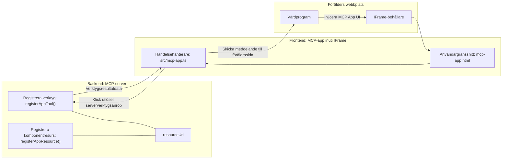

# MCP Appar

MCP Appar är ett nytt paradigm inom MCP. Idén är att du inte bara svarar med data tillbaka från ett verktygsanrop, utan du ger också information om hur denna information ska interageras med. Det betyder att verktygsresultat nu kan innehålla UI-information. Varför skulle vi vilja ha det? Tja, fundera på hur du gör saker idag. Du konsumerar sannolikt resultaten från en MCP Server genom att ha någon typ av frontend framför den, det är kod du behöver skriva och underhålla. Ibland är det vad du vill, men ibland vore det fantastiskt om du bara kunde ta in ett informationsstycke som är självständigt och har allt från data till användargränssnitt.

## Översikt

Denna lektion ger praktisk vägledning om MCP Appar, hur du kommer igång med dem och hur du integrerar dem i dina befintliga webbappar. MCP Appar är en mycket ny tillägg till MCP-standarden.

## Lärandemål

I slutet av denna lektion kommer du att kunna:

- Förklara vad MCP Appar är.
- När man ska använda MCP Appar.
- Bygga och integrera dina egna MCP Appar.

## MCP Appar - hur fungerar det

Idén med MCP Appar är att tillhandahålla ett svar som i princip är en komponent som ska renderas. En sådan komponent kan ha både visuella element och interaktivitet, t.ex. knappklick, användarinmatning med mera. Vi börjar med serversidan och vår MCP Server. För att skapa en MCP App-komponent behöver du skapa ett verktyg men också applikationsresursen. Dessa två delar är kopplade genom en resourceUri.

Här är ett exempel. Låt oss försöka visualisera vad som ingår och vilka delar som gör vad:

```text
server.ts -- responsible for registering tools and the component as a UI component
src/
  mcp-app.ts -- wiring up event handlers
mcp-app.html -- the user interface
```
  
Denna visualisering beskriver arkitekturen för att skapa en komponent och dess logik.


Låt oss försöka beskriva ansvarsområdena för backend och frontend respektive.

### Backend

Det finns två saker vi behöver åstadkomma här:

- Registrera de verktyg vi vill interagera med.
- Definiera komponenten.

**Registrera verktyget**

```typescript
registerAppTool(
    server,
    "get-time",
    {
      title: "Get Time",
      description: "Returns the current server time.",
      inputSchema: {},
      _meta: { ui: { resourceUri } }, // Länkar detta verktyg till dess UI-resurs
    },
    async () => {
      const time = new Date().toISOString();
      return { content: [{ type: "text", text: time }] };
    },
  );

```
  
Den föregående koden beskriver beteendet, där den exponerar ett verktyg kallat `get-time`. Den tar inga ingångar men producerar slutligen den aktuella tiden. Vi har möjlighet att definiera ett `inputSchema` för verktyg där vi behöver kunna ta emot användarinmatning.

**Registrera komponenten**

I samma fil behöver vi också registrera komponenten:

```typescript
const resourceUri = "ui://get-time/mcp-app.html";

// Registrera resursen, som returnerar den bundlade HTML/JavaScript för användargränssnittet.
registerAppResource(
  server,
  resourceUri,
  resourceUri,
  { mimeType: RESOURCE_MIME_TYPE },
  async () => {
    const html = await fs.readFile(path.join(DIST_DIR, "mcp-app.html"), "utf-8");

    return {
    contents: [
        { uri: resourceUri, mimeType: RESOURCE_MIME_TYPE, text: html },
    ],
    };
  },
);
```
  
Notera hur vi nämner `resourceUri` för att koppla komponenten med dess verktyg. Av intresse är också callbacken där vi laddar UI-filen och returnerar komponenten.

### Komponentens frontend

Liksom backend finns det två delar här:

- En frontend skriven i ren HTML.
- Kod som hanterar händelser och vad som ska göras, t.ex. anropa verktyg eller skicka meddelanden till föräldrafönstret.

**Användargränssnitt**

Låt oss titta på användargränssnittet.

```html
<!-- mcp-app.html -->
<!DOCTYPE html>
<html lang="en">
  <head>
    <meta charset="UTF-8" />
    <title>Get Time App</title>
  </head>
  <body>
    <p>
      <strong>Server Time:</strong> <code id="server-time">Loading...</code>
    </p>
    <button id="get-time-btn">Get Server Time</button>
    <script type="module" src="/src/mcp-app.ts"></script>
  </body>
</html>
```
  
**Händelsekoppling**

Den sista delen är händelsekopplingen. Det innebär att vi identifierar vilken del i vårt UI som behöver händelsehanterare och vad som ska göras om händelser utlöses:

```typescript
// mcp-app.ts

import { App } from "@modelcontextprotocol/ext-apps";

// Hämta elementreferenser
const serverTimeEl = document.getElementById("server-time")!;
const getTimeBtn = document.getElementById("get-time-btn")!;

// Skapa app-instans
const app = new App({ name: "Get Time App", version: "1.0.0" });

// Hantera verktygsresultat från servern. Sätt innan `app.connect()` för att undvika
// att missa det initiala verktygsresultatet.
app.ontoolresult = (result) => {
  const time = result.content?.find((c) => c.type === "text")?.text;
  serverTimeEl.textContent = time ?? "[ERROR]";
};

// Koppla knappklick
getTimeBtn.addEventListener("click", async () => {
  // `app.callServerTool()` låter UI begära färska data från servern
  const result = await app.callServerTool({ name: "get-time", arguments: {} });
  const time = result.content?.find((c) => c.type === "text")?.text;
  serverTimeEl.textContent = time ?? "[ERROR]";
});

// Anslut till värd
app.connect();
```
  
Som du kan se från ovan är detta vanlig kod för att ansluta DOM-element till händelser. Värt att nämna är anropet till `callServerTool` som slutligen anropar ett verktyg på backend.

## Hantera användarinmatning

Hittills har vi sett en komponent som har en knapp som när den klickas anropar ett verktyg. Låt oss se om vi kan lägga till fler UI-element som ett inmatningsfält och se om vi kan skicka argument till ett verktyg. Låt oss implementera en FAQ-funktionalitet. Så här ska det fungera:

- Det ska finnas en knapp och ett inmatningselement där användaren skriver ett sökord att leta efter, till exempel "Shipping". Detta ska anropa ett verktyg på backend som gör en sökning i FAQ-data.
- Ett verktyg som stöder den nämnda FAQ-sökningen.

Låt oss först lägga till det nödvändiga stödet på backend:

```typescript
const faq: { [key: string]: string } = {
    "shipping": "Our standard shipping time is 3-5 business days.",
    "return policy": "You can return any item within 30 days of purchase.",
    "warranty": "All products come with a 1-year warranty covering manufacturing defects.",
  }

registerAppTool(
    server,
    "get-faq",
    {
      title: "Search FAQ",
      description: "Searches the FAQ for relevant answers.",
      inputSchema: zod.object({
        query: zod.string().default("shipping"),
      }),
      _meta: { ui: { resourceUri: faqResourceUri } }, // Länkar detta verktyg till dess UI-resurs
    },
    async ({ query }) => {
      const answer: string = faq[query.toLowerCase()] || "Sorry, I don't have an answer for that.";
      return { content: [{ type: "text", text: answer }] };
    },
  );
```
  
Det vi ser här är hur vi fyller i `inputSchema` och ger det ett `zod` schema så här:

```typescript
inputSchema: zod.object({
  query: zod.string().default("shipping"),
})
```
  
I schemat ovan deklarerar vi att vi har en inmatningsparameter som heter `query` och att den är valfri med ett standardvärde "shipping".

Ok, låt oss gå vidare till *mcp-app.html* för att se vilken UI vi behöver skapa:

```html
<div class="faq">
    <h1>FAQ response</h1>
    <p>FAQ Response: <code id="faq-response">Loading...</code></p>
    <input type="text" id="faq-query" placeholder="Enter FAQ query" />
    <button id="get-faq-btn">Get FAQ Response</button>
  </div>
```
  
Bra, nu har vi ett inmatningselement och en knapp. Låt oss gå till *mcp-app.ts* nästa för att koppla upp dessa händelser:

```typescript
const getFaqBtn = document.getElementById("get-faq-btn")!;
const faqQueryInput = document.getElementById("faq-query") as HTMLInputElement;

getFaqBtn.addEventListener("click", async () => {
  const query = faqQueryInput.value;
  const result = await app.callServerTool({ name: "get-faq", arguments: { query } });
  const faq = result.content?.find((c) => c.type === "text")?.text;
  faqResponseEl.textContent = faq ?? "[ERROR]";
});
```
  
I koden ovan gör vi:

- Skapar referenser till de interaktiva UI-elementen.
- Hanterar ett knappklick för att läsa ut värdet i inmatningselementet och vi anropar också `app.callServerTool()` med `name` och `arguments` där det senare skickar `query` som värde.

Vad som faktiskt händer när du anropar `callServerTool` är att den skickar ett meddelande till föräldrafönstret och det fönstret anropar MCP Servern.

### Prova själv

När vi provar detta bör vi nu se följande:


och här där vi testar med inmatning som "warranty"


För att köra denna kod, gå till [Kodavsnittet](./code/README.md)

## Testa i Visual Studio Code

Visual Studio Code har bra stöd för MCP Appar och är förmodligen ett av de enklaste sätten att testa dina MCP Appar. För att använda Visual Studio Code, lägg till en serverpost i *mcp.json* så här:

```json
"my-mcp-server-7178eca7": {
    "url": "http://localhost:3001/mcp",
    "type": "http"
  }
```
  
Starta sedan servern, du bör kunna kommunicera med din MCP App genom Chattfönstret förutsatt att du har GitHub Copilot installerat.

Du kan trigga det via en prompt, till exempel "#get-faq":


och precis som när du körde det genom en webbläsare, renderas det på samma sätt som så här:


## Uppgift

Skapa ett sten sax påse-spel. Det ska bestå av följande:

UI:

- en rullgardinslista med val
- en knapp för att skicka in ett val
- en etikett som visar vem som valde vad och vem som vann

Server:

- ska ha ett verktyg för sten sax påse som tar "choice" som input. Det ska också rendera ett datorval och avgöra vinnaren.

## Lösning

[Lösning](./assignment/README.md)

## Sammanfattning

Vi har lärt oss om detta nya paradigm MCP Appar. Det är ett nytt paradigm som tillåter MCP Servrar att ha en åsikt inte bara om data utan även hur denna data ska presenteras.

Dessutom har vi lärt oss att dessa MCP Appar är inbäddade i en IFrame och för att kommunicera med MCP Server behöver de skicka meddelanden till den överordnade webbappen. Det finns flera bibliotek tillgängliga för både vanlig JavaScript och React med mera som gör denna kommunikation enklare.

## Viktiga insikter

Här är vad du har lärt dig:

- MCP Appar är en ny standard som kan vara användbar när du vill skicka både data och UI-funktioner.
- Denna typ av appar körs i en IFrame av säkerhetsskäl.

## Vad händer härnäst

- [Kapitel 4](../../04-PracticalImplementation/README.md)

---

<!-- CO-OP TRANSLATOR DISCLAIMER START -->
**Ansvarsfriskrivning**:  
Det här dokumentet har översatts med hjälp av AI-översättningstjänsten [Co-op Translator](https://github.com/Azure/co-op-translator). Även om vi strävar efter noggrannhet, vänligen ha i åtanke att automatiska översättningar kan innehålla fel eller brister. Det ursprungliga dokumentet på dess modersmål bör anses vara den auktoritativa källan. För kritisk information rekommenderas professionell mänsklig översättning. Vi ansvarar inte för några missförstånd eller feltolkningar som uppstår till följd av användningen av denna översättning.
<!-- CO-OP TRANSLATOR DISCLAIMER END -->