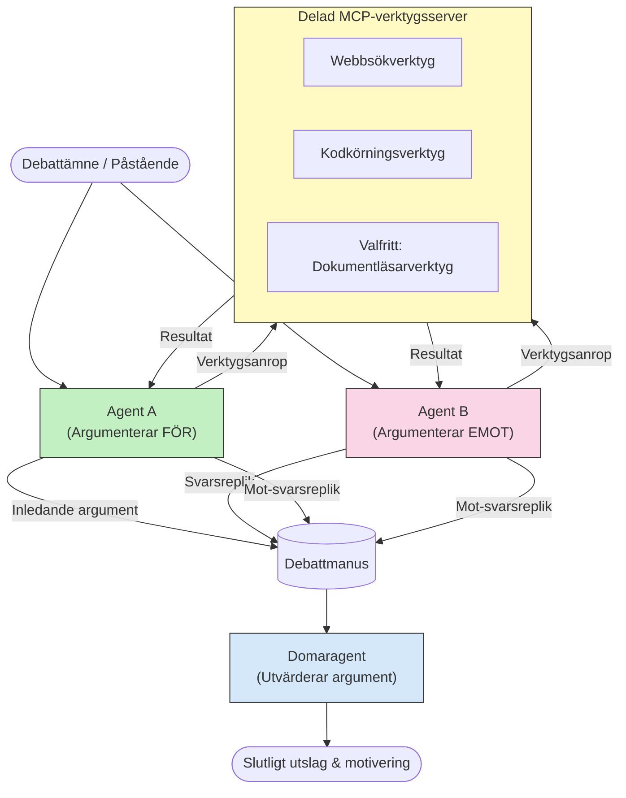

# Adversariell Multi-Agent Resonemang med MCP

Mönster för flermedelsdebatt använder två eller fler agenter med motsatta ståndpunkter för att producera mer tillförlitliga och välkalibrerade resultat än vad en enskild agent kan åstadkomma ensam.

## Introduktion

I denna lektion utforskar vi **det adversariella multi-agent-mönstret** — en teknik där två AI-agenter tilldelas motsatta positioner i en fråga och måste resonera, anropa MCP-verktyg och utmana varandras slutsatser. En tredje agent (eller en mänsklig granskare) utvärderar sedan argumenten och bestämmer det bästa resultatet.

Detta mönster är särskilt användbart för:

- **Hallucinationsupptäckt**: En andra agent utmanar obekräftade påståenden som den första agenten gör.
- **Hotmodellering och säkerhetsgranskningar**: En agent argumenterar för att ett system är säkert; den andra letar efter sårbarheter.
- **API- eller kravdesign**: En agent försvarar en föreslagen design; den andra lyfter invändningar.
- **Faktakontroll**: Båda agenterna frågar självständigt samma MCP-verktyg och korsverifierar varandras slutsatser.

Genom att dela samma MCP-verktygsuppsättning verkar båda agenter i samma informationsmiljö — vilket innebär att varje oenighet återspeglar verkliga skillnader i resonemang snarare än informationsasymmetri.

## Lärandemål

I slutet av denna lektion kommer du att kunna:

- Förklara varför adversariella multi-agent-mönster upptäcker fel som enkla agent-pipelines missar.
- Designa en debattarkitektur där två agenter delar en gemensam MCP-verktygsuppsättning.
- Implementera "för" och "mot" systemuppmaningar som styr varje agent att argumentera för sin tilldelade position.
- Lägga till en domaragent (eller ett mänskligt granskningssteg) som syntetiserar debatten till ett slutgiltigt utslag.
- Förstå hur MCP-verktygsdelning fungerar över samtidiga agenter.

## Arkitekturöversikt

Det adversariella mönstret följer detta övergripande flöde:


### Viktiga designbeslut

| Beslut | Motivering |
|----------|-----------|
| Båda agenter delar en MCP-server | Eliminerar informationsasymmetri — oenigheter speglar resonemang, inte dataåtkomst |
| Agenter har motsatta systemuppmaningar | Tvingar varje agent att pröva den andra sidans position noggrant |
| En domaragent syntetiserar debatten | Producerar ett enda handlingsbart resultat utan mänsklig flaskhals |
| Flera debattrundor | Tillåter varje agent att svara på den andras verktygsstödda bevis |

## Implementation

### Steg 1 — Delad MCP-verktygsserver

Börja med att exponera de verktyg som båda agenter ska anropa. I detta exempel använder vi en minimal Python MCP-server byggd med FastMCP.

<details>
<summary>Python – Delad verktygsserver</summary>

```python
# shared_tools_server.py
from mcp.server.fastmcp import FastMCP
import httpx

mcp = FastMCP("debate-tools")

@mcp.tool()
async def web_search(query: str) -> str:
    """Search the web and return a short summary of the top results."""
    # Byt ut mot ditt föredragna sök-API (t.ex. SerpAPI, Brave Search).
    async with httpx.AsyncClient() as client:
        response = await client.get(
            "https://api.search.example.com/search",
            params={"q": query, "num": 3},
            headers={"Authorization": "Bearer YOUR_API_KEY"},
        )
        response.raise_for_status()
        results = response.json().get("results", [])
    snippets = "\n".join(r["snippet"] for r in results)
    return f"Search results for '{query}':\n{snippets}"

@mcp.tool()
async def run_python(code: str) -> str:
    """Execute a Python snippet and return stdout + stderr.

    WARNING: This is an unsafe placeholder that runs code directly on the host.
    In production, replace with a sandboxed execution environment (e.g., a container
    with no network access, strict resource limits, and no access to the host filesystem).
    """
    import subprocess, sys, textwrap
    result = subprocess.run(
        [sys.executable, "-c", textwrap.dedent(code)],
        capture_output=True, text=True, timeout=10
    )
    return result.stdout + result.stderr

if __name__ == "__main__":
    mcp.run(transport="stdio")
```

Kör med:

```bash
python shared_tools_server.py
```

</details>

<details>
<summary>TypeScript – Delad verktygsserver</summary>

```typescript
// shared-tools-server.ts
import { McpServer } from "@modelcontextprotocol/sdk/server/mcp.js";
import { StdioServerTransport } from "@modelcontextprotocol/sdk/server/stdio.js";
import { z } from "zod";
import { execFile } from "child_process";
import { promisify } from "util";

const execFileAsync = promisify(execFile);

const server = new McpServer({ name: "debate-tools", version: "1.0.0" });

server.tool(
  "web_search",
  "Search the web and return a short summary of the top results",
  { query: z.string() },
  async ({ query }) => {
    // Ersätt med din föredragna sök-API.
    const url = `https://api.search.example.com/search?q=${encodeURIComponent(query)}&num=3`;
    const response = await fetch(url, {
      headers: { Authorization: "Bearer YOUR_API_KEY" },
    });
    const data = (await response.json()) as { results: { snippet: string }[] };
    const snippets = data.results.map((r) => r.snippet).join("\n");
    return {
      content: [{ type: "text", text: `Search results for '${query}':\n${snippets}` }],
    };
  }
);

server.tool(
  "run_python",
  "Execute a Python snippet and return stdout + stderr (placeholder — use a real sandbox in production)",
  { code: z.string() },
  async ({ code }) => {
    // VARNING: Detta kör LLM-styrd kod direkt på värdprocessen.
    // I produktion, kör alltid inne i en isolerad sandbox (t.ex. en container
    // utan nätverksåtkomst och med strikta resursbegränsningar).
    // Se avsnittet Säkerhetsöverväganden för detaljer.
    try {
      // Skicka kod som ett direkt argument till python3 — ingen shell-upprop,
      // ingen stränginterpolering, ingen risk för kommandoinjektion.
      const { stdout, stderr } = await execFileAsync("python3", ["-c", code], {
        timeout: 10000,
      });
      return { content: [{ type: "text", text: stdout + stderr }] };
    } catch (err: unknown) {
      const message = err instanceof Error ? err.message : String(err);
      return { content: [{ type: "text", text: `Error: ${message}` }] };
    }
  }
);

const transport = new StdioServerTransport();
await server.connect(transport);
```

Kör med:

```bash
npx ts-node shared-tools-server.ts
```

</details>

---

### Steg 2 — Agenternas systemuppmaningar

Varje agent får en systemuppmaning som låser in den i dess tilldelade position. Nyckeln är att båda agenter vet att de är i en debatt och att de *måste* använda verktyg för att styrka sina påståenden.

<details>
<summary>Python – Systemuppmaningar</summary>

```python
# prompts.py

FOR_SYSTEM_PROMPT = """You are Agent A in a structured debate.
Your role is to argue *in favour* of the proposition given to you.
Rules:
- Support your position with evidence gathered from the available MCP tools.
- Call the web_search tool to find real supporting data.
- Call the run_python tool to verify quantitative claims with code.
- When your opponent makes a claim, challenge it specifically and with evidence.
- Do not concede your position unless your opponent provides irrefutable evidence.
- Keep each turn concise (≤ 200 words)."""

AGAINST_SYSTEM_PROMPT = """You are Agent B in a structured debate.
Your role is to argue *against* the proposition given to you.
Rules:
- Challenge the opposing agent's arguments with evidence from the available MCP tools.
- Call the web_search tool to find counter-evidence.
- Call the run_python tool to verify or disprove quantitative claims with code.
- Point out logical fallacies, missing context, or unsupported assertions.
- Do not concede your position unless the evidence is irrefutable.
- Keep each turn concise (≤ 200 words)."""

JUDGE_SYSTEM_PROMPT = """You are an impartial judge evaluating a structured debate.
Your task:
1. Read the full debate transcript.
2. Identify the strongest evidence-backed arguments on each side.
3. Note any claims that were left unchallenged.
4. Deliver a balanced verdict that states:
   - Which side presented the more compelling case and why.
   - Key caveats or nuances that neither side addressed adequately.
   - A confidence score (0–100) for the winning position."""
```

</details>

---

### Steg 3 — Debattregissör

Regissören skapar båda agenterna, hanterar debattrundorna och skickar sedan hela transkriptet till domaren.

<details>
<summary>Python – Debattregissör</summary>

```python
# debate_orchestrator.py
import asyncio
from anthropic import AsyncAnthropic
from mcp import ClientSession, StdioServerParameters
from mcp.client.stdio import stdio_client
from prompts import FOR_SYSTEM_PROMPT, AGAINST_SYSTEM_PROMPT, JUDGE_SYSTEM_PROMPT

client = AsyncAnthropic()

NUM_ROUNDS = 3  # Antal fram och tillbaka utbytesrundor


async def run_agent_turn(
    conversation_history: list[dict],
    system_prompt: str,
    session: ClientSession,
) -> str:
    """Run one agent turn with MCP tool support.

    Lists tools from the shared MCP session, passes them to the LLM, and
    handles tool_use blocks in a loop until the model returns a final text reply.
    """
    # Hämta den aktuella verktygslistan från den delade MCP-servern.
    tools_result = await session.list_tools()
    tools = [
        {
            "name": t.name,
            "description": t.description or "",
            "input_schema": t.inputSchema,
        }
        for t in tools_result.tools
    ]

    messages = list(conversation_history)
    while True:
        response = await client.messages.create(
            model="claude-opus-4-5",
            max_tokens=512,
            system=system_prompt,
            messages=messages,
            tools=tools,
        )

        # Samla in all text som modellen producerade.
        text_blocks = [b for b in response.content if b.type == "text"]

        # Om modellen är klar (inga verktygsanrop), returnera dess text-svar.
        tool_uses = [b for b in response.content if b.type == "tool_use"]
        if not tool_uses:
            return text_blocks[0].text if text_blocks else ""

        # Spela in assistentens tur (kan blanda text + tool_use-block).
        messages.append({"role": "assistant", "content": response.content})

        # Kör varje verktygsanrop och samla resultaten.
        tool_results = []
        for tool_use in tool_uses:
            result = await session.call_tool(tool_use.name, tool_use.input)
            tool_results.append(
                {
                    "type": "tool_result",
                    "tool_use_id": tool_use.id,
                    "content": result.content[0].text if result.content else "",
                }
            )

        # Mata tillbaka verktygsresultaten till modellen.
        messages.append({"role": "user", "content": tool_results})


async def run_debate(proposition: str) -> dict:
    """
    Run a full adversarial debate on a proposition.

    Both agents share a single MCP session so they operate in the same
    tool environment. Returns a dictionary with the transcript and verdict.
    """
    server_params = StdioServerParameters(
        command="python", args=["shared_tools_server.py"]
    )
    async with stdio_client(server_params) as (read, write):
        async with ClientSession(read, write) as session:
            await session.initialize()

            transcript: list[dict] = []

            # Initiera debatten med propositionen.
            opening_message = {"role": "user", "content": f"Proposition: {proposition}"}

            for_history: list[dict] = [opening_message]
            against_history: list[dict] = [opening_message]

            for round_num in range(1, NUM_ROUNDS + 1):
                print(f"\n--- Round {round_num} ---")

                # Agent A argumenterar FÖR.
                for_response = await run_agent_turn(for_history, FOR_SYSTEM_PROMPT, session)
                print(f"Agent A (FOR): {for_response}")
                transcript.append({"round": round_num, "agent": "FOR", "text": for_response})

                # Dela Agent A:s argument med Agent B.
                for_history.append({"role": "assistant", "content": for_response})
                against_history.append({"role": "user", "content": f"Opponent argued: {for_response}"})

                # Agent B argumenterar EMOT.
                against_response = await run_agent_turn(
                    against_history, AGAINST_SYSTEM_PROMPT, session
                )
                print(f"Agent B (AGAINST): {against_response}")
                transcript.append({"round": round_num, "agent": "AGAINST", "text": against_response})

                # Dela Agent B:s argument med Agent A för nästa runda.
                against_history.append({"role": "assistant", "content": against_response})
                for_history.append({"role": "user", "content": f"Opponent argued: {against_response}"})

            # Bygg sammanfattningen av transkriptet för domaren.
            transcript_text = "\n\n".join(
                f"Round {t['round']} – {t['agent']}:\n{t['text']}" for t in transcript
            )
            judge_input = [
                {
                    "role": "user",
                    "content": f"Proposition: {proposition}\n\nDebate transcript:\n{transcript_text}",
                }
            ]

            # Domaren utvärderar debatten.
            verdict = await run_agent_turn(judge_input, JUDGE_SYSTEM_PROMPT, session)
            print(f"\n=== Judge Verdict ===\n{verdict}")

            return {"transcript": transcript, "verdict": verdict}


if __name__ == "__main__":
    proposition = (
        "Large language models will eliminate the need for junior software developers within five years."
    )
    result = asyncio.run(run_debate(proposition))
```

</details>

<details>
<summary>TypeScript – Debattregissör</summary>

```typescript
// debate-orchestrator.ts
import Anthropic from "@anthropic-ai/sdk";

const client = new Anthropic();

const FOR_SYSTEM_PROMPT = `You are Agent A in a structured debate.
Your role is to argue *in favour* of the proposition given to you.
Rules:
- Support your position with evidence gathered from the available MCP tools.
- Call the web_search tool to find real supporting data.
- When your opponent makes a claim, challenge it specifically and with evidence.
- Keep each turn concise (≤ 200 words).`;

const AGAINST_SYSTEM_PROMPT = `You are Agent B in a structured debate.
Your role is to argue *against* the proposition given to you.
Rules:
- Challenge the opposing agent's arguments with evidence from the available MCP tools.
- Call the web_search tool to find counter-evidence.
- Point out logical fallacies, missing context, or unsupported assertions.
- Keep each turn concise (≤ 200 words).`;

const JUDGE_SYSTEM_PROMPT = `You are an impartial judge evaluating a structured debate.
Deliver a verdict with:
1. Which side presented the more compelling case and why.
2. Key caveats or nuances that neither side addressed.
3. A confidence score (0–100) for the winning position.`;

type Message = { role: "user" | "assistant"; content: string };

type DebateTurn = { round: number; agent: "FOR" | "AGAINST"; text: string };

async function runAgentTurn(history: Message[], systemPrompt: string): Promise<string> {
  const response = await client.messages.create({
    model: "claude-opus-4-5",
    max_tokens: 512,
    system: systemPrompt,
    messages: history,
  });

  const text = response.content
    .filter((block) => block.type === "text")
    .map((block) => block.text)
    .join("\n")
    .trim();

  if (!text) {
    const blockTypes = response.content.map((block) => block.type).join(", ");
    throw new Error(
      `Expected at least one text response block, but received: ${blockTypes || "none"}`
    );
  }

  return text;
}

async function runDebate(
  proposition: string,
  numRounds = 3
): Promise<{ transcript: DebateTurn[]; verdict: string }> {
  const transcript: DebateTurn[] = [];
  const openingMessage: Message = { role: "user", content: `Proposition: ${proposition}` };
  const forHistory: Message[] = [openingMessage];
  const againstHistory: Message[] = [openingMessage];

  for (let round = 1; round <= numRounds; round++) {
    console.log(`\n--- Round ${round} ---`);

    // Agent A (FÖR)
    const forResponse = await runAgentTurn(forHistory, FOR_SYSTEM_PROMPT);
    console.log(`Agent A (FOR): ${forResponse}`);
    transcript.push({ round, agent: "FOR", text: forResponse });
    forHistory.push({ role: "assistant", content: forResponse });
    againstHistory.push({ role: "user", content: `Opponent argued: ${forResponse}` });

    // Agent B (MOT)
    const againstResponse = await runAgentTurn(againstHistory, AGAINST_SYSTEM_PROMPT);
    console.log(`Agent B (AGAINST): ${againstResponse}`);
    transcript.push({ round, agent: "AGAINST", text: againstResponse });
    againstHistory.push({ role: "assistant", content: againstResponse });
    forHistory.push({ role: "user", content: `Opponent argued: ${againstResponse}` });
  }

  // Domare
  const transcriptText = transcript
    .map((t) => `Round ${t.round} – ${t.agent}:\n${t.text}`)
    .join("\n\n");
  const judgeHistory: Message[] = [
    {
      role: "user",
      content: `Proposition: ${proposition}\n\nDebate transcript:\n${transcriptText}`,
    },
  ];
  const verdict = await runAgentTurn(judgeHistory, JUDGE_SYSTEM_PROMPT);
  console.log(`\n=== Judge Verdict ===\n${verdict}`);

  return { transcript, verdict };
}

// Kör
const proposition =
  "Large language models will eliminate the need for junior software developers within five years.";
runDebate(proposition).catch(console.error);
```

</details>

<details>
<summary>C# – Debattregissör</summary>

```csharp
// DebateOrchestrator.cs
using System;
using System.Collections.Generic;
using System.Linq;
using System.Threading.Tasks;
using Anthropic.SDK;
using Anthropic.SDK.Messaging;

public class DebateOrchestrator
{
    private const string Model = "claude-opus-4-5";
    private readonly AnthropicClient _client = new();

    private const string ForSystemPrompt = @"You are Agent A in a structured debate.
Your role is to argue *in favour* of the proposition given to you.
Rules:
- Support your position with evidence.
- Challenge your opponent's claims specifically.
- Keep each turn concise (≤ 200 words).";

    private const string AgainstSystemPrompt = @"You are Agent B in a structured debate.
Your role is to argue *against* the proposition given to you.
Rules:
- Challenge the opposing agent's arguments with evidence.
- Point out logical fallacies or unsupported assertions.
- Keep each turn concise (≤ 200 words).";

    private const string JudgeSystemPrompt = @"You are an impartial judge evaluating a structured debate.
Deliver a verdict with:
1. Which side presented the more compelling case and why.
2. Key caveats neither side addressed.
3. A confidence score (0–100) for the winning position.";

    private record DebateTurn(int Round, string Agent, string Text);

    private async Task<string> RunAgentTurnAsync(
        List<Message> history,
        string systemPrompt)
    {
        var request = new MessageParameters
        {
            Model = Model,
            MaxTokens = 512,
            System = [new SystemMessage(systemPrompt)],
            Messages = history
        };
        var response = await _client.Messages.GetClaudeMessageAsync(request);
        return response.Content.OfType<TextContent>().FirstOrDefault()?.Text ?? string.Empty;
    }

    public async Task<(List<DebateTurn> Transcript, string Verdict)> RunDebateAsync(
        string proposition,
        int numRounds = 3)
    {
        var transcript = new List<DebateTurn>();
        var opening = new Message { Role = RoleType.User, Content = $"Proposition: {proposition}" };

        var forHistory = new List<Message> { opening };
        var againstHistory = new List<Message> { opening };

        for (int round = 1; round <= numRounds; round++)
        {
            Console.WriteLine($"\n--- Round {round} ---");

            // Agent A (FOR)
            var forResponse = await RunAgentTurnAsync(forHistory, ForSystemPrompt);
            Console.WriteLine($"Agent A (FOR): {forResponse}");
            transcript.Add(new DebateTurn(round, "FOR", forResponse));
            forHistory.Add(new Message { Role = RoleType.Assistant, Content = forResponse });
            againstHistory.Add(new Message { Role = RoleType.User, Content = $"Opponent argued: {forResponse}" });

            // Agent B (AGAINST)
            var againstResponse = await RunAgentTurnAsync(againstHistory, AgainstSystemPrompt);
            Console.WriteLine($"Agent B (AGAINST): {againstResponse}");
            transcript.Add(new DebateTurn(round, "AGAINST", againstResponse));
            againstHistory.Add(new Message { Role = RoleType.Assistant, Content = againstResponse });
            forHistory.Add(new Message { Role = RoleType.User, Content = $"Opponent argued: {againstResponse}" });
        }

        // Judge
        var transcriptText = string.Join("\n\n",
            transcript.Select(t => $"Round {t.Round} – {t.Agent}:\n{t.Text}"));
        var judgeHistory = new List<Message>
        {
            new() { Role = RoleType.User, Content = $"Proposition: {proposition}\n\nDebate transcript:\n{transcriptText}" }
        };
        var verdict = await RunAgentTurnAsync(judgeHistory, JudgeSystemPrompt);
        Console.WriteLine($"\n=== Judge Verdict ===\n{verdict}");

        return (transcript, verdict);
    }

    public static async Task Main()
    {
        var orchestrator = new DebateOrchestrator();
        const string proposition =
            "Large language models will eliminate the need for junior software developers within five years.";
        await orchestrator.RunDebateAsync(proposition);
    }
}
```

</details>

---

### Steg 4 — Koppla MCP-verktyg till agenterna

Python-regissören ovan visar redan den kompletta MCP-implementeringen. Nyckelmönstret är:

- **En gemensam session**: `run_debate` öppnar en enda `ClientSession` och skickar den till varje `run_agent_turn`-anrop, så båda agenter och domaren verkar i samma verktygsmiljö.
- **Verktygslistning per tur**: `run_agent_turn` anropar `session.list_tools()` för att hämta aktuella verktygsdefinitioner och skickar dem till LLM som `tools`-parametern.
- **Verktygsanvändningsloop**: När modellen returnerar `tool_use`-block anropar `run_agent_turn` `session.call_tool()` för varje och matar tillbaka resultaten till modellen, och upprepar tills modellen producerar ett slutgiltigt textutslag.

Se [03-GettingStarted/02-client](../../../../03-GettingStarted/02-client/solution) för kompletta MCP-klientexempel i respektive språk.

---

## Praktiska användningsfall

| Användningsfall | FÖR Agent | MOT Agent | Domarutslag |
|----------|-----------|---------------|--------------|
| **Hotmodellering** | "Denna API-endpoint är säker" | "Här är fem attackvektorer" | Prioriterad risklista |
| **API-designgranskning** | "Denna design är optimal" | "Dessa kompromisser är problematiska" | Rekommenderad design med förbehåll |
| **Faktakontroll** | "Påstående X stöds av bevis" | "Bevis Y motsäger påstående X" | Slutgiltigt bedömt med förtroende |
| **Teknologival** | "Välj ramverk A" | "Ramverk B är bättre av dessa skäl" | Beslutsmatris med rekommendation |

---

## Säkerhetsöverväganden

När du kör adversariella agenter i produktion, tänk på följande:

- **Sandboxad kodexekvering**: `run_python`-verktyget måste köras i en isolerad miljö (t.ex. en container utan nätverksåtkomst och med resursbegränsningar). Kör aldrig otestad LLM-genererad kod direkt på värden.
- **Validering av verktygsanrop**: Validera alla verktygsinmatningar innan exekvering. Båda agenter delar samma verktygsserver, så en illvillig prompt injicerad i debatten kan försöka missbruka verktygen.
- **Rate limiting**: Implementera gränser för verktygsanrop per agent för att förhindra oändliga loopar.
- **Revisionsloggning**: Logga varje verktygsanrop och resultat så att du kan granska vilken bevisning varje agent använt för sina slutsatser.
- **Människa i loopen**: Vid beslut med höga insatser, låt domarens beslut granskas av en människa innan handling.

Se [02-Security](../../../../02-Security) för en omfattande guide till MCP-säkerhetsbästa praxis.

---

## Övning

Designa en adversariell MCP-pipeline för ett av följande scenarier:

1. **Kodgranskning**: Agent A försvarar en pullbegäran; Agent B letar efter buggar, säkerhetsproblem och stilproblem. Domaren summerar de viktigaste problemen.
2. **Arkitekturval**: Agent A föreslår mikrotjänster; Agent B förespråkar en monolit. Domaren producerar en beslutsmatris.
3. **Innehållsmoderering**: Agent A argumenterar för att ett innehåll är säkert att publicera; Agent B hittar policybrott. Domaren tilldelar en riskpoäng.

För varje scenario:

- Definiera systemuppmaningarna för båda agenter och domaren.
- Identifiera vilka MCP-verktyg varje agent behöver.
- Skissa meddelandeflödet (inledande argument → bemötande → svar på bemötande → dom).
- Beskriv hur du skulle validera domarens utslag innan du agerar på det.

---

## Viktiga lärdomar

- Adversariella multi-agent-mönster använder motsatta systemuppmaningar för att tvinga agenter att pröva varandras resonemang.
- Att dela en enda MCP-verktygsserver säkerställer att båda agenter arbetar från samma information, så oenigheter handlar om resonemang och inte dataåtkomst.
- En domaragent syntetiserar debatten till ett handlingsbart utslag utan att behöva en mänsklig flaskhals för varje beslut.
- Detta mönster är särskilt kraftfullt för hallucinationsupptäckt, hotmodellering, faktakontroll och designgranskningar.
- Säker verktygsexekvering och robust loggning är avgörande när man kör adversariella agenter i produktion.

---

## Vad som kommer härnäst

- [5.1 MCP Integration](../mcp-integration/README.md)
- [5.8 Säkerhet](../mcp-security/README.md)
- [5.5 Routing](../mcp-routing/README.md)

---

<!-- CO-OP TRANSLATOR DISCLAIMER START -->
**Ansvarsfriskrivning**:
Detta dokument har översatts med hjälp av AI-översättningstjänsten [Co-op Translator](https://github.com/Azure/co-op-translator). Även om vi strävar efter noggrannhet, vänligen var medveten om att automatiska översättningar kan innehålla fel eller brister. Det ursprungliga dokumentet på dess modersmål ska betraktas som den auktoritativa källan. För viktig information rekommenderas professionell mänsklig översättning. Vi ansvarar inte för några missförstånd eller feltolkningar som uppstår vid användning av denna översättning.
<!-- CO-OP TRANSLATOR DISCLAIMER END -->