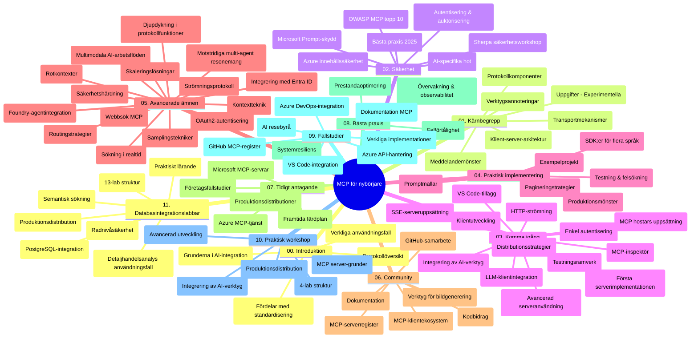

# Model Context Protocol (MCP) för nybörjare - Studieguide

Denna studieguide ger en översikt över repositories struktur och innehåll för kursen "Model Context Protocol (MCP) för nybörjare". Använd denna guide för att navigera i repositoryt effektivt och få ut det mesta av de tillgängliga resurserna.

## Översikt av repository

Model Context Protocol (MCP) är ett standardiserat ramverk för interaktioner mellan AI-modeller och klientapplikationer. Ursprungligen skapat av Anthropic, underhålls MCP nu av den bredare MCP-gemenskapen genom den officiella GitHub-organisationen. Detta repository tillhandahåller en omfattande kurs med praktiska kodexempel i C#, Java, JavaScript, Python och TypeScript, avsedd för AI-utvecklare, systemarkitekter och mjukvaruingenjörer.

## Visuell kursöversikt

## Repositorystruktur

Repositoryt är organiserat i elva huvudsektioner, där varje fokuserar på olika aspekter av MCP:

1. **Introduktion (00-Introduction/)**
   - Översikt av Model Context Protocol
   - Varför standardisering är viktigt i AI-pipelines
   - Praktiska användningsfall och fördelar

2. **Kärnkoncept (01-CoreConcepts/)**
   - Klient-server-arkitektur
   - Viktiga protokollkomponenter
   - Meddelandemönster i MCP

3. **Säkerhet (02-Security/)**
   - Säkerhetshot i MCP-baserade system
   - Bästa praxis för att säkra implementationer
   - Autentiserings- och auktoriseringsstrategier
   - **Omfattande säkerhetsdokumentation**:
     - MCP Security Best Practices 2025
     - Azure Content Safety Implementation Guide
     - MCP Security Controls and Techniques
     - MCP Best Practices Quick Reference
   - **Viktiga säkerhetsämnen**:
     - Promptinjektion och verktygsförgiftning
     - Sessionkapning och confused deputy-problem
     - Sårbarheter vid token-vidarebefordran
     - Överdrivna behörigheter och åtkomstkontroll
     - Leveranskedjesäkerhet för AI-komponenter
     - Microsoft Prompt Shields-integration

4. **Komma igång (03-GettingStarted/)**
   - Miljösetup och konfiguration
   - Skapa grundläggande MCP-servrar och klienter
   - Integration med befintliga applikationer
   - Innehåller sektioner för:
     - Första serverimplementationen
     - Klientutveckling
     - LLM-klientintegration
     - VS Code-integration
     - Server-Sent Events (SSE) server
     - Avancerad serveranvändning
     - HTTP-streaming
     - AI Toolkit-integration
     - Teststrategier
     - Driftsättningsriktlinjer

5. **Praktisk implementation (04-PracticalImplementation/)**
   - Använda SDK:er i olika programmeringsspråk
   - Felsökning, testning och valideringstekniker
   - Skapa återanvändbara promptmallar och arbetsflöden
   - Exempelprojekt med implementationsexempel

6. **Avancerade ämnen (05-AdvancedTopics/)**
   - Tekniker för kontextengineering
   - Foundry-agentintegration
   - Multimodala AI-arbetsflöden
   - OAuth2-autentiseringsdemos
   - Realtidssökning
   - Realtidsstreaming
   - Implementering av root-kontekster
   - Rutteringsstrategier
   - Sampeltekniker
   - Skalningsmetoder
   - Säkerhetsaspekter
   - Entra ID-säkerhetsintegration
   - Webb-sökintegration
   - Adversarial multi-agent resonemang (debattmönster)

7. **Community-bidrag (06-CommunityContributions/)**
   - Hur man bidrar med kod och dokumentation
   - Samarbete via GitHub
   - Communitydrivna förbättringar och feedback
   - Användning av olika MCP-klienter (Claude Desktop, Cline, VSCode)
   - Arbeta med populära MCP-servrar inklusive bildgenerering

8. **Lärdomar från tidig adoption (07-LessonsfromEarlyAdoption/)**
   - Riktiga implementationer och framgångshistorier
   - Bygga och driftsätta MCP-baserade lösningar
   - Trender och framtida roadmap
   - **Microsoft MCP Servers Guide**: Omfattande guide till 10 produktionsfärdiga Microsoft MCP-servrar inklusive:
     - Microsoft Learn Docs MCP Server
     - Azure MCP Server (15+ specialiserade anslutningar)
     - GitHub MCP Server
     - Azure DevOps MCP Server
     - MarkItDown MCP Server
     - SQL Server MCP Server
     - Playwright MCP Server
     - Dev Box MCP Server
     - Azure AI Foundry MCP Server
     - Microsoft 365 Agents Toolkit MCP Server

9. **Bästa praxis (08-BestPractices/)**
   - Prestandaoptimering och justering
   - Design för feltoleranta MCP-system
   - Testning och återhämtningsstrategier

10. **Fallstudier (09-CaseStudy/)**
    - **Sju omfattande fallstudier** som demonstrerar MCP:s mångsidighet i olika scenarier:
    - **Azure AI Travel Agents**: Multi-agent orkestrering med Azure OpenAI och AI Search
    - **Azure DevOps Integration**: Automatisera arbetsflöden med YouTube-datauppdateringar
    - **Dokumenthämtning i realtid**: Python-konsultklient med HTTP-streaming
    - **Interaktiv studieplansgenerator**: Chainlit webbapp med konverserande AI
    - **Dokumentation i redigerare**: VS Code-integration med GitHub Copilot-arbetsflöden
    - **Azure API Management**: Enterprise API-integration med MCP-server-skapande
    - **GitHub MCP Registry**: Ekosystemutveckling och agent-plattform
    - Implementationsexempel som sträcker sig över företagsintegration, utvecklarproduktivitet och ekosystemutveckling

11. **Praktisk workshop (10-StreamliningAIWorkflowsBuildingAnMCPServerWithAIToolkit/)**
    - Omfattande praktisk workshop som kombinerar MCP med AI Toolkit
    - Bygga intelligenta applikationer som kopplar AI-modeller med verkliga verktyg
    - Praktiska moduler som täcker grunder, egen serverutveckling och produktionsdriftsättningsstrategier
    - **Labstruktur**:
      - Lab 1: MCP Servergrunder
      - Lab 2: Avancerad MCP-serverutveckling
      - Lab 3: AI Toolkit-integration
      - Lab 4: Produktion och skalning
    - Labbaserat lärande med steg-för-steg-instruktioner

12. **MCP Server-databasintegrationslaborationer (11-MCPServerHandsOnLabs/)**
    - **Omfattande 13-laborationers lärandeväg** för att bygga produktionsfärdiga MCP-servrar med PostgreSQL-integration
    - **Verklighetsbaserad detaljhandelsanalys** med Zava Retail use case
    - **Enterprise-nivåmönster** inklusive Row Level Security (RLS), semantisk sökning och multi-tenant dataåtkomst
    - **Komplett labstruktur**:
      - **Labs 00-03: Grunder** - Introduktion, Arkitektur, Säkerhet, Miljösetup
      - **Labs 04-06: Bygga MCP-server** - Databasdesign, MCP-server-implementation, verktygsutveckling
      - **Labs 07-09: Avancerade funktioner** - Semantisk sökning, testning & felsökning, VS Code-integration
      - **Labs 10-12: Produktion & bästa praxis** - Driftsättning, övervakning, optimering
    - **Teknologier som täcks**: FastMCP-ramverk, PostgreSQL, Azure OpenAI, Azure Container Apps, Application Insights
    - **Lärandemål**: Produktionsfärdiga MCP-servrar, databasintegrationsmönster, AI-baserad analys, företagsäkerhet

## Ytterligare resurser

Repositoryt inkluderar stödresurser:

- **Mapp för bilder**: Innehåller diagram och illustrationer som används genom hela kursen
- **Översättningar**: Flerspråkigt stöd med automatiska översättningar av dokumentation
- **Officiella MCP-resurser**:
  - [MCP Documentation](https://modelcontextprotocol.io/)
  - [MCP Specification](https://spec.modelcontextprotocol.io/)
  - [MCP GitHub Repository](https://github.com/modelcontextprotocol)

## Hur du använder detta repository

1. **Sekventiell inlärning**: Följ kapitlen i ordning (00 till 11) för en strukturerad inlärningsupplevelse.
2. **Språkspecifikt fokus**: Om du är intresserad av ett visst programmeringsspråk, utforska mappstrukturen för exempel i ditt föredragna språk.
3. **Praktisk implementation**: Börja med avsnittet "Komma igång" för att sätta upp din miljö och skapa din första MCP-server och klient.
4. **Avancerad fördjupning**: När du är bekväm med grunderna, fördjupa dig i avancerade ämnen för att utöka din kunskap.
5. **Community-engagemang**: Gå med i MCP-gemenskapen via GitHub-diskussioner och Discord-kanaler för att koppla ihop med experter och andra utvecklare.

## MCP-klienter och verktyg

Kursen täcker flera MCP-klienter och verktyg:

1. **Officiella klienter**:
   - Visual Studio Code
   - MCP i Visual Studio Code
   - Claude Desktop
   - Claude i VSCode
   - Claude API

2. **Communityklienter**:
   - Cline (terminalbaserad)
   - Cursor (kodredigerare)
   - ChatMCP
   - Windsurf

3. **MCP-hanteringsverktyg**:
   - MCP CLI
   - MCP Manager
   - MCP Linker
   - MCP Router

## Populära MCP-servrar

Repositoryt introducerar olika MCP-servrar, inklusive:

1. **Officiella Microsoft MCP-servrar**:
   - Microsoft Learn Docs MCP Server
   - Azure MCP Server (15+ specialiserade anslutningar)
   - GitHub MCP Server
   - Azure DevOps MCP Server
   - MarkItDown MCP Server
   - SQL Server MCP Server
   - Playwright MCP Server
   - Dev Box MCP Server
   - Azure AI Foundry MCP Server
   - Microsoft 365 Agents Toolkit MCP Server

2. **Officiella referensservrar**:
   - Filesystem
   - Fetch
   - Memory
   - Sequential Thinking

3. **Bildgenerering**:
   - Azure OpenAI DALL-E 3
   - Stable Diffusion WebUI
   - Replicate

4. **Utvecklingsverktyg**:
   - Git MCP
   - Terminal Control
   - Code Assistant

5. **Specialiserade servrar**:
   - Salesforce
   - Microsoft Teams
   - Jira & Confluence

## Bidra

Detta repository välkomnar bidrag från gemenskapen. Se avsnittet Community Contributions för vägledning om hur du effektivt kan bidra till MCP-ekosystemet.

----

*Denna studieguide uppdaterades senast den 5 februari 2026 och speglar den senaste MCP Specification 2025-11-25 och ger en översikt över repositoryt per detta datum. Repositoryinnehåll kan uppdateras efter detta datum.*

---

<!-- CO-OP TRANSLATOR DISCLAIMER START -->
**Ansvarsfriskrivning**:  
Detta dokument har översatts med hjälp av AI-översättningstjänsten [Co-op Translator](https://github.com/Azure/co-op-translator). Även om vi strävar efter noggrannhet, var vänlig observera att automatiska översättningar kan innehålla fel eller brister. Det ursprungliga dokumentet på dess modersmål bör betraktas som den auktoritativa källan. För kritisk information rekommenderas professionell mänsklig översättning. Vi ansvarar inte för några missförstånd eller feltolkningar som uppstår från användningen av denna översättning.
<!-- CO-OP TRANSLATOR DISCLAIMER END -->