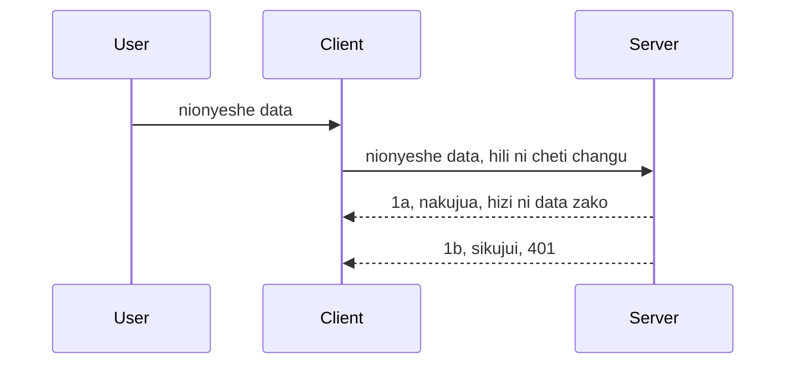

# Uthibitishaji rahisi

SDK za MCP zinaunga mkono matumizi ya OAuth 2.1 ambayo kwa kusema kweli ni mchakato mgumu unaohusisha dhana kama seva ya uthibitishaji, seva ya rasilimali, kutuma vitambulisho, kupata msimbo, kubadilishana msimbo kwa tokeni za bearera hadi hatimaye uweze kupata data ya rasilimali yako. Ikiwa haujawa mzururu na OAuth ambayo ni jambo zuri kutekeleza, ni wazo zuri kuanza na kiwango cha msingi cha uthibitishaji na kuendelea hadi kwa usalama bora zaidi. Ndiyo maana sura hii ipo, kukuinua hadi kwa uthibitishaji wa juu zaidi.

## Uthibitishaji, tunamaanisha nini?

Uthibitishaji ni kifupisho cha authentication na authorization. Wazo ni kwamba tunahitaji kufanya mambo mawili:

- **Authentication**, ambayo ni mchakato wa kugundua ikiwa tunaruhusu mtu kuingia nyumbani kwetu, kwamba ana haki ya kuwa "hapa" yaani kupata rasilimali zetu kwenye seva ya rasilimali ambapo huduma za MCP Server ziko.
- **Authorization**, ni mchakato wa kujua kama mtumiaji anapaswa kupata rasilimali hizi malao wanazozitaka, kwa mfano maagizo haya au bidhaa hizi au ikiwa wanaruhusiwa kusoma maudhui lakini si kufuta kama mfano mwingine.

## Vitambulisho: jinsi tunavyoambia mfumo ni nani sisi

Naam, wahandisi wengi wa wavuti hutafakari kwa kutoa kitambulisho kwa seva, kawaida siri inayosema kama wanaruhusiwa kuwa hapa "Authentication". Kitambulisho hiki kawaida ni toleo la base64 la jina la mtumiaji na nywila au funguo ya API inayotambulisha mtumiaji maalum.

Hii inahusisha kutuma kupitia kichwa kinachoitwa "Authorization" kama ifuatavyo:

```json
{ "Authorization": "secret123" }
```

Hii kawaida huitwa uthibitishaji wa msingi. Jinsi mchakato mzima unavyofanya kazi ni kwa njia ifuatayo:


Sasa tunapoelewa jinsi inavyofanya kazi kutoka mtazamo wa mchakato, tunawezaje kuitekeleza? Naam, seva nyingi za wavuti zina dhana inayoitwa middleware, kipande cha msimbo kinachofanya kazi kama sehemu ya ombi ambalo linaweza kuthibitisha vitambulisho, na ikiwa vitambulisho ni halali linaweza kuruhusu ombi lipite. Ikiwa ombi halina vitambulisho sahihi basi unapata kosa la uthibitishaji. Tuwone jinsi hii inaweza kutekelezwa:

**Python**

```python
class AuthMiddleware(BaseHTTPMiddleware):
    async def dispatch(self, request, call_next):

        has_header = request.headers.get("Authorization")
        if not has_header:
            print("-> Missing Authorization header!")
            return Response(status_code=401, content="Unauthorized")

        if not valid_token(has_header):
            print("-> Invalid token!")
            return Response(status_code=403, content="Forbidden")

        print("Valid token, proceeding...")
       
        response = await call_next(request)
        # ongeza vichwa vya wateja yoyote au badilisho lolote kwenye jibu kwa njia fulani
        return response


starlette_app.add_middleware(CustomHeaderMiddleware)
```

Hapa tuna:

- Kuunda middleware iitwayo `AuthMiddleware` ambapo njia yake ya `dispatch` inaitwa na seva ya wavuti.
- Kuongeza middleware kwa seva ya wavuti:

    ```python
    starlette_app.add_middleware(AuthMiddleware)
    ```

- Kuandika mantiki ya uthibitishaji inayokagua kama kichwa cha Authorization kipo na kama siri inayotumwa ni halali:

    ```python
    has_header = request.headers.get("Authorization")
    if not has_header:
        print("-> Missing Authorization header!")
        return Response(status_code=401, content="Unauthorized")

    if not valid_token(has_header):
        print("-> Invalid token!")
        return Response(status_code=403, content="Forbidden")
    ```

    ikiwa siri iko na ni halali basi tunaruhusu ombi lipite kwa kuita `call_next` na kurudisha majibu.

    ```python
    response = await call_next(request)
    # ongeza vichwa vya wateja wowote au badilisha jibu kwa njia fulani
    return response
    ```

Jinsi inavyofanya kazi ni kwamba ikiwa ombi la wavuti limefanyika kuelekea seva, middleware itaitwa na kutokana na utekelezaji wake itauruhusu ombi lipite au kurudisha kosa linaloonyesha mteja hana ruhusa ya kuendelea.

**TypeScript**

Hapa tunaunda middleware kwa kutumia mfumo maarufu Express na kukamata ombi kabla halijafika MCP Server. Huu ndiyo msimbo kwa hili:

```typescript
function isValid(secret) {
    return secret === "secret123";
}

app.use((req, res, next) => {
    // 1. Je, kichwa cha idhini kiko?
    if(!req.headers["Authorization"]) {
        res.status(401).send('Unauthorized');
    }
    
    let token = req.headers["Authorization"];

    // 2. Angalia uhalali.
    if(!isValid(token)) {
        res.status(403).send('Forbidden');
    }

   
    console.log('Middleware executed');
    // 3. Pitisha ombi hadi hatua inayofuata katika mchakato wa ombi.
    next();
});
```

Katika msimbo huu tunafanya:

1. Angalia kama kichwa cha Authorization kipo katika nafasi ya kwanza, kama hakipo, tunatuma kosa la 401.
2. Hakikisha kitambulisho/tokeni ni halali, ikiwa siyo, tunatuma kosa la 403.
3. Mwishowe kuruhusu ombi liendelee katika mchakato wa ombi na kurudisha rasilimali inayotakiwa.

## Zoef: Tekeleza uthibitishaji

Tuchukue maarifa yetu na tujaribu kutekeleza. Hapa ni mpango:

Seva

- Unda seva ya wavuti na mfano wa MCP.
- Tekeleza middleware kwa seva.

Mteja 

- Tuma ombi la wavuti, na kitambulisho, kupitia kichwa.

### -1- Unda seva ya wavuti na mfano wa MCP

Katika hatua yetu ya kwanza, tunahitaji kuunda mfano wa seva ya wavuti na MCP Server.

**Python**

Hapa tunaunda mfano wa MCP server, kuunda app ya wavuti ya starlette na kuiendesha kwa uvicorn.

```python
# kuunda Server ya MCP

app = FastMCP(
    name="MCP Resource Server",
    instructions="Resource Server that validates tokens via Authorization Server introspection",
    host=settings["host"],
    port=settings["port"],
    debug=True
)

# kuunda programu ya wavuti ya starlette
starlette_app = app.streamable_http_app()

# kuhudumia programu kupitia uvicorn
async def run(starlette_app):
    import uvicorn
    config = uvicorn.Config(
            starlette_app,
            host=app.settings.host,
            port=app.settings.port,
            log_level=app.settings.log_level.lower(),
        )
    server = uvicorn.Server(config)
    await server.serve()

run(starlette_app)
```

Katika msimbo huu tunafanya:

- Tengeneza MCP Server.
- Tengeneza app ya wavuti ya starlette kutoka MCP Server, `app.streamable_http_app()`.
- Iendeshe app ya wavuti kwa kutumia uvicorn `server.serve()`.

**TypeScript**

Hapa tunaunda mfano wa MCP Server.

```typescript
const server = new McpServer({
      name: "example-server",
      version: "1.0.0"
    });

    // ... sanidi rasilimali za seva, zana, na maelekezo ...
```

Uundaji huu wa MCP Server utahitaji kufanyika ndani ya ufafanuzi wa njia ya POST /mcp, hivyo tuchukue msimbo hapo juu na kuuweka kama ifuatavyo:

```typescript
import express from "express";
import { randomUUID } from "node:crypto";
import { McpServer } from "@modelcontextprotocol/sdk/server/mcp.js";
import { StreamableHTTPServerTransport } from "@modelcontextprotocol/sdk/server/streamableHttp.js";
import { isInitializeRequest } from "@modelcontextprotocol/sdk/types.js"

const app = express();
app.use(express.json());

// Ramani ya kuhifadhi usafirishaji kwa ID ya kikao
const transports: { [sessionId: string]: StreamableHTTPServerTransport } = {};

// Shughulikia ombi la POST kwa mawasiliano ya mteja-kwa-server
app.post('/mcp', async (req, res) => {
  // Angalia kama ID ya kikao inapatikana
  const sessionId = req.headers['mcp-session-id'] as string | undefined;
  let transport: StreamableHTTPServerTransport;

  if (sessionId && transports[sessionId]) {
    // Tumia tena usafirishaji uliopo
    transport = transports[sessionId];
  } else if (!sessionId && isInitializeRequest(req.body)) {
    // Ombi jipya la uanzishaji
    transport = new StreamableHTTPServerTransport({
      sessionIdGenerator: () => randomUUID(),
      onsessioninitialized: (sessionId) => {
        // Hifadhi usafirishaji kwa ID ya kikao
        transports[sessionId] = transport;
      },
      // Ulinzi wa DNS rebinding umezimwa kwa chaguo-msingi kwa ajili ya ulinganifu wa nyuma. Ikiwa unafanya kazi na server hii
      // kwa karibu, hakikisha kuweka:
      // enableDnsRebindingProtection: kweli,
      // allowedHosts: ['127.0.0.1'],
    });

    // Safisha usafirishaji wakati unapo fungwa
    transport.onclose = () => {
      if (transport.sessionId) {
        delete transports[transport.sessionId];
      }
    };
    const server = new McpServer({
      name: "example-server",
      version: "1.0.0"
    });

    // ... panga rasilimali za server, zana, na maelekezo ...

    // Unganisha na server ya MCP
    await server.connect(transport);
  } else {
    // Ombi batili
    res.status(400).json({
      jsonrpc: '2.0',
      error: {
        code: -32000,
        message: 'Bad Request: No valid session ID provided',
      },
      id: null,
    });
    return;
  }

  // Shughulikia ombi
  await transport.handleRequest(req, res, req.body);
});

// Mshughulikiaji wa kutumia tena kwa maombi ya GET na DELETE
const handleSessionRequest = async (req: express.Request, res: express.Response) => {
  const sessionId = req.headers['mcp-session-id'] as string | undefined;
  if (!sessionId || !transports[sessionId]) {
    res.status(400).send('Invalid or missing session ID');
    return;
  }
  
  const transport = transports[sessionId];
  await transport.handleRequest(req, res);
};

// Shughulikia maombi ya GET kwa arifa kutoka server-kwa-mteja kupitia SSE
app.get('/mcp', handleSessionRequest);

// Shughulikia maombi ya DELETE kwa kumaliza kikao
app.delete('/mcp', handleSessionRequest);

app.listen(3000);
```

Sasa unaona jinsi uundaji wa MCP Server ulivyohamishwa ndani ya `app.post("/mcp")`.

Tuelekee hatua inayofuata ya kuunda middleware ili tuweze kuthibitisha kitambulisho kinachokuja.

### -2- Tekeleza middleware kwa seva

Sasa tufike sehemu ya middleware. Hapa tutaunda middleware inayotafuta kitambulisho kwenye kichwa cha `Authorization` na kukithibitisha. Ikiwa kitakubalika basi ombi litaendelea kufanya kile kinachohitajika (kwa mfano kuorodheshwa zana, kusoma rasilimali au huduma nyingine yoyote ya MCP iliyoombwa na mteja).

**Python**

Ili kuunda middleware, tunahitaji kuunda darasa linalo tuwalika `BaseHTTPMiddleware`. Kuna vipande viwili vya kupendeza:

- Ombi `request` , tunachosoma taarifa za kichwa kutoka kwake.
- `call_next` ni callback tunayohitaji kuitisha ikiwa mteja amekuja na kitambulisho tunachokubali.

Kwanza, tunahitaji kushughulikia hali ikiwa kichwa cha `Authorization` hakipo:

```python
has_header = request.headers.get("Authorization")

# hakuna kichwa cha habari kinachopatikana, kosa na 401, vinginevyo endelea.
if not has_header:
    print("-> Missing Authorization header!")
    return Response(status_code=401, content="Unauthorized")
```

Hapa tunatuma ujumbe wa 401 unauthorized kwa sababu mteja anashindwa uthibitishaji.

Ifuatayo, ikiwa kitambulisho kililetwa, tunahakikisha uhalali wake kama ifuatavyo:

```python
 if not valid_token(has_header):
    print("-> Invalid token!")
    return Response(status_code=403, content="Forbidden")
```

Angalia jinsi tunavyotuma ujumbe wa 403 forbidden hapo juu. Tuwone middleware kamili hapa chini ikitekeleza yote tuliyosema hapo juu:

```python
class AuthMiddleware(BaseHTTPMiddleware):
    async def dispatch(self, request, call_next):

        has_header = request.headers.get("Authorization")
        if not has_header:
            print("-> Missing Authorization header!")
            return Response(status_code=401, content="Unauthorized")

        if not valid_token(has_header):
            print("-> Invalid token!")
            return Response(status_code=403, content="Forbidden")

        print("Valid token, proceeding...")
        print(f"-> Received {request.method} {request.url}")
        response = await call_next(request)
        response.headers['Custom'] = 'Example'
        return response

```

Nzuri, lakini vipi kuhusu kazi ya `valid_token`? Hii ipo hapa chini:

```python
# USITUMIE kwa ajili ya uzalishaji - boresha !!
def valid_token(token: str) -> bool:
    # ondoa kiambishi "Bearer "
    if token.startswith("Bearer "):
        token = token[7:]
        return token == "secret-token"
    return False
```

Hii itakuwa bora zaidi kuendelezwa.

MUHIMU: Haujawahi kuweka siri kama hizi katika msimbo. Unapaswa kupata thamani za kulinganisha kutoka kwa chanzo cha data au kutoka kwa IDP (mtoa huduma wa kitambulisho) au bora zaidi, ruhusu IDP ifanye uthibitishaji.

**TypeScript**

Ili kutekeleza hili kwa Express, tunahitaji kuita njia `use` inayochukua kazi za middleware.

Tunahitaji:

- Kuingiliana na variable ya ombi ili kuangalia kitambulisho kilichotumwa chini ya mali ya `Authorization`.
- Thibitisha kitambulisho, na ikiwa ni halali, ruhusu ombi liendelee na ombi la MCP la mteja lifanye kinachotakiwa (kama orodha za zana, kusoma rasilimali au kingine chochote kinachohusiana na MCP).

Hapa, tunakagua kama kichwa cha `Authorization` kiko na kama hakiko, tunazuia ombi jipite:

```typescript
if(!req.headers["authorization"]) {
    res.status(401).send('Unauthorized');
    return;
}
```

Ikiwa kichwa hakitumwi kabisa, unapata 401.

Ifuatayo, tunakagua kama kitambulisho ni halali, ikiwa siyo tena tunazuia ombi lakini na ujumbe tofauti kidogo:

```typescript
if(!isValid(token)) {
    res.status(403).send('Forbidden');
    return;
} 
```

Angalia jinsi sasa unapata kosa la 403.

Huu ndiyo msimbo kamili:

```typescript
app.use((req, res, next) => {
    console.log('Request received:', req.method, req.url, req.headers);
    console.log('Headers:', req.headers["authorization"]);
    if(!req.headers["authorization"]) {
        res.status(401).send('Unauthorized');
        return;
    }
    
    let token = req.headers["authorization"];

    if(!isValid(token)) {
        res.status(403).send('Forbidden');
        return;
    }  

    console.log('Middleware executed');
    next();
});
```

Tumeandaa seva ya wavuti kukubali middleware ili kuangalia kitambulisho kinachotumwa na mteja. Vipi kuhusu mteja?

### -3- Tuma ombi la wavuti na kitambulisho kupitia kichwa

Tunahitaji kuhakikisha mteja anapita kitambulisho kupitia kichwa. Kama tunatumia mteja wa MCP kufanya hivyo, tunahitaji kujua jinsi ya kufanya hivyo.

**Python**

Kwa mteja, tunahitaji kupitisha kichwa na kitambulisho kama ifuatavyo:

```python
# USIweke thamani moja kwa moja, iwe angalau katika variable ya mazingira au hifadhi salama zaidi
token = "secret-token"

async with streamablehttp_client(
        url = f"http://localhost:{port}/mcp",
        headers = {"Authorization": f"Bearer {token}"}
    ) as (
        read_stream,
        write_stream,
        session_callback,
    ):
        async with ClientSession(
            read_stream,
            write_stream
        ) as session:
            await session.initialize()
      
            # TODO, unachotaka kifanyike katika mteja, mfano orodha ya zana, piga simu kwa zana n.k.
```

Angalia jinsi tunavyojaza mali ya `headers` kama ` headers = {"Authorization": f"Bearer {token}"}`.

**TypeScript**

Tunaweza kutatua hili kwa hatua mbili:

1. Jaza kitu cha usanidi na kitambulisho chetu.
2. Pitisha kitu cha usanidi kwa usafirishaji.

```typescript

// USIANDIKE thamani moja kwa moja kama ilivyoonyeshwa hapa. Angalau iwe kama variable ya mazingira na tumia kitu kama dotenv (katika mode ya maendeleo).
let token = "secret123"

// eleza kitu cha chaguo la usafirishaji wa mteja
let options: StreamableHTTPClientTransportOptions = {
  sessionId: sessionId,
  requestInit: {
    headers: {
      "Authorization": "secret123"
    }
  }
};

// pita kitu cha chaguo kwa usafirishaji
async function main() {
   const transport = new StreamableHTTPClientTransport(
      new URL(serverUrl),
      options
   );
```

Hapa unaona jinsi tulivyotakiwa kuunda kitu cha `options` na kuweka kichwa chetu chini ya mali ya `requestInit`.

MUHIMU: Tunawezaje kuboresha hili? Naam, utekelezaji huu wa sasa una changamoto. Kwanza, kupitisha kitambulisho kama hiki ni hatari isipokuwa kwa kiwango cha chini unatumia HTTPS. Hata hivyo, kitambulisho kinaweza kuibiwa hivyo unahitaji mfumo ambapo unaweza kukataa tokeni haraka na kuongeza ukaguzi zaidi kama ni wapi duniani kinatoka, kama ombi linafanyika mara nyingi sana (tabia ya bot), kwa kifupi, kuna masuala mengi ya kuzingatia.

Hata hivyo, kwa API rahisi sana ambapo hautaki mtu yeyote kupiga API yako bila kuthibitishwa na hiki kilichopo hapa ni mwanzo mzuri.

Kwa kusema hivyo, tujaribu kuimarisha usalama kidogo kwa kutumia muundo uliowekwa kama JSON Web Token, pia inajulikana kama JWT au tokeni za "JOT".

## JSON Web Tokens, JWT

Hivyo, tunajaribu kuboresha mambo kutoka kwa vitambulisho rahisi mno. Je, maboresho ya haraka tunayopata tunapokubali JWT ni gani?

- **Maboresho ya usalama**. Katika uthibitishaji wa msingi, unatumia jina la mtumiaji na nywila kama tokeni iliyosimbwa kwa base64 (au unatumia funguo ya API) mara kwa mara ambayo huongeza hatari. Kwa JWT, unatumia jina la mtumiaji na nywila na unapata tokeni kama kirejesho na tokeni hiyo pia ina kikomo cha muda yaani itakoma muda. JWT inakuwezesha kutumia udhibiti wa upatikanaji kwa usawa mdogo kwa kutumia majukumu, maeneo na ruhusa.
- **Kutegemea hali ya kuishi au kutokuwa na hali na kuongezeka kwa uwezo.** JWT ni ibeba taarifa zote za mtumiaji na haitegemezi kuhifadhi kikao upande wa seva. Tokeni pia inaweza kuthibitishwa eneo husika.
- **Uchakataji na ushirikiano.** JWT ni kiini cha Open ID Connect na hutumiwa na watoa kitambulisho wanaojulikana kama Entra ID, Google Identity na Auth0. Hii pia inawezesha kutumia single sign on na zaidi yenye viwango vya biashara.
- **Ugawaji na kubadilika.** JWT pia inaweza kutumika na API Gateways kama Azure API Management, NGINX na zaidi. Pia huunga mkono hali za uthibitishaji na mawasiliano ya seva kwa seva ikiwa ni pamoja na kuigiza na kuaminisha.
- **Utendaji na kuhifadhiwa kwa muda.** JWT inaweza kuhifadhiwa baada ya kusimbuliwa ambayo hupunguza hitaji la kuchambua tena. Hii husaidia hasa kwa programu za trafiki kubwa kwa kuboresha mtiririko na kupunguza mzigo kwenye miundombinu uliyochagua.
- **Vipengele vya juu zaidi.** Pia huunga mkono utambuzi (kuangalia uhalali kwenye seva) na kukataa (kufanya tokeni isiwe halali).

Kwa faida hizi zote, tuchunguze jinsi tunavyoweza kuboresha utekelezaji wetu hadi kiwango kingine.

## Kubadilisha uthibitishaji wa msingi kuwa JWT

Hivyo, mabadiliko tunayohitaji kufanya kwa mtazamo wa juu ni:

- **Jifunza kuunda tokeni ya JWT** na kuitayarisha kutumwa kutoka kwa mteja kwenda seva.
- **Thibitisha tokeni ya JWT**, na ikiwa ndivyo, ruhusu mteja kupata rasilimali zetu.
- **Hifadhi tokeni kwa usalama**. Jinsi tunavyohifadhi tokeni hii.
- **Linda njia za kuingia**. Tunahitaji kulinda njia, katika kesi yetu, kulinda njia na huduma maalum za MCP.
- **Ongeza tokeni za upya**. Hakikisha tunaunda tokeni fupi muda lakini tokeni za upya zenye maisha marefu zinazoweza kutumiwa kupata tokeni mpya ikiwa zitamalizika muda. Pia hakikisha kuna njia ya upya tokeni na mbinu ya mzunguko.

### -1- Tengeneza tokeni ya JWT

Kwanza, tokeni ya JWT ina sehemu zifuatazo:

- **kichwa**, algoriti inayotumika na aina ya tokeni.
- **mzigo**, madai, kama sub (mtumiaji au chombo kinachowakilishwa na tokeni. Katika hali ya uthibitishaji huu kawaida ni userid), exp (wakati wa ukomo) role (jajukumu)
- **sahihi**, imesainiwa na siri au funguo binafsi.

Kwa hili, tutahitaji kutengeneza kichwa, mzigo na tokeni iliyosimbwa.

**Python**

```python

import jwt
import jwt
from jwt.exceptions import ExpiredSignatureError, InvalidTokenError
import datetime

# Funguo la siri linalotumika kusaini JWT
secret_key = 'your-secret-key'

header = {
    "alg": "HS256",
    "typ": "JWT"
}

# habari za mtumiaji na madai yake na wakati wa kumalizika
payload = {
    "sub": "1234567890",               # Mada (kitambulisho cha mtumiaji)
    "name": "User Userson",                # Dawa maalum
    "admin": True,                     # Dawa maalum
    "iat": datetime.datetime.utcnow(),# Imetolewa
    "exp": datetime.datetime.utcnow() + datetime.timedelta(hours=1)  # Kumalizika
}

# ficha
encoded_jwt = jwt.encode(payload, secret_key, algorithm="HS256", headers=header)
```

Katika msimbo huu tulifanya:

- Kutoa kichwa tukiwa tumetumia HS256 kama algoriti na aina kuwa JWT.
- Kutengeneza mzigo unaoonyesha somo au kitambulisho cha mtumiaji, jina la mtumiaji, jukumu, wakati ulipotolewa na wakati utakapoisha hivyo kutekeleza kipengele cha kikomo cha muda tulichosema mapema.

**TypeScript**

Hapa tutahitaji tegemezi zinazotusaidia kuunda tokeni ya JWT.

Tegemezi

```sh

npm install jsonwebtoken
npm install --save-dev @types/jsonwebtoken
```

Sasa tunapokuwa na hayo, tutoe kichwa, mzigo na kupitia hilo tengeneza tokeni iliyosimbwa.

```typescript
import jwt from 'jsonwebtoken';

const secretKey = 'your-secret-key'; // Tumia env vars katika uzalishaji

// Fafanua payload
const payload = {
  sub: '1234567890',
  name: 'User usersson',
  admin: true,
  iat: Math.floor(Date.now() / 1000), // Imetolewa saa
  exp: Math.floor(Date.now() / 1000) + 60 * 60 // Inakaribia kumalizika baada ya saa 1
};

// Fafanua kichwa (hiari, jsonwebtoken huweka chaguo-msingi)
const header = {
  alg: 'HS256',
  typ: 'JWT'
};

// Unda tokeni
const token = jwt.sign(payload, secretKey, {
  algorithm: 'HS256',
  header: header
});

console.log('JWT:', token);
```

Tokeni hii ni:

Imeandikwa kwa kutumia HS256
Inatumika kwa saa 1
Inajumuisha madai kama sub, name, admin, iat, na exp.

### -2- Thibitisha tokeni

Pia tutahitaji kuthibitisha tokeni, jambo ambalo tunapaswa kufanya kwenye seva ili kuhakikisha kile mteja anachotutumia ni halali. Kuna ukaguzi mwingi tunapaswa kufanya hapa kutoka kuthibitisha muundo wake hadi uhalali wake. Pia unahimizwa kuongeza ukaguzi mwingine kuona kama mtumiaji yupo kwenye mfumo wako na zaidi.

Ili kuthibitisha tokeni, tunahitaji kuisimbua ili tuliweze kusoma na kisha kuanza kuangalia uhalali wake:

**Python**

```python

# Tafsiri na hakiki JWT
try:
    decoded = jwt.decode(token, secret_key, algorithms=["HS256"])
    print("✅ Token is valid.")
    print("Decoded claims:")
    for key, value in decoded.items():
        print(f"  {key}: {value}")
except ExpiredSignatureError:
    print("❌ Token has expired.")
except InvalidTokenError as e:
    print(f"❌ Invalid token: {e}")

```

Katika msimbo huu, tunaita `jwt.decode` tukitumia tokeni, funguo nyeti na algoriti iliyochaguliwa kama viingilio. Angalia jinsi tunavyotumia muundo wa try-catch kwani kuthibitisha kwa kushindwa husababisha kosa.

**TypeScript**

Hapa tunahitaji kuitisha `jwt.verify` kupata toleo lililosimbuliwa la tokeni ambalo tunaweza kuchambua zaidi. Ikiwa mwito huu utashindwa, hiyo ina maana muundo wa tokeni si sahihi au haiko halali tena.

```typescript

try {
  const decoded = jwt.verify(token, secretKey);
  console.log('Decoded Payload:', decoded);
} catch (err) {
  console.error('Token verification failed:', err);
}
```

KUMBUKA: kama ilivyotajwa awali, tunapaswa kufanya ukaguzi zaidi kuhakikisha tokeni hii inaonyesha mtumiaji katika mfumo wetu na kuhakikisha mtumiaji ana haki alizodai.

Ifuatayo, tuchukulie udhibiti wa upatikanaji wa msingi wa majukumu, unaojulikana pia kama RBAC.
## Kuongeza udhibiti wa upatikanaji kulingana na majukumu

Dhana ni kwamba tunataka kusema kuwa majukumu tofauti yana ruhusa tofauti. Kwa mfano, tunadhani msimamizi anaweza kufanya kila kitu na mtumiaji wa kawaida anaweza kusoma/kuandika na mgeni anaweza kusoma tu. Kwa hiyo, hapa kuna viwango vya ruhusa vinavyowezekana:

- Admin.Write 
- User.Read
- Guest.Read

Tuchunguze jinsi tunaweza kutekeleza udhibiti huo kwa kutumia middleware. Middleware zinaweza kuongezwa kwa kila njia pamoja na kwa njia zote.

**Python**

```python
from starlette.middleware.base import BaseHTTPMiddleware
from starlette.responses import JSONResponse
import jwt

# USIweke siri kwenye msimbo kama huu, huu ni kwa madhumuni ya kuonyesha tu. Iisome kutoka mahali salama.
SECRET_KEY = "your-secret-key" # weka hii kwenye variable ya env
REQUIRED_PERMISSION = "User.Read"

class JWTPermissionMiddleware(BaseHTTPMiddleware):
    async def dispatch(self, request, call_next):
        auth_header = request.headers.get("Authorization")
        if not auth_header or not auth_header.startswith("Bearer "):
            return JSONResponse({"error": "Missing or invalid Authorization header"}, status_code=401)

        token = auth_header.split(" ")[1]
        try:
            decoded = jwt.decode(token, SECRET_KEY, algorithms=["HS256"])
        except jwt.ExpiredSignatureError:
            return JSONResponse({"error": "Token expired"}, status_code=401)
        except jwt.InvalidTokenError:
            return JSONResponse({"error": "Invalid token"}, status_code=401)

        permissions = decoded.get("permissions", [])
        if REQUIRED_PERMISSION not in permissions:
            return JSONResponse({"error": "Permission denied"}, status_code=403)

        request.state.user = decoded
        return await call_next(request)


```

Kuna njia chache tofauti za kuongeza middleware kama ifuatavyo:

```python

# Alt 1: ongeza middleware wakati wa kuunda programu ya starlette
middleware = [
    Middleware(JWTPermissionMiddleware)
]

app = Starlette(routes=routes, middleware=middleware)

# Alt 2: ongeza middleware baada ya programu ya starlette kuundwa tayari
starlette_app.add_middleware(JWTPermissionMiddleware)

# Alt 3: ongeza middleware kwa kila njia
routes = [
    Route(
        "/mcp",
        endpoint=..., # mshughulikiaji
        middleware=[Middleware(JWTPermissionMiddleware)]
    )
]
```

**TypeScript**

Tunaweza kutumia `app.use` na middleware itakayotekelezwa kwa maombi yote.

```typescript
app.use((req, res, next) => {
    console.log('Request received:', req.method, req.url, req.headers);
    console.log('Headers:', req.headers["authorization"]);

    // 1. Angalia kama kichwa cha idhini kimesafirishwa

    if(!req.headers["authorization"]) {
        res.status(401).send('Unauthorized');
        return;
    }
    
    let token = req.headers["authorization"];

    // 2. Angalia kama tokeni ni halali
    if(!isValid(token)) {
        res.status(403).send('Forbidden');
        return;
    }  

    // 3. Angalia kama mtumiaji wa tokeni yupo katika mfumo wetu
    if(!isExistingUser(token)) {
        res.status(403).send('Forbidden');
        console.log("User does not exist");
        return;
    }
    console.log("User exists");

    // 4. Thibitisha kuwa tokeni ina ruhusa sahihi
    if(!hasScopes(token, ["User.Read"])){
        res.status(403).send('Forbidden - insufficient scopes');
    }

    console.log("User has required scopes");

    console.log('Middleware executed');
    next();
});

```

Kuna mambo kadhaa tunayoweza kuruhusu middleware yetu na ambayo middleware yetu INASTAHILI kufanya, yaani:

1. Kagua kama kichwa cha idhini kipo
2. Kagua kama tokeni ni halali, tunaita `isValid` ambayo ni njia tuliyoandika inayokagua uadilifu na uhalali wa tokeni ya JWT.
3. Thibitisha mtumiaji yupo katika mfumo wetu, tunapaswa kuangalia hili.

   ```typescript
    // watumiaji katika DB
   const users = [
     "user1",
     "User usersson",
   ]

   function isExistingUser(token) {
     let decodedToken = verifyToken(token);

     // TODO, angalia kama mtumiaji yupo katika DB
     return users.includes(decodedToken?.name || "");
   }
   ```

   Hapo juu, tumetengeneza orodha rahisi sana ya `users`, ambayo inapaswa kuwepo kwenye database bila shaka.

4. Zaidi ya hayo, tunapaswa pia kuhakikisha tokeni ina ruhusa sahihi.

   ```typescript
   if(!hasScopes(token, ["User.Read"])){
        res.status(403).send('Forbidden - insufficient scopes');
   }
   ```

   Katika msimbo huu hapo juu unaotoka middleware, tunakagua kwamba tokeni ina ruhusa ya User.Read, ikiwa hapana tunatuma kosa la 403. Hapo chini ni njia ya msaada `hasScopes`.

   ```typescript
   function hasScopes(scope: string, requiredScopes: string[]) {
     let decodedToken = verifyToken(scope);
    return requiredScopes.every(scope => decodedToken?.scopes.includes(scope));
  }
   ```

Have a think which additional checks you should be doing, but these are the absolute minimum of checks you should be doing.

Using Express as a web framework is a common choice. There are helpers library when you use JWT so you can write less code.

- `express-jwt`, helper library that provides a middleware that helps decode your token.
- `express-jwt-permissions`, this provides a middleware `guard` that helps check if a certain permission is on the token.

Here's what these libraries can look like when used:

```typescript
const express = require('express');
const jwt = require('express-jwt');
const guard = require('express-jwt-permissions')();

const app = express();
const secretKey = 'your-secret-key'; // put this in env variable

// Decode JWT and attach to req.user
app.use(jwt({ secret: secretKey, algorithms: ['HS256'] }));

// Check for User.Read permission
app.use(guard.check('User.Read'));

// multiple permissions
// app.use(guard.check(['User.Read', 'Admin.Access']));

app.get('/protected', (req, res) => {
  res.json({ message: `Welcome ${req.user.name}` });
});

// Error handler
app.use((err, req, res, next) => {
  if (err.code === 'permission_denied') {
    return res.status(403).send('Forbidden');
  }
  next(err);
});

```

Sasa umeona jinsi middleware inaweza kutumika kwa uthibitishaji na idhini, je, kuhusu MCP, je, inabadilisha jinsi tunavyofanya uthibitishaji? Tujifunze katika sehemu inayofuata.

### -3- Ongeza RBAC kwa MCP

Umeona hadi sasa jinsi unavyoweza kuongeza RBAC kupitia middleware, hata hivyo, kwa MCP hakuna njia rahisi ya kuongeza RBAC ya kipengele kwa kila MCP, basi tunafanya nini? Naam, tunahitaji tu kuongeza msimbo kama huu unaokagua katika kesi hii kama mteja ana haki ya kuita zana maalum:

Una chaguzi kadhaa tofauti kuhusu jinsi ya kufanikisha RBAC kwa kila kipengele, hizi ni baadhi:

- Ongeza ukaguzi kwa kila zana, rasilimali, au ombi ambapo unahitaji kuangalia kiwango cha ruhusa.

   **python**

   ```python
   @tool()
   def delete_product(id: int):
      try:
          check_permissions(role="Admin.Write", request)
      catch:
        pass # mteja ameshindwa idhini, onyesha kosa la idhini
   ```

   **typescript**

   ```typescript
   server.registerTool(
    "delete-product",
    {
      title: Delete a product",
      description: "Deletes a product",
      inputSchema: { id: z.number() }
    },
    async ({ id }) => {
      
      try {
        checkPermissions("Admin.Write", request);
        // kufanya, tuma kitambulisho kwa productService na ingizo la mbali
      } catch(Exception e) {
        console.log("Authorization error, you're not allowed");  
      }

      return {
        content: [{ type: "text", text: `Deletected product with id ${id}` }]
      };
    }
   );
   ```


- Tumia mbinu ya seva ya hali ya juu na wataalamu wa maombi ili kupunguza idadi ya sehemu unazotakiwa kufanya ukaguzi.

   **Python**

   ```python
   
   tool_permission = {
      "create_product": ["User.Write", "Admin.Write"],
      "delete_product": ["Admin.Write"]
   }

   def has_permission(user_permissions, required_permissions) -> bool:
      # user_permissions: orodha ya ruhusa ambazo mtumiaji ana
      # required_permissions: orodha ya ruhusa zinazohitajika kwa zana
      return any(perm in user_permissions for perm in required_permissions)

   @server.call_tool()
   async def handle_call_tool(
     name: str, arguments: dict[str, str] | None
   ) -> list[types.TextContent]:
    # Kubali request.user.permissions ni orodha ya ruhusa za mtumiaji
     user_permissions = request.user.permissions
     required_permissions = tool_permission.get(name, [])
     if not has_permission(user_permissions, required_permissions):
        # Toa kosa "Huna ruhusa ya kutumia zana {name}"
        raise Exception(f"You don't have permission to call tool {name}")
     # endelea na kuitisha zana
     # ...
   ```   
   

   **TypeScript**

   ```typescript
   function hasPermission(userPermissions: string[], requiredPermissions: string[]): boolean {
       if (!Array.isArray(userPermissions) || !Array.isArray(requiredPermissions)) return false;
       // Rudisha kweli ikiwa mtumiaji ana angalau idhini moja inayohitajika
       
       return requiredPermissions.some(perm => userPermissions.includes(perm));
   }
  
   server.setRequestHandler(CallToolRequestSchema, async (request) => {
      const { params: { name } } = request;
  
      let permissions = request.user.permissions;
  
      if (!hasPermission(permissions, toolPermissions[name])) {
         return new Error(`You don't have permission to call ${name}`);
      }
  
      // endelea..
   });
   ```

   Kumbuka, utahitaji kuhakikisha middleware yako inaweka tokeni iliyotafsiriwa kwenye mali ya user ya ombi ili msimbo hapo juu uwe rahisi.

### Muhtasari

Sasa tulipopitia jinsi ya kuongeza msaada wa RBAC kwa ujumla na kwa MCP hasa, ni wakati wa kujaribu kutekeleza usalama mwenyewe ili kuhakikisha umeelewa dhana zilizokuwasilishwa.

## Kazi ya Nyumbani 1: Jenga seva ya mcp na mteja wa mcp kwa kutumia uthibitishaji wa msingi

Hapa utachukua kile ulichojifunza kuhusu kutuma vyeti kupitia vichwa.

## Suluhisho 1

[Suluhisho 1](./code/basic/README.md)

## Kazi ya Nyumbani 2: Boresha suluhisho kutoka Kazi ya Nyumbani 1 kutumia JWT

Chukua suluhisho la kwanza lakini wakati huu, tujiboreshe.

Badala ya kutumia Basic Auth, tumia JWT.

## Suluhisho 2

[Suluhisho 2](./solution/jwt-solution/README.md)

## Changamoto

Ongeza RBAC kwa kila zana kama tulivyoelezea katika sehemu "Ongeza RBAC kwa MCP".

## Muhtasari

Tumepata mafunzo mengi katika sura hii, kutoka kwa ukosefu wa usalama kabisa, hadi usalama wa msingi, hadi JWT na jinsi inavyoweza kuongezwa kwa MCP.

Tumejenga msingi imara na JWT maalum, lakini tunapokua, tunaelekea kwenye mfano wa utambulisho wa viwango. Kutumia IdP kama Entra au Keycloak kunatupa nafasi ya kuhamisha utoaji wa tokeni, uhakiki, na usimamizi wa mzunguko kutoka kwa jukwaa linaloaminika — kutuwezesha kuzingatia mantiki ya programu na uzoefu wa mtumiaji.

Kwa hilo, tuna sura ya [kina zaidi kuhusu Entra](../../05-AdvancedTopics/mcp-security-entra/README.md).

## Ifuatayo

- Ifuatayo: [Kuweka Wenyeji wa MCP](../12-mcp-hosts/README.md)

---

<!-- CO-OP TRANSLATOR DISCLAIMER START -->
**Ugawaji wa Jukumu**:  
Hati hii imetafsiriwa kwa kutumia huduma ya kutafsiri kwa AI [Co-op Translator](https://github.com/Azure/co-op-translator). Ingawa tunajitahidi kwa usahihi, tafadhali fahamu kwamba tafsiri za moja kwa moja zinaweza kuwa na makosa au upotovu wa ukweli. Hati asilia katika lugha yake ya asili inapaswa kuchukuliwa kama chanzo cha mamlaka. Kwa taarifa muhimu, tafsiri ya kitaalamu ya binadamu inashauriwa. Hatuwajibiki kwa kutafsiri vibaya au kutoelewana kunakotokana na matumizi ya tafsiri hii.
<!-- CO-OP TRANSLATOR DISCLAIMER END -->