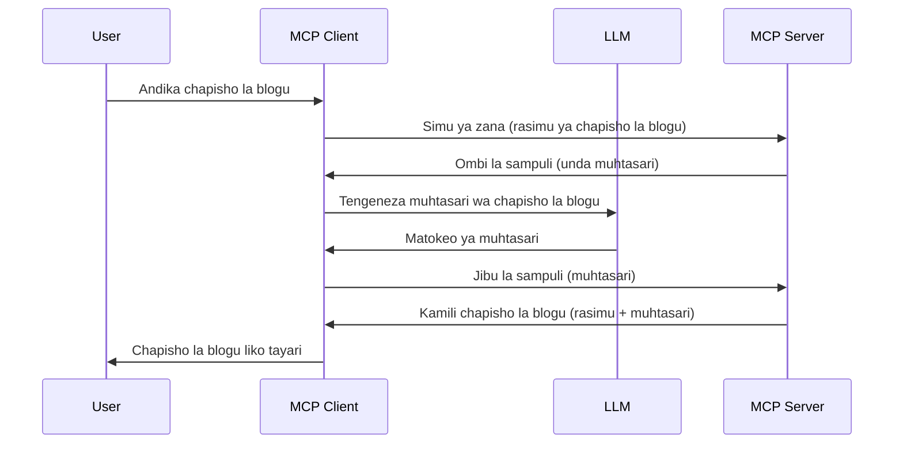

# Sampuli - kupeana sifa kwa Mteja

Wakati mwingine, unahitaji MCP Client na MCP Server kushirikiana kufanikisha lengo la pamoja. Huenda ukawa na kesi ambapo Server inahitaji msaada wa LLM ambayo iko kwenye mteja. Kwa hali hii, sampuli ndilo unalopaswa kutumia.

Tuchunguze baadhi ya matumizi na jinsi ya kujenga suluhisho linalohusisha sampuli.

## Muhtasari

Katika somo hili, tunazingatia kuelezea lini na wapi kutumia Sampuli na jinsi ya kuipanua.

## Malengo ya Kujifunza

Katika sura hii, tutafanya:

- Elezea kinachoitwa Sampuli na lini ya kuitumia.
- Onyesha jinsi ya kusanidi Sampuli katika MCP.
- Toa mifano ya Sampuli katika utekelezaji.

## Sampuli ni nini na kwa nini kuitumia?

Sampuli ni sifa ya hali ya juu inayofanya kazi kwa njia ifuatayo:


### Ombi la Sampuli

Sawa, sasa tuna mtazamo wa juu wa hali halisi ya kuaminika, hebu tuzungumze kuhusu ombi la sampuli ambalo server hutuma kwa mteja. Hili ni mfano wa ombi hilo katika muundo wa JSON-RPC:

```json
{
  "jsonrpc": "2.0",
  "id": 1,
  "method": "sampling/createMessage",
  "params": {
    "messages": [
      {
        "role": "user",
        "content": {
          "type": "text",
          "text": "Create a blog post summary of the following blog post: <BLOG POST>"
        }
      }
    ],
    "modelPreferences": {
      "hints": [
        {
          "name": "claude-3-sonnet"
        }
      ],
      "intelligencePriority": 0.8,
      "speedPriority": 0.5
    },
    "systemPrompt": "You are a helpful assistant.",
    "maxTokens": 100
  }
}
```

Kuna mambo machache ya kuzingatia hapa:

- Prompt, chini ya content -> text, ni agizo letu kwa LLM kuifupisha maudhui ya chapisho la blogu.

- **modelPreferences**. Sehemu hii ni hiyo tu, mapendeleo, ushauri wa ni usanidi gani utumike na LLM. Mtumiaji anaweza kuchagua kufuata ushauri huu au kubadilisha. Katika kesi hii kuna mapendekezo kuhusu mfano wa kutumia na kipaumbele cha kasi na akili.
- **systemPrompt**, hili ni agizo lako la kawaida la mfumo linalompa LLM yako tabia na lina maelekezo ya mwongozo.
- **maxTokens**, ni mali nyingine inayotumika kusema ni token ngapi zinapendekezwa kutumika kwa kazi hii.

### Majibu ya Sampuli

Majibu haya ndiyo MCP Client hurejesha kwa MCP Server na ni matokeo ya mteja kupiga simu LLM, kusubiri jibu halafu kutengeneza ujumbe huu. Hili ni mfano katika JSON-RPC:

```json
{
  "jsonrpc": "2.0",
  "id": 1,
  "result": {
    "role": "assistant",
    "content": {
      "type": "text",
      "text": "Here's your abstract <ABSTRACT>"
    },
    "model": "gpt-5",
    "stopReason": "endTurn"
  }
}
```

Angalia jinsi jibu ni muhtasari wa chapisho la blogu kama tulivyoomba. Pia angalia jinsi `model` iliyotumika si ile tuliyoomba bali "gpt-5" badala ya "claude-3-sonnet". Hii ni kuonyesha kwamba mtumiaji anaweza kubadili mawazo kuhusu kutumia nini na ombi lako la sampuli ni ushauri tu.

Sawa, sasa tumeelewa mzunguko mkuu, na kazi yenye manufaa ya kuitumia "kutengeneza chapisho la blogu + muhtasari", hebu tuangalie ni nini tunapaswa kufanya ili ifanye kazi.

### Aina za Ujumbe

Ujumbe wa sampuli hauwekwi kikomo kwa maandishi tu bali unaweza pia kutuma picha na sauti. Hili ndilo jinsi JSON-RPC inavyoonekana tofauti:

**Maandishi**

```json
{
  "type": "text",
  "text": "The message content"
}
```

**Maudhui ya Picha**

```json
{
  "type": "image",
  "data": "base64-encoded-image-data",
  "mimeType": "image/jpeg"
}
```

**Maudhui ya Sauti**

```json
{
  "type": "audio",
  "data": "base64-encoded-audio-data",
  "mimeType": "audio/wav"
}
```

> NOTE: kwa taarifa zaidi za kina kuhusu Sampuli, angalia [nyaraka rasmi](https://modelcontextprotocol.io/specification/2025-06-18/client/sampling)

## Jinsi ya Kusanidi Sampuli katika Mteja

> Kumbuka: ikiwa unajenga server tu, huna haja ya kufanya mengi hapa.

Katika mteja, unahitaji kubainisha kipengele ifuatavyo hivi:

```json
{
  "capabilities": {
    "sampling": {}
  }
}
```

Hii itachukuliwa wakati mteja uliochagua anapoanzisha na server.

## Mfano wa Sampuli Katika Utekelezaji - Tengeneza Chapisho la Blogu

Tandike server ya sampuli pamoja, tutahitaji kufanya yafuatayo:

1. Tengeneza chombo kwenye Server.
1. Chombo hicho kinapaswa kutengeneza ombi la sampuli
1. Chombo kinapaswa kusubiri ombi la sampuli la mteja lijibiwe.
1. Kisha matokeo ya chombo yafanikiwe.

Hebu tuangalie msimbo hatua kwa hatua:

### -1- Tengeneza chombo

**python**

```python
@mcp.tool()
async def create_blog(title: str, content: str, ctx: Context[ServerSession, None]) -> str:
    """Create a blog post and generate a summary"""

```

### -2- Tengeneza ombi la sampuli

Panua chombo chako kwa msimbo ufuatao:

**python**

```python
post = BlogPost(
        id=len(posts) + 1,
        title=title,
        content=content,
        abstract=""
    )

prompt = f"Create an abstract of the following blog post: title: {title} and draft: {content} "

result = await ctx.session.create_message(
        messages=[
            SamplingMessage(
                role="user",
                content=TextContent(type="text", text=prompt),
            )
        ],
        max_tokens=100,
)

```

### -3- Subiri jibu na litoe

**python**

```python
post.abstract = result.content.text

posts.append(post)

# rudisha bidhaa kamili
return json.dumps({
    "id": post.title,
    "abstract": post.abstract
})
```

### -4- Msimbo kamili

**python**

```python
from starlette.applications import Starlette
from starlette.routing import Mount, Host

from mcp.server.fastmcp import Context, FastMCP

from mcp.server.session import ServerSession
from mcp.types import SamplingMessage, TextContent

import json


from uuid import uuid4
from typing import List
from pydantic import BaseModel


mcp = FastMCP("Blog post generator")

# app = FastAPI()

posts = []

class BlogPost(BaseModel):
    id: int
    title: str
    content: str
    abstract: str

posts: List[BlogPost] = []

@mcp.tool()
async def create_blog(title: str, content: str, ctx: Context[ServerSession, None]) -> str:
    """Create a blog post and generate a summary"""

    post = BlogPost(
        id=len(posts) + 1,
        title=title,
        content=content,
        abstract=""
    )

    prompt = f"Create an abstract of the following blog post: title: {title} and draft: {content} "

    result = await ctx.session.create_message(
        messages=[
            SamplingMessage(
                role="user",
                content=TextContent(type="text", text=prompt),
            )
        ],
        max_tokens=100,
    )

    post.abstract = result.content.text

    posts.append(post)

    # rudisha chapisho kamili la blogu
    return json.dumps({
        "id": post.title,
        "abstract": post.abstract
    })

if __name__ == "__main__":
    print("Starting server...")
    # mcp.run()
    mcp.run(transport="streamable-http")

# endesha app kwa: python server.py
```

### -5- Kuipima katika Visual Studio Code

Ili kuipima hii katika Visual Studio Code, fanya yafuatayo:

1. Anzisha server katika terminali
1. Iiingize kwenye *mcp.json* (na hakikisha imesheheniwa) mfano kama hivi:

   ```json
   "servers": {
      "blog-server": {
        "type": "http",
        "url": "http://localhost:8000/mcp"
      }
   }
   ```

1. Andika prompt:

   ```text
   create a blog post named "Where Python comes from", the content is "Python is actually named after Monty Python Flying Circus"
   ```

1. Ruhusu sampuli ifanyike. Mara ya kwanza unapojaribu hii utaonyeshwa dialogi ya ziada ambayo utahitaji kuikubali, kisha utaona dialogi ya kawaida ya kuomba uendeshe chombo

1. Angalia matokeo. Utaona matokeo yakiwekwa kwa mpangilio mzuri katika GitHub Copilot Chat lakini pia unaweza kuchunguza jibu la asili la JSON.

**Ziada**. Zana za Visual Studio Code zina msaada mzuri wa sampuli. Unaweza kusanidi upatikanaji wa Sampuli kwenye server uliyoisakinisha kwa kuingia baharini kama hizi:

1. Nenda kwenye sehemu ya uendelezaji
1. Chagua ikoni ya gia kwa server uliyoisakinisha katika sehemu ya "MCP SERVERS - INSTALLED".
1. Chagua "Configure Model Access", hapa unaweza kuchagua ni Modeli gani GitHub Copilot inaruhusiwa kuzitumia wakati wa sampuli. Pia unaweza kuona maombi yote ya sampuli yaliyotokea hivi karibuni kwa kuchagua "Show Sampling requests".

## Kazi ya Nyumbani

Katika kazi hii ya nyumbani, utajenga sampuli tofauti kidogo ya muunganiko wa sampuli unaounga mkono kuzalisha maelezo ya bidhaa. Hii hapa ni hali yako:

**Hali Halisi**: Mfanyakazi wa nyuma wa ofisi katika duka la mtandaoni anahitaji msaada, inachukua muda mwingi kutengeneza maelezo ya bidhaa. Kwa hivyo, unapaswa kujenga suluhisho ambapo unaweza kupiga simu chombo "create_product" kwa kutumia "title" na "keywords" kama hoja na kinapaswa kuumba bidhaa kamili ikijumuisha uwanja wa "description" ambao utajazwa na LLM ya mteja.

TIP: tumia ulivyojifunza hapo awali kujenga server hii na chombo chake kwa kutumia ombi la sampuli.

## Suluhisho

[Solution](./solution/README.md)

## Muhimu Kumbuka

Sampuli ni sifa yenye nguvu inayowezesha server kupeana kazi kwa mteja wakati inahitaji msaada wa LLM.

## Nini Kifuatayo

- [Sura ya 4 - Utekelezaji wa vitendo](../../04-PracticalImplementation/README.md)

---

<!-- CO-OP TRANSLATOR DISCLAIMER START -->
**Kiarifu cha Msamaha**:  
Hati hii imetafsiriwa kwa kutumia huduma ya tafsiri ya AI [Co-op Translator](https://github.com/Azure/co-op-translator). Ingawa tunajitahidi kwa usahihi, tafadhali fahamu kuwa tafsiri za kiotomatiki zinaweza kuwa na makosa au kutokukamilika. Hati asilia katika lugha yake ya asili inapaswa kuzuiliwa kama chanzo dhabiti. Kwa taarifa muhimu, tafsiri ya kitaalamu inayofanywa na binadamu inapendekezwa. Hatubebei mzigo wowote wa kuelewana au kutoelewana kunakotokana na matumizi ya tafsiri hii.
<!-- CO-OP TRANSLATOR DISCLAIMER END -->