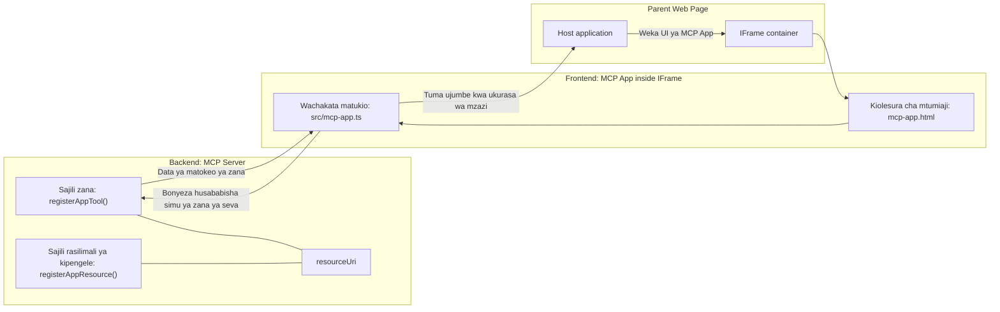

# MCP Apps

MCP Apps ni mtindo mpya katika MCP. Wazo ni kwamba si tu unajibu nyuma na data kutoka kwa simu ya zana, pia unatoa taarifa kuhusu jinsi taarifa hii inavyopaswa kushughulikiwa. Hii inamaanisha matokeo ya zana sasa yanaweza kuwa na taarifa za UI. Kwa nini tungetaka hivyo? Vizuri, fikiria jinsi unavyofanya mambo leo. Huenda unatumia matokeo ya MCP Server kwa kuweka aina fulani ya frontend mbele yake, hiyo ni msimbo unaohitaji kuandika na kudumisha. Wakati mwingine hiyo ndiyo unayotaka, lakini wakati mwingine itakuwa nzuri kama unaweza kuleta kipande cha taarifa chenye yake yenyewe ambacho kina kila kitu kutoka data hadi kiolesura cha mtumiaji.

## Muhtasari

Somo hili linatoa mwongozo wa vitendo kuhusu MCP Apps, jinsi ya kuanza nayo na jinsi ya kuiunganisha katika Web Apps zako zilizopo. MCP Apps ni nyongeza mpya sana kwenye MCP Standard.

## Malengo ya Kujifunza

Mwisho wa somo hili, utaweza:

- Elezea MCP Apps ni nini.
- Wakati wa kutumia MCP Apps.
- Jenga na unganisha MCP Apps zako mwenyewe.

## MCP Apps - inavyofanya kazi

Wazo la MCP Apps ni kutoa jibu ambalo hasa ni kipengele cha kuonyeshwa. Kipengele kama hiki kinaweza kuwa na mwonekano na mwingiliano, mfano, bonyeza vifungo, utoaji wa mtumiaji na zaidi. Tuanzie upande wa seva na MCP Server yetu. Kuunda kipengele cha MCP App unahitaji kuunda zana lakini pia rasilimali ya programu. Hizi sehemu mbili zinaunganishwa na resourceUri.

Hapa kuna mfano. Tujaribu kuona kinachohusika na ni sehemu gani inafanya kazi gani:

```text
server.ts -- responsible for registering tools and the component as a UI component
src/
  mcp-app.ts -- wiring up event handlers
mcp-app.html -- the user interface
```

Muonekano huu unaelezea usanifu wa kuunda kipengele na mantiki yake.


Tujaribu kuelezea majukumu ya sehemu ya nyuma na mbele kwa mtiririko.

### Sehemu ya nyuma

Kuna mambo mawili tunahitaji kuyatimiza hapa:

- Kurejesha zana tunazotaka kushirikiana nazo.
- Kuelezea kipengele.

**Kurejesha zana**

```typescript
registerAppTool(
    server,
    "get-time",
    {
      title: "Get Time",
      description: "Returns the current server time.",
      inputSchema: {},
      _meta: { ui: { resourceUri } }, // Inatumia zana hii kwa rasilimali yake ya UI
    },
    async () => {
      const time = new Date().toISOString();
      return { content: [{ type: "text", text: time }] };
    },
  );

```

Msimbo uliotangulia unaelezea tabia, ambapo unaonyesha zana inayoitwa `get-time`. Haina pembejeo yoyote lakini hatimaye hutengeneza wakati wa sasa. Tuna uwezo wa kufafanua `inputSchema` kwa zana ambapo tunahitaji kupokea maingizo ya mtumiaji.

**Kurejesha kipengele**

Katika faili hiyo hiyo, pia tunahitaji kurejesha kipengele:

```typescript
const resourceUri = "ui://get-time/mcp-app.html";

// Sajili rasilimali, ambayo inarudisha HTML/JavaScript iliyounganishwa kwa UI.
registerAppResource(
  server,
  resourceUri,
  resourceUri,
  { mimeType: RESOURCE_MIME_TYPE },
  async () => {
    const html = await fs.readFile(path.join(DIST_DIR, "mcp-app.html"), "utf-8");

    return {
    contents: [
        { uri: resourceUri, mimeType: RESOURCE_MIME_TYPE, text: html },
    ],
    };
  },
);
```

Angalia jinsi tunavyotaja `resourceUri` kuunganisha kipengele na zana zake. Kinachovutia pia ni callback ambapo tunapakia faili ya UI na kurudisha kipengele.

### Sehemu ya mbele ya kipengele

Kama sehemu ya nyuma, hapa kuna sehemu mbili:

- Sehemu ya mbele imeandikwa kwa HTML safi.
- Msimbo unaoshughulikia matukio na ni nini kifanyike, mfano, kupiga simu zana au kutuma ujumbe kwa dirisha la mzazi.

**Kiolesura cha mtumiaji**

Tazama kiolesura cha mtumiaji.

```html
<!-- mcp-app.html -->
<!DOCTYPE html>
<html lang="en">
  <head>
    <meta charset="UTF-8" />
    <title>Get Time App</title>
  </head>
  <body>
    <p>
      <strong>Server Time:</strong> <code id="server-time">Loading...</code>
    </p>
    <button id="get-time-btn">Get Server Time</button>
    <script type="module" src="/src/mcp-app.ts"></script>
  </body>
</html>
```

**Kuweka mtiririko wa matukio**

Sehemu ya mwisho ni kuweka mtiririko wa matukio. Hii inamaanisha tunatambua ni sehemu gani katika UI yetu inahitaji mshitishaji wa matukio na ni nini kifanyike ikiwa matukio yatafanyika:

```typescript
// mcp-app.ts

import { App } from "@modelcontextprotocol/ext-apps";

// Pata marejeleo ya sehemu
const serverTimeEl = document.getElementById("server-time")!;
const getTimeBtn = document.getElementById("get-time-btn")!;

// Unda mfano wa programu
const app = new App({ name: "Get Time App", version: "1.0.0" });

// Shughulikia matokeo ya chombo kutoka kwa seva. Weka kabla ya `app.connect()` ili kuepuka
// kukosa matokeo ya awali ya chombo.
app.ontoolresult = (result) => {
  const time = result.content?.find((c) => c.type === "text")?.text;
  serverTimeEl.textContent = time ?? "[ERROR]";
};

// Sanidi kitufe cha kubonyeza
getTimeBtn.addEventListener("click", async () => {
  // `app.callServerTool()` inaruhusu UI kuomba data mpya kutoka kwa seva
  const result = await app.callServerTool({ name: "get-time", arguments: {} });
  const time = result.content?.find((c) => c.type === "text")?.text;
  serverTimeEl.textContent = time ?? "[ERROR]";
});

// Unganisha na mwenyeji
app.connect();
```

Kama unavyoona kutoka hapo juu, huu ni msimbo wa kawaida wa kuunganisha vipengele vya DOM kwa matukio. Kinachostahili kutajwa ni simu kwa `callServerTool` ambayo hatimaye inaita zana upande wa nyuma.

## Kushughulikia maingizo ya mtumiaji

Hadi sasa, tumeona kipengele chenye kitufe ambacho kinapobonyezwa huita zana. Tujaribu kuongeza vipengele zaidi vya UI kama fomu ya kuingiza na tuone kama tunaweza kutuma hoja kwa zana. Tutawekeza kipengele cha FAQ. Hivi ndivyo kinavyopaswa kufanya kazi:

- Kuwe na kitufe na kipengele cha kuingiza ambapo mtumiaji anaandika neno muhimu la kutafuta mfano "Shipping". Hii inapaswa kuita zana upande wa nyuma inayofanya utafutaji katika data ya FAQ.
- Zana inayounga mkono utafutaji wa FAQ ulioelezwa.

Tuweke msaada unaohitajika kwanza upande wa nyuma:

```typescript
const faq: { [key: string]: string } = {
    "shipping": "Our standard shipping time is 3-5 business days.",
    "return policy": "You can return any item within 30 days of purchase.",
    "warranty": "All products come with a 1-year warranty covering manufacturing defects.",
  }

registerAppTool(
    server,
    "get-faq",
    {
      title: "Search FAQ",
      description: "Searches the FAQ for relevant answers.",
      inputSchema: zod.object({
        query: zod.string().default("shipping"),
      }),
      _meta: { ui: { resourceUri: faqResourceUri } }, // Inaunganisha kifaa hiki na rasilimali yake ya UI
    },
    async ({ query }) => {
      const answer: string = faq[query.toLowerCase()] || "Sorry, I don't have an answer for that.";
      return { content: [{ type: "text", text: answer }] };
    },
  );
```

Kinachojitokeza hapa ni jinsi tunavyojaza `inputSchema` na kumpa skimu ya `zod` kama ifuatavyo:

```typescript
inputSchema: zod.object({
  query: zod.string().default("shipping"),
})
```

Katika skimu hiyo tunatangaza kuwa tuna pembi la ingizo linaloitwa `query` na kwamba ni hiari na linalo thamani ya msingi "shipping".

Sawa, tuendelee kwa *mcp-app.html* kuona UI tunazohitaji kuunda kwa hili:

```html
<div class="faq">
    <h1>FAQ response</h1>
    <p>FAQ Response: <code id="faq-response">Loading...</code></p>
    <input type="text" id="faq-query" placeholder="Enter FAQ query" />
    <button id="get-faq-btn">Get FAQ Response</button>
  </div>
```

Nzuri, sasa tuna kipengele cha kuingiza na kitufe. Twende kwenye *mcp-app.ts* kufuatilia matukio haya:

```typescript
const getFaqBtn = document.getElementById("get-faq-btn")!;
const faqQueryInput = document.getElementById("faq-query") as HTMLInputElement;

getFaqBtn.addEventListener("click", async () => {
  const query = faqQueryInput.value;
  const result = await app.callServerTool({ name: "get-faq", arguments: { query } });
  const faq = result.content?.find((c) => c.type === "text")?.text;
  faqResponseEl.textContent = faq ?? "[ERROR]";
});
```

Katika msimbo uliotangulia:

- Tunaumba rejea kwa vipengele vya UI vinavyoshirikiana.
- Tunashughulikia bonyeza la kitufe kuchambua thamani ya kipengele cha kuingiza na pia tunaiga `app.callServerTool()` na `name` na `arguments` ambapo hii ya mwisho inapita `query` kama thamani.

Kinachotokea hasa unapopiga `callServerTool` ni kwamba hutuma ujumbe kwa dirisha la mzazi na dirisha hilo hatimaye huita MCP Server.

### Jaribu

Tunapojaribu hili sasa tunapaswa kuona yafuatayo:


hapa ni pale tunapojaribu na maingizo kama "warranty"


Ili kuendesha msimbo huu, nenda kwenye [Code section](./code/README.md)

## Kupima katika Visual Studio Code

Visual Studio Code ina msaada mzuri kwa MCP Apps na huenda ikawa njia rahisi zaidi ya kupima MCP Apps zako. Kutumia Visual Studio Code, ongeza rekodi ya seva kwenye *mcp.json* kama ifuatavyo:

```json
"my-mcp-server-7178eca7": {
    "url": "http://localhost:3001/mcp",
    "type": "http"
  }
```

Kisha anzisha seva, utakuwa na uwezo wa kuwasiliana na MCP App yako kupitia Dirisha la Chat ikitegemea kuwa umeweka GitHub Copilot.

Unaweza kuanzisha kwa kutumia amri, mfano "#get-faq":


na kama ulivyoiendesha kupitia kivinjari, itaonyesha njia ile ile hivi:


## Mtihani

Tengeneza mchezo wa rock paper scissor. Inapaswa kuwa na mambo yafuatayo:

UI:

- orodha ya kushuka na chaguzi
- kitufe cha kuwasilisha chaguo
- lebo inayoonyesha nani alichagua nini na nani alishinda

Seva:

- inapaswa kuwa na zana ya rock paper scissor ambayo hupokea "choice" kama pembejeo. Inapaswa pia kuonyesha chaguo la kompyuta na kuamua mshindi

## Suluhisho

[Suluhisho](./assignment/README.md)

## Muhtasari

Tumefahamu kuhusu mtindo huu mpya wa MCP Apps. Ni mtindo mpya unaoruhusu MCP Servers kuwa na mtazamo si tu kuhusu data bali pia jinsi data hii inavyoweza kuonyeshwa.

Zaidi ya hayo, tumefahamu kwamba MCP Apps hizi hutumika katika IFrame na kuwasiliana na MCP Servers zinapaswa kutuma ujumbe kwa app ya wavuti ya mzazi. Kuna maktaba kadhaa kwa JavaScript safi na React na zaidi zinazofanya mawasiliano haya kuwa rahisi.

## Muhimu Kujifunza

Hivi ndivyo ulivyofundishwa:

- MCP Apps ni mcha wa kawaida mpya ambao unaweza kuwa wa manufaa unapotaka kusafirisha data na vipengele vya UI.
- Aina hizi za apps zinaendesha ndani ya IFrame kwa sababu za usalama.

## Nini Kifuatacho

- [Sura ya 4](../../04-PracticalImplementation/README.md)

---

<!-- CO-OP TRANSLATOR DISCLAIMER START -->
**Maonyesho ya kisheria**:
Hati hii imetafsiriwa kwa kutumia huduma ya tafsiri ya AI [Co-op Translator](https://github.com/Azure/co-op-translator). Ingawa tunajitahidi kwa usahihi, tafadhali fahamu kuwa tafsiri za otomatiki zinaweza kuwa na makosa au upungufu wa usahihi. Hati ya asili katika lugha yake ya asili inapaswa kuchukuliwa kama chanzo cha uhakika. Kwa taarifa muhimu, tafsiri ya mtaalamu wa binadamu inashauriwa. Hatuna dhamana kwa mkanganyiko wowote au tafsiri zisizo sahihi zinazotokana na matumizi ya tafsiri hii.
<!-- CO-OP TRANSLATOR DISCLAIMER END -->