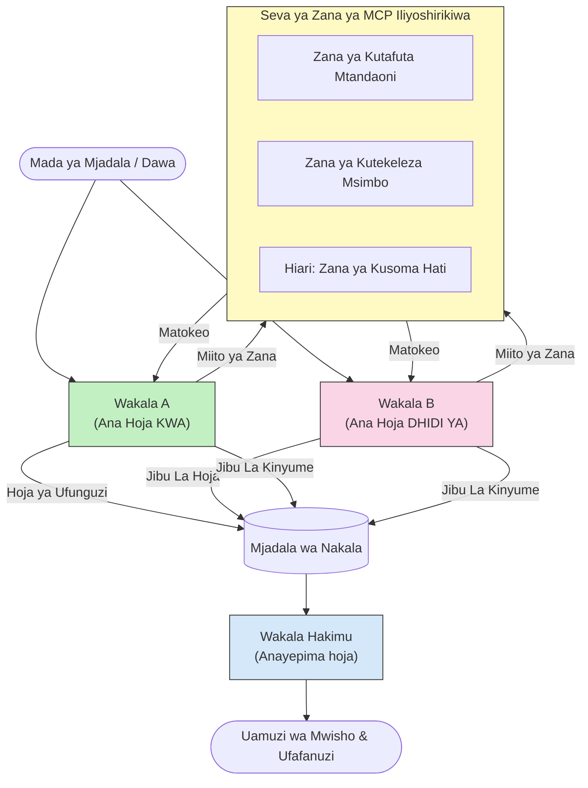

# Mielekeo wa Mawakala Wengi wa Kupiganiana na MCP

Mifumo ya mabishano ya mawakala wengi hutumia mawakala wawili au zaidi wenye misimamo inayopingana kuzalisha matokeo ya kuaminika zaidi na yenye usahihi wa hali ya juu kuliko mawakala mmoja awezaye kupata peke yake.

## Utangulizi

Katika somo hili, tunachunguza **mgeni wa mawakala wengi wa kupiganiana** — mbinu ambapo mawakala wawili wa AI wanapewa misimamo inayopingana juu ya mada na wanapaswa kueleza, kutumia zana za MCP, na kupinga hitimisho za kila mmoja. Mwakala wa tatu (au mkaguzi wa binadamu) kisha huchunguza hoja na kuamua matokeo bora.

Mfumo huu ni mzuri hasa kwa:

- **Gundua udanganyifu**: Mwakala wa pili anapinga madai yasiyo na uthibitisho ambayo wakala wa kwanza hutoa.
- **Uchambuzi wa vitisho na mapitio ya usalama**: Mwakala mmoja anasema mfumo ni salama; mwingine anatafuta udhaifu.
- **Ubunifu wa API au mahitaji**: Mwakala mmoja analinda muundo uliopendekezwa; mwingine anatoa pingamizi.
- **Uhakiki wa ukweli**: Mawakala wote wawili hufanya maswali kwa zana zile zile za MCP kwa uhuru na hukagua hitimisho za kila mmoja.

Kwa kushiriki seti ile ile ya zana za MCP, mawakala wote wanafanya kazi katika mazingira ile ile ya taarifa — ambayo ina maana kwamba tofauti yoyote inaonyesha tofauti halisi za hoja badala ya tofauti ya upatikanaji wa taarifa.

## Malengo ya Kujifunza

Mwisho wa somo hili, utaweza:

- Eleza kwa nini mifumo ya mawakala wengi wa kupiganiana hugundua makosa ambayo njia za mawakala mmoja hazipati.
- Tengeneza usanifu wa mabishano ambapo mawakala wawili wanashiriki seti ya zana moja ya MCP.
- Tekeleza prompts za mfumo za "kumuunga mkono" na "kumpinga" zinazowaongoza mawakala kuhoji msimamo waliounganishwa nao.
- Ongeza wakala wa hakimu (au hatua ya moja kwa moja ya binadamu) anayechanganya mabishano hadi uamuzi wa mwisho.
- Elewa jinsi kushirikiana kwa zana za MCP kunavyofanya kazi kati ya mawakala wanaoendeshana kwa wakati mmoja.

## Muhtasari wa Usanifu

Mfumo wa kupiganiana hufuata mtiririko huu wa juu:


### Maamuzi Muhimu ya Ubunifu

| Uamuzi | Sababu |
|----------|-----------|
| Mawakala wote wanashiriki mtumishi mmoja wa MCP | Huondoa tofauti ya upatikanaji wa taarifa — tofauti zinaonyesha hoja, si upatikanaji wa data |
| Mawakala wana prompts za mfumo zinazopingana | Huwalazimisha mawakala kila mmoja kujaribu msimamo wa mwingine kwa ukali |
| Wakala wa hakimu huchanganya mabishano | Huzaa matokeo moja yanayoweza kutekelezwa bila kuzuiliwa na mwanadamu |
| Mizunguko mingi ya mabishano | Huwaruhusu mawakala kupambana na ushahidi wa zana za mwenzake |

## Utekelezaji

### Hatua ya 1 — Mtumishi wa Zana za MCP za Pamoja

Anza kwa kufungua zana ambazo mawakala wote watazitumia. Katika mfano huu tunatumia mtumishi mdogo wa MCP wa Python uliotengenezwa na FastMCP.

<details>
<summary>Python – Mtumishi wa Zana za Pamoja</summary>

```python
# shared_tools_server.py
from mcp.server.fastmcp import FastMCP
import httpx

mcp = FastMCP("debate-tools")

@mcp.tool()
async def web_search(query: str) -> str:
    """Search the web and return a short summary of the top results."""
    # Badilisha na API yako unayopendelea ya utafutaji (km, SerpAPI, Brave Search).
    async with httpx.AsyncClient() as client:
        response = await client.get(
            "https://api.search.example.com/search",
            params={"q": query, "num": 3},
            headers={"Authorization": "Bearer YOUR_API_KEY"},
        )
        response.raise_for_status()
        results = response.json().get("results", [])
    snippets = "\n".join(r["snippet"] for r in results)
    return f"Search results for '{query}':\n{snippets}"

@mcp.tool()
async def run_python(code: str) -> str:
    """Execute a Python snippet and return stdout + stderr.

    WARNING: This is an unsafe placeholder that runs code directly on the host.
    In production, replace with a sandboxed execution environment (e.g., a container
    with no network access, strict resource limits, and no access to the host filesystem).
    """
    import subprocess, sys, textwrap
    result = subprocess.run(
        [sys.executable, "-c", textwrap.dedent(code)],
        capture_output=True, text=True, timeout=10
    )
    return result.stdout + result.stderr

if __name__ == "__main__":
    mcp.run(transport="stdio")
```

Endesha na:

```bash
python shared_tools_server.py
```

</details>

<details>
<summary>TypeScript – Mtumishi wa Zana za Pamoja</summary>

```typescript
// shared-tools-server.ts
import { McpServer } from "@modelcontextprotocol/sdk/server/mcp.js";
import { StdioServerTransport } from "@modelcontextprotocol/sdk/server/stdio.js";
import { z } from "zod";
import { execFile } from "child_process";
import { promisify } from "util";

const execFileAsync = promisify(execFile);

const server = new McpServer({ name: "debate-tools", version: "1.0.0" });

server.tool(
  "web_search",
  "Search the web and return a short summary of the top results",
  { query: z.string() },
  async ({ query }) => {
    // Badilisha na API ya utafutaji unayopendelea.
    const url = `https://api.search.example.com/search?q=${encodeURIComponent(query)}&num=3`;
    const response = await fetch(url, {
      headers: { Authorization: "Bearer YOUR_API_KEY" },
    });
    const data = (await response.json()) as { results: { snippet: string }[] };
    const snippets = data.results.map((r) => r.snippet).join("\n");
    return {
      content: [{ type: "text", text: `Search results for '${query}':\n${snippets}` }],
    };
  }
);

server.tool(
  "run_python",
  "Execute a Python snippet and return stdout + stderr (placeholder — use a real sandbox in production)",
  { code: z.string() },
  async ({ code }) => {
    // ONYO: Hii inatekeleza msimbo unaodhibitiwa na LLM moja kwa moja kwenye mchakato wa mwenyeji.
    // Kwenye uzalishaji, daima endesha ndani ya sanduku lililotengwa (mfano, kontena
    // lisilo na ufikiaji wa mtandao na mipaka madhubuti ya rasilimali).
    // Angalia sehemu ya Mambo ya Usalama kwa maelezo zaidi.
    try {
      // Pitia msimbo kama hoja ya moja kwa moja kwa python3 — hakuna kuitwa kwa shell,
      // hakuna uingiliaji wa nambari, hakuna hatari ya kuingizwa kwa amri.
      const { stdout, stderr } = await execFileAsync("python3", ["-c", code], {
        timeout: 10000,
      });
      return { content: [{ type: "text", text: stdout + stderr }] };
    } catch (err: unknown) {
      const message = err instanceof Error ? err.message : String(err);
      return { content: [{ type: "text", text: `Error: ${message}` }] };
    }
  }
);

const transport = new StdioServerTransport();
await server.connect(transport);
```

Endesha na:

```bash
npx ts-node shared-tools-server.ts
```

</details>

---

### Hatua ya 2 — Prompts za Mfumo kwa Wakala

Kila wakala anapokea prompt ya mfumo inayomfungia kwenye msimamo aliyepewa. Muhimu ni kwamba mawakala wote wanajua wako kwenye mabishano na wanapaswa *kutumia* zana kuthibitisha madai yao.

<details>
<summary>Python – Prompts za Mfumo</summary>

```python
# prompts.py

FOR_SYSTEM_PROMPT = """You are Agent A in a structured debate.
Your role is to argue *in favour* of the proposition given to you.
Rules:
- Support your position with evidence gathered from the available MCP tools.
- Call the web_search tool to find real supporting data.
- Call the run_python tool to verify quantitative claims with code.
- When your opponent makes a claim, challenge it specifically and with evidence.
- Do not concede your position unless your opponent provides irrefutable evidence.
- Keep each turn concise (≤ 200 words)."""

AGAINST_SYSTEM_PROMPT = """You are Agent B in a structured debate.
Your role is to argue *against* the proposition given to you.
Rules:
- Challenge the opposing agent's arguments with evidence from the available MCP tools.
- Call the web_search tool to find counter-evidence.
- Call the run_python tool to verify or disprove quantitative claims with code.
- Point out logical fallacies, missing context, or unsupported assertions.
- Do not concede your position unless the evidence is irrefutable.
- Keep each turn concise (≤ 200 words)."""

JUDGE_SYSTEM_PROMPT = """You are an impartial judge evaluating a structured debate.
Your task:
1. Read the full debate transcript.
2. Identify the strongest evidence-backed arguments on each side.
3. Note any claims that were left unchallenged.
4. Deliver a balanced verdict that states:
   - Which side presented the more compelling case and why.
   - Key caveats or nuances that neither side addressed adequately.
   - A confidence score (0–100) for the winning position."""
```

</details>

---

### Hatua ya 3 — Msimamizi wa Mabishano

Msimamizi huunda mawakala wote wawili, husimamia zamu za mabishano, halafu hupitisha nakala kamili kwa hakimu.

<details>
<summary>Python – Msimamizi wa Mabishano</summary>

```python
# debate_orchestrator.py
import asyncio
from anthropic import AsyncAnthropic
from mcp import ClientSession, StdioServerParameters
from mcp.client.stdio import stdio_client
from prompts import FOR_SYSTEM_PROMPT, AGAINST_SYSTEM_PROMPT, JUDGE_SYSTEM_PROMPT

client = AsyncAnthropic()

NUM_ROUNDS = 3  # Idadi ya raundi za mazungumzo ya kuwabadilishana mawazo


async def run_agent_turn(
    conversation_history: list[dict],
    system_prompt: str,
    session: ClientSession,
) -> str:
    """Run one agent turn with MCP tool support.

    Lists tools from the shared MCP session, passes them to the LLM, and
    handles tool_use blocks in a loop until the model returns a final text reply.
    """
    # Pata orodha ya zana za sasa kutoka kwa seva ya MCP inayoshirikiwa.
    tools_result = await session.list_tools()
    tools = [
        {
            "name": t.name,
            "description": t.description or "",
            "input_schema": t.inputSchema,
        }
        for t in tools_result.tools
    ]

    messages = list(conversation_history)
    while True:
        response = await client.messages.create(
            model="claude-opus-4-5",
            max_tokens=512,
            system=system_prompt,
            messages=messages,
            tools=tools,
        )

        # Kusanya maandishi yoyote yaliyozalishwa na mfano.
        text_blocks = [b for b in response.content if b.type == "text"]

        # Ikiwa mfano umekamilika (hakuna simu za zana), rudisha jibu lake la maandishi.
        tool_uses = [b for b in response.content if b.type == "tool_use"]
        if not tool_uses:
            return text_blocks[0].text if text_blocks else ""

        # Rekodi zamu ya msaidizi (inaweza kuchanganya maandishi + sehemu za matumizi ya zana).
        messages.append({"role": "assistant", "content": response.content})

        # Endesha kila simu ya zana na ukusanye matokeo.
        tool_results = []
        for tool_use in tool_uses:
            result = await session.call_tool(tool_use.name, tool_use.input)
            tool_results.append(
                {
                    "type": "tool_result",
                    "tool_use_id": tool_use.id,
                    "content": result.content[0].text if result.content else "",
                }
            )

        # Rudisha matokeo ya zana kwa mfano.
        messages.append({"role": "user", "content": tool_results})


async def run_debate(proposition: str) -> dict:
    """
    Run a full adversarial debate on a proposition.

    Both agents share a single MCP session so they operate in the same
    tool environment. Returns a dictionary with the transcript and verdict.
    """
    server_params = StdioServerParameters(
        command="python", args=["shared_tools_server.py"]
    )
    async with stdio_client(server_params) as (read, write):
        async with ClientSession(read, write) as session:
            await session.initialize()

            transcript: list[dict] = []

            # Anzisha mjadala na pendekezo.
            opening_message = {"role": "user", "content": f"Proposition: {proposition}"}

            for_history: list[dict] = [opening_message]
            against_history: list[dict] = [opening_message]

            for round_num in range(1, NUM_ROUNDS + 1):
                print(f"\n--- Round {round_num} ---")

                # Wakili A anapigania.
                for_response = await run_agent_turn(for_history, FOR_SYSTEM_PROMPT, session)
                print(f"Agent A (FOR): {for_response}")
                transcript.append({"round": round_num, "agent": "FOR", "text": for_response})

                # Shiriki hoja za Wakili A na Wakili B.
                for_history.append({"role": "assistant", "content": for_response})
                against_history.append({"role": "user", "content": f"Opponent argued: {for_response}"})

                # Wakili B anapinga.
                against_response = await run_agent_turn(
                    against_history, AGAINST_SYSTEM_PROMPT, session
                )
                print(f"Agent B (AGAINST): {against_response}")
                transcript.append({"round": round_num, "agent": "AGAINST", "text": against_response})

                # Shiriki hoja za Wakili B na Wakili A kwa raundi inayofuata.
                against_history.append({"role": "assistant", "content": against_response})
                for_history.append({"role": "user", "content": f"Opponent argued: {against_response}"})

            # Tengeneza muhtasari wa maelezo kwa hakimu.
            transcript_text = "\n\n".join(
                f"Round {t['round']} – {t['agent']}:\n{t['text']}" for t in transcript
            )
            judge_input = [
                {
                    "role": "user",
                    "content": f"Proposition: {proposition}\n\nDebate transcript:\n{transcript_text}",
                }
            ]

            # Hakimu anatathmini mjadala.
            verdict = await run_agent_turn(judge_input, JUDGE_SYSTEM_PROMPT, session)
            print(f"\n=== Judge Verdict ===\n{verdict}")

            return {"transcript": transcript, "verdict": verdict}


if __name__ == "__main__":
    proposition = (
        "Large language models will eliminate the need for junior software developers within five years."
    )
    result = asyncio.run(run_debate(proposition))
```

</details>

<details>
<summary>TypeScript – Msimamizi wa Mabishano</summary>

```typescript
// mpangaji-majadiliano.ts
import Anthropic from "@anthropic-ai/sdk";

const client = new Anthropic();

const FOR_SYSTEM_PROMPT = `You are Agent A in a structured debate.
Your role is to argue *in favour* of the proposition given to you.
Rules:
- Support your position with evidence gathered from the available MCP tools.
- Call the web_search tool to find real supporting data.
- When your opponent makes a claim, challenge it specifically and with evidence.
- Keep each turn concise (≤ 200 words).`;

const AGAINST_SYSTEM_PROMPT = `You are Agent B in a structured debate.
Your role is to argue *against* the proposition given to you.
Rules:
- Challenge the opposing agent's arguments with evidence from the available MCP tools.
- Call the web_search tool to find counter-evidence.
- Point out logical fallacies, missing context, or unsupported assertions.
- Keep each turn concise (≤ 200 words).`;

const JUDGE_SYSTEM_PROMPT = `You are an impartial judge evaluating a structured debate.
Deliver a verdict with:
1. Which side presented the more compelling case and why.
2. Key caveats or nuances that neither side addressed.
3. A confidence score (0–100) for the winning position.`;

type Message = { role: "user" | "assistant"; content: string };

type DebateTurn = { round: number; agent: "FOR" | "AGAINST"; text: string };

async function runAgentTurn(history: Message[], systemPrompt: string): Promise<string> {
  const response = await client.messages.create({
    model: "claude-opus-4-5",
    max_tokens: 512,
    system: systemPrompt,
    messages: history,
  });

  const text = response.content
    .filter((block) => block.type === "text")
    .map((block) => block.text)
    .join("\n")
    .trim();

  if (!text) {
    const blockTypes = response.content.map((block) => block.type).join(", ");
    throw new Error(
      `Expected at least one text response block, but received: ${blockTypes || "none"}`
    );
  }

  return text;
}

async function runDebate(
  proposition: string,
  numRounds = 3
): Promise<{ transcript: DebateTurn[]; verdict: string }> {
  const transcript: DebateTurn[] = [];
  const openingMessage: Message = { role: "user", content: `Proposition: ${proposition}` };
  const forHistory: Message[] = [openingMessage];
  const againstHistory: Message[] = [openingMessage];

  for (let round = 1; round <= numRounds; round++) {
    console.log(`\n--- Round ${round} ---`);

    // Wakala A (KWA)
    const forResponse = await runAgentTurn(forHistory, FOR_SYSTEM_PROMPT);
    console.log(`Agent A (FOR): ${forResponse}`);
    transcript.push({ round, agent: "FOR", text: forResponse });
    forHistory.push({ role: "assistant", content: forResponse });
    againstHistory.push({ role: "user", content: `Opponent argued: ${forResponse}` });

    // Wakala B (DHIDI YA)
    const againstResponse = await runAgentTurn(againstHistory, AGAINST_SYSTEM_PROMPT);
    console.log(`Agent B (AGAINST): ${againstResponse}`);
    transcript.push({ round, agent: "AGAINST", text: againstResponse });
    againstHistory.push({ role: "assistant", content: againstResponse });
    forHistory.push({ role: "user", content: `Opponent argued: ${againstResponse}` });
  }

  // Jaji
  const transcriptText = transcript
    .map((t) => `Round ${t.round} – ${t.agent}:\n${t.text}`)
    .join("\n\n");
  const judgeHistory: Message[] = [
    {
      role: "user",
      content: `Proposition: ${proposition}\n\nDebate transcript:\n${transcriptText}`,
    },
  ];
  const verdict = await runAgentTurn(judgeHistory, JUDGE_SYSTEM_PROMPT);
  console.log(`\n=== Judge Verdict ===\n${verdict}`);

  return { transcript, verdict };
}

// Endesha
const proposition =
  "Large language models will eliminate the need for junior software developers within five years.";
runDebate(proposition).catch(console.error);
```

</details>

<details>
<summary>C# – Msimamizi wa Mabishano</summary>

```csharp
// DebateOrchestrator.cs
using System;
using System.Collections.Generic;
using System.Linq;
using System.Threading.Tasks;
using Anthropic.SDK;
using Anthropic.SDK.Messaging;

public class DebateOrchestrator
{
    private const string Model = "claude-opus-4-5";
    private readonly AnthropicClient _client = new();

    private const string ForSystemPrompt = @"You are Agent A in a structured debate.
Your role is to argue *in favour* of the proposition given to you.
Rules:
- Support your position with evidence.
- Challenge your opponent's claims specifically.
- Keep each turn concise (≤ 200 words).";

    private const string AgainstSystemPrompt = @"You are Agent B in a structured debate.
Your role is to argue *against* the proposition given to you.
Rules:
- Challenge the opposing agent's arguments with evidence.
- Point out logical fallacies or unsupported assertions.
- Keep each turn concise (≤ 200 words).";

    private const string JudgeSystemPrompt = @"You are an impartial judge evaluating a structured debate.
Deliver a verdict with:
1. Which side presented the more compelling case and why.
2. Key caveats neither side addressed.
3. A confidence score (0–100) for the winning position.";

    private record DebateTurn(int Round, string Agent, string Text);

    private async Task<string> RunAgentTurnAsync(
        List<Message> history,
        string systemPrompt)
    {
        var request = new MessageParameters
        {
            Model = Model,
            MaxTokens = 512,
            System = [new SystemMessage(systemPrompt)],
            Messages = history
        };
        var response = await _client.Messages.GetClaudeMessageAsync(request);
        return response.Content.OfType<TextContent>().FirstOrDefault()?.Text ?? string.Empty;
    }

    public async Task<(List<DebateTurn> Transcript, string Verdict)> RunDebateAsync(
        string proposition,
        int numRounds = 3)
    {
        var transcript = new List<DebateTurn>();
        var opening = new Message { Role = RoleType.User, Content = $"Proposition: {proposition}" };

        var forHistory = new List<Message> { opening };
        var againstHistory = new List<Message> { opening };

        for (int round = 1; round <= numRounds; round++)
        {
            Console.WriteLine($"\n--- Round {round} ---");

            // Agent A (FOR)
            var forResponse = await RunAgentTurnAsync(forHistory, ForSystemPrompt);
            Console.WriteLine($"Agent A (FOR): {forResponse}");
            transcript.Add(new DebateTurn(round, "FOR", forResponse));
            forHistory.Add(new Message { Role = RoleType.Assistant, Content = forResponse });
            againstHistory.Add(new Message { Role = RoleType.User, Content = $"Opponent argued: {forResponse}" });

            // Agent B (AGAINST)
            var againstResponse = await RunAgentTurnAsync(againstHistory, AgainstSystemPrompt);
            Console.WriteLine($"Agent B (AGAINST): {againstResponse}");
            transcript.Add(new DebateTurn(round, "AGAINST", againstResponse));
            againstHistory.Add(new Message { Role = RoleType.Assistant, Content = againstResponse });
            forHistory.Add(new Message { Role = RoleType.User, Content = $"Opponent argued: {againstResponse}" });
        }

        // Judge
        var transcriptText = string.Join("\n\n",
            transcript.Select(t => $"Round {t.Round} – {t.Agent}:\n{t.Text}"));
        var judgeHistory = new List<Message>
        {
            new() { Role = RoleType.User, Content = $"Proposition: {proposition}\n\nDebate transcript:\n{transcriptText}" }
        };
        var verdict = await RunAgentTurnAsync(judgeHistory, JudgeSystemPrompt);
        Console.WriteLine($"\n=== Judge Verdict ===\n{verdict}");

        return (transcript, verdict);
    }

    public static async Task Main()
    {
        var orchestrator = new DebateOrchestrator();
        const string proposition =
            "Large language models will eliminate the need for junior software developers within five years.";
        await orchestrator.RunDebateAsync(proposition);
    }
}
```

</details>

---

### Hatua ya 4 — Unganisha Zana za MCP kwa Mawakala

Msimamizi wa Python aliotajwa hapo juu tayari unaonyesha utekelezaji kamili uliofungwa MCP. Mng’anao muhimu ni:

- **Kikao kimoja cha pamoja**: `run_debate` hufungua `ClientSession` moja na kuipita kwa kila simu ya `run_agent_turn`, hivyo mawakala wote na hakimu hufanya kazi katika mazingira ile ile ya zana.
- **Orodha ya zana kwa kila zamu**: `run_agent_turn` huita `session.list_tools()` kupata ufafanuzi wa zana zinazopatikana na kuzitumia kwenye LLM kama parameta ya `tools`.
- **Mzunguko wa matumizi ya zana**: Wakati mfano unarudisha "tool_use" blocks, `run_agent_turn` huhitaji `session.call_tool()` kwa kila moja na kurejesha matokeo kwa mfano, akirudia hadi mfano uzalishe jibu la mwisho la maandishi.

Rejelea [03-GettingStarted/02-client](../../../../03-GettingStarted/02-client/solution) kwa mifano kamili ya mteja wa MCP katika kila lugha.

---

## Matukio ya Matumizi ya Kivitendo

| Matumizi | Mwakala WAUNGWA MKONO | Mwakala WAKATAZI | Matokeo ya Hakimu |
|----------|-----------|---------------|--------------|
| **Uchambuzi wa vitisho** | "Kiuunganisho hiki cha API ni salama" | "Hizi ni njia tano za kushambulia" | Orodha ya hatari zilizopangwa kwa kipaumbele |
| **Mapitio ya muundo wa API** | "Muundo huu ni bora" | "Mchoro huu una matatizo" | Muundo uliopendekezwa na maelezo ya tahadhari |
| **Uhakiki wa ukweli** | "Dhana X inaungwa mkono na ushahidi" | "Ushahidi Y unapingana na dhana X" | Uamuzi wenye kiwango cha kujiamini |
| **Uchaguzi wa teknolojia** | "Chagua mfumo A" | "Mfumo B ni bora kwa sababu hizi" | Jedwali la maamuzi na mapendekezo |

---

## Masuala ya Usalama

Unapotekeleza mawakala wa kupinganiana katika uzalishaji, zingatia mambo haya:

- **Kukimbiza msimbo kwenye mazingira salama**: Zana ya `run_python` lazima iendeshe katika mazingira yaliyojitenga (km, kontena bila ufikiaji wa mtandao na mipaka ya rasilimali). Kamwe usiendeleze msimbo uliotengenezwa na LLM usiodhibitiwa moja kwa moja kwenye mwenyeji.
- **Uhakiki wa maombi ya zana**: Hakikisha kuangalia pembejeo zote za zana kabla ya kutekeleza. Mawakala wote wanashiriki mtumishi mmoja wa zana, hivyo prompt mbaya iliyopachikwa kwenye mabishano inaweza kujaribu kutumia zana vibaya.
- **Kuzuia mara kwa mara**: Tekeleza vizingiti vya maombi kwa kila wakala ili kuzuia mizunguko isiyoisha.
- **Kuhifadhi kumbukumbu**: Andika kila wito wa zana na matokeo ili uweze kukagua ushahidi ulio tumika na kila wakala kufikia hitimisho zake.
- **Mtu kuwa sehemu ya mchakato**: Kwa maamuzi yenye uzito mkubwa, pitisha uamuzi wa hakimu kupitia mkaguzi wa binadamu kabla ya kuchukua hatua.

Angalia [02-Security](../../../../02-Security) kwa mwongozo kamili wa mbinu bora za usalama wa MCP.

---

## Mazoezi

Tengeneza mchakato wa MCP wa kupiganiana kwa moja ya hali zifuatazo:

1. **Mapitio ya msimbo**: Mwakala A analinda ombi la pull; Mwakala B anatafuta kasoro, masuala ya usalama, na matatizo ya mtindo. Hakimu huripoti masuala makuu.
2. **Uamuzi wa usanifu**: Mwakala A anapendekeza microservices; Mwakala B anapigania monolith. Hakimu hutoa jedwali la maamuzi.
3. **Udhibiti wa maudhui**: Mwakala A anadai maudhui ni salama kuchapishwa; Mwakala B anatafuta ukiukaji wa sera. Hakimu anatoa alama ya hatari.

Kwa kila hali:

- Tambua prompts za mfumo kwa mawakala wote na hakimu.
- Tambua zana za MCP zinazohitajika na kila wakala.
- Chora mtiririko wa ujumbe (hoja ya ufunguzi → pingamizi → jibu la pingamizi → uamuzi).
- Eleza jinsi utakavyothibitisha uamuzi wa hakimu kabla ya kuchukua hatua.

---

## Muhimu kwa Kukumbuka

- Mifumo ya mawakala wengi wa kupiganiana hutumia prompts tofauti za mfumo ili kuwafanya mawakala kujionesha upana wa hoja za pande zote.
- Kushiriki mtumishi mmoja wa zana za MCP huhakikisha mawakala wote wanapata taarifa ile ile, hivyo tofauti ni za hoja tu, si upatikanaji wa data.
- Wakala wa hakimu huchanganya mabishano hadi maamuzi yanayotekelezeka bila kuchangia kwa mwanadamu kila mara.
- Mfumo huu ni wenye nguvu hasa kwa kugundua udanganyifu, uchambuzi wa vitisho, uhakiki wa ukweli, na mapitio ya muundo.
- Utekelezaji salama wa zana na uhifadhi kumbukumbu ni muhimu wakati wa kuendesha mawakala wa kupiganiana katika mazingira ya uzalishaji.

---

## Nini Kifuatayo

- [5.1 MCP Integration](../mcp-integration/README.md)
- [5.8 Security](../mcp-security/README.md)
- [5.5 Routing](../mcp-routing/README.md)

---

<!-- CO-OP TRANSLATOR DISCLAIMER START -->
**Kiarantisho**:
Hati hii imetafsiriwa kwa kutumia huduma ya tafsiri ya AI [Co-op Translator](https://github.com/Azure/co-op-translator). Wakati tunajitahidi kupata usahihi, tafadhali fahamu kuwa tafsiri za kiotomatiki zinaweza kuwa na makosa au upungufu wa usahihi. Hati asili katika lugha yake ya asili inapaswa kuchukuliwa kama chanzo halali. Kwa habari muhimu, tafsiri ya kitaalamu na ya binadamu inapendekezwa. Hatuna dhamana kwa kutoelewana au tafsiri potofu zinazotokana na matumizi ya tafsiri hii.
<!-- CO-OP TRANSLATOR DISCLAIMER END -->