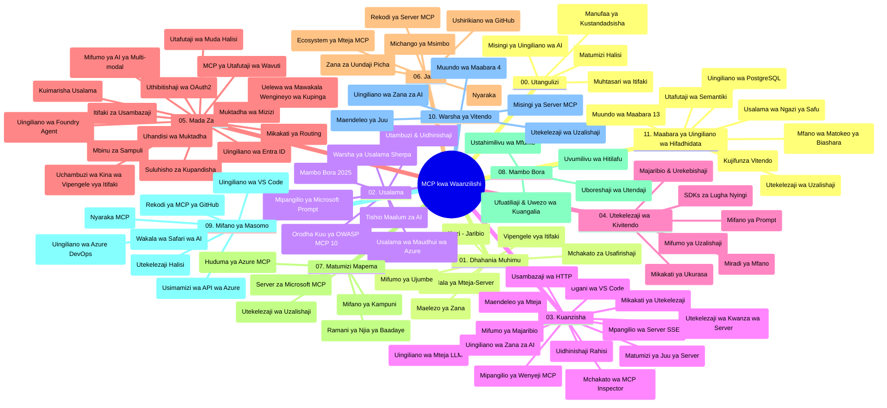

# Itifaki ya Muktadha wa Mfano (MCP) kwa Waanzilishi - Mwongozo wa Kujifunza

Mwongozo huu wa kujifunza unatoa muhtasari wa muundo wa hazina na maudhui ya somo la "Itifaki ya Muktadha wa Mfano (MCP) kwa Waanzilishi". Tumia mwongozo huu kuvinjari hazina kwa ufanisi na kunufaika zaidi na rasilimali zilizopo.

## Muhtasari wa Hazina

Itifaki ya Muktadha wa Mfano (MCP) ni mfumo uliosanifiwa kwa maingiliano kati ya mifano ya AI na programu za mteja. Awali ilianzishwa na Anthropic, MCP sasa inasimamiwa na jamii pana ya MCP kupitia shirika rasmi la GitHub. Hazina hii hutoa mitaala kamili yenye mifano ya msimbo wa vitendo katika C#, Java, JavaScript, Python, na TypeScript, iliyoundwa kwa waendelezaji wa AI, wasanifu wa mifumo, na wahandisi wa programu.

## Ramani ya Mitaala ya Visual

## Muundo wa Hazina

Hazina imepangwa katika sehemu kumi na moja kuu, kila moja ikizingatia nyanja tofauti za MCP:

1. **Utangulizi (00-Introduction/)**
   - Muhtasari wa Itifaki ya Muktadha wa Mfano
   - Kwa nini usanifishaji ni muhimu katika mizunguko ya AI
   - Matumizi ya vitendo na manufaa

2. **Dhana za Msingi (01-CoreConcepts/)**
   - Miundo ya mtumiaji-server
   - Vipengele kuu vya itifaki
   - Mifumo ya ujumbe katika MCP

3. **Usalama (02-Security/)**
   - Vitisho vya usalama katika mifumo ya MCP
   - Mazoea bora ya kuimarisha utekelezaji
   - Mikakati ya uthibitishaji na idhini
   - **Nyaraka Kamili za Usalama**:
     - Mazoea Bora ya Usalama ya MCP 2025
     - Mwongozo wa Utekelezaji wa Usalama wa Mazingira ya Azure
     - Udhibiti na Mbinu za Usalama za MCP
     - Marejeleo ya Haraka ya Mazoea Bora ya MCP
   - **Mada Muhimu za Usalama**:
     - Mashambulizi ya sindano za onyo na sumu za vifaa
     - Uwekezaji wa kikao na matatizo ya mkurugenzi aliyepotoshwa
     - Udhaifu wa kupitisha tokeni
     - Ruhusa kupita kiasi na udhibiti wa upatikanaji
     - Usalama wa mnyororo wa ugavi kwa vipengele vya AI
     - Uingilizi wa Kinga za Onyo za Microsoft

4. **Kuanza (03-GettingStarted/)**
   - Usanidi wa mazingira na usanidi wa mfumo
   - Kuunda seva na wateja wa MCP wa msingi
   - Uunganishaji na programu zilizopo
   - Inajumuisha sehemu za:
     - Utekelezaji wa seva ya kwanza
     - Maendeleo ya mteja
     - Uunganishaji wa mteja wa LLM
     - Uunganishaji wa VS Code
     - Seva ya Matukio Yanayotumwa (SSE)
     - Matumizi ya seva ya juu
     - Uongozaji wa HTTPT
     - Uunganishaji wa AI Toolkit
     - Mikakati ya upimaji
     - Mwongozo wa utekelezaji

5. **Utekelezaji wa Vitendo (04-PracticalImplementation/)**
   - Kutumia SDK katika lugha mbalimbali za programu
   - Mbinu za kutatua matatizo, kupima na kuthibitisha
   - Kutengeneza mitindo ya onyo inayoweza kutumika tena na mikondo ya kazi
   - Miradi ya mfano yenye mifano ya utekelezaji

6. **Mada za Juu (05-AdvancedTopics/)**
   - Mbinu za uhandisi wa muktadha
   - Uunganishaji wa wakala wa Foundry
   - Mikondo ya kazi ya AI yenye njia nyingi
   - Maonyesho ya uthibitishaji wa OAuth2
   - Uwezo wa utafutaji wa wakati halisi
   - Utoaji wa mtiririko wa wakati halisi
   - Utekelezaji wa muktadha mzizi
   - Mikakati ya uelekezaji
   - Mbinu za sampuli
   - Mbinu za upanuzi
   - Mambo ya usalama
   - Uingilizi wa usalama wa Entra ID
   - Uunganishaji wa utafutaji mtandaoni
   - Ulinganifu wa mawakala wengi wenye malengo magumu (mifumo ya mijadala)

7. **Michango ya Jamii (06-CommunityContributions/)**
   - Jinsi ya kuchangia msimbo na nyaraka
   - Ushirikiano kupitia GitHub
   - Uboreshaji na mrejesho unaoendeshwa na jamii
   - Kutumia wateja mbalimbali wa MCP (Claude Desktop, Cline, VSCode)
   - Kufanya kazi na seva maarufu za MCP ikiwa ni pamoja na uundaji wa picha

8. **Mafunzo Kutoka kwa Matumizi ya Awali (07-LessonsfromEarlyAdoption/)**
   - Utekelezaji halisi na hadithi za mafanikio
   - Kujenga na kupeleka suluhisho za MCP
   - Mwelekeo na ramani ya njia ya siku za usoni
   - **Mwongozo wa Seva za MCP za Microsoft**: Mwongozo kamili wa seva 10 za MCP tayari kwa uzalishaji kutoka Microsoft ikiwa ni pamoja na:
     - Seva ya MCP ya Microsoft Learn Docs
     - Seva ya MCP ya Azure (viunganishi maalum 15+)
     - Seva ya MCP ya GitHub
     - Seva ya MCP ya Azure DevOps
     - Seva ya MCP ya MarkItDown
     - Seva ya MCP ya SQL Server
     - Seva ya MCP ya Playwright
     - Seva ya MCP ya Dev Box
     - Seva ya MCP ya Azure AI Foundry
     - Seva ya MCP ya Microsoft 365 Agents Toolkit

9. **Mazoea Bora (08-BestPractices/)**
   - Uboreshaji wa utendaji na usanifu
   - Ubunifu wa mifumo ya MCP yenye uvumilivu wa hitilafu
   - Mikakati ya upimaji na uimara

10. **Mifano ya Kesi (09-CaseStudy/)**
    - **Mifano saba kamili ya kesi** inayonyesha uwezo wa MCP katika hali tofauti:
    - **Wakala wa Safari wa Azure AI**: Uratibu wa mawakala wengi na Azure OpenAI na AI Search
    - **Uunganishaji wa Azure DevOps**: Kuendesha otomatiki michakato ya mkondo wa kazi kwa masasisho ya data za YouTube
    - **Uchimbaji wa Nyaraka wa Wakati Halisi**: Mteja wa konsole wa Python na mtiririko wa HTTP
    - **Mzalishaji wa Mpango wa Soma wa Kutoa Majibu**: App ya wavuti ya Chainlit yenye mazungumzo ya AI
    - **Nyaraka Ndani ya Mhariri**: Uunganishaji wa VS Code na mijadala ya GitHub Copilot
    - **Usimamizi wa API wa Azure**: Uunganishaji wa API za biashara na uundaji wa seva ya MCP
    - **Rejista ya MCP ya GitHub**: Maendeleo ya mazingira na jukwaa la uunganishaji wa mawakala
    - Mifano ya utekelezaji ikijumuisha uunganishaji wa biashara, tija ya waendelezaji, na maendeleo ya mazingira

11. **Warsha ya Vitendo (10-StreamliningAIWorkflowsBuildingAnMCPServerWithAIToolkit/)**
    - Warsha kamili ya vitendo inayochanganya MCP na AI Toolkit
    - Ujenzi wa programu zenye akili zinazounganisha mifano ya AI na zana halisi
    - Moduli za vitendo zinazojumuisha misingi, maendeleo ya seva maalum, na mikakati ya utekelezaji uzalishaji
    - **Muundo wa Maabara**:
      - Maabara 1: Misingi ya Seva ya MCP
      - Maabara 2: Maendeleo ya Seva ya MCP ya Juu
      - Maabara 3: Uunganishaji wa AI Toolkit
      - Maabara 4: Utekelezaji wa Uzalishaji na Upanuzi
    - Njia ya kujifunza inayotegemea maabara kwa maagizo hatua kwa hatua

12. **Maabara ya Uunganishaji wa Hifadhidata ya Seva ya MCP (11-MCPServerHandsOnLabs/)**
    - **Njia ya kujifunza ya maabara 13 kamili** kwa ujenzi wa seva za MCP tayari kwa uzalishaji na uunganishaji wa PostgreSQL
    - **Utekelezaji halisi wa uchambuzi wa rejareja** kwa kutumia kesi ya matumizi ya Zava Retail
    - **Mifumo ya daraja la biashara** ikijumuisha Usalama wa Ngazi ya Safu (RLS), utafutaji wa maana, na upatikanaji wa data wa wamiliki wengi
    - **Muundo Kamili wa Maabara**:
      - **Maabara 00-03: Misingi** - Utangulizi, Usanifu, Usalama, Usanidi wa Mazingira
      - **Maabara 04-06: Kujenga Seva ya MCP** - Ubunifu wa Hifadhidata, Utekelezaji wa Seva ya MCP, Maendeleo ya Zana
      - **Maabara 07-09: Vipengele vya Juu** - Utafutaji wa Maana, Upimaji & Utatuzi wa Hitilafu, Uunganishaji wa VS Code
      - **Maabara 10-12: Uzalishaji & Mazoea Bora** - Utekelezaji, Ufuatiliaji, Uboreshaji
    - **Teknolojia Zinazojumuishwa**: Mfumo wa FastMCP, PostgreSQL, Azure OpenAI, Azure Container Apps, Application Insights
    - **Matokeo ya Kujifunza**: Seva za MCP tayari kwa uzalishaji, mifumo ya uunganishaji wa hifadhidata, uchambuzi ulioendeshwa na AI, usalama wa biashara

## Rasilimali Zaidi

Hazina hii ina rasilimali za usaidizi:

- **Folda la Picha**: Lina michoro na mifano inayotumika katika mitaala
- **Tafsiri**: Msaada wa lugha nyingi na tafsiri za otomatiki za nyaraka
- **Rasilimali Rasmi za MCP**:
  - [Nyaraka za MCP](https://modelcontextprotocol.io/)
  - [Maelezo ya MCP](https://spec.modelcontextprotocol.io/)
  - [Hazina ya MCP GitHub](https://github.com/modelcontextprotocol)

## Jinsi ya Kutumia Hazina Hii

1. **Kujifunza kwa Mfuatano**: Fuata sura kwa mpangilio (00 hadi 11) kwa uzoefu wa kujifunza ulio pangiliwa.
2. **Kuelekezwa kwa Lugha Fulani**: Ikiwa unavutiwa na lugha fulani ya programu, chunguza folda za mifano kwa utekelezaji wa lugha unayopendelea.
3. **Utekelezaji wa Vitendo**: Anza na sehemu ya "Kuanza" ili kuandaa mazingira na kuunda seva na mteja wako wa MCP wa kwanza.
4. **Uchunguzi wa Juu**: Ukijua misingi, chunguza mada za juu za kuongeza maarifa yako.
5. **Ushiriki wa Jamii**: Jiunge na jamii ya MCP kupitia mijadala ya GitHub na vituo vya Discord kuungana na wataalamu na wapenzi wa maendeleo.

## Wateja na Zana za MCP

Mtaala unashughulikia wateja na zana mbalimbali za MCP:

1. **Wateja Rasmi**:
   - Visual Studio Code
   - MCP katika Visual Studio Code
   - Claude Desktop
   - Claude katika VSCode
   - Claude API

2. **Wateja wa Jamii**:
   - Cline (inayotegemea terminal)
   - Cursor (mhariri wa msimbo)
   - ChatMCP
   - Windsurf

3. **Zana za Usimamizi wa MCP**:
   - MCP CLI
   - Meneja wa MCP
   - MCP Linker
   - MCP Router

## Seva Maarufu za MCP

Hazina inaendesha seva mbalimbali za MCP, zikiwemo:

1. **Seva Rasmi za MCP za Microsoft**:
   - Seva ya MCP ya Microsoft Learn Docs
   - Seva ya MCP ya Azure (viunganishi maalum 15+)
   - Seva ya MCP ya GitHub
   - Seva ya MCP ya Azure DevOps
   - Seva ya MCP ya MarkItDown
   - Seva ya MCP ya SQL Server
   - Seva ya MCP ya Playwright
   - Seva ya MCP ya Dev Box
   - Seva ya MCP ya Azure AI Foundry
   - Seva ya MCP ya Microsoft 365 Agents Toolkit

2. **Seva za Marejeleo Rasmi**:
   - Filesystem
   - Fetch
   - Memory
   - Sequential Thinking

3. **Uundaji wa Picha**:
   - Azure OpenAI DALL-E 3
   - Stable Diffusion WebUI
   - Replicate

4. **Zana za Maendeleo**:
   - Git MCP
   - Udhibiti wa Terminal
   - Msaidizi wa Msimbo

5. **Seva Maalum**:
   - Salesforce
   - Microsoft Teams
   - Jira & Confluence

## Kuchangia

Hazina hii inakaribisha michango kutoka jamii. Tazama sehemu ya Michango ya Jamii kwa mwongozo wa jinsi ya kuchangia kwa ufanisi katika mazingira ya MCP.

----

*Mwongozo huu wa kujifunza ulisasishwa mwisho mnamo Februari 5, 2026, unaonyesha Vipengele vya MCP vya hivi karibuni tarehe 2025-11-25 na unatoa muhtasari wa hazina hadi tarehe hiyo. Maudhui ya hazina yanaweza kusasishwa baada ya tarehe hii.*

---

<!-- CO-OP TRANSLATOR DISCLAIMER START -->
**Kang'azwa**:
Hati hii imetafsiriwa kwa kutumia huduma ya tafsiri ya AI [Co-op Translator](https://github.com/Azure/co-op-translator). Ingawa tunajitahidi kuhakikisha usahihi, tafadhali fahamu kuwa tafsiri za kiotomatiki zinaweza kuwa na makosa au kasoro. Hati ya asili katika lugha yake ya asili inapaswa kuchukuliwa kama chanzo cha mamlaka. Kwa taarifa muhimu, tafsiri ya mtaalamu wa binadamu inapendekezwa. Hatuwajibiki kwa kutoelewana au tafsiri potofu zinazotokana na matumizi ya tafsiri hii.
<!-- CO-OP TRANSLATOR DISCLAIMER END -->