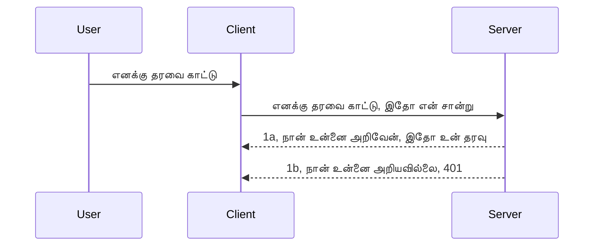

# எளிய அங்கீகாரம்

MCP SDKகள் OAuth 2.1 பயன்படுத்துவதை ஆதரிக்கின்றன, இது நியாயமாகச் சொல்வதானால் அங்கீகாரம் சேவையகம், வன்பொருள் சேவையகம், இலக்கம் பதிவேற்றல், குறியீடு பெறல், குறியீட்டை பயனர் அனுமதி அடையாளம் மாற்றுதல் போன்ற கருத்துக்களை உள்ளடக்கிய ஒரு சிக்கலான செயல்முறை. நீங்கள் OAuthக்கு பழக்கமில்லையென்றால், அது ஒரு சிறந்த அமலாக்க விருப்பமாகும், ஆரம்பத்தில் அடிப்படையான அங்கீகாரத்துடன் துவங்கி மேம்பட்ட பாதுகாப்பிற்கு வளர்ந்துகொள்வது நல்ல யோசனை. அதற்காக இந்த அத்தியாயம் உள்ளது, உங்களை மேம்பட்ட அங்கீகாரத்துக்குத் தயார் செய்வதற்கானது.

## அங்கீகாரம், என்ன பொருள்?

அங்கீகாரம் என்பது அங்கீகரிப்பும் அங்கீகாரத்தும் (authentication மற்றும் authorization) குறிக்கிறது. இதன் கருத்து நாம் இரண்டு விஷயங்களை செய்ய வேண்டும்:

- **அங்கீகரிப்பு** என்பதை, ஒருவரை எங்கள் வீட்டிற்குள் நுழைய அனுமதிக்கிறோமா என்று கண்டறிவது, அவர்கள் "இங்கே" இருப்பதற்கான உரிமை உடையவரா என்று பரிசீலிப்பது, அதாவது எங்கள் MCP Server அம்சங்களைக் கொண்ட ரிசோர்ஸ் சேவையகத்திற்கு அணுகல் அனுமதி உள்ளவரா என்பதை உறுதி செய்வது.
- **அங்கீகாரம்** என்பது, ஒரு பயனர் அவர்கள் கேட்கும் குறிப்பிட்ட வளங்களுக்கு (எடுத்துக்காட்டாக, ஆர்டர்கள், பொருட்கள் ஆகியவை) அணுகல் கிடைக்குமா அல்லது அவர்கள் உள்ளடக்கத்தை படிக்க முடியுமா ஆனால் அழிக்க முடியாது போன்ற விஷயங்களை உறுதி செய்வதற்கான செயல்முறை.

## சான்றுகள்: நாங்கள் யார் என்பதை கணினி அறிந்து கொள்ளும் முறைகள்

இணைய மேம்பாட்டாளர்கள் பெரும்பாலும் சேவையகத்திற்கு ஒரு உண்மை சான்று வழங்க வேண்டும் என்று நினைக்கும், பொதுவாக ஒரு இரகசியத்தை ஆவணப்படுத்து, அவர்கள் இங்கே இருப்பதற்கு அனுமதி உண்டு என்பதைச் சொல்கிறது "அங்கீகரிப்பு". இந்த சான்று பெரும்பாலும் பயனர் பெயர் மற்றும் கடவுச்சொல் கொண்ட base64 குறியாக்கப்படு அல்லது தனித்துவமான பயனரை அடையாளம் காணும் API விசையாக இருக்கும்.

இதை "Authorization" எனும் தலைப்பிலிரூபமாக அனுப்புவார்கள்:

```json
{ "Authorization": "secret123" }
```

இது பொதுவாக அடிப்படைக் அங்கீகரிப்பு என்று குறிப்பிடப்படுகிறது. முழு செயல்முறை அப்படிப்படியாக இயங்குகிறது:


இப்போது செயல்முறையை புரிந்து கொண்டோம், இதை எப்படிப் பதிவு செய்வது? பெரும்பாலான இணைய சேவையகங்களில் middleware என்னும் கருத்து உள்ளது, அது கோரிக்கையின் ஒரு பகுதியாக இயங்கி சான்றுகளை சரிபார்க்கும், மற்றும் சரியான சான்று இருப்பின் கோரிக்கையை அனுமதிக்கும். தவறான சான்றுடன் இருந்தால் அங்கீகாரம் பிழை வருகிறது. இதை எப்படி செயல்படுத்துவது பார்ப்போம்:

**Python**

```python
class AuthMiddleware(BaseHTTPMiddleware):
    async def dispatch(self, request, call_next):

        has_header = request.headers.get("Authorization")
        if not has_header:
            print("-> Missing Authorization header!")
            return Response(status_code=401, content="Unauthorized")

        if not valid_token(has_header):
            print("-> Invalid token!")
            return Response(status_code=403, content="Forbidden")

        print("Valid token, proceeding...")
       
        response = await call_next(request)
        # எந்தவொரு வாடிக்கையாளர் தலைப்புகளையும் சேர்க்கவும் அல்லது பதிலில் ஏதேனும் மாற்றம் செய்யவும்
        return response


starlette_app.add_middleware(CustomHeaderMiddleware)
```

இங்கு நாம்:

- `AuthMiddleware` என்ற middleware ஐ உருவாக்கியுள்ளோம், இதன் `dispatch` முறை இணைய சேவையகத்தால் அழைக்கப்படுகிறது.
- அந்த middleware ஐ இணைய சேவையகத்துடன் இணைத்துள்ளோம்:

    ```python
    starlette_app.add_middleware(AuthMiddleware)
    ```

- "Authorization" தலைப்பு உள்ளது எனவும் அனுப்பப்படும் இரகசியம் சரியாக உள்ளதா என சரிபார்க்கும் validation லாஜிக் எழுதப்பட்டுள்ளது:

    ```python
    has_header = request.headers.get("Authorization")
    if not has_header:
        print("-> Missing Authorization header!")
        return Response(status_code=401, content="Unauthorized")

    if not valid_token(has_header):
        print("-> Invalid token!")
        return Response(status_code=403, content="Forbidden")
    ```

    இரகசியம் கிடைத்தாலும் சரியானதும் ஆக இருந்தால் `call_next` அழைத்து கோரிக்கையை அனுமதி தருகிறோம், பின்னர் பதிலை திருப்புகிறோம்.

    ```python
    response = await call_next(request)
    # எந்தவொரு வாடிக்கையாளர் தலைப்புகளையும் சேர்க்க அல்லது பதிலில் ஏதேனும் மாற்றம் செய்யவும்
    return response
    ```

இது செயல்படும் விதம்: இணையக் கோரிக்கை சேவையகத்துக்கு வந்தால் middleware இயங்கும், அதை செயல்படுத்தும் முறையின் அடிப்படையில் கோரிக்கையை அடுத்து அனுமதிக்குமோ அல்லது அனுமதி கிடையாது எனக் கூறும் பிழை திருப்புமோ செய்யும்.

**TypeScript**

Express பிரபலமான framework பயன்படுத்தி middleware உருவாக்கி MCP Serverக்கு முன்பாக கோரிக்கையை தடுக்கும். இதோ குறியீடு:

```typescript
function isValid(secret) {
    return secret === "secret123";
}

app.use((req, res, next) => {
    // 1. அங்கீகார தலைப்பு உள்ளது?
    if(!req.headers["Authorization"]) {
        res.status(401).send('Unauthorized');
    }
    
    let token = req.headers["Authorization"];

    // 2. செல்லுபடிமத்தை சரிபார்க்கவும்.
    if(!isValid(token)) {
        res.status(403).send('Forbidden');
    }

   
    console.log('Middleware executed');
    // 3. கோரிக்கையை கோரிக்கை குழாயின் அடுத்த படிக்கு அனுப்புகிறது.
    next();
});
```

இந்த குறியீட்டில்:

1. முதலில் Authorization தலைப்பு உள்ளதா என சரிபார்க்கிறோம், இல்லையெனில் 401 பிழை அனுப்புகிறோம்.
2. சான்று/டோக்கன் சரியானதா என உறுதி செய்கிறோம், இல்லையெனில் 403 பிழை அனுப்புகிறோம்.
3. இறுதியில் கோரிக்கையை கோரிக்கை குழாயில் அனுப்பி, கோரப்பட்ட வளத்தை திருப்திகரமாக வழங்குகிறோம்.

## பயிற்சி: அங்கீகாரம் செயல்படுத்தல்

நமது அறிவை பயன்படுத்தி முயலுவோம். திட்டம்:

சேவையகமற்

- ஒரு வலை சேவையகத்தையும் MCP எடுத்துக்காட்டையும் உருவாக்குதல்.
- சேவையகத்துக்கான middleware அமைக்குதல்.

வாடிக்கையாளர்

- தலைப்பின் மூலம் சான்றுடன் வலை கோரிக்கை அனுப்புதல்.

### -1- ஒரு வலை சேவையகத்தையும் MCP எடுத்துக்காட்டையும் உருவாக்குதல்

முதலில், வலை சேவையகம் எடுத்துக்காட்டு மற்றும் MCP Server உருவாக்க வேண்டும்.

**Python**

இங்கு MCP Server எடுத்துக்காட்டை உருவாக்கி, starlette வலை பயன்பாட்டையும் உருவாக்கி uvicorn மூலம் ஹோஸ்ட் செய்கின்றோம்.

```python
# MCP சேவையகத்தை உருவாக்குதல்

app = FastMCP(
    name="MCP Resource Server",
    instructions="Resource Server that validates tokens via Authorization Server introspection",
    host=settings["host"],
    port=settings["port"],
    debug=True
)

# ஸ்டார்லெட் வலை செயலியை உருவாக்குதல்
starlette_app = app.streamable_http_app()

# உவைக்கார்ன் மூலம் செயலியை வழங்குதல்
async def run(starlette_app):
    import uvicorn
    config = uvicorn.Config(
            starlette_app,
            host=app.settings.host,
            port=app.settings.port,
            log_level=app.settings.log_level.lower(),
        )
    server = uvicorn.Server(config)
    await server.serve()

run(starlette_app)
```

இந்த குறியீட்டில்:

- MCP Server உருவாக்கப்பட்டது.
- MCP Serverஇல் இருந்து starlette வலை பயன்பாடு `app.streamable_http_app()` மூலம் கட்டப்பட்டது.
- uvicorn `server.serve()` பயன்படுத்தி ஹோஸ்ட் செய்யப்பட்டு இயக்கப்படுகிறது.

**TypeScript**

இங்கு MCP Server எடுத்துக்காட்டை உருவாக்குகிறோம்.

```typescript
const server = new McpServer({
      name: "example-server",
      version: "1.0.0"
    });

    // ... சேவையகம் வளங்கள், கருவிகள் மற்றும் தூண்டுதல்களை அமைக்கவும் ...
```

இந்த MCP Server உருவாக்கம் POST /mcp வழிமுறையில் செய்யவேண்டும், மேலே குறியீட்டைப் பார்த்து இம்மாதிரி நகர்த்துவோம்:

```typescript
import express from "express";
import { randomUUID } from "node:crypto";
import { McpServer } from "@modelcontextprotocol/sdk/server/mcp.js";
import { StreamableHTTPServerTransport } from "@modelcontextprotocol/sdk/server/streamableHttp.js";
import { isInitializeRequest } from "@modelcontextprotocol/sdk/types.js"

const app = express();
app.use(express.json());

// அமர்வு ஐடியின்படி போக்குவரத்துகளை சேமிக்க வரைபடம்
const transports: { [sessionId: string]: StreamableHTTPServerTransport } = {};

// கிளையன்ட்டிலிருந்து सर्वருக்கான POST கோரிக்கைகளை கையாளவும்
app.post('/mcp', async (req, res) => {
  // உள்ள அமர்வு ஐடி இருப்பதை சரிபார்க்கவும்
  const sessionId = req.headers['mcp-session-id'] as string | undefined;
  let transport: StreamableHTTPServerTransport;

  if (sessionId && transports[sessionId]) {
    // உள்ள போக்குவரத்தை மீண்டும் பயன்படுத்தவும்
    transport = transports[sessionId];
  } else if (!sessionId && isInitializeRequest(req.body)) {
    // புதிய துவக்க கோரிக்கை
    transport = new StreamableHTTPServerTransport({
      sessionIdGenerator: () => randomUUID(),
      onsessioninitialized: (sessionId) => {
        // அமர்வு ஐடியின்படி போக்குவரத்தை சேமிக்கவும்
        transports[sessionId] = transport;
      },
      // DNS மறுபிணைப்பு பாதுகாப்பு பின்னோக்குவரிசை பொருந்துதலுக்காக இயல்புநிலையில் முடக்கப்பட்டுள்ளது. நீங்கள் இந்த சர்வரை
      // உள்ளூர் முறையில் இயக்கினால், கீழ்காணும் செட்டிங்க்களை உறுதி செய்யவும்:
      // enableDnsRebindingProtection: true,
      // allowedHosts: ['127.0.0.1'],
    });

    // மூடப்படும் போது போக்குவரத்தை சுத்தமாக்கவும்
    transport.onclose = () => {
      if (transport.sessionId) {
        delete transports[transport.sessionId];
      }
    };
    const server = new McpServer({
      name: "example-server",
      version: "1.0.0"
    });

    // ... சர்வர் வினாத்தளங்கள், கருவிகள் மற்றும் கேள்விகளை அமைக்கவும் ...

    // MCP சர்வருடன் இணைக்கவும்
    await server.connect(transport);
  } else {
    // தவறான கோரிக்கை
    res.status(400).json({
      jsonrpc: '2.0',
      error: {
        code: -32000,
        message: 'Bad Request: No valid session ID provided',
      },
      id: null,
    });
    return;
  }

  // கோரிக்கையை கையாளவும்
  await transport.handleRequest(req, res, req.body);
});

// GET மற்றும் DELETE கோரிக்கைகளுக்கு மீண்டும் பயன்படுத்தக்கூடிய கையாள்பவர்
const handleSessionRequest = async (req: express.Request, res: express.Response) => {
  const sessionId = req.headers['mcp-session-id'] as string | undefined;
  if (!sessionId || !transports[sessionId]) {
    res.status(400).send('Invalid or missing session ID');
    return;
  }
  
  const transport = transports[sessionId];
  await transport.handleRequest(req, res);
};

// சர்வர்-வழங்குருபடியான அறிவிப்புகளுக்கான GET கோரிக்கைகளை SSE மூலம் கையாளவும்
app.get('/mcp', handleSessionRequest);

// அமர்வு நிறுத்த DELETE கோரிக்கைகளை கையாளவும்
app.delete('/mcp', handleSessionRequest);

app.listen(3000);
```

இப்போது MCP Server உருவாக்கம் `app.post("/mcp")` உள்ளே நகர்ந்தது என்பதை பார்க்கலாம்.

அடுத்து middleware உருவாக்கப் போகிறோம், வருகை சான்று சரிபார்க்க.

### -2- சேவையகத்துக்கான middleware செயல்படுத்தல்

இப்போது middleware பகுதிக்கு வருவோம். இங்கு `Authorization` தலைப்பில் உள்ள சான்றை சரிபார்த்து செல்லும் middleware உருவாக்குவோம். அது ஏற்றுக்கொள்ளத்தக்கதாயிருந்தால், கேட்கப்பட்ட MCP செயல்பாடுகளை செய்வதற்கு கோரிக்கை அனுமதிக்கப்படும்.

**Python**

Middleware உருவாக்க, `BaseHTTPMiddleware` இருந்து மரபுரிமை பெற்ற ஒரு வகுப்பு உருவாக்க வேண்டும். இரண்டு முக்கிய அம்சங்கள்:

- `request` , நாம் இங்கிருந்து தலைப்பு தகவலை படிக்கிறோம்.
- `call_next` : சான்று சரியானதும் அதை அழைக்க வேண்டிய callback.

முதலில் `Authorization` தலைப்பு இல்லாத சூழலை கையாள வேண்டியிருக்கு:

```python
has_header = request.headers.get("Authorization")

# தலைப்பு இல்லை, 401 தவறுடன் தோல்வி, இல்லையெனில் தொடரவும்.
if not has_header:
    print("-> Missing Authorization header!")
    return Response(status_code=401, content="Unauthorized")
```

இங்கு 401 அங்கீகாரம் தவறானது பிழை அனுப்புகிறோம்.

மீண்டும் சான்று வந்தால், சரிபார்க்கும் விதம்:

```python
 if not valid_token(has_header):
    print("-> Invalid token!")
    return Response(status_code=403, content="Forbidden")
```

மேலே 403 தடை செய்தது பிழை அனுப்புகிறோம். முழு middleware கீழே:

```python
class AuthMiddleware(BaseHTTPMiddleware):
    async def dispatch(self, request, call_next):

        has_header = request.headers.get("Authorization")
        if not has_header:
            print("-> Missing Authorization header!")
            return Response(status_code=401, content="Unauthorized")

        if not valid_token(has_header):
            print("-> Invalid token!")
            return Response(status_code=403, content="Forbidden")

        print("Valid token, proceeding...")
        print(f"-> Received {request.method} {request.url}")
        response = await call_next(request)
        response.headers['Custom'] = 'Example'
        return response

```

சிறந்தது, ஆனால் `valid_token` என்னும் செயல்முறை? இதோ:

```python
# உற்பத்திக்குப் பயன்படுத்த வேண்டாம் - அதை மேம்படுத்துங்கள் !!
def valid_token(token: str) -> bool:
    # "Bearer " முன்னொட்டத்தை நீக்கவும்
    if token.startswith("Bearer "):
        token = token[7:]
        return token == "secret-token"
    return False
```

இதை மேம்படுத்த தெரியும்.

முக்கியம்: குறியீட்டில் குரூப்புகள் இதோடு சேர்த்துக்கொள்ள கூடாது. தரவு மூலதனத்தின் மூலம் அல்லது IDP (identity provider) மூலம் பெறுவது சிறந்தது அல்லது IDP மானடியும் சரிபார்ப்பு செய்ய வைக்க வேண்டும்.

**TypeScript**

Express உடன் இதை செயல்படுத்த, `use` முறையை அழைக்க middleware செயல்பாடுகளை வழங்கவேண்டும்.

- கோரிக்கையுடன் தொடர்பு கொண்டு `Authorization` பண்பில் சான்று கிடைக்கிறது என சரிபார்க்கவேண்டும்.
- சான்று சரியானதா என்றும் சரிபார்த்து, அப்படியானால் கோரிக்கை தொடர உதவும்.

இங்கு `Authorization` தலைப்பு இல்லையெனில் கோரிக்கையைக் நிறுத்துகிறோம்:

```typescript
if(!req.headers["authorization"]) {
    res.status(401).send('Unauthorized');
    return;
}
```

ஆக இல்லையென்றால் 401 பிழை.

அடுத்ததாக சான்று தவறானது என்றால் 403 பிழை அனுப்புகிறோம்:

```typescript
if(!isValid(token)) {
    res.status(403).send('Forbidden');
    return;
} 
```

இங்கே 403 பிழை வருகிறது.

முழு குறியீடு:

```typescript
app.use((req, res, next) => {
    console.log('Request received:', req.method, req.url, req.headers);
    console.log('Headers:', req.headers["authorization"]);
    if(!req.headers["authorization"]) {
        res.status(401).send('Unauthorized');
        return;
    }
    
    let token = req.headers["authorization"];

    if(!isValid(token)) {
        res.status(403).send('Forbidden');
        return;
    }  

    console.log('Middleware executed');
    next();
});
```

உள்ள மக்கள் அனுப்பும் சான்றை சரிபார்க்க middleware ஐ அமைத்துள்ளனர். வாடிக்கையாளர் எப்படி?

### -3- தலைப்பின் மூலம் சான்றோடு வலை கோரிக்கை அனுப்புதல்

வாடிக்கையாளர் தலைப்பில் சான்று அனுப்புவதை உறுதி செய்ய வேண்டும். MCP கிளையண்டுடன் செய்வதெப்படி என்று பார்க்கலாம்.

**Python**

வாடிக்கையாளருக்கு தலைப்பில் சான்று அனுப்ப வேண்டிய விதம்:

```python
# மதிப்பை நேரடியாக குறியிட வேண்டாம், அதனை குறைந்தது ஒரு சூழல் மாறிலி அல்லது அதிக பாதுகாப்பான சேமிப்பில் வைத்திருங்கள்
token = "secret-token"

async with streamablehttp_client(
        url = f"http://localhost:{port}/mcp",
        headers = {"Authorization": f"Bearer {token}"}
    ) as (
        read_stream,
        write_stream,
        session_callback,
    ):
        async with ClientSession(
            read_stream,
            write_stream
        ) as session:
            await session.initialize()
      
            # செய்ய வேண்டியது, kliyan't-il என்ன செய்யவேண்டுமோ, உதா: கருவிகள் பட்டியலிடல், கருவிகள் அழைப்பு மற்றும் பல.
```

`headers = {"Authorization": f"Bearer {token}"}` என நிரப்புவது கவனியுங்கள்.

**TypeScript**

இதை இரண்டு படிகள் செய்வோம்:

1. கருத்து ஆவணத்தில் சான்றை நிரப்புதல்.
2. சுற்றுதளம் (transport)க்கு கருத்து ஆவணத்தை அனுப்புதல்.

```typescript

// இங்கே காட்டப்படுள்ளதைப் போல மதிப்பை ஹார்ட்கோட் செய்ய வேண்டாம். குறைந்தது அதை ஒரு சுற்றுச்சூழல் மாறியாக வைத்திருக்கவும் மற்றும் டெவைல் (dev modeில்) போல ஏதாவது பயன்படுத்தவும்.
let token = "secret123"

// ஒரு கிளையன்ட் ट्रான்ஸ்போர்ட் விருப்பத் தொகுப்பு பொருளை வரையறு
let options: StreamableHTTPClientTransportOptions = {
  sessionId: sessionId,
  requestInit: {
    headers: {
      "Authorization": "secret123"
    }
  }
};

// விருப்பங்கள் பொருளை ட்ரான்ஸ்போர்டுக்கு அனுப்பவும்
async function main() {
   const transport = new StreamableHTTPClientTransport(
      new URL(serverUrl),
      options
   );
```

மேலே `options` ஆவணம் உருவாக்கி அதன் கீழ் `requestInit` உள்ள தலைப்புகளை வைத்தோம்.

முக்கியம்: இதை மேம்படுத்தும்போது HTTPS இல்லாமல் அந்த சான்று அனுப்புவது ஆபத்தாகும். கூடுதல் சுரண்டல் தடுப்புகள், டோக்கன் ரத்து, பூமியின் எந்த பகுதியிலிருந்து கோரிக்கை வருகிறது எனச் சரிபார்க்கவும், அதிகமாக கோரிக்கை வரும் கணினி பிழை என்று சந்தேகம் வருமானால் தடுக்கும் முறைகள் வேண்டும்.

ஆனால், மிகவும் எளிய APIகளுக்கு இது நல்ல துவக்கம்.

இதன் மேல் பாதுகாப்பு வலுப்படுத்த JSON Web Token (JWT) பயன்படுத்துவோம்.

## JSON Web Tokens, JWT

எனவே, எளிய சான்றுகளால் உருவாக்கும் வேதுணர்வுகளை மேம்படுத்த முயல்கிறோம். JWT உடன் பெறும் உடனடி மேம்பாடுகள்:

- **பாதுகாப்பு மேம்பாடு**. அடிப்படைக் அங்கீகாரத்தில் பயனர் பெயர், கடவுச்சொல் base64 குறியாக்கமாக அனுப்பப்படுவது அல்லது API விசை மீண்டும் மீண்டும் அனுப்பப்படுகிறது, இதனால் அபாயம் அதிகம். JWT மூலம் username, password அனுப்பி, ஒரு கால வரம்பு உடைய டோக்கன் பெறப்படுகிறது. விரிவான அனுமதிகளை இயக்குகிறது.
- **அவசரப்படுத்த வேண்டாமை மற்றும் பரிணாம நிலைத்தன்மை**. JWT தன்னிச்சையானது, பயனர் தகவலைக்கொண்டுள்ளது, சேவையகத்தில் தொகுப்பு சேமிப்பைத் தவிர்க்கிறது. டோக்கன் உள்ளுறுப்பாக சரிபார்க்கப்பட முடியும்.
- **பரஸ்பர வேலை மற்றும் கூட்டாட்சி**. Open ID Connect மையமாக JWT உள்ளது, Entra ID, கூகுள் அடையாளம் மற்றும் Auth0 போல புரிந்துகொள்ளப்பட்ட அடையாள வழங்குநர்களுடன் பயன்படுத்தப்படுகிறது. Single Sign On போன்ற பல வசதிகள் கிடைக்கின்றன, நிறுவன தரத்துக்கு ஏற்ற வகையில்.
- **மொத்தமைப்பும் பொருந்துதலும்**. API Gatewayகளுடன் (Azure API Management, NGINX) பயன்படுத்தலாம். அங்கீகார நிலை மற்றும் சேவை-சேவை தொடர்பும் ஆதரிக்கிறது.
- **செயல்திறன் மற்றும் சேமிப்பு**. JWT பெறுகையில் டோக்கன் சேமித்து வைக்கப்படலாம், இது விபர்ச்செல் தேவையை குறைக்கும், அதிக போக்குவரத்து பயன்பாடுகளுக்கு உதவும்.
- **மேம்பட்ட அம்சங்கள்**. சரிபார்க்கும் மற்றும் டோக்கனை தவிர்க்கும் திறனும் உள்ளன.

இதோ இந்த அனைத்துப் பயன்களுடன், நமது செயல்பாட்டை அடுத்த நிலைக்கு எடுத்துச் செல்வோம்.

## அடிப்படை அங்கீகாரத்தை JWTஆக மாற்றுதல்

மேல்நிலை மாற்றப்பட வேண்டியவை:

- **JWT டோக்கன் உருவாக்க கற்றுக்கொள்ளுங்கள்** மற்றும் அதை வாடிக்கையாளர்-சேவையகத்திற்கு அனுப்ப தயாராக்க.
- **JWT டோக்கனை சரிபார்க்கவும்**, சரியானது என்றால் வளங்கள் அணுகலை அனுமதிக்கவும்.
- **டோக்கன் பாதுகாப்பு சேமிப்பு**. இந்த டோக்கன் எப்படிச் சேமிப்பது.
- **வழிகளைக் காப்பாற்றுக**. வழிகள் மற்றும் குறிப்பிட்ட MCP அம்சங்களை பாதுகாப்பது.
- **புதுப்பித்தல் டோக்கன்கள்**. குறுகிய கால மணித்தியதி உடைய டோக்கன்களுடன் நீண்ட தூரம் செல்லும் refresh டோக்கன்கள் தயாரி, மேம்படுத்தல் வாயிலாக புதிய டோக்கன்கள் பெறவேண்டும். Refresh உடன் ஒரு முடிவுத்தளம் மற்றும் புரிதல் முறையும் இருக்க வேண்டும்.

### -1- JWT டோக்கன் உருவாக்குதல்

முதலில் JWT டோக்கனை பாகங்கள்:

- **தலைப்பு** : அல்கோரிதம் மற்றும் டோக்கன் வகை.
- **பெறுப்புக் கூறு** : দাবি, உதா: sub (பயனர்/அடையாளம்), exp (காலாவதி), role (பங்கு).
- **கையொப்பம்** : இரகசியம் அல்லது தனியார் விசையாக கையொப்பம்.

இதற்காக தலைப்பு, payload மற்றும் குறியாக்க டோக்கன் உருவாக்க வேண்டும்.

**Python**

```python

import jwt
import jwt
from jwt.exceptions import ExpiredSignatureError, InvalidTokenError
import datetime

# JWT கொண்டு கையொப்பம் செய்வதற்காக பயன்படுத்தப்படும் ரகசிய விசை
secret_key = 'your-secret-key'

header = {
    "alg": "HS256",
    "typ": "JWT"
}

# பயனர் தகவல் மற்றும் அதன் உரிமைகள் மற்றும் காலாவதியான நேரம்
payload = {
    "sub": "1234567890",               # பொருள் (பயனர் ஐடி)
    "name": "User Userson",                # சுயமாகக் கூற்று
    "admin": True,                     # சுயமாக்கூற்று
    "iat": datetime.datetime.utcnow(),# வெளியிடப்பட்டது
    "exp": datetime.datetime.utcnow() + datetime.timedelta(hours=1)  # காலாவதி
}

# அதை குறியாக்கம் செய்
encoded_jwt = jwt.encode(payload, secret_key, algorithm="HS256", headers=header)
```

மேலே:

- HS256 அல்கோரிதத்துடன் தலைப்பு மற்றும் JWT வகை அடையாளப்படுத்தல்.
- பயனரின் அடையாளம், பெயர், பங்கு, வெளியிடப்பட்ட நேரம் மற்றும் காலாவதியடைய நேரம் ஆகிய payload உருவாக்கப்பட்டுச் சேர்க்கப்பட்டது.

**TypeScript**

JWT டோக்கன் உருவாக்க உதவும் சில சார்புகளை நிறுவ வேண்டும்.

சார்புகள்

```sh

npm install jsonwebtoken
npm install --save-dev @types/jsonwebtoken
```

இப்போது தலைப்பு, payload உருவாக்கி குறியாக்க டோக்கன் உருவாக்குவோம்.

```typescript
import jwt from 'jsonwebtoken';

const secretKey = 'your-secret-key'; // உற்பத்தியில் env மாறிகளைப் பயன்படுத்தவும்

// பாரைலோடு வரையறுக்கவும்
const payload = {
  sub: '1234567890',
  name: 'User usersson',
  admin: true,
  iat: Math.floor(Date.now() / 1000), // வெளியிடப்பட்டது
  exp: Math.floor(Date.now() / 1000) + 60 * 60 // 1 மணி நேரத்தில் காலாவதியாகும்
};

// தலைப்பை வரையறுக்கவும் (விருப்பமானது, jsonwebtoken இயல்புநிலை அமைப்புகளை அமைக்கிறது)
const header = {
  alg: 'HS256',
  typ: 'JWT'
};

// டோக்கனை உருவாக்கவும்
const token = jwt.sign(payload, secretKey, {
  algorithm: 'HS256',
  header: header
});

console.log('JWT:', token);
```

இந்த டோக்கன்:

HS256 பயன்படுத்தி கையொப்பமிடப்பட்டது
1 மணி நேரம் செல்லும்
sub, name, admin, iat மற்றும் exp போன்ற விவரங்கள் உள்ளன.

### -2- டோக்கனை சரிபார்க்குதல்

சேவையகத்தில் டோக்கன் சரியானதா என்பதைக் காண ஒருங்கிணைப்பு தேவை. பண்புகளும் கட்டமைப்பும் சரிபார்க்க வேண்டும். உங்களது பயனர் அமைப்பில் அதைச் சேர்ந்த பயனர் அடையாளம் பார்த்து மேலும் சோதனை செய்யவும்.

**Python**

```python

# JWT-ஐ கோடிடவும் மற்றும் சரிபார்க்கவும்
try:
    decoded = jwt.decode(token, secret_key, algorithms=["HS256"])
    print("✅ Token is valid.")
    print("Decoded claims:")
    for key, value in decoded.items():
        print(f"  {key}: {value}")
except ExpiredSignatureError:
    print("❌ Token has expired.")
except InvalidTokenError as e:
    print(f"❌ Invalid token: {e}")

```

`jwt.decode` அழைத்து, டோக்கன், இரகசிய விசை மற்றும் அல்கோரிதம் அளிக்கிறோம். தவறானால் பிழை கைவிட try-catch இருந்து கையாள்கிறோம்.

**TypeScript**

இங்கு `jwt.verify` அழைத்து, டோக்கனை பிழையின்றி சரிபார்க்கிறோம். தோல்வியெனில் வடிவமைப்பு தவறா அல்லது காலாவதியாயிற்றா என்று அர்த்தம்.

```typescript

try {
  const decoded = jwt.verify(token, secretKey);
  console.log('Decoded Payload:', decoded);
} catch (err) {
  console.error('Token verification failed:', err);
}
```

கவனம்: மேலே கூறியவாறு, பயனரை உள் அமைப்பில் கண்டுபிடித்து உரிமைகளைச் சரிபார்க்கவும்.

அடுத்ததாக, ரோல் அடிப்படையிலான அணுகல் கட்டுப்பாடு (RBAC) பார்க்கலாம்.
## பங்கு அடிப்படையிலான அணுகல் கட்டுப்பாட்டை சேர்ப்பு

பின்னணி என்னவென்றால், நாம் வித்தியாசமான பங்குகளுக்கு வித்தியாசமான அனுமதிகள் உள்ளன என்று வெளிப்படுத்த விரும்புகிறோம். உதாரணமாக, ஒரு நிர்வாகி (admin) எல்லாவற்றையும் செய்ய முடியும் என்று நாங்கள் கருதுகிறோம், ஒரு சாதாரண பயனர் படிக்க/எழுத முடியும் மற்றும் ஒரு விருந்தினர் (guest) மட்டுமே படிக்க முடியும். எனவே, இங்கே சில சாத்தியமான அனுமதி நிலைகள்:

- Admin.Write 
- User.Read
- Guest.Read

இந்த கட்டுப்பாட்டை மிடில்வேர் மூலம் எப்படி அமல்படுத்தலாம் என்று பார்ப்போம். மிடில்வேர்கள் ஒவ்வொரு வழியிருக்கும் மற்றும் அனைத்து வழிகளுக்கும் கூட சேர்க்கப்படலாம்.

**Python**

```python
from starlette.middleware.base import BaseHTTPMiddleware
from starlette.responses import JSONResponse
import jwt

# இந்தக் குறியீட்டில் ரகசியத்தை வைத்திராதீர்கள், இது காட்சிப்படுத்துதலுக்காக மட்டும். அதைக் பாதுகாப்பான இடத்திலிருந்து படியுங்கள்.
SECRET_KEY = "your-secret-key" # இதைப் environ மாறியில் வைக்கவும்
REQUIRED_PERMISSION = "User.Read"

class JWTPermissionMiddleware(BaseHTTPMiddleware):
    async def dispatch(self, request, call_next):
        auth_header = request.headers.get("Authorization")
        if not auth_header or not auth_header.startswith("Bearer "):
            return JSONResponse({"error": "Missing or invalid Authorization header"}, status_code=401)

        token = auth_header.split(" ")[1]
        try:
            decoded = jwt.decode(token, SECRET_KEY, algorithms=["HS256"])
        except jwt.ExpiredSignatureError:
            return JSONResponse({"error": "Token expired"}, status_code=401)
        except jwt.InvalidTokenError:
            return JSONResponse({"error": "Invalid token"}, status_code=401)

        permissions = decoded.get("permissions", [])
        if REQUIRED_PERMISSION not in permissions:
            return JSONResponse({"error": "Permission denied"}, status_code=403)

        request.state.user = decoded
        return await call_next(request)


```

சில விதமான மிடில்வேர் சேர்ப்பதற்கான முறைகள் கீழே உள்ளன:

```python

# மாற்ற 1: ஸ்டார்லெட் செயலியை உருவாக்கும்போது மிடில்வேர் சேர்க்கவும்
middleware = [
    Middleware(JWTPermissionMiddleware)
]

app = Starlette(routes=routes, middleware=middleware)

# மாற்ற 2: ஸ்டார்லெட் செயலி ஏற்கனவே உருவாக்கப்பட்ட பிறகு மிடில்வேர் சேர்க்கவும்
starlette_app.add_middleware(JWTPermissionMiddleware)

# மாற்ற 3: ஒவ்வொரு வழிக்கான மிடில்வேர் சேர்க்கவும்
routes = [
    Route(
        "/mcp",
        endpoint=..., # ஹேண்ட்லர்
        middleware=[Middleware(JWTPermissionMiddleware)]
    )
]
```

**TypeScript**

நாம் `app.use` மற்றும் அனைத்து கோரிக்கைகளுக்கும் இயங்கக்கூடிய மிடில்வேர் பயன்படுத்தலாம்.

```typescript
app.use((req, res, next) => {
    console.log('Request received:', req.method, req.url, req.headers);
    console.log('Headers:', req.headers["authorization"]);

    // 1. அங்கீகார தலைப்பு அனுப்பப்பட்டுள்ளதா என்பதைப் பாருங்கள்

    if(!req.headers["authorization"]) {
        res.status(401).send('Unauthorized');
        return;
    }
    
    let token = req.headers["authorization"];

    // 2. டோக்கியன் செல்லுபடியானதா என்பதைப் பாருங்கள்
    if(!isValid(token)) {
        res.status(403).send('Forbidden');
        return;
    }  

    // 3. டோக்கன் பயனர் எங்கள் கண/*ளில் உள்ளது என்பதைப் பாருங்கள்
    if(!isExistingUser(token)) {
        res.status(403).send('Forbidden');
        console.log("User does not exist");
        return;
    }
    console.log("User exists");

    // 4. டோக்கனுக்கு சரியான அனுமதிகள் உள்ளதா என்பதை உறுதிப்படுத்துங்கள்
    if(!hasScopes(token, ["User.Read"])){
        res.status(403).send('Forbidden - insufficient scopes');
    }

    console.log("User has required scopes");

    console.log('Middleware executed');
    next();
});

```

நாம் எங்கள் மிடில்வேர் செய்யக்கூடிய சில முக்கிய செயல்களைப் பார்க்கலாம், குறிப்பாக:

1. அங்கீகார முகப்பு (authorization header) உள்ளது என்று சரிபார்க்கவும்
2. டோக்கன் செல்லுபடியாகுமா என்று சரிபார்க்கவும், நாங்கள் எழுதிய `isValid` என்ற முறை JWT டோக்கன் ஒழுங்குமுறை மற்றும் செல்லுபடித்தன்மையை சரிபார்க்கும்.
3. பயனர் எங்கள் கணினியில் இருக்கிறாரா என்று உறுதிப்படுத்துக, இதை நாம் சோதிக்க வேண்டும்.

   ```typescript
    // தரவுத்தளத்தில் பயனர்கள்
   const users = [
     "user1",
     "User usersson",
   ]

   function isExistingUser(token) {
     let decodedToken = verifyToken(token);

     // செய்யவேண்டியது, பயனர் தரவுத்தளத்தில் உள்ளதா என்று சரிபார்க்கவும்
     return users.includes(decodedToken?.name || "");
   }
   ```

   மேலே, நாங்கள் மிகவும் எளிய `users` பட்டியலை உருவாக்கியுள்ளோம், இது தெளிவாக ஒரு தரவுத்தளத்தில் இருக்க வேண்டும்.

4. கூடுதலாக, டோக்கனில் சரியான அனுமதிகள் உள்ளனவா என்று சரிபார்க்க வேண்டும்.

   ```typescript
   if(!hasScopes(token, ["User.Read"])){
        res.status(403).send('Forbidden - insufficient scopes');
   }
   ```

   மேலுள்ள மிடில்வேர் குறியீட்டில், டோக்கனில் User.Read அனுமதி உள்ளதா என்பதை நாங்கள் சரிபார்க்கிறோம், இல்லையெனில் 403 பிழை அனுப்புகிறோம். கீழே உள்ள `hasScopes` உதவி முறை.

   ```typescript
   function hasScopes(scope: string, requiredScopes: string[]) {
     let decodedToken = verifyToken(scope);
    return requiredScopes.every(scope => decodedToken?.scopes.includes(scope));
  }
   ```

Have a think which additional checks you should be doing, but these are the absolute minimum of checks you should be doing.

Using Express as a web framework is a common choice. There are helpers library when you use JWT so you can write less code.

- `express-jwt`, helper library that provides a middleware that helps decode your token.
- `express-jwt-permissions`, this provides a middleware `guard` that helps check if a certain permission is on the token.

Here's what these libraries can look like when used:

```typescript
const express = require('express');
const jwt = require('express-jwt');
const guard = require('express-jwt-permissions')();

const app = express();
const secretKey = 'your-secret-key'; // put this in env variable

// Decode JWT and attach to req.user
app.use(jwt({ secret: secretKey, algorithms: ['HS256'] }));

// Check for User.Read permission
app.use(guard.check('User.Read'));

// multiple permissions
// app.use(guard.check(['User.Read', 'Admin.Access']));

app.get('/protected', (req, res) => {
  res.json({ message: `Welcome ${req.user.name}` });
});

// Error handler
app.use((err, req, res, next) => {
  if (err.code === 'permission_denied') {
    return res.status(403).send('Forbidden');
  }
  next(err);
});

```

இப்போது நீங்கள் பார்த்துள்ளீர்கள், மிடில்வேர் நிறைவேற்றத்துக்கும் அங்கீகாரத்துக்கும் எப்படி பயன்படுத்தப்படலாம் என்று, ஆனால் MCP பற்றி என்ன, அது எங்கள் அங்கீகார செயல்பாட்டை மாற்றுமா? அடுத்த பகுதியில் தெரிந்து கொள்வோம்.

### -3- MCPக்கு RBAC சேர்ப்பு

இப்போது வரை, மிடில்வேர் மூலம் RBACஐ எப்படி சேர்க்கலாம் என்று பார்த்தீர்கள், ஆனால் MCPக்கு ஒரு கடினமான முறையில் MCP பண்புக்கு தனியான RBAC சேர்க்கமுடியாது, ஆகவே என்ன செய்வோம்? நன்கு, இதைப் போல ஒரு குறியீட்டை சேர்க்கவேண்டும், இதில் குறிப்பாக கிளையண்ட் ஒரு குறிப்பிட்ட கருவியை அழைக்க உரிமை கொண்டுள்ளானா என்று பார்ப்பது:

வீஷயமற்ற RBAC எவ்வாறு செய்யலாம் என்று சில விருப்பங்கள் உள்ளன, சிலவைகளை கீழே காணலாம்:

- ஒவ்வொரு கருவி, வளங்கள், அல்லது உத்தரவாத நுழைப்புக்கு அனுமதி நிலையைச் சரிபார்க்க ஒரு சோதனைச் சேர்க்கவும்.

   **python**

   ```python
   @tool()
   def delete_product(id: int):
      try:
          check_permissions(role="Admin.Write", request)
      catch:
        pass # கிளையன்ட் அங்கீகாரத்தில் தோல்வியடைந்தார், அங்கீகார பிழையை எழுப்பு
   ```

   **typescript**

   ```typescript
   server.registerTool(
    "delete-product",
    {
      title: Delete a product",
      description: "Deletes a product",
      inputSchema: { id: z.number() }
    },
    async ({ id }) => {
      
      try {
        checkPermissions("Admin.Write", request);
        // செய்ய வேண்டியது, id ஐ productService மற்றும் remote entry க்கு அனுப்பவும்
      } catch(Exception e) {
        console.log("Authorization error, you're not allowed");  
      }

      return {
        content: [{ type: "text", text: `Deletected product with id ${id}` }]
      };
    }
   );
   ```


- மேம்பட்ட சர்வர் அணுகுமுறையை மற்றும் கோரிக்கை கையாள்வோரைக் பயன்படுத்தி சோதனைகள் செய்ய வேண்டிய இடங்களை குறைத்துக்கொள்ளவும்.

   **Python**

   ```python
   
   tool_permission = {
      "create_product": ["User.Write", "Admin.Write"],
      "delete_product": ["Admin.Write"]
   }

   def has_permission(user_permissions, required_permissions) -> bool:
      # user_permissions: பயனருக்கு உள்ள அனுமதிகளின் பட்டியல்
      # required_permissions: கருவிக்குத் தேவையான அனுமதிகளின் பட்டியல்
      return any(perm in user_permissions for perm in required_permissions)

   @server.call_tool()
   async def handle_call_tool(
     name: str, arguments: dict[str, str] | None
   ) -> list[types.TextContent]:
    # request.user.permissions என்பது பயனருக்கான அனுமதிகளின் பட்டியலாக கருதுக
     user_permissions = request.user.permissions
     required_permissions = tool_permission.get(name, [])
     if not has_permission(user_permissions, required_permissions):
        # பிழை எழுப்பு "நீங்கள் கருவியை அழைக்கும் அனுமதி இல்லை {name}"
        raise Exception(f"You don't have permission to call tool {name}")
     # தொடரவும் மற்றும் கருவியை அழைக்கவும்
     # ...
   ```   
   

   **TypeScript**

   ```typescript
   function hasPermission(userPermissions: string[], requiredPermissions: string[]): boolean {
       if (!Array.isArray(userPermissions) || !Array.isArray(requiredPermissions)) return false;
       // பயனருக்கு குறைந்தது ஒரு தேவையான அனுமதி இருந்தால் உண்மையை மறு வழிக்காட்டு
       
       return requiredPermissions.some(perm => userPermissions.includes(perm));
   }
  
   server.setRequestHandler(CallToolRequestSchema, async (request) => {
      const { params: { name } } = request;
  
      let permissions = request.user.permissions;
  
      if (!hasPermission(permissions, toolPermissions[name])) {
         return new Error(`You don't have permission to call ${name}`);
      }
  
      // தொடர்க..
   });
   ```

   கவனிக்கவும், உங்கள் மிடில்வேர் ஒரு டீகோடெய்ட் செய்யப்பட்ட டோக்கனை கோரிக்கையின் user பண்புக்கு ஒதுக்க வேண்டும், அதனால் மேலே உள்ள குறியீடு எளிமையாகும்.

### சுருக்கம்

இப்போது நாம் RBAC இணைப்பை பொதுவாகவும் MCPக்கு சிறப்பாகவும் எப்படி செய்வது என்று விவாதித்தோம், எளிமையாக பாதுகாப்பை உங்களால் செயல்படுத்த முயற்சிக்க நேரம் இதுவாகிவிட்டது, நீங்கள் முன்வந்த கருத்துக்களை நன்றாக புரிந்துகொண்டீர்கள் என்று உறுதி செய்ய.

## பணிகள் 1: அடிப்படையான அங்கீகாரத்துடன் ஒரு mcp சர்வர் மற்றும் mcp கிளையண்ட் கட்டமைக்கவும்

இங்கே நீங்கள் தலைப்புகளில் கடவுச்சொற்களை அனுப்புவது பற்றி கற்றுக்கொண்டதை பயன்படுத்துவீர்கள்.

## தீர்வு 1

[Solution 1](./code/basic/README.md)

## பணிகள் 2: பணிகள் 1 இல் இருந்து தீர்வை JWT பயன்படுத்த மேம்படுத்தவும்

முதல் தீர்வை எடுத்துக்கொண்டு இப்போது மேம்படுத்துவோம்.

முதலில் Basic Auth பயன்படுத்தாமல், JWT பயன்படுத்துவோம்.

## தீர்வு 2

[Solution 2](./solution/jwt-solution/README.md)

## சவால்

"Add RBAC to MCP" பகுதியில் விவரித்துள்ள கருவி அடிப்படையிலான RBACஐச் சேர்க்கவும்.

## சுருக்கம்

இந்த அத்தியாயத்தில் நீங்கள் நிச்சயமாக நிறைய கற்றுக்கொண்டீர்கள், பாதுகாப்பில்லாமல் இருந்து, அடிப்படை பாதுகாப்பு, JWT மற்றும் அதை MCPவில் எப்படி சேர்ப்பது என்பதற்கு.

நாங்கள் தனிப்பயன் JWTகளால் ஒரு திடமான அடித்தளத்தை உருவாக்கியுள்ளோம், ஆனால் அளவாக அதிகரிக்கும்போது, நாம் ஒரு தரநிலை அடிப்படையிலான அடையாள மாதிரிக்கு நகர்கிறோம். Entra அல்லது Keycloak போன்ற IdPயைப் பின்பற்றுவது டோக்கன் வழங்கல், சரிபார்ப்பு மற்றும் வாழ்க்கைச்சுழற்சி மேலாண்மையை ஒரு நம்பகமான தளத்திற்கு ஒப்படைக்க உதவுகிறது — இது செயலி தர lógica மற்றும் பயனர் அனுபவத்தை மேம்படுத்துவதில் கவனம் செலுத்த உங்களை விடுவிக்கிறது.

அதற்காக, எங்களுக்கு [Entra பற்றி மேலதிக அத்தியாயம்](../../05-AdvancedTopics/mcp-security-entra/README.md) உள்ளது.

## அடுத்தது என்ன

- அடுத்து: [MCP ஹோஸ்டுகளை அமைத்தல்](../12-mcp-hosts/README.md)

---

<!-- CO-OP TRANSLATOR DISCLAIMER START -->
**ஒத்துழைப்பு**:  
இந்த ஆவணம் AI மொழிபெயர்ப்பு சேவை [Co-op Translator](https://github.com/Azure/co-op-translator) பயன்படுத்தி மொழிமாற்றம் செய்யப்பட்டுள்ளது. நாங்கள் துல்லியமாக இருக்க முயற்சித்தாலும், தானாக செய்யப்பட்ட மொழிபெயர்ப்பு பிழைகள் அல்லது தவறுகள் உள்ளடங்கலாம் என்பதை கவனத்தில் கொள்ளுங்கள். அசல் ஆவணம் அதன் மூல மொழியில் அதிகாரப்பூர்வ மூலமாக கருதப்பட வேண்டும். முக்கியமான தகவலுக்கு, தொழில்துறை மனித மொழிபெயர்ப்பு பரிந்துரைக்கப்படுகிறது. இந்த மொழிபெயர்ப்பை பயன்படுத்தியதனால் உண்டாகும் எந்தவொரு புரிதலிழப்புகளுக்கோ தவறான விளக்கங்களுக்கோ நாங்கள் பொறுப்பேற்கமாட்டோம்.
<!-- CO-OP TRANSLATOR DISCLAIMER END -->