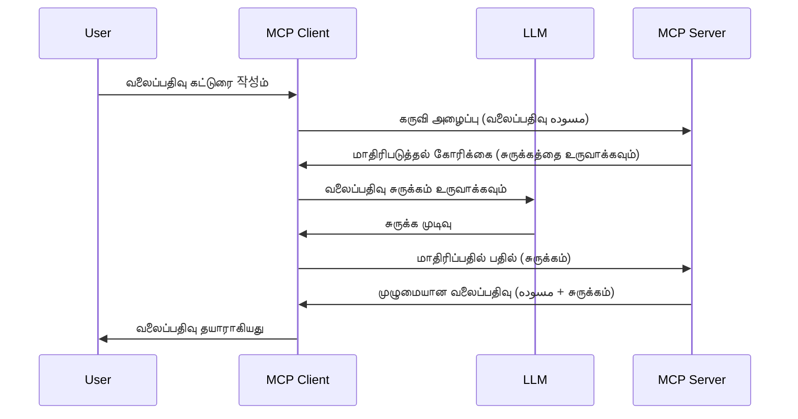

# மாதிரிப்பித்தல் - பணிகளை கிளையண்டிற்கு ஒப்படைத்தல்

சில நேரங்களில், MCP கிளையண்டும் MCP சர்வரும் ஒருங்கிணைந்து ஒரே நோக்கத்தை அடைய வேண்டும். சர்வர், கிளையண்டில் இருக்கும் ஒரு LLM இன் உதவியை வேண்டியிருப்பதான நிலைமை ஒன்று இருக்கலாம். இத்தகைய சூழ்நிலையில், மாதிரிப்பித்தலை நீங்கள் பயன்படுத்த வேண்டும்.

சில பயன்பாட்டு நிலைகளையும் மாதிரிப்பித்தலை அடிப்படையாகக் கொண்டு தீர்வை எவ்வாறு உருவாக்குவது என்பதைக் காண்போம்.

## கண்ணோட்டம்

இந்த பாடத்தில், மாதிரிப்பித்தலை எப்போது எங்கே பயன்படுத்த வேண்டும் மற்றும் அதை எப்படி அமைப்பது என்பதை விளக்குவோம்.

## கற்றல் இலக்குகள்

இந்த அதிகாரத்தில், நாம்:

- மாதிரிப்பித்தல் என்றால் என்ன மற்றும் அதைப் பொது எப்போது பயன்படுத்த வேண்டும் என்று விளக்குவோம்.
- MCP இல் மாதிரிப்பித்தலை எப்படி அமைப்பது என்பதை காண்போம்.
- செயல்பாட்டில் மாதிரிப்பித்தலின் எடுத்துக்காட்டுகளை கொடுப்போம்.

## மாதிரிப்பித்தல் என்றால் என்ன, ஏன் பயன்படுத்த வேண்டும்?

மாதிரிப்பித்தல் என்பது கீழ்காணும் முறையில் செயல்படும் ஒரு முன்னேற்ற அம்சமாகும்:


### மாதிரிப்பித்தல் கோரிக்கை

சரி, நமக்கு நம்பகமான சூழ்நிலையின் உயரமான கண்ணோட்டம் அந்தரங்கமாக உள்ளது, இப்போது சர்வர் கிளையண்டிற்கு அனுப்பும் மாதிரிப்பித்தல் கோரிக்கையைப் பற்றி பேசலாம். JSON-RPC வடிவில் இப்படிக் காணலாம்:

```json
{
  "jsonrpc": "2.0",
  "id": 1,
  "method": "sampling/createMessage",
  "params": {
    "messages": [
      {
        "role": "user",
        "content": {
          "type": "text",
          "text": "Create a blog post summary of the following blog post: <BLOG POST>"
        }
      }
    ],
    "modelPreferences": {
      "hints": [
        {
          "name": "claude-3-sonnet"
        }
      ],
      "intelligencePriority": 0.8,
      "speedPriority": 0.5
    },
    "systemPrompt": "You are a helpful assistant.",
    "maxTokens": 100
  }
}
```

இங்கே குறிப்பிட வேண்டிய சில விஷயங்கள் உள்ளன:

- Prompt, content -> text இன் கீழ் உள்ளது, இது எங்களுடைய LLMக்கு வழிநடத்தும் குறிப்பு ஆகும், இது வலைப்பதிவு உள்ளடக்கத்தை சுருக்கச் சொல்லுகிறது.

- **modelPreferences**. இது ஒரு விருப்பம், LLM உடன் எந்த அமைப்பைப் பயன்படுத்த வேண்டும் என்பதைப் பரிந்துரைக்கும் பகுதி. பயனர் இந்த பரிந்துரைகளை ஏற்க அல்லது மாற்ற முடியும். இங்கு பரிந்துரைகள், எந்த மாதிரியை பயன்படுத்த வேண்டும் மற்றும் வேகம் மற்றும் அறிவாற்றல் முன்னுரிமையை குறிக்கின்றன.
- **systemPrompt**, இது உங்கள் சாதாரண சிஸ்டம் குறிப்பாகும், இது உங்கள் LLMக்கு தனித்துவமாக அணுகுமுறையை அளிக்கும் மற்றும் வழிகாட்டும் அறிவுரைகளை கொண்டுள்ளது.
- **maxTokens**, இந்த சொத்து எத்தனை டோக்கன்களை இந்த பணிக்கான பரிந்துரையாக பயன்படுத்த வேண்டும் என்பதைக் குறிப்பிடுகிறது.

### மாதிரிப்பித்தல் பதில்

இந்த பதில் MCP கிளையண்ட் சர்வருக்கு அனுப்புவதற்குப் பிறகு கிடைக்கும், இது கிளையண்ட் LLM ஐ அழைத்து பதிலுக்காக காத்திருந்து பின்னர் இந்த செய்தியை கட்டமைக்கும் முடிவாகும். JSON-RPC இல் இது இப்படியாக இருக்கும்:

```json
{
  "jsonrpc": "2.0",
  "id": 1,
  "result": {
    "role": "assistant",
    "content": {
      "type": "text",
      "text": "Here's your abstract <ABSTRACT>"
    },
    "model": "gpt-5",
    "stopReason": "endTurn"
  }
}
```

பதிலில் வலைப்பதிவின் சுருக்கம் இருக்கின்றது, நாங்கள் கேட்டபடி உள்ளது என்பதை கவனியுங்கள். மேலும் பயன்பாட்டில் எடுத்த மாதிரி மாறி "gpt-5" ஆக உள்ளது, "claude-3-sonnet" என்பதைப் பயன்படுத்தவில்லை என்பதை கவனியுங்கள். இது பயனர் தனது முடிவை மாற்றிக்கொள்ள முடியும் என்பதைக் காண்பிப்பதற்காகும் மற்றும் உங்கள் மாதிரிப்பித்தல் கோரிக்கை பரிந்துரையாகும் என்பதைக் காட்டுகிறது.

சரி, இப்போது நாமுவே கருத்துக்களை புரிந்து கொண்டுள்ளோம், மேலும் "வலைப்பதிவு உருவாக்கல் + சுருக்கம்" போன்ற பயன்பாடுகளுக்கு எப்படி இதைப் பயன்படுத்துவது என பார்ப்போம்.

### செய்தி வகைகள்

மாதிரிப்பித்தல் செய்திகள் வெறும் உரை மட்டுமல்ல, படங்களும் ஆடியோவும்கூட அனுப்பலாம். JSON-RPC இல் அடிப்படையில் இது எப்படி மாற்றுகிறது:

**உரை**

```json
{
  "type": "text",
  "text": "The message content"
}
```

**பட உள்ளடக்கம்**

```json
{
  "type": "image",
  "data": "base64-encoded-image-data",
  "mimeType": "image/jpeg"
}
```

**ஆடியோ உள்ளடக்கம்**

```json
{
  "type": "audio",
  "data": "base64-encoded-audio-data",
  "mimeType": "audio/wav"
}
```

> NOTE: மாதிரிப்பித்தலுக்கு மேலும் விரிவான தகவலுக்கு, [அதிகாரப்பூர்வ ஆவணங்களை](https://modelcontextprotocol.io/specification/2025-06-18/client/sampling) பார்க்கவும்

## கிளையண்டில் மாதிரிப்பித்தலை எவ்வாறு அமைக்கலாம்

> குறிப்பு: நீங்கள் சர்வர் மட்டுமே உருவாக்கினால், இங்கே நிறைய செய்ய வேண்டியதில்லை.

ஒரு கிளையண்டில், கீழ்க்கண்ட அம்சத்தை இந்த மாதிரியில் குறிப்பிட வேண்டும்:

```json
{
  "capabilities": {
    "sampling": {}
  }
}
```

இந்த அமைப்பு உங்கள் தேர்ந்தெடுத்த கிளையண்ட் சர்வருடன் இணையும் போது செயல்படுத்தப்படும்.

## செயல்பாட்டில் மாதிரிப்பித்தலை உதாரணம் - வலைப்பதிவு உருவாக்கு

ஒரு மாதிரிப்பித்தல் சர்வரை சரியாக நிரலிடுவோம். இதற்குத் தேவையானவைகள்:

1. சர்வரில் ஒரு கருவியை உருவாக்குங்கள்.
1. அந்த கருவி ஒரு மாதிரிப்பித்தல் கோரிக்கையை உருவாக்க வேண்டும்.
1. அந்த கருவி கிளையண்டின் மாதிரிப்பித்தல் பதிலை காத்திருக்க வேண்டும்.
1. பின்னர் கருவி முடிவை உருவாக்கும்.

படி படியாக கோடுகளை பார்ப்போம்:

### -1- கருவியை உருவாக்கல்

**python**

```python
@mcp.tool()
async def create_blog(title: str, content: str, ctx: Context[ServerSession, None]) -> str:
    """Create a blog post and generate a summary"""

```

### -2- மாதிரிப்பித்தல் கோரிக்கையை உருவாக்குதல்

இந்த கோட்டுடன் உங்கள் கருவியை விரிவாக்குங்கள்:

**python**

```python
post = BlogPost(
        id=len(posts) + 1,
        title=title,
        content=content,
        abstract=""
    )

prompt = f"Create an abstract of the following blog post: title: {title} and draft: {content} "

result = await ctx.session.create_message(
        messages=[
            SamplingMessage(
                role="user",
                content=TextContent(type="text", text=prompt),
            )
        ],
        max_tokens=100,
)

```

### -3- பதிலை காத்திருந்து, அது வந்து சென்றதும் பதிலை திருப்பி விடுதல்

**python**

```python
post.abstract = result.content.text

posts.append(post)

# முழு தயாரிப்பை திருப்பிச் செலுத்தவும்
return json.dumps({
    "id": post.title,
    "abstract": post.abstract
})
```

### -4- முழு கோடு

**python**

```python
from starlette.applications import Starlette
from starlette.routing import Mount, Host

from mcp.server.fastmcp import Context, FastMCP

from mcp.server.session import ServerSession
from mcp.types import SamplingMessage, TextContent

import json


from uuid import uuid4
from typing import List
from pydantic import BaseModel


mcp = FastMCP("Blog post generator")

# app = FastAPI()

posts = []

class BlogPost(BaseModel):
    id: int
    title: str
    content: str
    abstract: str

posts: List[BlogPost] = []

@mcp.tool()
async def create_blog(title: str, content: str, ctx: Context[ServerSession, None]) -> str:
    """Create a blog post and generate a summary"""

    post = BlogPost(
        id=len(posts) + 1,
        title=title,
        content=content,
        abstract=""
    )

    prompt = f"Create an abstract of the following blog post: title: {title} and draft: {content} "

    result = await ctx.session.create_message(
        messages=[
            SamplingMessage(
                role="user",
                content=TextContent(type="text", text=prompt),
            )
        ],
        max_tokens=100,
    )

    post.abstract = result.content.text

    posts.append(post)

    # முழுமையான வலைப்பதிவு பதிவை திருப்பி அளிக்கவும்
    return json.dumps({
        "id": post.title,
        "abstract": post.abstract
    })

if __name__ == "__main__":
    print("Starting server...")
    # mcp.run()
    mcp.run(transport="streamable-http")

# செயலியை இயக்க: python server.py
```

### -5- Visual Studio Code இல் சோதனை

Visual Studio Code இல் இதை சோதிக்க, கீழ்கண்டவை செய்யவும்:

1. டெர்மினலில் சர்வரை தொடங்கு
1. *mcp.json* இல் சேர்க்கவும் (மற்றும் அது தொடங்கிவிடப்பட்டுள்ளது என்பதை உறுதி செய்யவும்), உதாரணமாக:

   ```json
   "servers": {
      "blog-server": {
        "type": "http",
        "url": "http://localhost:8000/mcp"
      }
   }
   ```

1. ஒரு கேள்வி அல்லது பிராம்ட் தட்டச்சு செய்யவும்:

   ```text
   create a blog post named "Where Python comes from", the content is "Python is actually named after Monty Python Flying Circus"
   ```

1. மாதிரிப்பித்தல் நடைபெற அனுமதி வழங்கவும். முதலில் இத்தகைய அனுமதி ஒரு கூடுதல் உரையாடலை ஏற்படுத்தும், அதனை நீங்கள் ஒப்புக்கொள்ள வேண்டும்; பின்னர் கருவி இயக்க கேட்கும் சாதாரண உரையாடல் தோன்றும்.

1. முடிவுகளை பரிசீலனை செய்யவும். முடிவுகள் GitHub Copilot Chat இல் அழகாகக் காணப்படுவதுடன், நீங்கள் மூல JSON பதிலையும் பரிசீலிக்கலாம்.

**போனஸ்**: Visual Studio Code கருவிகள் மாதிரிப்பித்தலை சிறந்த முறையில் ஆதரிக்கின்றன. உங்கள் நிறுவிய சர்வரை விரிவாக்க பகுதியில் சென்று தேர்ந்தெடுத்து “Configure Model Access” மூலம் GitHub Copilot எவை மாதிரிகளை பயன்படுத்த அனுமதி வழங்கலாம் என்பதை அமைக்கலாம். அதே சமயம் சமீபத்தில் ஏற்பட்ட மாதிரிப்பித்தல் கோரிக்கைகளையும் “Show Sampling requests” மூலம் பார்வையிட முடியும்.

## பணியமைப்பு

இந்த பணியில், நீங்கள் சிறிது வேறுபட்ட மாதிரிப்பித்தலை உருவாக்க வேண்டும். அதாவது, ஒரு மாதிரிப்பித்தல் ஒருங்கிணைப்பை உருவாக்கி, அதில் பொருள் விளக்கத்தை உருவாக்க ஆதரவு உண்டு. உங்கள் சூழ்நிலை:

**சூழ்நிலை**: ஒரு ஈ-காமர்ஸ் நிறுவனத்தின் பின்னணித் தொழிலாளருக்கு உதவி தேவை. பொருள் விளக்கங்களை உருவாக்கும் பணிக்கு அதிக நேரம் ஆகின்றது. எனவே, நீங்கள் "create_product" கருவியை "title" மற்றும் "keywords" என்ற வாதங்களை கொண்டு அழைத்து, அதன் மூலம் "description" என்ற தோற்றவியல் தொகுதியை உருவாக்கும் தீர்வை உருவாக்க வேண்டும். இந்த விளக்கம் ஒருமுறை கிளையண்டின் LLM மூலம் நிரப்பப்பட வேண்டும்.

TIP: பழைய கற்றலை பயன்படுத்தி இந்த சர்வர் மற்றும் அதனுடைய கருவியை மாதிரிப்பித்தல் கோரிக்கையால் வடிவமைக்கவும்.

## தீர்வு

[தீர்வு](./solution/README.md)

## முக்கியக் குறிப்பு

மாதிரிப்பித்தல் என்பது சர்வர் பணிகளை கிளையண்டுக்கு ஒப்படைக்க LLM உதவி தேவையான வரையில் அனுமதிக்கும் சக்திவாய்ந்த அம்சம் ஆகும்.

## எதிர்காலம்

- [அதிகாரப்பூர்வ செயல்முறை - Chapter 4](../../04-PracticalImplementation/README.md)

---

<!-- CO-OP TRANSLATOR DISCLAIMER START -->
**பாதுகாப்பு அறிவிப்பு**:  
இந்த ஆவணம் AI மொழிபெயர்ப்பு சேவை [Co-op Translator](https://github.com/Azure/co-op-translator) பயன்படுத்தி மொழிபெயர்க்கப்பட்டுள்ளது. எங்களின் முயற்சிகள் தவிர, தானியங்கி மொழிபெயர்ப்புகளில் பிழைகள் அல்லது தவறுகள் இருக்க வாய்ப்பு உள்ளது என்பதை தயவுசெய்து கவனத்தில் கொள்ளுங்கள். அசல் ஆவணம் அதன் உள்ளூர் மொழியில் அதிகாரப்பூர்வ வெளி மொழிபெயர்ப்பு ஆகும். முக்கிய தகவல்களுக்கு, தொழில்முறை மனித மொழிபெயர்ப்பு பரிந்துரைக்கப்படுகிறது. இந்த மொழிபெயர்ப்பை பயன்படுத்துவதால் உண்டாகும் ஏதாவது தவறான புரிதல் அல்லது தவறான பொருள் விளக்கத்துக்கு நாம் பொறுப்பு கடமைமிக்கவர்கள் அல்ல.
<!-- CO-OP TRANSLATOR DISCLAIMER END -->