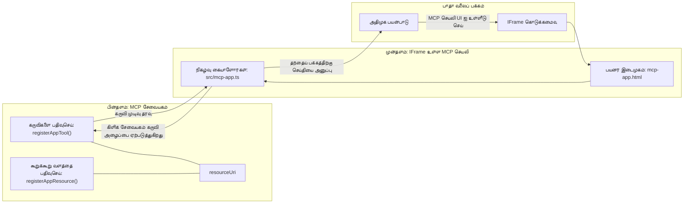

# MCP செயலிகள்

MCP செயலிகள் என்பது MCP இல் புதிய முன்மாதிரி ஆகும். கரு என்னவென்றால், உங்கள் கருவி அழைப்பிலிருந்து தரவோடு பதிலளிப்பதையே தவிர, இது அந்தத் தகவலுடன் எவ்வாறு தொடர்பு கொள்ளவேண்டும் என்பது குறித்த தகவலையும் வழங்குகிறது. அதாவது கருவி முடிவுகள் இப்போது UI தகவலையும் கொண்டிருக்க முடியும். ஏன் இதுபோல இருக்க வேண்டும்? நமது இன்று செய்பவையை கவனித்தால் போதும். நீங்கள் சாத்தியமாக MCP சேவையகத்தின் முடிவுகளை முன் பக்கத்தில் ஏதாவது இடுவதன் மூலம் பயன்படுத்திக்கொள்கிறீர்கள், அது நீங்கள் எழுதவும் பராமரிக்க வேண்டிய கோடு. சில சமயங்களில் அது நல்லதுதான், ஆனால் சில சமயங்களில் தரவுகளிலிருந்து பயனர் இடைமுகம் வரை அனைத்தும் கொண்டுள்ள சுயமாக்கப்பட்ட தகவல் துண்டை உங்களை கொண்டு வர முடிந்துவிடும் என நினைத்தால் அது சிறப்பாக இருக்கும்.

## ஒவ்வுமை

இந்த பாடம் MCP செயலிகள் குறித்த நடைமுறை வழிகாட்டுதலை வழங்குகிறது, எப்படி ஆரம்பிப்பது மற்றும் உங்கள் நிலையான இணைய செயலிகளில் அதை எப்படி ஒருங்கிணைப்பது என்பதையும். MCP செயலிகள் MCP தரநிலைக்குள் மிக புதிய சேர்க்கை ஆகும்.

## கற்று முடிக்கவேண்டிய நோக்கங்கள்

இந்த பாடம் முடிவில், நீங்கள்:

- MCP செயலிகள் என்றால் என்ன என்பதைக் விளக்கக்கூடும்.
- எப்போது MCP செயலிகளை பயன்படுத்த வேண்டும் என்பதைக் கூற முடியும்.
- உங்கள் சொந்த MCP செயலிகளைக் கட்டமைத்து ஒருங்கிணைக்கலாம்.

## MCP செயலிகள் - அது எப்படி செயல்படுகிறது

MCP செயலிகளின் கரு ஒரு பதில் வழங்குவது, அது ஒரு கூறாக வரைவது போன்றது. அப்படியான கூறு காட்சி மற்றும் தொடர்புபடும் வகையையும் கொண்டிருக்க முடியும், உதாரணமாக, பொத்தான் அழுத்தங்கள், பயனர் உள்ளீடு மற்றும் மேலும். நாம் முதலில் சேவையக பக்கத்துடன் மற்றும் நமது MCP சேவையகத்துடன் ஆரம்பிக்கலாம். MCP செயலி கூறை உருவாக்க, கருவியையும் செயலி வளத்தையும் உருவாக்க வேண்டும். இந்த இரண்டு பாகங்களும் resourceUri மூலம் இணைக்கப்படுகின்றன.

இங்கே ஒரு உதாரணம் உள்ளது. அதிலுள்ள கூறுகள் எவை, அவை என்ன செய்ய வேண்டும் என்பதை நன்கு பார்க்கலாம்:

```text
server.ts -- responsible for registering tools and the component as a UI component
src/
  mcp-app.ts -- wiring up event handlers
mcp-app.html -- the user interface
```

இந்த காட்சி கூறு மற்றும் அதன் நெறிமுறையை உருவாக்கும் கட்டமைப்பை விவரிக்கிறது.


முன்னணியும் பின்னணியும் தனித்தனியாக அதிகாரப்பற்று என்ன என்று தொடர்ந்து விவரிக்கலாம்.

### பின்னணி

இரு அம்சங்களை நாம் செய்ய வேண்டும்:

- தொடர்பு கொள்ள வேண்டிய கருவிகளை பதிவு செய்வது.
- கூறை வரையறுத்தல்.

**கருவியை பதிவு செய்தல்**

```typescript
registerAppTool(
    server,
    "get-time",
    {
      title: "Get Time",
      description: "Returns the current server time.",
      inputSchema: {},
      _meta: { ui: { resourceUri } }, // இந்த கருவியை அதன் UI வளத்துடன் இணைக்கிறது
    },
    async () => {
      const time = new Date().toISOString();
      return { content: [{ type: "text", text: time }] };
    },
  );

```

மேலே உள்ள கோடு `get-time` எனப்படும் கருவியை வெளிப்படுத்துகிறது. இது எந்த உள்ளீடுகளையும் எடுக்காது ஆனால் தற்போதைய நேரத்தை அளிக்கிறது. பயனர் உள்ளீட்டை ஏற்க வேண்டிய கருவிகளுக்கு `inputSchema` வரையறுக்க இயலும்.

**கொடுப்பனவுக்கு கூறை பதிவு செய்தல்**

அதே கோப்பில் கூறையும் பதிவு செய்ய வேண்டும்:

```typescript
const resourceUri = "ui://get-time/mcp-app.html";

// UI க்கான தொகுக்கப்பட்ட HTML/ஜாவாஸ்கிரிப்ட் வழங்கும் வளத்தை பதிவு செய்யவும்.
registerAppResource(
  server,
  resourceUri,
  resourceUri,
  { mimeType: RESOURCE_MIME_TYPE },
  async () => {
    const html = await fs.readFile(path.join(DIST_DIR, "mcp-app.html"), "utf-8");

    return {
    contents: [
        { uri: resourceUri, mimeType: RESOURCE_MIME_TYPE, text: html },
    ],
    };
  },
);
```

கூறு மற்றும் அதன் கருவிகளுடன் இணைக்க `resourceUri` குறிப்பிடப்பட்டுள்ளது. UI கோப்பை ஏற்றும் மற்றும் கூறை திருப்பிய தரும் பின்செருகிய குறிப்பு முக்கியமானது.

### கூறு முன் பக்கம்

பின்னணியில் இருந்தபோல, இரு அங்கங்கள் உள்ளன:

- தூய HTML இல் எழுதப்பட்ட முன் பக்கம்.
- நிகழ்வுகளை கையாளும் மற்றும் என்ன செய்ய வேண்டும் என்பதில் கோடு, உதாரணமாக கருவிகளை அழைக்க அல்லது பெற்ற window-க்கு செய்திகள் அனுப்ப.

**பயனர் இடைமுகம்**

பயனர் இடைமுகத்தை பார்ப்போம்.

```html
<!-- mcp-app.html -->
<!DOCTYPE html>
<html lang="en">
  <head>
    <meta charset="UTF-8" />
    <title>Get Time App</title>
  </head>
  <body>
    <p>
      <strong>Server Time:</strong> <code id="server-time">Loading...</code>
    </p>
    <button id="get-time-btn">Get Server Time</button>
    <script type="module" src="/src/mcp-app.ts"></script>
  </body>
</html>
```

**நிகழ்வு இணைப்பு**

கடைசி பகுதி நிகழ்வு இணைப்புதான். அதாவது எங்கள் UI இல் எந்த பகுதி நிகழ்வுகளை கையாள வேண்டும் என்றும், நிகழ்வுகள் எழுப்பப்பட்டால் என்ன செய்ய வேண்டும் என்றும் அடையாளம் காண்பது:

```typescript
// mcp-app.ts

import { App } from "@modelcontextprotocol/ext-apps";

// கூறு குறிப்பு பெறவும்
const serverTimeEl = document.getElementById("server-time")!;
const getTimeBtn = document.getElementById("get-time-btn")!;

// அப் நகலை உருவாக்கவும்
const app = new App({ name: "Get Time App", version: "1.0.0" });

// சர்வர் இருந்து கருவி முடிவுகளை கையாள்க. ஆரம்ப கருவி முடிவை தவிர்க்க `app.connect()` முன் அமைக்கவும்
// ஆரம்ப கருவி முடிவை தவறவிடாமல் செய்யவும்.
app.ontoolresult = (result) => {
  const time = result.content?.find((c) => c.type === "text")?.text;
  serverTimeEl.textContent = time ?? "[ERROR]";
};

// பொத்தான் கிளிக் இணைக்கவும்
getTimeBtn.addEventListener("click", async () => {
  // `app.callServerTool()` UIக்கு சர்வர் இருந்து புதிய தரவை கோர அனுமதிக்கிறது
  const result = await app.callServerTool({ name: "get-time", arguments: {} });
  const time = result.content?.find((c) => c.type === "text")?.text;
  serverTimeEl.textContent = time ?? "[ERROR]";
});

// ஹோஸ்டுடன் இணைக்கவும்
app.connect();
```

மேலே பார்க்கும் போது, இது DOM கூறுகளை நிகழ்வுகளுடன் இணைக்கும் சாதாரண கோடு. முக்கியமாக `callServerTool` அழைப்பு, அது பின்னணியில் கருவியை அழிக்கின்றது.

## பயனர் உள்ளீடு கையாள்தல்

இப்பொழாது, ஒரு பொத்தான் அழுத்தும் முறையாக கருவியை அழிக்கும் கூறை நாம பார்க்கிறோம். மேலும் UI கூறுகள் கூட சேர்க்கலாம், உதாரணமாக உள்ளீடு புலம், அதனால் கருவிக்கு பாவனையாளர் அளிக்கும் அளவுருக்களை அனுப்பவேண்டும். FAQ செயல்பாட்டை உருவாக்குவோம். இது இப்படி செயல்படும்:

- ஒரு பொத்தான் மற்றும் ஒரு உள்ளீடு புலம் இருக்கும், பயனர் "Shipping" போன்ற அறிவுச் சொல்லைத் தேட உள்ளிடுவார். பின்னணியில் FAQ தரவுகளைத் தேடும் கருவி அழைக்கப்படும்.
- இந்த FAQ தேடலை ஆதரிக்கும் கருவி.

முதலில் பின்னணிக்கு தேவையான ஆதரவுகளை சேர்க்கலாம்:

```typescript
const faq: { [key: string]: string } = {
    "shipping": "Our standard shipping time is 3-5 business days.",
    "return policy": "You can return any item within 30 days of purchase.",
    "warranty": "All products come with a 1-year warranty covering manufacturing defects.",
  }

registerAppTool(
    server,
    "get-faq",
    {
      title: "Search FAQ",
      description: "Searches the FAQ for relevant answers.",
      inputSchema: zod.object({
        query: zod.string().default("shipping"),
      }),
      _meta: { ui: { resourceUri: faqResourceUri } }, // இந்த கருவியை அதன் UI வளத்துடன் இணைக்கிறது
    },
    async ({ query }) => {
      const answer: string = faq[query.toLowerCase()] || "Sorry, I don't have an answer for that.";
      return { content: [{ type: "text", text: answer }] };
    },
  );
```

இங்கே நாம் `inputSchema` நிரப்பி அதற்கு `zod` உடன் உருவாக்க முறையைப் பார்க்கின்றோம்:

```typescript
inputSchema: zod.object({
  query: zod.string().default("shipping"),
})
```

மேலே உள்ள வரையறையில்ம் `query` எனும் உள்ளீட்டு அளவுரு இருக்கிறது மற்றும் அது விருப்பமாக இருக்கிறது, முன்னிருப்பு மதிப்பாக "shipping" கொடுக்கப்பட்டுள்ளது.

சரி, *mcp-app.html* சென்று எந்த UI உருவாக்க வேண்டும் என்பதை பார்க்கலாம்:

```html
<div class="faq">
    <h1>FAQ response</h1>
    <p>FAQ Response: <code id="faq-response">Loading...</code></p>
    <input type="text" id="faq-query" placeholder="Enter FAQ query" />
    <button id="get-faq-btn">Get FAQ Response</button>
  </div>
```

சூப்பர், இனி உள்ளீடு புலமும் பொத்தானும் உள்ளன. *mcp-app.ts* இற்கு சென்று இந்த நிகழ்வுகளை இணைப்போம்:

```typescript
const getFaqBtn = document.getElementById("get-faq-btn")!;
const faqQueryInput = document.getElementById("faq-query") as HTMLInputElement;

getFaqBtn.addEventListener("click", async () => {
  const query = faqQueryInput.value;
  const result = await app.callServerTool({ name: "get-faq", arguments: { query } });
  const faq = result.content?.find((c) => c.type === "text")?.text;
  faqResponseEl.textContent = faq ?? "[ERROR]";
});
```

மேலே உள்ள கோடுகளில்:

- தொடர்புடைய UI கூறுகளை குறிக்கோளாக்குகிறோம்.
- பொத்தான் அழுத்தத்தை கையாள்கிறோம், உள்ளீட்டு மதிப்பைப் பார்க்கிறோம் மற்றும் `app.callServerTool()`-ஐ `name` மற்றும் `arguments` உடன் அழைக்கிறோம், இதில் `arguments`-ல் `query` மதிப்பாக அனுப்பப்படுகிறது.

`callServerTool` அழைப்பினால் என்ன நடக்கும் என்பதென்றால் அது பெற்றவர் விண்டோவில் ஒரு சுய செய்தியை அனுப்பும், அங்கு MCP சேவையகம் அழைக்கப்படுகிறது.

### முயற்சி செய்து பார்க்கவும்

இதனை முயற்சிக்கும்போது பின்வருமாறு இருக்கும்:


இதோ "warranty" போன்ற உள்ளீட்டுடன் முயற்சி செய்தபோது:


இந்த கோடை இயக்க, [Code section](./code/README.md) செல்லவும்

## Visual Studio Code இல் சோதனை

Visual Studio Code MCP செயலிகளுக்கு சிறந்த ஆதரவைக் கொண்டுள்ளது மற்றும் உங்கள் MCP செயலிகளை சோதிப்பதற்கு எளிமையான வழிகளில் ஒன்று. Visual Studio Code பயன்படுத்த, *mcp.json* இல் சேவையக ஏற்றுக்கொள்கையைச் சேர்க்கவும்:

```json
"my-mcp-server-7178eca7": {
    "url": "http://localhost:3001/mcp",
    "type": "http"
  }
```

பிறகு சேவையகத்தை துவக்கவும், MCP செயலியுடன் தொடர்பு கொள்ள Chat Window மூலம் முடியும், GitHub Copilot நிறுவப்பட்டால்.

கீழெழுத்து வழியிலும் அது தொடங்க முடியும், உதாரணமாக "#get-faq":


வலை உலாவியில் இயக்கியதைப் போலவே அதே UI வடிவில் காண்பிக்கும்:


## பணியமைப்பு

ஒரு ராக் பேப்பர் சிசர் விளையாட்டை உருவாக்கவும். அதில் பின்வருமாறு உறுப்பு இருக்க வேண்டும்:

UI:

- தேர்வு விருப்பங்களுடன் டிராப் டவுன் பட்டியல்
- தேர்வை சமர்ப்பிப்பதற்கான பொத்தான்
- யார் என்ன தேர்ந்தெடுத்தார், யார் வென்றார் என்பதை காண்பிக்கும் குறிச்சொல்

சேவையகம்:

- "choice" உள்ளீடாக எடுக்கும் ராக் பேப்பர் சிசர் கருவி. கணினி தேர்வையும் உருவாக்கி வெற்றியாளரை தீர்மானிக்க வேண்டும்.

## தீர்வு

[Solution](./assignment/README.md)

## சுருக்கம்

இந்த புதிய முன்மாதிரி MCP செயலிகளை பற்றி கற்றோம். இது MCP சேவையகங்களுக்கு தரவு மட்டுமல்லாமல் அந்த தரவு எப்படி காட்சி அளிக்கப்படவேண்டும் என்பதிலும் கருத்து காண்பிக்க அனுமதிக்கும் புதிய முன்மாதிரி.

மேலும், MCP செயலிகள் ஒரு IFrame-ல் வைக்கப்படுகின்றன மற்றும் MCP சேவையகத்துடன் தொடர்புப் பெற பெற்ற இணைய செயலிக்கு செய்திகள் அனுப்ப வேண்டும். இந்தத் தொடர்புக்கு, சாதாரண JavaScript மற்றும் React உட்பட பல நூலகங்கள் உள்ளன.

## முக்கியமான எடுத்துக்கொள்ளல்கள்

நீங்கள் கற்றுக் கொண்டதெல்லாம்:

- MCP செயலிகள் என்பது தரவு மற்றும் UI அம்சங்களை இரண்டையும் அனுப்ப விரும்பும் போது உதவக்கூடிய புதிய தரநிலை.
- இந்த வகை செயலிகள் பாதுகாப்பு காரணங்களால் IFrame-ல் இயங்கும்.

## அடுத்தது என்ன

- [அத்தியாயம் 4](../../04-PracticalImplementation/README.md)

---

<!-- CO-OP TRANSLATOR DISCLAIMER START -->
**கட்டளை**:
இந்த ஆவணம் AI மொழி மாற்ற சேவை [Co-op Translator](https://github.com/Azure/co-op-translator) மூலம் மொழிபெயர்க்கப்பட்டுள்ளது. நாங்கள் துல்லியத்திற்காக முயன்றாலும், தானியங்கி மொழிபெயர்ப்புகளால் பிழைகள் அல்லது தவறுகள் இருக்க வாய்ப்பு உள்ளது என்பதை தயவுசெய்து கவனியுங்கள். அசல் ஆவணம் அதன் சொந்த மொழியில் அதிகாரபூர்வ மூலமாக கருதப்பட வேண்டும். முக்கியமான தகவல்களுக்கு, தொழில்முறை மனித மொழிபெயர்ப்பு பரிந்துரைக்கப்படுகிறது. இந்த மொழிபெயர்ப்பைப் பயன்படுத்துவதில் ஏற்படும் எந்த தவறான புரிதல்கள் அல்லது தவறான விளைவுகளுக்கும் நாங்கள் பொறுப்பாக இருக்க மாட்டோம்.
<!-- CO-OP TRANSLATOR DISCLAIMER END -->