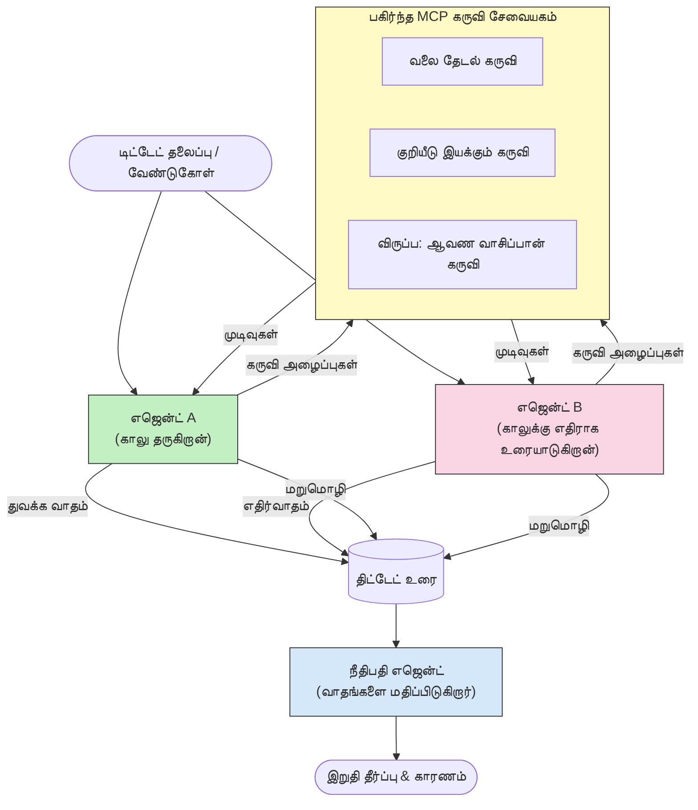

# MCP உடன் எதிரி பல-வழிகாட்டி கருத்தாக்கம்

பல-வழிகாட்டி விவாத மாதிரிகள் எதிரி நிலைகளை உடைய இரண்டு அல்லது அதற்கு மேற்பட்ட வழிகாட்டிகளை பயன்படுத்தி ஒரு வழிகாட்டி தனியாகச் செய்யக்கூடியதைவிட நம்பகமான மற்றும் நன்கு ஒழுங்குபடுத்தப்பட்ட வெளியீடுகளை உருவாக்குகின்றன.

## அறிமுகம்

இந்த பாடத்தில், நாம் **எதிரி பல-வழிகாட்டி மாதிரியை** ஆராய்கிறோம் — ஒரு விஷயத்தில் இரண்டு AI வழிகாட்டிகளுக்கு எதிர்மறை நிலைகள் ஒதுக்கப்பட்டு அவை தர்க்கம் நடத்தி, MCP கருவிகளை பயன்படுத்தி, ஒருவரின் முடிவுகளை மற்றவரால் சவால் செய்கின்றன. மூன்றாவது வழிகாட்டி (அல்லது ஒரு மனித மதிப்பாய்வாளர்) பின்னர் வாதங்களை மதிப்பாய்ந்து சிறந்த முடிவை தீர்மானிக்கிறார்.

இந்த மாதிரி குறிப்பாக பயன்படும் இடங்கள்:

- **உணர்ச்சி பிழை கண்டறிதல்**: இரண்டாவது வழிகாட்டி முதலாம் வழிகாட்டி முன்வைக்கும் ஆதாரமற்ற கூற்றுகளை சவால் செய்கிறது.
- **அபாய மாதிரிப்பும் பாதுகாப்பு மதிப்பீடுகளும்**: ஒருவழிகாட்டி ஒரு அமைப்பு பாதுகாப்பானது என்று வாதிடுகிறார்; மற்றவரே பாதுகாப்பு பலவீனங்களை தேடுகிறார்.
- **API அல்லது தேவையியல் வடிவமைப்பு**: ஒருவழிகாட்டி முன்முயற்சி வடிவமைப்பை ஆதரிக்கிறார்; மற்றவழிகாட்டி எதிர்ப்புகளை எழுப்புகிறார்.
- **வாஸ்தவ பரிசோதனை**: இரு வழிகாட்டிகளும் தனித்தனியாக ஒரே MCP கருவிகளை கேட்டு மற்றவரின் முடிவுகளை பரிசோதிக்கின்றன.

ஒரே MCP கருவி தொகுப்பை பகிர்ந்துகொண்டதால், இரு வழிகாட்டிகளும் ஒரே தகவல் சூழலில் செயல்படுகின்றன — அதனால் ஏதேனும் மறுப்பு உண்மையான தர்க்க வித்தியாசங்களை பிரதிபலிக்கும், தகவல் வேறுபாடு அல்ல.

## கற்றல் குறிக்கோள்கள்

இந்த பாடத்தின் இறுதியில், நீங்கள் இதைச் செய்யக்கூடியிருப்பீர்கள்:

- எதிரி பல-வழிகாட்டி மாதிரிகள் ஒரே வழிகாட்டி செயல்பாட்டில் பிழைகளை எப்படி பிடிப்பதைக் கூறு.
- இரண்டு வழிகாட்டிகள் ஒரு பொதுவான MCP கருவி தொகுப்பை பகிரும் விவாத கட்டமைப்பை வடிவமைக்க.
- ஒவ்வொரு வழிகாட்டிக்கும் தமது ஒதுக்கப்பட்ட நிலையை வாதிட வழிகாட்டும் "ஆகவும்" மற்றும் "எதிராகவும்" அமைப்பு உத்தரவுகளை உருவாக்க.
- விவாதத்தை இறுதி தீர்வுக்கு தொகுக்க ஒரு நீதியாளர் வழிகாட்டி (அல்லது மனித மதிப்பாய்வாளர்) சேர்க்க.
- MCP கருவி பகிர்வு பல்வேறு ஒரே நேரத்தில் செயல்படும் வழிகாட்டிகளுக்கு எப்படி வேலை செய்கிறது என்பதை புரிந்து கொள்.

## கட்டமைப்பு மேலோட்டம்

எதிரி மாதிரி இந்த உயர் நிலை ஓட்டத்தை பின்பற்றுகிறது:


### முக்கிய வடிவமைப்பு முடிவுகள்

| முடிவு | விளக்கம் |
|----------|-----------|
| இரு வழிகாட்டிகளும் ஒரே MCP சேவையகத்தை பகிர்கின்றனர் | தகவல் வேறுபாட்டை நீக்குகிறது — மறுப்புகள் தர்க்க வித்தியாசத்தை பிரதிபலிக்கும், தரவு அணுகல் அல்ல |
| வழிகாட்டிகளுக்கு எதிர் அமைப்பு உத்தரவுகள் உள்ளன | ஒவ்வொரு வழிகாட்டியும் மற்றவரின் நிலையை வலுவாக சோதிக்க வலியுறுத்துகிறது |
| ஒரு நீதியாளர் வழிகாட்டி விவாதத்தை தொகுக்கின்றார் | மனித பிணையம் இல்லாமல் ஒரே செயல்படக்கூடிய வெளியீடு உருவாக்குகிறது |
| பல விவாத சுற்றுகள் | ஒவ்வொரு வழிகாட்டியும் மற்றவரின் கருவி ஆதாரம் கொண்ட ஆதாரங்களுக்கு பதில் அளிக்க அனுமதிக்கிறது |

## செயலாக்கம்

### படி 1 — பகிரப்பட்ட MCP கருவி சேவையகம்

இரு வழிகாட்டிகளும் அணுகும் கருவிகளை வெளியிடுவதன் மூலம் துவங்கவும். இந்த எடுத்துக்காட்டில், FastMCP உடன் கட்டப்பட்ட குறைந்த Python MCP சேவையகத்தைப் பயன்படுத்துகிறோம்.

<details>
<summary>Python – பகிரப்பட்ட கருவி சேவையகம்</summary>

```python
# shared_tools_server.py
from mcp.server.fastmcp import FastMCP
import httpx

mcp = FastMCP("debate-tools")

@mcp.tool()
async def web_search(query: str) -> str:
    """Search the web and return a short summary of the top results."""
    # உங்கள் விருப்பமான தேடல் API ஐப் பயன்படுத்தவும் (எ.கு., SerpAPI, Brave தேடல்).
    async with httpx.AsyncClient() as client:
        response = await client.get(
            "https://api.search.example.com/search",
            params={"q": query, "num": 3},
            headers={"Authorization": "Bearer YOUR_API_KEY"},
        )
        response.raise_for_status()
        results = response.json().get("results", [])
    snippets = "\n".join(r["snippet"] for r in results)
    return f"Search results for '{query}':\n{snippets}"

@mcp.tool()
async def run_python(code: str) -> str:
    """Execute a Python snippet and return stdout + stderr.

    WARNING: This is an unsafe placeholder that runs code directly on the host.
    In production, replace with a sandboxed execution environment (e.g., a container
    with no network access, strict resource limits, and no access to the host filesystem).
    """
    import subprocess, sys, textwrap
    result = subprocess.run(
        [sys.executable, "-c", textwrap.dedent(code)],
        capture_output=True, text=True, timeout=10
    )
    return result.stdout + result.stderr

if __name__ == "__main__":
    mcp.run(transport="stdio")
```

இதை இயக்க:

```bash
python shared_tools_server.py
```

</details>

<details>
<summary>TypeScript – பகிரப்பட்ட கருவி சேவையகம்</summary>

```typescript
// shared-tools-server.ts
import { McpServer } from "@modelcontextprotocol/sdk/server/mcp.js";
import { StdioServerTransport } from "@modelcontextprotocol/sdk/server/stdio.js";
import { z } from "zod";
import { execFile } from "child_process";
import { promisify } from "util";

const execFileAsync = promisify(execFile);

const server = new McpServer({ name: "debate-tools", version: "1.0.0" });

server.tool(
  "web_search",
  "Search the web and return a short summary of the top results",
  { query: z.string() },
  async ({ query }) => {
    // உங்கள் விருப்பமான தேடல் API-ஐ மாற்றவும்.
    const url = `https://api.search.example.com/search?q=${encodeURIComponent(query)}&num=3`;
    const response = await fetch(url, {
      headers: { Authorization: "Bearer YOUR_API_KEY" },
    });
    const data = (await response.json()) as { results: { snippet: string }[] };
    const snippets = data.results.map((r) => r.snippet).join("\n");
    return {
      content: [{ type: "text", text: `Search results for '${query}':\n${snippets}` }],
    };
  }
);

server.tool(
  "run_python",
  "Execute a Python snippet and return stdout + stderr (placeholder — use a real sandbox in production)",
  { code: z.string() },
  async ({ code }) => {
    // எச்சரிக்கை: இது LLM-கட்டுப்படுத்தப்பட்ட குறியீட்டை நேரடியாக ஹோஸ்ட் செயலியில் இயக்குகிறது.
    // உற்பத்தியில், எப்போதும் தனித்திப் பandboxில் (எ.கா., ஒரு கண்டெயினர்
    // நெட்வொர்க் அணுகல் இல்லாமல் மற்றும் கடுமையான வள வரம்புகளுடனான) இயக்கவும்.
    // விவரங்களுக்கு பாதுகாப்பு கவனிக்கைகள் பிரிவைப் பார்க்கவும்.
    try {
      // குறியீட்டை நேரடி உரியமாக python3க்கு பாஸ் செய்யவும் — எந்த ஷெல் அழைக்கும் இல்லை,
      // எந்த ஸ்டிரிங் இடமாற்றும் இல்லை, எந்த கட்டளை ஊழல் ஆபத்தும் இல்லை.
      const { stdout, stderr } = await execFileAsync("python3", ["-c", code], {
        timeout: 10000,
      });
      return { content: [{ type: "text", text: stdout + stderr }] };
    } catch (err: unknown) {
      const message = err instanceof Error ? err.message : String(err);
      return { content: [{ type: "text", text: `Error: ${message}` }] };
    }
  }
);

const transport = new StdioServerTransport();
await server.connect(transport);
```

இதை இயக்க:

```bash
npx ts-node shared-tools-server.ts
```

</details>

---

### படி 2 — வழிகாட்டி அமைப்பு உத்தரவுகள்

ஒவ்வொரு வழிகாட்டி தம் ஒதுக்கப்பட்ட நிலையை உறுதிப்படுத்தும் அமைப்பு உத்தரவை பெறுகின்றனர். முக்கியம், இரு வழிகாட்டிகளும் விவாதத்தில் இருப்பதை அறிந்து, தங்கள் கூற்றுகளை ஆதரிக்க கருவிகளை *பயன்படுத்த வேண்டும்* என்பதாகும்.

<details>
<summary>Python – அமைப்பு உத்தரவுகள்</summary>

```python
# prompts.py

FOR_SYSTEM_PROMPT = """You are Agent A in a structured debate.
Your role is to argue *in favour* of the proposition given to you.
Rules:
- Support your position with evidence gathered from the available MCP tools.
- Call the web_search tool to find real supporting data.
- Call the run_python tool to verify quantitative claims with code.
- When your opponent makes a claim, challenge it specifically and with evidence.
- Do not concede your position unless your opponent provides irrefutable evidence.
- Keep each turn concise (≤ 200 words)."""

AGAINST_SYSTEM_PROMPT = """You are Agent B in a structured debate.
Your role is to argue *against* the proposition given to you.
Rules:
- Challenge the opposing agent's arguments with evidence from the available MCP tools.
- Call the web_search tool to find counter-evidence.
- Call the run_python tool to verify or disprove quantitative claims with code.
- Point out logical fallacies, missing context, or unsupported assertions.
- Do not concede your position unless the evidence is irrefutable.
- Keep each turn concise (≤ 200 words)."""

JUDGE_SYSTEM_PROMPT = """You are an impartial judge evaluating a structured debate.
Your task:
1. Read the full debate transcript.
2. Identify the strongest evidence-backed arguments on each side.
3. Note any claims that were left unchallenged.
4. Deliver a balanced verdict that states:
   - Which side presented the more compelling case and why.
   - Key caveats or nuances that neither side addressed adequately.
   - A confidence score (0–100) for the winning position."""
```

</details>

---

### படி 3 — விவாத ஒருங்கிணைப்பாளர்

ஒருங்கிணைப்பாளர் இரு வழிகாட்டிகளையும் உருவாக்கி, விவாத முறைகளை நிர்வகித்து, பின்னர் முழு உரையை நீதியாளருக்கு வழங்குகிறது.

<details>
<summary>Python – விவாத ஒருங்கிணைப்பாளர்</summary>

```python
# debate_orchestrator.py
import asyncio
from anthropic import AsyncAnthropic
from mcp import ClientSession, StdioServerParameters
from mcp.client.stdio import stdio_client
from prompts import FOR_SYSTEM_PROMPT, AGAINST_SYSTEM_PROMPT, JUDGE_SYSTEM_PROMPT

client = AsyncAnthropic()

NUM_ROUNDS = 3  # மாறுபட்ட பரிமாற்ற சுற்றுகளின் எண்ணிக்கை


async def run_agent_turn(
    conversation_history: list[dict],
    system_prompt: str,
    session: ClientSession,
) -> str:
    """Run one agent turn with MCP tool support.

    Lists tools from the shared MCP session, passes them to the LLM, and
    handles tool_use blocks in a loop until the model returns a final text reply.
    """
    # பகிர்ந்த MCP சர்வரிலிருந்து தற்போதைய கருவி பட்டியலைப் பெறவும்.
    tools_result = await session.list_tools()
    tools = [
        {
            "name": t.name,
            "description": t.description or "",
            "input_schema": t.inputSchema,
        }
        for t in tools_result.tools
    ]

    messages = list(conversation_history)
    while True:
        response = await client.messages.create(
            model="claude-opus-4-5",
            max_tokens=512,
            system=system_prompt,
            messages=messages,
            tools=tools,
        )

        # மாடல் உற்பத்திசெய்த எந்தவொரு உரையையும் சேகரிக்கவும்.
        text_blocks = [b for b in response.content if b.type == "text"]

        # மாடல் முடிந்திருக்கும் என்றால் (எந்த கருவி அழைப்பும் இல்லாமல்), அதனால் உரைப் பதிலை மீட்டமைக்கவும்.
        tool_uses = [b for b in response.content if b.type == "tool_use"]
        if not tool_uses:
            return text_blocks[0].text if text_blocks else ""

        # உதவியாளரின் முறையை பதிவுசெய்க (உரை + கருவி பயன்படுத்தும் தொகுதிகள் கலந்து இருக்கலாம்).
        messages.append({"role": "assistant", "content": response.content})

        # ஒவ்வொரு கருவி அழைப்பையும் செயற்படுத்தி விளைவுகளை சேகரிக்கவும்.
        tool_results = []
        for tool_use in tool_uses:
            result = await session.call_tool(tool_use.name, tool_use.input)
            tool_results.append(
                {
                    "type": "tool_result",
                    "tool_use_id": tool_use.id,
                    "content": result.content[0].text if result.content else "",
                }
            )

        # கருவி முடிவுகளை மாடலுக்கு மீள வழங்கவும்.
        messages.append({"role": "user", "content": tool_results})


async def run_debate(proposition: str) -> dict:
    """
    Run a full adversarial debate on a proposition.

    Both agents share a single MCP session so they operate in the same
    tool environment. Returns a dictionary with the transcript and verdict.
    """
    server_params = StdioServerParameters(
        command="python", args=["shared_tools_server.py"]
    )
    async with stdio_client(server_params) as (read, write):
        async with ClientSession(read, write) as session:
            await session.initialize()

            transcript: list[dict] = []

            # முன்மொழிவுடன் விவாதத்தை துவங்கவும்.
            opening_message = {"role": "user", "content": f"Proposition: {proposition}"}

            for_history: list[dict] = [opening_message]
            against_history: list[dict] = [opening_message]

            for round_num in range(1, NUM_ROUNDS + 1):
                print(f"\n--- Round {round_num} ---")

                # முகவர் A ஆதரவாக வாதிடுகிறார்.
                for_response = await run_agent_turn(for_history, FOR_SYSTEM_PROMPT, session)
                print(f"Agent A (FOR): {for_response}")
                transcript.append({"round": round_num, "agent": "FOR", "text": for_response})

                # முகவர் A வாதத்தை முகவர் B உடன் பகிரவும்.
                for_history.append({"role": "assistant", "content": for_response})
                against_history.append({"role": "user", "content": f"Opponent argued: {for_response}"})

                # முகவர் B எதிராக வாதிடுகிறார்.
                against_response = await run_agent_turn(
                    against_history, AGAINST_SYSTEM_PROMPT, session
                )
                print(f"Agent B (AGAINST): {against_response}")
                transcript.append({"round": round_num, "agent": "AGAINST", "text": against_response})

                # அடுத்த சுற்றிற்காக முகவர் B வாதத்தை முகவர் A உடன் பகிரவும்.
                against_history.append({"role": "assistant", "content": against_response})
                for_history.append({"role": "user", "content": f"Opponent argued: {against_response}"})

            # நீதியரசருக்கான மொழிபெயர்ப்பு சுருக்கத்தை உருவாக்கவும்.
            transcript_text = "\n\n".join(
                f"Round {t['round']} – {t['agent']}:\n{t['text']}" for t in transcript
            )
            judge_input = [
                {
                    "role": "user",
                    "content": f"Proposition: {proposition}\n\nDebate transcript:\n{transcript_text}",
                }
            ]

            # நீதியரசர் விவாதத்தை மதிப்பீடு செய்கிறார்.
            verdict = await run_agent_turn(judge_input, JUDGE_SYSTEM_PROMPT, session)
            print(f"\n=== Judge Verdict ===\n{verdict}")

            return {"transcript": transcript, "verdict": verdict}


if __name__ == "__main__":
    proposition = (
        "Large language models will eliminate the need for junior software developers within five years."
    )
    result = asyncio.run(run_debate(proposition))
```

</details>

<details>
<summary>TypeScript – விவாத ஒருங்கிணைப்பாளர்</summary>

```typescript
// விவாதம்-ஒழுங்கமைப்பான்.ts
import Anthropic from "@anthropic-ai/sdk";

const client = new Anthropic();

const FOR_SYSTEM_PROMPT = `You are Agent A in a structured debate.
Your role is to argue *in favour* of the proposition given to you.
Rules:
- Support your position with evidence gathered from the available MCP tools.
- Call the web_search tool to find real supporting data.
- When your opponent makes a claim, challenge it specifically and with evidence.
- Keep each turn concise (≤ 200 words).`;

const AGAINST_SYSTEM_PROMPT = `You are Agent B in a structured debate.
Your role is to argue *against* the proposition given to you.
Rules:
- Challenge the opposing agent's arguments with evidence from the available MCP tools.
- Call the web_search tool to find counter-evidence.
- Point out logical fallacies, missing context, or unsupported assertions.
- Keep each turn concise (≤ 200 words).`;

const JUDGE_SYSTEM_PROMPT = `You are an impartial judge evaluating a structured debate.
Deliver a verdict with:
1. Which side presented the more compelling case and why.
2. Key caveats or nuances that neither side addressed.
3. A confidence score (0–100) for the winning position.`;

type Message = { role: "user" | "assistant"; content: string };

type DebateTurn = { round: number; agent: "FOR" | "AGAINST"; text: string };

async function runAgentTurn(history: Message[], systemPrompt: string): Promise<string> {
  const response = await client.messages.create({
    model: "claude-opus-4-5",
    max_tokens: 512,
    system: systemPrompt,
    messages: history,
  });

  const text = response.content
    .filter((block) => block.type === "text")
    .map((block) => block.text)
    .join("\n")
    .trim();

  if (!text) {
    const blockTypes = response.content.map((block) => block.type).join(", ");
    throw new Error(
      `Expected at least one text response block, but received: ${blockTypes || "none"}`
    );
  }

  return text;
}

async function runDebate(
  proposition: string,
  numRounds = 3
): Promise<{ transcript: DebateTurn[]; verdict: string }> {
  const transcript: DebateTurn[] = [];
  const openingMessage: Message = { role: "user", content: `Proposition: ${proposition}` };
  const forHistory: Message[] = [openingMessage];
  const againstHistory: Message[] = [openingMessage];

  for (let round = 1; round <= numRounds; round++) {
    console.log(`\n--- Round ${round} ---`);

    // முகவர் A (வக்கீல்)
    const forResponse = await runAgentTurn(forHistory, FOR_SYSTEM_PROMPT);
    console.log(`Agent A (FOR): ${forResponse}`);
    transcript.push({ round, agent: "FOR", text: forResponse });
    forHistory.push({ role: "assistant", content: forResponse });
    againstHistory.push({ role: "user", content: `Opponent argued: ${forResponse}` });

    // முகவர் B (எதிர்ப்பவர்)
    const againstResponse = await runAgentTurn(againstHistory, AGAINST_SYSTEM_PROMPT);
    console.log(`Agent B (AGAINST): ${againstResponse}`);
    transcript.push({ round, agent: "AGAINST", text: againstResponse });
    againstHistory.push({ role: "assistant", content: againstResponse });
    forHistory.push({ role: "user", content: `Opponent argued: ${againstResponse}` });
  }

  // நீதிபதி
  const transcriptText = transcript
    .map((t) => `Round ${t.round} – ${t.agent}:\n${t.text}`)
    .join("\n\n");
  const judgeHistory: Message[] = [
    {
      role: "user",
      content: `Proposition: ${proposition}\n\nDebate transcript:\n${transcriptText}`,
    },
  ];
  const verdict = await runAgentTurn(judgeHistory, JUDGE_SYSTEM_PROMPT);
  console.log(`\n=== Judge Verdict ===\n${verdict}`);

  return { transcript, verdict };
}

// இயக்கு
const proposition =
  "Large language models will eliminate the need for junior software developers within five years.";
runDebate(proposition).catch(console.error);
```

</details>

<details>
<summary>C# – விவாத ஒருங்கிணைப்பாளர்</summary>

```csharp
// DebateOrchestrator.cs
using System;
using System.Collections.Generic;
using System.Linq;
using System.Threading.Tasks;
using Anthropic.SDK;
using Anthropic.SDK.Messaging;

public class DebateOrchestrator
{
    private const string Model = "claude-opus-4-5";
    private readonly AnthropicClient _client = new();

    private const string ForSystemPrompt = @"You are Agent A in a structured debate.
Your role is to argue *in favour* of the proposition given to you.
Rules:
- Support your position with evidence.
- Challenge your opponent's claims specifically.
- Keep each turn concise (≤ 200 words).";

    private const string AgainstSystemPrompt = @"You are Agent B in a structured debate.
Your role is to argue *against* the proposition given to you.
Rules:
- Challenge the opposing agent's arguments with evidence.
- Point out logical fallacies or unsupported assertions.
- Keep each turn concise (≤ 200 words).";

    private const string JudgeSystemPrompt = @"You are an impartial judge evaluating a structured debate.
Deliver a verdict with:
1. Which side presented the more compelling case and why.
2. Key caveats neither side addressed.
3. A confidence score (0–100) for the winning position.";

    private record DebateTurn(int Round, string Agent, string Text);

    private async Task<string> RunAgentTurnAsync(
        List<Message> history,
        string systemPrompt)
    {
        var request = new MessageParameters
        {
            Model = Model,
            MaxTokens = 512,
            System = [new SystemMessage(systemPrompt)],
            Messages = history
        };
        var response = await _client.Messages.GetClaudeMessageAsync(request);
        return response.Content.OfType<TextContent>().FirstOrDefault()?.Text ?? string.Empty;
    }

    public async Task<(List<DebateTurn> Transcript, string Verdict)> RunDebateAsync(
        string proposition,
        int numRounds = 3)
    {
        var transcript = new List<DebateTurn>();
        var opening = new Message { Role = RoleType.User, Content = $"Proposition: {proposition}" };

        var forHistory = new List<Message> { opening };
        var againstHistory = new List<Message> { opening };

        for (int round = 1; round <= numRounds; round++)
        {
            Console.WriteLine($"\n--- Round {round} ---");

            // Agent A (FOR)
            var forResponse = await RunAgentTurnAsync(forHistory, ForSystemPrompt);
            Console.WriteLine($"Agent A (FOR): {forResponse}");
            transcript.Add(new DebateTurn(round, "FOR", forResponse));
            forHistory.Add(new Message { Role = RoleType.Assistant, Content = forResponse });
            againstHistory.Add(new Message { Role = RoleType.User, Content = $"Opponent argued: {forResponse}" });

            // Agent B (AGAINST)
            var againstResponse = await RunAgentTurnAsync(againstHistory, AgainstSystemPrompt);
            Console.WriteLine($"Agent B (AGAINST): {againstResponse}");
            transcript.Add(new DebateTurn(round, "AGAINST", againstResponse));
            againstHistory.Add(new Message { Role = RoleType.Assistant, Content = againstResponse });
            forHistory.Add(new Message { Role = RoleType.User, Content = $"Opponent argued: {againstResponse}" });
        }

        // Judge
        var transcriptText = string.Join("\n\n",
            transcript.Select(t => $"Round {t.Round} – {t.Agent}:\n{t.Text}"));
        var judgeHistory = new List<Message>
        {
            new() { Role = RoleType.User, Content = $"Proposition: {proposition}\n\nDebate transcript:\n{transcriptText}" }
        };
        var verdict = await RunAgentTurnAsync(judgeHistory, JudgeSystemPrompt);
        Console.WriteLine($"\n=== Judge Verdict ===\n{verdict}");

        return (transcript, verdict);
    }

    public static async Task Main()
    {
        var orchestrator = new DebateOrchestrator();
        const string proposition =
            "Large language models will eliminate the need for junior software developers within five years.";
        await orchestrator.RunDebateAsync(proposition);
    }
}
```

</details>

---

### படி 4 — MCP கருவிகளை வழிகாட்டிகளுள் இணைத்தல்

மேலே உள்ள Python ஒருங்கிணைப்பாளர் MCP-யுடன் இணைக்கப்பட்ட முழு செயல்முறையை காட்டுகிறது. முக்கிய மாதிரி:

- **ஒரே பகிரப்பட்ட அமர்வு**: `run_debate` ஒரு `ClientSession` என்பதை திறந்து, ஒவ்வொரு `run_agent_turn` அழைப்பிலும் அதனை அனுப்புகிறது, இதனால் இரு வழிகாட்டிகளும் மற்றும் நீதியாளர் ஒரே கருவி சூழலில் செயல்படுகின்றனர்.
- **ஒவ்வொரு சுற்றிலும் கருவி பட்டியல்**: `run_agent_turn` நடப்பு கருவி வகைகளை பெற `session.list_tools()` ஐ அழைக்கிறது மற்றும் அவற்றை LLM இற்கு `tools` என்ற அளவுருக்களாக அனுப்புகிறது.
- **கருவி பயன்பாட்டு சுற்று**: மாதிரி `tool_use` தொகுதிகளை அளிக்கும் போது, `run_agent_turn` ஒவ்வொன்றிலும் `session.call_tool()` ஐ அழைத்து, முடிவுகளை மாதிரிக்கு மீண்டும் வழங்குகிறது, அந்த மாதிரி இறுதி உரை பதிலை உருவாக்கும் வரை மீண்டும் செய்கிறது.

ஒவ்வொரு மொழிக்கும் முழு MCP கிளையன்ட் உதாரணங்களுக்கு [03-GettingStarted/02-client](../../../../03-GettingStarted/02-client/solution) இல் பார்க்கவும்.

---

## ப்ரயோக பாவனைகள்

| பாவனை | உடனடை செய்பவன் | எதிராக செய்பவன் | நீதியாளர் வெளியீடு |
|----------|-----------------|-----------------|--------------------|
| **அபாய மாதிரிப்புகள்** | "இந்த API முடித்தல் பாதுகாப்பானது" | "இங்கே ஐந்து தாக்குதல் வழிகளும் உள்ளன" | முன்னுரிமைபடுத்தப்பட்ட அபாய பட்டியல் |
| **API வடிவமைப்பு மதிப்பாய்வு** | "இந்த வடிவமைப்பு சிறந்ததுதான்" | "இந்த ஒப்பந்தங்கள் சிக்கலானவை" | பரிந்துரைக்கப்பட்ட வடிவமைப்பு மற்றும் குறிப்பு |
| **வாஸ்தவ பரிசோதனை** | "கூறு X ஆதாரத்தால் ஆதரிக்கப்படுகிறது" | "ஆதாரம் Y கூறு Xக்கு வாசி" | நம்பிக்கை மதிப்பீடு செய்யப்பட்ட தீர்ப்பு |
| **தொழில்நுட்ப தேர்வு** | "A செயல்பாட்டு நூலகத்தை தேர்ந்தெடு" | "B செயல்பாட்டு நூலகம் மேலும் சிறந்தது" | பரிந்துரையுடன் முடிவு அட்டவணை |

---

## பாதுகாப்பு கருதுதல்கள்

எதிரி வழிகாட்டிகளை உற்பத்தியில் இயக்கும்போது, இக்குறிப்புகளை மனதில் கொள்ளவும்:

- **சாண்ட்பாக்ஸ் குறியீடு செயலாக்கம்**: `run_python` கருவி தனிச்சூழலில் (உட்பட, நெட்வொர்க் அணுகல் இல்லாத மற்றும் வள வரம்புகளுடன் கன்டெய்னரில்) இயங்க வேண்டும். நம்பமுடியாத LLM உருவாக்கிய குறியீட்டை நேரடியாக ஹோஸ்ட் இயங்கவிட வேண்டாம்.
- **கருவி அழைப்பு சரிபார்த்தல்**: செயல்படுத்தும் முன் அனைத்து கருவி உள்ளீடுகளும் சரிபார்க்கப்பட வேண்டும். இரு வழிகாட்டிகளும் அதே சேவையகத்தை பகிர்வதால், தீங்கு விளைவிக்கும் உத்தரவு விவாதத்தில் ஹீக முக்கிய கருவிகளை தவறாக பயன்படுத்த வாய்ப்பு உள்ளது.
- **விகித வரம்புகள்**: ஓயாது திரும்பவெய் சுற்றுகளைத் தடுக்க வீதி வரம்புகளை ஒவ்வொரு வழிகாட்டிக்கும் செயல்படுத்தவும்.
- **ஆடிட் பதிவு**: எந்த கருவி அழைப்பும் முடிவுகளும் பதிவு செய்யப்பட வேண்டும், இதனால் ஒவ்வொரு வழிகாட்டியும் எந்த ஆதாரங்களை பயன்படுத்தி முடிவை எட்டினோ அதனை மதிப்பாய்வு செய்ய முடியும்.
- **மனித ஒருங்கடன்**: உயர்ந்த முடிவுகளுக்கான நீதியாளர் தீர்ப்பை மனித மதிப்பாய்வாளருக்கு அனுப்பி மறைமுக முடிவிற்கு முன்னர் அதன் மதிப்பாய்வை பெறவும்.

MCP பாதுகாப்பு சிறந்த நடைமுறைகள் குறித்து விரிவான வழிகாட்டியை [02-Security](../../../../02-Security) இல் பார்க்கவும்.

---

## பயிற்சி

பின்வரும் சிக்கலான சூழலை ஒன்றுக்கு எதிரி MCP குழாயை வடிவமைக்கவும்:

1. **குறியீடு மதிப்பாய்வு**: வழிகாட்டி A ஒரு புல் கோரிக்கையைப் பாதுகாக்கிறார்; வழிகாட்டி B பிழைகள், பாதுகாப்பு சிக்கல்கள் மற்றும் பாணி பிரச்சினைகள் தேடுகிறார். நீதியாளர் முக்கிய சிக்கல்களை சுருக்குகிறார்.
2. **கட்டமைப்பு தீர்மானம்**: வழிகாட்டி A மைக்ரோசர்வீச்களை முன்மொழிகிறார்; வழிகாட்டி B ஒற்றை வடிவமைப்புக்காக ஆதரவு தெரிவிக்கிறார். நீதியாளர் முடிவு அட்டவணையை உருவாக்குகிறார்.
3. **உள்ளடக்கம் கட்டுப்பாடு**: வழிகாட்டி A ஒரு உள்ளடக்கம் வெளியிட பாதுகாப்பானது என்று வாதிடுகிறார்; வழிகாட்டி B கொள்கை மீறல்களை கண்டுபிடிக்கிறார். நீதியாளர் அபாய மதிப்பெண்களை வழங்குகிறார்.

ஒவ்வொரு சூழலுக்குமானது:

- இரு வழிகாட்டிகளுக்கும் நீதியாளருக்கும் அமைப்பு உத்தரவுகளை வரையறுக்கவும்.
- எந்த MCP கருவிகள் ஒவ்வொரு வழிகாட்டிக்கும் தேவையானவை என்பதை அடையாளம் காணவும்.
- செய்தி ஓட்டத்தை வரைபடிக்கவும் (துவக்க வாதம் → மறுப்பு → எதிர் மறுப்பு → தீர்ப்பு).
- நீதியாளர் தீர்ப்பை நடைமுறைப்படுத்துவதற்கு முன்னர் எவ்வாறு சரிபார்க்கப்போகிறீர்கள் என்பதை விவரிக்கவும்.

---

## முக்கிய உண்மைகள்

- எதிரி பல-வழிகாட்டி மாதிரிகள் எதிர்மறை அமைப்பு உத்தரவுகளைப் பயன்படுத்து, வழிகாட்டிகளுக்கு ஒருவரின் பாதையை மற்றவுடன் வலுவாக சோதிக்க வைக்கும்.
- ஒரே MCP கருவி சேவையகத்தை பகிர்த்தல், இரு வழிகாட்டிகளும் ஒரே தகவலை பயன்படுத்துவதால், மறுப்புகள் தர்க்கத்துக்கேற்றவையாக வருகின்றன, தரவு அணுகல் காரணமல்ல.
- நீதியாளர் வழிகாட்டியார் விவாதத்தை செயல்படுத்தக்கூடிய தீர்ப்பாக தொகுக்கிறார், ஒவ்வொரு முடிவுக்கும் மனித பிணையம் தேவையில்லை.
- இந்த மாதிரி உணர்ச்சி பிழை கண்டறிதல், அபாய மாதிரிப்புகள், வாஸ்தவ பரிசோதனை, வடிவமைப்பு மதிப்பாய்வுகளுக்கு மிக சக்திவாய்ந்தது.
- பாதுகாப்பான கருவி செயல்பாடு மற்றும் வலுவான பதிவு மிக முக்கியமானவை எதிரி வழிகாட்டிகளை உற்பத்தியில்உள்ளபோது.

---

## அடுத்தது என்ன

- [5.1 MCP ஒருங்கிணைப்பு](../mcp-integration/README.md)
- [5.8 பாதுகாப்பு](../mcp-security/README.md)
- [5.5 வழித்தடம்](../mcp-routing/README.md)

---

<!-- CO-OP TRANSLATOR DISCLAIMER START -->
**அறிவிப்பு**:  
இந்த ஆவணம் AI மொழிபெயர்ப்பு சேவை [Co-op Translator](https://github.com/Azure/co-op-translator) கொண்டு மொழிபெயர்க்கப்பட்டுள்ளது. நாங்கள் துல்லியத்திற்காக முயற்சித்தாலும், தானியங்கி மொழிபெயர்ப்புகள் தவறுகள் அல்லது துல்லியமின்மைகளை கொண்டிருக்கலாம் என்பதை தயவுசெய்து கவனிக்கவும். அசல் ஆவணம் அதன் சொந்த மொழியில் அதிகாரபூர்வமான மூலமாகக் கருதப்பட வேண்டும். முக்கியமான தகவல்களுக்கு, தொழில்முறை மனித மொழிபெயர்ப்பு பரிந்துரைக்கப்படுகிறது. இந்த மொழிபெயர்ப்பின் பயன்பாட்டால் ஏற்பட்ட எந்தப் புரிதல் தவறுகளுக்கும் அல்லது தவிர்க்கப்பட்ட விளக்கங்களுக்கும் நாங்கள் பொறுப்பாக இருக்க மாட்டோம்.
<!-- CO-OP TRANSLATOR DISCLAIMER END -->