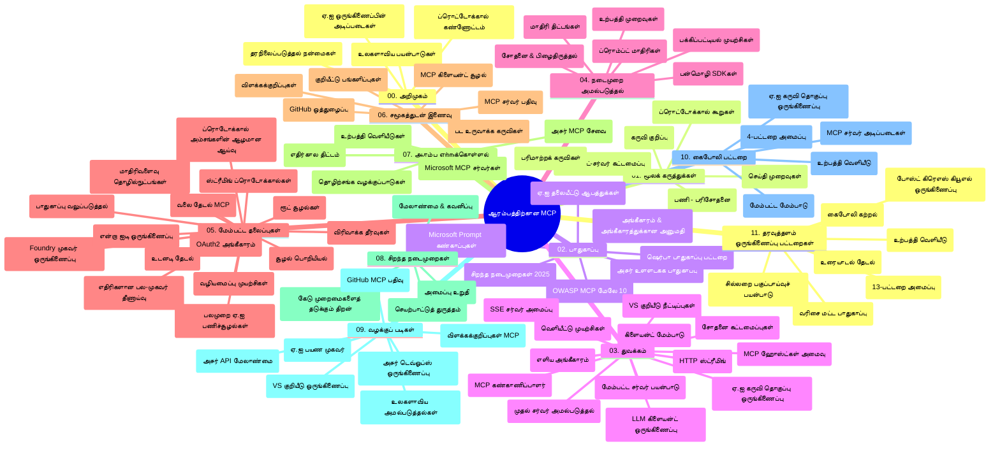

# ஆரம்பத்திற்கான மாதிரி கட்டமைப்பு ஒப்பந்தம் (MCP) - படிப்பு கையேடு

இந்தப் படிப்பு கையேடு "ஆரம்பத்திற்கான மாதிரி கட்டமைப்பு ஒப்பந்தம் (MCP)" பாடத்திட்டத்தின் கோப்பக அமைப்பு மற்றும் உள்ளடக்கத்தின் மேலோட்டத்தை வழங்குகிறது. இந்தக் கையேட்டை பயன்படுத்தி கோப்பகத்தை திறமையாக இயக்கிக் கொண்டு கிடைக்கும் வளங்களை முழுமையாகப் பயன்படுத்துங்கள்.

## கோப்பக மேலோட்டம்

மாதிரி கட்டமைப்பு ஒப்பந்தம் (MCP) என்பது செயற்கை நுண்ணறிவு மாதிரிகள் மற்றும் கிளையண்ட் பயன்பாடுகள் இடையேயான தொடர்புகளுக்கான ஒருமுறை நிலை கூர்ந்த கட்டமைப்பு ஆகும். முதலில் அன்துரோபிக் உருவாக்கிய MCP இப்போது அதிகாரப்பூர்வ GitHub அமைப்பின் மூலமாக விரிவான MCP சமூகத்தால் பராமரிக்கப்படுகிறது. இந்தக் கோப்பகம் C#, Java, JavaScript, Python மற்றும் TypeScript மொழிகளில் நடைமுறை குறியீடு உதாரணங்களுடன் விரிவான பாடத்திட்டத்தை வழங்குகிறது, இது AI டெவலப்பர்கள், கணினி கட்டமைப்பாளர்கள் மற்றும் மென்பொருள் பொறியாளர்களுக்கானது.

## காட்சி பாடத்திட்ட வரைப்பு

## கோப்பக அமைப்பு

கோப்பகம் பதினொன்று முக்கிய பிரிவுகளாக ஒழுங்குபடுத்தப்பட்டுள்ளது, ஒவ்வொன்றும் MCP இன் வெவ்வேறு அம்சங்களைக் கவனித்துக் கொள்ளும்:

1. **அறிமுகம் (00-Introduction/)**
   - மாதிரி கட்டமைப்பு ஒப்பந்தத்தின் மேலோட்டம்
   - AI குழாய்களில் நிலைத்தன்மை ஏன் முக்கியம்
   - நடைமுறை பயன்பாடுகள் மற்றும் நன்மைகள்

2. **முக்கிய கருத்துகள் (01-CoreConcepts/)**
   - கிளையண்ட்-சேவையகம் கட்டமைப்பு
   - முக்கிய ஒப்பந்த கூறுகள்
   - MCP இல் செய்தி பரிமாற்ற முறைபாடுகள்

3. **பாதுகாப்பு (02-Security/)**
   - MCP அடிப்படையிலான அமைப்புகளின் பாதுகாப்பு அச்சுறுத்தல்கள்
   - பாதுகாப்பான செயல்படுத்தலுக்கான சிறந்த நடைமுறைகள்
   - அங்கீகாரம் மற்றும் அங்கீகரிப்பு தந்திரங்கள்
   - **பூரண பாதுகாப்பு ஆவணங்கள்**:
     - MCP பாதுகாப்பு சிறந்த நடைமுறைகள் 2025
     - Azure உள்ளடக்க பாதுகாப்பு செயல்முறை கையேடு
     - MCP பாதுகாப்பு கட்டுப்பாடுகள் மற்றும் நுட்பங்கள்
     - MCP சிறந்த நடைமுறைகள் விரைவு குறிப்புகள்
   - **முக்கிய பாதுகாப்பு தலைப்புகள்**:
     - உட்புகுத்தல் மற்றும் கருவி விஷம் தாக்குதல்கள்
     - அமர்வுத் தூக்குதல் மற்றும் குழப்பமான பிரதிநிதி பிரச்சினைகள்
     - டோக்கன் கடத்தல் தலையீடுகள்
     - அதிக உரிமைகள் மற்றும் அணுகல் கட்டுப்பாடு
     - AI கூறுகளுக்கான சப்ளை சேைன் பாதுகாப்பு
     - Microsoft நிலைப்பாடு கவசங்கள் ஒருங்கிணைப்பு

4. **துவக்கம் (03-GettingStarted/)**
   - சுற்றுச்சூழல் அமைப்பு மற்றும் கட்டமைப்பு
   - அடிப்படை MCP சேவையகம் மற்றும் கிளையண்ட் உருவாக்கல்
   - உள்ளமைவுகளுடன் ஒருங்கிணைப்பு
   - கீழ்காணும் பிரிவுகளைக் கொண்டிருக்கும்:
     - முதல் சேவையகம் செயல்படுத்தல்
     - கிளையண்ட் மேம்பாடு
     - LLM கிளையண்ட் ஒருங்கிணைப்பு
     - VS Code ஒருங்கிணைப்பு
     - சேவையகம் அனுப்பும் நிகழ்வுகள் (SSE) சேவையகம்
     - முன்னேற்ற சேவையகம் பயன்பாடு
     - HTTP ஒற்றைக்கேட்பு
     - AI கருவி தொகுப்புடன் ஒருங்கிணைவு
     - சோதனைதிட்டங்கள்
     - அமர்த்தல் வழிகாட்டிகள்

5. **நடைமுறை செயலாக்கம் (04-PracticalImplementation/)**
   - பல்வேறு நிரலாக்க மொழிகளில் SDK பயன்பாடு
   - பிழைத்திருத்தம், சோதனை மற்றும் சரிபார்ப்பு நுட்பங்கள்
   - மீண்டும் பயன்படுத்தக்கூடிய முன்மொழிவு வடிவங்கள் மற்றும் வேலைநெறிகள் உருவாக்கல்
   - செயலாக்க உதாரணங்கள் உள்ள மாதிரி திட்டங்கள்

6. **முன்னேற்ற தலைப்புகள் (05-AdvancedTopics/)**
   - கட்டமைப்பு பொறியியல் நுட்பங்கள்
   - Foundry முகவர் ஒருங்கிணைவு
   - பல முறையான AI வேலைநெறிகள்
   - OAuth2 அங்கீகாரம் டெமோக்கள்
   - நேரடி தேடல் திறன்கள்
   - நேரடி ஒற்றைக்கேட்பு
   - உரு கட்டமைப்புகள் செயல்படுத்தல்
   - வழி கண்காணிப்பு தந்திரங்கள்
   - மாதிரித் தேர்வு நுட்பங்கள்
   - அளவீடு அணுகுமுறைகள்
   - பாதுகாப்பு பரிசீலனைகள்
   - Entra ID பாதுகாப்பு ஒருங்கிணைப்பு
   - வலை தேடல் ஒருங்கிணைவு
   - போட்டியிடும் பல முகவர் காரணிப்பு (வாத முறைபாடுகள்)

7. **சமூக பங்களிப்புகள் (06-CommunityContributions/)**
   - குறியீடு மற்றும் ஆவணங்கள் பங்களிக்கும் முறை
   - GitHub வழியாக ஒத்துழைப்பு
   - சமூக ஆதரவு மேம்பாடுகள் மற்றும் பின்னூட்டம்
   - பல MCP கிளையண்ட்களை (Claude டெஸ்க்டாப், Cline, VSCode) பயன்பாடு
   - புகழ்பெற்ற MCP சேவையகங்களுடன் பணியாற்றுதல், பட உருவாக்க குறியீடுகள் உட்பட

8. **முதன்மை ஏற்றுக்கொள்ளுதல் பாடங்கள் (07-LessonsfromEarlyAdoption/)**
   - உண்மை உலக செயல்பாடுகள் மற்றும் வெற்றி கதைகள்
   - MCP அடிப்படையிலான தீர்வுகளை கட்டி அமர்த்துதல்
   - போக்குகள் மற்றும் எதிர்கால கருவி வரைபடம்
   - **Microsoft MCP சேவையகங்கள் கையேடு**: 10 தயாரிப்பு தயாரான Microsoft MCP சேவையகங்களுக்கு முழுமையான வழிகாட்டி:
     - Microsoft Learn Docs MCP சேவையகம்
     - Azure MCP சேவையகம் (15+ சிறப்பு இணைப்பிகள்)
     - GitHub MCP சேவையகம்
     - Azure DevOps MCP சேவையகம்
     - MarkItDown MCP சேவையகம்
     - SQL Server MCP சேவையகம்
     - Playwright MCP சேவையகம்
     - Dev Box MCP சேவையகம்
     - Azure AI Foundry MCP சேவையகம்
     - Microsoft 365 முகவர்களுக்கான கருவித்தொகு MCP சேவையகம்

9. **சிறந்த நடைமுறைகள் (08-BestPractices/)**
   - செயல்திறன் திருத்தம் மற்றும் மேம்படுத்தல்
   - பிழைத்துடைமை MCP அமைப்புகள் வடிவமைத்து உருவாக்கல்
   - சோதனை மற்றும் உறுதியான வேலைநிறுவல்

10. **வழக்குச் சுருக்கங்கள் (09-CaseStudy/)**
    - **ஏழு விரிவான வழக்குத் திசைகள்** MCP பல்துறை பன்முகத்தன்மையை காட்சிப்படுத்துகின்றன:
    - **Azure AI பயண முகவர்கள்**: Azure OpenAI மற்றும் AI தேடல் உடன் பல முகவர் ஒருங்கிணைவு
    - **Azure DevOps ஒருங்கிணைவு**: YouTube தரவு புதுப்பிப்புகளுடன் வேலைநடை தானாக செயல்படுத்தல்
    - **நேரடி ஆவணப் பெறல்**: Python கான்சோல் கிளையண்டுடன் HTTP ஒற்றைக்கேட்பு
    - **உரையாடல் படிப்பு திட்ட ஜெனரேட்டர்**: Chainlit வலை பயன்பாடு உரையாடல் AI உடன்
    - **திருத்தி உள்ளே ஆவணம்**: VS Code ஒருங்கிணைப்பு GitHub Copilot வேலைநெறிகளுடன்
    - **Azure API மேலாண்மை**: MCP சேவையகம் உருவாக்கும் தொழிற்துறை API ஒருங்கிணைவு
    - **GitHub MCP பதிவு**: சுற்றுப்புற வளர்ச்சி மற்றும் முகவரியல் ஒருங்கிணைவு மேடை
    - தொழிற்துறை ஒருங்கிணைவு, டெவலப்பர் உற்பத்தித்திறன், சுற்றுச்சூழல் வளர்ச்சி ஆகியவற்றின் செயலாக்க உதாரணங்கள்

11. **கைத்தொடர்பு பணிமனையம் (10-StreamliningAIWorkflowsBuildingAnMCPServerWithAIToolkit/)**
    - MCP மற்றும் AI கருவித் தொகுப்பு ஒன்றிணைந்த விரிவான கைத்தொடர்பு பணிமனையம்
    - AI மாதிரிகள் மற்றும் உண்மைகருவிகள் இடையேயான நுண்ணறிவு பயன்பாடுகளை உருவாக்குதல்
    - அடிப்படைகள், தனிப்பயன் சேவையகம் மேம்பாடு, தயாரிப்பு அமர்த்தல் தந்திரங்களை உள்ளடக்கிய நடைமுறைப் பகுதிகள்
    - **பயிற்சி அமைப்பு**:
      - பயிற்சி 1: MCP சேவையகம் அடிப்படைகள்
      - பயிற்சி 2: முன்னேற்ற MCP சேவையகம் மேம்பாடு
      - பயிற்சி 3: AI கருவித்தொகுப்பு ஒருங்கிணைவு
      - பயிற்சி 4: தயாரிப்பு அமர்த்தல் மற்றும் அளவீடு
    - படி படியான வழிகாட்டலுடன் ஆய்வுக் கற்றல்

12. **MCP சேவையகம் தரவுத்தள ஒருங்கிணைவு பயிற்சிகள் (11-MCPServerHandsOnLabs/)**
    - தயாரிப்பு தயாரான MCP சேவையகங்களை PostgreSQL ஒருங்கிணைப்புடன் கட்டுவதற்கான **13 பயிற்சிகளைக் கொண்ட முழுமையான கற்றல் பாதை**
    - **உண்மையான சில்லறை பகுப்பாய்வு செயலாக்கம்**: Zava Retail பயன்பாட்டை பயன்படுத்தி
    - **தொழிற்துறை தரத்தை உடைய மாதிரிகள்**: வரிசை நிலை பாதுகாப்பு (RLS), பொருள் தேடல், பல வாடிக்கையாளர் தரவு அணுகல்
    - **முழு பயிற்சி அமைப்பு**:
      - **பயிற்சிகள் 00-03: அடித்தளம்** - அறிமுகம், கட்டமைப்பு, பாதுகாப்பு, சுற்றுச்சூழல் ஏற்பாடு
      - **பயிற்சிகள் 04-06: MCP சேவையகம் கட்டமைத்தல்** - தரவுத்தள வடிவமைப்பு, MCP சேவையகம் செயல்படுத்தல், கருவி மேம்பாடு
      - **பயிற்சிகள் 07-09: முன்னேற்ற அம்சங்கள்** - பொருள் தேடல், சோதனை மற்றும் பிழைத்திருத்தம், VS Code ஒருங்கிணைவு
      - **பயிற்சிகள் 10-12: தயாரிப்பு மற்றும் சிறந்த நடைமுறைகள்** - அமர்த்தல், கண்காணிப்பு, மேம்படுத்தல்
    - **பயன்படுத்தப்படும் தொழில்நுட்பங்கள்**: FastMCP கட்டமைப்பு, PostgreSQL, Azure OpenAI, Azure Container Apps, Application Insights
    - **கற்கும் விளைவுகள்**: தயாரிப்பு தயாரான MCP சேவையகங்கள், தரவுத்தள ஒருங்கிணைவு மாதிரிகள், AI இயக்கும் பகுப்பாய்வு, தொழிற்துறை பாதுகாப்பு

## கூடுதல் வளங்கள்

கோப்பகம் கீழ்க்காணும் ஆதரவு வளங்களைக் கொண்டுள்ளது:

- **படங்கள் கோப்பகம்**: பாடத்திட்டத்தில் பயன்படுத்தப்பட்ட வரைபடங்கள் மற்றும் விளக்கப்படங்கள்
- **மொழிபெயர்ப்புகள்**: ஆவணத்தின் பலமொழி ஆதரவு மற்றும் தானாக மொழிபெயர்ப்பு
- **அதிகாரபூர்வ MCP வளங்கள்**:
  - [MCP ஆவணங்கள்](https://modelcontextprotocol.io/)
  - [MCP விவரம்](https://spec.modelcontextprotocol.io/)
  - [MCP GitHub கோப்பகம்](https://github.com/modelcontextprotocol)

## இந்தக் கோப்பகத்தை எப்படி பயன்படுத்துவது

1. **தொடர் கற்றல்**: பாத்திரையாக வரிசையாக அதிகாரங்களைக் (00 முதல் 11 வரை) பின்பற்றுதல்.
2. **மொழி-சார்ந்த கவனம்**: விரும்பிய நிரல் மொழிக்கான செயலாக்க உதாரணங்களுக்காக மாதிரிக் கோப்புகளை ஆராய்தல்.
3. **நடைமுறை செயலாக்கம்**: "துவக்கம்" பிரிவுடன் ஆரம்பித்து உங்கள் சுற்றுச்சூழலை அமைத்து முதல் MCP சேவையகம் மற்றும் கிளையண்டை உருவாக்குதல்.
4. **முன்னேற்ற ஆய்வு**: அடிப்படைகளுடன் பரிச்சயம் ஆன பின் மேம்பட்ட தலைப்புகளில் சென்று அறிவை விரிவாக்குதல்.
5. **சமூகச் செயல்பாடு**: MCP சமூகத்தில் GitHub உரையாடல்கள் மற்றும் Discord சேனல்களில் சேர்ந்து நிபுணர்கள் மற்றும் மற்ற டெவலப்பர்களுடன் இணைவது.

## MCP கிளையண்ட்கள் மற்றும் கருவிகள்

பாடத்திட்டம் பல MCP கிளையண்ட்கள் மற்றும் கருவிகளை கவர்ச்சிகரமாக கவர்கிறது:

1. **அதிகாரபூர்வ கிளையண்ட்கள்**:
   - Visual Studio Code
   - Visual Studio Code இல் MCP
   - Claude டெஸ்க்டாப்
   - VSCode இல் Claude
   - Claude API

2. **சமூக கிளையண்ட்கள்**:
   - Cline (முதன்மை கட்டளை வரி)
   - Cursor (குறியீட்டு திருத்தி)
   - ChatMCP
   - Windsurf

3. **MCP நிர்வாக கருவிகள்**:
   - MCP CLI
   - MCP மேலாளர்
   - MCP இணைப்பாளர்
   - MCP வழிசெலுத்தி

## புகழ்பெற்ற MCP சேவையகங்கள்

கோப்பகம் பல MCP சேவையகங்களை அறிமுகப்படுத்துகிறது, அவை:

1. **அதிகாரபூர்வ Microsoft MCP சேவையகங்கள்**:
   - Microsoft Learn Docs MCP சேவையகம்
   - Azure MCP சேவையகம் (15+ சிறப்பு இணைப்பிகள்)
   - GitHub MCP சேவையகம்
   - Azure DevOps MCP சேவையகம்
   - MarkItDown MCP சேவையகம்
   - SQL Server MCP சேவையகம்
   - Playwright MCP சேவையகம்
   - Dev Box MCP சேவையகம்
   - Azure AI Foundry MCP சேவையகம்
   - Microsoft 365 முகவர்களுக்கான கருவித்தொகு MCP சேவையகம்

2. **அதிகாரபூர்வ குறிப்பு சேவையகங்கள்**:
   - கோப்புறை (Filesystem)
   - எடுப்பதற்கான (Fetch)
   - நினைவக (Memory)
   - தொடர் சிந்தனை (Sequential Thinking)

3. **பட உருவாக்கம்**:
   - Azure OpenAI DALL-E 3
   - Stable Diffusion WebUI
   - Replicate

4. **மேம்பாட்டுக்கான கருவிகள்**:
   - Git MCP
   - கட்டளை கட்டுப்பாடு (Terminal Control)
   - குறியீடு உதவியாளர் (Code Assistant)

5. **சிறப்பு சேவையகங்கள்**:
   - Salesforce
   - Microsoft Teams
   - Jira & Confluence

## பங்களிப்பு

இந்தக் கோப்பகம் சமூக பங்களிப்புகளுக்கு வரவேற்கிறது. MCP சூழல் அமைப்பில் திறம்பட பங்களிப்பதற்கான வழிகாட்டிக்கு சமூக பங்களிப்புகள் பிரிவைப் பார்க்கவும்.

----

*இந்த படிப்பு கையேடு 5 பிப்ரவரி 2026 அன்று கடைசியாக புதுப்பிக்கப்பட்டது, அந்நிலையில் MCP விவாதப்படுத்தல் 2025-11-25 மற்றும் அந்த நாளுக்கு எடுக்கப்பட்ட கோப்பகத்தின் மேலோட்டத்தை வழங்குகிறது. இந்த தேதி பிறகு கோப்பக உள்ளடக்கம் புதுப்பிக்கப்படலாம்.*

---

<!-- CO-OP TRANSLATOR DISCLAIMER START -->
**ஒப்புச்சான்று**:
இந்த ஆவணம் [Co-op Translator](https://github.com/Azure/co-op-translator) என்ற செயற்கை நுண்ணறிவு மொழிபெயர்ப்பு சேவையை பயன்படுத்தி மொழிபெயர்க்கப்பட்டது. நாங்கள் துல்லியத்துக்காக முயற்சித்துள்ளோம் என்றாலும், தானாக இயங்கும் மொழிபெயர்ப்புகளில் பிழைகள் அல்லது தவறுகள் இருக்கக்கூடும் என்பதை தயவுசெய்து கவனியுங்கள். முதல்நிலை ஆவணத்தின் சொந்த மொழி அதன் அதிகாரபூர்வ ஆதாரமாக கருதப்பட வேண்டும். முக்கியமான தகவல்களுக்கு, தொழில்முறை மனித மொழிபெயர்ப்பை பரிந்துரைக்கிறோம். இச்செயற்கை மொழிபெயர்ப்பைப் பயன்படுத்துவதால் உண்டாகும் எந்த விளக்கம் தவறுகளுக்குமான பொறுப்பும் நாங்கள் ஏற்கக்கூடாது.
<!-- CO-OP TRANSLATOR DISCLAIMER END -->