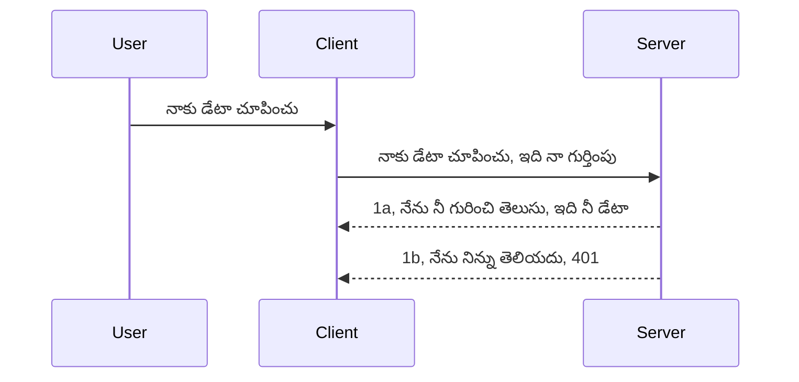

# సింపుల్ ఆత్మ

MCP SDK లు OAuth 2.1 వినియోగాన్ని మద్దతు ఇస్తాయి, ఇది నిజంగా చాలా ఘనమైన ప్రక్రియ, ఇవి ఆత్మ సర్వర్, రిసోర్స్ సర్వర్, క్రెడెన్షియల్స్ పోస్ట్ చేయడం, కోడ్ పొందడం, ఆ కోడ్ ను బేరర్ టోకెన్కి మార్పిడి చేయడం వరకు సంభవిస్తుంది, తద్వారా మీరు చివరకు మీ రిసోర్స్ డేటాను పొందవచ్చు. మీరు OAuth కు పరిచయం లేని వారు అయితే, ఇది అమలు చేయడానికి మంచి దిశలో మొదలు పెట్టడం మంచిది, కనీస స్థాయి ఆత్మతో ప్రారంభించి మెరుగైన భద్రతకు అభివృద్ధి చెందడం మంచిది. అందుకే ఈ అధ్యాయం ఉంది, ఇది మిమ్మల్ని అధునాతన ఆత్మకు అభివృద్ధి చేయడానికి.

## ఆత్మ అంటే ఏమిటి?

ఆత్మ అనేది authentication మరియు authorization కు సంక్షిప్త రూపం. ఆలోచన ఏమిటంటే మనం రెండు విషయాలు చేయాలి:

- **Authentication**, అంటే మన ఇంటికి వ్యక్తి ඇంట్రీకి అనుమతి ఇస్తామా అనేదాన్ని నిర్ణయించడం, వారు "ఇక్కడ" ఉండే హక్కు ఉన్నారా అంటే మన MCP సర్వర్ ఫీచర్లు లైవ్ ఉన్న రిసోర్స్ సర్వర్ కి యాక్సెస్ ఉన్నట్టే అని పరిక్షా చేయడం.
- **Authorization**, అంటే ఒక యూజర్ మనకు అడిగిన ఈ ప్రత్యేక రిసోర్స్ లకు (ఉదాహరణకు ఈ ఆర్డర్స్ లేదా ఈ ప్రొడక్ట్స్) యాక్సెస్ ఉండాలా లేదా, అవి చదవడాన్ని అనుమతిస్తారా కానీ తొలగించడానికి అనుమతించకపోవటం వంటి వివిధ హక్కుల పరిశీలన.

## క్రెడెన్షియల్స్: మనం సిస్టమ్ కు మనం ఎవరో ఎలా చెప్పాలి

చాలా వెబ్ డెవలపర్లు సాధారణంగా సర్వర్ కు ఒక క్రెడెన్షియల్ను అందించడం గురించి ఆలోచిస్తారు, ఇది సాధారణంగా ఒక రహస్యం, వారు ఇక్కడ ఉండే హక్కు ఉందని అర్థం అవుతుంది "Authentication". ఈ క్రెడెన్షియల్ సాధారణంగా యూజర్మేన్ మరియు పాస్వర్డ్ లేదా ప్రత్యేకంగా ఒక యూజర్ ను గుర్తించే API కీ యొక్క base64 ఎంకోడెడ్ వర్షన్ గాను ఉంటాయి. 

ఇది సాధారణంగా "Authorization" అనే హెడర్ ద్వారా పంపుతారు ఇలా:

```json
{ "Authorization": "secret123" }
```

ఇది సాధారణంగా basic authentication అని పిలవబడుతుంది. మొత్తం ఫ్లో ఇలా పనిచేస్తుంది:


పుడు మనం ఈ ఫ్లో ని అర్థం చేసుకున్నాము, దీన్ని ఎలా అమలు చేయాలి? సాధారణంగా చాలా వెబ్ సర్వర్ల వద్ద middleware అనే కాన్సెప్టు ఉంటుంది, ఇది ఒక కోడ్ భాగం, ఇది రిక్వెస్ట్ భాగంగా నడుస్తుంది, క్రెడెన్షియల్ను పరీక్షిస్తుంది, వారు సరైనవైతే రిక్వెస్ట్ పొందేలా చేస్తుంది. క్రెడెన్షియలాలు సరైనవి కాకపోతే ఆత్మ లోపం వస్తుంది. దీన్ని ఎలా అమలు చేస్తారో చూద్దాం:

**Python**

```python
class AuthMiddleware(BaseHTTPMiddleware):
    async def dispatch(self, request, call_next):

        has_header = request.headers.get("Authorization")
        if not has_header:
            print("-> Missing Authorization header!")
            return Response(status_code=401, content="Unauthorized")

        if not valid_token(has_header):
            print("-> Invalid token!")
            return Response(status_code=403, content="Forbidden")

        print("Valid token, proceeding...")
       
        response = await call_next(request)
        # ఏదైనా కస్టమర్ హెడర్లు జోడించండి లేదా ప్రతిస్పందనలో ఏదైనా మార్పు చేయండి
        return response


starlette_app.add_middleware(CustomHeaderMiddleware)
```

ఇక్కడ మనం:

- `AuthMiddleware` అనే ఒక middleware సృష్టించాము, దీని `dispatch` mehtod వెబ్ సర్వర్ ద్వారా పిలవబడుతుంది.
- middleware ను వెబ్ సర్వర్ లో జోడించాము:

    ```python
    starlette_app.add_middleware(AuthMiddleware)
    ```

- Authorization హెడర్ ఉన్నదా, పంపిన రహస్యం సరైనదా అన్న validation logic వ్రాసాము:

    ```python
    has_header = request.headers.get("Authorization")
    if not has_header:
        print("-> Missing Authorization header!")
        return Response(status_code=401, content="Unauthorized")

    if not valid_token(has_header):
        print("-> Invalid token!")
        return Response(status_code=403, content="Forbidden")
    ```

    రహస్యం ఉన్నది మరియు సరైనది అయితే `call_next` పిలవడం ద్వారా రిక్వెస్ట్ ని పాస్ చేయించి రిస్పాన్స్ ను తిరిగి ఇస్తాము.

    ```python
    response = await call_next(request)
    # ఏదైనా కస్టమర్ హెడ్డర్లు జోడించండి లేదా స్పందనలో ఏదైనా మార్పు చేయండి
    return response
    ```

పని చేసే విధానం ఏమిటంటే వన్ వెబ్ రిక్వెస్ట్ సర్వర్ వైపు వస్తే middleware పిలవబడుతుంది, అమలిలో ఇది రిక్వెస్ట్ ని పాస్ చేయడానికి అనుమతిస్తుంది లేకపోతే కస్టమర్ గడువు కాలేదు అని చూపిస్తూ లోపాన్ని ఇస్తుంది.

**TypeScript**

ఇక్కడ మనం ప్రముఖ ఫ్రేమ్‌వర్క్ Express తో middleware సృష్టించి, MCP సర్వర్ కి రిక్వెస్ట్ చేరుకునే ముందు దాన్ని ఇంటెర్సెప్ట్చేస్తాము. కోడ్ ఇక్కడ:

```typescript
function isValid(secret) {
    return secret === "secret123";
}

app.use((req, res, next) => {
    // 1. ప్రమాణీకరణ హెడ్డర్ ఉన్నదా?
    if(!req.headers["Authorization"]) {
        res.status(401).send('Unauthorized');
    }
    
    let token = req.headers["Authorization"];

    // 2. చెల్లింపును పరిశీలించండి.
    if(!isValid(token)) {
        res.status(403).send('Forbidden');
    }

   
    console.log('Middleware executed');
    // 3. అభ్యర్థన పైప్‌లైన్‌లో తదుపరి దశకు అభ్యర్థనను పంపండి.
    next();
});
```

ఈ కోడ్ లో మనం:

1. మొదట Authorization హెడర్ ఉందో లేదో చూడటం, లేకపోతే 401 లోపం పంపించటం.
2. క్రెడెన్షియల్/టోకెన్ సరైనదా అని నిర్ధారించటం, లేకపోతే 403 లోపం పంపించటం.
3. చివరగా రిక్వెస్ట్ పైప్‌లైన్ లో రిక్వెస్ట్ ని పాస్ చేయడం మరియు అడిగిన రిసోర్స్ ని తిరిగి ఇచ్చటం.

## వ్యాయామం: authentication అమలు చేయండి

మన జ్ఞానాన్ని తీసుకొని అమలు చేయడానికి ప్రయత్నిద్దాం. ప్రణాళిక ఇది:

సర్వర్

- వెబ్ సర్వర్ మరియు MCP ఇన్స్టాన్సును సృష్టించండి.
- సర్వర్ కోసం ఒక middleware అమలు చేయండి.

క్లయింట్ 

- క్రెడెన్షియల్ తో, హెడర్ ద్వారా వెబ్ రిక్వెస్ట్ పంపండి.

### -1- వెబ్ సర్వర్ మరియు MCP ఇన్స్టాన్సు సృష్టించండి

మొదటి దశలో మనం వెబ్ సర్వర్ ఇన్స్టాన్సు మరియు MCP సర్వర్ ని సృష్టించాలి.

**Python**

ఇక్కడ MCP సర్వర్ ఇన్స్టాన్సు సృష్టించి, starlette వెబ్ యాప్ సృష్టించి uvicorn తో హోస్ట్ చేస్తున్నాము.

```python
# MCP సర్వర్ సృష్టిస్తోంది

app = FastMCP(
    name="MCP Resource Server",
    instructions="Resource Server that validates tokens via Authorization Server introspection",
    host=settings["host"],
    port=settings["port"],
    debug=True
)

# starlette వెబ్ యాప్ సృష్టిస్తోంది
starlette_app = app.streamable_http_app()

# uvicorn ద్వారా యాప్‌ను సేవ్ చేయడం
async def run(starlette_app):
    import uvicorn
    config = uvicorn.Config(
            starlette_app,
            host=app.settings.host,
            port=app.settings.port,
            log_level=app.settings.log_level.lower(),
        )
    server = uvicorn.Server(config)
    await server.serve()

run(starlette_app)
```

ఈ కోడ్ లో మనం:

- MCP సర్వర్ ను సృష్టించాము.
- MCP సర్వర్ నుండి starlette వెబ్ యాప్ రూపొందించాము, `app.streamable_http_app()` ద్వారా.
- uvicorn `server.serve()` ఉపయోగించి వెబ్ యాప్ ను హోస్ట్ చేసి సర్వ్ చేస్తున్నాము.

**TypeScript**

ఇక్కడ MCP సర్వర్ ఇన్స్టాన్సును సృష్టించాము.

```typescript
const server = new McpServer({
      name: "example-server",
      version: "1.0.0"
    });

    // ... సర్వర్ వనరులు, సాధనాలు మరియు ప్రాంప్ట్‌లను సెట్ చేయండి ...
```

MCP సర్వర్ సృష్టి మన POST /mcp రూట్ నిర్వచన లో చేయాలి, కాబట్టి పై కోడ్ ను ఇలా తరలిద్దాం:

```typescript
import express from "express";
import { randomUUID } from "node:crypto";
import { McpServer } from "@modelcontextprotocol/sdk/server/mcp.js";
import { StreamableHTTPServerTransport } from "@modelcontextprotocol/sdk/server/streamableHttp.js";
import { isInitializeRequest } from "@modelcontextprotocol/sdk/types.js"

const app = express();
app.use(express.json());

// సెషన్ ID ద్వారా రవాణాల నిల్వ కోసం మ్యాప్
const transports: { [sessionId: string]: StreamableHTTPServerTransport } = {};

// క్లయింట్-టు-సెర్వర్ కమ్యూనికేషన్ కోసం POST అభ్యర్థనలను నిర్వహించండి
app.post('/mcp', async (req, res) => {
  // ప్రస్తుతం ఉన్న సెషన్ ID ని తనిఖీ చేయండి
  const sessionId = req.headers['mcp-session-id'] as string | undefined;
  let transport: StreamableHTTPServerTransport;

  if (sessionId && transports[sessionId]) {
    // ఇప్పటి మొదలైన రవాణాను పునఃవినియోగం చేయండి
    transport = transports[sessionId];
  } else if (!sessionId && isInitializeRequest(req.body)) {
    // కొత్త ఆరంభ అభ్యర్థన
    transport = new StreamableHTTPServerTransport({
      sessionIdGenerator: () => randomUUID(),
      onsessioninitialized: (sessionId) => {
        // సెషన్ ID ద్వారా రవాణాను నిల్వ చేయండి
        transports[sessionId] = transport;
      },
      // DNS రీబైండింగ్ రక్షణ డిఫాల్ట్‌గా తిరిగిపొందడం కోసం నిలిపివేసి ఉంది. మీరు ఈ సర్వర్‌ను
      // స్థానికంగా నడిపుతున్నట్లయితే, దయచేసి క్రింద పేర్కొన్నది సెట్ చేయండి:
      // enableDnsRebindingProtection: true,
      // allowedHosts: ['127.0.0.1'],
    });

    // మూసివేయబడినప్పుడు రవాణాను శుభ్రపరచండి
    transport.onclose = () => {
      if (transport.sessionId) {
        delete transports[transport.sessionId];
      }
    };
    const server = new McpServer({
      name: "example-server",
      version: "1.0.0"
    });

    // ... సర్వర్ వనరులు, పరికరాలు, మరియు ప్రాంప్ట్ లను సెటప్ చేయండి ...

    // MCP సర్వర్కు కనెక్ట్ అవ్వండి
    await server.connect(transport);
  } else {
    // చెల్లని అభ్యర్థన
    res.status(400).json({
      jsonrpc: '2.0',
      error: {
        code: -32000,
        message: 'Bad Request: No valid session ID provided',
      },
      id: null,
    });
    return;
  }

  // అభ్యర్థనను నిర్వహించండి
  await transport.handleRequest(req, res, req.body);
});

// GET మరియు DELETE అభ్యర్థనలకు పునఃవినియోగ ప్రయోజన HANDLER
const handleSessionRequest = async (req: express.Request, res: express.Response) => {
  const sessionId = req.headers['mcp-session-id'] as string | undefined;
  if (!sessionId || !transports[sessionId]) {
    res.status(400).send('Invalid or missing session ID');
    return;
  }
  
  const transport = transports[sessionId];
  await transport.handleRequest(req, res);
};

// SSE ద్వారా సర్వర్-టు-క్లయింట్ నోటిఫికేషన్స్ కోసం GET అభ్యర్థనలను నిర్వహించండి
app.get('/mcp', handleSessionRequest);

// సెషన్ ముగింపుకు DELETE అభ్యర్థనలను నిర్వహించండి
app.delete('/mcp', handleSessionRequest);

app.listen(3000);
```

ఇప్పుడు మీరు గమనిస్తారు గ MCP సర్వర్ సృష్టి `app.post("/mcp")` లోకి తరలించబడింది.

 middleware సృష్టి తదుపరి దశకు వెళ్లి, రాబోయే క్రెడెన్షియల్ ను పరిశీలిద్దాం.

### -2- సర్వర్ కోసం middleware సృష్టించండి

middleware భాగానికి వస్తే, ఇక్కడ మనం `Authorization` హెడర్ లో క్రెడెన్షియల్ కోసం చూడగల middleware ను సృష్టిస్తాము, అది సరైనదైతే రిక్వెస్ట్ అవసరమైన పనిని చేస్తుంది (ఉదా: టూల్స్ జాబితా, రిసోర్స్ చదవడం లేదా MCP ఫంక్షనాలిటీ).

**Python**

middleware సృష్టించడానికి, `BaseHTTPMiddleware` నుండి వారసత్వం పొందే క్లాస్ సృష్టించాలి. ఇక్కడ రెండు ముఖ్య భాగాలు:

- రిక్వెస్ట్ `request`, మనం దీనిలోని హెడర్ సమాచారాన్ని చదువుతాము.
- `call_next` callback, ఇది క్లయింట్ సరైన క్రెడెన్షియల్ తీసుకొస్తే పిలవాలి.

మొదట, `Authorization` హెడర్ లేనప్పుడు ఎలా వ్యవహరించాలో చూద్దాం:

```python
has_header = request.headers.get("Authorization")

# హెడర్ లేదు, 401 తో విఫలమయ్యి, లేకపోతే ముందుకు పోవాలి.
if not has_header:
    print("-> Missing Authorization header!")
    return Response(status_code=401, content="Unauthorized")
```

ఇక్కడ మనం 401 unauthorized సందేశాన్ని పంపుతున్నాము, ఎందుకంటే క్లయింట్ authentication లో విఫలమవుతున్నాడు.

తర్వాత, క్రెడెన్షియల్ అందుబాటులో ఉంటే, దాని సరైనత ను ఇలా తనిఖీ చేస్తాము:

```python
 if not valid_token(has_header):
    print("-> Invalid token!")
    return Response(status_code=403, content="Forbidden")
```

పై కోడ్ లో 403 forbidden సందేశం పంపించడం గమనించండి. క్రింద పూర్తి middleware ఉంది, మనం పూర్వం చెప్పిన ప్రతీదీ అమలు చేస్తోంది:

```python
class AuthMiddleware(BaseHTTPMiddleware):
    async def dispatch(self, request, call_next):

        has_header = request.headers.get("Authorization")
        if not has_header:
            print("-> Missing Authorization header!")
            return Response(status_code=401, content="Unauthorized")

        if not valid_token(has_header):
            print("-> Invalid token!")
            return Response(status_code=403, content="Forbidden")

        print("Valid token, proceeding...")
        print(f"-> Received {request.method} {request.url}")
        response = await call_next(request)
        response.headers['Custom'] = 'Example'
        return response

```

అద్భుతం, కానీ `valid_token` ఫంక్షన్ ఎలా ఉంది? ఇది క్రింద ఉంది:

```python
# ఉత్పత్తి కోసం ఉపయోగించకండి - దీనిని మెరుగుపరుచండి !!
def valid_token(token: str) -> bool:
    # "Bearer " కు ముందు ఉన్న అలంకారం తీసివేయండి
    if token.startswith("Bearer "):
        token = token[7:]
        return token == "secret-token"
    return False
```

ఇది తప్పకుండా మెరుగుపరుచుకోవాలి.

గమనిక: ఈ రహస్యాలు కోడ్ లో ఉండకూడదు. సాధ్యమైనంత త్వరగా మేము ఈ విలువలను డేటా సోర్స్ లేదా IDP (identity service provider) నుండి తీసుకోవాలి లేదా IDP ద్వారా సరిపోయే వాలిడేషన్ చేయించాలి.

**TypeScript**

Express తో ఇది అమలు చేయడానికి, `use` అనే మేథడ్ పిలవాలి, ఇది middleware ఫంక్షన్లను తీసుకుంటుంది.

మనం చేయవలసింది:

- రిక్వెస్ట్ వేరియబుల్ తో క్రెడెన్షియల్ ని `Authorization` హెడర్ లో చూడటం.
- క్రెడెన్షియల్ ను ధ్రువీకరించడం, సరైనది అయితే రిక్వెస్ట్ కొనసాగనివ్వడం, క్లయింట్ MCP రిక్వెస్ట్ కి అవసరమైన పనిని చేయించటం.

ఇక్కడ, `Authorization` హెడర్ ఉన్నదా చూడటం, లేవంటే రిక్వెస్ట్ ఆపడం:

```typescript
if(!req.headers["authorization"]) {
    res.status(401).send('Unauthorized');
    return;
}
```

అందుకుంటే తప్ప, 401 వస్తుంది.

తరువాత, క్రెడెన్షియల్ సరైనదా చూసి, కాని సరైనది కానప్పటికీ రిక్వెస్ట్ ను మరోసారి ఆపడం, అయితే మెసేజ్ కొంచెం భిన్నంగా:

```typescript
if(!isValid(token)) {
    res.status(403).send('Forbidden');
    return;
} 
```

ఇప్పుడు వడ్డేది 403 లోపం.

పూర్తి కోడ్ ఇక్కడ:

```typescript
app.use((req, res, next) => {
    console.log('Request received:', req.method, req.url, req.headers);
    console.log('Headers:', req.headers["authorization"]);
    if(!req.headers["authorization"]) {
        res.status(401).send('Unauthorized');
        return;
    }
    
    let token = req.headers["authorization"];

    if(!isValid(token)) {
        res.status(403).send('Forbidden');
        return;
    }  

    console.log('Middleware executed');
    next();
});
```

మనం వెబ్ సర్వర్ లో middleware సెట్ చేసాము, క్లయింట్ పంపే క్రెడెన్షియల్ చూసేందుకు. అయితే క్లయింట్ ఎలా ఉన్నాడు?

### -3- హెడర్ ద్వారా క్రెడెన్షియల్ తో వెబ్ రిక్వెస్ట్ పంపండి

క్లయింట్ నుండి క్రెడెన్షియల్ హెడర్ లో పంపుతున్నారని నిర్ధారించాలి. మనం MCP క్లయింట్ ఉపయోగించబోతున్నాము, ఇది ఎలా చేస్తామో చూడాలి.

**Python**

క్లయింట్ కోడ్ లో క్రెడెన్షియల్ కలిగిన హెడర్ ఇలా పంపాలి:

```python
# విలువను హార్డ్‌కోడ్ చేయవద్దు, కనీసం ఒక ఎన్‌విరాన్‌మెంట్ వేరియబుల్ లేదా మరింత సురక్షిత నిల్వలో ఉంచండి
token = "secret-token"

async with streamablehttp_client(
        url = f"http://localhost:{port}/mcp",
        headers = {"Authorization": f"Bearer {token}"}
    ) as (
        read_stream,
        write_stream,
        session_callback,
    ):
        async with ClientSession(
            read_stream,
            write_stream
        ) as session:
            await session.initialize()
      
            # TODO, క్లయింట్‌లో మీరు కావలసిన పని, ఉదాహరణకు పరికరాలను జాబితా చేయడం, పరికరాలను కాల్ చేయడం మొదలైనవి.
```

`headers` ప్రాపర్టీ లో `"Authorization": f"Bearer {token}"` ఎలా ఇచ్చామో గమనించండి.

**TypeScript**

ఇది రెండు దశల్లో సాధ్యం:

1. క్రెడెన్షియల్ తో config ఆబ్జెక్ట్ పూరించండి.
2. ఆ config ఆబ్జెక్ట్ ను ట్రాన్స్పోర్ట్ కి పంపండి.

```typescript

// ఇక్కడ చూపినట్లుగా విలువను దృఢంగా కోడ్ చేయవద్దు. కనీసం దాన్ని ఒక env వేరియబుల్‌గా ఉంచి డెవ్ మోడ్‌లో dotenv వంటి దాన్ని ఉపయోగించండి.
let token = "secret123"

// క్లయింట్ ట్రాన్స్‌పోర్ట్ ఎంపిక ఆబ్జెక్ట్‌ని నిర్వచించండి
let options: StreamableHTTPClientTransportOptions = {
  sessionId: sessionId,
  requestInit: {
    headers: {
      "Authorization": "secret123"
    }
  }
};

// ఆప్షన్స్ ఆబ్జెక్ట్‌ను ట్రాన్స్‌పోర్ట్‌కు పంపండి
async function main() {
   const transport = new StreamableHTTPClientTransport(
      new URL(serverUrl),
      options
   );
```

ఇక్కడ మనం `options` ఆబ్జెక్ట్ సృష్టించి, దాని `requestInit` లో headers ను పెట్టిన విధానం చూడవచ్చు.

గమనిక: ఇక్కడ থেকে మనం ఎలా మెరుగుపర్చాలి? వర్తమాన అమలులో కొన్ని సమస్యలు ఉన్నాయి. మొదటిది, ఈ రకమైన క్రెడెన్షియల్ పంపడం ప్రమాదకరం, కనీసం HTTPS వుంటే మాత్రమే మంచిది. అయితే క్రెడెన్షియల్ దొంగిలించబడవచ్చు కాబట్టి ఒక విధానం ఉండాలి, కొత్త టోకెన్ revoke చేయగలిగే, ఎక్కడ నుండి వస్తుందో చింతించగలిగే, అప్పుడప్పుడు (బాప్‌లాగా ప్రవర్తన) ఇబ్బంది ఉంటే పరీక్షించే ఇంకా నిబంధనలు ఉండాలి.

ఇది మంచిది, చాలా సింపుల్ APIs కోసం ఈ సరైన ఆరవతో ప్రారంభం.

ఇప్పుడు భద్రతను మరింత పెంచడానికి JSON Web Token (JWT) అనే ప్రామాణిక ఫార్మాట్ ని వాడుకుందాం.

## JSON వెబ్ టోకెన్స్, JWT

మనం చాలా సింపుల్ క్రెడెన్షియల్స్ పంపించడాన్ని మెరుగుపరుచుకునేందుకు ప్రయత్నిస్తున్నాము. JWT అనుసరించడంతో మనకి ఏ మెరుగుదలలు వస్తాయి?

- **భద్రతా మెరుగుదల**. basic auth లో మీరు యూజర్ నేమ్ మరియు పాస్వర్డ్ base64 ఎంకోడెడ్ టోకెన్గా పంపుతారు (లేదా API కీ), ఇది రిస్క్ పెంచుతుంది. JWT తో మీ యూజర్ నేమ్ పాస్‌వర్డ్ ఇచ్చి టోకెన్ లభిస్తుంది, అది సమయ పరిమితి ఉన్నది అంటే అది కాలంతో గడువు ముగిస్తుంది. JWT తో మీరు roles, scopes, permissions వంటివి ఉపయోగించి ఫైన్ గ్రేడ్ యాక్సెస్ కంట్రోల్ సులభంగా చేయవచ్చు.
- **స్టేట్లెస్ మరియు స్కేలబిలిటీ**. JWT స్వయంపాలితమయ్యే టోకెన్లుగా ఉంటుంది, వీటిలో అన్ని యూజర్ సమాచారాన్ని ఉంచుతాయి కాబట్టి సర్వర్-సైడ్ సెషన్ నిల్వ అవసరం ఉంటుంది లేదు. టోకెన్ ను లోకల్ లో కూడా ధ్రువీకరించవచ్చు.
- **ఇంటరొపరబిలిటీ మరియు ఫెడరేషన్**. JWT Open ID Connect ప్రధాన భాగం, Entra ID, Google Identity, Auth0 వంటి ప్రముఖ ప్రామాణీకరణ ప్రొవైడర్స్ తో వాడతారు. సింగిల్ సైన్ ఆన్, ఇంకాEnterprise గ్రేడ్ కొన్ని టెక్నాలజీలు సులభం అవుతాయి.
- **మాడ్యులారిటీ మరియు ఫ్లెక్సిబిలిటీ**. JWT లను Azure API Management, NGINX వంటి API గేట్‌వేలు తో ఉపయోగించవచ్చు. ఇది ఉపయోగ ఆత్మకరణ పరిస్థితులు, సర్వర్ నుండి సర్వీస్ కమ్యూనికేషన్, అలాగే ఎక్స్‌పోజింగ్ మరియు దర్యాప్తు పరిస్థితులకి కూడా అనుకూలంగా ఉంటుంది.
- **పర్ఫార్మెన్స్ మరియు క్యాచింగ్**. JWT డీకోడ్ చేయడం తర్వాత క్యాష్ చేయవచ్చు, ఇది పర్సింగ్ అవసరాన్ని తగ్గిస్తుంది. ఇది అధిక ట్రాఫిక్ అనువర్తనాలకు throughput మెరుగుపరుస్తుంది మరియు ఇన్‌ఫ్రాస్ట్రక్చర్ లో లోడ్ తగ్గిస్తుంది.
- **అధునాతన ఫీచర్స్**. JWT introspection (సర్వర్ పై ధ్రువీకరణ చూసటం) మరియు revocation (టోకెన్ ను చెలామణీ చేయని చేయడం) కి మద్దతు ఇస్తుంది.

ఈ అన్ని లాభాలతో మనం ఎలా మన అమలు మెరుగుపరిచుకోగలం చూద్దాం.

## basic auth ని JWTగా మార్పిడి

మనం చేయవలసిన ప్రధాన మార్పులు:

- **JWT టోకెన్ నిర్మాణం నేర్చుకోండి** మరియు క్లయింట్ నుంచి సర్వర్ కు పంపగలిగేట్టు తయారుచేయండి.
- **JWT టోకెన్ ధ్రువీకరించండి** మరియు సరైనది అయితే క్లయింట్ కు మన వనరులు అందించండి.
- **సురక్షిత టోకెన్ నిల్వ**. టోకెన్ ను ఎలా భద్రపరచాలో.
- **రూట్ల సంరక్షణ**. మన రూట్లను మరియు MCP ఫీచర్లను రక్షించాలి.
- **రిఫ్రెష్ టోకెన్లు జోడించండి**. చిన్నప్పటి టోకెన్లు మరియు దీర్ఘకాలిక రిఫ్రెష్ టోకెన్లు సృష్టించి, అవి గడువు తీరినప్పుడు కొత్త టోకెన్ పొందేందుకు ఉపయోగించడం. రిఫ్రెష్ ఎండ్‌పాయింట్ మరియు రొటేషన్ విధానం ఉండాలి.

### -1- JWT టోకెన్ నిర్మాణం

మొదటగా, JWT టోకెన్ యొక్క భాగాలు:

- **header**, ఉపయోగించిన అల్గోరిథం మరియు టోకెన్ టైపు
- **payload**, క్లెయిమ్స్, ఉదా: sub (యూజర్ లేదా టోకెన్ సూచించే సబ్జెక్ట్), exp (సమయ గడువు), role (పాత్ర)
- **signature**, సీక్రెట్ లేదా ప్రైవేట్ కీతో సంతకం చేయబడినది

మనం header, payload మరియు ఎంకోడెడ్ టోకెన్ తయారు చేయాలి.

**Python**

```python

import jwt
import jwt
from jwt.exceptions import ExpiredSignatureError, InvalidTokenError
import datetime

# JWT ను సైన్ చేయడానికి ఉపయోగించే సీక్రెట్ కీ
secret_key = 'your-secret-key'

header = {
    "alg": "HS256",
    "typ": "JWT"
}

# యూజర్ సమాచారము మరియు దాని హక్కులు మరియు ముగిసే సమయం
payload = {
    "sub": "1234567890",               # విషయం (యూజర్ ID)
    "name": "User Userson",                # అనుకూల హక్కు
    "admin": True,                     # అనుకూల హక్కు
    "iat": datetime.datetime.utcnow(),# జారీ చేసిన సమయం
    "exp": datetime.datetime.utcnow() + datetime.timedelta(hours=1)  # ముగిసే సమయం
}

# దాన్ని ఎంకోడ్ చేయండి
encoded_jwt = jwt.encode(payload, secret_key, algorithm="HS256", headers=header)
```

పై కోడ్ లో మనం:

- HS256 అల్గోరిథం తో header ను నిర్వచించాము, type JWT గా.
- payload లో సబ్జెక్ట్ / యూజర్ id, యూజర్ పేరు, పాత్ర, విడుదల సమయం మరియు గడువు ముగిసే సమయం తో టైమ్ బౌండ్ అమలు చేశాము.

**TypeScript**

ఇక్కడ మనకు కొన్ని డిపెండెన్సీలు అవసరం JWT టోకన్ సృష్టించడానికి.

డిపెండెన్సీలు

```sh

npm install jsonwebtoken
npm install --save-dev @types/jsonwebtoken
```

ఇప్పుడు header, payload సృష్టించి ఎంకోడెడ్ టోకెన్ ని తయారుచేయండి.

```typescript
import jwt from 'jsonwebtoken';

const secretKey = 'your-secret-key'; // ఉత్పత్తిలో env vars ను ఉపయోగించండి

// పలోడ్ ను నిర్వచించండి
const payload = {
  sub: '1234567890',
  name: 'User usersson',
  admin: true,
  iat: Math.floor(Date.now() / 1000), // విడుదల చేయబడింది
  exp: Math.floor(Date.now() / 1000) + 60 * 60 // 1 గంటలో గడువు ముగుస్తుంది
};

// హెడ్డర్‌ను నిర్వచించండి (ఐచ్ఛికం, jsonwebtoken డిఫాల్ట్‌లు సెట్ చేస్తుంది)
const header = {
  alg: 'HS256',
  typ: 'JWT'
};

// టోకెన్ సృష్టించండి
const token = jwt.sign(payload, secretKey, {
  algorithm: 'HS256',
  header: header
});

console.log('JWT:', token);
```

ఈ టోకెన్:

HS256 తో సంతకం చేయబడింది
1 గంట కోసం చెలామణీ చేయగలదు
sub, name, admin, iat, exp వంటి క్లెయిమ్స్ ఉన్నాయి.

### -2- టోకెన్ ధృవీకరణ

మనం టోకెన్ ధృవీకరించాలి, ఇది సర్వర్ లో టోకెన్ సరైనదో లేదో తెలుసుకోవడానికి చేస్తాము. టోకెన్ నిర్మాణం నుండి దాని చెలామణీ దాకా చాలా తనిఖీలు చేయాలి. అదనపు తనిఖీలు ప్రధానంగా యూజర్ మన సిస్టమ్ లో ఉన్నాడా, claimed హక్కులు ఉన్నాయా కూడా చూడాలి.

టోకెన్ ధృవీకరించాలంటే, టోకెన్ డీకోడ్ చేయాలి:

**Python**

```python

# JWTని డికోడ్ చేసి సరిచూసుకోండి
try:
    decoded = jwt.decode(token, secret_key, algorithms=["HS256"])
    print("✅ Token is valid.")
    print("Decoded claims:")
    for key, value in decoded.items():
        print(f"  {key}: {value}")
except ExpiredSignatureError:
    print("❌ Token has expired.")
except InvalidTokenError as e:
    print(f"❌ Invalid token: {e}")

```

ఈ కోడ్ లో మనం `jwt.decode` పిలుస్తాము, టోకెన్, సీక్రెట్ కీ మరియు అల్గోరిథం తో. try-catch ఉపయోగించటం గమనించండి ఎందుకంటే ధృవీకరణ విఫలమైతే లోపం వస్తుంది.

**TypeScript**

ఇక్కడ `jwt.verify` పిలవాలి, ఇది టోకెన్ ను డీకోడ్ చేసి విశ్లేషించడానికి సహాయపడుతుంది. విఫలమైతే టోకెన్ నిర్మాణం తప్పిదంగా లేదా చెలామణీ కాలేదు అర్థం.

```typescript

try {
  const decoded = jwt.verify(token, secretKey);
  console.log('Decoded Payload:', decoded);
} catch (err) {
  console.error('Token verification failed:', err);
}
```

గమనిక: ముందుగా చెప్పినట్లు, అదనపు తనిఖీలు చేయడం అవసరం, టోకెన్ ఉన్న యూజర్ మన సిస్టమ్ లో ఉన్నాడో లేదో, అవి హక్కులు కలిగివున్నాయో చూసుకోవాలి.

తరువాత, role ఆధారిత యాక్సెస్ కంట్రోల్ (RBAC) గురించి చూద్దాం.
## పాత్ర ఆధారిత_permission_ నియంత్రణను జోడించడం

ఆలోచన ఏమిటంటే, వివిధ పాత్రలకు వివిధ అనుమతులు ఉంటాయని మనం వ్యక్తపరచాలి. ఉదాహరణకు, ఒక అడ్మిన్ అన్ని పనులు చేయగలడని, ఒక సాధారణ యూజర్ చదవడం/రాయడం చేయగలడని మరియు ఒక అతిథి కేవలం చదవగలడని మనం ఊహిస్తాము. కాబట్టి, కొన్ని సాధ్యమైన అనుమతి స్థాయిలు ఈ విధంగా ఉంటాయి:

- Admin.Write 
- User.Read
- Guest.Read

మనం మిడిల్‌వేర్ ఉపయోగించి ఈ నియంత్రణను ఎలా అమలు చేయగలమో చూద్దాం. మిడిల్‌వేర్‌లను ప్రతి రూట్‌కు, అలాగే అన్ని రూట్‌ల కోసం కూడా జోడించవచ్చు.

**Python**

```python
from starlette.middleware.base import BaseHTTPMiddleware
from starlette.responses import JSONResponse
import jwt

# రహస్యం కోడ్‌లో ఇలా ఉంచవద్దు, ఇది కేవలం ప్రదర్శన కోసం మాత్రమే. దాన్ని సురక్షితమైన స్థానం నుండి చదవండి.
SECRET_KEY = "your-secret-key" # దీనిని env వేరియబుల్‌లో పెట్టండి
REQUIRED_PERMISSION = "User.Read"

class JWTPermissionMiddleware(BaseHTTPMiddleware):
    async def dispatch(self, request, call_next):
        auth_header = request.headers.get("Authorization")
        if not auth_header or not auth_header.startswith("Bearer "):
            return JSONResponse({"error": "Missing or invalid Authorization header"}, status_code=401)

        token = auth_header.split(" ")[1]
        try:
            decoded = jwt.decode(token, SECRET_KEY, algorithms=["HS256"])
        except jwt.ExpiredSignatureError:
            return JSONResponse({"error": "Token expired"}, status_code=401)
        except jwt.InvalidTokenError:
            return JSONResponse({"error": "Invalid token"}, status_code=401)

        permissions = decoded.get("permissions", [])
        if REQUIRED_PERMISSION not in permissions:
            return JSONResponse({"error": "Permission denied"}, status_code=403)

        request.state.user = decoded
        return await call_next(request)


```

కింది విధంగా మిడిల్‌వేర్ జోడించే కొన్ని వేరియంట్‌లు ఉన్నాయి:

```python

# Alt 1: స్టార్‌లెట్ యాప్ నిర్మిస్తున్నపుడే మిడిల్‌వేర్‌ను జోడించండి
middleware = [
    Middleware(JWTPermissionMiddleware)
]

app = Starlette(routes=routes, middleware=middleware)

# Alt 2: స్టార్‌లెట్ యాప్ ఇప్పటికే నిర్మించబడిన తర్వాత మిడిల్‌వేర్‌ను జోడించండి
starlette_app.add_middleware(JWTPermissionMiddleware)

# Alt 3: ప్రతి రూట్ కోసం మిడిల్‌వేర్‌ను జోడించండి
routes = [
    Route(
        "/mcp",
        endpoint=..., # హ్యాండ్లర్
        middleware=[Middleware(JWTPermissionMiddleware)]
    )
]
```

**TypeScript**

మనం `app.use` మరియు అన్ని అభ్యర్థనల కోసం రన్ అయ్యే మిడిల్‌వేర్‌ను ఉపయోగించవచ్చు.

```typescript
app.use((req, res, next) => {
    console.log('Request received:', req.method, req.url, req.headers);
    console.log('Headers:', req.headers["authorization"]);

    // 1. అనుమతి హెడర్ పంపబడిందా రండి చూడండి

    if(!req.headers["authorization"]) {
        res.status(401).send('Unauthorized');
        return;
    }
    
    let token = req.headers["authorization"];

    // 2. టోకెన్ చెల్లుబాటు అయ్యిందో లేదో పరిశీలించండి
    if(!isValid(token)) {
        res.status(403).send('Forbidden');
        return;
    }  

    // 3. టోకెన్ వినియోగదారు మా వ్యవస్థలో ఉన్నాడో లేదో చూడండి
    if(!isExistingUser(token)) {
        res.status(403).send('Forbidden');
        console.log("User does not exist");
        return;
    }
    console.log("User exists");

    // 4. టోకెన్ సరైన అనుమతులు కలిగిందో నిర్ధారించండి
    if(!hasScopes(token, ["User.Read"])){
        res.status(403).send('Forbidden - insufficient scopes');
    }

    console.log("User has required scopes");

    console.log('Middleware executed');
    next();
});

```

మన మిడిల్‌వేర్ ఏమి చేయగలదు మరియు చేయాలి అనేది కొన్ని ముఖ్యమైన అంశాలు లేవు:

1. అనుమతి హెడ్డర్ ఉన్నదా చెక్ చేయండి
2. టోకెన్ సరైనదా చెక్ చేయండి, మనం రాసిన `isValid` అనే పద్ధతిని పిలుస్తాము, ఇది JWT టోకెన్ యొక్క సమగ్రత మరియు చెల్లుబాటు తనిఖీ చేస్తుంది.
3. యూజర్ మన సిస్టంలో ఉన్నదా అని నిర్ధారించాలి.

   ```typescript
    // డీబీలో వ్య صارفులు
   const users = [
     "user1",
     "User usersson",
   ]

   function isExistingUser(token) {
     let decodedToken = verifyToken(token);

     // చేయాల్సి ఉంది, ఉపయోగించుకుందాము లేదా లేదని డీబీ లో తనిఖీ చేయండి
     return users.includes(decodedToken?.name || "");
   }
   ```

  పైకి, మనం చాలా సరళమైన `users` జాబితాను ఏర్పాటు చేసాము, ఇది డేటాబేస్లో ఉండాలి అని స్పష్టమైంది.

4. అదనంగా, టోకెన్ సరైన అనుమతులతో ఉందా కూడా చెక్ చేయాలి.

   ```typescript
   if(!hasScopes(token, ["User.Read"])){
        res.status(403).send('Forbidden - insufficient scopes');
   }
   ```

  పై కోడ్‌లో మిడిల్‌వేర్ నుండి మనం చూసినట్లు, టోకెన్ User.Read అనుమతి కలిగి ఉన్నదా అని పరీక్షిస్తాము, లేకపోతే 403 లోపాన్ని పంపిస్తాము. క్రింద `hasScopes` సహాయక పద్ధతి ఉంది.

   ```typescript
   function hasScopes(scope: string, requiredScopes: string[]) {
     let decodedToken = verifyToken(scope);
    return requiredScopes.every(scope => decodedToken?.scopes.includes(scope));
  }
   ```

Have a think which additional checks you should be doing, but these are the absolute minimum of checks you should be doing.

Using Express as a web framework is a common choice. There are helpers library when you use JWT so you can write less code.

- `express-jwt`, helper library that provides a middleware that helps decode your token.
- `express-jwt-permissions`, this provides a middleware `guard` that helps check if a certain permission is on the token.

Here's what these libraries can look like when used:

```typescript
const express = require('express');
const jwt = require('express-jwt');
const guard = require('express-jwt-permissions')();

const app = express();
const secretKey = 'your-secret-key'; // put this in env variable

// Decode JWT and attach to req.user
app.use(jwt({ secret: secretKey, algorithms: ['HS256'] }));

// Check for User.Read permission
app.use(guard.check('User.Read'));

// multiple permissions
// app.use(guard.check(['User.Read', 'Admin.Access']));

app.get('/protected', (req, res) => {
  res.json({ message: `Welcome ${req.user.name}` });
});

// Error handler
app.use((err, req, res, next) => {
  if (err.code === 'permission_denied') {
    return res.status(403).send('Forbidden');
  }
  next(err);
});

```

ఇప్పుడు మీరు చూడగలిగింది, మిడిల్‌వేర్‌ను ప్రామాణీకరణ మరియు అనుమతిమూల్యాంకనకూ ఉపయోగించవచ్చు, అయితే MCP ఎలా ఉంటుంది? దీని కారణంగా మనం auth ని ఎలా చేస్తామో మార్పు ఉంటుందా? తదుపరి భాగంలో తెలుసుకుందాం.

### -3- MCPకి RBACను జోడించండి

ఇప్పటి వరకు మిడిల్‌వేర్ ద్వారా RBACను ఎలా జోడించాలో మీరు చూసినట్లే, కానీ MCPకి ప్రత్యేకంగా RBACని ప్రతి MCP ఫీచర్‌కు జోడించడం సులువు కాదు, అందుకే ఏమి చేస్తాం? కచ్చితంగా, కస్టమర్‌కు ఒక నిర్దిష్ట సాధనాన్ని పిలవడానికి హక్కులు ఉన్నదో లేదో ఈ కోడ్ ద్వారా తనిఖీ చేస్తాం:

మీరు ప్రతి ఫీచర్ RBAC సాధించడానికి కొన్ని మార్గాలు ఉన్నాయి, వాటిల్లో కొన్ని:

- మీరు పరీక్షించాల్సిన అనుమతి స్థాయిని పరిశీలించాల్సిన ప్రతి సాధనం, వనరు, ప్రాంప్ట్ కోసం ఒక పరీక్ష జోడించండి.

   **python**

   ```python
   @tool()
   def delete_product(id: int):
      try:
          check_permissions(role="Admin.Write", request)
      catch:
        pass # కస్టమర్ అనుమతిని విఫలమైంది, అనుమతి లోపం పెంచండి
   ```

   **typescript**

   ```typescript
   server.registerTool(
    "delete-product",
    {
      title: Delete a product",
      description: "Deletes a product",
      inputSchema: { id: z.number() }
    },
    async ({ id }) => {
      
      try {
        checkPermissions("Admin.Write", request);
        // చేయవలసినది, IDని productService మరియు remote entryకు పంపండి
      } catch(Exception e) {
        console.log("Authorization error, you're not allowed");  
      }

      return {
        content: [{ type: "text", text: `Deletected product with id ${id}` }]
      };
    }
   );
   ```


- అభివృద్ధి చెందిన సర్వర్ విధానం మరియు అభ్యర్థన హ్యాండ్లర్లను ఉపయోగించండి, తద్వారా మీరు ఎంతవరకు పరీక్షలు చేయాలో తగ్గించవచ్చు.

   **Python**

   ```python
   
   tool_permission = {
      "create_product": ["User.Write", "Admin.Write"],
      "delete_product": ["Admin.Write"]
   }

   def has_permission(user_permissions, required_permissions) -> bool:
      # user_permissions: ఉపయోగించేవారి అనుమతుల జాబితా
      # required_permissions: సాధన కోసం కావలసిన అనుమతుల జాబితా
      return any(perm in user_permissions for perm in required_permissions)

   @server.call_tool()
   async def handle_call_tool(
     name: str, arguments: dict[str, str] | None
   ) -> list[types.TextContent]:
    # request.user.permissions అనేది ఉపయోగించేవారి అనుమతుల జాబితాగా భావించండి
     user_permissions = request.user.permissions
     required_permissions = tool_permission.get(name, [])
     if not has_permission(user_permissions, required_permissions):
        # పొరపాటు వేయండి "మీకు సాధనం {name} కాల్ చేయడానికి అనుమతి లేదు"
        raise Exception(f"You don't have permission to call tool {name}")
     # కొనసాగించి సాధనాన్ని కాల్ చేయండి
     # ...
   ```   
   

   **TypeScript**

   ```typescript
   function hasPermission(userPermissions: string[], requiredPermissions: string[]): boolean {
       if (!Array.isArray(userPermissions) || !Array.isArray(requiredPermissions)) return false;
       // యూజర్ కనీసం ఒక అవసరమైన అనుమతిని కలిగి ఉంటే true ను రిటర్న్ చేయండి
       
       return requiredPermissions.some(perm => userPermissions.includes(perm));
   }
  
   server.setRequestHandler(CallToolRequestSchema, async (request) => {
      const { params: { name } } = request;
  
      let permissions = request.user.permissions;
  
      if (!hasPermission(permissions, toolPermissions[name])) {
         return new Error(`You don't have permission to call ${name}`);
      }
  
      // కొనసాగించండి..
   });
   ```

   గమనిక, మిడిల్‌వేర్ మీ అభ్యర్థన యొక్క యూజర్ ప్రాపర్టీలో డీకోడ్ చేసిన టోకెన్‌ని కేటాయించగలగాలి కాబట్టి పై కోడ్ సులభంగా ఉంటుంది.

### మొత్తం

ఇప్పటి వరకు RBACని సాధారణంగా మరియు MCPకి ప్రత్యేకంగా ఎలా జోడించాలో చర్చించి, మీరు భావాలను అర్థం చేసుకున్నారని నిర్ధారించుకోడానికి భద్రతను మీరు స్వయంగా అమలు చేయడానికి సమయం వచ్చింది.

## అసైన్‌మెంట్ 1: ప్రాథమిక ప్రామాణీకరణతో mcp సర్వర్ మరియు mcp క్లయింట్‌ను నిర్మించండి

ఇక్కడ మీరు హెడర్‌ల ద్వారా క్రెడెన్షియల్స్ పంపడమునుపటి మీ నేర్పులను ఉపయోగిస్తారు.

## సొల్యూషన్ 1

[Solution 1](./code/basic/README.md)

## అసైన్‌మెంట్ 2: అసైన్‌మెంట్ 1 నుంచి సొల్యూషన్‌ను JWT ఉపయోగించడానికి అప్‌గ్రేడ్ చేయండి

మొదటి సొల్యూషన్ తీసుకోండి కానీ ఈ సారి, అప్‌గ్రేడ్ చేద్దాం.

Basic Auth స్థానంలో, JWTను ఉపయోగిద్దాం.

## సొల్యూషన్ 2

[Solution 2](./solution/jwt-solution/README.md)

## ఛాలెంజ్

"Add RBAC to MCP" విభాగంలో పేర్కొన్న సాధనానికి RBACని జోడించండి.

## సారాంశం

ఈ చాప్టర్‌లో మీరు చాలా విషయాలు నేర్చుకున్నారనుకుంటాం, భద్రత లేకుండా మొదలుకొని ప్రాథమిక భద్రత, JWT మరియు MCPకి దీన్ని ఎలా జోడించాలో.

మనం కస్టమ్ JWTలతో ఒక శక్తివంతమైన పునాదిని నిర్మించాము, కానీ మనం విస్తరించగలిగేలా, మనం ప్రమాణాల ఆధారిత గుర్తింపు నమూనా వైపు తరలుతున్నాము. Entra లేదా Keycloak వంటి IdPని ఉపయోగించడం ద్వారా మనం టోకెన్ జారీ, ధృవీకరణ మరియు లైఫ్ సైకిల్ నిర్వహణను ఒక నమ్మదగిన వేదికకు అప్పగించవచ్చు -- తద్వారా మనం యాప్ లాజిక్ మరియు వినియోగదారు అనుభవం పై దృష్టి కేంద్రీకరించవచ్చు.

దీని కోసం, మనకు [Entra పై మరింత అభివృద్ధి చెందిన అధ్యాయం](../../05-AdvancedTopics/mcp-security-entra/README.md) ఉంది.

## తదుపరి

- తదుపరి: [MCP హోస్ట్లను సెటప్ చేయడం](../12-mcp-hosts/README.md)

---

<!-- CO-OP TRANSLATOR DISCLAIMER START -->
**అంతర్గత పరిచయం**:  
ఈ పత్రాన్ని AI అనువాద సేవ [Co-op Translator](https://github.com/Azure/co-op-translator) ఉపయోగించి అనువదించారు. మేము ఖచ్చితత్వానికి ప్రయత్నిస్తున్నప్పటికీ, ఆటోమేటెడ్ అనువాదాలలో లోపాలు లేదా అపరిమితతలు ఉండవచ్చు. పూర్తి సత్యాయుత సమాచారానికి అసలు భాషలో არსებული మూల పత్రాన్ని ఆధారంగా తీసుకోవాలి. ముఖ్యమైన సమాచారానికి, నిపుణుల చేతి అనువాదం సూచించబడుతుంది. ఈ అనువాదం వాడుక ద్వారా అయిన ఏ విధమైన తప్పుదోవలు లేదా దుర్భాష్యాలకి మేము బాధ్యులం కాదు.
<!-- CO-OP TRANSLATOR DISCLAIMER END -->