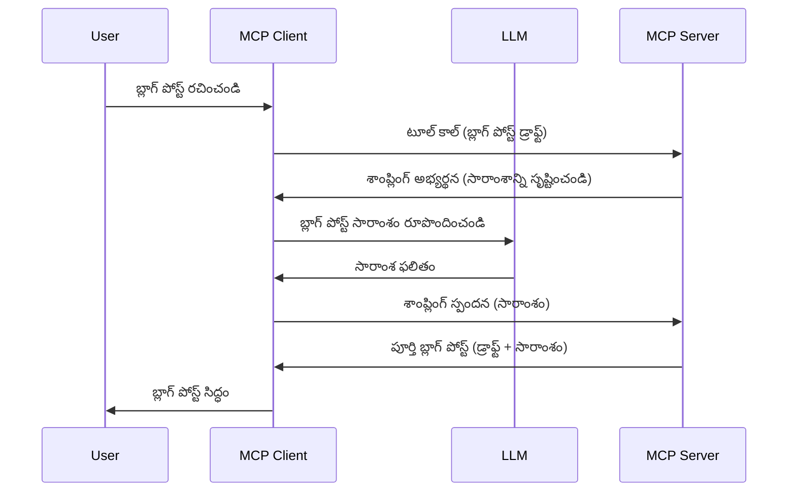

# సరఫరా - క్లయింట్‌కి ఫీచర్లను ప్రతినిధ్యం వహించడం

సమయానికి, మీరు MCP క్లయింట్ మరియు MCP సర్వర్ ఒక సాధారణ లక్ష్యం సాధించడానికి కలిసి పనిచేయాలి. సర్వర్‌కు క్లయింట్‌పైనున్న LLM సహాయం అవసరమయ్యే పరిస్థితి ఉండొచ్చని ఊహించండి. ఇలాంటి సందర్భంలో, సరఫరా (Sampling) మీరు ఉపయోగించవలసినది.

సరఫరా సంబంధించిన కొన్ని వినియోగ సందర్భాలు మరియు దీన్ని ఎలా నిర్మించుకోవాలో చూద్దాం.

## సమీక్ష

ఈ పాఠంలో, సరఫరా ఎప్పుడు మరియు ఎక్కడ ఉపయోగించాలో, దాన్ని ఎలా కాపాడుకోవాలో వివరించడమే లక్ష్యంగా ఉన్నాయి.

## అభ్యాస లక్ష్యాలు

ఈ అధ్యాయంలో, మేము:

- సరఫరా అంటే ఏమిటి, మరియు అది ఎప్పుడు ఉపయోగించాలో వివరించబోతున్నాము.
- MCPలో సరఫరా ఎలా అమర్చాలో చూపిస్తాము.
- సరఫరా ఎలా పని చేస్తుందో ఉదాహరణలతో చూపిస్తాము.

## సరఫరా అంటే ఏమిటి మరియు దానిని ఎందుకు ఉపయోగించాలి?

సరఫరా ఒక అభివృద్ధి చెందిన ఫీచర్, ఇది ఈ విధంగా పనిచేస్తుంది:


### సరఫరా అభ్యర్థన

చాలా ఎత్తుగల దృశ్యాన్ని ఇప్పుడు మనముంచుకున్నాం, ఇప్పుడు సర్వర్ క్లయింట్‌కు పంపే సరఫరా అభ్యర్థన గురించి మాట్లాడుదాము. JSON-RPC ఫార్మాట్‌లో ఈ అభ్యర్థన ఈ విధంగా ఉండొచ్చు:

```json
{
  "jsonrpc": "2.0",
  "id": 1,
  "method": "sampling/createMessage",
  "params": {
    "messages": [
      {
        "role": "user",
        "content": {
          "type": "text",
          "text": "Create a blog post summary of the following blog post: <BLOG POST>"
        }
      }
    ],
    "modelPreferences": {
      "hints": [
        {
          "name": "claude-3-sonnet"
        }
      ],
      "intelligencePriority": 0.8,
      "speedPriority": 0.5
    },
    "systemPrompt": "You are a helpful assistant.",
    "maxTokens": 100
  }
}
```

ఇక్కడ కొన్ని ముఖ్యమైన అంశాలు:

- కంటెంట్ -> టెక్స్ట్ కింద ఉన్న Prompt, మన LLMకి బ్లాగ్ పోస్టు కంటెంట్ సారాంశం ఇవ్వమనీ సూచనగా ఉంటుంది.

- **modelPreferences**. ఇది LLMతో ఏ కాన్ఫిగరేషన్ ఉపయోగించాలో సూచించే అభిరుచి మాత్రమే. వినియోగదారు ఈ సిఫార్సులను అనుసరించడం లేదా మార్చుకోవడం తన అధికారం. ఇక్కడ మోడల్ ఉపయోగింపు, వేగం మరియు బుద్ధిమత్త ప్రాధాన్యతల సూచనలు ఉంటాయి.
- **systemPrompt**, ఇది మీ సాధారణ సిస్టమ్ ప్రాంప్ట్, ఇది మీ LLMకి వ్యక్తిత్వాన్ని ఇస్తుంది మరియు మార్గదర్శకాల సూచనలు కలిగి ఉంటుంది.
- **maxTokens**, ఈ ఆస్తి ఎన్ని టోకెన్లు ఉపయోగించాలని సూచిస్తోంది.

### సరఫరా స్పందన

ఈ స్పందన MCP క్లయింట్ చివరికి MCP సర్వర్‌కు తిరిగి పంపేది, ఇది క్లయింట్ LLMను పిలిచి స్పందన కోసం వేచి, ఆ సందేశాన్ని రూపొందించాక రిటర్న్ చేయబడుతుంది. JSON-RPCలో ఇలా ఉండొచ్చు:

```json
{
  "jsonrpc": "2.0",
  "id": 1,
  "result": {
    "role": "assistant",
    "content": {
      "type": "text",
      "text": "Here's your abstract <ABSTRACT>"
    },
    "model": "gpt-5",
    "stopReason": "endTurn"
  }
}
```

ఎలా స్పందన బ్లాగ్ పోస్టు సారాంశం లాంటిదిగా ఉందో గమనించండి. మర్చిపోకండి, ఉపయోగించిన `model` మనం కోరుకున్నది కాదు, కానీ "gpt-5"ని "claude-3-sonnet" పైన వాడింది. ఇది వినియోగదారు తన నిర్ణయం మార్చుకునేందుకు అవకాశం ఉందనే చూపించడమే, మీ సరఫరా అభ్యర్థన అనేది కేవలం సిఫార్సు మాత్రమే.

ఇప్పటికే ప్రధాన ప్రవాహం అర్థమైతే, దీనిని ఉపయోగించి "బ్లాగ్ పోస్ట్ సృష్టి + సారాంశం" పనిచేయించి చూడవచ్చు.

### సందేశ రకాలుగా

సరఫరా సందేశాలు కేవలం టెక్స్ట్‌తో పరిమితం కాదు, మీరు చిత్రాలు మరియు ఆడియో కూడా పంపవచ్చు. JSON-RPC లో ఇది ఇలా కనిపిస్తుంది:

**టెక్స్ట్**

```json
{
  "type": "text",
  "text": "The message content"
}
```

**చిత్ర కంటెంట్**

```json
{
  "type": "image",
  "data": "base64-encoded-image-data",
  "mimeType": "image/jpeg"
}
```

**ఆడియో కంటెంట్**

```json
{
  "type": "audio",
  "data": "base64-encoded-audio-data",
  "mimeType": "audio/wav"
}
```

> NOTE: సరఫరాపై మరిన్ని వివరాలకు [అధికార డాక్యుమెంటేషన్](https://modelcontextprotocol.io/specification/2025-06-18/client/sampling) చూడండి

## క్లయింట్‌లో సరఫరా ఎలా అమర్చాలి

> గమనిక: మీరు కేవలం సర్వర్ నిర్మిస్తుంటే, ఇక్కడ అంత ఎక్కువ చేయాల్సిన అవసరం లేదు.

క్లయింట్లో, ఈ క్రింద చూపినట్లు అవసరమైన ఫీచర్లను స్పెసిఫై చేయాలి:

```json
{
  "capabilities": {
    "sampling": {}
  }
}
```

చదివిన క్లయింట్ సర్వర్‌తో ప్రారంభించేటప్పుడు ఇది ఎక్కించబడుతుంది.

## సరఫరా ఉదాహరణ - బ్లాగ్ పోస్ట్ సృష్టి

మనం సరఫరా సర్వర్ కోడ్ వ్రాసేద్దాం, కింది పనులు చేయాలి:

1. సర్వర్‌పై ఒక టూల్ సృష్టించండి.
1. ఆ టూల్ సరఫరా అభ్యర్థనను సృష్టించాలి.
1. క్లయింట్ సరఫరా అభ్యర్థనకు సమాధానం వచ్చే వరకు వేచిఉండాలి.
1. ఆ తర్వాత టూల్ ఫలితాన్ని ఉత్పత్తి చేయాలి.

కొండలుగా కోడ్ చూద్దాం:

### -1- టూల్ సృష్టించండి

**python**

```python
@mcp.tool()
async def create_blog(title: str, content: str, ctx: Context[ServerSession, None]) -> str:
    """Create a blog post and generate a summary"""

```

### -2- సరఫరా అభ్యర్థన సృష్టించండి

మీ టూల్‌లో ఈ క్రింది కోడ్ చేర్చండి:

**python**

```python
post = BlogPost(
        id=len(posts) + 1,
        title=title,
        content=content,
        abstract=""
    )

prompt = f"Create an abstract of the following blog post: title: {title} and draft: {content} "

result = await ctx.session.create_message(
        messages=[
            SamplingMessage(
                role="user",
                content=TextContent(type="text", text=prompt),
            )
        ],
        max_tokens=100,
)

```

### -3- స్పందన కోసం వేచి, స్పందన తిరిగి ఇవ్వండి

**python**

```python
post.abstract = result.content.text

posts.append(post)

# పూర్తి ఉత్పత్తిని తిరిగి ఇవ్వండి
return json.dumps({
    "id": post.title,
    "abstract": post.abstract
})
```

### -4- పూర్తి కోడ్

**python**

```python
from starlette.applications import Starlette
from starlette.routing import Mount, Host

from mcp.server.fastmcp import Context, FastMCP

from mcp.server.session import ServerSession
from mcp.types import SamplingMessage, TextContent

import json


from uuid import uuid4
from typing import List
from pydantic import BaseModel


mcp = FastMCP("Blog post generator")

# app = FastAPI()

posts = []

class BlogPost(BaseModel):
    id: int
    title: str
    content: str
    abstract: str

posts: List[BlogPost] = []

@mcp.tool()
async def create_blog(title: str, content: str, ctx: Context[ServerSession, None]) -> str:
    """Create a blog post and generate a summary"""

    post = BlogPost(
        id=len(posts) + 1,
        title=title,
        content=content,
        abstract=""
    )

    prompt = f"Create an abstract of the following blog post: title: {title} and draft: {content} "

    result = await ctx.session.create_message(
        messages=[
            SamplingMessage(
                role="user",
                content=TextContent(type="text", text=prompt),
            )
        ],
        max_tokens=100,
    )

    post.abstract = result.content.text

    posts.append(post)

    # పూర్తి బ్లాగ్ పోస్ట్‌ను తిరిగి ఇవ్వండి
    return json.dumps({
        "id": post.title,
        "abstract": post.abstract
    })

if __name__ == "__main__":
    print("Starting server...")
    # mcp.run()
    mcp.run(transport="streamable-http")

# ఆప్‌ను రన్ చేయండి: python server.py
```

### -5- Visual Studio Codeలో పరీక్షించడం

Visual Studio Codeలో దీన్నివిధంగా పరీక్షించండి:

1. టెర్మినల్లో సర్వర్ ప్రారంభించండి
1. *mcp.json* లో అదనంగా జోడించండి (మరియు ఇది ప్రారంభం అయి ఉన్నదని నిర్ధారించండి), ఉదా:

   ```json
   "servers": {
      "blog-server": {
        "type": "http",
        "url": "http://localhost:8000/mcp"
      }
   }
   ```

1. ఒక ప్రాంప్ట్ టైప్ చేయండి:

   ```text
   create a blog post named "Where Python comes from", the content is "Python is actually named after Monty Python Flying Circus"
   ```

1. సరఫరా జరిగేందుకు అనుమతించండి. మొదటిసారిగా పరీక్షిస్తుంటే అదనపు డైలాగ్ చూపబడుతుంది, దాన్ని ఆమోదించాలి, తర్వాత సాధారణ డైలాగ్ వస్తుంది, ఇందులో మీరు టూల్ నడుపమని అడుగుతారు.

1. ఫలితాలను తపశీలించండి. ఫలితాలు GitHub Copilot Chatలో బాగా చూపబడతాయి, అలాగే రా JSON స్పందనను కూడా చూడవచ్చు.

**బోనస్**. Visual Studio Code టూలింగ్ సరఫరాకు మంచి మద్దతు ఇస్తుంది. మీరు ఇన్‌స్టాల్ చేసిన సర్వర్‌పై సరఫరా యాక్సెస్‌ను ఈ విధంగా అమర్చవచ్చు:

1. ఎక్స్‌టెన్షన్ విభాగానికి వెళ్లండి.
1. "MCP SERVERS - INSTALLED" విభాగంలో మీ ఇన్‌స్టాల్ సర్వర్ కోసం కాగ్ చిహ్నాన్ని ఎంచుకోండి.
1. "Configure Model Access" ఎంపికను ఎంచుకోండి, ఇక్కడ GitHub Copilot సరఫరా సమయంలో ఉపయోగించగల మోడల్స్‌ను ఎంచుకోవచ్చు. "Show Sampling requests" ద్వారా ఇటీవల జరిగిన సరఫరా అభ్యర్థనలను కూడా చూడవచ్చు.

## అసైన్‌మెంట్

ఈ అసైన్‌మెంట్లో, మీరు కొంచెం వేరుగా సరఫరా నిర్మించాల్సి ఉంటుంది, అది ఉత్పత్తి వివరణ తయారీకి మద్దతు ఇస్తుంది. స్థితి ఈ విధంగా ఉంది:

**స్థితి**: ఈ-కామర్స్‌లో బ్యాక్ ఆఫీస్ సిబ్బంది ఉత్పత్తి వివరణలు తయారుచేయడానికి ఎక్కువ సమయం పడిస్తోంది. అందుచేత, మీరు "create_product" అనే టూల్‌ని "title" మరియు "keywords".argumentsతో పిలిచి పూర్తి ఉత్పత్తి, క్లయింట్ LLM ద్వారా నింపబోయే "description" ఫీల్డ్‌తో రూపొందించాలి.

TIP: కూర్చున్న పాఠాలు ఉపయోగించి ఈ సర్వర్ మరియు టూల్‌ను సరఫరా అభ్యర్థన ద్వారా నిర్మించండి.

## పరిష్కారం

[పరిష్కారం](./solution/README.md)

## ముఖ్యమైన పాఠాలు

సరఫరా ఒక శక్తివంతమైన ఫీచర్, ఇది సర్వర్ LLM సహాయం కావలనప్పుడు పని క్లయింట్‌కు అప్పగించడానికి అనుమతిస్తుంది.

## తదుపరి ఏమి ఉన్నది

- [అధ్యాయం 4 - ప్రాక్టికల్ అమలు](../../04-PracticalImplementation/README.md)

---

<!-- CO-OP TRANSLATOR DISCLAIMER START -->
**హేతుబద్ధతా నివేదిక**:
ఈ పత్రం AI అనువాద సేవ [Co-op Translator](https://github.com/Azure/co-op-translator) ఉపయోగించి అనువదించబడింది. మేము నిరంతరం ఖచ్చితత్వానికి ప్రయత్నిస్తున్నప్పటికీ, ఆటోమేటెడ్ అనువాదాలలో లోపాలు లేదా అసమితులు ఉండవచ్చును. ప్రాథమిక పత్రం దాని స్వదేశీ భాషలో ఉన్నదానినే అధికారిక మూలంగా పరిగణించాలి. ముఖ్యమైన సమాచారానికి, నైపుణ్యత కలిగిన మానవ అనువాద సేవలు అవసరం. ఈ అనువాదం వాడుక ద్వారా రాకున్న ఏమైనా తప్పుదారులు లేదా పొరపాట్లకు మేము బాధ్యత వహించమం.
<!-- CO-OP TRANSLATOR DISCLAIMER END -->