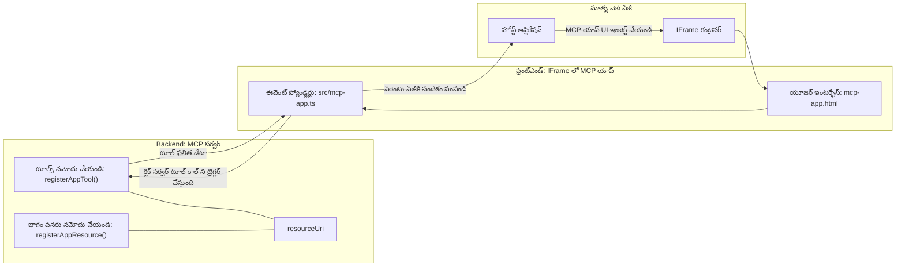

# MCP Apps

MCP Apps అనేది MCPలో కొత్త దృష్టికోణం. ఆలోచన ఏమిటంటే, మీరు టూల్ కాల్ నుండి డేటాతో పాటు, ఈ సమాచారం ఎలా పరస్పర సంబంధం కలిగి ఉండాలో సమాచారాన్ని కూడా అందిస్తారు. అంటే టూల్ ఫలితాలు ఇప్పుడు UI సమాచారాన్ని కలిగి ఉండవచ్చు. ఇది మనకి ఎందుకు కావాలి? బాగుందీ, మీరు నేడు ఎలా పని చేస్తున్నారో పరిగణనలోకి తీసుకుందాం. మీరు ఎక్కువగా MCP Server ఫలితాలను ఎలా వాడుతున్నారు అంటే దాని ముందు ఏదైనా ఫ్రంట్ ఎండ్ ఉంచి మీకు కోడ్ వ్రాయాలి, నిర్వహించాలి. కొన్ని సార్లు అది కావాలి, కానీ కొన్ని సార్లు మీరు సొంతంగా డేటా నుండి ఉపయోగకర్త ఇంటర్‌ఫేస్ వరకు అన్ని అంశాలు కలిగిన ఒక స్వీయ-సంపూర్ణ సమాచార ముక్కను తీసుకురావడం బాగుండేదని భావిస్తే తప్పుగా ఉండదనిపిస్తుంది.

## అవలోకనం

ఈ పాఠం MCP Apps గురించి ప్రాక్టికల్ మార్గదర్శకాన్ని అందిస్తుంది, దాని ప్రారంభానికి మరియు మీ ఉన్న వెబ్ అనువర్తనాలలో దాన్ని ఎలా సమీకరించాలో చూపిస్తుంది. MCP Apps MCP స్టాండర్డ్ లో ఒక కొత్త చేర్పు.

## నేర్చుకోవాల్సిన లక్ష్యాలు

ఈ పాఠం ముగింపు వరకు, మీరు చేయగలరు:

- MCP Apps ఏమిటి అవగాహన చెయ్యండి.
- ఎప్పుడు MCP Apps ఉపయోగించాలో తెలుసుకోండి.
- మీ స్వంత MCP Apps ను నిర్మించి సమీకరించండి.

## MCP Apps - ఇది ఎలా పనిచేస్తుంది

MCP Apps యొక్క ఆలోచన అనేది ప్రధానంగా ఒక భాగంగా ఉన్న స్పందనను అందించడం. అలాంటి భాగం both visuals మరియు ఇంటరాక్టివిటీ కలిగి ఉండవచ్చు, ఉదా: బటన్ క్లిక్స్, ఉపయోగకర్త ఇన్‌పుట్ మరియు మరిన్ని. ప్రారంభం చేద్దాం సర్వర్ వైపు మరియు మన MCP Server తో. MCP App భాగాన్ని సృష్టించడానికి మీరు ఒక టూల్ సృష్టించాలి కానీ అప్లికేషన్ రిసోర్స్ కూడా అవసరం. ఈ రెండు భాగాలు resourceUri ద్వారా కనెక్ట్ అవుతాయి.

ఇది ఒక ఉదాహరణ. అసలు ఏ భాగం ఏ పనిని చేస్తుందో దాన్ని కళ్ళముందు చేసుకోండి:

```text
server.ts -- responsible for registering tools and the component as a UI component
src/
  mcp-app.ts -- wiring up event handlers
mcp-app.html -- the user interface
```

ఈ దృశ్యం కాంపోనెంట్ సృష్టికి ఆర్కిటెక్చర్ మరియు దాని లాజిక్ ను వివరిస్తుంది.


పిశ్చాత్తాపం మరియు ఫ్రంట్ ఎండ్ బాధ్యతలను తరువాత వివరించుకుందాం.

### బ్యాక్‌ఎండ్

ఇక్కడ రెండు పనులు మీరు చేయాలి:

- మనం పరస్పర చర్య చేయదలచుకున్న టూల్స్ ను రిజిస్టర్ చేయడం.
- భాగాన్ని నిర్వచించడం.

**టూల్ లను రిజిస్టర్ చేయడం**

```typescript
registerAppTool(
    server,
    "get-time",
    {
      title: "Get Time",
      description: "Returns the current server time.",
      inputSchema: {},
      _meta: { ui: { resourceUri } }, // ఈ సాధనాన్ని దాని UI వనరు కు లింక్ చేస్తుంది
    },
    async () => {
      const time = new Date().toISOString();
      return { content: [{ type: "text", text: time }] };
    },
  );

```

పైన ఉన్న కోడ్ ప్రవర్తనను వివరిస్తుంది, ఇది `get-time` అనే టూల్ ను బయటపెడుతుంది. ఇది ఎలాంటి ఇన్‌పుట్ తీసుకోదు కానీ ప్రస్తుత సమయాన్ని ఉత్పత్తి చేస్తుంది. మనకు అవసరం ఉన్నప్పుడు `inputSchema` ని టూల్స్ కొరకు నిర్వచించవచ్చు, ఇది ఉపయోగకర్త ఇన్‌పుట్ అందుకోవడానికి అవసరం.

**భాగాన్ని రిజిస్టర్ చేయడం**

అటువంటి అదే ఫైల్ లో, భాగాన్ని కూడా రిజిస్టర్ చేయాలి:

```typescript
const resourceUri = "ui://get-time/mcp-app.html";

// UI కోసం బండిల్ చేసిన HTML/జావాస్క్రిప్ట్ ను రిటర్న్ చేసే రిసోర్స్ ని రిజిస్టర్ చేయండి.
registerAppResource(
  server,
  resourceUri,
  resourceUri,
  { mimeType: RESOURCE_MIME_TYPE },
  async () => {
    const html = await fs.readFile(path.join(DIST_DIR, "mcp-app.html"), "utf-8");

    return {
    contents: [
        { uri: resourceUri, mimeType: RESOURCE_MIME_TYPE, text: html },
    ],
    };
  },
);
```

ఇక్కడ మేము `resourceUri` ను చెప్పి భాగాన్ని దాని టూల్స్‌కు కనెక్ట్ చేస్తున్నాము గమనించండి. ఆసక్తికరమైనది కూడా కallback, ఇక్కడ మేము UI ఫైల్ ను లోడ్ చేసి భాగాన్ని రిటర్న్ చేస్తాము.

### భాగం ఫ్రంట్ ఎండ్

బ్యాక్‌ఎండ్ లాగా, ఇక్కడ రెండు భాగాలు ఉన్నాయి:

- స్వచ్ఛమైన HTMLలో వ్రాయబడిన ఫ్రంట్ ఎండ్.
- ఈవెంట్లు మరియు యేమి చేయాలో హ్యాండిల్ చేసే కోడ్, ఉదా: టూల్స్ ను కాల్ చేయడం లేదా పేరెంటు విండోకు మెసేజ్ ల పంపడం.

**వినియోగదారు ఇంటర్‌ఫేస్**

వినియోగదారు ఇంటర్‌ఫేస్ ను చూద్దాం.

```html
<!-- mcp-app.html -->
<!DOCTYPE html>
<html lang="en">
  <head>
    <meta charset="UTF-8" />
    <title>Get Time App</title>
  </head>
  <body>
    <p>
      <strong>Server Time:</strong> <code id="server-time">Loading...</code>
    </p>
    <button id="get-time-btn">Get Server Time</button>
    <script type="module" src="/src/mcp-app.ts"></script>
  </body>
</html>
```

**ఈవెంట్ వైరు-అప్**

చివరి భాగం ఈవెంట్ వైరు-అప్. అంటే మన UIలో ఏ భాగానికి ఈవెంట్ హ్యాండ్లర్లు కావాలనే గుర్తించి, ఈవెంట్లు వచ్చినప్పుడు ఏం చేయాలో నిర్ణయించడం:

```typescript
// mcp-app.ts

import { App } from "@modelcontextprotocol/ext-apps";

// ఎలిమెంట్ సూచనలను పొందండి
const serverTimeEl = document.getElementById("server-time")!;
const getTimeBtn = document.getElementById("get-time-btn")!;

// యాప్ ఉదాహరణను సృష్టించండి
const app = new App({ name: "Get Time App", version: "1.0.0" });

// సర్వర్ నుండి టూల్ ఫలితాలను నిర్వహించండి. తొలగిన ఆరంభ టూల్ ఫలితాన్ని తప్పించుకోవడానికి `app.connect()` ముందు సెట్ చేయండి
// ప్రారంభ టూల్ ఫలితం లేనివ్వకూడదు.
app.ontoolresult = (result) => {
  const time = result.content?.find((c) => c.type === "text")?.text;
  serverTimeEl.textContent = time ?? "[ERROR]";
};

// బటన్ క్లిక్‌కు వైరు కనెక్ట్ చేయండి
getTimeBtn.addEventListener("click", async () => {
  // `app.callServerTool()` UI-కి సర్వర్ నుండి తాజా డేటాను అభ్యర్థించడానికి అనుమతిస్తుంది
  const result = await app.callServerTool({ name: "get-time", arguments: {} });
  const time = result.content?.find((c) => c.type === "text")?.text;
  serverTimeEl.textContent = time ?? "[ERROR]";
});

// హోస్ట్‌కు కనెక్ట్ చేయండి
app.connect();
```

పై కోడ్ నుండి మీరు చూస్తున్నట్లు, ఇది DOM ఎలిమెంట్లను ఈవెంట్లతో హుక్ చేయడం కోసం సాధారణ కోడ్. ముఖ్యంగా `callServerTool` ను పిలవడం, ఇది బ్యాక్‌ఎండ్ పై టూల్ ను పిలుస్తుంది.

## ఉపయోగకర్త ఇన్‌పుట్ తో వ్యవహరించడం

ఇప్పటివరకు, మనకు ఒక బటన్ ఉన్న భాగం ఉంది, అది క్లిక్ అయినప్పుడు టూల్ ని పిలుస్తుంది. మరిన్ని UI అంశాలతో పని చెయ్యలేమా చూడదాం, ఉదా: ఇన్‌పుట్ ఫీల్డ్ మరియు టూల్కు ఆర్గ్యుమెంట్స్ పంపడం. ఒక FAQ ఫంక్షనాలిటీ ని అమలు చేద్దాం. ఇది ఇలా పని చేయాలి:

- ఒక బటన్ మరియు ఒక ఇన్‌పుట్ ఎలిమెంట్ ఉండాలి, ఇందులో ఉపయోగకర్త "Shipping" అనే కీవర్డ్ కోసం శోధించేందుకు టైప్ చేస్తుంది. ఇది బ్యాక్‌ఎండ్ లోని FAQ డేటాలో శోధన చేసే టూల్ ను పిలుస్తుంది.
- నిచ్చెన FAQ శోధనకు మద్దతు ఇచ్చే టూల్.

ముందుగా బ్యాక్‌ఎండ్ కు అవసరమైన మద్దతు చేర్పుదాం:

```typescript
const faq: { [key: string]: string } = {
    "shipping": "Our standard shipping time is 3-5 business days.",
    "return policy": "You can return any item within 30 days of purchase.",
    "warranty": "All products come with a 1-year warranty covering manufacturing defects.",
  }

registerAppTool(
    server,
    "get-faq",
    {
      title: "Search FAQ",
      description: "Searches the FAQ for relevant answers.",
      inputSchema: zod.object({
        query: zod.string().default("shipping"),
      }),
      _meta: { ui: { resourceUri: faqResourceUri } }, // ఈ టూల్ ను దాని UI వనరుతో లింక్ చేస్తుంది
    },
    async ({ query }) => {
      const answer: string = faq[query.toLowerCase()] || "Sorry, I don't have an answer for that.";
      return { content: [{ type: "text", text: answer }] };
    },
  );
```

ఇక్కడ మనం చూసేది `inputSchema` ని ఎలా నింపారో మరియు దానికి `zod` స్కీమా ఇస్తున్నాము:

```typescript
inputSchema: zod.object({
  query: zod.string().default("shipping"),
})
```

పై స్కీమాలో మనం `query` అనే ఇన్‌పుట్ పరిమాణం ఉంది అని ప్రకటిస్తున్నాము మరియు ఇది ఐచ్ఛికం అని, డిఫాల్ట్ విలువు "shipping" ఉంది.

బాగుంది, ఇప్పుడు *mcp-app.html* కి వెళ్లి మనం ఏ UI సృష్టించాలో చూద్దాం:

```html
<div class="faq">
    <h1>FAQ response</h1>
    <p>FAQ Response: <code id="faq-response">Loading...</code></p>
    <input type="text" id="faq-query" placeholder="Enter FAQ query" />
    <button id="get-faq-btn">Get FAQ Response</button>
  </div>
```

చాలా బాగుంది, ఇప్పుడు మనకి ఇన్‌పుట్ ఎలిమెంట్ మరియు బటన్ ఉన్నాయి. తరువాత *mcp-app.ts* కి వెళ్ళి ఈ ఈవెంట్స్ ను వైర్ అప్ చేద్దాం:

```typescript
const getFaqBtn = document.getElementById("get-faq-btn")!;
const faqQueryInput = document.getElementById("faq-query") as HTMLInputElement;

getFaqBtn.addEventListener("click", async () => {
  const query = faqQueryInput.value;
  const result = await app.callServerTool({ name: "get-faq", arguments: { query } });
  const faq = result.content?.find((c) => c.type === "text")?.text;
  faqResponseEl.textContent = faq ?? "[ERROR]";
});
```

పై కోడ్ లో మనం:

- ఇంటరాక్టివ్ UI ఎలిమెంట్స్ కు రిఫరెన్సులు సృష్టించాము.
- బటన్ క్లిక్ నిర్వహణ కోసం ఇన్‌పుట్ ఎలిమెంట్ విలువను పార్స్ చేసి, `app.callServerTool()` ని `name` మరియు `arguments` తో పిలిచాము, ఇక్కడ `arguments` లో `query` విలువ పంపబడుతుంది.

వాస్తవానికి `callServerTool` పిలిచినప్పుడు ఏమ జరుగుతుందంటే, అది పేరెంటు విండోకు సందేశం పంపుతుంది మరియు ఆ విండో MCP Server ను పిలుస్తుంది.

### ప్రయత్నించండి

ఇది ప్రయత్నిస్తే, మనం ఇప్పుడు క్రింది దృశ్యాలను చూడగలము:


మరియు ఇక్కడ "warranty" వంటి ఇన్‌పుట్ తో పరీక్ష చేస్తున్నాము


ఈ కోడ్ నడిపించడానికి, [Code section](./code/README.md) కి వెళ్లండి

## Visual Studio Code లో టెస్టింగ్

Visual Studio Code కి MCP Apps కి తగిన మంచి మద్దతు ఉంది మరియు మీ MCP Apps ని టెస్ట్ చేయడానికి చాలా సులభమైన మార్గాలలో ఒకటి గా భావించవచ్చు. Visual Studio Code ఉపయోగించడానికి, *mcp.json* లో సర్వర్ ఎంట్రీని ఇలాగే జోడించండి:

```json
"my-mcp-server-7178eca7": {
    "url": "http://localhost:3001/mcp",
    "type": "http"
  }
```

తర్వాత సర్వర్ ప్రారంభించండి, GitHub Copilot ఇన్‌స్టాల్ చేసినట్లయితే, మీరు చాట్ విండో ద్వారా మీ MCP App తో కమ్యూనికేట్ చేయగలుగుతారు.

దీనిని ప్రాంప్ట్ ద్వారా ట్రిగ్గర్ చేయవచ్చు, ఉదా "#get-faq":


మరియు మీరు వెబ్ బ్రౌజర్ లో నడిపించినట్టు, ఇది ఇలా అదే విధంగా రేండర్ అవుతుంది:


## అసైన్మెంట్

ఒక రాక్ పెపర్ సిజర్ గేమ్ సృష్టించండి. ఇందులో ఈ క్రింది అంశాలు ఉండాలి:

UI:

- ఎంపికలతో కూడిన డ్రాప్ డౌన్ లిస్ట్
- ఎంపికను సమర్పించడానికి ఒక బటన్
- ఎవరు ఏమి ఎంచుకున్నారు మరియు ఎవరు గెలిచారో చూపించే లేబుల్

సర్వర్:

- "choice" అనే ఇన్‌పుట్ తీసుకునే రాక్ పెపర్ సిజర్ టూల్ ఉండాలి. ఇది కంప్యూటర్ ఎంపికను కూడా చూపించాలి మరియు గెలుపొందిన వారిని నిర్ణయించాలి

## పరిష్కారం

[Solution](./assignment/README.md)

## సారాంశం

మనం ఈ కొత్త MCP Apps అనే దృష్టికోణం గురించి నేర్చుకున్నాం. ఇది MCP Servers కి కేవలం డేటా మాత్రమే కాదు, ఈ డేటా ఎలా ప్రదర్శించబడాలో కూడా అభిప్రాయం కలిగి ఉండేందుకు అనుమతించే కొత్త దృష్టికోణం.

అదనంగా, మనం తెలిసుకున్నాం, ఈ MCP Apps లు ఒక IFrame లో హోస్ట్ అవుతాయి మరియు MCP Servers తో కమ్యూనికేట్ చేయడానికి వారు పేరెంటు వెబ్ యాప్ కి సందేశాలు పంపాల్సి ఉంటుంది. శుభ్రమైన JavaScript మరియు React లాంటి అనేక లైబ్రరీలు ఈ కమ్యూనికేషన్ ను సులభతరం చేస్తాయి.

## ముఖ్యాంశాలు

మీరు నేర్చుకున్న విషయాలు:

- MCP Apps ఒక కొత్త స్టాండర్డ్, ఇది డేటా మరియు UI ఫీచర్లను రెండింటినీ ప్యాకేజీ చేయడానికి ఉపయోగపడుతుంది.
- భద్రతా కారణాల వలన ఈ రకమైన యాప్స్ IFrame లో నడుస్తుంటాయి.

## తదుపరి ఏమిటి

- [Chapter 4](../../04-PracticalImplementation/README.md)

---

<!-- CO-OP TRANSLATOR DISCLAIMER START -->
**అస్పష్టత**:
ఈ పత్రం AI అనువాద సేవ [Co-op Translator](https://github.com/Azure/co-op-translator) ఉపయోగించి అనువదించబడింది. మనం ఖచ్చితత్వాన్ని లక్ష్యంగా పెట్టుకున్నప్పటికీ, ఆటోమేటెడ్ అనువాదాల్లో తప్పులు లేదా అసత్యతలు ఉండగలవని దయచేసి గమనించండి. స్థానిక భాషలో ఉన్న అసలు పత్రం అధికారిక మూలంగా పరిగణించబడాలి. ముఖ్యమైన సమాచారానికి, ప్రొఫెషనల్ మానవ అనువాదం సిఫారసు చేయబడుతుంది. ఈ అనువాదం వాడకం వల్ల వచ్చే ఏవైనా తప్పుదారులు లేదా తప్పుగా అర్థం చేసుకోవడాల కోసం మేము బాధ్యత వహించము.
<!-- CO-OP TRANSLATOR DISCLAIMER END -->