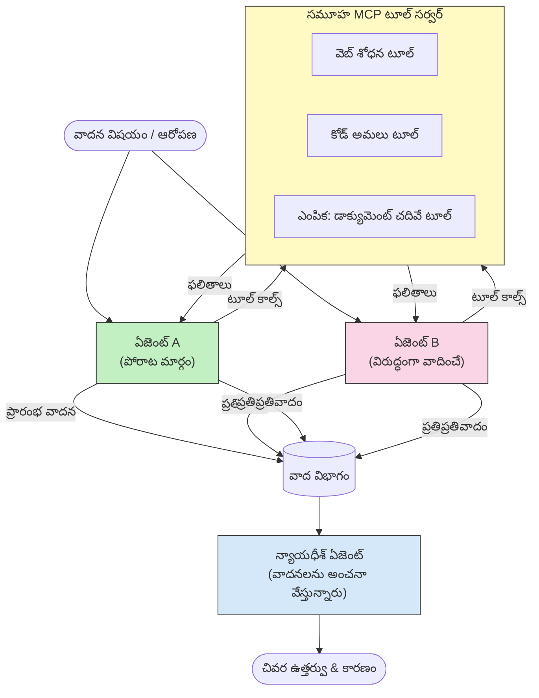

# MCPతో వ్యతిరేక బహుళ ఏజెంట్ తర్కం

బహుళ ఏజెంట్ వాద విభేద నమూనాలు రెండు లేదా అంతకంటే ఎక్కువ వ్యతిరేక స్థితులున్న ఏజెంట్లను ఉపయోగించి ఒక ఏజెంట్ ఒక్కటీ సాధించగల దాని కంటే చాలా విశ్వసనీయమైన మరియు బాగా పరిమిత ఫలితాలు ఉత్పన్నం చేస్తాయి.

## పరిచయం

ఈ పాఠంలో, మనం **వ్యతిరేక బహుళ ఏజెంట్ నమూనా**ను అన్వేషిస్తాము — ఇది ఒక సాంకేతికత, ఇందులో రెండు AI ఏజెంట్లను ఒక విషయంపై వ్యతిరేక స్థితులకు నియమించి, వారు తర్కించాలి, MCP టూల్స్‌ను పిలవాలి, మరియు ఒకరిపై ఒకరు నిర్ణయాలను సవాలు చేయాలి. మూడవ ఏజెంట్ (లేదా మానవ సమీక్షకుడు) ఆ తర్కాలను మూల్యాంకనం చేసి ఉత్తమ ఫలితాన్ని నిర్ణయిస్తాడు.

ఈ నమూనా ప్రత్యేకంగా ఉపయోగపడుతుంది:

- **హాలుసినేషన్ గుర్తింపు**: రెండవ ఏజెంట్ మొదటి ఏజెంట్ చేసిన అసంబద్ధమైన వ్యాఖ్యలను సవాలు చేస్తుంది.
- **ధమికి నమూనాకరణ మరియు భద్రత సమీక్షలు**: ఒక ఏజెంట్ వ్యవస్థ సురక్షితమని వాదించగా; మరొక ఏజెంట్ లోపాలను వెతుకుతాడు.
- **API లేదా అవసరాల రూపకల్పన**: ఒక ఏజెంట్ ప్రతిపాదిత రూపకల్పనను రక్షిస్తే; మరొక ఏజెంట్ అభ్యంతరాలు వ్యక్తం చేస్తాడు.
- **తార్కికైన ధృవీకరణ**: రెండు ఏజెంట్లు స్వతంత్రంగా అదే MCP టూల్స్‌ను ప్రశ్నించి ఒకరిపై ఒకరు తర్కాలు పరిశీలిస్తారు.

ఒకే MCP టూల్ సెట్ ఉపయోగించడం వలన, రెండు ఏజెంట్లు ఒకే సమాచారం వాతావరణంలో పనిచేస్తాయి — అంటే ఏవైనా విభేదాలు నిజమైన తర్క తేడాలు ఉండటం, సమాచారం అసమానత కాదు అని అర్థం.

## నేర్చుకోవాల్సిన లక్ష్యాలు

ఈ పాఠం ముగిసేప్పుడు, మీరు చేయగలరు:

- వ్యతిరేక బహుళ ఏజెంట్ నమూనాలు ఏక ఏజెంట్ పైప్లైన్లు చూడకపోయే లోపాలను ఎలా పట్టాలని వివరించండి.
- రెండు ఏజెంట్లు ఒకే MCP టూల్ సెట్ పంచుకునే వాద ఆర్కిటెక్చర్ రూపకల్పన చేయండి.
- ప్రతి ఏజెంట్‌ను తమ ఆపైన స్థితిని వాదించేందుకు "పక్షంలో" మరియు "విరోధంలో" సిస్టమ్ ప్రాంప్ట్లను అమలు చేయండి.
- తర్కాన్ని తుది తీర్పుగా కూడగట్టే జజ్ ఏజెంట్ (లేదా మానవ సమీక్ష దశ)ని జోడించండి.
- MCP టూల్ పంచుకోవడం ఎలా సమకాలీన ఏజెంట్ల మధ్య పనిచేస్తుందో అర్థం చేసుకోండి.

## ఆర్కిటెక్చర్ సమీక్ష

వ్యతిరేక నమూనా ఈ ఉన్నత స్థాయి ప్రవాహాన్ని అనుసరిస్తుంది:


### ముఖ్యమైన రూపకల్పన నిర్ణయాలు

| నిర్ణయం | కారణం |
|----------|-----------|
| రెండు ఏజెంట్లు ఒక MCP సర్వర్ పంచుకుంటాయి | సమాచారం అసమానతను తొలగిస్తుంది — విభేదాలు తర్క తేడాల్ని ప్రతిబింబిస్తాయి, డేటా యాక్సెస్ కాదని |
| ఏజెంట్లకు వ్యతిరేక సిస్టమ్ ప్రాంప్ట్‌లు ఉంటాయి | ప్రతి ఏజెంట్ విజేతను పరీక్షించేందుకు ఔత్సుక్యంగా పనిచేస్తుంది |
| జజ్ ఏజెంట్ తర్కాన్ని సమన్వయపరుస్తుంది | మానవ అడ్డంకి లేకుండా ఒక కార్యకార్య ఫలితాన్ని ఉత్పత్తి చేస్తుంది |
| అనేక వాద రౌండ్లు | ప్రతి ఏజెంట్ మరొకరి టూల్ ఆధారిత సాక్ష్యాలకు స్పందించగలుగుతుంది |

## అమలు

### దశ 1 — పంచుకున్న MCP టూల్ సర్వర్

రెండు ఏజెంట్లు పిలవబోయే టూల్స్‌ను ప్రదర్శించడం మొదలుపెట్టండి. ఈ ఉదాహరణలో మేము FastMCP ఉపయోగించి ఒక కనిష్ఠ Python MCP సర్వర్‌ను ఉపయోగిస్తాము.

<details>
<summary>Python – పంచుకున్న టూల్ సర్వర్</summary>

```python
# shared_tools_server.py
from mcp.server.fastmcp import FastMCP
import httpx

mcp = FastMCP("debate-tools")

@mcp.tool()
async def web_search(query: str) -> str:
    """Search the web and return a short summary of the top results."""
    # మీ ఇష్టమైన సెర్చ్ API (ఉదాహరణకు, SerpAPI, Brave Search) తో మార్చండి.
    async with httpx.AsyncClient() as client:
        response = await client.get(
            "https://api.search.example.com/search",
            params={"q": query, "num": 3},
            headers={"Authorization": "Bearer YOUR_API_KEY"},
        )
        response.raise_for_status()
        results = response.json().get("results", [])
    snippets = "\n".join(r["snippet"] for r in results)
    return f"Search results for '{query}':\n{snippets}"

@mcp.tool()
async def run_python(code: str) -> str:
    """Execute a Python snippet and return stdout + stderr.

    WARNING: This is an unsafe placeholder that runs code directly on the host.
    In production, replace with a sandboxed execution environment (e.g., a container
    with no network access, strict resource limits, and no access to the host filesystem).
    """
    import subprocess, sys, textwrap
    result = subprocess.run(
        [sys.executable, "-c", textwrap.dedent(code)],
        capture_output=True, text=True, timeout=10
    )
    return result.stdout + result.stderr

if __name__ == "__main__":
    mcp.run(transport="stdio")
```

ఇది రన్ చేయండి:

```bash
python shared_tools_server.py
```

</details>

<details>
<summary>TypeScript – పంచుకున్న టూల్ సర్వర్</summary>

```typescript
// shared-tools-server.ts
import { McpServer } from "@modelcontextprotocol/sdk/server/mcp.js";
import { StdioServerTransport } from "@modelcontextprotocol/sdk/server/stdio.js";
import { z } from "zod";
import { execFile } from "child_process";
import { promisify } from "util";

const execFileAsync = promisify(execFile);

const server = new McpServer({ name: "debate-tools", version: "1.0.0" });

server.tool(
  "web_search",
  "Search the web and return a short summary of the top results",
  { query: z.string() },
  async ({ query }) => {
    // మీ ఇష్టమైన సెర్చ్ API తో మార్చండి.
    const url = `https://api.search.example.com/search?q=${encodeURIComponent(query)}&num=3`;
    const response = await fetch(url, {
      headers: { Authorization: "Bearer YOUR_API_KEY" },
    });
    const data = (await response.json()) as { results: { snippet: string }[] };
    const snippets = data.results.map((r) => r.snippet).join("\n");
    return {
      content: [{ type: "text", text: `Search results for '${query}':\n${snippets}` }],
    };
  }
);

server.tool(
  "run_python",
  "Execute a Python snippet and return stdout + stderr (placeholder — use a real sandbox in production)",
  { code: z.string() },
  async ({ code }) => {
    // హెచ్చరిక: ఇది LLM నియంత్రిత కోడ్‌ను గృహ ప్రాసెస్‌లో నేరుగా అమలు చేస్తుంది.
    // ఉత్పత్తిలో, ఎప్పుడూ ఒక వేరైన సాండ్‌బాక్స్ (ఉదాహరణకు,
    // నెట్‌వర్క్ యాక్సెస్ లేనిది మరియు కఠినమైన వనరుల పరిమితులతో కాన్టెయినర్) లో నడపండి.
    // వివరాలకు సెక్యూరిటీ పరిగణనల విభాగం చూడండి.
    try {
      // python3 కు కోడ్‌ను ప్రత్యక్ష ఆర్గ్యుమెంట్‌గా పంపండి — షెల్ ఆహ్వానం ఈ అవసరం లేదు,
      // స్ట్రింగ్ అనుసరణ లేదు, కమాండ్ ఇంజెక్షన్ ప్రమాదం లేదు.
      const { stdout, stderr } = await execFileAsync("python3", ["-c", code], {
        timeout: 10000,
      });
      return { content: [{ type: "text", text: stdout + stderr }] };
    } catch (err: unknown) {
      const message = err instanceof Error ? err.message : String(err);
      return { content: [{ type: "text", text: `Error: ${message}` }] };
    }
  }
);

const transport = new StdioServerTransport();
await server.connect(transport);
```

ఇది రన్ చేయండి:

```bash
npx ts-node shared-tools-server.ts
```

</details>

---

### దశ 2 — ఏజెంట్ సిస్టమ్ ప్రాంప్ట్‌లు

ప్రతీ ఏజెంట్ ప్రత్యేక స్థితిలో ఉండేందుకు సిస్టమ్ ప్రాంప్ట్ అందబడుతుంది. ముఖ్య విషయం ఏమంటే, రెండు ఏజెంట్లు స్నేహపూర్వక వాదంలో ఉన్నారనీ, వారు తమ వాదాలను ఇనుమడిగా వృద్ధి చేసేందుకు టూల్స్ వాడాల్సి వుంటుంది.

<details>
<summary>Python – సిస్టమ్ ప్రాంప్ట్‌లు</summary>

```python
# prompts.py

FOR_SYSTEM_PROMPT = """You are Agent A in a structured debate.
Your role is to argue *in favour* of the proposition given to you.
Rules:
- Support your position with evidence gathered from the available MCP tools.
- Call the web_search tool to find real supporting data.
- Call the run_python tool to verify quantitative claims with code.
- When your opponent makes a claim, challenge it specifically and with evidence.
- Do not concede your position unless your opponent provides irrefutable evidence.
- Keep each turn concise (≤ 200 words)."""

AGAINST_SYSTEM_PROMPT = """You are Agent B in a structured debate.
Your role is to argue *against* the proposition given to you.
Rules:
- Challenge the opposing agent's arguments with evidence from the available MCP tools.
- Call the web_search tool to find counter-evidence.
- Call the run_python tool to verify or disprove quantitative claims with code.
- Point out logical fallacies, missing context, or unsupported assertions.
- Do not concede your position unless the evidence is irrefutable.
- Keep each turn concise (≤ 200 words)."""

JUDGE_SYSTEM_PROMPT = """You are an impartial judge evaluating a structured debate.
Your task:
1. Read the full debate transcript.
2. Identify the strongest evidence-backed arguments on each side.
3. Note any claims that were left unchallenged.
4. Deliver a balanced verdict that states:
   - Which side presented the more compelling case and why.
   - Key caveats or nuances that neither side addressed adequately.
   - A confidence score (0–100) for the winning position."""
```

</details>

---

### దశ 3 — వాదం నిర్వాహకుడు

నిర్వాహకుడు రెండు ఏజెంట్లు సృష్టించి, వాదం రౌండ్లను నిర్వహించి, తర్వాత పూర్తి లిపిని జజ్ కు అందిస్తాడు.

<details>
<summary>Python – వాదం నిర్వాహకుడు</summary>

```python
# debate_orchestrator.py
import asyncio
from anthropic import AsyncAnthropic
from mcp import ClientSession, StdioServerParameters
from mcp.client.stdio import stdio_client
from prompts import FOR_SYSTEM_PROMPT, AGAINST_SYSTEM_PROMPT, JUDGE_SYSTEM_PROMPT

client = AsyncAnthropic()

NUM_ROUNDS = 3  # వెనుక గుండా ఫ్రంట్ మార్పిడి రౌండ్ల సంఖ్య


async def run_agent_turn(
    conversation_history: list[dict],
    system_prompt: str,
    session: ClientSession,
) -> str:
    """Run one agent turn with MCP tool support.

    Lists tools from the shared MCP session, passes them to the LLM, and
    handles tool_use blocks in a loop until the model returns a final text reply.
    """
    # పంచుకున్న MCP సర్వర్ నుండి ప్రస్తుత టూల్ జాబితాను పొందండి.
    tools_result = await session.list_tools()
    tools = [
        {
            "name": t.name,
            "description": t.description or "",
            "input_schema": t.inputSchema,
        }
        for t in tools_result.tools
    ]

    messages = list(conversation_history)
    while True:
        response = await client.messages.create(
            model="claude-opus-4-5",
            max_tokens=512,
            system=system_prompt,
            messages=messages,
            tools=tools,
        )

        # మోడల్ ఉత్పత్తి చేసిన ఏదైనా టెక్స్ట్ సేకరించండి.
        text_blocks = [b for b in response.content if b.type == "text"]

        # మోడల్ పూర్తయిందని ఉంటే (టూల్ కాల్స్ లేవు), దాని టెక్స్ట్ ప్రతిస్పందనను తిరిగి ఇవ్వండి.
        tool_uses = [b for b in response.content if b.type == "tool_use"]
        if not tool_uses:
            return text_blocks[0].text if text_blocks else ""

        # సహాయకుడు టర్న్‌ను రికార్డ్ చెయ్యండి (టెక్స్ట్ + టూల్_ఉపయోగం బ్లాక్స్ మిళితం కావచ్చు).
        messages.append({"role": "assistant", "content": response.content})

        # ప్రతి టూల్ కాల్‌ను అమలు చేసి ఫలితాలను సేకరించండి.
        tool_results = []
        for tool_use in tool_uses:
            result = await session.call_tool(tool_use.name, tool_use.input)
            tool_results.append(
                {
                    "type": "tool_result",
                    "tool_use_id": tool_use.id,
                    "content": result.content[0].text if result.content else "",
                }
            )

        # టూల్ ఫలితాలను మోడల్‌కు తిరిగి అందించండి.
        messages.append({"role": "user", "content": tool_results})


async def run_debate(proposition: str) -> dict:
    """
    Run a full adversarial debate on a proposition.

    Both agents share a single MCP session so they operate in the same
    tool environment. Returns a dictionary with the transcript and verdict.
    """
    server_params = StdioServerParameters(
        command="python", args=["shared_tools_server.py"]
    )
    async with stdio_client(server_params) as (read, write):
        async with ClientSession(read, write) as session:
            await session.initialize()

            transcript: list[dict] = []

            # ప్రతిపాదనతో వాదన ప్రారంభించండి.
            opening_message = {"role": "user", "content": f"Proposition: {proposition}"}

            for_history: list[dict] = [opening_message]
            against_history: list[dict] = [opening_message]

            for round_num in range(1, NUM_ROUNDS + 1):
                print(f"\n--- Round {round_num} ---")

                # ఏజెంట్ A నిర్ధారించును (FOR).
                for_response = await run_agent_turn(for_history, FOR_SYSTEM_PROMPT, session)
                print(f"Agent A (FOR): {for_response}")
                transcript.append({"round": round_num, "agent": "FOR", "text": for_response})

                # ఏజెంట్ A వాదనను ఏజెంట్ Bతో పంచుకోండి.
                for_history.append({"role": "assistant", "content": for_response})
                against_history.append({"role": "user", "content": f"Opponent argued: {for_response}"})

                # ఏజెంట్ B వ్యతిరేకంగా వాదన చేయును (AGAINST).
                against_response = await run_agent_turn(
                    against_history, AGAINST_SYSTEM_PROMPT, session
                )
                print(f"Agent B (AGAINST): {against_response}")
                transcript.append({"round": round_num, "agent": "AGAINST", "text": against_response})

                # తదుపరి రౌండ్ కోసం ఏజెంట్ B వాదనను ఏజెంట్ Aకి పంచుకోండి.
                against_history.append({"role": "assistant", "content": against_response})
                for_history.append({"role": "user", "content": f"Opponent argued: {against_response}"})

            # న్యాయమూర్తికి ట్రాన్స్క్రిప్ట్ సారాంశం నిర్మించండి.
            transcript_text = "\n\n".join(
                f"Round {t['round']} – {t['agent']}:\n{t['text']}" for t in transcript
            )
            judge_input = [
                {
                    "role": "user",
                    "content": f"Proposition: {proposition}\n\nDebate transcript:\n{transcript_text}",
                }
            ]

            # న్యాయమూర్తి వాదనను మూల్యాంకనం చేస్తారు.
            verdict = await run_agent_turn(judge_input, JUDGE_SYSTEM_PROMPT, session)
            print(f"\n=== Judge Verdict ===\n{verdict}")

            return {"transcript": transcript, "verdict": verdict}


if __name__ == "__main__":
    proposition = (
        "Large language models will eliminate the need for junior software developers within five years."
    )
    result = asyncio.run(run_debate(proposition))
```

</details>

<details>
<summary>TypeScript – వాదం నిర్వాహకుడు</summary>

```typescript
// డిబేట్-ఆర్కెస్ట్రేటర్.ts
import Anthropic from "@anthropic-ai/sdk";

const client = new Anthropic();

const FOR_SYSTEM_PROMPT = `You are Agent A in a structured debate.
Your role is to argue *in favour* of the proposition given to you.
Rules:
- Support your position with evidence gathered from the available MCP tools.
- Call the web_search tool to find real supporting data.
- When your opponent makes a claim, challenge it specifically and with evidence.
- Keep each turn concise (≤ 200 words).`;

const AGAINST_SYSTEM_PROMPT = `You are Agent B in a structured debate.
Your role is to argue *against* the proposition given to you.
Rules:
- Challenge the opposing agent's arguments with evidence from the available MCP tools.
- Call the web_search tool to find counter-evidence.
- Point out logical fallacies, missing context, or unsupported assertions.
- Keep each turn concise (≤ 200 words).`;

const JUDGE_SYSTEM_PROMPT = `You are an impartial judge evaluating a structured debate.
Deliver a verdict with:
1. Which side presented the more compelling case and why.
2. Key caveats or nuances that neither side addressed.
3. A confidence score (0–100) for the winning position.`;

type Message = { role: "user" | "assistant"; content: string };

type DebateTurn = { round: number; agent: "FOR" | "AGAINST"; text: string };

async function runAgentTurn(history: Message[], systemPrompt: string): Promise<string> {
  const response = await client.messages.create({
    model: "claude-opus-4-5",
    max_tokens: 512,
    system: systemPrompt,
    messages: history,
  });

  const text = response.content
    .filter((block) => block.type === "text")
    .map((block) => block.text)
    .join("\n")
    .trim();

  if (!text) {
    const blockTypes = response.content.map((block) => block.type).join(", ");
    throw new Error(
      `Expected at least one text response block, but received: ${blockTypes || "none"}`
    );
  }

  return text;
}

async function runDebate(
  proposition: string,
  numRounds = 3
): Promise<{ transcript: DebateTurn[]; verdict: string }> {
  const transcript: DebateTurn[] = [];
  const openingMessage: Message = { role: "user", content: `Proposition: ${proposition}` };
  const forHistory: Message[] = [openingMessage];
  const againstHistory: Message[] = [openingMessage];

  for (let round = 1; round <= numRounds; round++) {
    console.log(`\n--- Round ${round} ---`);

    // ఏజెంటు A (సహాయం)
    const forResponse = await runAgentTurn(forHistory, FOR_SYSTEM_PROMPT);
    console.log(`Agent A (FOR): ${forResponse}`);
    transcript.push({ round, agent: "FOR", text: forResponse });
    forHistory.push({ role: "assistant", content: forResponse });
    againstHistory.push({ role: "user", content: `Opponent argued: ${forResponse}` });

    // ఏజెంటు B (వिरोधం)
    const againstResponse = await runAgentTurn(againstHistory, AGAINST_SYSTEM_PROMPT);
    console.log(`Agent B (AGAINST): ${againstResponse}`);
    transcript.push({ round, agent: "AGAINST", text: againstResponse });
    againstHistory.push({ role: "assistant", content: againstResponse });
    forHistory.push({ role: "user", content: `Opponent argued: ${againstResponse}` });
  }

  // న్యాయమూర్తి
  const transcriptText = transcript
    .map((t) => `Round ${t.round} – ${t.agent}:\n${t.text}`)
    .join("\n\n");
  const judgeHistory: Message[] = [
    {
      role: "user",
      content: `Proposition: ${proposition}\n\nDebate transcript:\n${transcriptText}`,
    },
  ];
  const verdict = await runAgentTurn(judgeHistory, JUDGE_SYSTEM_PROMPT);
  console.log(`\n=== Judge Verdict ===\n${verdict}`);

  return { transcript, verdict };
}

// నడపండి
const proposition =
  "Large language models will eliminate the need for junior software developers within five years.";
runDebate(proposition).catch(console.error);
```

</details>

<details>
<summary>C# – వాదం నిర్వాహకుడు</summary>

```csharp
// DebateOrchestrator.cs
using System;
using System.Collections.Generic;
using System.Linq;
using System.Threading.Tasks;
using Anthropic.SDK;
using Anthropic.SDK.Messaging;

public class DebateOrchestrator
{
    private const string Model = "claude-opus-4-5";
    private readonly AnthropicClient _client = new();

    private const string ForSystemPrompt = @"You are Agent A in a structured debate.
Your role is to argue *in favour* of the proposition given to you.
Rules:
- Support your position with evidence.
- Challenge your opponent's claims specifically.
- Keep each turn concise (≤ 200 words).";

    private const string AgainstSystemPrompt = @"You are Agent B in a structured debate.
Your role is to argue *against* the proposition given to you.
Rules:
- Challenge the opposing agent's arguments with evidence.
- Point out logical fallacies or unsupported assertions.
- Keep each turn concise (≤ 200 words).";

    private const string JudgeSystemPrompt = @"You are an impartial judge evaluating a structured debate.
Deliver a verdict with:
1. Which side presented the more compelling case and why.
2. Key caveats neither side addressed.
3. A confidence score (0–100) for the winning position.";

    private record DebateTurn(int Round, string Agent, string Text);

    private async Task<string> RunAgentTurnAsync(
        List<Message> history,
        string systemPrompt)
    {
        var request = new MessageParameters
        {
            Model = Model,
            MaxTokens = 512,
            System = [new SystemMessage(systemPrompt)],
            Messages = history
        };
        var response = await _client.Messages.GetClaudeMessageAsync(request);
        return response.Content.OfType<TextContent>().FirstOrDefault()?.Text ?? string.Empty;
    }

    public async Task<(List<DebateTurn> Transcript, string Verdict)> RunDebateAsync(
        string proposition,
        int numRounds = 3)
    {
        var transcript = new List<DebateTurn>();
        var opening = new Message { Role = RoleType.User, Content = $"Proposition: {proposition}" };

        var forHistory = new List<Message> { opening };
        var againstHistory = new List<Message> { opening };

        for (int round = 1; round <= numRounds; round++)
        {
            Console.WriteLine($"\n--- Round {round} ---");

            // Agent A (FOR)
            var forResponse = await RunAgentTurnAsync(forHistory, ForSystemPrompt);
            Console.WriteLine($"Agent A (FOR): {forResponse}");
            transcript.Add(new DebateTurn(round, "FOR", forResponse));
            forHistory.Add(new Message { Role = RoleType.Assistant, Content = forResponse });
            againstHistory.Add(new Message { Role = RoleType.User, Content = $"Opponent argued: {forResponse}" });

            // Agent B (AGAINST)
            var againstResponse = await RunAgentTurnAsync(againstHistory, AgainstSystemPrompt);
            Console.WriteLine($"Agent B (AGAINST): {againstResponse}");
            transcript.Add(new DebateTurn(round, "AGAINST", againstResponse));
            againstHistory.Add(new Message { Role = RoleType.Assistant, Content = againstResponse });
            forHistory.Add(new Message { Role = RoleType.User, Content = $"Opponent argued: {againstResponse}" });
        }

        // Judge
        var transcriptText = string.Join("\n\n",
            transcript.Select(t => $"Round {t.Round} – {t.Agent}:\n{t.Text}"));
        var judgeHistory = new List<Message>
        {
            new() { Role = RoleType.User, Content = $"Proposition: {proposition}\n\nDebate transcript:\n{transcriptText}" }
        };
        var verdict = await RunAgentTurnAsync(judgeHistory, JudgeSystemPrompt);
        Console.WriteLine($"\n=== Judge Verdict ===\n{verdict}");

        return (transcript, verdict);
    }

    public static async Task Main()
    {
        var orchestrator = new DebateOrchestrator();
        const string proposition =
            "Large language models will eliminate the need for junior software developers within five years.";
        await orchestrator.RunDebateAsync(proposition);
    }
}
```

</details>

---

### దశ 4 — MCP టూల్స్‌ను ఏజెంట్లలో వైరిం చేయడం

పైన ఇచ్చిన Python నిర్వాహకుడు పూర్తి MCP-కనెక్ట్ అమలును చూపిస్తుంది. ముఖ్య నమూనా:

- **ఒక పంచుకున్న సెషన్**: `run_debate` ఒకే `ClientSession`ని తెరిచి ప్రతి `run_agent_turn` పిలుపుకు అందజేస్తుంది, కాబట్టి రెండు ఏజెంట్లు మరియు జజ్ ఒకే టూల్ వాతావరణంలో పనిచేస్తారు.
- **ప్రతి రౌండ్ కు టూల్స్ జాబితా**: `run_agent_turn` కరెంటు టూల్ నిర్వచనాలు పొందేందుకు `session.list_tools()`ని పిలుస్తుంది మరియు వాటిని LLMకకు `tools` ప్యారామీటర్‌గా పంపుతుంది.
- **టూల్ వాడకం చక్రం**: మోడల్ `tool_use` బ్లాక్స్ తిరిగి ఇచ్చినప్పుడు, ఎక్కడైతే `run_agent_turn` ప్రతీ టూల్ పిలువ కోసం `session.call_tool()`ని పిలుస్తుంది, ఫలితాలు మోడల్‌కు ఇచ్చి తుది టెక్స్ట్ ప్రతిస్పందన వచ్చే వరకు కొనసాగుతుంది.

ప్రతి భాషలో పూర్తి MCP క్లయింట్ ఉదాహరణలకు [03-GettingStarted/02-client](../../../../03-GettingStarted/02-client/solution) చూడండి.

---

## ఉపయోగకరమైన సందర్భాలు

| ఉపయోగం | పక్ష ఏజెంట్ | విరోధ ఏజెంట్ | జజ్ ఫలితం |
|----------|-----------|---------------|--------------|
| **ధమికి నమూనాకరణ** | "ఈ API ఎండ్‌పాయింట్ సురక్షితం" | "ఇవి ఐదు దాడి మార్గాలు" | ప్రాధాన్యత ఇవ్వబడిన ప్రమాద జాబితా |
| **API రూపకల్పన సమీక్ష** | "ఈ రూపకల్పన ఉత్తమం" | "ఈ మార్పిడులు సమస్యలు కలిగిస్తాయి" | సూచించిన రూపకల్పన మరియు హెచ్చరికలు |
| **తార్కిక ధృవీకరణ** | "దావా X సాక్ష్యాలతో మద్దతు" | "సాక్ష్యం Y దావా X ని తిరస్కరిస్తుంది" | విశ్వసనీయతతో తీర్పు |
| **సాంకేతిక ఎంపిక** | "ફ્રేమ્વર્ક Aను ఎంచుకోండి" | "ఫ్రేమ్‌వర్క్ B ఈ కారణాలకి మెరుగ్గా ఉంది" | నిర్ణయ మేట్రిక్స్ తో సిఫార్సు |

---

## భద్రత సూచనలు

వ్యతిరేక ఏజెంట్లు ప్రొడక్షన్‌లో నడపేటప్పుడు ఈ అంశాలను గమనించండి:

- **సాండ్బాక్స్ కోడ్ ఎగ్జిక్యూషన్**: `run_python` టూల్ అనగానే ఓ ప్రత్యేక వాతావరణంలో (ఉదా: నెట్‌వర్క్ లేని కంటైనర్, వనరుల పరిమితి) నిర్వహించాలి. నమ్మకమేయన LLM రూపొందించిన కోడ్‌ని హోస్ట్ పై నేరుగా నడపవద్దు.
- **టూల్ పిలుపు ధృవీకరణ**: ప్రతి టూల్ ఇన్పుట్ అమలు ముందు ధృవీకరించండి. రెండు ఏజెంట్లు ఒకే టూల్ సర్వర్ పంచుకుంటారు కనుక, వ్యతిరేక తర్కంలో దోపిడి ప్రాంప్ట్ ద్వారా టూల్ దుర్వినియోగానికి ప్రయత్నం జరుగవచ్చు.
- **రేట్ పరిమితి**: ఏజెంట్ కి సంబంధించిన టూల్ పిలుపులపై పరిమితి విధించండి, ఆపరేటింగ్ వృత్తాంతం వద్ద దాటవేయకుండా.
- **ఆడిట్ లాగింగ్**: ప్రతి టూల్ కాల్ మరియు ఫలితాన్ని లాగ్ చేయండి, ఏ ఏజెంట్ ఏ సాక్ష్యాలతో తేల్చుకున్నదో తిరిగి పరిశీలించేందుకు.
- **మానవ-ఇన్-ది-లూప్**: ఉన్నత-పండి నిర్ణయాలకు, జజ్ తీర్పును క్రియాత్మకంగా అమలు చేయముందు మానవ సమీక్ష దరఖాస్తు చేయండి.

సంపూర్ణ MCP భద్రత ఉత్తమపద్ధతుల కోసం [02-Security](../../../../02-Security) చూడండి.

---

## వ్యాయామం

కింద పేర్కొన్న సన్నివేశాలలో ఒకటి కోసం వ్యతిరేక MCP పైప్లైన్ రూపకల్పన చేయండి:

1. **కోడ్ సమీక్ష**: ఏజెంట్ A పుల్ రిక్వెస్ట్‌ని రక్షించి; ఏజెంట్ B బగ్స్, భద్రత సమస్యలు, శైలి లోపాలు వెతుకుతాడు. జజ్ ప్రధాన సమస్యలను సారాంశం చెప్తాడు.
2. **ఆర్కిటెక్చర్ నిర్ణయం**: ఏజెంట్ A మైక్రోసర్వీసులను ప్రతిపాదిస్తాడు; ఏజెంట్ B మోనోలిథ్‌కి పక్షపాతం చూపుతుంది. జజ్ నిర్ణయ మ్యాట్రిక్స్ ఉత్పత్తి చేస్తుంది.
3. **కంటెంట్ మోడరేషన్**: ఏజెంట్ A ఒక కంటెంట్ భాగం ప్రచురణకు సురక్షితం అని వాదిస్తాడు; ఏజెంట్ B పాలసీ ఉల్లంఘనలను కనుగొంటాడు. జజ్ ప్రమాద రేటింగ్ను అప్పగిస్తాడు.

ప్రతి సన్నివేశం కోసం:

- రెండు ఏజెంట్లు మరియు జజ్ కోసం సిస్టమ్ ప్రాంప్ట్‌లు నిర్వచించండి.
- ఏ ఏ MCP టూల్స్ ప్రతి ఏజెంట్ కు అవసరమో గుర్తించండి.
- సందేశ ప్రవాహాన్ని స్కెచ్ చేయండి (ఆరంభ వాదన → తిరస్కరణ → ప్రతివాదన → తీర్పు).
- తీర్పును అమలు చేసేముందు జజ్ తీర్పును ఎలా ధృవీకరించగలరో వివరించండి.

---

## ముఖ్య నిడివులు

- వ్యతిరేక బహుళ ఏజెంట్ నమూనాలు వ్యతిరేక సిస్టమ్ ప్రాంప్ట్‌లను ఉపయోగించి ఏజెంట్లను ఒకరిపై ఒకరు తక్షణ పరీక్ష చేయడానికి ఎలివే చేస్తాయి.
- ఒకే MCP టూల్ సర్వర్ పంచుకోవడం వలన రెండు ఏజెంట్లు ఒకే సమాచారం ఆధారంగా పని చేస్తారు కనుక, విభేదాలు తర్కానికి సంబంధించినవి, సమాచారం యాక్సెస్ కు కాదు.
- జజ్ ఏజెంట్ వాదాన్ని ఒక కార్యాచరణ తీర్పుగా సమన్వయపరుస్తుంది, ప్రతి నిర్ణయంలో మానవ అడ్డంకి అవసరం లేకుండా.
- ఈ నమూనా హాలుసినేషన్ గుర్తింపు, ధమికి నమూనాకరణ, తార్కిక ధృవీకరణ మరియు రూపకల్పన సమీక్షల కోసం ప్రత్యేకంగా బలంగా ఉంటుంది.
- వ్యతిరేక ఏజెంట్లను ప్రొడక్షన్‌లో నడపేటప్పుడు భద్రంగా టూల్ అమలు మరియు సమర్థవంతమైన లాగింగ్ అమలులో ఉండాలి.

---

## తదుపరి ఏమిటి

- [5.1 MCP ఇంటిగ్రేషన్](../mcp-integration/README.md)
- [5.8 భద్రత](../mcp-security/README.md)
- [5.5 రౌటింగ్](../mcp-routing/README.md)

---

<!-- CO-OP TRANSLATOR DISCLAIMER START -->
**తప్పుబాటు**:  
ఈ పత్రాన్ని AI అనువాద సేవ [Co-op Translator](https://github.com/Azure/co-op-translator) ఉపయోగించి అనువదించబడింది. మేము నిశ్చితంగా ఖచ్చితత్వానికి ప్రయత్నించినప్పటికీ, స్వయంచాలక అనువాదాలలో తప్పులు లేదా అపరిశుద్ధతలు ఉండవచ్చు. అసలైన పత్రం దాని స్వదేశీ భాషలోనే అధికారం కలిగిన మూలంగా పరిగణించాలి. కీలక సమాచారం కోసం, ప్రొఫెషనల్ మానవ అనువాదం సిఫార్సు చేయబడుతుంది. ఈ అనువాదం వాడితే ఎదురయ్యే ఏవైనా తప్పుగా అర్థం చేసుకోవడం లేదా వివరణలో పొరపాట్లకు మేము బాధ్యులు కాదు.
<!-- CO-OP TRANSLATOR DISCLAIMER END -->