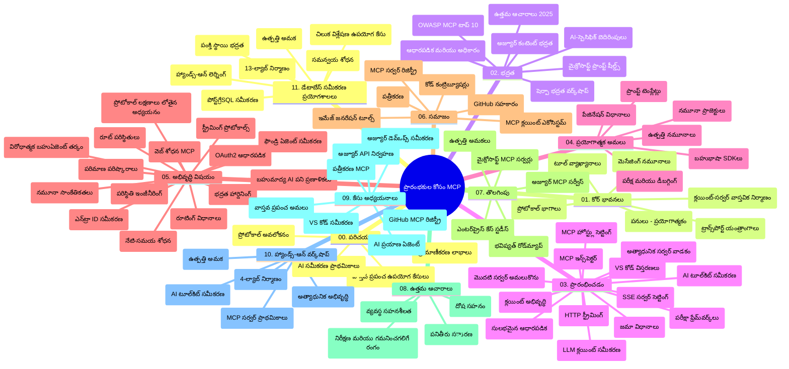

# మోడల్ కాంటెక్స్ ప్రోటోకాల (MCP) ప్రారంభకుల కోసం - అధ్యయన గైడ్

ఈ అధ్యయన గైడ్ "మోడల్ కాంటెక్స్ ప్రోటోకాల (MCP) ప్రారంభకుల కోసం" పాఠ్యক্রমం యొక్క రిపోజిటరీ నిర్మాణం మరియు విషయం యొక్క సమీక్షను అందిస్తుంది. ఈ గైడ్ ద్వారా రిపోజిటరీని సమర్థవంతంగా నావిగేట్ చేసి అందుబాటులో ఉన్న వనరులను గరిష్టంగా ఉపయోగించుకోండి.

## రిపోజిటరీ సమీక్ష

మోడల్ కాంటెక్స్ ప్రోటోకాల (MCP) అనేది AI మోడల్స్ మరియు క్లయింట్ అప్లికేషన్ల మధ్య సంభాషణలకు ఒక ప్రమాణీకరించిన ఫ్రేమ్‌వర్క్. మొదటిగా Anthropic వారు రూపొందించిన MCP ను ఇప్పుడు అధికారిక GitHub సంస్థ ద్వారా MCP సమాజం నిర్వహిస్తుంది. ఈ రిపోజిటరీలో C#, Java, JavaScript, Python, మరియు TypeScript లనాటి ప్రాక్టికల్ కోడ్ ఉదాహరణలతో కూడిన సమగ్ర పాఠ్యపుస్తకం అందుబాటులో ఉంది, ఇది AI డెవలపర్లు, సిస్టమ్ ఆర్కిటెక్ట్స్ మరియు సాఫ్ట్‌వేర్ ఇంజనీర్ల కోసం రూపొందించబడింది.

## విజువల్ పాఠ్యపుస్తకం మ్యాప్

## రిపోజిటరీ నిర్మాణం

ఈ రిపోజిటరీ పదకొండు ముఖ్యమైన విభాగాలుగా నిర్వహించబడింది, ఒక్కోటి MCP వివిధ పార్శ్వాలలో దృష్టి సారిస్తుంది:

1. **పరిచయం (00-Introduction/)**
   - మోడల్ కాంటెక్స్ ప్రోటోకాల సమీక్ష
   - AI పైప్లైన్లలో ప్రమాణీకరణ ఎందుకు ముఖ్యం
   - ప్రాథమిక ఉపయోగాలు మరియు లాభాలు

2. **ఇతర మూలాంశాలు (01-CoreConcepts/)**
   - క్లయింట్-సర్వర్ ఆర్కిటెక్చర్
   - ప్రోటోకాల్ కీలక భాగాలు
   - MCP లో సందేశ ప్రవాహ నమూనాలు

3. **భద్రత (02-Security/)**
   - MCP ఆధారిత వ్యవస్థలలో భద్రతా బెదిరింపులు
   - అమలు భద్రత పరంగా ఉత్తమ మార్గాలు
   - గుర్తింపు మరియు అనుమతులు విధానాలు
   - **సంపూర్ణ భద్రతా డాక్యుమెంటేషన్**:
     - MCP భద్రత ఉత్తమ మార్గాలు 2025
     - అజ్యూర్ కంటెంట్ సేఫ్టీ అమలుపై మార్గదర్శకాలు
     - MCP భద్రత నియంత్రణలు మరియు సాంకేతిక విధానాలు
     - MCP ఉత్తమ ఆచరణల తక్షణ సూచిక
   - **కీలక భద్రతా అంశాలు**:
     - ప్రాంప్ట్ ఇంజెక్షన్ మరియు టూల్ విషకరణ దాడులు
     - సెషన్ హైజాకింగ్ మరియు గందరగోళమైన డిప్యూటీ సమస్యలు
     - టోకెన్ పాస్త్రూ దోపిడీలు
     - అధిక అనుమతులు మరియు ప్రాప్తి నియంత్రణ
     - AI భాగాల సరఫరా గొలుసు భద్రత
     - మైక్రోసాఫ్ట్ ప్రాంప్ట్ షీల్డ్స్ ఇంటిగ్రేషన్

4. **ప్రారంభం (03-GettingStarted/)**
   - పరిసర ఏర్పాట్లు మరియు కాన్ఫిగరేషన్
   - ప్రాథమిక MCP సర్వర్లూ మరియు క్లయింట్లు సృష్టి
   - ఉన్న అప్లికేషన్లతో సమైక్యం
   - కిందివి शामिल:
     - మొట్టమొదటి సర్వర్ అమలు
     - క్లయింట్ అభివృద్ధి
     - LLM క్లయింట్ ఇంటిగ్రేషన్
     - VS కోడ్ ఇంటిగ్రేషన్
     - సర్వర్ సెంటెడ్ ఈవెంట్లు (SSE) సర్వర్
     - ఆధునిక సర్వర్ వినియోగం
     - HTTP స్ట్రీమింగ్
     - AI టూల్‌కిట్ ఇంటిగ్రేషన్
     - పరీక్షా వ్యూహాలు
     - పంపిణీ మార్గదర్శకాలు

5. **ప్రాక్టికల్ అమలు (04-PracticalImplementation/)**
   - వేర్వేరు ప్రోగ్రామింగ్ భాషల్లో SDKs ఉపయోగం
   - డీబగ్గింగ్, పరీక్షల నిర్వహణ మరియు ధృవీకరణ
   - తిరిగి ఉపయోగించదగిన ప్రాంప్ట్ టెంప్లేట్లు మరియు వర్క్‌ఫ్లోస్ రూపకల్పన
   - అమలుకు నమూనా ప్రాజెక్టులు

6. **అధునాతన అంశాలు (05-AdvancedTopics/)**
   - కాంటెక్స్ ఇంజనీరింగ్ సాంకేతిక విధానాలు
   - ఫౌండ్రీ ఏజెంట్ ఇంటిగ్రేషన్
   - మల్టీ-మోడ్ AI వర్క్‌ఫ్లోస్
   - OAuth2 గుర్తింపు డెమోలు
   - రియల్ టైమ్ శోధన సామర్థ్యాలు
   - రియల్ టైమ్ స్ట్రీమింగ్
   - రూట్ కాంటెక్స్ అమలు
   - రౌటింగ్ వ్యూహాలు
   - శాంప్లింగ్ సాంకేతికతలు
   - స్కేలింగ్ పద్ధతులు
   - భద్రత పరమైన ఆలోచనలు
   - ఎంట్రా ID భద్రతా ఇంటిగ్రేషన్
   - వెబ్ శోధన ఇంటిగ్రేషన్
   - ప్రతిపక్ష బహుళ ఏజెంట్ తర్కం (వివాద నమూనాలు)

7. **సమాజం సహకారాలు (06-CommunityContributions/)**
   - కోడ్ మరియు డాక్యుమెంటేషన్ సహకారం ఎలా చేయాలి
   - GitHub ద్వారా సహకారం
   - సమాజం ఆధారిత మెరుగుదలలు మరియు అభిప్రాయం
   - వివిధ MCP క్లయింట్ల వినియోగం (Claude Desktop, Cline, VSCode)
   - ప్రసిద్ధ MCP సర్వర్లతో పని, చిత్రాల ఉత్పత్తిని సహా

8. **ప్రారంభ స్వీకరణ పాఠాలు (07-LessonsfromEarlyAdoption/)**
   - వాస్తవ ప్రస్థావనలు మరియు విజయ కథలు
   - MCP ఆధారిత పరిష్కారాల నిర్మాణం మరియు పంపిణీ
   - ధోరణులు మరియు భవిష్యపు పథం
   - **మైక్రోసాఫ్ట్ MCP సర్వర్లు గైడ్**: 10 తయారైన మైక్రోసాఫ్ట్ MCP సర్వర్ల సమగ్ర మార్గదర్శకాలు:
     - Microsoft Learn Docs MCP సర్వర్
     - Azure MCP సర్వర్ (15+ ప్రత్యేక కనెక్టర్లు)
     - GitHub MCP సర్వర్
     - Azure DevOps MCP సర్వర్
     - MarkItDown MCP సర్వర్
     - SQL Server MCP సర్వర్
     - Playwright MCP సర్వర్
     - Dev Box MCP సర్వర్
     - Azure AI Foundry MCP సర్వర్
     - Microsoft 365 Agents Toolkit MCP సర్వర్

9. **ఉత్తమ ఆచరణలు (08-BestPractices/)**
   - పనితీరు ట్యూనింగ్ మరియు ఆప్టిమైజేషన్
   - లోపాలను తట్టుకోగల MCP వ్యవస్థల రూపకల్పన
   - పరీక్షల నిర్వహణ మరియు మెరుగుదల వ్యూహాలు

10. **కేస్ స్టడీస్ (09-CaseStudy/)**
    - MCP విభిన్న సందర్భాలలో అన్వయోచితతను చూపించే **ఏడు సమగ్ర కేస్ స్టడీలు**:
    - **Azure AI ట్రావెల్ ఏజెంట్లు**: Azure OpenAI మరియు AI శోధనతో బహుళ ఏజెంట్ సమన్వయం
    - **Azure DevOps సమ్మేళనం**: YouTube డేటా నవీకరణలతో వర్క్‌ఫ్లో ఆటోమేషన్
    - **రియల్-టైమ్ డాక్యుమెంటేషన్ రీప్రieval**: Python కన్సోల్ క్లయింట్ HTTP స్ట్రీమింగ్ తో
    - **ఇంటరాక్టివ్ స్టడీ ప్లాన్ జనరేటర్**: Chainlit వెబ్ యాప్, సంభాషణ AI తో
    - **ఎడిటర్ లో డాక్యుమెంటేషన్**: VS కోడ్ క్లయింట్ GitHub Copilot వర్క్‌ఫ్లోస్ తో
    - **Azure API మేనేజ్మెంట్**: MCP సర్వర్ సృష్టితో ఎంటర్ప్రైజ్ API సమ్మేళనం
    - **GitHub MCP రిజిస్ట్రి**: ఎకోసిస్టమ్ అభివృద్ధి మరియు ఏజెంటిక్ ఇంటిగ్రేషన్ వేదిక
    - ఎంటర్ప్రైజ్ సమ్మేళనం, డెవలపర్ ఉత్పాదకత మరియు ఎకోసిస్టమ్ అభివృద్ధి అమలుకు ఉదాహరణలు

11. **హ్యాండ్స్-ఆన్ వర్క్‌షాప్ (10-StreamliningAIWorkflowsBuildingAnMCPServerWithAIToolkit/)**
    - MCP ను AI టూల్‌కిట్ తో కలిపిన సమగ్ర హ్యాండ్స్-ఆన్ వర్క్‌షాప్
    - బుద్ధిమంతమైన అప్లికేషన్లు సృష్టించుట, AI మోడల్స్ మరియు వాస్తవ ప్రపంచ సాధనాల మధ్య అనుసంధానం
    - ప్రాథమికాలు, కస్టమ్ సర్వర్ అభివృద్ధి, మరియు ఉత్పత్తి పంపిణీ వ్యూహాలు కవర్ చేసే ప్రాక్టికల్ మాడ్యూల్స్
    - **ల్యాబ్ నిర్మాణం**:
      - ల్యాబ్ 1: MCP సర్వర్ ప్రాథమికాలు
      - ల్యాబ్ 2: అధునాతన MCP సర్వర్ అభివృద్ధి
      - ల్యాబ్ 3: AI టూల్‌కిట్ సమ్మేళనం
      - ల్యాబ్ 4: ఉత్పత్తి పంపిణీ మరియు స్కేలింగ్
    - దశల వారీ సలహాలతో ల్యాబ్ ఆధారిత శిక్షణ

12. **MCP సర్వర్ డేటాబేస్ ఇంటిగ్రేషన్ ల్యాబ్స్ (11-MCPServerHandsOnLabs/)**
    - ఉత్పత్తి సిద్ధం MCP సర్వర్లను PostgreSQL ఇంటిగ్రేషన్ తో నిర్మించడానికి **13-ల్యాబ్ పూర్తి శిక్షణ పథం**
    - Zava Retail ఉపయోగ కేసుతో వాస్తవ రిటైల్ విశ్లేషణలు అమలు
    - ఎంటర్ప్రైజ్ స్థాయి నమూనాలు: రో లెవల్ సెక్యూరిటీ (RLS), సిమాంటిక్ శోధన మరియు బహుళ-టెనెంట్ డేటా ప్రాప్తి
    - **పూర్తి ల్యాబ్ నిర్మాణం**:
      - **ల్యాబ్స్ 00-03: పునాది** - పరిచయం, ఆర్కిటెక్చర్, భద్రత, పరిసర ఏర్పాట్లు
      - **ల్యాబ్స్ 04-06: MCP సర్వర్ నిర్మాణం** - డేటాబేస్ డిజైన్, MCP సర్వర్ అమలు, టూల్ అభివృద్ధి
      - **ల్యాబ్స్ 07-09: అధునాతన ఫీచర్లు** - సిమాంటిక్ శోధన, పరీక్షలు & డీబగ్గింగ్, VS కోడ్ ఇంటిగ్రేషన్
      - **ల్యాబ్స్ 10-12: ఉత్పత్తి & ఉత్తమ ఆచరణలు** - పంపిణీ, మానిటరింగ్, ఆప్టిమైజేషన్
    - **సాంకేతిక విషయాలు**: FastMCP ఫ్రేమ్‌వర్క్, PostgreSQL, Azure OpenAI, Azure కంటైనర్ యాప్స్, అప్లికేషన్ ఇన్సైట్స్
    - **శిక్షణ ఫలితాలు**: ఉత్పత్తి సిద్ధం MCP సర్వర్లు, డేటాబేస్ ఇంటిగ్రేషన్ నమూనాలు, AI సమర్థ విశ్లేషణలు, ఎంటర్ప్రైజ్ భద్రత

## అదనపు వనరులు

రిపోజిటరీలో సమర్థిస్తున్న వనరులు:

- **Images ఫోల్డర్**: పాఠ్యపుస్తకంలో ఉపయోగించబడిన చిత్రణలు మరియు చిహ్నాలు
- **అనువాదాలు**: బహుధాతు మద్దతు, డాక్యుమెంటేషన్ యొక్క ఆటోమేటెడ్ అనువాదాలు
- **అధికారిక MCP వనరులు**:
  - [MCP డాక్యుమెంటేషన్](https://modelcontextprotocol.io/)
  - [MCP స్పెసిఫికేషన్](https://spec.modelcontextprotocol.io/)
  - [MCP GitHub రిపోజిటరీ](https://github.com/modelcontextprotocol)

## ఈ రిపోజిటరీను ఎలా ఉపయోగించాలి

1. **సిరీస్ ఆలోచన**: అధ్యాయాలను క్రమంగా (00 నుండి 11 వరకు) పాటించండి, నిర్మితమైన అధ్యయన అనుభవం కోసం.
2. **భాష ఆధారిత దృష్టి**: మీ ఇష్టమైన ప్రోగ్రామింగ్ భాషలో అమలుల కోసం నమూనా డైరెక్టరీలను పరిశీలించండి.
3. **ప్రాక్టికల్ అమలు**: "ప్రారంభం" విభాగం నుండి మీ పరిసరాన్ని సెట్ చేసి, మొదటి MCP సర్వర్ మరియు క్లయింట్ ను సృష్టించండి.
4. **అధునాతన అన్వేషణ**: ప్రాధమికాలలో సౌకర్యంగా ఉన్న తర్వాత, అధునాతన అంశాలలో స్థాయి పెంచండి.
5. **సమాజం పాల్గొనడం**: MCP సమాజంతో GitHub చర్చలు మరియు Discord ఛానల్స్ ద్వారా చేరండి, నిపుణులు మరియు డెవలపర్లతో సంభంధాల కోసం.

## MCP క్లయింట్లు మరియు సాధనాలు

పాఠ్యంపై వివిధ MCP క్లయింట్లు మరియు సాధనాలు కవర్ చేయబడ్డాయి:

1. **అధికారిక క్లయింట్లు**:
   - Visual Studio Code
   - MCP in Visual Studio Code
   - Claude Desktop
   - Claude in VSCode
   - Claude API

2. **సమాజం ఆధారిత క్లయింట్లు**:
   - Cline (టెర్మినల్ ఆధారిత)
   - Cursor (కోడ్ ఎడిటర్)
   - ChatMCP
   - Windsurf

3. **MCP నిర్వహణ సాధనాలు**:
   - MCP CLI
   - MCP మేనేజర్
   - MCP లింకర్
   - MCP రౌటర్

## ప్రసిద్ధ MCP సర్వర్లు

రిపోజిటరీ వివిధ MCP సర్వర్లను పరిచయం చేస్తుంది, వాటిలో:

1. **అధికారిక మైక్రోసాఫ్ట్ MCP సర్వర్లు**:
   - Microsoft Learn Docs MCP సర్వర్
   - Azure MCP సర్వర్ (15+ ప్రత్యేక కనెక్టర్లు)
   - GitHub MCP సర్వర్
   - Azure DevOps MCP సర్వర్
   - MarkItDown MCP సర్వర్
   - SQL Server MCP సర్వర్
   - Playwright MCP సర్వర్
   - Dev Box MCP సర్వర్
   - Azure AI Foundry MCP సర్వర్
   - Microsoft 365 Agents Toolkit MCP సర్వర్

2. **అధికారిక సూచనా సర్వర్లు**:
   - Filesystem
   - Fetch
   - Memory
   - Sequential Thinking

3. **చిత్ర ఉత్పత్తి**:
   - Azure OpenAI DALL-E 3
   - Stable Diffusion WebUI
   - Replicate

4. **అభివృద్ధి సాధనాలు**:
   - Git MCP
   - Terminal Control
   - Code Assistant

5. **ప్రత్యేక సర్వర్లు**:
   - Salesforce
   - Microsoft Teams
   - Jira & Confluence

## సహకారం

ఈ రిపోజిటరీ సమాజం నుండి సహకారాలను స్వాగతిస్తుంది. MCP ఎకోసిస్టమ్ కు సమర్థవంతంగా సహకారం ఎలా చేయాలో Community Contributions విభాగంలో చూడండి.

----

*ఈ అధ్యయన గైడ్ చివరిసారిగా 2026 ఫిబ్రవరి 5న సవరించబడింది, తాజా MCP స్పెసిఫికేషన్ 2025-11-25 ను ప్రతిబింబిస్తుంది మరియు ఆ తేదీకి సంబంధించిన రిపోజిటరీ సమీక్షను అందిస్తుంది. రిపోజిటరీ విషయము ఆ తేదీకి ఆవశ్యకత వచ్చినప్పుడు నవీకరించబడవచ్చు.*

---

<!-- CO-OP TRANSLATOR DISCLAIMER START -->
**విడుదలను**:  
ఈ పత్రాన్ని AI అనువాద సేవ [Co-op Translator](https://github.com/Azure/co-op-translator) ఉపయోగించి అనువదించబడింది. మేము ఖచ్చితత్వానికి ప్రయత్నించడం జరుగుతున్నప్పటికీ, ఆటోమేటెడ్ అనువాదాలలో తప్పులు లేదా అపరాధాలు ఉండవచ్చును. ప్రారంభ పత్రం దాని స్థానిక భాషలోనే అధికారిక వనరు గా పరిగణించాలి. కీలక సమాచారం కోసం, నిపుణుల చేత మనవాద అనువాదం చేయించుకోవడం మంచిది. ఈ అనువాదం వాడకం వల్ల కలిగే ఏవైనా అపార్థాలు లేదా తప్పు అర్థం చేసుకోవడాలకు మేము బాధ్యత వహించము.
<!-- CO-OP TRANSLATOR DISCLAIMER END -->