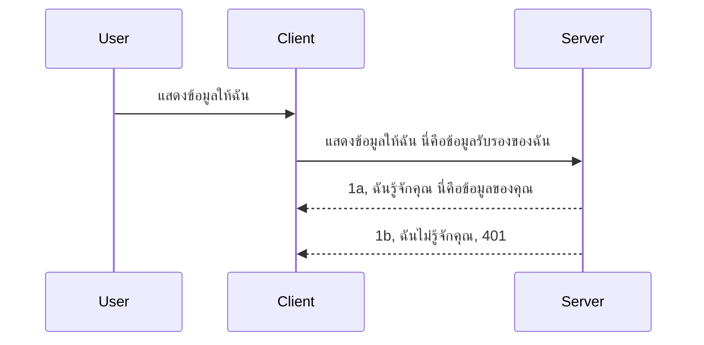

# Simple auth

MCP SDKs รองรับการใช้ OAuth 2.1 ซึ่งต้องยอมรับว่าเป็นกระบวนการที่ค่อนข้างซับซ้อน ซึ่งเกี่ยวข้องกับแนวคิดต่าง ๆ เช่น เซิร์ฟเวอร์การยืนยันตัวตน, เซิร์ฟเวอร์ทรัพยากร, การส่งข้อมูลรับรอง, การรับโค้ด, แลกเปลี่ยนโค้ดเป็นโทเค็นผู้ถือ จนในที่สุดคุณจะสามารถดึงข้อมูลทรัพยากรของคุณได้ หากคุณไม่คุ้นเคยกับ OAuth ซึ่งเป็นสิ่งที่ดีในการนำไปใช้งาน เป็นความคิดที่ดีที่จะเริ่มต้นด้วยระดับการยืนยันตัวตนพื้นฐานบางอย่าง และพัฒนาต่อเนื่องไปสู่ความปลอดภัยที่ดีขึ้น นั่นคือเหตุผลที่บทนี้มีอยู่ เพื่อช่วยให้คุณก้าวไปสู่การยืนยันตัวตนที่ซับซ้อนกว่า

## การยืนยันตัวตน (Auth) หมายถึงอะไร?

Auth เป็นคำย่อของ authentication และ authorization ความคิดก็คือเราต้องทำสองสิ่ง:

- **Authentication** คือกระบวนการในการตรวจสอบว่าเราจะอนุญาตให้บุคคลเข้าบ้านของเราได้หรือไม่ ว่าพวกเขามีสิทธิ์ที่จะ "อยู่ที่นี่" หรือไม่ นั่นคือมีสิทธิ์เข้าถึงเซิร์ฟเวอร์ทรัพยากรของเราซึ่งฟีเจอร์ต่าง ๆ ของ MCP Server ของเราอยู่
- **Authorization** คือกระบวนการตรวจสอบว่าผู้ใช้ควรได้รับสิทธิ์ในการเข้าถึงทรัพยากรเฉพาะเหล่านี้ที่พวกเขาร้องขอหรือไม่ เช่น รายการคำสั่งซื้อเหล่านี้ หรือผลิตภัณฑ์เหล่านี้ หรือว่าพวกเขาได้รับอนุญาตให้อ่านเนื้อหาแต่ไม่สามารถลบได้ เป็นต้น

## ข้อมูลรับรอง: วิธีที่เราบอกระบบว่าเราเป็นใคร

โดยทั่วไปนักพัฒนาเว็บส่วนใหญ่เริ่มคิดในแง่ของการให้ข้อมูลรับรอง (credential) แก่เซิร์ฟเวอร์ ซึ่งโดยปกติจะเป็นความลับที่บอกว่าพวกเขาได้รับอนุญาตให้เป็นที่นี่หรือไม่ ("Authentication") ข้อมูลรับรองนี้มักจะเป็นเวอร์ชันเข้ารหัสแบบ base64 ของชื่อผู้ใช้และรหัสผ่าน หรือกุญแจ API ที่ระบุผู้ใช้เฉพาะเจาะจง

สิ่งนี้เกี่ยวข้องกับการส่งผ่านหัวข้อชื่อ "Authorization" แบบนี้:

```json
{ "Authorization": "secret123" }
```

โดยปกตินี่จะเรียกว่าการยืนยันตัวตนแบบพื้นฐาน (basic authentication) วิธีการทำงานโดยรวมจะเป็นดังนี้:


เมื่อเราเข้าใจวิธีการทำงานจากมุมมองของการไหลแล้ว เราจะนำไปใช้อย่างไร? เซิร์ฟเวอร์เว็บส่วนใหญ่มักมีแนวคิดที่เรียกว่า middleware ซึ่งเป็นส่วนของโค้ดที่ทำงานในกระบวนการร้องขอ สามารถตรวจสอบข้อมูลรับรอง และถ้าข้อมูลรับรองถูกต้องก็จะอนุญาตให้คำร้องขอผ่านไปได้ หากคำร้องขอไม่มีข้อมูลรับรองที่ถูกต้อง ก็จะได้ข้อผิดพลาดเกี่ยวกับการยืนยันตัวตน มาดูกันว่าการนำไปใช้นั้นทำได้อย่างไร:

**Python**

```python
class AuthMiddleware(BaseHTTPMiddleware):
    async def dispatch(self, request, call_next):

        has_header = request.headers.get("Authorization")
        if not has_header:
            print("-> Missing Authorization header!")
            return Response(status_code=401, content="Unauthorized")

        if not valid_token(has_header):
            print("-> Invalid token!")
            return Response(status_code=403, content="Forbidden")

        print("Valid token, proceeding...")
       
        response = await call_next(request)
        # เพิ่ม headers ลูกค้าใด ๆ หรือเปลี่ยนแปลงในคำตอบในบางวิธี
        return response


starlette_app.add_middleware(CustomHeaderMiddleware)
```

ที่นี่เรามี:

- สร้าง middleware ที่เรียกว่า `AuthMiddleware` ซึ่งเมธอด `dispatch` ของมันจะถูกเรียกโดยเว็บเซิร์ฟเวอร์
- เพิ่ม middleware ไปยังเว็บเซิร์ฟเวอร์:

    ```python
    starlette_app.add_middleware(AuthMiddleware)
    ```

- เขียนตรรกะการตรวจสอบที่เช็คว่ามีหัวข้อ Authorization อยู่หรือไม่ และถ้าความลับที่ส่งมาถูกต้อง:

    ```python
    has_header = request.headers.get("Authorization")
    if not has_header:
        print("-> Missing Authorization header!")
        return Response(status_code=401, content="Unauthorized")

    if not valid_token(has_header):
        print("-> Invalid token!")
        return Response(status_code=403, content="Forbidden")
    ```

    ถ้าความลับมีอยู่และถูกต้อง เราจะอนุญาตให้คำร้องขอผ่านโดยการเรียก `call_next` และส่งกลับการตอบสนอง

    ```python
    response = await call_next(request)
    # เพิ่มส่วนหัวของลูกค้าหรือเปลี่ยนแปลงการตอบสนองในบางวิธี
    return response
    ```

วิธีการทำงานคือ หากมีคำร้องขอเว็บถูกส่งมายังเซิร์ฟเวอร์ middleware จะถูกเรียกใช้งาน และจากที่ได้ออกแบบไว้ จะอนุญาตให้คำร้องขอผ่านไปหรือส่งกลับข้อผิดพลาดที่บ่งชี้ว่าลูกค้าไม่ได้รับอนุญาตให้ดำเนินการต่อ

**TypeScript**

ที่นี่เราสร้าง middleware ด้วยเฟรมเวิร์กยอดนิยม Express และดักจับคำร้องขอไว้ก่อนที่จะไปถึง MCP Server โค้ดตัวอย่างดังนี้:

```typescript
function isValid(secret) {
    return secret === "secret123";
}

app.use((req, res, next) => {
    // 1. มีส่วนหัวการอนุญาตหรือไม่?
    if(!req.headers["Authorization"]) {
        res.status(401).send('Unauthorized');
    }
    
    let token = req.headers["Authorization"];

    // 2. ตรวจสอบความถูกต้อง
    if(!isValid(token)) {
        res.status(403).send('Forbidden');
    }

   
    console.log('Middleware executed');
    // 3. ส่งคำขอต่อไปยังขั้นตอนถัดไปในกระบวนการร้องขอ
    next();
});
```

ในโค้ดนี้เรา:

1. ตรวจสอบว่ามีหัวข้อ Authorization อยู่ในคำร้องขอหรือไม่ ถ้าไม่มี เราจะส่งข้อผิดพลาด 401
2. ตรวจสอบว่าข้อมูลรับรอง/โทเค็นถูกต้องหรือไม่ ถ้าไม่ถูกต้อง เราจะส่งข้อผิดพลาด 403
3. สุดท้ายส่งคำร้องขอต่อใน pipeline ของคำร้องขอ และส่งกลับทรัพยากรที่ร้องขอ

## แบบฝึกหัด: นำการยืนยันตัวตนไปใช้งาน

ลองนำความรู้ของเรามาลองนำไปใช้งานจริงกัน ตามแผนนี้:

เซิร์ฟเวอร์

- สร้างเว็บเซิร์ฟเวอร์และอินสแตนซ์ MCP
- นำ middleware ไปใช้ในเซิร์ฟเวอร์

ไคลเอนต์

- ส่งคำร้องขอเว็บพร้อมข้อมูลรับรองผ่านหัวข้อ

### -1- สร้างเว็บเซิร์ฟเวอร์และอินสแตนซ์ MCP

ในขั้นตอนแรก เราต้องสร้างอินสแตนซ์เว็บเซิร์ฟเวอร์และ MCP Server

**Python**

ที่นี่เราสร้างอินสแตนซ์ MCP Server สร้างเว็บแอป starlette และโฮสต์ด้วย uvicorn

```python
# กำลังสร้างเซิร์ฟเวอร์ MCP

app = FastMCP(
    name="MCP Resource Server",
    instructions="Resource Server that validates tokens via Authorization Server introspection",
    host=settings["host"],
    port=settings["port"],
    debug=True
)

# กำลังสร้างเว็บแอป starlette
starlette_app = app.streamable_http_app()

# ให้บริการแอปผ่าน uvicorn
async def run(starlette_app):
    import uvicorn
    config = uvicorn.Config(
            starlette_app,
            host=app.settings.host,
            port=app.settings.port,
            log_level=app.settings.log_level.lower(),
        )
    server = uvicorn.Server(config)
    await server.serve()

run(starlette_app)
```

ในโค้ดนี้เรา:

- สร้าง MCP Server
- สร้างเว็บแอป starlette จาก MCP Server ด้วย `app.streamable_http_app()`
- โฮสต์และให้บริการเว็บแอปโดยใช้ uvicorn `server.serve()`

**TypeScript**

ที่นี่เราสร้างอินสแตนซ์ MCP Server

```typescript
const server = new McpServer({
      name: "example-server",
      version: "1.0.0"
    });

    // ... ตั้งค่าทรัพยากรเซิร์ฟเวอร์, เครื่องมือ, และคำสั่ง ...
```

การสร้าง MCP Server นี้จำเป็นต้องทำภายในเส้นทาง POST /mcp ของเรา ดังนั้นเรามาดูโค้ดด้านบนและย้ายไปไว้ในตำแหน่งนี้:

```typescript
import express from "express";
import { randomUUID } from "node:crypto";
import { McpServer } from "@modelcontextprotocol/sdk/server/mcp.js";
import { StreamableHTTPServerTransport } from "@modelcontextprotocol/sdk/server/streamableHttp.js";
import { isInitializeRequest } from "@modelcontextprotocol/sdk/types.js"

const app = express();
app.use(express.json());

// แผนที่สำหรับเก็บการส่งข้อมูลตามรหัสเซสชัน
const transports: { [sessionId: string]: StreamableHTTPServerTransport } = {};

// จัดการคำขอ POST สำหรับการสื่อสารจากไคลเอนต์ไปยังเซิร์ฟเวอร์
app.post('/mcp', async (req, res) => {
  // ตรวจสอบว่ามีรหัสเซสชันอยู่แล้วหรือไม่
  const sessionId = req.headers['mcp-session-id'] as string | undefined;
  let transport: StreamableHTTPServerTransport;

  if (sessionId && transports[sessionId]) {
    // ใช้การส่งข้อมูลที่มีอยู่แล้วซ้ำ
    transport = transports[sessionId];
  } else if (!sessionId && isInitializeRequest(req.body)) {
    // คำขอเริ่มต้นใหม่
    transport = new StreamableHTTPServerTransport({
      sessionIdGenerator: () => randomUUID(),
      onsessioninitialized: (sessionId) => {
        // เก็บการส่งข้อมูลตามรหัสเซสชัน
        transports[sessionId] = transport;
      },
      // การป้องกัน DNS rebinding ปิดใช้งานโดยค่าเริ่มต้นเพื่อความเข้ากันได้ย้อนหลัง ถ้าคุณกำลังรันเซิร์ฟเวอร์นี้
      // ในเครื่องโปรดตรวจสอบให้ตั้งค่า:
      // enableDnsRebindingProtection: true,
      // allowedHosts: ['127.0.0.1'],
    });

    // ทำความสะอาดการส่งข้อมูลเมื่อถูกปิด
    transport.onclose = () => {
      if (transport.sessionId) {
        delete transports[transport.sessionId];
      }
    };
    const server = new McpServer({
      name: "example-server",
      version: "1.0.0"
    });

    // ... ตั้งค่าทรัพยากรเครื่องมือและพรอมต์ของเซิร์ฟเวอร์ ...

    // เชื่อมต่อกับเซิร์ฟเวอร์ MCP
    await server.connect(transport);
  } else {
    // คำขอไม่ถูกต้อง
    res.status(400).json({
      jsonrpc: '2.0',
      error: {
        code: -32000,
        message: 'Bad Request: No valid session ID provided',
      },
      id: null,
    });
    return;
  }

  // จัดการคำขอ
  await transport.handleRequest(req, res, req.body);
});

// ตัวจัดการที่สามารถใช้ซ้ำสำหรับคำขอ GET และ DELETE
const handleSessionRequest = async (req: express.Request, res: express.Response) => {
  const sessionId = req.headers['mcp-session-id'] as string | undefined;
  if (!sessionId || !transports[sessionId]) {
    res.status(400).send('Invalid or missing session ID');
    return;
  }
  
  const transport = transports[sessionId];
  await transport.handleRequest(req, res);
};

// จัดการคำขอ GET สำหรับการแจ้งเตือนจากเซิร์ฟเวอร์ไปยังไคลเอนต์ผ่าน SSE
app.get('/mcp', handleSessionRequest);

// จัดการคำขอ DELETE สำหรับการยุติเซสชัน
app.delete('/mcp', handleSessionRequest);

app.listen(3000);
```

ตอนนี้คุณจะเห็นว่าการสร้าง MCP Server ได้ถูกย้ายเข้าไปใน `app.post("/mcp")` แล้ว

มาดูขั้นตอนต่อไปในการสร้าง middleware เพื่อที่เราจะตรวจสอบข้อมูลรับรองที่เข้ามา

### -2- นำ middleware ไปใช้ในเซิร์ฟเวอร์

ตอนนี้มาดูส่วนของ middleware กัน ที่นี่เราจะสร้าง middleware ที่ตรวจหาข้อมูลรับรองในหัวข้อ `Authorization` และตรวจสอบความถูกต้อง หากผ่านเกณฑ์ คำร้องขอก็จะดำเนินการตามที่จำเป็น (เช่น การแสดงเครื่องมือ, อ่านทรัพยากร หรือฟังก์ชัน MCP อื่น ๆ ที่ลูกค้าร้องขอ)

**Python**

ในการสร้าง middleware เราต้องสร้างคลาสที่สืบทอดจาก `BaseHTTPMiddleware` มีสองส่วนที่น่าสนใจ:

- คำร้องขอ `request` ที่เราจะอ่านข้อมูลจากหัวข้อ
- `call_next` คอลแบ็คที่เราต้องเรียกใช้งานหากลูกค้านำข้อมูลรับรองที่เรารับรู้จักมา

ก่อนอื่น เราต้องจัดการกรณีที่ไม่มีหัวข้อ `Authorization`:

```python
has_header = request.headers.get("Authorization")

# ไม่มีหัวเรื่อง ปฏิเสธพร้อมรหัส 401 มิฉะนั้นดำเนินการต่อ.
if not has_header:
    print("-> Missing Authorization header!")
    return Response(status_code=401, content="Unauthorized")
```

ที่นี่เราส่งข้อความ 401 unauthorized เพราะลูกค้าไม่ผ่านการยืนยันตัวตน

ต่อมา หากมีการส่งข้อมูลรับรองมา เราต้องตรวจสอบความถูกต้องดังนี้:

```python
 if not valid_token(has_header):
    print("-> Invalid token!")
    return Response(status_code=403, content="Forbidden")
```

สังเกตว่าเราส่งข้อความ 403 forbidden ตามตัวอย่างข้างต้น มาดู middleware ตัวเต็มที่นำทุกอย่างที่กล่าวไว้ด้านบนไปใช้งาน:

```python
class AuthMiddleware(BaseHTTPMiddleware):
    async def dispatch(self, request, call_next):

        has_header = request.headers.get("Authorization")
        if not has_header:
            print("-> Missing Authorization header!")
            return Response(status_code=401, content="Unauthorized")

        if not valid_token(has_header):
            print("-> Invalid token!")
            return Response(status_code=403, content="Forbidden")

        print("Valid token, proceeding...")
        print(f"-> Received {request.method} {request.url}")
        response = await call_next(request)
        response.headers['Custom'] = 'Example'
        return response

```

ดีมาก แต่ฟังก์ชัน `valid_token` คืออะไร? ดูได้ด้านล่างนี้:

```python
# หลีกเลี่ยงการใช้ในงานจริง - ปรับปรุงมัน !!
def valid_token(token: str) -> bool:
    # ลบคำขึ้นต้น "Bearer "
    if token.startswith("Bearer "):
        token = token[7:]
        return token == "secret-token"
    return False
```

แน่นอนว่านี่ควรได้รับการปรับปรุงเพิ่มเติม

สำคัญ: คุณไม่ควรมีความลับแบบนี้ในโค้ดเลย คุณควรดึงค่าที่จะเปรียบเทียบจากแหล่งข้อมูลหรือจาก IDP (ผู้ให้บริการตัวตน) หรือดีกว่าคือให้ IDP ทำการตรวจสอบแทน

**TypeScript**

เพื่อนำไปใช้กับ Express เราต้องเรียกเมธอด `use` ที่รับฟังก์ชัน middleware

เราต้อง:

- โต้ตอบกับตัวแปรคำร้องขอเพื่อตรวจสอบข้อมูลรับรองที่ส่งผ่านคุณสมบัติ `Authorization`
- ตรวจสอบความถูกต้องของข้อมูลรับรอง และถ้าถูกต้อง ให้คำร้องขอเดินหน้าต่อและทำให้คำร้อง MCP ของลูกค้าทำงานตามที่ควรจะเป็น (เช่น แสดงเครื่องมือ, อ่านทรัพยากร หรืออื่น ๆ ที่เกี่ยวกับ MCP)

ที่นี่ เราตรวจสอบว่าหัวข้อ `Authorization` มีอยู่หรือไม่ ถ้าไม่มีก็หยุดคำร้องขอไว้:

```typescript
if(!req.headers["authorization"]) {
    res.status(401).send('Unauthorized');
    return;
}
```

ถ้าไม่มีหัวข้อนี้ตั้งแต่แรก คุณจะได้รับ 401

ต่อมา เราตรวจสอบว่าข้อมูลรับรองถูกต้องไหม ถ้าไม่ เราจะหยุดคำร้องอีกครั้งพร้อมข้อความที่แตกต่างเล็กน้อย:

```typescript
if(!isValid(token)) {
    res.status(403).send('Forbidden');
    return;
} 
```

สังเกตว่าคุณจะได้รับข้อผิดพลาด 403

นี่คือโค้ดทั้งหมด:

```typescript
app.use((req, res, next) => {
    console.log('Request received:', req.method, req.url, req.headers);
    console.log('Headers:', req.headers["authorization"]);
    if(!req.headers["authorization"]) {
        res.status(401).send('Unauthorized');
        return;
    }
    
    let token = req.headers["authorization"];

    if(!isValid(token)) {
        res.status(403).send('Forbidden');
        return;
    }  

    console.log('Middleware executed');
    next();
});
```

เราได้ตั้งค่าเว็บเซิร์ฟเวอร์ให้รับ middleware เพื่อตรวจสอบข้อมูลรับรองที่ลูกค้าคาดหวังว่าจะส่งมา แล้วลูกค้าเองล่ะ?

### -3- ส่งคำร้องขอเว็บพร้อมข้อมูลรับรองผ่านหัวข้อ

เราต้องตรวจสอบให้แน่ใจว่าลูกค้าส่งข้อมูลรับรองผ่านหัวข้อ เพราะเราจะใช้ไคลเอนต์ MCP ดังนั้นเราต้องหาวิธีทำเช่นนั้น

**Python**

สำหรับไคลเอนต์ เราต้องส่งหัวข้อที่มีข้อมูลรับรองดังนี้:

```python
# หลีกเลี่ยงการเขียนค่าคงที่ลงในโค้ด ควรเก็บไว้ในตัวแปรสภาพแวดล้อมอย่างน้อยหรือที่เก็บข้อมูลที่ปลอดภัยกว่า
token = "secret-token"

async with streamablehttp_client(
        url = f"http://localhost:{port}/mcp",
        headers = {"Authorization": f"Bearer {token}"}
    ) as (
        read_stream,
        write_stream,
        session_callback,
    ):
        async with ClientSession(
            read_stream,
            write_stream
        ) as session:
            await session.initialize()
      
            # งานที่ต้องทำในฝั่งไคลเอนต์ เช่น แสดงรายการเครื่องมือ เรียกใช้งานเครื่องมือต่าง ๆ เป็นต้น
```

สังเกตว่าเราเติมคุณสมบัติ `headers` ดังนี้ ` headers = {"Authorization": f"Bearer {token}"}`

**TypeScript**

เราสามารถแก้ปัญหานี้ได้สองขั้นตอน:

1. เติมวัตถุการตั้งค่าด้วยข้อมูลรับรองของเรา
2. ส่งวัตถุการตั้งค่านี้ไปยังการขนส่ง (transport)

```typescript

// อย่ากำหนดค่าสตริงลงในโค้ดโดยตรงแบบที่แสดงที่นี่ อย่างน้อยที่สุดควรเก็บเป็นตัวแปรแวดล้อมและใช้สิ่งอย่าง dotenv (ในโหมดพัฒนา).
let token = "secret123"

// กำหนดอ็อบเจ็กต์ตัวเลือกสำหรับการส่งข้อมูลไคลเอนต์
let options: StreamableHTTPClientTransportOptions = {
  sessionId: sessionId,
  requestInit: {
    headers: {
      "Authorization": "secret123"
    }
  }
};

// ส่งอ็อบเจ็กต์ตัวเลือกไปยังการส่งข้อมูล
async function main() {
   const transport = new StreamableHTTPClientTransport(
      new URL(serverUrl),
      options
   );
```

คุณจะเห็นว่าด้านบนเราได้สร้างออบเจกต์ `options` และวางหัวข้อของเราไว้ภายใต้คุณสมบัติ `requestInit`

สำคัญ: แล้วเราจะพัฒนามาจากตรงนี้ได้อย่างไร? การนำไปใช้งานปัจจุบันมีปัญหาบางประการ อย่างแรก การส่งข้อมูลรับรองแบบนี้มีความเสี่ยงค่อนข้างสูง เว้นแต่ว่าคุณจะใช้ HTTPS อย่างน้อยที่สุด แม้จะใช้ HTTPS แต่ข้อมูลรับรองก็ยังอาจถูกขโมยได้ ดังนั้นคุณจึงต้องมีระบบที่สามารถเพิกถอนโทเค็นได้อย่างง่ายดาย และเพิ่มการตรวจสอบอื่น ๆ เช่น มันมาจากที่ไหนในโลกนี้, คำร้องเกิดบ่อยเกินไปหรือไม่ (พฤติกรรมแบบบ็อต) กล่าวโดยย่อ มีข้อกังวลจำนวนมาก

อย่างไรก็ตาม สำหรับ API ที่เรียบง่ายมากที่คุณไม่ต้องการให้ใครเรียก API ของคุณโดยไม่ได้รับการยืนยันตัวตน สิ่งที่เรามีที่นี่ถือว่าเป็นจุดเริ่มต้นที่ดี

อย่างไรก็ตาม มาลองเพิ่มความแข็งแกร่งให้กับความปลอดภัยเล็กน้อยด้วยการใช้รูปแบบมาตรฐานเช่น JSON Web Token ซึ่งรู้จักกันในชื่อ JWT หรือโทเค็น "JOT"

## JSON Web Tokens, JWT

ดังนั้น เรากำลังพยายามปรับปรุงจากการส่งข้อมูลรับรองแบบง่าย ๆ คุณได้รับการปรับปรุงทันทีอะไรบ้างเมื่อใช้ JWT?

- **การปรับปรุงความปลอดภัย** ใน basic auth, คุณจะส่งชื่อผู้ใช้และรหัสผ่านเป็นโทเค็นแบบเข้ารหัส base64 (หรือส่งคีย์ API) ซ้ำ ๆ ซึ่งจะเพิ่มความเสี่ยง เมื่อใช้ JWT คุณส่งชื่อผู้ใช้และรหัสผ่านและได้รับโทเค็นตอบกลับ และโทเค็นนี้ยังมีเวลาหมดอายุอีกด้วย JWT ช่วยให้คุณสามารถใช้การควบคุมการเข้าถึงแบบละเอียดได้ง่ายด้วยบทบาท (roles), ขอบเขต (scopes) และสิทธิ์ (permissions)
- **ความไม่เป็นสถานะและการปรับขนาด** JWT เป็นแบบบรรจุข้อมูลทั้งหมดเอง พกพาข้อมูลผู้ใช้ทั้งหมด และไม่จำเป็นต้องเก็บ session ฝั่งเซิร์ฟเวอร์ โทเค็นยังสามารถตรวจสอบความถูกต้องแบบโลคอลได้
- **การทำงานร่วมกันและการรวมตัว** JWT เป็นศูนย์กลางของ Open ID Connect และใช้กับผู้ให้บริการตัวตนที่รู้จักเช่น Entra ID, Google Identity และ Auth0 นอกจากนี้ยังทำให้สามารถใช้การเข้าสู่ระบบแบบครั้งเดียว (single sign-on) และอื่น ๆ ที่ทำให้ระดับองค์กร
- **ความยืดหยุ่นและโมดูลาร์** JWT ยังสามารถใช้กับ API Gateways เช่น Azure API Management, NGINX และอื่น ๆ รองรับการใช้งานด้านการพิสูจน์ตัวตน และการสื่อสารระหว่างเซิร์ฟเวอร์ รวมถึงสถานการณ์การแกล้งทำเป็นตัวแทนและการมอบหมายงาน
- **ประสิทธิภาพและแคช** JWT สามารถแคชหลังจากถอดรหัส ซึ่งช่วยลดความจำเป็นในการวิเคราะห์ใหม่สิ่งนี้ช่วยโดยเฉพาะกับแอปที่มีการเข้าชมสูง เพราะช่วยเพิ่มอัตราการผ่านและลดภาระของโครงสร้างพื้นฐานของคุณ
- **ฟีเจอร์ขั้นสูง** นอกจากนี้ยังรองรับ introspection (การตรวจสอบความถูกต้องบนเซิร์ฟเวอร์) และ revocation (ทำให้โทเค็นเป็นโมฆะ)

ด้วยข้อดีทั้งหมดนี้ มาดูกันว่าคุณจะนำการใช้งานของเราไปสู่ระดับถัดไปได้อย่างไร

## การเปลี่ยนการยืนยันตัวตนแบบ basic เป็น JWT

โดยระดับสูง จุดที่เราต้องเปลี่ยนคือ:

- **เรียนรู้การสร้างโทเค็น JWT** และเตรียมพร้อมสำหรับการส่งจากไคลเอนต์ไปยังเซิร์ฟเวอร์
- **ตรวจสอบโทเค็น JWT** และถ้าใช่ ให้ลูกค้าเข้าถึงทรัพยากรของเรา
- **จัดเก็บโทเค็นอย่างปลอดภัย** วิธีเก็บโทเค็นนี้
- **ปกป้องเส้นทาง** เราต้องปกป้องเส้นทาง ในกรณีของเรา เราต้องปกป้องเส้นทางและฟีเจอร์ MCP เฉพาะ
- **เพิ่ม refresh tokens** แน่ใจว่าเราสร้างโทเค็นที่มีเวลาใช้งานสั้น แต่มี refresh token ที่มีอายุยาวกว่า สามารถใช้รับโทเค็นใหม่ได้เมื่อหมดอายุ นอกจากนี้ต้องมี endpoint สำหรับ refresh และกลยุทธ์การสลับโทเค็น

### -1- สร้างโทเค็น JWT

ก่อนอื่น โทเค็น JWT มีส่วนประกอบดังนี้:

- **header** อัลกอริทึมที่ใช้และประเภทโทเค็น
- **payload** ข้อมูลสิทธิต่าง ๆ เช่น sub (ผู้ใช้หรือเอนทิตีที่โทเค็นแสดงถึง ในกรณีการยืนยันตัวตนปกติคือ id ของผู้ใช้), exp (เวลาหมดอายุ) role (บทบาท)
- **signature** ลายเซ็นที่ลงด้วยความลับหรือกุญแจส่วนตัว

สำหรับสิ่งนี้ เราจะต้องสร้าง header, payload และโทเค็นที่เข้ารหัส

**Python**

```python

import jwt
import jwt
from jwt.exceptions import ExpiredSignatureError, InvalidTokenError
import datetime

# คีย์ลับที่ใช้สำหรับลงชื่อ JWT
secret_key = 'your-secret-key'

header = {
    "alg": "HS256",
    "typ": "JWT"
}

# ข้อมูลผู้ใช้และคำยืนยันรวมถึงเวลาหมดอายุ
payload = {
    "sub": "1234567890",               # หัวข้อ (รหัสผู้ใช้)
    "name": "User Userson",                # คำยืนยันที่กำหนดเอง
    "admin": True,                     # คำยืนยันที่กำหนดเอง
    "iat": datetime.datetime.utcnow(),# เวลาออก
    "exp": datetime.datetime.utcnow() + datetime.timedelta(hours=1)  # หมดอายุ
}

# เข้ารหัสมัน
encoded_jwt = jwt.encode(payload, secret_key, algorithm="HS256", headers=header)
```

ในโค้ดด้านบน เราได้:

- กำหนด header โดยใช้ HS256 เป็นอัลกอริทึม และตั้ง type เป็น JWT
- สร้าง payload ที่ประกอบด้วย subject หรือ id ผู้ใช้, ชื่อผู้ใช้, บทบาท, เวลาที่ออก และเวลาที่หมดอายุ ซึ่งแสดงถึงคุณสมบัติเวลาที่ผูกมัดซึ่งกล่าวไว้ก่อนหน้านี้

**TypeScript**

ที่นี่เราต้องการ dependencies บางตัวที่จะช่วยเราสร้างโทเค็น JWT

Dependencies

```sh

npm install jsonwebtoken
npm install --save-dev @types/jsonwebtoken
```

เมื่อมีพร้อมแล้ว มาสร้าง header, payload และสร้างโทเค็นเข้ารหัสกัน

```typescript
import jwt from 'jsonwebtoken';

const secretKey = 'your-secret-key'; // ใช้ตัวแปรแวดล้อมในสภาพแวดล้อมการผลิต

// กำหนด payload
const payload = {
  sub: '1234567890',
  name: 'User usersson',
  admin: true,
  iat: Math.floor(Date.now() / 1000), // ออกเมื่อ
  exp: Math.floor(Date.now() / 1000) + 60 * 60 // หมดอายุใน 1 ชั่วโมง
};

// กำหนด header (ไม่บังคับ, jsonwebtoken กำหนดค่าเริ่มต้น)
const header = {
  alg: 'HS256',
  typ: 'JWT'
};

// สร้างโทเค็น
const token = jwt.sign(payload, secretKey, {
  algorithm: 'HS256',
  header: header
});

console.log('JWT:', token);
```

โทเค็นนี้:

เซ็นชื่อด้วย HS256
มีอายุ 1 ชั่วโมง
รวมค่าความจริงเช่น sub, name, admin, iat และ exp

### -2- ตรวจสอบโทเค็น

เรายังจะต้องตรวจสอบโทเค็น ซึ่งเป็นสิ่งที่ควรทำบนเซิร์ฟเวอร์เพื่อยืนยันว่าสิ่งที่ลูกค้าส่งมานั้นถูกต้อง มีการตรวจสอบหลายอย่าง เช่น โครงสร้างและความถูกต้อง นอกจากนี้ควรเพิ่มการตรวจสอบอื่น ๆ ว่าผู้ใช้มีอยู่ในระบบคุณหรือไม่และอื่น ๆ

ในการตรวจสอบโทเค็น เราต้องถอดรหัสเพื่ออ่านและตรวจสอบความถูกต้อง

**Python**

```python

# ถอดรหัสและตรวจสอบ JWT
try:
    decoded = jwt.decode(token, secret_key, algorithms=["HS256"])
    print("✅ Token is valid.")
    print("Decoded claims:")
    for key, value in decoded.items():
        print(f"  {key}: {value}")
except ExpiredSignatureError:
    print("❌ Token has expired.")
except InvalidTokenError as e:
    print(f"❌ Invalid token: {e}")

```

ในโค้ดนี้ เราเรียก `jwt.decode` โดยใช้โทเค็น, กุญแจลับ และอัลกอริทึมที่เลือกเป็นอินพุต สังเกตว่าเราใช้ try-catch เพราะถ้าการตรวจสอบล้มเหลวจะเกิดข้อผิดพลาดขึ้น

**TypeScript**

ที่นี่เราต้องเรียก `jwt.verify` เพื่อรับเวอร์ชันถอดรหัสของโทเค็นที่เราสามารถวิเคราะห์ได้ ถ้าการเรียกนี้ล้มเหลว นั่นหมายความว่าโครงสร้างโทเค็นไม่ถูกต้องหรือไม่สามารถใช้งานได้อีกต่อไป

```typescript

try {
  const decoded = jwt.verify(token, secretKey);
  console.log('Decoded Payload:', decoded);
} catch (err) {
  console.error('Token verification failed:', err);
}
```

หมายเหตุ: ตามที่กล่าวไว้ก่อนหน้านี้ เราควรทำการตรวจสอบเพิ่มเติมว่ามีผู้ใช้ในระบบของเราจริงหรือไม่ และแน่ใจว่าผู้ใช้มีสิทธิ์ที่อ้างถึงจริง

ถัดไป มาดูการควบคุมการเข้าถึงตามบทบาท หรือที่รู้จักกันในชื่อ RBAC
## การเพิ่มการควบคุมการเข้าถึงตามบทบาท

แนวคิดคือเราต้องการแสดงว่าบทบาทที่แตกต่างกันมีสิทธิ์ที่แตกต่างกัน ตัวอย่างเช่น เราสมมติว่าแอดมินสามารถทำทุกอย่างได้ และผู้ใช้ทั่วไปสามารถอ่าน/เขียนได้ และผู้เยี่ยมชมสามารถอ่านได้เท่านั้น ดังนั้นนี่คือระดับสิทธิ์บางส่วนที่เป็นไปได้:

- Admin.Write 
- User.Read
- Guest.Read

มาดูวิธีที่เราสามารถนำการควบคุมดังกล่าวมาทำด้วย middleware กัน Middleware สามารถเพิ่มได้ต่อเส้นทางเดียวหรือสำหรับทุกเส้นทาง

**Python**

```python
from starlette.middleware.base import BaseHTTPMiddleware
from starlette.responses import JSONResponse
import jwt

# อย่าเก็บความลับในโค้ดแบบนี้ ใช้เพื่อสาธิตเท่านั้น ให้ดึงจากแหล่งที่ปลอดภัย
SECRET_KEY = "your-secret-key" # ใส่สิ่งนี้ในตัวแปรแวดล้อม
REQUIRED_PERMISSION = "User.Read"

class JWTPermissionMiddleware(BaseHTTPMiddleware):
    async def dispatch(self, request, call_next):
        auth_header = request.headers.get("Authorization")
        if not auth_header or not auth_header.startswith("Bearer "):
            return JSONResponse({"error": "Missing or invalid Authorization header"}, status_code=401)

        token = auth_header.split(" ")[1]
        try:
            decoded = jwt.decode(token, SECRET_KEY, algorithms=["HS256"])
        except jwt.ExpiredSignatureError:
            return JSONResponse({"error": "Token expired"}, status_code=401)
        except jwt.InvalidTokenError:
            return JSONResponse({"error": "Invalid token"}, status_code=401)

        permissions = decoded.get("permissions", [])
        if REQUIRED_PERMISSION not in permissions:
            return JSONResponse({"error": "Permission denied"}, status_code=403)

        request.state.user = decoded
        return await call_next(request)


```
  
มีวิธีที่แตกต่างกันไม่กี่วิธีในการเพิ่ม middleware ดังนี้:

```python

# ตัวเลือก 1: เพิ่ม middleware ขณะสร้างแอป starlette
middleware = [
    Middleware(JWTPermissionMiddleware)
]

app = Starlette(routes=routes, middleware=middleware)

# ตัวเลือก 2: เพิ่ม middleware หลังจากที่แอป starlette ถูกสร้างแล้ว
starlette_app.add_middleware(JWTPermissionMiddleware)

# ตัวเลือก 3: เพิ่ม middleware ต่อเส้นทาง
routes = [
    Route(
        "/mcp",
        endpoint=..., # ตัวจัดการ
        middleware=[Middleware(JWTPermissionMiddleware)]
    )
]
```
  
**TypeScript**

เราสามารถใช้ `app.use` กับ middleware ที่จะทำงานกับทุกคำขอ

```typescript
app.use((req, res, next) => {
    console.log('Request received:', req.method, req.url, req.headers);
    console.log('Headers:', req.headers["authorization"]);

    // 1. ตรวจสอบว่าได้ส่ง header การอนุญาตหรือไม่

    if(!req.headers["authorization"]) {
        res.status(401).send('Unauthorized');
        return;
    }
    
    let token = req.headers["authorization"];

    // 2. ตรวจสอบว่าโทเค็นถูกต้องหรือไม่
    if(!isValid(token)) {
        res.status(403).send('Forbidden');
        return;
    }  

    // 3. ตรวจสอบว่าผู้ใช้โทเค็นมีอยู่ในระบบของเราหรือไม่
    if(!isExistingUser(token)) {
        res.status(403).send('Forbidden');
        console.log("User does not exist");
        return;
    }
    console.log("User exists");

    // 4. ตรวจสอบว่าโทเค็นมีสิทธิ์ที่ถูกต้องหรือไม่
    if(!hasScopes(token, ["User.Read"])){
        res.status(403).send('Forbidden - insufficient scopes');
    }

    console.log("User has required scopes");

    console.log('Middleware executed');
    next();
});

```
  
มีหลายสิ่งที่เราสามารถให้ middleware ของเราทำ และ middleware ของเราควรทำ ได้แก่:

1. ตรวจสอบว่ามี header การอนุญาตหรือไม่
2. ตรวจสอบว่า token ถูกต้องหรือไม่ เราเรียก `isValid` ซึ่งเป็นเมธอดที่เราสร้างขึ้นเพื่อตรวจสอบความสมบูรณ์และความถูกต้องของ JWT token
3. ตรวจสอบว่าผู้ใช้มีอยู่ในระบบของเราจริงหรือไม่ ซึ่งเราควรเช็ค

   ```typescript
    // ผู้ใช้ในฐานข้อมูล
   const users = [
     "user1",
     "User usersson",
   ]

   function isExistingUser(token) {
     let decodedToken = verifyToken(token);

     // ต้องทำ, ตรวจสอบว่าผู้ใช้มีอยู่ในฐานข้อมูลหรือไม่
     return users.includes(decodedToken?.name || "");
   }
   ```
  
   ข้างต้น เราได้สร้างรายการ `users` ง่าย ๆ ซึ่งควรจะอยู่ในฐานข้อมูลแน่นอน

4. นอกจากนี้ เราควรตรวจสอบว่า token มีสิทธิ์ที่ถูกต้องหรือไม่

   ```typescript
   if(!hasScopes(token, ["User.Read"])){
        res.status(403).send('Forbidden - insufficient scopes');
   }
   ```
  
   ในโค้ดข้างบนจาก middleware เราตรวจสอบว่า token มีสิทธิ์ User.Read หรือไม่ หากไม่มีเราจะส่งข้อผิดพลาด 403 ด้านล่างนี้เป็นเมธอดช่วย `hasScopes`

   ```typescript
   function hasScopes(scope: string, requiredScopes: string[]) {
     let decodedToken = verifyToken(scope);
    return requiredScopes.every(scope => decodedToken?.scopes.includes(scope));
  }  
   ```

Have a think which additional checks you should be doing, but these are the absolute minimum of checks you should be doing.

Using Express as a web framework is a common choice. There are helpers library when you use JWT so you can write less code.

- `express-jwt`, helper library that provides a middleware that helps decode your token.
- `express-jwt-permissions`, this provides a middleware `guard` that helps check if a certain permission is on the token.

Here's what these libraries can look like when used:

```typescript
const express = require('express');
const jwt = require('express-jwt');
const guard = require('express-jwt-permissions')();

const app = express();
const secretKey = 'your-secret-key'; // put this in env variable

// Decode JWT and attach to req.user
app.use(jwt({ secret: secretKey, algorithms: ['HS256'] }));

// Check for User.Read permission
app.use(guard.check('User.Read'));

// multiple permissions
// app.use(guard.check(['User.Read', 'Admin.Access']));

app.get('/protected', (req, res) => {
  res.json({ message: `Welcome ${req.user.name}` });
});

// Error handler
app.use((err, req, res, next) => {
  if (err.code === 'permission_denied') {
    return res.status(403).send('Forbidden');
  }
  next(err);
});

```
  
ตอนนี้คุณได้เห็นว่า middleware สามารถใช้สำหรับทั้งการยืนยันตัวตนและการอนุญาตเข้าใช้แล้ว MCP ล่ะ มันเปลี่ยนวิธีที่เราทำการยืนยันตัวตนหรือไม่? มาหาคำตอบกันในส่วนถัดไป

### -3- เพิ่ม RBAC ไปยัง MCP

จนถึงตอนนี้คุณได้เห็นวิธีการเพิ่ม RBAC ผ่าน middleware อย่างไรก็ตาม สำหรับ MCP ไม่มีวิธีง่าย ๆ ในการเพิ่ม RBAC ต่อฟีเจอร์ของ MCP ดังนั้นเราจะทำอย่างไร? เราต้องเพิ่มโค้ดแบบนี้ที่ตรวจสอบในกรณีนี้ว่าลูกค้ามีสิทธิ์เรียกใช้เครื่องมือเฉพาะหรือไม่:

คุณมีตัวเลือกไม่กี่แบบในการทำ RBAC ต่อฟีเจอร์ ดังนี้:

- เพิ่มการตรวจสอบสำหรับแต่ละเครื่องมือ แหล่งข้อมูล หรือ prompt ที่คุณต้องการตรวจสอบระดับสิทธิ์

   **python**

   ```python
   @tool()
   def delete_product(id: int):
      try:
          check_permissions(role="Admin.Write", request)
      catch:
        pass # ลูกค้าไม่สามารถรับรองความถูกต้องได้, ยกข้อผิดพลาดการรับรองความถูกต้อง
   ```
  
   **typescript**

   ```typescript
   server.registerTool(
    "delete-product",
    {
      title: Delete a product",
      description: "Deletes a product",
      inputSchema: { id: z.number() }
    },
    async ({ id }) => {
      
      try {
        checkPermissions("Admin.Write", request);
        // ทำ, ส่ง id ไปยัง productService และ remote entry
      } catch(Exception e) {
        console.log("Authorization error, you're not allowed");  
      }

      return {
        content: [{ type: "text", text: `Deletected product with id ${id}` }]
      };
    }
   );
   ```


- ใช้วิธีการเซิร์ฟเวอร์ขั้นสูงและจัดการคำขอ เพื่อให้คุณลดจำนวนจุดที่ต้องทำการตรวจสอบ

   **Python**

   ```python
   
   tool_permission = {
      "create_product": ["User.Write", "Admin.Write"],
      "delete_product": ["Admin.Write"]
   }

   def has_permission(user_permissions, required_permissions) -> bool:
      # user_permissions: รายการสิทธิ์ที่ผู้ใช้มี
      # required_permissions: รายการสิทธิ์ที่เครื่องมือต้องการ
      return any(perm in user_permissions for perm in required_permissions)

   @server.call_tool()
   async def handle_call_tool(
     name: str, arguments: dict[str, str] | None
   ) -> list[types.TextContent]:
    # สมมติว่า request.user.permissions เป็นรายการสิทธิ์ของผู้ใช้
     user_permissions = request.user.permissions
     required_permissions = tool_permission.get(name, [])
     if not has_permission(user_permissions, required_permissions):
        # แสดงข้อผิดพลาด "คุณไม่มีสิทธิ์เรียกใช้เครื่องมือ {name}"
        raise Exception(f"You don't have permission to call tool {name}")
     # ดำเนินการต่อและเรียกใช้เครื่องมือ
     # ...
   ```   
   

   **TypeScript**

   ```typescript
   function hasPermission(userPermissions: string[], requiredPermissions: string[]): boolean {
       if (!Array.isArray(userPermissions) || !Array.isArray(requiredPermissions)) return false;
       // ส่งค่ากลับเป็นจริงถ้าผู้ใช้มีสิทธิ์ที่จำเป็นอย่างน้อยหนึ่งรายการ
       
       return requiredPermissions.some(perm => userPermissions.includes(perm));
   }
  
   server.setRequestHandler(CallToolRequestSchema, async (request) => {
      const { params: { name } } = request;
  
      let permissions = request.user.permissions;
  
      if (!hasPermission(permissions, toolPermissions[name])) {
         return new Error(`You don't have permission to call ${name}`);
      }
  
      // ดำเนินการต่อ..
   });
   ```
  
   หมายเหตุ คุณจะต้องมั่นใจว่า middleware ของคุณกำหนด token ที่ถอดรหัสแล้วให้กับคุณสมบัติ user ของคำขอ เพื่อให้โค้ดข้างบนเขียนได้ง่าย

### สรุป

ตอนนี้เมื่อเราได้พูดถึงวิธีเพิ่มการรองรับ RBAC โดยทั่วไปและสำหรับ MCP โดยเฉพาะแล้ว ถึงเวลาลองนำไปใช้งานด้านความปลอดภัยด้วยตัวเองเพื่อให้แน่ใจว่าคุณเข้าใจแนวคิดที่ได้นำเสนอไป

## การบ้าน 1: สร้างเซิร์ฟเวอร์ mcp และลูกค้า mcp ด้วยการยืนยันตัวตนแบบพื้นฐาน

ที่นี่คุณจะนำสิ่งที่เรียนรู้เรื่องการส่งข้อมูลรับรองผ่าน header ไปใช้

## โซลูชัน 1

[โซลูชัน 1](./code/basic/README.md)

## การบ้าน 2: ปรับปรุงโซลูชันจากการบ้าน 1 เพื่อใช้ JWT

นำโซลูชันแรกมาใช้แต่คราวนี้ มาปรับปรุงมัน

แทนที่จะใช้ Basic Auth มาลองใช้ JWT กัน

## โซลูชัน 2

[โซลูชัน 2](./solution/jwt-solution/README.md)

## ความท้าทาย

เพิ่ม RBAC ต่อเครื่องมือที่เราอธิบายในส่วน "เพิ่ม RBAC ไปยัง MCP"

## สรุป

หวังว่าคุณจะได้เรียนรู้มากมายในบทนี้ ตั้งแต่ไม่มีความปลอดภัยเลย ไปจนถึงความปลอดภัยพื้นฐาน ไปจนถึง JWT และวิธีการเพิ่มเข้าไปใน MCP

เราได้สร้างรากฐานที่มั่นคงด้วย JWT แบบกำหนดเอง แต่เมื่อเราขยายขนาด เราจะมุ่งสู่โมเดลตัวตนตามมาตรฐาน การนำ IdP อย่าง Entra หรือ Keycloak มาใช้ช่วยให้เราสามารถยกภาระการออก token การตรวจสอบ และการจัดการวงจรชีวิตให้กับแพลตฟอร์มที่เชื่อถือได้ได้ — ทำให้เรามุ่งเน้นไปที่ตรรกะแอปและประสบการณ์ผู้ใช้ได้เต็มที่

สำหรับเรื่องนี้ เรามีบทที่ [ขั้นสูงเพิ่มเติมเกี่ยวกับ Entra](../../05-AdvancedTopics/mcp-security-entra/README.md)

## ต่อไป

- ต่อไป: [การตั้งค่า MCP Hosts](../12-mcp-hosts/README.md)

---

<!-- CO-OP TRANSLATOR DISCLAIMER START -->
**ข้อจำกัดความรับผิดชอบ**:  
เอกสารนี้ได้รับการแปลโดยใช้บริการแปลภาษาด้วย AI [Co-op Translator](https://github.com/Azure/co-op-translator) แม้ว่าเราจะพยายามอย่างดีที่สุดเพื่อความถูกต้อง โปรดทราบว่าการแปลอัตโนมัติอาจมีข้อผิดพลาดหรือความไม่ถูกต้อง เอกสารต้นฉบับในภาษาต้นทางถือเป็นแหล่งข้อมูลที่เชื่อถือได้ สำหรับข้อมูลสำคัญ แนะนำให้ใช้บริการแปลโดยมืออาชีพที่เป็นมนุษย์ พวกเราไม่รับผิดชอบต่อความเข้าใจผิดหรือการแปลความหมายผิดที่เกิดจากการใช้การแปลนี้
<!-- CO-OP TRANSLATOR DISCLAIMER END -->