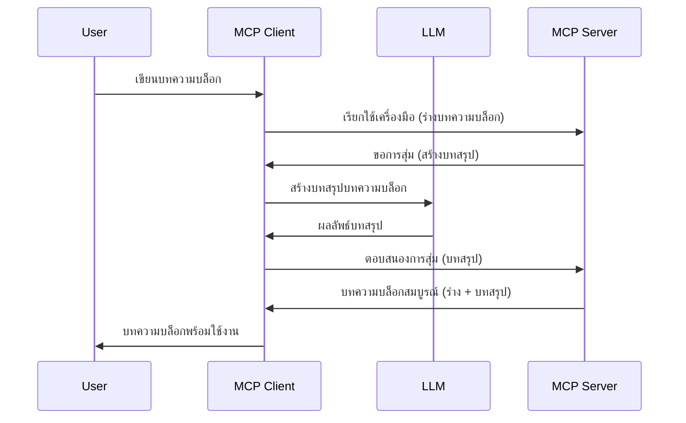

# Sampling - มอบหมายฟีเจอร์ให้กับ Client

บางครั้ง คุณอาจต้องการให้ MCP Client และ MCP Server ทำงานร่วมกันเพื่อบรรลุเป้าหมายร่วมกัน คุณอาจมีกรณีที่ Server ต้องการความช่วยเหลือจาก LLM ที่อยู่บน client สำหรับสถานการณ์นี้ sampling คือสิ่งที่คุณควรใช้

มาสำรวจกรณีการใช้งานและวิธีการสร้างโซลูชันที่เกี่ยวข้องกับ sampling กันเถอะ

## ภาพรวม

ในบทเรียนนี้ เราจะเน้นอธิบายว่าเมื่อใดและที่ใดควรใช้ Sampling และวิธีการตั้งค่ามัน

## วัตถุประสงค์การเรียนรู้

ในบทนี้ เราจะ:

- อธิบายว่า Sampling คืออะไรและเมื่อใดควรใช้
- แสดงวิธีการตั้งค่า Sampling ใน MCP
- ให้ตัวอย่างของ Sampling ในการใช้งานจริง

## Sampling คืออะไรและทำไมต้องใช้?

Sampling เป็นฟีเจอร์ขั้นสูงที่ทำงานในลักษณะดังนี้:


### คำขอ Sampling

ตอนนี้เรามีภาพรวมกว้างของสถานการณ์สมเหตุสมผลแล้ว มาพูดถึงคำขอ sampling ที่ server ส่งกลับไปยัง client กัน คำขอดังกล่าวสามารถเป็นไปตามรูปแบบ JSON-RPC แบบนี้:

```json
{
  "jsonrpc": "2.0",
  "id": 1,
  "method": "sampling/createMessage",
  "params": {
    "messages": [
      {
        "role": "user",
        "content": {
          "type": "text",
          "text": "Create a blog post summary of the following blog post: <BLOG POST>"
        }
      }
    ],
    "modelPreferences": {
      "hints": [
        {
          "name": "claude-3-sonnet"
        }
      ],
      "intelligencePriority": 0.8,
      "speedPriority": 0.5
    },
    "systemPrompt": "You are a helpful assistant.",
    "maxTokens": 100
  }
}
```

มีบางประเด็นที่ควรกล่าวถึง:

- Prompt ภายใต้ content -> text คือข้อความ prompt ของเราที่เป็นคำสั่งให้ LLM สรุปเนื้อหาบทความบล็อก

- **modelPreferences** ส่วนนี้เป็นเพียงคำแนะนำเกี่ยวกับการตั้งค่าที่ควรใช้กับ LLM ผู้ใช้สามารถเลือกว่าจะดำเนินตามคำแนะนำเหล่านี้หรือเปลี่ยนแปลงก็ได้ ในกรณีนี้มีคำแนะนำเกี่ยวกับโมเดลที่ใช้และลำดับความสำคัญด้านความเร็วและความฉลาด
- **systemPrompt** นี่คือ prompt ระบบปกติของคุณที่มอบบุคลิกภาพให้กับ LLM และประกอบด้วยคำแนะนำใช้งาน
- **maxTokens** นี่เป็นคุณสมบัติอีกหนึ่งอย่างที่ใช้สำหรับระบุจำนวน tokens ที่แนะนำให้ใช้สำหรับงานนี้

### การตอบสนอง Sampling

การตอบสนองนี้คือสิ่งที่ MCP Client ส่งกลับไปยัง MCP Server และเป็นผลลัพธ์ของการที่ client เรียกใช้ LLM รอการตอบกลับ และจากนั้นจัดทำข้อความนี้ขึ้นมาได้ ตัวอย่างด้านล่างแสดงคำตอบในรูปแบบ JSON-RPC:

```json
{
  "jsonrpc": "2.0",
  "id": 1,
  "result": {
    "role": "assistant",
    "content": {
      "type": "text",
      "text": "Here's your abstract <ABSTRACT>"
    },
    "model": "gpt-5",
    "stopReason": "endTurn"
  }
}
```

สังเกตว่าการตอบกลับเป็นบทคัดย่อของบทความบล็อกตามที่เราขอ นอกจากนี้สังเกตว่า `model` ที่ใช้ไม่ใช่ที่เราขอ แต่เป็น "gpt-5" แทน "claude-3-sonnet" ซึ่งแสดงให้เห็นว่าผู้ใช้สามารถเปลี่ยนใจเรื่องการเลือกใช้ และคำขอ sampling ของคุณเป็นเพียงคำแนะนำเท่านั้น

ตอนนี้ที่เราเข้าใจโฟลว์หลักและงานที่ใช้ได้ "การสร้างบทความบล็อก + บทคัดย่อ" แล้ว มาดูกันว่าจะต้องทำอะไรเพื่อให้มันทำงานได้

### ประเภทข้อความ

ข้อความ sampling ไม่จำกัดแค่ข้อความเท่านั้น แต่คุณยังสามารถส่งรูปภาพและเสียงได้ด้วย นี่คือลักษณะที่ JSON-RPC แตกต่างกัน:

**ข้อความ**

```json
{
  "type": "text",
  "text": "The message content"
}
```

**เนื้อหารูปภาพ**

```json
{
  "type": "image",
  "data": "base64-encoded-image-data",
  "mimeType": "image/jpeg"
}
```

**เนื้อหาเสียง**

```json
{
  "type": "audio",
  "data": "base64-encoded-audio-data",
  "mimeType": "audio/wav"
}
```

> NOTE: สำหรับข้อมูลละเอียดเพิ่มเติมเกี่ยวกับ Sampling โปรดดูที่ [เอกสารอย่างเป็นทางการ](https://modelcontextprotocol.io/specification/2025-06-18/client/sampling)

## วิธีตั้งค่า Sampling ใน Client

> หมายเหตุ: ถ้าคุณสร้างแค่ server ไม่จำเป็นต้องทำอะไรมากที่นี่

ใน client คุณต้องกำหนดฟีเจอร์ต่อไปนี้เช่นนี้:

```json
{
  "capabilities": {
    "sampling": {}
  }
}
```

ซึ่งจะถูกเลือกใช้เมื่อ client ที่คุณเลือกเริ่มทำงานร่วมกับ server

## ตัวอย่างการใช้งาน Sampling - สร้างบทความบล็อก

มาลองเขียน sampling server ด้วยกัน เราจะต้องทำดังนี้:

1. สร้างเครื่องมือบน Server
1. เครื่องมือนั้นควรสร้างคำขอ sampling
1. รอคำขอ sampling จาก client ให้ตอบกลับ
1. จากนั้นผลลัพธ์ของเครื่องมือควรถูกสร้างขึ้น

มาดูโค้ดทีละขั้นตอน:

### -1- สร้างเครื่องมือ

**python**

```python
@mcp.tool()
async def create_blog(title: str, content: str, ctx: Context[ServerSession, None]) -> str:
    """Create a blog post and generate a summary"""

```

### -2- สร้างคำขอ sampling

ขยายเครื่องมือของคุณด้วยโค้ดต่อไปนี้:

**python**

```python
post = BlogPost(
        id=len(posts) + 1,
        title=title,
        content=content,
        abstract=""
    )

prompt = f"Create an abstract of the following blog post: title: {title} and draft: {content} "

result = await ctx.session.create_message(
        messages=[
            SamplingMessage(
                role="user",
                content=TextContent(type="text", text=prompt),
            )
        ],
        max_tokens=100,
)

```

### -3- รอการตอบกลับและส่งคืนผลลัพธ์

**python**

```python
post.abstract = result.content.text

posts.append(post)

# ส่งคืนผลิตภัณฑ์ครบถ้วน
return json.dumps({
    "id": post.title,
    "abstract": post.abstract
})
```

### -4- โค้ดเต็ม

**python**

```python
from starlette.applications import Starlette
from starlette.routing import Mount, Host

from mcp.server.fastmcp import Context, FastMCP

from mcp.server.session import ServerSession
from mcp.types import SamplingMessage, TextContent

import json


from uuid import uuid4
from typing import List
from pydantic import BaseModel


mcp = FastMCP("Blog post generator")

# app = FastAPI()

posts = []

class BlogPost(BaseModel):
    id: int
    title: str
    content: str
    abstract: str

posts: List[BlogPost] = []

@mcp.tool()
async def create_blog(title: str, content: str, ctx: Context[ServerSession, None]) -> str:
    """Create a blog post and generate a summary"""

    post = BlogPost(
        id=len(posts) + 1,
        title=title,
        content=content,
        abstract=""
    )

    prompt = f"Create an abstract of the following blog post: title: {title} and draft: {content} "

    result = await ctx.session.create_message(
        messages=[
            SamplingMessage(
                role="user",
                content=TextContent(type="text", text=prompt),
            )
        ],
        max_tokens=100,
    )

    post.abstract = result.content.text

    posts.append(post)

    # ส่งคืนโพสต์บล็อกฉบับสมบูรณ์
    return json.dumps({
        "id": post.title,
        "abstract": post.abstract
    })

if __name__ == "__main__":
    print("Starting server...")
    # mcp.run()
    mcp.run(transport="streamable-http")

# เรียกใช้งานแอปด้วย: python server.py
```

### -5- ทดสอบใน Visual Studio Code

เพื่อทดสอบใน Visual Studio Code ให้ทำดังนี้:

1. เริ่ม server ในเทอร์มินัล
1. เพิ่มมันลงใน *mcp.json* (และตรวจสอบว่าเริ่มทำงานแล้ว) ตัวอย่างเช่น:

   ```json
   "servers": {
      "blog-server": {
        "type": "http",
        "url": "http://localhost:8000/mcp"
      }
   }
   ```

1. พิมพ์ prompt:

   ```text
   create a blog post named "Where Python comes from", the content is "Python is actually named after Monty Python Flying Circus"
   ```

1. อนุญาตให้เกิด sampling ครั้งแรกที่คุณทดสอบนี้ คุณจะได้รับกล่องโต้ตอบเพิ่มเติมที่ต้องยอมรับ จากนั้นจะเห็นกล่องโต้ตอบปกติสำหรับขอให้คุณรันเครื่องมือ

1. ตรวจสอบผลลัพธ์ คุณจะเห็นผลลัพธ์ทั้งในรูปแบบที่แสดงอย่างสวยงามใน GitHub Copilot Chat และยังสามารถตรวจสอบผล JSON ดิบได้

**โบนัส** Visual Studio Code มีเครื่องมือที่รองรับการ sampling อย่างดี คุณสามารถตั้งค่าการเข้าถึง Sampling บน server ที่ติดตั้งโดยทำตามนี้:

1. ไปที่ส่วน extension
1. เลือกไอคอนฟันเฟืองของ server ที่ติดตั้งในส่วน "MCP SERVERS - INSTALLED"
1. เลือก "Configure Model Access" ที่นี่คุณสามารถเลือกโมเดลที่ GitHub Copilot สามารถใช้เมื่อต้องทำ sampling ได้ คุณยังสามารถดูคำขอ sampling ที่เกิดขึ้นล่าสุดโดยเลือก "Show Sampling requests"

## การบ้าน

ในการบ้านนี้ คุณจะสร้าง Sampling ที่แตกต่างเล็กน้อย นั่นคือการผสาน sampling ที่รองรับการสร้างคำอธิบายสินค้า นี่คือตัวอย่างสถานการณ์ของคุณ:

**สถานการณ์**: พนักงานหลังบ้านของอีคอมเมิร์ซต้องการความช่วยเหลือ การสร้างคำอธิบายสินค้าใช้เวลานานเกินไป ดังนั้นคุณจึงต้องสร้างโซลูชันที่สามารถเรียกใช้เครื่องมือชื่อ "create_product" กับอาร์กิวเมนต์ "title" และ "keywords" และจะต้องสร้างสินค้าที่สมบูรณ์รวมถึงช่อง "description" ซึ่งควรจะถูกเติมโดย LLM ของ client

TIP: ใช้สิ่งที่คุณได้เรียนรู้ก่อนหน้านี้ในการสร้าง server และเครื่องมือโดยใช้คำขอ sampling

## โซลูชัน

[Solution](./solution/README.md)

## ข้อคิดสำคัญ

Sampling คือฟีเจอร์ทรงพลังที่ช่วยให้ server มอบหมายงานให้ client เมื่อจำเป็นต้องใช้ความช่วยเหลือจาก LLM

## ต่อไปคืออะไร

- [บทที่ 4 - การใช้งานเชิงปฏิบัติ](../../04-PracticalImplementation/README.md)

---

<!-- CO-OP TRANSLATOR DISCLAIMER START -->
**ข้อจำกัดความรับผิดชอบ**:  
เอกสารนี้ได้รับการแปลโดยใช้บริการแปลภาษาด้วย AI [Co-op Translator](https://github.com/Azure/co-op-translator) ขณะที่เราพยายามให้ความถูกต้อง โปรดทราบว่าการแปลอัตโนมัติอาจมีข้อผิดพลาดหรือความไม่แม่นยำ เอกสารต้นฉบับในภาษาต้นทางควรถูกพิจารณาเป็นแหล่งข้อมูลที่เชื่อถือได้ สำหรับข้อมูลสำคัญ แนะนำให้ใช้การแปลโดยผู้เชี่ยวชาญมนุษย์ เราไม่รับผิดชอบต่อความเข้าใจผิดหรือการตีความที่ผิดพลาดใด ๆ ที่เกิดจากการใช้การแปลนี้
<!-- CO-OP TRANSLATOR DISCLAIMER END -->