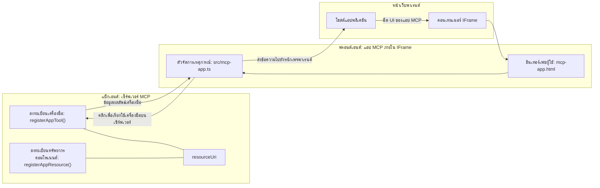

# MCP Apps

MCP Apps คือรูปแบบใหม่ใน MCP แนวคิดคือไม่เพียงแค่ตอบกลับด้วยข้อมูลจากการเรียกใช้เครื่องมือเท่านั้น แต่ยังให้ข้อมูลเกี่ยวกับวิธีการโต้ตอบกับข้อมูลนั้นด้วย นั่นหมายความว่าผลลัพธ์ของเครื่องมือสามารถมีข้อมูล UI ได้ ทำไมเราถึงต้องการแบบนั้น? ลองพิจารณาวิธีที่คุณทำวันนี้ คุณน่าจะใช้ผลลัพธ์ของ MCP Server โดยวาง frontend บางประเภทไว้ข้างหน้า ซึ่งเป็นโค้ดที่คุณต้องเขียนและดูแลรักษา บางครั้งนั่นคือสิ่งที่คุณต้องการ แต่บางครั้งจะดีมากถ้าคุณสามารถนำข้อมูลที่มีทุกอย่างไม่ว่าจะเป็นข้อมูลหรืออินเทอร์เฟซผู้ใช้มาใช้ได้ทันที

## ภาพรวม

บทเรียนนี้ให้คำแนะนำเชิงปฏิบัติเกี่ยวกับ MCP Apps วิธีเริ่มต้นใช้งานและวิธีผสานรวมกับ Web Apps ที่มีอยู่ของคุณ MCP Apps เป็นส่วนเสริมใหม่มากในมาตรฐาน MCP

## วัตถุประสงค์การเรียนรู้

เมื่อจบบทเรียนนี้ คุณจะสามารถ:

- อธิบายว่า MCP Apps คืออะไร
- เมื่อไรควรใช้ MCP Apps
- สร้างและผสานรวม MCP Apps ของคุณเอง

## MCP Apps - ทำงานอย่างไร

แนวคิดของ MCP Apps คือการให้การตอบกลับที่เป็นองค์ประกอบ (component) ที่สามารถแสดงผลได้ องค์ประกอบนี้สามารถมีทั้งภาพและการโต้ตอบ เช่น การคลิกปุ่ม การป้อนข้อมูลผู้ใช้ และอื่นๆ เริ่มต้นด้วยฝั่งเซิร์ฟเวอร์และ MCP Server ของเรา เพื่อสร้าง MCP App component คุณต้องสร้างเครื่องมือและทรัพยากรของแอปพลิเคชัน สองส่วนนี้เชื่อมต่อกันด้วย resourceUri

นี่คือตัวอย่าง ลองมองภาพรวมว่าเกี่ยวข้องกับอะไรและส่วนใดทำหน้าที่อะไร:

```text
server.ts -- responsible for registering tools and the component as a UI component
src/
  mcp-app.ts -- wiring up event handlers
mcp-app.html -- the user interface
```
  
ภาพนี้อธิบายสถาปัตยกรรมสำหรับการสร้างคอมโพเนนต์และตรรกะของมัน


ลองอธิบายบทบาทของส่วน backend และ frontend ตามลำดับ

### ฝั่ง backend

มีสองสิ่งที่ต้องทำให้สำเร็จที่นี่:

- ลงทะเบียนเครื่องมือที่ต้องการโต้ตอบด้วย
- กำหนดคอมโพเนนต์

**การลงทะเบียนเครื่องมือ**

```typescript
registerAppTool(
    server,
    "get-time",
    {
      title: "Get Time",
      description: "Returns the current server time.",
      inputSchema: {},
      _meta: { ui: { resourceUri } }, // ลิงก์เครื่องมือนี้ไปยังแหล่งข้อมูล UI ของมัน
    },
    async () => {
      const time = new Date().toISOString();
      return { content: [{ type: "text", text: time }] };
    },
  );

```
  
โค้ดข้างต้นอธิบายพฤติกรรม โดยจะเปิดเผยเครื่องมือชื่อ `get-time` ซึ่งไม่มีอินพุตแต่ส่งผลลัพธ์เป็นเวลาปัจจุบันได้ เราสามารถกำหนด `inputSchema` สำหรับเครื่องมือที่ต้องรับอินพุตจากผู้ใช้ได้

**การลงทะเบียนคอมโพเนนต์**

ในไฟล์เดียวกัน ต้องลงทะเบียนคอมโพเนนต์ด้วย:

```typescript
const resourceUri = "ui://get-time/mcp-app.html";

// ลงทะเบียนทรัพยากร ซึ่งจะส่งกลับ HTML/JavaScript ที่รวมไว้สำหรับ UI.
registerAppResource(
  server,
  resourceUri,
  resourceUri,
  { mimeType: RESOURCE_MIME_TYPE },
  async () => {
    const html = await fs.readFile(path.join(DIST_DIR, "mcp-app.html"), "utf-8");

    return {
    contents: [
        { uri: resourceUri, mimeType: RESOURCE_MIME_TYPE, text: html },
    ],
    };
  },
);
```
  
สังเกตที่เรากล่าวถึง `resourceUri` เพื่อเชื่อมคอมโพเนนต์กับเครื่องมือที่เกี่ยวข้อง อีกประเด็นคือ callback ที่โหลดไฟล์ UI และส่งคืนคอมโพเนนต์

### ฝั่ง frontend ของคอมโพเนนต์

เช่นเดียวกับ backend มีสองส่วน:

- frontend ที่เขียนด้วย HTML ล้วนๆ
- โค้ดที่จัดการเหตุการณ์และกระทำ เช่น เรียกใช้เครื่องมือหรือส่งข้อความไปยังหน้าต่างหลัก

**อินเทอร์เฟซผู้ใช้**

มาดูอินเทอร์เฟซผู้ใช้กัน

```html
<!-- mcp-app.html -->
<!DOCTYPE html>
<html lang="en">
  <head>
    <meta charset="UTF-8" />
    <title>Get Time App</title>
  </head>
  <body>
    <p>
      <strong>Server Time:</strong> <code id="server-time">Loading...</code>
    </p>
    <button id="get-time-btn">Get Server Time</button>
    <script type="module" src="/src/mcp-app.ts"></script>
  </body>
</html>
```
  
**การเชื่อมต่อเหตุการณ์**

ส่วนสุดท้ายคือการเชื่อมต่อเหตุการณ์ ซึ่งหมายความว่าเราจะกำหนดว่าส่วนใดใน UI ของเราต้องการตัวจัดการเหตุการณ์และจะทำอย่างไรเมื่อเกิดเหตุการณ์ขึ้น

```typescript
// mcp-app.ts

import { App } from "@modelcontextprotocol/ext-apps";

// ดึงอ้างอิงองค์ประกอบ
const serverTimeEl = document.getElementById("server-time")!;
const getTimeBtn = document.getElementById("get-time-btn")!;

// สร้างอินสแตนซ์แอป
const app = new App({ name: "Get Time App", version: "1.0.0" });

// จัดการผลลัพธ์เครื่องมือจากเซิร์ฟเวอร์ ตั้งค่าก่อน `app.connect()` เพื่อหลีกเลี่ยง
// การพลาดผลลัพธ์เครื่องมือเริ่มต้น
app.ontoolresult = (result) => {
  const time = result.content?.find((c) => c.type === "text")?.text;
  serverTimeEl.textContent = time ?? "[ERROR]";
};

// เชื่อมต่อการคลิกปุ่ม
getTimeBtn.addEventListener("click", async () => {
  // `app.callServerTool()` ให้ UI ขอข้อมูลใหม่จากเซิร์ฟเวอร์
  const result = await app.callServerTool({ name: "get-time", arguments: {} });
  const time = result.content?.find((c) => c.type === "text")?.text;
  serverTimeEl.textContent = time ?? "[ERROR]";
});

// เชื่อมต่อกับโฮสต์
app.connect();
```
  
จากโค้ดข้างต้น คุณจะเห็นว่าเป็นโค้ดปกติสำหรับเชื่อมต่อ DOM element กับเหตุการณ์ สิ่งที่น่าสนใจคือการเรียก `callServerTool` ซึ่งจะเรียกเครื่องมือใน backend

## การจัดการกับข้อมูลที่ผู้ใช้ป้อน

จนถึงตอนนี้เราเห็นคอมโพเนนต์ที่มีปุ่มที่เมื่อถูกคลิกจะเรียกเครื่องมือ มาดูว่าจะเพิ่มส่วน UI เช่นช่องป้อนข้อมูลและส่งอาร์กิวเมนต์ไปยังเครื่องมือได้อย่างไร เราจะทำฟังก์ชัน FAQ ขึ้นมา วิธีการทำงานควรเป็นดังนี้:

- ควรมีปุ่มและช่องป้อนข้อมูลที่ผู้ใช้พิมพ์คำสำคัญเพื่อค้นหา เช่น "Shipping" และกดปุ่ม เครื่องมือนี้จะเรียกบน backend เพื่อตรวจค้นข้อมูล FAQ
- มีเครื่องมือที่รองรับการค้นหา FAQ ดังกล่าว

เพิ่มการรองรับที่จำเป็นในฝั่ง backend ก่อน:

```typescript
const faq: { [key: string]: string } = {
    "shipping": "Our standard shipping time is 3-5 business days.",
    "return policy": "You can return any item within 30 days of purchase.",
    "warranty": "All products come with a 1-year warranty covering manufacturing defects.",
  }

registerAppTool(
    server,
    "get-faq",
    {
      title: "Search FAQ",
      description: "Searches the FAQ for relevant answers.",
      inputSchema: zod.object({
        query: zod.string().default("shipping"),
      }),
      _meta: { ui: { resourceUri: faqResourceUri } }, // ลิงก์เครื่องมือนี้กับทรัพยากร UI ของมัน
    },
    async ({ query }) => {
      const answer: string = faq[query.toLowerCase()] || "Sorry, I don't have an answer for that.";
      return { content: [{ type: "text", text: answer }] };
    },
  );
```
  
สิ่งที่เห็นคือวิธีการกำหนด `inputSchema` และให้ schema ของ `zod` ดังนี้:

```typescript
inputSchema: zod.object({
  query: zod.string().default("shipping"),
})
```
  
ใน schema ข้างต้น เราระบุว่ามีพารามิเตอร์อินพุตที่ชื่อว่า `query` ซึ่งเป็นอ็อปชันและมีค่าเริ่มต้นเป็น "shipping"

ดี เรามาดู *mcp-app.html* เพื่อดู UI ที่ต้องสร้าง:

```html
<div class="faq">
    <h1>FAQ response</h1>
    <p>FAQ Response: <code id="faq-response">Loading...</code></p>
    <input type="text" id="faq-query" placeholder="Enter FAQ query" />
    <button id="get-faq-btn">Get FAQ Response</button>
  </div>
```
  
เยี่ยม ตอนนี้เรามีช่องป้อนข้อมูลและปุ่ม มาต่อที่ *mcp-app.ts* เพื่อเชื่อมต่อเหตุการณ์กันเถอะ:

```typescript
const getFaqBtn = document.getElementById("get-faq-btn")!;
const faqQueryInput = document.getElementById("faq-query") as HTMLInputElement;

getFaqBtn.addEventListener("click", async () => {
  const query = faqQueryInput.value;
  const result = await app.callServerTool({ name: "get-faq", arguments: { query } });
  const faq = result.content?.find((c) => c.type === "text")?.text;
  faqResponseEl.textContent = faq ?? "[ERROR]";
});
```
  
ในโค้ดข้างต้น เราได้:

- สร้างตัวอ้างอิงไปยังองค์ประกอบใน UI ที่โต้ตอบได้
- จัดการกับการคลิกปุ่มเพื่อแยกค่าในช่องป้อนข้อมูล และเรียก `app.callServerTool()` โดยมี `name` และ `arguments` โดย `arguments` ส่งค่า `query`

สิ่งที่เกิดขึ้นเมื่อคุณเรียก `callServerTool` คือมันส่งข้อความไปยังหน้าต่างหลัก และหน้าต่างนั้นจะเรียก MCP Server

### ลองใช้ดู

เมื่อลองใช้ดู เราควรเห็นดังนี้:


และนี่คือการลองกับอินพุตเช่น "warranty"


เพื่อรันโค้ดนี้ ไปที่ [Code section](./code/README.md)

## การทดสอบใน Visual Studio Code

Visual Studio Code มีการสนับสนุน MCP Apps ที่ดี และน่าจะเป็นวิธีที่ง่ายที่สุดวิธีหนึ่งในการทดสอบ MCP Apps ของคุณ เพื่อใช้ Visual Studio Code ให้เพิ่มรายการเซิร์ฟเวอร์ใน *mcp.json* ดังนี้:

```json
"my-mcp-server-7178eca7": {
    "url": "http://localhost:3001/mcp",
    "type": "http"
  }
```
  
จากนั้นเริ่มเซิร์ฟเวอร์ คุณจะสามารถสื่อสารกับ MCP App ของคุณผ่านหน้าต่างแชทได้ ตราบใดที่คุณได้ติดตั้ง GitHub Copilot

คุณสามารถเรียกมันด้วย prompt เช่น "#get-faq":


และเหมือนกับตอนที่รันผ่านเว็บเบราว์เซอร์ มันจะแสดงผลแบบเดียวกันดังนี้:


## การบ้าน

สร้างเกมเป่ายิ้งฉุบ ประกอบด้วย:

UI:

- รายการแบบ drop down ที่มีตัวเลือก
- ปุ่มส่งคำตอบ
- ป้ายแสดงใครเลือกอะไรและใครชนะ

เซิร์ฟเวอร์:

- มีเครื่องมือ rock paper scissor ที่รับอินพุตชื่อ "choice" และแสดงผลการเลือกของคอมพิวเตอร์พร้อมตัดสินผู้ชนะ

## เฉลย

[Solution](./assignment/README.md)

## สรุป

เราได้เรียนรู้เกี่ยวกับรูปแบบใหม่ของ MCP Apps ซึ่งเป็นรูปแบบที่ช่วยให้ MCP Servers มีความเห็นไม่เพียงแต่เรื่องข้อมูล แต่ยังรวมถึงวิธีการนำเสนอข้อมูลเหล่านั้นด้วย

นอกจากนี้ เรายังได้เรียนรู้ว่า MCP Apps จะถูกโฮสต์ใน IFrame และเพื่อสื่อสารกับ MCP Servers จะต้องส่งข้อความไปยังเว็บแอปหลัก มีไลบรารีหลายตัวสำหรับ JavaScript ปกติ React และอื่นๆ ที่ช่วยให้ง่ายในการสื่อสารนี้

## สิ่งที่ได้เรียนรู้

นี่คือสิ่งที่คุณได้เรียนรู้:

- MCP Apps เป็นมาตรฐานใหม่ที่มีประโยชน์เมื่อคุณต้องการส่งทั้งข้อมูลและฟีเจอร์ UI
- แอปประเภทนี้ทำงานใน IFrame ด้วยเหตุผลด้านความปลอดภัย

## ถัดไป

- [บทที่ 4](../../04-PracticalImplementation/README.md)

---

<!-- CO-OP TRANSLATOR DISCLAIMER START -->
**ข้อจำกัดความรับผิดชอบ**:  
เอกสารนี้ได้ถูกแปลโดยใช้บริการแปลภาษา AI [Co-op Translator](https://github.com/Azure/co-op-translator) แม้เราจะพยายามให้ความถูกต้องสูงสุด โปรดทราบว่าการแปลอัตโนมัติอาจมีข้อผิดพลาดหรือความไม่ถูกต้อง เอกสารต้นฉบับในภาษาต้นทางถือเป็นแหล่งข้อมูลที่เชื่อถือได้ สำหรับข้อมูลสำคัญควรใช้การแปลโดยมนุษย์มืออาชีพ เราไม่รับผิดชอบต่อความเข้าใจผิดหรือการตีความผิดที่เกิดจากการใช้การแปลนี้
<!-- CO-OP TRANSLATOR DISCLAIMER END -->