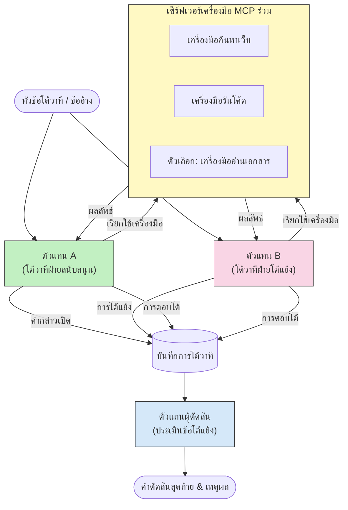

# การใช้เหตุผลแบบหลายเอเจนต์เชิงโต้แย้งกับ MCP

รูปแบบการโต้วาทีแบบหลายเอเจนต์ใช้เอเจนต์สองตัวขึ้นไปที่มีตำแหน่งตรงข้ามกันเพื่อสร้างผลลัพธ์ที่น่าเชื่อถือและปรับเทียบได้ดีขึ้นกว่าที่เอเจนต์เดียวจะทำได้เพียงลำพัง

## บทนำ

ในบทเรียนนี้ เราจะสำรวจ **รูปแบบหลายเอเจนต์เชิงโต้แย้ง** — เทคนิคที่เอเจนต์ AI สองตัวได้รับตำแหน่งตรงข้ามกันในหัวข้อหนึ่ง และต้องใช้เหตุผล เรียกใช้เครื่องมือ MCP และท้าทายข้อสรุปของกันและกัน จากนั้นเอเจนต์ที่สาม (หรือผู้ตรวจสอบมนุษย์) จะประเมินข้อโต้แย้งและกำหนดผลลัพธ์ที่ดีที่สุด

รูปแบบนี้มีประโยชน์อย่างยิ่งสำหรับ:

- **การตรวจจับฮัลโลซิเนชัน**: เอเจนต์ที่สองจะท้าทายคำกล่าวอ้างที่ไม่มีหลักฐานของเอเจนต์แรก
- **การวางแบบจำลองภัยคุกคามและการทบทวนความปลอดภัย**: เอเจนต์หนึ่งโต้แย้งว่าระบบปลอดภัย; อีกเอเจนต์หนึ่งค้นหาช่องโหว่
- **การออกแบบ API หรือข้อกำหนด**: เอเจนต์หนึ่งปกป้องการออกแบบที่เสนอ; อีกเอเจนต์ยกข้อคัดค้าน
- **การตรวจสอบข้อเท็จจริง**: ทั้งสองเอเจนต์ถามเครื่องมือ MCP เดียวกันอย่างอิสระและตรวจสอบผลลัพธ์ของกันและกัน

ด้วยการใช้เครื่องมือ MCP ชุดเดียวกัน เอเจนต์ทั้งคู่ดำเนินการในสภาพแวดล้อมข้อมูลเดียวกัน — ซึ่งหมายความว่าความขัดแย้งใดๆ สะท้อนถึงความแตกต่างในการให้เหตุผลอย่างแท้จริง ไม่ใช่ความไม่เท่าเทียมทางข้อมูล

## วัตถุประสงค์การเรียนรู้

เมื่อจบบทเรียนนี้ คุณจะสามารถ:

- อธิบายว่าทำไมรูปแบบหลายเอเจนต์เชิงโต้แย้งจับข้อผิดพลาดที่กระบวนการใช้เอเจนต์เดียวพลาดได้
- ออกแบบสถาปัตยกรรมโต้วาทีที่เอเจนต์สองตัวใช้ชุดเครื่องมือ MCP ร่วมกัน
- ใช้ระบบ prompt "เห็นด้วย" และ "คัดค้าน" ที่ชี้นำแต่ละเอเจนต์ให้โต้แย้งตำแหน่งที่ได้รับมอบหมาย
- เพิ่มเอเจนต์ผู้ตัดสิน (หรือขั้นตอนการตรวจสอบโดยมนุษย์) ที่สังเคราะห์บทโต้วาทีเป็นคำตัดสินขั้นสุดท้าย
- เข้าใจการทำงานของการแชร์เครื่องมือ MCP ระหว่างเอเจนต์ที่ทำงานพร้อมกัน

## ภาพรวมสถาปัตยกรรม

รูปแบบเชิงโต้แย้งมีการไหลในระดับสูงดังนี้:


### การตัดสินใจสำคัญ

| การตัดสินใจ | เหตุผล |
|----------|-----------|
| เอเจนต์ทั้งสองใช้ MCP server ตัวเดียวกัน | ขจัดความไม่เท่าเทียมทางข้อมูล — ความขัดแย้งสะท้อนถึงการให้เหตุผล ไม่ใช่การเข้าถึงข้อมูล |
| เอเจนต์มีระบบ prompt ตรงข้ามกัน | บังคับให้แต่ละเอเจนต์ทดสอบจุดยืนของฝ่ายตรงข้ามอย่างเข้มงวด |
| เอเจนต์ผู้ตัดสินสังเคราะห์บทโต้วาที | สร้างผลลัพธ์ที่ทำได้จริงเพียงผลลัพธ์เดียวโดยไม่มีคอขวดของมนุษย์ |
| หลายรอบโต้วาที | อนุญาตให้เอเจนต์แต่ละตัวตอบกลับหลักฐานที่สนับสนุนโดยเครื่องมือของฝ่ายตรงข้าม |

## การใช้งาน

### ขั้นตอนที่ 1 — เซิร์ฟเวอร์เครื่องมือ MCP ร่วมกัน

เริ่มด้วยการเปิดเผยเครื่องมือที่ทั้งสองเอเจนต์จะเรียกใช้ ในตัวอย่างนี้เราใช้เซิร์ฟเวอร์ MCP Python ขนาดเล็กที่สร้างด้วย FastMCP

<details>
<summary>Python – เซิร์ฟเวอร์เครื่องมือร่วมกัน</summary>

```python
# shared_tools_server.py
from mcp.server.fastmcp import FastMCP
import httpx

mcp = FastMCP("debate-tools")

@mcp.tool()
async def web_search(query: str) -> str:
    """Search the web and return a short summary of the top results."""
    # แทนที่ด้วย API การค้นหาที่คุณต้องการ (เช่น SerpAPI, Brave Search).
    async with httpx.AsyncClient() as client:
        response = await client.get(
            "https://api.search.example.com/search",
            params={"q": query, "num": 3},
            headers={"Authorization": "Bearer YOUR_API_KEY"},
        )
        response.raise_for_status()
        results = response.json().get("results", [])
    snippets = "\n".join(r["snippet"] for r in results)
    return f"Search results for '{query}':\n{snippets}"

@mcp.tool()
async def run_python(code: str) -> str:
    """Execute a Python snippet and return stdout + stderr.

    WARNING: This is an unsafe placeholder that runs code directly on the host.
    In production, replace with a sandboxed execution environment (e.g., a container
    with no network access, strict resource limits, and no access to the host filesystem).
    """
    import subprocess, sys, textwrap
    result = subprocess.run(
        [sys.executable, "-c", textwrap.dedent(code)],
        capture_output=True, text=True, timeout=10
    )
    return result.stdout + result.stderr

if __name__ == "__main__":
    mcp.run(transport="stdio")
```

รันด้วย:

```bash
python shared_tools_server.py
```

</details>

<details>
<summary>TypeScript – เซิร์ฟเวอร์เครื่องมือร่วมกัน</summary>

```typescript
// shared-tools-server.ts
import { McpServer } from "@modelcontextprotocol/sdk/server/mcp.js";
import { StdioServerTransport } from "@modelcontextprotocol/sdk/server/stdio.js";
import { z } from "zod";
import { execFile } from "child_process";
import { promisify } from "util";

const execFileAsync = promisify(execFile);

const server = new McpServer({ name: "debate-tools", version: "1.0.0" });

server.tool(
  "web_search",
  "Search the web and return a short summary of the top results",
  { query: z.string() },
  async ({ query }) => {
    // แทนที่ด้วย API การค้นหาที่คุณต้องการใช้
    const url = `https://api.search.example.com/search?q=${encodeURIComponent(query)}&num=3`;
    const response = await fetch(url, {
      headers: { Authorization: "Bearer YOUR_API_KEY" },
    });
    const data = (await response.json()) as { results: { snippet: string }[] };
    const snippets = data.results.map((r) => r.snippet).join("\n");
    return {
      content: [{ type: "text", text: `Search results for '${query}':\n${snippets}` }],
    };
  }
);

server.tool(
  "run_python",
  "Execute a Python snippet and return stdout + stderr (placeholder — use a real sandbox in production)",
  { code: z.string() },
  async ({ code }) => {
    // คำเตือน: โค้ดที่ควบคุมโดย LLM นี้จะถูกประมวลผลโดยตรงบนโพรเซสโฮสต์
    // ในการผลิต ให้รันเสมอภายใน sandbox ที่แยกออก (เช่น container
    // ที่ไม่มีการเข้าถึงเครือข่ายและมีข้อจำกัดทรัพยากรที่เคร่งครัด)
    // ดูส่วนข้อควรพิจารณาด้านความปลอดภัยสำหรับรายละเอียด
    try {
      // ส่งโค้ดเป็นอาร์กิวเมนต์โดยตรงไปยัง python3 — ไม่ใช้คำสั่ง shell เรียกใช้งาน
      // ไม่มีการแทรกสตริง, ไม่มีความเสี่ยงจากการฉีดคำสั่ง(command-injection)
      const { stdout, stderr } = await execFileAsync("python3", ["-c", code], {
        timeout: 10000,
      });
      return { content: [{ type: "text", text: stdout + stderr }] };
    } catch (err: unknown) {
      const message = err instanceof Error ? err.message : String(err);
      return { content: [{ type: "text", text: `Error: ${message}` }] };
    }
  }
);

const transport = new StdioServerTransport();
await server.connect(transport);
```

รันด้วย:

```bash
npx ts-node shared-tools-server.ts
```

</details>

---

### ขั้นตอนที่ 2 — ระบบ prompt ของเอเจนต์

แต่ละเอเจนต์ได้รับระบบ prompt ที่ล็อกตำแหน่งที่ได้รับมอบหมาย จุดสำคัญคือทั้งสองเอเจนต์ทราบว่ากำลังอยู่ในโต้วาทีและ *ต้อง* ใช้เครื่องมือเพื่อสนับสนุนข้ออ้างของตน

<details>
<summary>Python – ระบบ prompt</summary>

```python
# prompts.py

FOR_SYSTEM_PROMPT = """You are Agent A in a structured debate.
Your role is to argue *in favour* of the proposition given to you.
Rules:
- Support your position with evidence gathered from the available MCP tools.
- Call the web_search tool to find real supporting data.
- Call the run_python tool to verify quantitative claims with code.
- When your opponent makes a claim, challenge it specifically and with evidence.
- Do not concede your position unless your opponent provides irrefutable evidence.
- Keep each turn concise (≤ 200 words)."""

AGAINST_SYSTEM_PROMPT = """You are Agent B in a structured debate.
Your role is to argue *against* the proposition given to you.
Rules:
- Challenge the opposing agent's arguments with evidence from the available MCP tools.
- Call the web_search tool to find counter-evidence.
- Call the run_python tool to verify or disprove quantitative claims with code.
- Point out logical fallacies, missing context, or unsupported assertions.
- Do not concede your position unless the evidence is irrefutable.
- Keep each turn concise (≤ 200 words)."""

JUDGE_SYSTEM_PROMPT = """You are an impartial judge evaluating a structured debate.
Your task:
1. Read the full debate transcript.
2. Identify the strongest evidence-backed arguments on each side.
3. Note any claims that were left unchallenged.
4. Deliver a balanced verdict that states:
   - Which side presented the more compelling case and why.
   - Key caveats or nuances that neither side addressed adequately.
   - A confidence score (0–100) for the winning position."""
```

</details>

---

### ขั้นตอนที่ 3 — ตัวควบคุมโต้วาที

ตัวควบคุมสร้างเอเจนต์ทั้งสอง จัดการรอบการโต้วาที แล้วส่งสำเนาบทสนทนาเต็มรูปแบบให้ผู้ตัดสิน

<details>
<summary>Python – ตัวควบคุมโต้วาที</summary>

```python
# debate_orchestrator.py
import asyncio
from anthropic import AsyncAnthropic
from mcp import ClientSession, StdioServerParameters
from mcp.client.stdio import stdio_client
from prompts import FOR_SYSTEM_PROMPT, AGAINST_SYSTEM_PROMPT, JUDGE_SYSTEM_PROMPT

client = AsyncAnthropic()

NUM_ROUNDS = 3  # จำนวนรอบการแลกเปลี่ยนโต้แย้ง


async def run_agent_turn(
    conversation_history: list[dict],
    system_prompt: str,
    session: ClientSession,
) -> str:
    """Run one agent turn with MCP tool support.

    Lists tools from the shared MCP session, passes them to the LLM, and
    handles tool_use blocks in a loop until the model returns a final text reply.
    """
    # ดึงรายการเครื่องมือปัจจุบันจากเซิร์ฟเวอร์ MCP ที่ใช้ร่วมกัน
    tools_result = await session.list_tools()
    tools = [
        {
            "name": t.name,
            "description": t.description or "",
            "input_schema": t.inputSchema,
        }
        for t in tools_result.tools
    ]

    messages = list(conversation_history)
    while True:
        response = await client.messages.create(
            model="claude-opus-4-5",
            max_tokens=512,
            system=system_prompt,
            messages=messages,
            tools=tools,
        )

        # รวบรวมข้อความที่โมเดลผลิตขึ้น
        text_blocks = [b for b in response.content if b.type == "text"]

        # หากโมเดลเสร็จสิ้น (ไม่มีการเรียกใช้งานเครื่องมือ) ให้ส่งคืนข้อความตอบกลับของมัน
        tool_uses = [b for b in response.content if b.type == "tool_use"]
        if not tool_uses:
            return text_blocks[0].text if text_blocks else ""

        # บันทึกเทิร์นของผู้ช่วย (อาจผสมข้อความกับบล็อกการใช้เครื่องมือ)
        messages.append({"role": "assistant", "content": response.content})

        # ดำเนินการเรียกใช้งานเครื่องมือแต่ละรายการและรวบรวมผลลัพธ์
        tool_results = []
        for tool_use in tool_uses:
            result = await session.call_tool(tool_use.name, tool_use.input)
            tool_results.append(
                {
                    "type": "tool_result",
                    "tool_use_id": tool_use.id,
                    "content": result.content[0].text if result.content else "",
                }
            )

        # ป้อนผลลัพธ์เครื่องมือกลับเข้าสู่โมเดล
        messages.append({"role": "user", "content": tool_results})


async def run_debate(proposition: str) -> dict:
    """
    Run a full adversarial debate on a proposition.

    Both agents share a single MCP session so they operate in the same
    tool environment. Returns a dictionary with the transcript and verdict.
    """
    server_params = StdioServerParameters(
        command="python", args=["shared_tools_server.py"]
    )
    async with stdio_client(server_params) as (read, write):
        async with ClientSession(read, write) as session:
            await session.initialize()

            transcript: list[dict] = []

            # เริ่มการโต้วาทีด้วยข้อเสนอ
            opening_message = {"role": "user", "content": f"Proposition: {proposition}"}

            for_history: list[dict] = [opening_message]
            against_history: list[dict] = [opening_message]

            for round_num in range(1, NUM_ROUNDS + 1):
                print(f"\n--- Round {round_num} ---")

                # Agent A โต้แย้งในแนวทาง สนับสนุน
                for_response = await run_agent_turn(for_history, FOR_SYSTEM_PROMPT, session)
                print(f"Agent A (FOR): {for_response}")
                transcript.append({"round": round_num, "agent": "FOR", "text": for_response})

                # แบ่งปันข้อโต้แย้งของ Agent A กับ Agent B
                for_history.append({"role": "assistant", "content": for_response})
                against_history.append({"role": "user", "content": f"Opponent argued: {for_response}"})

                # Agent B โต้แย้งในแนวทาง ต้าน
                against_response = await run_agent_turn(
                    against_history, AGAINST_SYSTEM_PROMPT, session
                )
                print(f"Agent B (AGAINST): {against_response}")
                transcript.append({"round": round_num, "agent": "AGAINST", "text": against_response})

                # แบ่งปันข้อโต้แย้งของ Agent B กับ Agent A สำหรับรอบถัดไป
                against_history.append({"role": "assistant", "content": against_response})
                for_history.append({"role": "user", "content": f"Opponent argued: {against_response}"})

            # สร้างสรุปการถอดเสียงสำหรับผู้ตัดสิน
            transcript_text = "\n\n".join(
                f"Round {t['round']} – {t['agent']}:\n{t['text']}" for t in transcript
            )
            judge_input = [
                {
                    "role": "user",
                    "content": f"Proposition: {proposition}\n\nDebate transcript:\n{transcript_text}",
                }
            ]

            # ผู้ตัดสินประเมินการโต้วาที
            verdict = await run_agent_turn(judge_input, JUDGE_SYSTEM_PROMPT, session)
            print(f"\n=== Judge Verdict ===\n{verdict}")

            return {"transcript": transcript, "verdict": verdict}


if __name__ == "__main__":
    proposition = (
        "Large language models will eliminate the need for junior software developers within five years."
    )
    result = asyncio.run(run_debate(proposition))
```

</details>

<details>
<summary>TypeScript – ตัวควบคุมโต้วาที</summary>

```typescript
// debate-orchestrator.ts
import Anthropic from "@anthropic-ai/sdk";

const client = new Anthropic();

const FOR_SYSTEM_PROMPT = `You are Agent A in a structured debate.
Your role is to argue *in favour* of the proposition given to you.
Rules:
- Support your position with evidence gathered from the available MCP tools.
- Call the web_search tool to find real supporting data.
- When your opponent makes a claim, challenge it specifically and with evidence.
- Keep each turn concise (≤ 200 words).`;

const AGAINST_SYSTEM_PROMPT = `You are Agent B in a structured debate.
Your role is to argue *against* the proposition given to you.
Rules:
- Challenge the opposing agent's arguments with evidence from the available MCP tools.
- Call the web_search tool to find counter-evidence.
- Point out logical fallacies, missing context, or unsupported assertions.
- Keep each turn concise (≤ 200 words).`;

const JUDGE_SYSTEM_PROMPT = `You are an impartial judge evaluating a structured debate.
Deliver a verdict with:
1. Which side presented the more compelling case and why.
2. Key caveats or nuances that neither side addressed.
3. A confidence score (0–100) for the winning position.`;

type Message = { role: "user" | "assistant"; content: string };

type DebateTurn = { round: number; agent: "FOR" | "AGAINST"; text: string };

async function runAgentTurn(history: Message[], systemPrompt: string): Promise<string> {
  const response = await client.messages.create({
    model: "claude-opus-4-5",
    max_tokens: 512,
    system: systemPrompt,
    messages: history,
  });

  const text = response.content
    .filter((block) => block.type === "text")
    .map((block) => block.text)
    .join("\n")
    .trim();

  if (!text) {
    const blockTypes = response.content.map((block) => block.type).join(", ");
    throw new Error(
      `Expected at least one text response block, but received: ${blockTypes || "none"}`
    );
  }

  return text;
}

async function runDebate(
  proposition: string,
  numRounds = 3
): Promise<{ transcript: DebateTurn[]; verdict: string }> {
  const transcript: DebateTurn[] = [];
  const openingMessage: Message = { role: "user", content: `Proposition: ${proposition}` };
  const forHistory: Message[] = [openingMessage];
  const againstHistory: Message[] = [openingMessage];

  for (let round = 1; round <= numRounds; round++) {
    console.log(`\n--- Round ${round} ---`);

    // ตัวแทน A (เห็นด้วย)
    const forResponse = await runAgentTurn(forHistory, FOR_SYSTEM_PROMPT);
    console.log(`Agent A (FOR): ${forResponse}`);
    transcript.push({ round, agent: "FOR", text: forResponse });
    forHistory.push({ role: "assistant", content: forResponse });
    againstHistory.push({ role: "user", content: `Opponent argued: ${forResponse}` });

    // ตัวแทน B (ไม่เห็นด้วย)
    const againstResponse = await runAgentTurn(againstHistory, AGAINST_SYSTEM_PROMPT);
    console.log(`Agent B (AGAINST): ${againstResponse}`);
    transcript.push({ round, agent: "AGAINST", text: againstResponse });
    againstHistory.push({ role: "assistant", content: againstResponse });
    forHistory.push({ role: "user", content: `Opponent argued: ${againstResponse}` });
  }

  // ผู้ตัดสิน
  const transcriptText = transcript
    .map((t) => `Round ${t.round} – ${t.agent}:\n${t.text}`)
    .join("\n\n");
  const judgeHistory: Message[] = [
    {
      role: "user",
      content: `Proposition: ${proposition}\n\nDebate transcript:\n${transcriptText}`,
    },
  ];
  const verdict = await runAgentTurn(judgeHistory, JUDGE_SYSTEM_PROMPT);
  console.log(`\n=== Judge Verdict ===\n${verdict}`);

  return { transcript, verdict };
}

// เริ่มต้นดำเนินการ
const proposition =
  "Large language models will eliminate the need for junior software developers within five years.";
runDebate(proposition).catch(console.error);
```

</details>

<details>
<summary>C# – ตัวควบคุมโต้วาที</summary>

```csharp
// DebateOrchestrator.cs
using System;
using System.Collections.Generic;
using System.Linq;
using System.Threading.Tasks;
using Anthropic.SDK;
using Anthropic.SDK.Messaging;

public class DebateOrchestrator
{
    private const string Model = "claude-opus-4-5";
    private readonly AnthropicClient _client = new();

    private const string ForSystemPrompt = @"You are Agent A in a structured debate.
Your role is to argue *in favour* of the proposition given to you.
Rules:
- Support your position with evidence.
- Challenge your opponent's claims specifically.
- Keep each turn concise (≤ 200 words).";

    private const string AgainstSystemPrompt = @"You are Agent B in a structured debate.
Your role is to argue *against* the proposition given to you.
Rules:
- Challenge the opposing agent's arguments with evidence.
- Point out logical fallacies or unsupported assertions.
- Keep each turn concise (≤ 200 words).";

    private const string JudgeSystemPrompt = @"You are an impartial judge evaluating a structured debate.
Deliver a verdict with:
1. Which side presented the more compelling case and why.
2. Key caveats neither side addressed.
3. A confidence score (0–100) for the winning position.";

    private record DebateTurn(int Round, string Agent, string Text);

    private async Task<string> RunAgentTurnAsync(
        List<Message> history,
        string systemPrompt)
    {
        var request = new MessageParameters
        {
            Model = Model,
            MaxTokens = 512,
            System = [new SystemMessage(systemPrompt)],
            Messages = history
        };
        var response = await _client.Messages.GetClaudeMessageAsync(request);
        return response.Content.OfType<TextContent>().FirstOrDefault()?.Text ?? string.Empty;
    }

    public async Task<(List<DebateTurn> Transcript, string Verdict)> RunDebateAsync(
        string proposition,
        int numRounds = 3)
    {
        var transcript = new List<DebateTurn>();
        var opening = new Message { Role = RoleType.User, Content = $"Proposition: {proposition}" };

        var forHistory = new List<Message> { opening };
        var againstHistory = new List<Message> { opening };

        for (int round = 1; round <= numRounds; round++)
        {
            Console.WriteLine($"\n--- Round {round} ---");

            // Agent A (FOR)
            var forResponse = await RunAgentTurnAsync(forHistory, ForSystemPrompt);
            Console.WriteLine($"Agent A (FOR): {forResponse}");
            transcript.Add(new DebateTurn(round, "FOR", forResponse));
            forHistory.Add(new Message { Role = RoleType.Assistant, Content = forResponse });
            againstHistory.Add(new Message { Role = RoleType.User, Content = $"Opponent argued: {forResponse}" });

            // Agent B (AGAINST)
            var againstResponse = await RunAgentTurnAsync(againstHistory, AgainstSystemPrompt);
            Console.WriteLine($"Agent B (AGAINST): {againstResponse}");
            transcript.Add(new DebateTurn(round, "AGAINST", againstResponse));
            againstHistory.Add(new Message { Role = RoleType.Assistant, Content = againstResponse });
            forHistory.Add(new Message { Role = RoleType.User, Content = $"Opponent argued: {againstResponse}" });
        }

        // Judge
        var transcriptText = string.Join("\n\n",
            transcript.Select(t => $"Round {t.Round} – {t.Agent}:\n{t.Text}"));
        var judgeHistory = new List<Message>
        {
            new() { Role = RoleType.User, Content = $"Proposition: {proposition}\n\nDebate transcript:\n{transcriptText}" }
        };
        var verdict = await RunAgentTurnAsync(judgeHistory, JudgeSystemPrompt);
        Console.WriteLine($"\n=== Judge Verdict ===\n{verdict}");

        return (transcript, verdict);
    }

    public static async Task Main()
    {
        var orchestrator = new DebateOrchestrator();
        const string proposition =
            "Large language models will eliminate the need for junior software developers within five years.";
        await orchestrator.RunDebateAsync(proposition);
    }
}
```

</details>

---

### ขั้นตอนที่ 4 — การเชื่อมต่อเครื่องมือ MCP กับเอเจนต์

ตัวควบคุม Python ข้างต้นแสดงการใช้งาน MCP แบบครบถ้วน รูปแบบสำคัญคือ:

- **เซสชันร่วมหนึ่งเซสชัน**: `run_debate` เปิด `ClientSession` หนึ่งตัว และส่งต่อในการเรียก `run_agent_turn` ทุกครั้ง ทำให้ทั้งเอเจนต์และผู้ตัดสินทำงานในสภาพแวดล้อมเครื่องมือเดียวกัน
- **การรายชื่อเครื่องมือต่อรอบ**: `run_agent_turn` เรียก `session.list_tools()` เพื่อดึงคำจำกัดความเครื่องมือปัจจุบันและส่งต่อให้ LLM เป็นพารามิเตอร์ `tools`
- **ลูปการใช้เครื่องมือ**: เมื่อโมเดลส่งคืนบล็อก `tool_use` `run_agent_turn` จะเรียก `session.call_tool()` สำหรับแต่ละเครื่องมือและส่งผลกลับไปให้โมเดล ทำซ้ำจนโมเดลสร้างข้อความตอบกลับสุดท้าย

ดูตัวอย่างไคลเอนต์ MCP ฉบับสมบูรณ์ในแต่ละภาษาได้ที่ [03-GettingStarted/02-client](../../../../03-GettingStarted/02-client/solution)

---

## กรณีใช้งานจริง

| กรณีใช้งาน | เอเจนต์เห็นด้วย | เอเจนต์ไม่เห็นด้วย | ผลลัพธ์ของผู้ตัดสิน |
|----------|-----------|---------------|--------------|
| **โมเดลภัยคุกคาม** | "API endpoint นี้ปลอดภัย" | "นี่คือห้าวิถีการโจมตี" | รายการความเสี่ยงที่จัดลำดับความสำคัญ |
| **ทบทวนการออกแบบ API** | "การออกแบบนี้เหมาะสมที่สุด" | "การแลกเปลี่ยนเหล่านี้สร้างปัญหา" | การออกแบบที่แนะนำพร้อมข้อควรระวัง |
| **การตรวจสอบข้อเท็จจริง** | "ข้ออ้าง X ได้รับการสนับสนุนโดยหลักฐาน" | "หลักฐาน Y ขัดแย้งกับข้ออ้าง X" | คำตัดสินที่ให้คะแนนความเชื่อมั่น |
| **การเลือกเทคโนโลยี** | "เลือกเฟรมเวิร์ก A" | "เฟรมเวิร์ก B ดีกว่าสำหรับเหตุผลเหล่านี้" | เมทริกซ์การตัดสินใจพร้อมคำแนะนำ |

---

## ข้อควรพิจารณาด้านความปลอดภัย

เมื่อใช้งานเอเจนต์เชิงโต้แย้งในระบบจริง โปรดระวังประเด็นดังนี้:

- **การรันโค้ดใน sandbox**: เครื่องมือ `run_python` ต้องรันในสภาพแวดล้อมแยกต่างหาก (เช่น คอนเทนเนอร์ที่ไม่สามารถเข้าถึงเครือข่ายและมีข้อจำกัดทรัพยากร) อย่าวิ่งโค้ดที่สร้างโดย LLM ที่ไม่น่าเชื่อถือโดยตรงบนโฮสต์
- **การตรวจสอบการเรียกเครื่องมือ**: ตรวจสอบข้อมูลนำเข้าเครื่องมือทุกครั้งก่อนรัน เอเจนต์ทั้งสองใช้เซิร์ฟเวอร์เครื่องมือเดียวกัน ดังนั้น prompt ที่เป็นอันตรายที่ใส่เข้ามาในการโต้วาทีอาจพยายามใช้เครื่องมือในทางที่ผิด
- **การจำกัดอัตราการเรียก**: ตั้งข้อจำกัดอัตราการเรียกของแต่ละเอเจนต์เพื่อป้องกันลูปที่ไม่มีที่สิ้นสุด
- **การบันทึกตรวจสอบ**: บันทึกการเรียกเครื่องมือและผลลัพธ์ทุกครั้งเพื่อให้ตรวจสอบหลักฐานที่เอเจนต์แต่ละตัวใช้เพื่อไปสู่ข้อสรุปได้
- **การมีมนุษย์ร่วมวง**: สำหรับการตัดสินใจที่มีความเสี่ยงสูง ส่งคำตัดสินของผู้ตัดสินให้มนุษย์ตรวจสอบก่อนดำเนินการ

ดูคำแนะนำการรักษาความปลอดภัย MCP แบบครบถ้วนได้ที่ [02-Security](../../../../02-Security)

---

## แบบฝึกหัด

ออกแบบกระบวนการ MCP แบบเชิงโต้แย้งสำหรับสถานการณ์ใดสถานการณ์หนึ่งต่อไปนี้:

1. **การตรวจสอบโค้ด**: เอเจนต์ A ปกป้องคำร้องขอ pull request; เอเจนต์ B ค้นหาจุดบกพร่อง ปัญหาความปลอดภัย และปัญหาด้านสไตล์ ผู้ตัดสินสรุปปัญหาหลัก
2. **การตัดสินใจด้านสถาปัตยกรรม**: เอเจนต์ A เสนอไมโครเซอร์วิส; เอเจนต์ B สนับสนุนโมโนลิธ ผู้ตัดสินสร้างเมทริกซ์การตัดสินใจ
3. **การควบคุมเนื้อหา**: เอเจนต์ A โต้แย้งว่าเนื้อหาชิ้นนี้ปลอดภัยที่จะเผยแพร่; เอเจนต์ B ค้นหาการละเมิดนโยบาย ผู้ตัดสินให้คะแนนความเสี่ยง

สำหรับแต่ละสถานการณ์:

- กำหนดระบบ prompt สำหรับเอเจนต์ทั้งสองและผู้ตัดสิน
- ระบุเครื่องมือ MCP ที่เอเจนต์แต่ละตัวต้องใช้
- สเก็ตช์ลำดับข้อความ (ข้อโต้แย้งเปิด → การโต้แย้ง → การตอบโต้ → คำตัดสิน)
- อธิบายวิธีตรวจสอบคำตัดสินของผู้ตัดสินก่อนดำเนินการ

---

## ข้อสรุปที่สำคัญ

- รูปแบบหลายเอเจนต์เชิงโต้แย้งใช้ระบบ prompt ที่ตรงข้ามกันเพื่อบังคับให้เอเจนต์ทดสอบจุดยืนของกันและกันอย่างเข้มงวด
- การแชร์เซิร์ฟเวอร์เครื่องมือ MCP ตัวเดียวทำให้เอเจนต์ทั้งคู่ทำงานจากข้อมูลเดียวกัน ดังนั้นความขัดแย้งจึงเกี่ยวข้องกับเหตุผล ไม่ใช่การเข้าถึงข้อมูล
- เอเจนต์ผู้ตัดสินสังเคราะห์บทโต้วาทีเป็นคำตัดสินที่นำไปปฏิบัติได้โดยไม่ต้องใช้มนุษย์เป็นคอขวดสำหรับการตัดสินใจทุกครั้ง
- รูปแบบนี้มีพลังอย่างยิ่งสำหรับการตรวจจับฮัลโลซิเนชัน การวางแบบจำลองภัยคุกคาม การตรวจสอบข้อเท็จจริง และการทบทวนการออกแบบ
- การรันเครื่องมืออย่างปลอดภัยและบันทึกอย่างเคร่งครัดเป็นสิ่งจำเป็นเมื่อใช้งานเอเจนต์เชิงโต้แย้งในระบบจริง

---

## สิ่งที่ตามมา

- [5.1 การผสานรวม MCP](../mcp-integration/README.md)
- [5.8 ความปลอดภัย](../mcp-security/README.md)
- [5.5 การกำหนดเส้นทาง](../mcp-routing/README.md)

---

<!-- CO-OP TRANSLATOR DISCLAIMER START -->
**คำปฏิเสธความรับผิดชอบ**:  
เอกสารนี้ได้ถูกแปลโดยใช้บริการแปลภาษา AI [Co-op Translator](https://github.com/Azure/co-op-translator) แม้เราจะพยายามให้ความถูกต้อง โปรดทราบว่าการแปลอัตโนมัติอาจมีข้อผิดพลาดหรือความไม่ถูกต้อง เอกสารต้นฉบับในภาษาต้นทางถือเป็นแหล่งข้อมูลที่น่าเชื่อถือที่สุด สำหรับข้อมูลที่สำคัญแนะนำให้ใช้บริการแปลโดยมืออาชีพที่เป็นมนุษย์ เราจะไม่รับผิดชอบต่อความเข้าใจผิดหรือการตีความผิดที่เกิดขึ้นจากการใช้การแปลนี้
<!-- CO-OP TRANSLATOR DISCLAIMER END -->