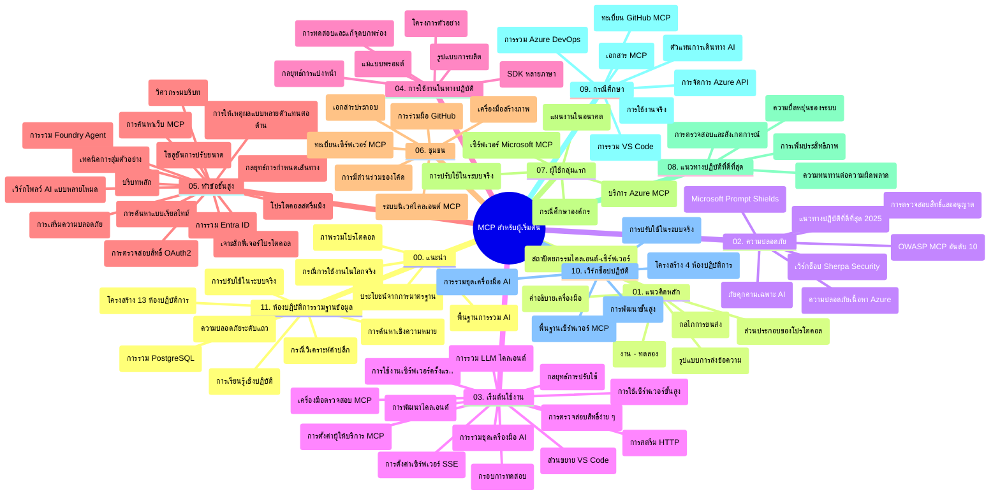

# โปรโตคอลบริบทแบบจำลอง (MCP) สำหรับผู้เริ่มต้น - คู่มือการศึกษา

คู่มือการศึกษานี้ให้ภาพรวมของโครงสร้างและเนื้อหาในที่เก็บข้อมูลสำหรับหลักสูตร "โปรโตคอลบริบทแบบจำลอง (MCP) สำหรับผู้เริ่มต้น" ใช้คู่มือนี้เพื่อนำทางในที่เก็บข้อมูลอย่างมีประสิทธิภาพและใช้ประโยชน์สูงสุดจากทรัพยากรที่มีอยู่

## ภาพรวมที่เก็บข้อมูล

โปรโตคอลบริบทแบบจำลอง (MCP) เป็นกรอบงานมาตรฐานสำหรับการโต้ตอบระหว่างโมเดล AI และแอปพลิเคชันของลูกค้า สร้างขึ้นครั้งแรกโดย Anthropic ตอนนี้ MCP ได้รับการดูแลโดยชุมชน MCP ที่กว้างขึ้นผ่านองค์กร GitHub อย่างเป็นทางการ ที่เก็บนี้มีหลักสูตรครบถ้วนพร้อมตัวอย่างโค้ดแบบปฏิบัติในภาษา C#, Java, JavaScript, Python และ TypeScript ซึ่งออกแบบมาสำหรับนักพัฒนา AI สถาปนิกระบบ และวิศวกรซอฟต์แวร์

## แผนที่หลักสูตรเชิงภาพ

## โครงสร้างที่เก็บข้อมูล

ที่เก็บข้อมูลถูกจัดเป็นสิบเอ็ดส่วนหลัก แต่ละส่วนเน้นประเด็นต่างๆ ของ MCP:

1. **บทนำ (00-Introduction/)**
   - ภาพรวมของโปรโตคอลบริบทแบบจำลอง
   - เหตุผลที่มาตรฐานมีความสำคัญในสายงาน AI
   - กรณีการใช้งานและประโยชน์เชิงปฏิบัติ

2. **แนวคิดหลัก (01-CoreConcepts/)**
   - สถาปัตยกรรมไคลเอนต์-เซิร์ฟเวอร์
   - องค์ประกอบสำคัญของโปรโตคอล
   - รูปแบบการส่งข้อความใน MCP

3. **ความปลอดภัย (02-Security/)**
   - ภัยคุกคามด้านความปลอดภัยในระบบที่ใช้ MCP
   - แนวทางปฏิบัติที่ดีที่สุดสำหรับการรักษาความปลอดภัยของการใช้งาน
   - กลยุทธ์การพิสูจน์ตัวตนและการอนุญาต
   - **เอกสารความปลอดภัยครบถ้วน**:
     - MCP Security Best Practices 2025
     - Azure Content Safety Implementation Guide
     - MCP Security Controls and Techniques
     - MCP Best Practices Quick Reference
   - **หัวข้อความปลอดภัยสำคัญ**:
     - การโจมตีด้วย prompt injection และพิษของเครื่องมือ
     - การเข้าครองเซสชันและปัญหา confused deputy
     - ช่องโหว่ token passthrough
     - สิทธิ์เกินจำเป็นและการควบคุมการเข้าถึง
     - ความปลอดภัยในห่วงโซ่อุปทานสำหรับส่วนประกอบ AI
     - การผนวกรวม Microsoft Prompt Shields

4. **เริ่มต้นใช้งาน (03-GettingStarted/)**
   - การตั้งค่าและกำหนดค่าสภาพแวดล้อม
   - การสร้าง MCP เซิร์ฟเวอร์และไคลเอนต์พื้นฐาน
   - การผนวกรวมกับแอปพลิเคชันที่มีอยู่
   - รวมส่วนสำหรับ:
     - การพัฒนาเซิร์ฟเวอร์ตัวแรก
     - การพัฒนาไคลเอนต์
     - การผนวกรวมไคลเอนต์ LLM
     - การผนวกรวม VS Code
     - เซิร์ฟเวอร์ Server-Sent Events (SSE)
     - การใช้งานเซิร์ฟเวอร์ระดับสูง
     - การสตรีม HTTP
     - การผนวกรวม AI Toolkit
     - กลยุทธ์การทดสอบ
     - แนวทางการปรับใช้

5. **การใช้งานเชิงปฏิบัติ (04-PracticalImplementation/)**
   - การใช้ SDK ในภาษาการเขียนโปรแกรมต่างๆ
   - เทคนิคการแก้ไขปัญหา ทดสอบ และตรวจสอบความถูกต้อง
   - การสร้างเทมเพลต prompt และเวิร์กโฟลว์ที่นำกลับมาใช้ใหม่ได้
   - โปรเจกต์ตัวอย่างพร้อมตัวอย่างการใช้งาน

6. **หัวข้อขั้นสูง (05-AdvancedTopics/)**
   - เทคนิคการวิศวกรรมบริบท
   - การผนวกรวมตัวแทน Foundry
   - เวิร์กโฟลว์ AI แบบหลายโหมด
   - ตัวอย่างการพิสูจน์ตัวตน OAuth2
   - ความสามารถการค้นหาแบบเรียลไทม์
   - การสตรีมแบบเรียลไทม์
   - การใช้งานบริบทหลัก (root contexts)
   - กลยุทธ์การกำหนดเส้นทาง (routing)
   - เทคนิคการสุ่มตัวอย่าง (sampling)
   - วิธีปรับขนาด
   - ข้อพิจารณาด้านความปลอดภัย
   - การผนวกรวมความปลอดภัย Entra ID
   - การผนวกรวมการค้นหาเว็บ
   - การถกเถียงแบบ multi-agent adversarial reasoning (รูปแบบ debate)

7. **การมีส่วนร่วมของชุมชน (06-CommunityContributions/)**
   - วิธีการร่วมเขียนโค้ดและเอกสาร
   - การร่วมมือผ่าน GitHub
   - การปรับปรุงและข้อเสนอแนะโดยชุมชน
   - การใช้ไคลเอนต์ MCP ต่างๆ (Claude Desktop, Cline, VSCode)
   - การทำงานกับ MCP เซิร์ฟเวอร์ยอดนิยมรวมถึงการสร้างภาพ

8. **บทเรียนจากการนำไปใช้ครั้งแรก (07-LessonsfromEarlyAdoption/)**
   - การใช้งานจริงและเรื่องราวความสำเร็จ
   - การสร้างและปรับใช้โซลูชันที่ใช้ MCP
   - แนวโน้มและแผนงานในอนาคต
   - **คู่มือ Microsoft MCP Servers**: คู่มือครบถ้วนสำหรับเซิร์ฟเวอร์ Microsoft MCP 10 ตัวที่พร้อมใช้งานในผลิตภัณฑ์รวมถึง:
     - Microsoft Learn Docs MCP Server
     - Azure MCP Server (เชื่อมต่อเฉพาะทางมากกว่า 15 รายการ)
     - GitHub MCP Server
     - Azure DevOps MCP Server
     - MarkItDown MCP Server
     - SQL Server MCP Server
     - Playwright MCP Server
     - Dev Box MCP Server
     - Azure AI Foundry MCP Server
     - Microsoft 365 Agents Toolkit MCP Server

9. **แนวทางปฏิบัติที่ดีที่สุด (08-BestPractices/)**
   - การปรับจูนประสิทธิภาพและการเพิ่มประสิทธิผล
   - การออกแบบระบบ MCP ที่ทนทานต่อความผิดพลาด
   - กลยุทธ์การทดสอบและความยืดหยุ่น

10. **กรณีศึกษา (09-CaseStudy/)**
    - **เจ็ดกรณีศึกษาครบถ้วน** แสดงให้เห็นความหลากหลายของ MCP ในสถานการณ์ต่างๆ:
    - **Azure AI Travel Agents**: การประสานงาน multi-agent ด้วย Azure OpenAI และ AI Search
    - **การผนวกรวม Azure DevOps**: อัตโนมัติกระบวนการเวิร์กโฟลว์ด้วยการอัปเดตข้อมูล YouTube
    - **การดึงเอกสารแบบเรียลไทม์**: ไคลเอนต์คอนโซล Python พร้อมสตรีม HTTP
    - **เครื่องมือสร้างแผนการศึกษาแบบโต้ตอบ**: เว็บแอป Chainlit พร้อม AI สนทนา
    - **เอกสารในตัวแก้ไข**: การผนวกรวม VS Code กับเวิร์กโฟลว์ GitHub Copilot
    - **การจัดการ API ของ Azure**: การผนวกรวม API สำหรับองค์กรพร้อมการสร้าง MCP server
    - **GitHub MCP Registry**: การพัฒนา ecosystem และแพลตฟอร์มการผนวกรวมเชิง agentic
    - ตัวอย่างการใช้งานครอบคลุมการผนวกรวมองค์กร การเพิ่มประสิทธิภาพนักพัฒนา และพัฒนา ecosystem

11. **เวิร์กช็อปเชิงปฏิบัติ (10-StreamliningAIWorkflowsBuildingAnMCPServerWithAIToolkit/)**
    - เวิร์กช็อปเชิงปฏิบัติครบถ้วน ผสมผสาน MCP กับ AI Toolkit
    - สร้างแอปอัจฉริยะเชื่อมไกลโมเดล AI กับเครื่องมือโลกจริง
    - โมดูลปฏิบัติครอบคลุมพื้นฐาน การพัฒนาเซิร์ฟเวอร์แบบกำหนดเอง และกลยุทธ์ปรับใช้ในผลิตภัณฑ์
    - **โครงสร้างแลป**:
      - แลป 1: พื้นฐาน MCP Server
      - แลป 2: การพัฒนา MCP Server ขั้นสูง
      - แลป 3: การผนวกรวม AI Toolkit
      - แลป 4: การปรับใช้และการปรับขนาดในผลิตภัณฑ์
    - แนวทางการเรียนรู้แบบแลปพร้อมคำแนะนำทีละขั้นตอน

12. **แลบผนวกรวมฐานข้อมูล MCP Server (11-MCPServerHandsOnLabs/)**
    - **เส้นทางการเรียนรู้แลปครบ 13 ชุด** สำหรับสร้าง MCP server พร้อมใช้งานในผลิตภัณฑ์ที่ผนวกรวม PostgreSQL
    - **การใช้งานจริงด้านวิเคราะห์ค้าปลีก** ใช้กรณีศึกษาร้าน Zava Retail
    - **รูปแบบระดับองค์กร** รวม Row Level Security (RLS), การค้นหาเชิงความหมาย และการเข้าถึงข้อมูลแบบ multi-tenant
    - **โครงสร้างแลปครบถ้วน**:
      - **แลป 00-03: พื้นฐาน** - บทนำ สถาปัตยกรรม ความปลอดภัย การตั้งค่าสภาพแวดล้อม
      - **แลป 04-06: การสร้าง MCP Server** - การออกแบบฐานข้อมูล การใช้งาน MCP Server การพัฒนาเครื่องมือ
      - **แลป 07-09: ฟีเจอร์ขั้นสูง** - การค้นหาเชิงความหมาย การทดสอบและแก้ไขข้อผิดพลาด การผนวกรวม VS Code
      - **แลป 10-12: การผลิตและแนวทางปฏิบัติที่ดีที่สุด** - การปรับใช้ การตรวจสอบ การเพิ่มประสิทธิภาพ
    - **เทคโนโลยีที่ครอบคลุม**: FastMCP framework, PostgreSQL, Azure OpenAI, Azure Container Apps, Application Insights
    - **ผลลัพธ์การเรียนรู้**: MCP server พร้อมใช้งานในผลิตภัณฑ์ รูปแบบการผนวกรวมฐานข้อมูล การวิเคราะห์ด้วย AI ความปลอดภัยระดับองค์กร

## ทรัพยากรเพิ่มเติม

ที่เก็บนี้รวมทรัพยากรสนับสนุนไว้ด้วย:

- **โฟลเดอร์รูปภาพ**: มีแผนภาพและภาพประกอบที่ใช้ตลอดหลักสูตร
- **การแปลภาษา**: สนับสนุนหลายภาษา พร้อมการแปลเอกสารอัตโนมัติ
- **ทรัพยากร MCP อย่างเป็นทางการ**:
  - [MCP Documentation](https://modelcontextprotocol.io/)
  - [MCP Specification](https://spec.modelcontextprotocol.io/)
  - [MCP GitHub Repository](https://github.com/modelcontextprotocol)

## วิธีใช้ที่เก็บนี้

1. **การเรียนรู้แบบลำดับ**: ติดตามบทต่างๆ ตามลำดับ (00 ถึง 11) เพื่อประสบการณ์การเรียนรู้ที่มีโครงสร้าง
2. **เน้นภาษาการเขียนโปรแกรมเฉพาะ**: หากสนใจภาษาการเขียนโปรแกรมใด ให้สำรวจไดเรกทอรีตัวอย่างเพื่อดูการใช้งานในภาษาที่ต้องการ
3. **การใช้งานเชิงปฏิบัติ**: เริ่มที่ส่วน "Getting Started" เพื่อตั้งค่าสภาพแวดล้อมและสร้าง MCP เซิร์ฟเวอร์และไคลเอนต์ตัวแรกของคุณ
4. **การสำรวจขั้นสูง**: เมื่อเข้าใจพื้นฐานแล้ว ลงลึกในหัวข้อขั้นสูงเพื่อขยายความรู้
5. **การมีส่วนร่วมของชุมชน**: ร่วมชุมชน MCP ผ่านการสนทนา GitHub และช่อง Discord เพื่อเชื่อมต่อกับผู้เชี่ยวชาญและนักพัฒนาคนอื่นๆ

## ไคลเอนต์และเครื่องมือ MCP

หลักสูตรครอบคลุมไคลเอนต์และเครื่องมือ MCP หลายตัว:

1. **ไคลเอนต์อย่างเป็นทางการ**:
   - Visual Studio Code
   - MCP ใน Visual Studio Code
   - Claude Desktop
   - Claude ใน VSCode
   - Claude API

2. **ไคลเอนต์ชุมชน**:
   - Cline (บนเทอร์มินัล)
   - Cursor (ตัวแก้ไขโค้ด)
   - ChatMCP
   - Windsurf

3. **เครื่องมือจัดการ MCP**:
   - MCP CLI
   - MCP Manager
   - MCP Linker
   - MCP Router

## MCP เซิร์ฟเวอร์ยอดนิยม

ที่เก็บนี้แนะนำ MCP เซิร์ฟเวอร์ต่างๆ รวมถึง:

1. **เซิร์ฟเวอร์ Microsoft MCP อย่างเป็นทางการ**:
   - Microsoft Learn Docs MCP Server
   - Azure MCP Server (เชื่อมต่อเฉพาะทางมากกว่า 15 รายการ)
   - GitHub MCP Server
   - Azure DevOps MCP Server
   - MarkItDown MCP Server
   - SQL Server MCP Server
   - Playwright MCP Server
   - Dev Box MCP Server
   - Azure AI Foundry MCP Server
   - Microsoft 365 Agents Toolkit MCP Server

2. **เซิร์ฟเวอร์อ้างอิงอย่างเป็นทางการ**:
   - ไฟล์ระบบ
   - Fetch
   - ความจำ (Memory)
   - การคิดเชิงลำดับ (Sequential Thinking)

3. **การสร้างภาพ**:
   - Azure OpenAI DALL-E 3
   - Stable Diffusion WebUI
   - Replicate

4. **เครื่องมือพัฒนา**:
   - Git MCP
   - Terminal Control
   - Code Assistant

5. **เซิร์ฟเวอร์เฉพาะทาง**:
   - Salesforce
   - Microsoft Teams
   - Jira & Confluence

## การมีส่วนร่วม

ที่เก็บนี้ยินดีต้อนรับการมีส่วนร่วมจากชุมชน ดูส่วน Community Contributions เพื่อขอคำแนะนำเกี่ยวกับวิธีการร่วมโค้ดในระบบนิเวศ MCP อย่างมีประสิทธิภาพ

----

*คู่มือการศึกษานี้อัปเดตล่าสุดเมื่อวันที่ 5 กุมภาพันธ์ 2026 สะท้อน MCP Specification ฉบับล่าสุด 2025-11-25 และให้ภาพรวมของที่เก็บข้อมูล ณ วันที่นั้น เนื้อหาของที่เก็บข้อมูลอาจได้รับการอัปเดตหลังจากวันที่นี้*

---

<!-- CO-OP TRANSLATOR DISCLAIMER START -->
**ข้อจำกัดความรับผิดชอบ**:  
เอกสารนี้ได้รับการแปลโดยใช้บริการแปลภาษาอัตโนมัติ [Co-op Translator](https://github.com/Azure/co-op-translator) แม้ว่าจะพยายามให้ความถูกต้อง แต่โปรดทราบว่าการแปลอัตโนมัติอาจมีข้อผิดพลาดหรือความไม่ถูกต้อง เอกสารต้นฉบับในภาษาที่ใช้ควรถือเป็นแหล่งข้อมูลที่มีอำนาจและเป็นทางการ สำหรับข้อมูลสำคัญ แนะนำให้ใช้บริการแปลโดยมืออาชีพที่เป็นมนุษย์ เราไม่รับผิดชอบต่อความเข้าใจผิดหรือการตีความผิดที่เกิดขึ้นจากการใช้การแปลนี้
<!-- CO-OP TRANSLATOR DISCLAIMER END -->