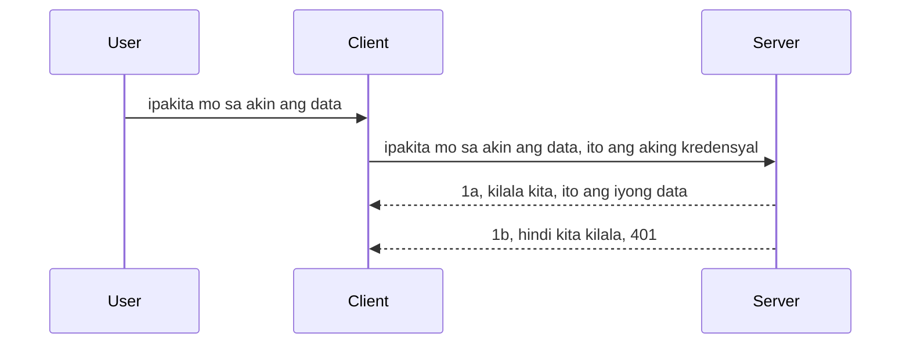

# Simple auth

Sinusuportahan ng MCP SDKs ang paggamit ng OAuth 2.1 na sa totoo lang ay isang masalimuot na proseso na kinabibilangan ng mga konsepto tulad ng auth server, resource server, pagpapadala ng mga kredensyal, pagkuha ng code, pagpapalit ng code para sa bearer token hanggang sa makuha mo na ang iyong resource data. Kung hindi ka pa sanay sa OAuth na isang mahusay na bagay na i-implementa, magandang ideya na magsimula sa isang basic na antas ng auth at unti-unting bumuo patungo sa mas mahusay at mas mataas na seguridad. Kaya narito ang kabanatang ito, upang gabayan ka patungo sa mas advanced na auth.

## Auth, ano ang ibig sabihin namin?

Ang auth ay pinaikling salita para sa authentication at authorization. Ang ideya ay kailangan nating gawin ang dalawang bagay:

- **Authentication**, na proseso ng pagtukoy kung papayagan ba nating pumasok ang isang tao sa aming tahanan, na meron silang karapatan na "narito" na ibig sabihin ay may access sila sa aming resource server kung saan naroroon ang mga tampok ng aming MCP Server.
- **Authorization**, ay proseso ng pagtukoy kung dapat bang magkaroon ng access ang isang user sa mga espesipikong resources na kanilang hinihingi, halimbawa itong mga order o itong mga produkto o kung pinapayagan silang basahin ang nilalaman ngunit hindi mag-delete bilang isa pang halimbawa.

## Kredensyal: paano namin sinasabi sa sistema kung sino kami

Karamihan ng mga web developers ay nagsisimulang mag-isip sa pagbibigay ng kredensyal sa server, karaniwang isang sikreto na nagsasabi kung pinapayagan ba silang narito sa "Authentication". Karaniwang base64 encoded version ito ng username at password o isang API key na natatangi para sa isang partikular na user.

Kasama dito ang pagpapadala nito sa pamamagitan ng header na tinatawag na "Authorization" tulad nito:

```json
{ "Authorization": "secret123" }
```

Karaniwang tinatawag itong basic authentication. Ang kabuuang daloy ay gumagana sa sumusunod na paraan:


Ngayon na nauunawaan natin kung paano ito gumagana mula sa flow na pananaw, paano natin ito i-implementa? Karamihan sa mga web server ay may konsepto na tinatawag na middleware, isang piraso ng code na tumatakbo bilang bahagi ng request na maaaring mag-verify ng mga kredensyal, at kung ang kredensyal ay valid ay pinapayagan ang request na makalusot. Kung ang request ay walang valid na kredensyal, makakatanggap ka ng error sa auth. Tingnan natin kung paano ito maaring i-implementa:

**Python**

```python
class AuthMiddleware(BaseHTTPMiddleware):
    async def dispatch(self, request, call_next):

        has_header = request.headers.get("Authorization")
        if not has_header:
            print("-> Missing Authorization header!")
            return Response(status_code=401, content="Unauthorized")

        if not valid_token(has_header):
            print("-> Invalid token!")
            return Response(status_code=403, content="Forbidden")

        print("Valid token, proceeding...")
       
        response = await call_next(request)
        # magdagdag ng anumang mga header ng customer o baguhin ang tugon sa ilang paraan
        return response


starlette_app.add_middleware(CustomHeaderMiddleware)
```

Narito ang mga mayroon tayo:

- Nilikha ang middleware na tinawag na `AuthMiddleware` kung saan ang `dispatch` method nito ay tinatawagan ng web server.
- Idinagdag ang middleware sa web server:

    ```python
    starlette_app.add_middleware(AuthMiddleware)
    ```

- Nakasulat ang validation logic na nagsusuri kung ang Authorization header ay naroroon at kung ang ipinapadalang sikreto ay valid:

    ```python
    has_header = request.headers.get("Authorization")
    if not has_header:
        print("-> Missing Authorization header!")
        return Response(status_code=401, content="Unauthorized")

    if not valid_token(has_header):
        print("-> Invalid token!")
        return Response(status_code=403, content="Forbidden")
    ```

    kung ang sikreto ay naroroon at valid ay pinapayagan naming makalusot ang request sa pamamagitan ng pagtawag sa `call_next` at ibinabalik ang response.

    ```python
    response = await call_next(request)
    # magdagdag ng anumang mga customer headers o baguhin ang tugon sa ilang paraan
    return response
    ```

Gumagana ito sa paraang kapag may web request na ginawa papunta sa server, tatawagin ang middleware at ayon sa implementasyon nito ay papayagan itong makalusot o magbabalik ng error na nagsasabing hindi pinapayagan ang client na magpatuloy.

**TypeScript**

Dito tayo gagawa ng middleware gamit ang popular na framework na Express at makokontrol ang request bago ito makarating sa MCP Server. Narito ang code para dito:

```typescript
function isValid(secret) {
    return secret === "secret123";
}

app.use((req, res, next) => {
    // 1. Mayroong Authorization header?
    if(!req.headers["Authorization"]) {
        res.status(401).send('Unauthorized');
    }
    
    let token = req.headers["Authorization"];

    // 2. Suriin ang bisa.
    if(!isValid(token)) {
        res.status(403).send('Forbidden');
    }

   
    console.log('Middleware executed');
    // 3. Ipinapasa ang kahilingan sa susunod na hakbang sa request pipeline.
    next();
});
```

Sa code na ito ay:

1. Sinusuri namin kung ang Authorization header ay naroroon sa una, kung wala, nagpapadala kami ng 401 error.
2. Tinitiyak na ang kredensyal/token ay valid, kung hindi, nagpapadala kami ng 403 error.
3. Sa huli, ipinapasa ang request sa request pipeline at ibinabalik ang hinihinging resource.

## Pagsasanay: I-implement ang authentication

Gamitin natin ang ating kaalaman at subukang i-implementa ito. Narito ang plano:

Server

- Gumawa ng web server at MCP instance.
- Mag-implement ng middleware para sa server.

Client

- Magpadala ng web request, gamit ang kredensyal, sa pamamagitan ng header.

### -1- Gumawa ng web server at MCP instance

Sa unang hakbang, kailangan nating gumawa ng web server instance at ang MCP Server.

**Python**

Dito tayo gagawa ng MCP server instance, gagawa ng starlette web app at iho-host ito gamit ang uvicorn.

```python
# gumagawa ng MCP Server

app = FastMCP(
    name="MCP Resource Server",
    instructions="Resource Server that validates tokens via Authorization Server introspection",
    host=settings["host"],
    port=settings["port"],
    debug=True
)

# gumagawa ng starlette web app
starlette_app = app.streamable_http_app()

# nagseserbisyo ng app sa pamamagitan ng uvicorn
async def run(starlette_app):
    import uvicorn
    config = uvicorn.Config(
            starlette_app,
            host=app.settings.host,
            port=app.settings.port,
            log_level=app.settings.log_level.lower(),
        )
    server = uvicorn.Server(config)
    await server.serve()

run(starlette_app)
```

Sa code na ito:

- Gumawa ng MCP Server.
- Binuo ang starlette web app mula sa MCP Server, `app.streamable_http_app()`.
- Ina-host at pinasisilbihan ang web app gamit ang uvicorn `server.serve()`.

**TypeScript**

Dito tayo gagawa ng MCP Server instance.

```typescript
const server = new McpServer({
      name: "example-server",
      version: "1.0.0"
    });

    // ... ayusin ang mga resources ng server, mga kagamitan, at mga prompt ...
```

Ang paglikha ng MCP Server na ito ay kailangang mangyari sa loob ng ating POST /mcp route definition, kaya ilipat natin ang code sa itaas ng ganito:

```typescript
import express from "express";
import { randomUUID } from "node:crypto";
import { McpServer } from "@modelcontextprotocol/sdk/server/mcp.js";
import { StreamableHTTPServerTransport } from "@modelcontextprotocol/sdk/server/streamableHttp.js";
import { isInitializeRequest } from "@modelcontextprotocol/sdk/types.js"

const app = express();
app.use(express.json());

// Mapa para itago ang mga transport ayon sa session ID
const transports: { [sessionId: string]: StreamableHTTPServerTransport } = {};

// Asikasuhin ang POST na mga kahilingan para sa komunikasyon mula kliyente papuntang server
app.post('/mcp', async (req, res) => {
  // Suriin kung mayroon nang umiiral na session ID
  const sessionId = req.headers['mcp-session-id'] as string | undefined;
  let transport: StreamableHTTPServerTransport;

  if (sessionId && transports[sessionId]) {
    // Gamitin muli ang umiiral na transport
    transport = transports[sessionId];
  } else if (!sessionId && isInitializeRequest(req.body)) {
    // Bagong kahilingan para sa inisyal na pagsisimula
    transport = new StreamableHTTPServerTransport({
      sessionIdGenerator: () => randomUUID(),
      onsessioninitialized: (sessionId) => {
        // Itago ang transport ayon sa session ID
        transports[sessionId] = transport;
      },
      // Nakadeactivate ang proteksyon sa DNS rebinding bilang default para sa pabalik na pagkakatugma. Kung pinatatakbo mo ang server na ito
      // nang lokal, siguraduhing itakda:
      // enableDnsRebindingProtection: true,
      // allowedHosts: ['127.0.0.1'],
    });

    // Linisin ang transport kapag ito ay isinara
    transport.onclose = () => {
      if (transport.sessionId) {
        delete transports[transport.sessionId];
      }
    };
    const server = new McpServer({
      name: "example-server",
      version: "1.0.0"
    });

    // ... itakda ang mga resources ng server, mga kasangkapan, at mga prompt ...

    // Kumonekta sa MCP server
    await server.connect(transport);
  } else {
    // Di-wastong kahilingan
    res.status(400).json({
      jsonrpc: '2.0',
      error: {
        code: -32000,
        message: 'Bad Request: No valid session ID provided',
      },
      id: null,
    });
    return;
  }

  // Asikasuhin ang kahilingan
  await transport.handleRequest(req, res, req.body);
});

// Reusable handler para sa GET at DELETE na mga kahilingan
const handleSessionRequest = async (req: express.Request, res: express.Response) => {
  const sessionId = req.headers['mcp-session-id'] as string | undefined;
  if (!sessionId || !transports[sessionId]) {
    res.status(400).send('Invalid or missing session ID');
    return;
  }
  
  const transport = transports[sessionId];
  await transport.handleRequest(req, res);
};

// Asikasuhin ang GET na mga kahilingan para sa abiso mula server papuntang kliyente gamit ang SSE
app.get('/mcp', handleSessionRequest);

// Asikasuhin ang DELETE na mga kahilingan para sa pagtatapos ng session
app.delete('/mcp', handleSessionRequest);

app.listen(3000);
```

Ngayon makikita mo kung paano inilipat ang paggawa ng MCP Server sa loob ng `app.post("/mcp")`.

Tuloy tayo sa susunod na hakbang ng paggawa ng middleware para ma-validate natin ang darating na kredensyal.

### -2- Mag-implement ng middleware para sa server

Sundan natin ang bahagi ng middleware. Dito tayo gagawa ng middleware na hahanapin ang kredensyal sa `Authorization` header at susuriin ito. Kung ito ay katanggap-tanggap, ang request ay magpapatuloy upang gawin ang kailangan (halimbawa, listahan ng mga tool, pagbasa ng resource o anuman MCP functionality na hinihingi ng client).

**Python**

Para gumawa ng middleware, kailangan nating gumawa ng klase na nagmana mula sa `BaseHTTPMiddleware`. May dalawang importanteng bahagi:

- Ang request `request`, na pinagbabasahan natin ang impormasyon mula sa header.
- `call_next` ang callback na kailangang tawagin kung ang client ay nagdala ng kredensyal na tinatanggap natin.

Una, kailangan nating harapin ang kaso kung nawawala ang `Authorization` header:

```python
has_header = request.headers.get("Authorization")

# walang header na present, mabigo gamit ang 401, kung hindi ay magpatuloy.
if not has_header:
    print("-> Missing Authorization header!")
    return Response(status_code=401, content="Unauthorized")
```

Dito nagpapadala tayo ng 401 unauthorized message dahil hindi pumasa ang client sa authentication.

Susunod, kung may ipinasa na kredensyal, susuriin natin ang bisa nito tulad nito:

```python
 if not valid_token(has_header):
    print("-> Invalid token!")
    return Response(status_code=403, content="Forbidden")
```

Pansinin kung paano tayo nagpapadala ng 403 forbidden message sa itaas. Tingnan natin ang buong middleware sa ibaba na nag-implementa ng lahat ng nabanggit natin:

```python
class AuthMiddleware(BaseHTTPMiddleware):
    async def dispatch(self, request, call_next):

        has_header = request.headers.get("Authorization")
        if not has_header:
            print("-> Missing Authorization header!")
            return Response(status_code=401, content="Unauthorized")

        if not valid_token(has_header):
            print("-> Invalid token!")
            return Response(status_code=403, content="Forbidden")

        print("Valid token, proceeding...")
        print(f"-> Received {request.method} {request.url}")
        response = await call_next(request)
        response.headers['Custom'] = 'Example'
        return response

```

Maganda, pero paano ang `valid_token` function? Narito ito:

```python
# HUWAG gamitin para sa produksyon - pagbutihin ito !!
def valid_token(token: str) -> bool:
    # alisin ang "Bearer " na prefix
    if token.startswith("Bearer "):
        token = token[7:]
        return token == "secret-token"
    return False
```

Dapat ito ay magiging mas mahusay pa.

MAHALAGA: HINDI dapat ilagay ang mga sikreto tulad nito sa code. Mas mainam na kunin ang value mula sa isang data source o mula sa IDP (identity service provider) o mas mabuti pa, hayaan ang IDP ang mag-validate.

**TypeScript**

Para i-implement ito sa Express, kailangan nating tawagin ang `use` method na tumatanggap ng middleware functions.

Kailangan nating:

- Makipag-interact sa request variable para suriin ang ipinasa na kredensyal sa `Authorization` property.
- I-validate ang kredensyal, at kung valid, papayagan ang request na magpatuloy at gawin ng MCP client ang hinihingi nito (halimbawa, listahan ng mga tool, pagbasa ng resource o anumang kaugnay sa MCP).

Dito, sinisiyasat natin kung ang `Authorization` header ay naroroon at kung wala, pinipigilan natin ang request na makalusot:

```typescript
if(!req.headers["authorization"]) {
    res.status(401).send('Unauthorized');
    return;
}
```

Kung ang header ay hindi ipinadala, makakatanggap ng 401.

Susunod, sinisiyasat natin kung ang kredensyal ay valid, kung hindi ay pinipigilan natin ulit ang request pero may bahagyang ibang mensahe:

```typescript
if(!isValid(token)) {
    res.status(403).send('Forbidden');
    return;
} 
```

Pansinin na makakatanggap ka na ngayon ng 403 error.

Narito ang buong code:

```typescript
app.use((req, res, next) => {
    console.log('Request received:', req.method, req.url, req.headers);
    console.log('Headers:', req.headers["authorization"]);
    if(!req.headers["authorization"]) {
        res.status(401).send('Unauthorized');
        return;
    }
    
    let token = req.headers["authorization"];

    if(!isValid(token)) {
        res.status(403).send('Forbidden');
        return;
    }  

    console.log('Middleware executed');
    next();
});
```

Na-setup natin ang web server para tanggapin ang middleware na magche-check ng kredensyal na sana ay ipinapadala ng client. Paano naman ang client mismo?

### -3- Magpadala ng web request na may kredensyal sa header

Kailangan nating siguraduhin na ipinapasa ng client ang kredensyal sa header. Dahil gagamit tayo ng MCP client para dito, kailangang malaman kung paano ito gagawin.

**Python**

Para sa client, kailangan nating magpasa ng header kasama ang ating kredensyal tulad nito:

```python
# HUWAG i-hardcode ang halaga, ilagay ito sa minimum sa isang environment variable o mas ligtas na imbakan
token = "secret-token"

async with streamablehttp_client(
        url = f"http://localhost:{port}/mcp",
        headers = {"Authorization": f"Bearer {token}"}
    ) as (
        read_stream,
        write_stream,
        session_callback,
    ):
        async with ClientSession(
            read_stream,
            write_stream
        ) as session:
            await session.initialize()
      
            # GAWIN PA, kung ano ang nais mong gawin sa client, hal. maglista ng mga tools, tawagan ang mga tools, atbp.
```

Pansinin kung paano natin pinupuno ang `headers` property tulad ng ` headers = {"Authorization": f"Bearer {token}"}`.

**TypeScript**

Maaari natin itong lutasin sa dalawang hakbang:

1. Gumawa ng configuration object na naglalaman ng ating kredensyal.
2. Ibigay ang configuration object sa transport.

```typescript

// HUWAG i-hardcode ang halaga tulad ng ipinapakita dito. Sa pinakamababa, ilagay ito bilang isang env variable at gumamit ng katulad ng dotenv (sa dev mode).
let token = "secret123"

// tukuyin ang isang client transport option object
let options: StreamableHTTPClientTransportOptions = {
  sessionId: sessionId,
  requestInit: {
    headers: {
      "Authorization": "secret123"
    }
  }
};

// ipasa ang options object sa transport
async function main() {
   const transport = new StreamableHTTPClientTransport(
      new URL(serverUrl),
      options
   );
```

Makikita sa itaas kung paano tayo gumawa ng `options` object at inilagay ang headers sa ilalim ng `requestInit` property.

MAHALAGA: Paano pa natin ito mapapabuti? Ang kasalukuyang implementasyon ay may ilang isyu. Una, ang pagpapasa ng kredensyal sa ganitong paraan ay delikado maliban kung meron kang HTTPS. Kahit ganoon, maaaring manakaw ang kredensyal kaya kailangan mo ng sistema kung saan madali mong maire-revoke ang token at magdagdag ng mga karagdagang pagsusuri tulad ng kung saan sa mundo ito nanggagaling, kung ang request ay ginagawa nang napakadalas (bot-like behavior), sa madaling salita, maraming alalahanin.

Gayunpaman, para sa napakasimpleng APIs kung saan ayaw mong tumawag ang sinuman ng API nang hindi authenticated, ang meron tayo dito ay magandang panimulang punto.

Sa pagsabi nito, subukan nating patatagin pa ang seguridad gamit ang standardized format gaya ng JSON Web Token, kilala rin bilang JWT o "JOT" tokens.

## JSON Web Tokens, JWT

Kaya, sinusubukan nating pahusayin ang pagpapadala ng mga simpleng kredensyal. Ano ang mga agarang benepisyo ng pag-adopt ng JWT?

- **Pagpapabuti ng seguridad**. Sa basic auth, ipinapadala mo ang username at password bilang base64 encoded token (o API key) nang paulit-ulit na nagpapataas ng panganib. Sa JWT, ipinapadala mo ang username at password at nakakakuha ng token na time bound ibig sabihin mag-eexpire ito. Pinapayagan ng JWT ang paggamit ng fine-grained access control gamit ang mga role, scope at permiso.
- **Statelessness at scalability**. Self-contained ang JWTs, nagdadala ng lahat ng user info at inaalis ang pangangailangan ng server-side session storage. Puwede ring i-validate ang token nang lokal.
- **Interoperability at federation**. Sentro ang JWTs sa Open ID Connect at ginagamit sa kilalang identity providers tulad ng Entra ID, Google Identity at Auth0. Pinapahintulot din nito ang single sign on at marami pang iba na ginagawang enterprise-grade.
- **Modularity at flexibility**. Maaari ding gamitin ang JWTs sa API Gateways tulad ng Azure API Management, NGINX at iba pa. Sinusuportahan din nito ang authentication scenarios at server-to-service communication kabilang ang impersonation at delegation.
- **Performance at caching**. Maaaring i-cache ang JWTs pagkatapos ng decoding na nagpapababa ng pangangailangan sa parsing. Nakakatulong ito lalo na sa mataas na traffic na apps dahil pinapataas ang throughput at binabawasan ang load sa iyong infrastructure.
- **Advanced na tampok**. Sinusuportahan din nito ang introspection (pagsusuri ng bisa sa server) at revocation (pagpapawalang-bisa ng token).

Dahil sa lahat ng benepisyong ito, tingnan natin kung paano natin mapapalago ang ating implementasyon papunta sa susunod na antas.

## Pag-convert ng basic auth sa JWT

Kaya, ang mga pagbabago na kailangang gawin sa mataas na antas ay:

- **Matutunan kung paano bumuo ng JWT token** at gawin itong handa para ipadala mula client papunta server.
- **I-validate ang JWT token**, at kung valid, bigyang access ang client sa mga resources natin.
- **Secure na pag-iimbak ng token**. Paano natin i-store ang token.
- **Protektahan ang mga ruta**. Kailangang protektahan ang mga ruta, sa ating kaso, protektahan ang mga MCP routes at espesipikong MCP features.
- **Magdagdag ng refresh tokens**. Siguruhing gumagawa tayo ng short-lived tokens pero mayroong refresh tokens na long-lived na puwedeng gamitin para kumuha ng bagong tokens kung mag-expire. Siguraduhing may refresh endpoint at rotation strategy.

### -1- Gumawa ng JWT token

Una, ang JWT token ay may sumusunod na bahagi:

- **header**, algorithm na ginamit at uri ng token.
- **payload**, mga claims, tulad ng sub (ang user o entity na kinakatawan ng token, sa auth senaryo ito ay karaniwang userid), exp (kung kailan mag-eexpire) role (ang role)
- **signature**, pirma na gamit ang sikreto o private key.

Para dito, kailangan nating buuin ang header, payload at ang encoded token.

**Python**

```python

import jwt
import jwt
from jwt.exceptions import ExpiredSignatureError, InvalidTokenError
import datetime

# Lihim na susi na ginagamit para pirmahan ang JWT
secret_key = 'your-secret-key'

header = {
    "alg": "HS256",
    "typ": "JWT"
}

# ang impormasyon ng user at ang mga claim nito pati na ang oras ng pag-expire
payload = {
    "sub": "1234567890",               # Paksa (ID ng user)
    "name": "User Userson",                # Pasadyang claim
    "admin": True,                     # Pasadyang claim
    "iat": datetime.datetime.utcnow(),# Oras kung kailan inilabas
    "exp": datetime.datetime.utcnow() + datetime.timedelta(hours=1)  # Oras ng pag-expire
}

# i-encode ito
encoded_jwt = jwt.encode(payload, secret_key, algorithm="HS256", headers=header)
```

Sa code sa itaas ay:

- Nagdefine ng header gamit ang HS256 bilang algorithm at type na JWT.
- Nagbuo ng payload na naglalaman ng subject o user id, username, role, kailan ito inilabas at kailan mag-eexpire kaya nai-implement ang time bound na aspeto na nabanggit natin.

**TypeScript**

Kailangan natin ng mga dependencies na tutulong sa atin gumawa ng JWT token.

Mga dependencies

```sh

npm install jsonwebtoken
npm install --save-dev @types/jsonwebtoken
```

Ngayon na meron na tayo nito, gumawa tayo ng header, payload at sa pamamagitan nito gumawa ng encoded token.

```typescript
import jwt from 'jsonwebtoken';

const secretKey = 'your-secret-key'; // Gamitin ang env vars sa produksyon

// Itakda ang payload
const payload = {
  sub: '1234567890',
  name: 'User usersson',
  admin: true,
  iat: Math.floor(Date.now() / 1000), // Inilabas noong
  exp: Math.floor(Date.now() / 1000) + 60 * 60 // Mag-e-expire sa loob ng 1 oras
};

// Itakda ang header (opsyonal, nagse-set ang jsonwebtoken ng mga default)
const header = {
  alg: 'HS256',
  typ: 'JWT'
};

// Gumawa ng token
const token = jwt.sign(payload, secretKey, {
  algorithm: 'HS256',
  header: header
});

console.log('JWT:', token);
```

Ang token na ito ay:

Nilagdaan gamit ang HS256
Valid ng 1 oras
May mga claim tulad ng sub, name, admin, iat at exp.

### -2- I-validate ang token

Kailangan din nating i-validate ang token, ito ay dapat gawin sa server upang matiyak na ang ipinapadala ng client ay talagang valid. Maraming pagsuri na dapat gawin dito mula sa pag-validate ng istruktura hanggang sa bisa nito. Mahalaga ring magsagawa ng ibang pagsusuri tulad ng kung ang user ay nasa system mo at iba pa.

Para i-validate ang token, kailangang i-decode ito upang mabasa at saka sisimulang suriin ang bisa nito:

**Python**

```python

# I-decode at beripikahin ang JWT
try:
    decoded = jwt.decode(token, secret_key, algorithms=["HS256"])
    print("✅ Token is valid.")
    print("Decoded claims:")
    for key, value in decoded.items():
        print(f"  {key}: {value}")
except ExpiredSignatureError:
    print("❌ Token has expired.")
except InvalidTokenError as e:
    print(f"❌ Invalid token: {e}")

```

Sa code na ito, tinatawag natin ang `jwt.decode` gamit ang token, secret key at napiling algorithm bilang input. Pansinin na gumagamit tayo ng try-catch construct dahil kapag nabigo ang validation lumilitaw ang error.

**TypeScript**

Dito kailangan nating tawagin ang `jwt.verify` para makakuha ng decoded na bersyon ng token na maaari nating pag-aralan pa. Kung mabigo ang tawag na ito, ibig sabihin mali ang istruktura ng token o hindi na ito valid.

```typescript

try {
  const decoded = jwt.verify(token, secretKey);
  console.log('Decoded Payload:', decoded);
} catch (err) {
  console.error('Token verification failed:', err);
}
```

TANDAAN: gaya ng nabanggit kanina, dapat kang magsagawa ng karagdagang pagsusuri para matiyak na ang token ay tumutukoy sa isang user sa ating system at siguraduhin na may karapatan ang user na inaangkin nito.

Susunod, tignan natin ang role based access control, na kilala rin bilang RBAC.
## Pagdaragdag ng role based access control

Ang ideya ay nais nating ipahayag na ang iba't ibang mga role ay may iba't ibang mga permiso. Halimbawa, inaakala natin na ang isang admin ay maaaring gawin ang lahat at na ang isang karaniwang user ay maaaring magbasa/sulat at ang isang guest ay maaari lamang magbasa. Kaya, narito ang ilang posibleng mga lebel ng permiso:

- Admin.Write 
- User.Read
- Guest.Read

Tingnan natin kung paano natin maipapatupad ang ganitong kontrol gamit ang middleware. Ang mga middleware ay maaaring idagdag bawat ruta pati na rin para sa lahat ng mga ruta.

**Python**

```python
from starlette.middleware.base import BaseHTTPMiddleware
from starlette.responses import JSONResponse
import jwt

# HUWAG ilagay ang lihim sa code tulad nito, ito ay para lamang sa layunin ng demonstrasyon. Basahin ito mula sa isang ligtas na lugar.
SECRET_KEY = "your-secret-key" # ilagay ito sa env variable
REQUIRED_PERMISSION = "User.Read"

class JWTPermissionMiddleware(BaseHTTPMiddleware):
    async def dispatch(self, request, call_next):
        auth_header = request.headers.get("Authorization")
        if not auth_header or not auth_header.startswith("Bearer "):
            return JSONResponse({"error": "Missing or invalid Authorization header"}, status_code=401)

        token = auth_header.split(" ")[1]
        try:
            decoded = jwt.decode(token, SECRET_KEY, algorithms=["HS256"])
        except jwt.ExpiredSignatureError:
            return JSONResponse({"error": "Token expired"}, status_code=401)
        except jwt.InvalidTokenError:
            return JSONResponse({"error": "Invalid token"}, status_code=401)

        permissions = decoded.get("permissions", [])
        if REQUIRED_PERMISSION not in permissions:
            return JSONResponse({"error": "Permission denied"}, status_code=403)

        request.state.user = decoded
        return await call_next(request)


```

Mayroong ilang iba't ibang mga paraan para idagdag ang middleware tulad ng nasa ibaba:

```python

# Alt 1: magdagdag ng middleware habang binubuo ang starlette app
middleware = [
    Middleware(JWTPermissionMiddleware)
]

app = Starlette(routes=routes, middleware=middleware)

# Alt 2: magdagdag ng middleware pagkatapos mabuo ang starlette app
starlette_app.add_middleware(JWTPermissionMiddleware)

# Alt 3: magdagdag ng middleware bawat ruta
routes = [
    Route(
        "/mcp",
        endpoint=..., # tagapamahala
        middleware=[Middleware(JWTPermissionMiddleware)]
    )
]
```

**TypeScript**

Maaari nating gamitin ang `app.use` at isang middleware na tatakbo para sa lahat ng mga kahilingan.

```typescript
app.use((req, res, next) => {
    console.log('Request received:', req.method, req.url, req.headers);
    console.log('Headers:', req.headers["authorization"]);

    // 1. Suriin kung naipadala ang authorization header

    if(!req.headers["authorization"]) {
        res.status(401).send('Unauthorized');
        return;
    }
    
    let token = req.headers["authorization"];

    // 2. Suriin kung balido ang token
    if(!isValid(token)) {
        res.status(403).send('Forbidden');
        return;
    }  

    // 3. Suriin kung ang user ng token ay umiiral sa aming sistema
    if(!isExistingUser(token)) {
        res.status(403).send('Forbidden');
        console.log("User does not exist");
        return;
    }
    console.log("User exists");

    // 4. Patunayan na ang token ay may tamang mga pahintulot
    if(!hasScopes(token, ["User.Read"])){
        res.status(403).send('Forbidden - insufficient scopes');
    }

    console.log("User has required scopes");

    console.log('Middleware executed');
    next();
});

```

May ilang mga bagay na maaari nating ipagawa sa ating middleware at ang middleware AY DAPAT na gawin ito, lalo na:

1. Suriin kung naroroon ang authorization header
2. Suriin kung wasto ang token, tinatawag natin ang `isValid` na isang metodong isinulat natin na sumusuri sa integridad at pagiging valid ng JWT token.
3. Siguruhing umiiral ang user sa ating sistema, dapat natin itong suriin.

   ```typescript
    // mga gumagamit sa DB
   const users = [
     "user1",
     "User usersson",
   ]

   function isExistingUser(token) {
     let decodedToken = verifyToken(token);

     // TODO, suriin kung ang gumagamit ay nasa DB
     return users.includes(decodedToken?.name || "");
   }
   ```

   Sa itaas, gumawa tayo ng napakasimpleng listahan ng `users`, na syempre ay dapat nasa database.

4. Bukod pa rito, dapat din nating suriin na ang token ay may tamang mga permiso.

   ```typescript
   if(!hasScopes(token, ["User.Read"])){
        res.status(403).send('Forbidden - insufficient scopes');
   }
   ```

   Sa code sa itaas mula sa middleware, sinusuri natin na naglalaman ang token ng permiso na User.Read, kung hindi ay nagpapadala tayo ng 403 error. Nasa ibaba ang `hasScopes` helper method.

   ```typescript
   function hasScopes(scope: string, requiredScopes: string[]) {
     let decodedToken = verifyToken(scope);
    return requiredScopes.every(scope => decodedToken?.scopes.includes(scope));
  }
   ```

Have a think which additional checks you should be doing, but these are the absolute minimum of checks you should be doing.

Using Express as a web framework is a common choice. There are helpers library when you use JWT so you can write less code.

- `express-jwt`, helper library that provides a middleware that helps decode your token.
- `express-jwt-permissions`, this provides a middleware `guard` that helps check if a certain permission is on the token.

Here's what these libraries can look like when used:

```typescript
const express = require('express');
const jwt = require('express-jwt');
const guard = require('express-jwt-permissions')();

const app = express();
const secretKey = 'your-secret-key'; // put this in env variable

// Decode JWT and attach to req.user
app.use(jwt({ secret: secretKey, algorithms: ['HS256'] }));

// Check for User.Read permission
app.use(guard.check('User.Read'));

// multiple permissions
// app.use(guard.check(['User.Read', 'Admin.Access']));

app.get('/protected', (req, res) => {
  res.json({ message: `Welcome ${req.user.name}` });
});

// Error handler
app.use((err, req, res, next) => {
  if (err.code === 'permission_denied') {
    return res.status(403).send('Forbidden');
  }
  next(err);
});

```

Ngayon ay nakita mo kung paano magagamit ang middleware para sa parehong authentication at authorization, paano naman ang MCP, nagbabago ba ito ng paraan natin sa auth? Alamin natin sa susunod na seksyon.

### -3- Magdagdag ng RBAC sa MCP

Nakikita mo na kung paano mo maidagdag ang RBAC gamit ang middleware, subalit, para sa MCP, walang madaling paraan para maidagdag ang RBAC per MCP feature, kaya ano ang gagawin natin? Kailangang magdagdag tayo ng code na sumusuri sa kasong ito kung ang kliyente ay may karapatan na tawagan ang isang partikular na tool:

May ilang mga pagpipilian ka kung paano isasagawa ang per feature RBAC, narito ang ilan:

- Magdagdag ng pagsusuri para sa bawat tool, resource, prompt kung saan kailangan mong suriin ang lebel ng permiso.

   **python**

   ```python
   @tool()
   def delete_product(id: int):
      try:
          check_permissions(role="Admin.Write", request)
      catch:
        pass # nabigo ang pagkilala ng kliyente, itaas ang error sa pagkilala
   ```

   **typescript**

   ```typescript
   server.registerTool(
    "delete-product",
    {
      title: Delete a product",
      description: "Deletes a product",
      inputSchema: { id: z.number() }
    },
    async ({ id }) => {
      
      try {
        checkPermissions("Admin.Write", request);
        // todo, ipadala ang id sa productService at remote entry
      } catch(Exception e) {
        console.log("Authorization error, you're not allowed");  
      }

      return {
        content: [{ type: "text", text: `Deletected product with id ${id}` }]
      };
    }
   );
   ```


- Gamitin ang advanced na server approach at ang request handlers upang mabawasan kung gaano karaming mga lugar ang kailangan mong gawin ang pagsusuri.

   **Python**

   ```python
   
   tool_permission = {
      "create_product": ["User.Write", "Admin.Write"],
      "delete_product": ["Admin.Write"]
   }

   def has_permission(user_permissions, required_permissions) -> bool:
      # user_permissions: listahan ng mga pahintulot na mayroon ang user
      # required_permissions: listahan ng mga pahintulot na kinakailangan para sa tool
      return any(perm in user_permissions for perm in required_permissions)

   @server.call_tool()
   async def handle_call_tool(
     name: str, arguments: dict[str, str] | None
   ) -> list[types.TextContent]:
    # Ipagpalagay na ang request.user.permissions ay listahan ng mga pahintulot para sa user
     user_permissions = request.user.permissions
     required_permissions = tool_permission.get(name, [])
     if not has_permission(user_permissions, required_permissions):
        # Itapon ang error na "Wala kang pahintulot na tawagan ang tool {name}"
        raise Exception(f"You don't have permission to call tool {name}")
     # ipagpatuloy at tawagan ang tool
     # ...
   ```   
   

   **TypeScript**

   ```typescript
   function hasPermission(userPermissions: string[], requiredPermissions: string[]): boolean {
       if (!Array.isArray(userPermissions) || !Array.isArray(requiredPermissions)) return false;
       // Ibalik ang true kung ang user ay may kahit isang kinakailangang permiso
       
       return requiredPermissions.some(perm => userPermissions.includes(perm));
   }
  
   server.setRequestHandler(CallToolRequestSchema, async (request) => {
      const { params: { name } } = request;
  
      let permissions = request.user.permissions;
  
      if (!hasPermission(permissions, toolPermissions[name])) {
         return new Error(`You don't have permission to call ${name}`);
      }
  
      // magpatuloy..
   });
   ```

   Tandaan, kailangan mong siguraduhin na ang iyong middleware ay naglalagay ng decoded token sa user property ng request para maging simple ang code sa itaas.

### Buod

Ngayong natalakay na natin kung paano magdagdag ng suporta para sa RBAC sa pangkalahatan at para sa MCP sa partikular, panahon na upang subukang ipatupad ang seguridad sa iyong sarili upang matiyak na naintindihan mo ang mga konseptong ipinakita sa iyo.

## Takdang-Aralin 1: Gumawa ng isang MCP server at MCP client gamit ang basic authentication

Dito ay gagamitin mo ang iyong natutunan sa pagpapadala ng credentials sa pamamagitan ng headers.

## Solusyon 1

[Solution 1](./code/basic/README.md)

## Takdang-Aralin 2: I-upgrade ang solusyon mula sa Takdang-Aralin 1 para gumamit ng JWT

Kunin ang unang solusyon ngunit ngayon, pahusayin pa natin ito.

Sa halip na gumamit ng Basic Auth, gamitin natin ang JWT.

## Solusyon 2

[Solution 2](./solution/jwt-solution/README.md)

## Hamon

Magdagdag ng RBAC per tool na aming inilalarawan sa seksyong "Add RBAC to MCP".

## Buod

Sana ay marami kang natutunan sa kabanatang ito, mula sa kawalan ng seguridad, sa basic na seguridad, hanggang sa JWT at kung paano ito maaaring idagdag sa MCP.

Nakabuo tayo ng matibay na pundasyon gamit ang custom JWTs, ngunit habang lumalago tayo, tumutungo tayo sa isang pambantayang modelo ng pagkakakilanlan. Ang paggamit ng isang IdP tulad ng Entra o Keycloak ay nagpapahintulot sa atin na i-offload ang pagpapalabas, pag-validate, at lifecycle management ng token sa isang pinagkakatiwalaang platform — na nagbibigay-daan sa atin na magpokus sa lohika ng app at karanasan ng user.

Para dito, mayroon tayong mas [advanced na kabanata tungkol sa Entra](../../05-AdvancedTopics/mcp-security-entra/README.md)

## Ano ang Susunod

- Susunod: [Setting Up MCP Hosts](../12-mcp-hosts/README.md)

---

<!-- CO-OP TRANSLATOR DISCLAIMER START -->
**Pahayag ng Pagsagot**:  
Ang dokumentong ito ay isinalin gamit ang serbisyong AI na pagsasalin na [Co-op Translator](https://github.com/Azure/co-op-translator). Bagamat nagsusumikap kami para sa katumpakan, pakatandaan na ang mga awtomatikong pagsasalin ay maaaring maglaman ng mga pagkakamali o di-tumpak na impormasyon. Ang orihinal na dokumento sa orihinal nitong wika ang dapat ituring na pangunahing sanggunian. Para sa mahahalagang impormasyon, inirerekomenda ang propesyonal na pagsasalin ng tao. Hindi kami mananagot sa anumang hindi pagkakaunawaan o maling interpretasyon na nagmumula sa paggamit ng pagsasaling ito.
<!-- CO-OP TRANSLATOR DISCLAIMER END -->