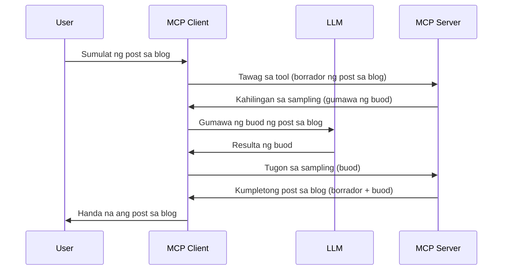

# Sampling - i-delegate ang mga tampok sa Kliyente

Minsan, kailangan ng MCP Client at MCP Server na magtulungan upang makamit ang isang karaniwang layunin. Maaring mayroon kang sitwasyon kung saan kailangan ng Server ang tulong ng LLM na nasa kliyente. Sa ganitong sitwasyon, sampling ang dapat mong gamitin.

Tuklasin natin ang ilang mga use case at kung paano bumuo ng solusyon na may kasamang sampling.

## Pangkalahatang-ideya

Sa leksyon na ito, tututok tayo sa pagpapaliwanag kung kailan at saan gagamitin ang Sampling at kung paano ito i-configure.

## Mga Layunin sa Pagkatuto

Sa kabanatang ito, ating:

- Ipaliwanag kung ano ang Sampling at kailan ito gagamitin.
- Ipakita kung paano i-configure ang Sampling sa MCP.
- Magbigay ng mga halimbawa ng Sampling sa aksyon.

## Ano ang Sampling at bakit ito gagamitin?

Ang Sampling ay isang advanced na tampok na gumagana sa sumusunod na paraan:


### Sampling request

Ok, ngayon ay mayroong tayong pangkalahatang tanaw ng isang makatotohanang sitwasyon, pag-usapan natin ang sampling request na ipinapadala ng server pabalik sa kliyente. Ganito ang hitsura ng ganitong kahilingan sa format ng JSON-RPC:

```json
{
  "jsonrpc": "2.0",
  "id": 1,
  "method": "sampling/createMessage",
  "params": {
    "messages": [
      {
        "role": "user",
        "content": {
          "type": "text",
          "text": "Create a blog post summary of the following blog post: <BLOG POST>"
        }
      }
    ],
    "modelPreferences": {
      "hints": [
        {
          "name": "claude-3-sonnet"
        }
      ],
      "intelligencePriority": 0.8,
      "speedPriority": 0.5
    },
    "systemPrompt": "You are a helpful assistant.",
    "maxTokens": 100
  }
}
```

May ilang bagay dito na mahalagang banggitin:

- Prompt, sa ilalim ng content -> text, ay ang prompt natin na isang instruksyon para sa LLM upang ibuod ang nilalaman ng blog post.

- **modelPreferences**. Ang seksyong ito ay isang preference lamang, isang rekomendasyon kung anong configuration ang gagamitin sa LLM. Maaaring piliin ng gumagamit kung susundin ang mga rekomendasyong ito o babaguhin ang mga ito. Sa kasong ito, may mga rekomendasyon sa modelong gagamitin at prayoridad sa bilis at intelihensiya.
- **systemPrompt**, ito ang iyong normal na system prompt na nagbibigay personalidad sa iyong LLM at naglalaman ng mga gabay na instruksyon.
- **maxTokens**, isa pang property ito na nagsasabi kung ilang tokens ang inirerekumenda gamitin para sa gawaing ito.

### Sampling response

Ito ang tugon na ipinapadala ng MCP Client pabalik sa MCP Server at resulta ng pagtawag ng kliyente sa LLM, paghihintay sa sagot, at pagkatapos ay pagbuo ng mensaheng ito. Ganito ang hitsura nito sa JSON-RPC:

```json
{
  "jsonrpc": "2.0",
  "id": 1,
  "result": {
    "role": "assistant",
    "content": {
      "type": "text",
      "text": "Here's your abstract <ABSTRACT>"
    },
    "model": "gpt-5",
    "stopReason": "endTurn"
  }
}
```

Pansinin kung paano ang tugon ay isang abstrak ng blog post tulad ng hiningi natin. Pansinin din na ang ginamit na `model` ay hindi yung hiniling natin kundi "gpt-5" imbis na "claude-3-sonnet". Ito ay upang ipakita na maaaring magbago ang isip ng gumagamit sa kung ano ang gagamitin at na ang iyong sampling request ay isang rekomendasyon.

Ok, ngayon na nauunawaan na natin ang pangunahing daloy, at ang kapaki-pakinabang na gawain para dito na "paggawa ng blog post + abstrak", tingnan natin kung ano ang kailangan nating gawin upang ito ay gumana.

### Mga uri ng mensahe

Ang mga sampling message ay hindi lang limitado sa teksto kundi maaari ring magpadala ng mga larawan at audio. Ganito ang hitsura ng JSON-RPC kapag iba:

**Teksto**

```json
{
  "type": "text",
  "text": "The message content"
}
```

**Nilalaman ng larawan**

```json
{
  "type": "image",
  "data": "base64-encoded-image-data",
  "mimeType": "image/jpeg"
}
```

**Nilalaman ng audio**

```json
{
  "type": "audio",
  "data": "base64-encoded-audio-data",
  "mimeType": "audio/wav"
}
```

> NOTE: para sa mas detalyadong impormasyon tungkol sa Sampling, tingnan ang [opisyal na dokumentasyon](https://modelcontextprotocol.io/specification/2025-06-18/client/sampling)

## Paano I-configure ang Sampling sa Kliyente

> Note: kung server lang ang ginagawa mo, hindi mo kailangang gumawa ng maraming dito.

Sa kliyente, kailangan mong tukuyin ang sumusunod na tampok gaya ng:

```json
{
  "capabilities": {
    "sampling": {}
  }
}
```

Ito ay kukunin kapag ang iyong piniling kliyente ay nagsimula kasama ang server.

## Halimbawa ng Sampling sa Aksyon - Gumawa ng Blog Post

Gumawa tayo ng sampling server nang magkasama, kailangan nating gawin ang mga sumusunod:

1. Lumikha ng tool sa Server.
1. Dapat ang tool na iyon ay gumawa ng sampling request.
1. Maghihintay ang tool sa sagot ng sampling request ng kliyente.
1. Pagkatapos ay ipapakita ang resulta ng tool.

Tingnan natin ang kodigo ng hakbang-hakbang:

### -1- Gumawa ng tool

**python**

```python
@mcp.tool()
async def create_blog(title: str, content: str, ctx: Context[ServerSession, None]) -> str:
    """Create a blog post and generate a summary"""

```

### -2- Gumawa ng sampling request

Palawakin ang iyong tool gamit ang sumusunod na kodigo:

**python**

```python
post = BlogPost(
        id=len(posts) + 1,
        title=title,
        content=content,
        abstract=""
    )

prompt = f"Create an abstract of the following blog post: title: {title} and draft: {content} "

result = await ctx.session.create_message(
        messages=[
            SamplingMessage(
                role="user",
                content=TextContent(type="text", text=prompt),
            )
        ],
        max_tokens=100,
)

```

### -3- Maghintay sa tugon at ibalik ang sagot

**python**

```python
post.abstract = result.content.text

posts.append(post)

# ibalik ang buong produkto
return json.dumps({
    "id": post.title,
    "abstract": post.abstract
})
```

### -4- Buong kodigo

**python**

```python
from starlette.applications import Starlette
from starlette.routing import Mount, Host

from mcp.server.fastmcp import Context, FastMCP

from mcp.server.session import ServerSession
from mcp.types import SamplingMessage, TextContent

import json


from uuid import uuid4
from typing import List
from pydantic import BaseModel


mcp = FastMCP("Blog post generator")

# app = FastAPI()

posts = []

class BlogPost(BaseModel):
    id: int
    title: str
    content: str
    abstract: str

posts: List[BlogPost] = []

@mcp.tool()
async def create_blog(title: str, content: str, ctx: Context[ServerSession, None]) -> str:
    """Create a blog post and generate a summary"""

    post = BlogPost(
        id=len(posts) + 1,
        title=title,
        content=content,
        abstract=""
    )

    prompt = f"Create an abstract of the following blog post: title: {title} and draft: {content} "

    result = await ctx.session.create_message(
        messages=[
            SamplingMessage(
                role="user",
                content=TextContent(type="text", text=prompt),
            )
        ],
        max_tokens=100,
    )

    post.abstract = result.content.text

    posts.append(post)

    # ibalik ang buong blog post
    return json.dumps({
        "id": post.title,
        "abstract": post.abstract
    })

if __name__ == "__main__":
    print("Starting server...")
    # mcp.run()
    mcp.run(transport="streamable-http")

# patakbuhin ang app gamit ang: python server.py
```

### -5- Subukan ito sa Visual Studio Code

Para subukan ito sa Visual Studio Code, gawin ang sumusunod:

1. Simulan ang server sa terminal
1. Idagdag ito sa *mcp.json* (at siguraduhin na ito ay nagsimula) halimbawa tulad nito:

   ```json
   "servers": {
      "blog-server": {
        "type": "http",
        "url": "http://localhost:8000/mcp"
      }
   }
   ```

1. Mag-type ng prompt:

   ```text
   create a blog post named "Where Python comes from", the content is "Python is actually named after Monty Python Flying Circus"
   ```

1. Payagan ang sampling na mangyari. Sa unang subok mo nito, ipapakita ang karagdagang dialog na kailangan mong tanggapin, pagkatapos ay makikita mo ang normal na dialog para sa paghingi ng pagtakbo ng tool

1. Suriin ang mga resulta. Makikita mo ang mga resulta na maganda ang pagkakapakita sa GitHub Copilot Chat pati na rin ang raw JSON na tugon.

**Bonus**. Ang tooling sa Visual Studio Code ay may mahusay na suporta para sa sampling. Maaari mong i-configure ang Sampling access sa iyong naka-install na server sa pamamagitan ng pag-navigate dito tulad ng:

1. Pumunta sa extension section.
1. Piliin ang icon ng cog para sa iyong naka-install na server sa seksyong "MCP SERVERS - INSTALLED".
1. Piliin ang "Configure Model Access", dito maaari mong piliin kung aling mga Model ang pinapayagang gamitin ng GitHub Copilot kapag nagsasagawa ng sampling. Maaari mo ring makita ang lahat ng mga request sa sampling na naganap kamakailan sa pamamagitan ng pagpili ng "Show Sampling requests".

## Takdang-Aralin

Sa takdang-aralin na ito, gagawa ka ng medyo ibang Sampling, partikular na isang sampling integration na sumusuporta sa paggawa ng deskripsyon ng produkto. Heto ang iyong sitwasyon:

**Sitwasyon**: Ang empleyado sa back office ng isang e-commerce ay nangangailangan ng tulong, sobra-sobra ang oras na kinakailangan upang gumawa ng mga deskripsyon ng produkto. Kaya't gagawa ka ng solusyon kung saan maaari kang tumawag sa tool na "create_product" na may "title" at "keywords" bilang mga argumento at ito ay dapat makabuo ng kumpletong produkto kabilang ang isang "description" na field na pupunan ng LLM ng kliyente.

TIP: gamitin ang iyong mga natutunan noon upang buuin ang server at tool na ito gamit ang isang sampling request.

## Solusyon

[Solusyon](./solution/README.md)

## Mga Pangunahing Aral

Ang Sampling ay isang makapangyarihang tampok na nagpapahintulot sa server na i-delegate ang mga gawain sa kliyente kapag kailangan nito ng tulong ng isang LLM.

## Ano ang Susunod

- [Kabanata 4 - Praktikal na implementasyon](../../04-PracticalImplementation/README.md)

---

<!-- CO-OP TRANSLATOR DISCLAIMER START -->
**Disclaimer**:  
Ang dokumentong ito ay isinalin gamit ang serbisyong AI na pagsasalin na [Co-op Translator](https://github.com/Azure/co-op-translator). Bagamat nagsusumikap kaming maging tumpak, pakatandaan na ang mga awtomatikong pagsasalin ay maaaring maglaman ng mga pagkakamali o hindi pagkakatumpak. Ang orihinal na dokumento sa orihinal nitong wika ang dapat ituring na pangunahing sanggunian. Para sa mahahalagang impormasyon, inirerekomenda ang propesyonal na pagsasaling-tao. Hindi kami mananagot sa anumang hindi pagkakaunawaan o maling interpretasyon na nagmumula sa paggamit ng pagsasaling ito.
<!-- CO-OP TRANSLATOR DISCLAIMER END -->