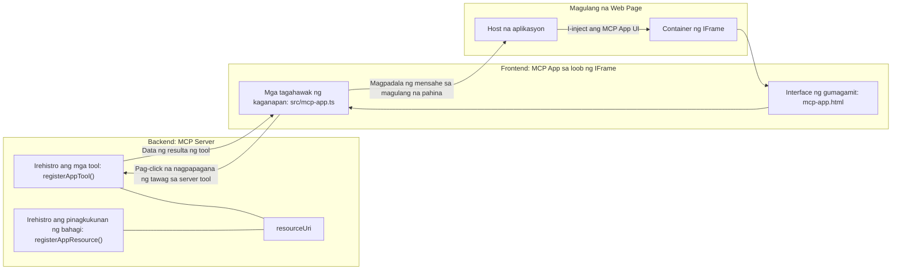

# MCP Apps

Ang MCP Apps ay isang bagong paradigma sa MCP. Ang ideya ay hindi ka lang nagrereply ng data mula sa isang tool call, nagbibigay ka rin ng impormasyon kung paano dapat makipag-ugnayan sa impormasyong ito. Ibig sabihin, ang mga resulta ng tool ay maaari nang maglaman ng UI na impormasyon. Bakit gusto natin ito? Isipin mo kung paano ka gumagawa ngayon. Malamang gumagamit ka ng resulta ng MCP Server sa pamamagitan ng paglagay ng ilang uri ng frontend sa harap nito, iyon ay code na kailangan mong isulat at panatilihin. Minsan ito ang gusto mo, ngunit minsan ay maganda kung makakakuha ka lang ng isang snippet ng impormasyon na self-contained at nandiyan na ang lahat mula data hanggang user interface.

## Overview

Ang araling ito ay nagbibigay ng praktikal na gabay tungkol sa MCP Apps, kung paano ito simulan at kung paano ito i-integrate sa iyong umiiral na Web Apps. Ang MCP Apps ay isang napakabagong karagdagan sa MCP Standard.

## Learning Objectives

Pagkatapos ng araling ito, magagawa mo nang:

- Ipaliwanag kung ano ang MCP Apps.
- Kailan gagamitin ang MCP Apps.
- Bumuo at mag-integrate ng sarili mong MCP Apps.

## MCP Apps - paano ito gumagana

Ang ideya ng MCP Apps ay magbigay ng tugon na esensyal na isang component na maaari i-render. Ang ganitong component ay maaaring may visuals at interactivity, halimbawa, button clicks, user input, at iba pa. Magsimula tayo sa server side at sa ating MCP Server. Para gumawa ng MCP App component kailangan mong gumawa ng tool at pati na rin ng application resource. Ang dalawang ito ay konektado sa pamamagitan ng isang resourceUri.

Narito ang isang halimbawa. Subukan nating i-visualize kung ano ang kasangkot at kung aling bahagi ang gumagawa ng ano:

```text
server.ts -- responsible for registering tools and the component as a UI component
src/
  mcp-app.ts -- wiring up event handlers
mcp-app.html -- the user interface
```

Ipinapakita ng visual na ito ang arkitektura para sa paggawa ng isang component at ang kanyang lohika.


Subukan nating ilarawan ang mga responsibilidad para sa backend at frontend nang magkahiwalay.

### Ang backend

Dalawang bagay ang kailangan nating gawin dito:

- Irehistro ang mga tool na nais nating makipag-ugnayan.
- I-defina ang component. 

**Pagrehistro ng tool**

```typescript
registerAppTool(
    server,
    "get-time",
    {
      title: "Get Time",
      description: "Returns the current server time.",
      inputSchema: {},
      _meta: { ui: { resourceUri } }, // Iniuugnay ang tool na ito sa kanyang UI resource
    },
    async () => {
      const time = new Date().toISOString();
      return { content: [{ type: "text", text: time }] };
    },
  );

```

Ang code sa itaas ay naglalarawan ng behavior, kung saan nag-eexpose ito ng isang tool na tinatawag na `get-time`. Wala itong tinatanggap na inputs ngunit nagbabalik ng kasalukuyang oras. May kakayahan tayong mag-defina ng `inputSchema` para sa mga tool na kailangan tumanggap ng user input.

**Pagrehistro ng component**

Sa parehong file, kailangan din nating irehistro ang component:

```typescript
const resourceUri = "ui://get-time/mcp-app.html";

// Irehistro ang resource, na nagbabalik ng pinagsamang HTML/JavaScript para sa UI.
registerAppResource(
  server,
  resourceUri,
  resourceUri,
  { mimeType: RESOURCE_MIME_TYPE },
  async () => {
    const html = await fs.readFile(path.join(DIST_DIR, "mcp-app.html"), "utf-8");

    return {
    contents: [
        { uri: resourceUri, mimeType: RESOURCE_MIME_TYPE, text: html },
    ],
    };
  },
);
```

Pansinin kung paano binanggit ang `resourceUri` para i-connect ang component sa mga tool nito. Mahalaga rin ang callback kung saan niloload ang UI file at nire-return ang component.

### Ang component frontend

Tulad ng backend, may dalawang bahagi dito:

- Isang frontend na nakasulat sa purong HTML.
- Code na humahandle ng mga events at kung ano ang gagawin, halimbawa pagtawag sa mga tool o pagpapadala ng mensahe sa parent window.

**User interface**

Tingnan natin ang user interface.

```html
<!-- mcp-app.html -->
<!DOCTYPE html>
<html lang="en">
  <head>
    <meta charset="UTF-8" />
    <title>Get Time App</title>
  </head>
  <body>
    <p>
      <strong>Server Time:</strong> <code id="server-time">Loading...</code>
    </p>
    <button id="get-time-btn">Get Server Time</button>
    <script type="module" src="/src/mcp-app.ts"></script>
  </body>
</html>
```

**Event wireup**

Ang huling bahagi ay ang event wireup. Ibig sabihin nito ay tinutukoy natin kung aling bahagi ng UI ang nangangailangan ng event handlers at kung ano ang gagawin kapag may na-raise na events:

```typescript
// mcp-app.ts

import { App } from "@modelcontextprotocol/ext-apps";

// Kunin ang mga sanggunian ng elemento
const serverTimeEl = document.getElementById("server-time")!;
const getTimeBtn = document.getElementById("get-time-btn")!;

// Gumawa ng app instance
const app = new App({ name: "Get Time App", version: "1.0.0" });

// Pangasiwaan ang mga resulta ng tool mula sa server. Itakda bago ang `app.connect()` upang maiwasan
// ang pagkawala ng unang resulta ng tool.
app.ontoolresult = (result) => {
  const time = result.content?.find((c) => c.type === "text")?.text;
  serverTimeEl.textContent = time ?? "[ERROR]";
};

// I-wire ang pag-click ng button
getTimeBtn.addEventListener("click", async () => {
  // Pinapayagan ng `app.callServerTool()` ang UI na humiling ng bagong data mula sa server
  const result = await app.callServerTool({ name: "get-time", arguments: {} });
  const time = result.content?.find((c) => c.type === "text")?.text;
  serverTimeEl.textContent = time ?? "[ERROR]";
});

// Kumonekta sa host
app.connect();
```

Makikita mo sa itaas na ito ay karaniwang code para i-hook ang mga DOM elements sa mga events. Mahalaga rin ang tawag sa `callServerTool` na nagtatawag ng isang tool sa backend.

## Paano humandle ng user input

Sa ngayon, nakita na natin ang isang component na may button na kapag na-click ay tumatawag ng tool. Tingnan natin kung maaari tayong magdagdag ng higit pang UI elements tulad ng input field at tingnan kung pwede tayong magpadala ng arguments sa tool. Gagawa tayo ng FAQ functionality. Ganito ang dapat na proseso:

- Dapat may button at input element kung saan magta-type ang user ng keyword para maghanap, halimbawa "Shipping". Tatawagin nito ang tool sa backend na naghahanap sa FAQ data.
- Isang tool na sumusuporta sa nabanggit na FAQ search.

Idagdag muna natin ang kinakailangang suporta sa backend:

```typescript
const faq: { [key: string]: string } = {
    "shipping": "Our standard shipping time is 3-5 business days.",
    "return policy": "You can return any item within 30 days of purchase.",
    "warranty": "All products come with a 1-year warranty covering manufacturing defects.",
  }

registerAppTool(
    server,
    "get-faq",
    {
      title: "Search FAQ",
      description: "Searches the FAQ for relevant answers.",
      inputSchema: zod.object({
        query: zod.string().default("shipping"),
      }),
      _meta: { ui: { resourceUri: faqResourceUri } }, // Iniuugnay ang tool na ito sa kanyang UI na pinagkukunan
    },
    async ({ query }) => {
      const answer: string = faq[query.toLowerCase()] || "Sorry, I don't have an answer for that.";
      return { content: [{ type: "text", text: answer }] };
    },
  );
```

Ang nakikita natin dito ay kung paano pinupunan ang `inputSchema` at binibigyan ng isang `zod` schema tulad nito:

```typescript
inputSchema: zod.object({
  query: zod.string().default("shipping"),
})
```

Sa schema sa itaas, dineklara natin na may input parameter na tinatawag na `query` at ito ay optional na may default na halaga na "shipping".

Sige, lumipat tayo sa *mcp-app.html* para tingnan kung anong UI ang kailangan nating likhain para dito:

```html
<div class="faq">
    <h1>FAQ response</h1>
    <p>FAQ Response: <code id="faq-response">Loading...</code></p>
    <input type="text" id="faq-query" placeholder="Enter FAQ query" />
    <button id="get-faq-btn">Get FAQ Response</button>
  </div>
```

Magaling, ngayon ay mayroon tayong input element at button. Puntahan natin ang *mcp-app.ts* para i-wire up ang mga events na ito:

```typescript
const getFaqBtn = document.getElementById("get-faq-btn")!;
const faqQueryInput = document.getElementById("faq-query") as HTMLInputElement;

getFaqBtn.addEventListener("click", async () => {
  const query = faqQueryInput.value;
  const result = await app.callServerTool({ name: "get-faq", arguments: { query } });
  const faq = result.content?.find((c) => c.type === "text")?.text;
  faqResponseEl.textContent = faq ?? "[ERROR]";
});
```

Sa code sa itaas, ginawa natin ang mga sumusunod:

- Gumawa ng references sa interactive UI elements.
- Hinandle ang pag-click ng button para kunin ang value ng input element at tumawag rin ng `app.callServerTool()` na may `name` at `arguments` kung saan ang huli ay nagpapasa ng `query` bilang value.

Ang nangyayari kapag tinawag mo ang `callServerTool` ay nagpapadala ito ng mensahe sa parent window at ang window na iyon ay nagtatawag ng MCP Server.

### Subukan ito

Kapag sinubukan ito, dapat nating makita ang sumusunod:


at ito ang resulta kapag gumawa tayo ng input tulad ng "warranty"


Para patakbuhin ang code na ito, pumunta sa [Code section](./code/README.md)

## Pagsubok sa Visual Studio Code

Ang Visual Studio Code ay may mahusay na suporta para sa MCP Apps at marahil isa ito sa pinakamadaling paraan para subukan ang iyong MCP Apps. Para gamitin ang Visual Studio Code, magdagdag ng server entry sa *mcp.json* tulad nito:

```json
"my-mcp-server-7178eca7": {
    "url": "http://localhost:3001/mcp",
    "type": "http"
  }
```

Pagkatapos simulan ang server, dapat kang makipag-ugnayan sa iyong MCP App sa pamamagitan ng Chat Window kung meron kang naka-install na GitHub Copilot.

Maaari mo itong i-trigger gamit ang prompt, halimbawa "#get-faq":


At kagaya ng pag-run mo nito sa web browser, nirender ito ng pareho tulad nito:


## Assignment

Gumawa ng rock paper scissor game. Dapat itong magkaroon ng mga sumusunod:

UI:

- isang drop down list na may mga pagpipilian
- isang button para isumite ang pagpili
- isang label na nagpapakita kung sino ang pumili ng ano at kung sino ang nanalo

Server:

- dapat mayroong tool na rock paper scissor na tumatanggap ng "choice" bilang input. Dapat nitong ipakita rin ang pinili ng computer at tukuyin ang nanalo

## Solution

[Solution](./assignment/README.md)

## Summary

Natutunan natin ang tungkol sa bagong paradigm na ito na MCP Apps. Ito ay bagong paradigma na nagpapahintulot sa MCP Servers na hindi lang magkaroon ng opinyon tungkol sa data kundi pati kung paano dapat ipakita ang data.

Bukod dito, natutunan din natin na ang MCP Apps ay naka-host sa loob ng isang IFrame at para makipag-ugnayan sa MCP Servers kailangan nilang magpadala ng mga mensahe sa parent web app. Mayroong ilang libraries para sa plain JavaScript, React, at iba pa na nagpapadali ng komunikasyon na ito.

## Key Takeaways

Narito ang mga natutunan mo:

- Ang MCP Apps ay isang bagong standard na kapaki-pakinabang kapag nais mong magpadala ng parehong data at UI features.
- Ang ganitong klase ng apps ay tumatakbo sa loob ng IFrame para sa mga dahilan ng seguridad.

## What's Next

- [Chapter 4](../../04-PracticalImplementation/README.md)

---

<!-- CO-OP TRANSLATOR DISCLAIMER START -->
**Pagsisiwalat**:  
Ang dokumentong ito ay isinalin gamit ang serbisyo ng AI na pagsasalin [Co-op Translator](https://github.com/Azure/co-op-translator). Bagaman nagsusumikap kami para sa katumpakan, pakatandaan na ang mga awtomatikong pagsasalin ay maaaring maglaman ng mga pagkakamali o kamalian. Ang orihinal na dokumento sa orihinal na wika nito ang dapat ituring na pangunahing pinagkukunan. Para sa mahahalagang impormasyon, inirerekomenda ang propesyonal na pagsasalin ng tao. Hindi kami mananagot sa anumang maling pagkakaintindi o maling interpretasyon na nagmumula sa paggamit ng pagsasaling ito.
<!-- CO-OP TRANSLATOR DISCLAIMER END -->