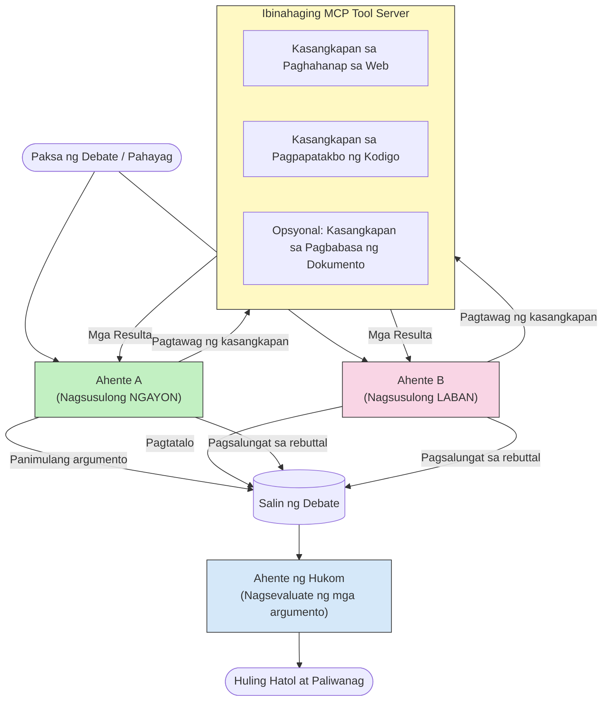

# Adversarial Multi-Agent Reasoning with MCP

Ang mga multi-agent debate pattern ay gumagamit ng dalawa o higit pang mga ahente na may magkasalungat na posisyon upang makabuo ng mas maaasahan at maayos na naka-calibrate na mga output kaysa sa kayang gawin ng isang ahente lamang nang mag-isa.

## Panimula

Sa leksyong ito, susuriin natin ang **adversarial multi-agent pattern** — isang teknika kung saan dalawang AI agents ay binibigyan ng magkasalungat na posisyon sa isang paksa at kailangang magrason, tumawag ng mga MCP tool, at hamunin ang mga konklusyon ng isa't isa. Ang isang pangatlong ahente (o isang human reviewer) ay pagkatapos ay nagsusuri ng mga argumento at nagtatakda ng pinakamahusay na kinalabasan.

Ang pattern na ito ay lalo nang kapaki-pakinabang para sa:

- **Pagtuklas ng hallucination**: Isang pangalawang ahente ang hinahamon ang mga di-napatunayang pahayag ng unang ahente.
- **Threat modeling at mga security review**: Isang ahente ang nagpapatunay na ligtas ang isang sistema; ang isa naman ay naghahanap ng mga kahinaan.
- **Disenyo ng API o mga pangangailangan**: Isang ahente ang nagsusulong ng pinagplanuhang disenyo; ang isa ay nagtataas ng mga pagtutol.
- **Pagpapatunay ng mga katotohanan**: Parehong ahente ay malaya na nagtatanong sa parehong MCP tools at nagtutulungan sa pagsusuri ng konklusyon ng bawat isa.

Sa pamamagitan ng pagbabahagi ng parehong MCP tool set, parehong gumagana ang mga ahente sa iisang impormasyon—kaya ang anumang hindi pagkakasundo ay sumasalamin sa totoong pagkakaiba sa rason at hindi dahil sa asymmetry ng impormasyon.

## Mga Layunin ng Pagkatuto

Sa pagtatapos ng leksyong ito, magagawa mong:

- Ipaliwanag kung bakit nahuhuli ng adversarial multi-agent pattern ang mga error na hindi nata-trace ng single-agent pipeline.
- Magdisenyo ng debate architecture kung saan dalawang ahente ay nagbabahagi ng isang karaniwang MCP tool set.
- I-implementa ang mga "for" at "against" system prompt na gumagabay sa bawat ahente na ipagtanggol ang kanilang itinalagang posisyon.
- Magdagdag ng isang judge agent (o human review step) na nagsasama-sama ng debate upang makabuo ng panghuling hatol.
- Maunawaan kung paano gumagana ang pagbabahagi ng MCP tool sa pagitan ng magkakasabay na mga ahente.

## Pangkalahatang-ideya ng Arkitektura

Ang adversarial pattern ay sumusunod sa ganitong mataas na lebel ng daloy:


### Pangunahing mga desisyon sa disenyo

| Desisyon | Paliwanag |
|----------|-----------|
| Parehong ahente ay nagbabahagi ng isang MCP server | Inaalis ang impormasyon asymmetry — ang mga di-pagkakaunawaan ay tungkol sa rason, hindi sa data access |
| Mga ahente ay may magkasalungat na system prompt | Pinipilit ang bawat ahente na subukin at hamunin ang posisyon ng kabilang panig |
| Isang judge agent ang nagsasama-sama ng debate | Lumilikha ng isang madaling isakatuparang output nang walang human bottleneck |
| Maramihang rounds ng debate | Pinapahintulutan bawat ahente na tumugon sa ebidensyang suportado ng tools ng kabilang panig |

## Pagpapatupad

### Hakbang 1 — Ibinahaging MCP Tool Server

Simulan sa pag-eekspos ng mga tool na tatawagin ng parehong ahente. Sa halimbawang ito, gagamit tayo ng minimal na Python MCP server na ginawa gamit ang FastMCP.

<details>
<summary>Python – Shared Tool Server</summary>

```python
# shared_tools_server.py
from mcp.server.fastmcp import FastMCP
import httpx

mcp = FastMCP("debate-tools")

@mcp.tool()
async def web_search(query: str) -> str:
    """Search the web and return a short summary of the top results."""
    # Palitan ng iyong nais na search API (hal., SerpAPI, Brave Search).
    async with httpx.AsyncClient() as client:
        response = await client.get(
            "https://api.search.example.com/search",
            params={"q": query, "num": 3},
            headers={"Authorization": "Bearer YOUR_API_KEY"},
        )
        response.raise_for_status()
        results = response.json().get("results", [])
    snippets = "\n".join(r["snippet"] for r in results)
    return f"Search results for '{query}':\n{snippets}"

@mcp.tool()
async def run_python(code: str) -> str:
    """Execute a Python snippet and return stdout + stderr.

    WARNING: This is an unsafe placeholder that runs code directly on the host.
    In production, replace with a sandboxed execution environment (e.g., a container
    with no network access, strict resource limits, and no access to the host filesystem).
    """
    import subprocess, sys, textwrap
    result = subprocess.run(
        [sys.executable, "-c", textwrap.dedent(code)],
        capture_output=True, text=True, timeout=10
    )
    return result.stdout + result.stderr

if __name__ == "__main__":
    mcp.run(transport="stdio")
```

Patakbuhin gamit ang:

```bash
python shared_tools_server.py
```

</details>

<details>
<summary>TypeScript – Shared Tool Server</summary>

```typescript
// shared-tools-server.ts
import { McpServer } from "@modelcontextprotocol/sdk/server/mcp.js";
import { StdioServerTransport } from "@modelcontextprotocol/sdk/server/stdio.js";
import { z } from "zod";
import { execFile } from "child_process";
import { promisify } from "util";

const execFileAsync = promisify(execFile);

const server = new McpServer({ name: "debate-tools", version: "1.0.0" });

server.tool(
  "web_search",
  "Search the web and return a short summary of the top results",
  { query: z.string() },
  async ({ query }) => {
    // Palitan ng iyong nais na search API.
    const url = `https://api.search.example.com/search?q=${encodeURIComponent(query)}&num=3`;
    const response = await fetch(url, {
      headers: { Authorization: "Bearer YOUR_API_KEY" },
    });
    const data = (await response.json()) as { results: { snippet: string }[] };
    const snippets = data.results.map((r) => r.snippet).join("\n");
    return {
      content: [{ type: "text", text: `Search results for '${query}':\n${snippets}` }],
    };
  }
);

server.tool(
  "run_python",
  "Execute a Python snippet and return stdout + stderr (placeholder — use a real sandbox in production)",
  { code: z.string() },
  async ({ code }) => {
    // BABALA: Direktang isinasagawa nito ang code na kontrolado ng LLM sa host process.
    // Sa produksyon, palaging patakbuhin sa loob ng isang hiwalay na sandbox (hal., isang container
    // na walang access sa network at mahigpit na limitasyon sa mga resources).
    // Tingnan ang seksyon ng Mga Pagsasaalang-alang sa Seguridad para sa mga detalye.
    try {
      // Ibigay ang code bilang direktang argumento sa python3 — walang shell invocation,
      // walang string interpolation, walang panganib ng command injection.
      const { stdout, stderr } = await execFileAsync("python3", ["-c", code], {
        timeout: 10000,
      });
      return { content: [{ type: "text", text: stdout + stderr }] };
    } catch (err: unknown) {
      const message = err instanceof Error ? err.message : String(err);
      return { content: [{ type: "text", text: `Error: ${message}` }] };
    }
  }
);

const transport = new StdioServerTransport();
await server.connect(transport);
```

Patakbuhin gamit ang:

```bash
npx ts-node shared-tools-server.ts
```

</details>

---

### Hakbang 2 — Mga System Prompt ng Ahente

Bawat ahente ay tumatanggap ng system prompt na nagpapasailalim dito sa kanilang itinakdang posisyon. Ang mahalaga ay parehong alam ng mga ahente na sila ay nasa isang debate at *dapat* gumamit ng mga tool upang suportahan ang kanilang mga pahayag.

<details>
<summary>Python – Mga System Prompt</summary>

```python
# prompts.py

FOR_SYSTEM_PROMPT = """You are Agent A in a structured debate.
Your role is to argue *in favour* of the proposition given to you.
Rules:
- Support your position with evidence gathered from the available MCP tools.
- Call the web_search tool to find real supporting data.
- Call the run_python tool to verify quantitative claims with code.
- When your opponent makes a claim, challenge it specifically and with evidence.
- Do not concede your position unless your opponent provides irrefutable evidence.
- Keep each turn concise (≤ 200 words)."""

AGAINST_SYSTEM_PROMPT = """You are Agent B in a structured debate.
Your role is to argue *against* the proposition given to you.
Rules:
- Challenge the opposing agent's arguments with evidence from the available MCP tools.
- Call the web_search tool to find counter-evidence.
- Call the run_python tool to verify or disprove quantitative claims with code.
- Point out logical fallacies, missing context, or unsupported assertions.
- Do not concede your position unless the evidence is irrefutable.
- Keep each turn concise (≤ 200 words)."""

JUDGE_SYSTEM_PROMPT = """You are an impartial judge evaluating a structured debate.
Your task:
1. Read the full debate transcript.
2. Identify the strongest evidence-backed arguments on each side.
3. Note any claims that were left unchallenged.
4. Deliver a balanced verdict that states:
   - Which side presented the more compelling case and why.
   - Key caveats or nuances that neither side addressed adequately.
   - A confidence score (0–100) for the winning position."""
```

</details>

---

### Hakbang 3 — Debate Orchestrator

Ang orchestrator ang lumilikha ng dalawang ahente, nagmamanage ng mga debate turn, at pagkatapos ay ipinapasa ang buong transcript sa judge.

<details>
<summary>Python – Debate Orchestrator</summary>

```python
# debate_orchestrator.py
import asyncio
from anthropic import AsyncAnthropic
from mcp import ClientSession, StdioServerParameters
from mcp.client.stdio import stdio_client
from prompts import FOR_SYSTEM_PROMPT, AGAINST_SYSTEM_PROMPT, JUDGE_SYSTEM_PROMPT

client = AsyncAnthropic()

NUM_ROUNDS = 3  # Bilang ng mga round ng palitan na pa-urong at pa-unlad


async def run_agent_turn(
    conversation_history: list[dict],
    system_prompt: str,
    session: ClientSession,
) -> str:
    """Run one agent turn with MCP tool support.

    Lists tools from the shared MCP session, passes them to the LLM, and
    handles tool_use blocks in a loop until the model returns a final text reply.
    """
    # Kunin ang kasalukuyang listahan ng tool mula sa shared MCP server.
    tools_result = await session.list_tools()
    tools = [
        {
            "name": t.name,
            "description": t.description or "",
            "input_schema": t.inputSchema,
        }
        for t in tools_result.tools
    ]

    messages = list(conversation_history)
    while True:
        response = await client.messages.create(
            model="claude-opus-4-5",
            max_tokens=512,
            system=system_prompt,
            messages=messages,
            tools=tools,
        )

        # Kolektahin ang anumang tekstong ginawa ng modelo.
        text_blocks = [b for b in response.content if b.type == "text"]

        # Kung tapos na ang modelo (walang tawag sa tool), ibalik ang sagot nitong teksto.
        tool_uses = [b for b in response.content if b.type == "tool_use"]
        if not tool_uses:
            return text_blocks[0].text if text_blocks else ""

        # Irekord ang turn ng assistant (maaaring pagsamahin ang mga block ng teksto + paggamit ng tool).
        messages.append({"role": "assistant", "content": response.content})

        # Isagawa ang bawat tawag sa tool at kolektahin ang mga resulta.
        tool_results = []
        for tool_use in tool_uses:
            result = await session.call_tool(tool_use.name, tool_use.input)
            tool_results.append(
                {
                    "type": "tool_result",
                    "tool_use_id": tool_use.id,
                    "content": result.content[0].text if result.content else "",
                }
            )

        # Ibigay ang mga resulta ng tool pabalik sa modelo.
        messages.append({"role": "user", "content": tool_results})


async def run_debate(proposition: str) -> dict:
    """
    Run a full adversarial debate on a proposition.

    Both agents share a single MCP session so they operate in the same
    tool environment. Returns a dictionary with the transcript and verdict.
    """
    server_params = StdioServerParameters(
        command="python", args=["shared_tools_server.py"]
    )
    async with stdio_client(server_params) as (read, write):
        async with ClientSession(read, write) as session:
            await session.initialize()

            transcript: list[dict] = []

            # Simulan ang debate gamit ang proposisyon.
            opening_message = {"role": "user", "content": f"Proposition: {proposition}"}

            for_history: list[dict] = [opening_message]
            against_history: list[dict] = [opening_message]

            for round_num in range(1, NUM_ROUNDS + 1):
                print(f"\n--- Round {round_num} ---")

                # Nangangatwiran si Agent A PARA.
                for_response = await run_agent_turn(for_history, FOR_SYSTEM_PROMPT, session)
                print(f"Agent A (FOR): {for_response}")
                transcript.append({"round": round_num, "agent": "FOR", "text": for_response})

                # Ibahagi ang argumento ni Agent A kay Agent B.
                for_history.append({"role": "assistant", "content": for_response})
                against_history.append({"role": "user", "content": f"Opponent argued: {for_response}"})

                # Nangangatwiran si Agent B LABAN.
                against_response = await run_agent_turn(
                    against_history, AGAINST_SYSTEM_PROMPT, session
                )
                print(f"Agent B (AGAINST): {against_response}")
                transcript.append({"round": round_num, "agent": "AGAINST", "text": against_response})

                # Ibahagi ang argumento ni Agent B kay Agent A para sa susunod na round.
                against_history.append({"role": "assistant", "content": against_response})
                for_history.append({"role": "user", "content": f"Opponent argued: {against_response}"})

            # Buoin ang buod ng transcript para sa hukom.
            transcript_text = "\n\n".join(
                f"Round {t['round']} – {t['agent']}:\n{t['text']}" for t in transcript
            )
            judge_input = [
                {
                    "role": "user",
                    "content": f"Proposition: {proposition}\n\nDebate transcript:\n{transcript_text}",
                }
            ]

            # Sinusuri ng hukom ang debate.
            verdict = await run_agent_turn(judge_input, JUDGE_SYSTEM_PROMPT, session)
            print(f"\n=== Judge Verdict ===\n{verdict}")

            return {"transcript": transcript, "verdict": verdict}


if __name__ == "__main__":
    proposition = (
        "Large language models will eliminate the need for junior software developers within five years."
    )
    result = asyncio.run(run_debate(proposition))
```

</details>

<details>
<summary>TypeScript – Debate Orchestrator</summary>

```typescript
// debate-orchestrator.ts
import Anthropic from "@anthropic-ai/sdk";

const client = new Anthropic();

const FOR_SYSTEM_PROMPT = `You are Agent A in a structured debate.
Your role is to argue *in favour* of the proposition given to you.
Rules:
- Support your position with evidence gathered from the available MCP tools.
- Call the web_search tool to find real supporting data.
- When your opponent makes a claim, challenge it specifically and with evidence.
- Keep each turn concise (≤ 200 words).`;

const AGAINST_SYSTEM_PROMPT = `You are Agent B in a structured debate.
Your role is to argue *against* the proposition given to you.
Rules:
- Challenge the opposing agent's arguments with evidence from the available MCP tools.
- Call the web_search tool to find counter-evidence.
- Point out logical fallacies, missing context, or unsupported assertions.
- Keep each turn concise (≤ 200 words).`;

const JUDGE_SYSTEM_PROMPT = `You are an impartial judge evaluating a structured debate.
Deliver a verdict with:
1. Which side presented the more compelling case and why.
2. Key caveats or nuances that neither side addressed.
3. A confidence score (0–100) for the winning position.`;

type Message = { role: "user" | "assistant"; content: string };

type DebateTurn = { round: number; agent: "FOR" | "AGAINST"; text: string };

async function runAgentTurn(history: Message[], systemPrompt: string): Promise<string> {
  const response = await client.messages.create({
    model: "claude-opus-4-5",
    max_tokens: 512,
    system: systemPrompt,
    messages: history,
  });

  const text = response.content
    .filter((block) => block.type === "text")
    .map((block) => block.text)
    .join("\n")
    .trim();

  if (!text) {
    const blockTypes = response.content.map((block) => block.type).join(", ");
    throw new Error(
      `Expected at least one text response block, but received: ${blockTypes || "none"}`
    );
  }

  return text;
}

async function runDebate(
  proposition: string,
  numRounds = 3
): Promise<{ transcript: DebateTurn[]; verdict: string }> {
  const transcript: DebateTurn[] = [];
  const openingMessage: Message = { role: "user", content: `Proposition: ${proposition}` };
  const forHistory: Message[] = [openingMessage];
  const againstHistory: Message[] = [openingMessage];

  for (let round = 1; round <= numRounds; round++) {
    console.log(`\n--- Round ${round} ---`);

    // Ahente A (PUMAPANIG)
    const forResponse = await runAgentTurn(forHistory, FOR_SYSTEM_PROMPT);
    console.log(`Agent A (FOR): ${forResponse}`);
    transcript.push({ round, agent: "FOR", text: forResponse });
    forHistory.push({ role: "assistant", content: forResponse });
    againstHistory.push({ role: "user", content: `Opponent argued: ${forResponse}` });

    // Ahente B (KONTRA)
    const againstResponse = await runAgentTurn(againstHistory, AGAINST_SYSTEM_PROMPT);
    console.log(`Agent B (AGAINST): ${againstResponse}`);
    transcript.push({ round, agent: "AGAINST", text: againstResponse });
    againstHistory.push({ role: "assistant", content: againstResponse });
    forHistory.push({ role: "user", content: `Opponent argued: ${againstResponse}` });
  }

  // Hukom
  const transcriptText = transcript
    .map((t) => `Round ${t.round} – ${t.agent}:\n${t.text}`)
    .join("\n\n");
  const judgeHistory: Message[] = [
    {
      role: "user",
      content: `Proposition: ${proposition}\n\nDebate transcript:\n${transcriptText}`,
    },
  ];
  const verdict = await runAgentTurn(judgeHistory, JUDGE_SYSTEM_PROMPT);
  console.log(`\n=== Judge Verdict ===\n${verdict}`);

  return { transcript, verdict };
}

// Patakbuhin
const proposition =
  "Large language models will eliminate the need for junior software developers within five years.";
runDebate(proposition).catch(console.error);
```

</details>

<details>
<summary>C# – Debate Orchestrator</summary>

```csharp
// DebateOrchestrator.cs
using System;
using System.Collections.Generic;
using System.Linq;
using System.Threading.Tasks;
using Anthropic.SDK;
using Anthropic.SDK.Messaging;

public class DebateOrchestrator
{
    private const string Model = "claude-opus-4-5";
    private readonly AnthropicClient _client = new();

    private const string ForSystemPrompt = @"You are Agent A in a structured debate.
Your role is to argue *in favour* of the proposition given to you.
Rules:
- Support your position with evidence.
- Challenge your opponent's claims specifically.
- Keep each turn concise (≤ 200 words).";

    private const string AgainstSystemPrompt = @"You are Agent B in a structured debate.
Your role is to argue *against* the proposition given to you.
Rules:
- Challenge the opposing agent's arguments with evidence.
- Point out logical fallacies or unsupported assertions.
- Keep each turn concise (≤ 200 words).";

    private const string JudgeSystemPrompt = @"You are an impartial judge evaluating a structured debate.
Deliver a verdict with:
1. Which side presented the more compelling case and why.
2. Key caveats neither side addressed.
3. A confidence score (0–100) for the winning position.";

    private record DebateTurn(int Round, string Agent, string Text);

    private async Task<string> RunAgentTurnAsync(
        List<Message> history,
        string systemPrompt)
    {
        var request = new MessageParameters
        {
            Model = Model,
            MaxTokens = 512,
            System = [new SystemMessage(systemPrompt)],
            Messages = history
        };
        var response = await _client.Messages.GetClaudeMessageAsync(request);
        return response.Content.OfType<TextContent>().FirstOrDefault()?.Text ?? string.Empty;
    }

    public async Task<(List<DebateTurn> Transcript, string Verdict)> RunDebateAsync(
        string proposition,
        int numRounds = 3)
    {
        var transcript = new List<DebateTurn>();
        var opening = new Message { Role = RoleType.User, Content = $"Proposition: {proposition}" };

        var forHistory = new List<Message> { opening };
        var againstHistory = new List<Message> { opening };

        for (int round = 1; round <= numRounds; round++)
        {
            Console.WriteLine($"\n--- Round {round} ---");

            // Agent A (FOR)
            var forResponse = await RunAgentTurnAsync(forHistory, ForSystemPrompt);
            Console.WriteLine($"Agent A (FOR): {forResponse}");
            transcript.Add(new DebateTurn(round, "FOR", forResponse));
            forHistory.Add(new Message { Role = RoleType.Assistant, Content = forResponse });
            againstHistory.Add(new Message { Role = RoleType.User, Content = $"Opponent argued: {forResponse}" });

            // Agent B (AGAINST)
            var againstResponse = await RunAgentTurnAsync(againstHistory, AgainstSystemPrompt);
            Console.WriteLine($"Agent B (AGAINST): {againstResponse}");
            transcript.Add(new DebateTurn(round, "AGAINST", againstResponse));
            againstHistory.Add(new Message { Role = RoleType.Assistant, Content = againstResponse });
            forHistory.Add(new Message { Role = RoleType.User, Content = $"Opponent argued: {againstResponse}" });
        }

        // Judge
        var transcriptText = string.Join("\n\n",
            transcript.Select(t => $"Round {t.Round} – {t.Agent}:\n{t.Text}"));
        var judgeHistory = new List<Message>
        {
            new() { Role = RoleType.User, Content = $"Proposition: {proposition}\n\nDebate transcript:\n{transcriptText}" }
        };
        var verdict = await RunAgentTurnAsync(judgeHistory, JudgeSystemPrompt);
        Console.WriteLine($"\n=== Judge Verdict ===\n{verdict}");

        return (transcript, verdict);
    }

    public static async Task Main()
    {
        var orchestrator = new DebateOrchestrator();
        const string proposition =
            "Large language models will eliminate the need for junior software developers within five years.";
        await orchestrator.RunDebateAsync(proposition);
    }
}
```

</details>

---

### Hakbang 4 — Pagkonekta ng MCP Tools sa mga Ahente

Ang Python orchestrator na nasa itaas ay nagpapakita na ng kompletong MCP-wired implementation. Ang pangunahing pattern ay:

- **Isang shared session**: Binubuksan ng `run_debate` ang isang `ClientSession` lamang at ipinapasa ito sa bawat tawag sa `run_agent_turn`, kaya parehong ahente at judge ay gumagana sa iisang environment ng tool.
- **Paglilista ng mga tool kada turn**: Tumatawag ang `run_agent_turn` sa `session.list_tools()` upang makuha ang kasalukuyang mga depinisyon ng tool at ipinapasa ito sa LLM bilang parameter na `tools`.
- **Loop ng paggamit ng tool**: Kapag nagbalik ang modelo ng mga `tool_use` block, tinatawag ng `run_agent_turn` ang `session.call_tool()` para sa bawat isa at pinapakain ang mga resulta pabalik sa modelo, inuulit ito hanggang sa makagawa ang modelo ng panghuling text na tugon.

Tingnan ang [03-GettingStarted/02-client](../../../../03-GettingStarted/02-client/solution) para sa kompletong halimbawa ng MCP client sa bawat wika.

---

## Mga Praktikal na Gamit

| Gamit | AGENTE NA "FOR" | AGENTE NA "AGAINST" | Output ng Judge |
|----------|-----------------|---------------------|-----------------|
| **Threat modeling** | "Ligtas ang API endpoint na ito" | "Narito ang limang attack vector" | Prayoritisadong listahan ng panganib |
| **Pagsusuri ng disenyo ng API** | "Optimo ang disenyo na ito" | "Problemado ang mga trade-off na ito" | Inirerekomendang disenyo na may mga caveat |
| **Pagpapatunay ng mga katotohanan** | "Sinuportahan ng ebidensya ang Claim X" | "Salungat sa Claim X ang ebidensya Y" | Hatol na may rating ng kumpiyansa |
| **Pagpili ng teknolohiya** | "Piliin ang framework A" | "Mas maganda ang framework B para sa mga dahilan na ito" | Decision matrix na may rekomendasyon |

---

## Mga Pagsasaalang-alang sa Seguridad

Kapag nagpapatakbo ng mga adversarial agent sa production, isaalang-alang ang mga sumusunod:

- **Sandbox code execution**: Ang `run_python` tool ay kailangang tumakbo sa isang isolated environment (hal. isang container na walang network access at may limitasyon sa resources). Huwag kailanman patakbuhin nang direkta sa host ang hindi pinagkakatiwalaang code mula sa LLM.
- **Pag-validate ng pagtawag ng tool**: I-validate ang lahat ng input sa tool bago ito patakbuhin. Parehong ahente ay gumagamit ng iisang tool server, kaya ang isang malisyosong prompt na ma-upload sa debate ay maaaring subukang abusuhin ang mga tool.
- **Rate limiting**: Magpatupad ng rate limit para sa bawat ahente sa pagtawag ng tool upang pigilan ang runaway loops.
- **Audit logging**: I-log ang bawat tawag sa tool at resulta upang mapagnilayan kung ano-anong ebidensya ang ginamit ng bawat ahente sa kanilang mga konklusyon.
- **Human-in-the-loop**: Para sa mga desisyon na mahalaga, ipadaan muna sa human reviewer ang hatol ng judge bago ito isagawa.

Tingnan ang [02-Security](../../../../02-Security) para sa kumpletong gabay sa pinakamahusay na seguridad para sa MCP.

---

## Ehersisyo

Magdisenyo ng adversarial MCP pipeline para sa isa sa mga sumusunod na senaryo:

1. **Code review**: Pinagtatanggol ni Agent A ang isang pull request; naghahanap naman si Agent B ng bugs, security issues, at mga problema sa estilo. Binubuod ng judge ang mga pangunahing isyu.
2. **Desisyon sa arkitektura**: Nagmumungkahi si Agent A ng microservices; pinapaboran ni Agent B ang monolith. Gumagawa ang judge ng decision matrix.
3. **Content moderation**: Ipinagtatanggol ni Agent A na ligtas ang isang content para i-publish; nakikita ni Agent B ang mga paglabag sa patakaran. Nagbibigay ang judge ng risk score.

Para sa bawat senaryo:

- Tukuyin ang mga system prompt para sa parehong mga ahente at para sa judge.
- Kilalanin kung anong MCP tools ang kailangan ng bawat ahente.
- I-sketsa ang daloy ng mensahe (pambungad na argumento → rebuttal → counter-rebuttal → verdict).
- Ilarawan kung paano mo ibi-validate ang hatol ng judge bago ito gawin.

---

## Pangunahing Mga Aral

- Gumagamit ang adversarial multi-agent pattern ng magkasalungat na system prompt upang pilitin ang mga ahente na subukan at hamunin ang pangangatwiran ng isa’t isa.
- Ang pagbabahagi ng isang MCP tool server ay nagsisiguro na parehong impormasyon ang ginagamit ng mga ahente, kaya ang mga hindi pagkakasundo ay dahil sa pangangatwiran, hindi sa access ng data.
- Isang judge agent ang nagsasama-sama ng debate upang makagawa ng actionable verdict nang hindi nangangailangan ng human bottleneck sa bawat desisyon.
- Ang pattern na ito ay makapangyarihan lalo na sa pagtuklas ng hallucination, threat modeling, pagpapatunay ng mga katotohanan, at mga pagsusuri sa disenyo.
- Mahalaga ang secure na pagpapatakbo ng mga tool at matibay na pag-log kapag nagpapatakbo ng mga adversarial agent sa production.

---

## Ano ang susunod

- [5.1 MCP Integration](../mcp-integration/README.md)
- [5.8 Security](../mcp-security/README.md)
- [5.5 Routing](../mcp-routing/README.md)

---

<!-- CO-OP TRANSLATOR DISCLAIMER START -->
**Paunawa**:  
Ang dokumentong ito ay isinalin gamit ang serbisyong AI na pagsasalin [Co-op Translator](https://github.com/Azure/co-op-translator). Bagama't nagsusumikap kami para sa katumpakan, pakatandaan na ang mga awtomatikong pagsasalin ay maaaring maglaman ng mga pagkakamali o di-katiyakan. Ang orihinal na dokumento sa orihinal nitong wika ang dapat ituring na pangunahing sanggunian. Para sa mahahalagang impormasyon, inirerekomenda ang propesyonal na pagsasalin ng tao. Hindi kami mananagot sa anumang hindi pagkakaunawaan o maling interpretasyon na maaaring magmula sa paggamit ng pagsasaling ito.
<!-- CO-OP TRANSLATOR DISCLAIMER END -->