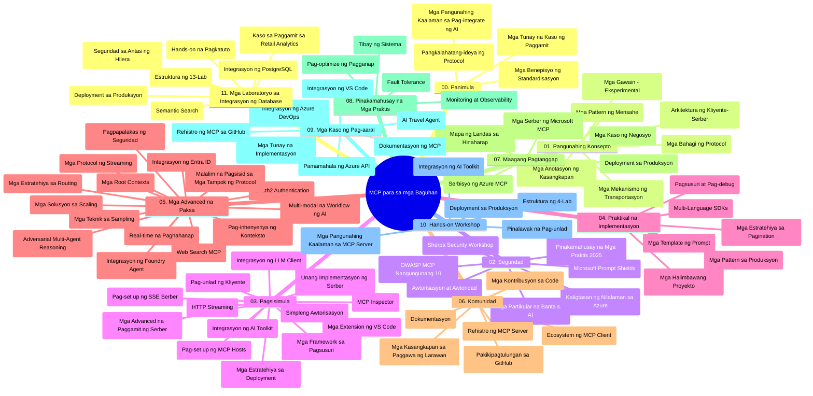

# Model Context Protocol (MCP) para sa mga Nagsisimula - Gabay sa Pag-aaral

Ang gabay sa pag-aaral na ito ay nagbibigay ng pangkalahatang ideya ng estruktura ng repositoryo at nilalaman para sa kurikulum na "Model Context Protocol (MCP) para sa mga Nagsisimula." Gamitin ang gabay na ito upang mahusay na mag-navigate sa repositoryo at magamit nang lubos ang mga magagamit na mapagkukunan.

## Pangkalahatang-ideya ng Repositoryo

Ang Model Context Protocol (MCP) ay isang naka-standardize na balangkas para sa mga pakikipag-ugnayan sa pagitan ng mga AI models at mga client application. Orihinal na nilikha ng Anthropic, ang MCP ay ngayon pinangangalagaan ng mas malawak na komunidad ng MCP sa pamamagitan ng opisyal na organisasyon sa GitHub. Ang repositoryong ito ay nagbibigay ng komprehensibong kurikulum na may mga praktikal na halimbawa ng code sa C#, Java, JavaScript, Python, at TypeScript, na dinisenyo para sa mga AI developer, system architect, at software engineer.

## Visual Curriculum Map

## Estruktura ng Repositoryo

Ang repositoryo ay naka-organisa sa labing-isang pangunahing seksyon, bawat isa ay nakatuon sa iba't ibang aspeto ng MCP:

1. **Introduksyon (00-Introduction/)**
   - Pangkalahatang ideya ng Model Context Protocol
   - Bakit mahalaga ang standardization sa AI pipelines
   - Mga praktikal na kaso ng paggamit at benepisyo

2. **Pangunahing Konsepto (01-CoreConcepts/)**
   - Client-server architecture
   - Mga pangunahing bahagi ng protocol
   - Mga pattern ng messaging sa MCP

3. **Seguridad (02-Security/)**
   - Mga banta sa seguridad sa mga MCP-based na sistema
   - Pinakamahuhusay na gawi para sa pag-secure ng implementations
   - Mga estratehiya sa authentication at authorization
   - **Komprehensibong Dokumentasyon sa Seguridad**:
     - MCP Security Best Practices 2025
     - Azure Content Safety Implementation Guide
     - MCP Security Controls and Techniques
     - MCP Best Practices Quick Reference
   - **Mga Pangunahing Paksa sa Seguridad**:
     - Prompt injection at mga tool poisoning attacks
     - Session hijacking at confused deputy problems
     - Token passthrough vulnerabilities
     - Sobra-sobrang permiso at access control
     - Supply chain security para sa mga AI components
     - Microsoft Prompt Shields integration

4. **Pagsisimula (03-GettingStarted/)**
   - Setup at configuration ng kapaligiran
   - Paggawa ng mga pangunahing MCP server at client
   - Integrasyon sa umiiral na mga aplikasyon
   - Kasama ang mga seksyon para sa:
     - Unang implementasyon ng server
     - Pagde-develop ng client
     - LLM client integration
     - VS Code integration
     - Server-Sent Events (SSE) server
     - Advanced na paggamit ng server
     - HTTP streaming
     - AI Toolkit integration
     - Mga estratehiya sa pagsubok
     - Mga patnubay sa deployment

5. **Praktikal na Implementasyon (04-PracticalImplementation/)**
   - Paggamit ng mga SDK sa iba't ibang programming languages
   - Pag-debug, pagsubok, at mga teknik sa pagpapatunay
   - Paglikha ng mga reusable prompt templates at workflows
   - Mga sample project na may mga halimbawa ng implementasyon

6. **Mga Advanced na Paksa (05-AdvancedTopics/)**
   - Mga teknik sa context engineering
   - Integrasyon ng foundry agent
   - Multi-modal AI workflows 
   - OAuth2 authentication demos
   - Mga kakayahan sa real-time search
   - Real-time streaming
   - Mga implementasyon ng root contexts
   - Mga estratehiya sa routing
   - Sampling techniques
   - Mga paraan ng scaling
   - Mga pagsasaalang-alang sa seguridad
   - Entra ID security integration
   - Web search integration
   - Adversarial multi-agent reasoning (debate patterns)

7. **Ambag ng Komunidad (06-CommunityContributions/)**
   - Paano mag-ambag ng code at dokumentasyon
   - Pakikipagtulungan sa pamamagitan ng GitHub
   - Mga pagpapabuti at feedback na pinapangunahan ng komunidad
   - Paggamit ng iba't ibang MCP clients (Claude Desktop, Cline, VSCode)
   - Paggawa gamit ang mga popular na MCP server kabilang ang image generation

8. **Mga Aral mula sa Maagang Pagtanggap (07-LessonsfromEarlyAdoption/)**
   - Mga tunay na implementasyon at kuwento ng tagumpay
   - Paggawa at pag-deploy ng mga solusyon batay sa MCP
   - Mga trend at hinaharap na roadmap
   - **Microsoft MCP Servers Guide**: Komprehensibong gabay sa 10 production-ready na Microsoft MCP server kabilang ang:
     - Microsoft Learn Docs MCP Server
     - Azure MCP Server (15+ specialized connectors)
     - GitHub MCP Server
     - Azure DevOps MCP Server
     - MarkItDown MCP Server
     - SQL Server MCP Server
     - Playwright MCP Server
     - Dev Box MCP Server
     - Azure AI Foundry MCP Server
     - Microsoft 365 Agents Toolkit MCP Server

9. **Pinakamahuhusay na Gawi (08-BestPractices/)**
   - Pag-tune ng performance at optimization
   - Pagdidisenyo ng fault-tolerant MCP systems
   - Mga estratehiya sa pagsubok at resiliency

10. **Mga Pag-aaral ng Kaso (09-CaseStudy/)**
    - **Pito na komprehensibong mga case studies** na nagpapakita ng kakayahang magamit ng MCP sa iba't ibang sitwasyon:
    - **Azure AI Travel Agents**: Multi-agent orchestration gamit ang Azure OpenAI at AI Search
    - **Azure DevOps Integration**: Pag-automate ng workflow processes gamit ang mga update sa data mula YouTube
    - **Real-Time Documentation Retrieval**: Python console client na may streaming HTTP
    - **Interactive Study Plan Generator**: Chainlit web app na may conversational AI
    - **In-Editor Documentation**: VS Code integration sa mga GitHub Copilot workflow
    - **Azure API Management**: Enterprise API integration gamit ang MCP server creation
    - **GitHub MCP Registry**: Ecosystem development at agentic integration platform
    - Mga halimbawa ng implementasyon mula sa enterprise integration, developer productivity, at ecosystem development

11. **Hands-on Workshop (10-StreamliningAIWorkflowsBuildingAnMCPServerWithAIToolkit/)**
    - Komprehensibong hands-on workshop na pinagsasama ang MCP at AI Toolkit
    - Paggawa ng mga intelligent na aplikasyon na nag-uugnay ng AI models sa mga totoong gamit
    - Mga praktikal na module na sumasaklaw sa mga pundasyon, custom server development, at mga estratehiya sa production deployment
    - **Estruktura ng Lab**:
      - Lab 1: MCP Server Fundamentals
      - Lab 2: Advanced MCP Server Development
      - Lab 3: AI Toolkit Integration
      - Lab 4: Production Deployment at Scaling
    - Lab-based na paraan ng pag-aaral na may hakbang-hakbang na mga tagubilin

12. **MCP Server Database Integration Labs (11-MCPServerHandsOnLabs/)**
    - **Komprehensibong 13-lab na learning path** para sa paggawa ng production-ready na MCP servers na may PostgreSQL integration
    - **Implementasyon sa totoong buhay ng retail analytics** gamit ang Zava Retail use case
    - **Enterprise-grade patterns** kabilang ang Row Level Security (RLS), semantic search, at multi-tenant data access
    - **Kumpletong Estruktura ng Lab**:
      - **Labs 00-03: Mga Pundasyon** - Introduksyon, Arkitektura, Seguridad, Setup ng Kapaligiran
      - **Labs 04-06: Paggawa ng MCP Server** - Database Design, MCP Server Implementation, Pagde-develop ng Tool
      - **Labs 07-09: Mga Advanced na Tampok** - Semantic Search, Pagsubok at Pag-debug, VS Code Integration
      - **Labs 10-12: Production at Pinakamahuhusay na Gawi** - Deployment, Monitoring, Optimization
    - **Mga Teknolohiyang Saklaw**: FastMCP framework, PostgreSQL, Azure OpenAI, Azure Container Apps, Application Insights
    - **Mga Resulta ng Pag-aaral**: Production-ready MCP servers, mga pattern sa database integration, AI-powered analytics, enterprise security

## Karagdagang Mga Mapagkukunan

Kasama sa repositoryo ang mga sumusuportang mapagkukunan:

- **Images folder**: Naglalaman ng mga diagram at ilustrasyon na ginamit sa buong kurikulum
- **Mga Salin**: Multi-language support na may automated na pagsasalin ng dokumentasyon
- **Opisyal na MCP Resources**:
  - [MCP Documentation](https://modelcontextprotocol.io/)
  - [MCP Specification](https://spec.modelcontextprotocol.io/)
  - [MCP GitHub Repository](https://github.com/modelcontextprotocol)

## Paano Gamitin ang Repositoryong Ito

1. **Sunod-sunod na Pag-aaral**: Sundin ang mga kabanata nang sunud-sunod (00 hanggang 11) para sa isang maayos na karanasan sa pag-aaral.
2. **Pokus sa Isang Wika**: Kung interesado ka sa isang partikular na programming language, tuklasin ang mga samples directory para sa mga implementasyon sa nais mong wika.
3. **Praktikal na Implementasyon**: Magsimula sa seksyong "Getting Started" para i-setup ang iyong kapaligiran at gumawa ng iyong unang MCP server at client.
4. **Advanced na Eksplorasyon**: Kapag komportable ka na sa mga pangunahing kaalaman, sumisid sa mga advanced na paksa upang palawakin ang iyong kaalaman.
5. **Pakikipagtulungan sa Komunidad**: Sumali sa MCP community sa pamamagitan ng GitHub discussions at Discord channels upang makipag-ugnayan sa mga eksperto at kapwa developer.

## MCP Clients at Mga Tool

Sinasaklaw ng kurikulum ang iba't ibang MCP clients at mga tool:

1. **Opisyal na Clients**:
   - Visual Studio Code 
   - MCP sa Visual Studio Code
   - Claude Desktop
   - Claude sa VSCode 
   - Claude API

2. **Mga Client ng Komunidad**:
   - Cline (terminal-based)
   - Cursor (code editor)
   - ChatMCP
   - Windsurf

3. **Mga Tool sa Pamamahala ng MCP**:
   - MCP CLI
   - MCP Manager
   - MCP Linker
   - MCP Router

## Mga Sikat na MCP Server

Ipinapakilala ng repositoryo ang iba't ibang MCP server, kabilang ang:

1. **Opisyal na Microsoft MCP Servers**:
   - Microsoft Learn Docs MCP Server
   - Azure MCP Server (15+ specialized connectors)
   - GitHub MCP Server
   - Azure DevOps MCP Server
   - MarkItDown MCP Server
   - SQL Server MCP Server
   - Playwright MCP Server
   - Dev Box MCP Server
   - Azure AI Foundry MCP Server
   - Microsoft 365 Agents Toolkit MCP Server

2. **Opisyal na Reference Servers**:
   - Filesystem
   - Fetch
   - Memory
   - Sequential Thinking

3. **Image Generation**:
   - Azure OpenAI DALL-E 3
   - Stable Diffusion WebUI
   - Replicate

4. **Mga Development Tools**:
   - Git MCP
   - Terminal Control
   - Code Assistant

5. **Mga Specialized Server**:
   - Salesforce
   - Microsoft Teams
   - Jira & Confluence

## Pagsusulong

Tinatanggap ng repositoryong ito ang mga ambag mula sa komunidad. Tingnan ang seksyong Ambag ng Komunidad para sa mga gabay kung paano epektibong makapag-ambag sa MCP ecosystem.

----

*Ang gabay sa pag-aaral na ito ay huling na-update noong Pebrero 5, 2026, na sumasalamin sa pinakabagong MCP Specification 2025-11-25 at nagbibigay ng pangkalahatang-ideya ng repositoryo hanggang sa petsang iyon. Maaring ma-update ang nilalaman ng repositoryo pagkatapos ng petsang ito.*

---

<!-- CO-OP TRANSLATOR DISCLAIMER START -->
**Paunawa**:  
Ang dokumentong ito ay isinalin gamit ang serbisyong AI translation na [Co-op Translator](https://github.com/Azure/co-op-translator). Bagamat nagsusumikap kami para sa katumpakan, pakatandaan na ang mga awtomatikong pagsasalin ay maaaring maglaman ng mga pagkakamali o kamalian. Ang orihinal na dokumento sa kanyang sariling wika ang dapat ituring na pangunahing sanggunian. Para sa mahahalagang impormasyon, inirerekomenda ang propesyonal na pagsasalin ng tao. Hindi kami mananagot sa anumang hindi pagkakaunawaan o maling interpretasyon na bunga ng paggamit ng pagsasaling ito.
<!-- CO-OP TRANSLATOR DISCLAIMER END -->