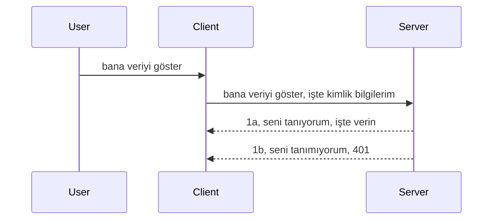

# Basit kimlik doğrulama

MCP SDK'ları, adil olmak gerekirse kimlik doğrulama sunucusu, kaynak sunucu, kimlik bilgilerini göndermek, bir kod almak, bu kodu taşıyıcı token ile değiştirmek ve sonunda kaynak verilerinize ulaşana kadar süregelen karmaşık kavramları içeren OAuth 2.1 kullanımını destekler. OAuth’a alışkın değilseniz, bu harika bir şey olmakla beraber, temel bir kimlik doğrulama seviyesiyle başlayıp daha iyi güvenlik seviyelerine doğru ilerlemek iyi bir fikirdir. Bu bölümün amacı sizi daha gelişmiş kimlik doğrulamaya hazırlamaktır.

## Kimlik doğrulama, ne demek istiyoruz?

Kimlik doğrulama, authentication ve authorization kelimelerinin kısaltmasıdır. Burada yapmamız gereken iki şey var:

- **Authentication (Kimlik doğrulama)**, bir kişinin evimize girip girmemesine karar verme işlemi, yani onların “burada” olmaya hak sahibi olup olmadığını, yani MCP Sunucumuzun özelliklerinin bulunduğu kaynak sunucumuza erişim hakkı olup olmadığını anlamak.
- **Authorization (Yetkilendirme)**, kullanıcının talep ettiği bu belirli kaynaklara erişim hakkı olup olmadığını bulma işlemi, örneğin bu siparişler ya da ürünler ya da içerik okuma hakkı olup silme hakkı olmadığı gibi.

## Kimlik bilgileri: Sisteme kim olduğumuzu nasıl söylüyoruz

Pek çok web geliştirici, genellikle sunucuya bir kimlik bilgisi sağlamak gerektiğini, genellikle “Authentication” olarak burada olmaya izin verilip verilmediğini belirten bir sır olduğunu düşünür. Bu kimlik bilgisi genellikle kullanıcı adı ve şifrenin base64 kodlanmış hali ya da belirli bir kullanıcıyı benzersiz şekilde tanımlayan bir API anahtarıdır.

Bu, “Authorization” adında bir başlık üzerinden şu şekilde gönderilir:

```json
{ "Authorization": "secret123" }
```
  
Bu genellikle temel kimlik doğrulama olarak anılır. Genel akış şu şekildedir:


Akış mantığını anladıysak, bunu nasıl uygularız? Çoğu web sunucusunda middleware (ara yazılım) kavramı vardır, bu, istek parçası olarak çalışan, kimlik bilgilerini doğrulayabilen ve kimlik bilgileri geçerliyse isteğin geçmesine izin veren bir kod parçasıdır. Eğer istek geçerli kimlik bilgisi içermiyorsa kimlik doğrulama hatası alırsınız. Bunun nasıl yapıldığına bakalım:

**Python**

```python
class AuthMiddleware(BaseHTTPMiddleware):
    async def dispatch(self, request, call_next):

        has_header = request.headers.get("Authorization")
        if not has_header:
            print("-> Missing Authorization header!")
            return Response(status_code=401, content="Unauthorized")

        if not valid_token(has_header):
            print("-> Invalid token!")
            return Response(status_code=403, content="Forbidden")

        print("Valid token, proceeding...")
       
        response = await call_next(request)
        # herhangi bir müşteri başlığı ekle veya yanıtı bir şekilde değiştir
        return response


starlette_app.add_middleware(CustomHeaderMiddleware)
```
  
Burada:

- `AuthMiddleware` adında bir middleware oluşturduk, `dispatch` metodu web sunucusu tarafından çağrılır.
- Middleware web sunucusuna eklendi:

    ```python
    starlette_app.add_middleware(AuthMiddleware)
    ```
  
- Authorization başlığının varlığını ve gönderilen sırın geçerliliğini kontrol eden doğrulama mantığı yazıldı:

    ```python
    has_header = request.headers.get("Authorization")
    if not has_header:
        print("-> Missing Authorization header!")
        return Response(status_code=401, content="Unauthorized")

    if not valid_token(has_header):
        print("-> Invalid token!")
        return Response(status_code=403, content="Forbidden")
    ```
  
Eğer sır mevcut ve geçerliyse, `call_next` çağrılarak isteğin geçmesine izin verilir ve yanıt döndürülür.

    ```python
    response = await call_next(request)
    # herhangi bir müşteri başlığı ekleyin veya cevapta herhangi bir şekilde değişiklik yapın
    return response
    ```
  
Çalışma mantığı, bir web isteği sunucuya yapıldığında middleware'in çağrılmasıdır; implementasyonuna bağlı olarak istek geçmesine izin verir veya istemcinin devam etmesine izin verilmediğini belirten bir hata döner.

**TypeScript**

Burada popüler Express framework’ü ile bir middleware oluşturup isteği MCP Sunucusuna ulaşmadan önce yakalıyoruz. İşte bunun kodu:

```typescript
function isValid(secret) {
    return secret === "secret123";
}

app.use((req, res, next) => {
    // 1. Yetkilendirme başlığı mevcut mu?
    if(!req.headers["Authorization"]) {
        res.status(401).send('Unauthorized');
    }
    
    let token = req.headers["Authorization"];

    // 2. Geçerliliği kontrol et.
    if(!isValid(token)) {
        res.status(403).send('Forbidden');
    }

   
    console.log('Middleware executed');
    // 3. İsteği istek hattındaki bir sonraki adıma geçirir.
    next();
});
```
  
Bu kodda:

1. Öncelikle Authorization başlığının var olup olmadığını kontrol ediyoruz, yoksa 401 hatası gönderiyoruz.
2. Kimlik bilgisi/token geçerliyse devam etmesine izin veriyoruz, değilse 403 hatası gönderiyoruz.
3. Son olarak isteği devam ettirip, istenen kaynağı döndürüyoruz.

## Alıştırma: Kimlik doğrulama uygula

Şimdi bilgimizi alıp uygulamaya koymaya çalışalım. Plan şu:

Sunucu

- Bir web sunucusu ve MCP örneği oluştur.
- Sunucu için middleware uygula.

İstemci

- İstemci kimlik bilgisini başlıkla gönder.

### -1- Bir web sunucusu ve MCP örneği oluştur

İlk adımda web sunucusu örneğini ve MCP Sunucusunu oluşturmalıyız.

**Python**

Burada bir MCP sunucu örneği oluşturup, starlette web uygulamasını yaratıyor ve uvicorn ile barındırıyoruz.

```python
# MCP Sunucusu oluşturuluyor

app = FastMCP(
    name="MCP Resource Server",
    instructions="Resource Server that validates tokens via Authorization Server introspection",
    host=settings["host"],
    port=settings["port"],
    debug=True
)

# starlette web uygulaması oluşturuluyor
starlette_app = app.streamable_http_app()

# uygulama uvicorn ile servis ediliyor
async def run(starlette_app):
    import uvicorn
    config = uvicorn.Config(
            starlette_app,
            host=app.settings.host,
            port=app.settings.port,
            log_level=app.settings.log_level.lower(),
        )
    server = uvicorn.Server(config)
    await server.serve()

run(starlette_app)
```
  
Bu kodda:

- MCP Sunucu oluşturuldu.
- MCP Sunucudan `app.streamable_http_app()` ile starlette web uygulaması yapıldı.
- Uvicorn ile uygulama barındırıldı ve servis edildi `server.serve()`.

**TypeScript**

Burada bir MCP Sunucu örneği oluşturuyoruz.

```typescript
const server = new McpServer({
      name: "example-server",
      version: "1.0.0"
    });

    // ... sunucu kaynakları, araçları ve istemleri ayarlayın ...
```
  
Bu MCP Sunucu oluşturma işlemi POST /mcp route tanımı içinde yapılacak, bu yüzden yukarıdaki kodu şöyle taşıyalım:

```typescript
import express from "express";
import { randomUUID } from "node:crypto";
import { McpServer } from "@modelcontextprotocol/sdk/server/mcp.js";
import { StreamableHTTPServerTransport } from "@modelcontextprotocol/sdk/server/streamableHttp.js";
import { isInitializeRequest } from "@modelcontextprotocol/sdk/types.js"

const app = express();
app.use(express.json());

// Oturum kimliğine göre taşıyıcıları depolamak için harita
const transports: { [sessionId: string]: StreamableHTTPServerTransport } = {};

// İstemciden sunucuya iletişim için POST isteklerini işleyin
app.post('/mcp', async (req, res) => {
  // Mevcut oturum kimliğini kontrol et
  const sessionId = req.headers['mcp-session-id'] as string | undefined;
  let transport: StreamableHTTPServerTransport;

  if (sessionId && transports[sessionId]) {
    // Mevcut taşıyıcıyı yeniden kullan
    transport = transports[sessionId];
  } else if (!sessionId && isInitializeRequest(req.body)) {
    // Yeni başlangıç isteği
    transport = new StreamableHTTPServerTransport({
      sessionIdGenerator: () => randomUUID(),
      onsessioninitialized: (sessionId) => {
        // Taşıyıcıyı oturum kimliğine göre depolayın
        transports[sessionId] = transport;
      },
      // DNS yeniden bağlama koruması geriye dönük uyumluluk için varsayılan olarak devre dışı bırakılmıştır. Bu sunucuyu
      // yerel olarak çalıştırıyorsanız, aşağıdakileri ayarladığınızdan emin olun:
      // enableDnsRebindingProtection: true,
      // allowedHosts: ['127.0.0.1'],
    });

    // Taşıyıcı kapandığında temizle
    transport.onclose = () => {
      if (transport.sessionId) {
        delete transports[transport.sessionId];
      }
    };
    const server = new McpServer({
      name: "example-server",
      version: "1.0.0"
    });

    // ... sunucu kaynaklarını, araçları ve istemleri ayarla ...

    // MCP sunucusuna bağlan
    await server.connect(transport);
  } else {
    // Geçersiz istek
    res.status(400).json({
      jsonrpc: '2.0',
      error: {
        code: -32000,
        message: 'Bad Request: No valid session ID provided',
      },
      id: null,
    });
    return;
  }

  // İsteği işle
  await transport.handleRequest(req, res, req.body);
});

// GET ve DELETE istekleri için yeniden kullanılabilir işleyici
const handleSessionRequest = async (req: express.Request, res: express.Response) => {
  const sessionId = req.headers['mcp-session-id'] as string | undefined;
  if (!sessionId || !transports[sessionId]) {
    res.status(400).send('Invalid or missing session ID');
    return;
  }
  
  const transport = transports[sessionId];
  await transport.handleRequest(req, res);
};

// SSE aracılığıyla sunucudan istemciye bildiriler için GET isteklerini işle
app.get('/mcp', handleSessionRequest);

// Oturum sonlandırma için DELETE isteklerini işle
app.delete('/mcp', handleSessionRequest);

app.listen(3000);
```
  
Gördüğünüz gibi MCP Sunucu oluşturma `app.post("/mcp")` içine alındı.

Şimdi middleware oluşturma adımına geçip gelen kimlik bilgisini doğrulayalım.

### -2- Sunucu için middleware uygula

Middleware kısmına geçelim. Burada `Authorization` başlığında bir kimlik bilgisi arayan ve doğrulayan bir middleware oluşturacağız. Kabul edilebilir ise istek MCP işlevini (örneğin araç listeleme, kaynak okuma veya MCP istemcinin istediği diğer işlevler) yapmaya devam eder.

**Python**

Middleware oluşturmak için `BaseHTTPMiddleware` sınıfını miras alan bir sınıf yaratmalıyız. Burada iki önemli şey var:

- İstek `request` , başlık bilgisini okuduğumuz yer.
- `call_next` çağırmamız gereken callback, istemci geçerli kimlik bilgisi getirdiyse.

İlk olarak `Authorization` başlığının eksik durumunu ele almalıyız:

```python
has_header = request.headers.get("Authorization")

# başlık yok, 401 ile başarısız ol, aksi takdirde devam et.
if not has_header:
    print("-> Missing Authorization header!")
    return Response(status_code=401, content="Unauthorized")
```
  
Burada 401 unauthorized (yetkisiz) mesajı gönderiyoruz çünkü istemci kimlik doğrulaması başarısız.

Sonra, kimlik bilgisi gönderildiyse geçerliliğini aşağıdaki gibi kontrol etmeliyiz:

```python
 if not valid_token(has_header):
    print("-> Invalid token!")
    return Response(status_code=403, content="Forbidden")
```
  
Yukarıda 403 forbidden (yasak) mesajı gönderiyoruz. Aşağıda tüm middleware’in tam hali, tüm söylediklerimizi uyguluyor:

```python
class AuthMiddleware(BaseHTTPMiddleware):
    async def dispatch(self, request, call_next):

        has_header = request.headers.get("Authorization")
        if not has_header:
            print("-> Missing Authorization header!")
            return Response(status_code=401, content="Unauthorized")

        if not valid_token(has_header):
            print("-> Invalid token!")
            return Response(status_code=403, content="Forbidden")

        print("Valid token, proceeding...")
        print(f"-> Received {request.method} {request.url}")
        response = await call_next(request)
        response.headers['Custom'] = 'Example'
        return response

```
  
Peki `valid_token` fonksiyonu ne?

```python
# Üretim için kullanmayın - geliştirin !!
def valid_token(token: str) -> bool:
    # "Bearer " ön ekini kaldırın
    if token.startswith("Bearer "):
        token = token[7:]
        return token == "secret-token"
    return False
```
  
Bu kesinlikle geliştirilmeli.

ÖNEMLİ: Bu tür sırlar kesinlikle kod içinde olmamalı. Bu değeri ideal olarak bir veri kaynağından ya da bir kimlik sağlayıcısından (IDP) almalı ya da doğrulamayı IDP’nin yapmasına izin vermelisiniz.

**TypeScript**

Express ile yapmak için `use` metodunu çağırmalıyız ki middleware fonksiyonları alınsın.

Yapmamız gerekenler:

- İstek objesine erişip `Authorization` alanındaki geçen kimlik bilgisini kontrol etmek.
- Kimlik bilgisini doğrulamak, eğer geçerli ise isteğin devam etmesine ve istemcinin MCP isteğinin işlevini yapmasına izin vermek (örneğin araçları listelemek, kaynağı okumak veya MCP ile ilgili diğer işlemler).

Burada, `Authorization` başlığının varlığını kontrol ediyoruz yoksa isteği durduruyoruz:

```typescript
if(!req.headers["authorization"]) {
    res.status(401).send('Unauthorized');
    return;
}
```
  
Başlık hiç gönderilmemişse 401 alırsınız.

Sonra, kimlik bilgisi geçerli mi kontrol ediyoruz, değilse isteği farklı bir mesajla durduruyoruz:

```typescript
if(!isValid(token)) {
    res.status(403).send('Forbidden');
    return;
} 
```
  
Artık 403 hatası alıyorsunuz.

İşte tüm kod:

```typescript
app.use((req, res, next) => {
    console.log('Request received:', req.method, req.url, req.headers);
    console.log('Headers:', req.headers["authorization"]);
    if(!req.headers["authorization"]) {
        res.status(401).send('Unauthorized');
        return;
    }
    
    let token = req.headers["authorization"];

    if(!isValid(token)) {
        res.status(403).send('Forbidden');
        return;
    }  

    console.log('Middleware executed');
    next();
});
```
  
Web sunucusunu, istemciden gönderilmesi umulan kimlik bilgisini kontrol etmek için middleware kabul edecek şekilde ayarladık. Peki ya istemci?

### -3- Kimlik bilgisiyle isteği başlık üzerinden gönder

İstemcinin kimlik bilgisini başlık üzerinden geçirdiğinden emin olmalıyız. Bunu MCP istemcisi ile yapacağız, nasıl yapıldığına bakalım.

**Python**

İstemci için, kimlik bilgisini içeren başlığı şöyle geçmeliyiz:

```python
# DEĞERİ sert kodlama, en azından bir ortam değişkeninde veya daha güvenli bir depolamada tutun
token = "secret-token"

async with streamablehttp_client(
        url = f"http://localhost:{port}/mcp",
        headers = {"Authorization": f"Bearer {token}"}
    ) as (
        read_stream,
        write_stream,
        session_callback,
    ):
        async with ClientSession(
            read_stream,
            write_stream
        ) as session:
            await session.initialize()
      
            # TODO, istemcide yapılmasını istediğiniz şey, örneğin araçları listele, araçları çağır vb.
```
  
Başlık `headers = {"Authorization": f"Bearer {token}"}` şeklinde doldurulduğuna dikkat edin.

**TypeScript**

Bunu iki adımda yapabiliriz:

1. Kimlik bilgimizi içeren bir konfigürasyon objesi oluştur.
2. Bu konfigürasyon objesini transport’a geçir.

```typescript

// DEĞERİ burada gösterildiği gibi sabit kod yazmayın. En azından bir ortam değişkeni olarak tutun ve geliştirme modunda dotenv gibi bir şey kullanın.
let token = "secret123"

// bir istemci taşıma seçeneği nesnesi tanımlayın
let options: StreamableHTTPClientTransportOptions = {
  sessionId: sessionId,
  requestInit: {
    headers: {
      "Authorization": "secret123"
    }
  }
};

// seçenekler nesnesini taşıyıcıya aktarın
async function main() {
   const transport = new StreamableHTTPClientTransport(
      new URL(serverUrl),
      options
   );
```
  
Üstte `options` objesini oluşturup, başlıkları `requestInit` alanının içine koyduğumuzu görüyorsunuz.

ÖNEMLİ: Bunu nasıl geliştiririz? Şu anki uygulama bazı riskler taşıyor. Öncelikle bu kimlik bilgisi böyle geçmek HTTPS olmadan çok risklidir. HTTPS olsa bile, kimlik bilgisi çalınabilir; bu yüzden token iptal etme, nereden geliyor kontrolü, isteklerin aşırı sık olması (bot davranışı gibi) gibi ek denetimler gerekir; mesele ciddi ve karmaşık.

Bununla beraber, kimsenin doğrulanmadan API çağırmasını istemediğiniz çok basit API’ler için buradaki uygulama iyi bir başlangıçtır.

Şimdi güvenliği biraz sertleştirmek için JSON Web Token, diğer adıyla JWT veya "JOT" tokenlarını kullanmaya geçelim.

## JSON Web Tokenlar, JWT

Basit kimlik bilgi gönderimini geliştirmeye çalışıyoruz. JWT kullanıldığında elde edeceğimiz temel iyileştirmeler neler?

- **Güvenlik geliştirmeleri**. Temel kimlik doğrulamada kullanıcı adı ve şifre base64 kodlanmış token olarak (ya da API anahtarı) tekrar tekrar gönderilir, bu risk artırır. JWT ile kullanıcı adı ve parolayı gönderip karşılığında bir token alırsınız, ayrıca bu token sürelidir, yani süresi dolacaktır. JWT ile roller, kapsamlar ve izinler kullanarak ince ayarlı erişim kontrolü kolayca yapılabilir.
- **Durumsuzluk ve ölçeklenebilirlik**. JWT kendi içinde tüm kullanıcı bilgilerini taşır, sunucu tarafı oturum depolamaya gerek bırakmaz. Token yerel olarak doğrulanabilir.
- **Birlikte çalışabilirlik ve federasyon**. JWT OpenID Connect’in merkezindedir ve Entra ID, Google Identity, Auth0 gibi bilinen kimlik sağlayıcılarıyla kullanılır. Tek oturum açma (SSO) ve daha fazlasını mümkün kılar, dolayısıyla kurumsal düzeye uygundur.
- **Modülerlik ve esneklik**. JWT API Geçitleri (Azure API Management, NGINX ve daha fazlası) ile kullanılabilir. Kimlik doğrulama senaryolarını ve sunucudan hizmete iletişim, yerine geçme ve temsil etme senaryolarını destekler.
- **Performans ve önbellekleme**. JWT çözüldükten sonra önbelleğe alınabilir, bu ayrıştırma ihtiyacını azaltır. Yüksek trafikli uygulamalarda performansı ve altyapı yükünü azaltır.
- **İleri özellikler**. Sunucu tarafında geçerlilik kontrolü (introspection) ve token iptali (revocation) destekler.

Tüm bu avantajlarla, uygulamamızı bir sonraki seviyeye taşıyalım.

## Temel kimlik doğrulamayı JWT’ye dönüştürme

Yapmamız gereken temel değişiklikler şunlar:

- **JWT token inşa etmeyi öğrenmek** ve istemciden sunucuya gönderilmeye hazır hale getirmek.
- **JWT token doğrulamak**, eğer geçerliyse istemciye kaynaklarımızı sağlamak.
- **Token’ı güvenli saklamak**. Bu token’ın nasıl saklanacağı.
- **Yolları korumak**. Rotaları ve MCP özelliklerini korumamız gerekiyor.
- **Yenileme tokenları eklemek**. Kısa ömürlü tokenlar ve süresi dolduğunda yeni token almak için uzun ömürlü yenileme tokenları oluşturmak. Ayrıca bir yenileme API’si ve döndürme stratejisi sağlamak.

### -1- JWT token oluşturma

Öncelikle JWT token şu parçalardan oluşur:

- **header**, kullanılan algoritma ve token türü.
- **payload**, iddialar (claims), örn. sub (token’ın temsil ettiği kullanıcı veya varlık; auth senaryosunda genelde kullanıcıid), exp (bitiş zamanı), role (rol)
- **signature**, bir sır veya özel anahtarla imzalanır.

Bunlar için header, payload ve kodlanmış token oluşturmalıyız.

**Python**

```python

import jwt
import jwt
from jwt.exceptions import ExpiredSignatureError, InvalidTokenError
import datetime

# JWT'yi imzalamak için kullanılan gizli anahtar
secret_key = 'your-secret-key'

header = {
    "alg": "HS256",
    "typ": "JWT"
}

# kullanıcı bilgisi ve iddiaları ile son kullanma zamanı
payload = {
    "sub": "1234567890",               # Konu (kullanıcı kimliği)
    "name": "User Userson",                # Özel iddia
    "admin": True,                     # Özel iddia
    "iat": datetime.datetime.utcnow(),# Veriliş zamanı
    "exp": datetime.datetime.utcnow() + datetime.timedelta(hours=1)  # Son kullanma
}

# onu kodla
encoded_jwt = jwt.encode(payload, secret_key, algorithm="HS256", headers=header)
```
  
Yukarıdaki kodda:

- HS256 algoritmasını ve tip olarak JWT’yi kullanarak header tanımlandı.
- Subject veya kullanıcı id, kullanıcı adı, rol, oluşturulma zamanı ve son kullanım zamanı gibi payload oluşturuldu; böylece zaman sınırı uygulanmış oldu.

**TypeScript**

Bunun için JWT token oluşturmayı sağlayacak bağımlılıklara ihtiyacımız var.

Bağımlılıklar

```sh

npm install jsonwebtoken
npm install --save-dev @types/jsonwebtoken
```
  
Şimdi bunları kurduk, header, payload oluşturup kodlanmış tokenüretelim.

```typescript
import jwt from 'jsonwebtoken';

const secretKey = 'your-secret-key'; // Üretimde ortam değişkenlerini kullanın

// Yükü tanımla
const payload = {
  sub: '1234567890',
  name: 'User usersson',
  admin: true,
  iat: Math.floor(Date.now() / 1000), // Düzenlenme zamanı
  exp: Math.floor(Date.now() / 1000) + 60 * 60 // 1 saat içinde sona erer
};

// Başlığı tanımla (isteğe bağlı, jsonwebtoken varsayılanları ayarlar)
const header = {
  alg: 'HS256',
  typ: 'JWT'
};

// Token oluştur
const token = jwt.sign(payload, secretKey, {
  algorithm: 'HS256',
  header: header
});

console.log('JWT:', token);
```
  
Bu token:

HS256 ile imzalanmış
1 saat geçerli
sub, name, admin, iat ve exp gibi iddiaları içeriyor.

### -2- Token doğrulama

Token doğrulamamız gerekir, bu sunucu tarafında istemcinin gönderdiğinin gerçekten geçerli olduğundan emin olmak için yapılır. Yapısal doğrulamadan geçerliliğe kadar pek çok kontrol yapılmalı. Ayrıca kullanıcının sistemde olup olmadığını ve daha fazlasını kontrol denetlemeniz önerilir.

Token doğrulamak için token’ı çözümleyip okuyabilmemiz gerekir, sonra geçerliliğini kontrol ederiz:

**Python**

```python

# JWT'yi çöz ve doğrula
try:
    decoded = jwt.decode(token, secret_key, algorithms=["HS256"])
    print("✅ Token is valid.")
    print("Decoded claims:")
    for key, value in decoded.items():
        print(f"  {key}: {value}")
except ExpiredSignatureError:
    print("❌ Token has expired.")
except InvalidTokenError as e:
    print(f"❌ Invalid token: {e}")

```
  
Bu kodda token, gizli anahtar ve algoritma ile `jwt.decode` çağrılıyor. Başarısız doğrulama hata oluşturduğundan try-catch yapısı kullanıyoruz.

**TypeScript**

Burada `jwt.verify` çağrılıp token’ın çözülmüş hali elde edilir ve analiz edilir. Eğer çağrı başarısızsa, token yapısı hatalı veya artık geçerli değildir.

```typescript

try {
  const decoded = jwt.verify(token, secretKey);
  console.log('Decoded Payload:', decoded);
} catch (err) {
  console.error('Token verification failed:', err);
}
```
  
NOT: Önceki gibi, token’ın sisteminizde bir kullanıcıya işaret ettiğini ve kullanıcının iddialarındaki haklara sahip olduğunu doğrulayan ek kontroller yapmanız önerilir.

Sonraki adımda rol tabanlı erişim kontrolüne (RBAC) bakalım.
## Rol tabanlı erişim kontrolü ekleme

Fikir, farklı rollerin farklı izinlere sahip olduğunu ifade etmek istiyoruz. Örneğin, bir yöneticinin her şeyi yapabileceğini, normal bir kullanıcının okuma/yazma yapabileceğini ve bir misafirin sadece okuyabileceğini varsayıyoruz. Bu nedenle, işte bazı olası izin seviyeleri:

- Admin.Write 
- User.Read
- Guest.Read

Böyle bir kontrolü ara yazılım ile nasıl uygulayabileceğimize bakalım. Ara yazılımlar rota bazında veya tüm rotalar için eklenebilir.

**Python**

```python
from starlette.middleware.base import BaseHTTPMiddleware
from starlette.responses import JSONResponse
import jwt

# Şifreyi kodda tutmayın, bu sadece gösterim amaçlıdır. Güvenli bir yerden okuyun.
SECRET_KEY = "your-secret-key" # bunu ortam değişkenine koyun
REQUIRED_PERMISSION = "User.Read"

class JWTPermissionMiddleware(BaseHTTPMiddleware):
    async def dispatch(self, request, call_next):
        auth_header = request.headers.get("Authorization")
        if not auth_header or not auth_header.startswith("Bearer "):
            return JSONResponse({"error": "Missing or invalid Authorization header"}, status_code=401)

        token = auth_header.split(" ")[1]
        try:
            decoded = jwt.decode(token, SECRET_KEY, algorithms=["HS256"])
        except jwt.ExpiredSignatureError:
            return JSONResponse({"error": "Token expired"}, status_code=401)
        except jwt.InvalidTokenError:
            return JSONResponse({"error": "Invalid token"}, status_code=401)

        permissions = decoded.get("permissions", [])
        if REQUIRED_PERMISSION not in permissions:
            return JSONResponse({"error": "Permission denied"}, status_code=403)

        request.state.user = decoded
        return await call_next(request)


```

Ara yazılımı eklemenin aşağıdaki gibi birkaç farklı yolu vardır:

```python

# Alt 1: starlette uygulaması oluşturulurken ara katman ekle
middleware = [
    Middleware(JWTPermissionMiddleware)
]

app = Starlette(routes=routes, middleware=middleware)

# Alt 2: starlette uygulaması zaten oluşturulduktan sonra ara katman ekle
starlette_app.add_middleware(JWTPermissionMiddleware)

# Alt 3: rota başına ara katman ekle
routes = [
    Route(
        "/mcp",
        endpoint=..., # işleyici
        middleware=[Middleware(JWTPermissionMiddleware)]
    )
]
```

**TypeScript**

Tüm istekler için çalışacak bir ara yazılımı `app.use` ile kullanabiliriz.

```typescript
app.use((req, res, next) => {
    console.log('Request received:', req.method, req.url, req.headers);
    console.log('Headers:', req.headers["authorization"]);

    // 1. Yetkilendirme başlığının gönderilip gönderilmediğini kontrol edin

    if(!req.headers["authorization"]) {
        res.status(401).send('Unauthorized');
        return;
    }
    
    let token = req.headers["authorization"];

    // 2. Token'ın geçerli olup olmadığını kontrol edin
    if(!isValid(token)) {
        res.status(403).send('Forbidden');
        return;
    }  

    // 3. Token kullanıcısının sistemimizde olup olmadığını kontrol edin
    if(!isExistingUser(token)) {
        res.status(403).send('Forbidden');
        console.log("User does not exist");
        return;
    }
    console.log("User exists");

    // 4. Token'ın doğru izinlere sahip olduğunu doğrulayın
    if(!hasScopes(token, ["User.Read"])){
        res.status(403).send('Forbidden - insufficient scopes');
    }

    console.log("User has required scopes");

    console.log('Middleware executed');
    next();
});

```

Ara yazılımımızın yapabileceği ve YAPMASI GEREKEN oldukça fazla şey var, özellikle:

1. Yetkilendirme başlığının var olup olmadığını kontrol et
2. Token geçerliyse kontrol et, `isValid` adında JWT token bütünlüğü ve geçerliliğini kontrol eden bir metot yazdık.
3. Kullanıcının sistemimizde var olduğunu doğrula, bunu kontrol etmeliyiz.

   ```typescript
    // Veritabanındaki kullanıcılar
   const users = [
     "user1",
     "User usersson",
   ]

   function isExistingUser(token) {
     let decodedToken = verifyToken(token);

     // YAPILACAK, kullanıcının veritabanında olup olmadığını kontrol et
     return users.includes(decodedToken?.name || "");
   }
   ```

   Yukarıda çok basit bir `users` listesi oluşturduk, tabii ki bunun bir veritabanında olması gerekir.

4. Ayrıca, tokenın doğru izinlere sahip olup olmadığını da kontrol etmeliyiz.

   ```typescript
   if(!hasScopes(token, ["User.Read"])){
        res.status(403).send('Forbidden - insufficient scopes');
   }
   ```

   Yukarıdaki ara yazılım kodunda, tokenın User.Read iznine sahip olduğunu kontrol ediyoruz, değilse 403 hatası gönderiyoruz. Aşağıda `hasScopes` yardımcı metodu var.

   ```typescript
   function hasScopes(scope: string, requiredScopes: string[]) {
     let decodedToken = verifyToken(scope);
    return requiredScopes.every(scope => decodedToken?.scopes.includes(scope));
  }
   ```

Have a think which additional checks you should be doing, but these are the absolute minimum of checks you should be doing.

Using Express as a web framework is a common choice. There are helpers library when you use JWT so you can write less code.

- `express-jwt`, helper library that provides a middleware that helps decode your token.
- `express-jwt-permissions`, this provides a middleware `guard` that helps check if a certain permission is on the token.

Here's what these libraries can look like when used:

```typescript
const express = require('express');
const jwt = require('express-jwt');
const guard = require('express-jwt-permissions')();

const app = express();
const secretKey = 'your-secret-key'; // put this in env variable

// Decode JWT and attach to req.user
app.use(jwt({ secret: secretKey, algorithms: ['HS256'] }));

// Check for User.Read permission
app.use(guard.check('User.Read'));

// multiple permissions
// app.use(guard.check(['User.Read', 'Admin.Access']));

app.get('/protected', (req, res) => {
  res.json({ message: `Welcome ${req.user.name}` });
});

// Error handler
app.use((err, req, res, next) => {
  if (err.code === 'permission_denied') {
    return res.status(403).send('Forbidden');
  }
  next(err);
});

```

Artık ara yazılımın hem kimlik doğrulama hem de yetkilendirme için nasıl kullanılabileceğini gördünüz, peki MCP için durum nedir, kimlik doğrulama yapma şeklimizi değiştiriyor mu? Bir sonraki bölümde öğrenelim.

### -3- MCP'ye RBAC Ekleme

Şimdiye kadar ara yazılımla nasıl RBAC ekleyebileceğinizi gördünüz, ancak MCP için özellik bazında RBAC kolayca eklenemiyor, o zaman ne yapıyoruz? Örneğin bir aracın çağrılma hakkı olup olmadığını kontrol eden şu gibi kodlar eklememiz gerekiyor:

Özellik bazında RBAC uygulamak için birkaç farklı seçeneğiniz var, işte bazıları:

- İzin seviyesini kontrol etmeniz gereken her araç, kaynak, istem için bir kontrol ekleyin.

   **python**

   ```python
   @tool()
   def delete_product(id: int):
      try:
          check_permissions(role="Admin.Write", request)
      catch:
        pass # istemci yetkilendirmede başarısız oldu, yetkilendirme hatası oluştur
   ```

   **typescript**

   ```typescript
   server.registerTool(
    "delete-product",
    {
      title: Delete a product",
      description: "Deletes a product",
      inputSchema: { id: z.number() }
    },
    async ({ id }) => {
      
      try {
        checkPermissions("Admin.Write", request);
        // yapılacak, id'yi productService ve uzak girişe gönder
      } catch(Exception e) {
        console.log("Authorization error, you're not allowed");  
      }

      return {
        content: [{ type: "text", text: `Deletected product with id ${id}` }]
      };
    }
   );
   ```


- Daha az yerde kontrol yapmanız için gelişmiş sunucu yaklaşımı ve istek işleyicileri kullanın.

   **Python**

   ```python
   
   tool_permission = {
      "create_product": ["User.Write", "Admin.Write"],
      "delete_product": ["Admin.Write"]
   }

   def has_permission(user_permissions, required_permissions) -> bool:
      # user_permissions: kullanıcının sahip olduğu izinlerin listesi
      # required_permissions: araç için gerekli olan izinlerin listesi
      return any(perm in user_permissions for perm in required_permissions)

   @server.call_tool()
   async def handle_call_tool(
     name: str, arguments: dict[str, str] | None
   ) -> list[types.TextContent]:
    # request.user.permissions'in kullanıcı için izinlerin listesi olduğunu varsayın
     user_permissions = request.user.permissions
     required_permissions = tool_permission.get(name, [])
     if not has_permission(user_permissions, required_permissions):
        # Hata ver "Aracı çağırma izniniz yok {name}"
        raise Exception(f"You don't have permission to call tool {name}")
     # devam et ve aracı çağır
     # ...
   ```   
   

   **TypeScript**

   ```typescript
   function hasPermission(userPermissions: string[], requiredPermissions: string[]): boolean {
       if (!Array.isArray(userPermissions) || !Array.isArray(requiredPermissions)) return false;
       // Kullanıcının en az bir gerekli izni varsa true döndür
       
       return requiredPermissions.some(perm => userPermissions.includes(perm));
   }
  
   server.setRequestHandler(CallToolRequestSchema, async (request) => {
      const { params: { name } } = request;
  
      let permissions = request.user.permissions;
  
      if (!hasPermission(permissions, toolPermissions[name])) {
         return new Error(`You don't have permission to call ${name}`);
      }
  
      // devam et..
   });
   ```

   Not: Yukarıdaki kodun basit olması için ara yazılımınızın çözümlenmiş tokenı request nesnesinin user özelliğine ataması gerekir.

### Özet

Şimdi genelde ve özellikle MCP için RBAC desteği eklemeyi konuştuk, kavramları anladığınızdan emin olmak için güvenliği kendiniz uygulamaya çalışmanın zamanı geldi.

## Görev 1: Temel kimlik doğrulama kullanarak bir mcp sunucusu ve mcp istemcisi oluşturun

Burada başlıklar üzerinden kimlik bilgisi gönderme konusundaki öğrendiklerinizi kullanacaksınız.

## Çözüm 1

[Çözüm 1](./code/basic/README.md)

## Görev 2: Görev 1'deki çözümü JWT kullanacak şekilde yükseltin

İlk çözümü alın ama bu sefer geliştirelim.

Temel Kimlik Doğrulama yerine JWT kullanalım.

## Çözüm 2

[Çözüm 2](./solution/jwt-solution/README.md)

## Meydan Okuma

"MCP'ye RBAC ekleme" bölümünde anlattığımız araç başına RBAC'yi ekleyin.

## Özet

Bu bölümde umarım çok şey öğrendiniz; hiç güvenlik olmamasından, temel güvenliğe, JWT'ye ve bunun MCP'ye nasıl eklenebileceğine kadar.

Özel JWT'lerle sağlam bir temel oluşturduk, ancak ölçeklendikçe standartlara dayalı bir kimlik modeli yönüne gidiyoruz. Entra veya Keycloak gibi bir IdP kabul etmek, token oluşturma, doğrulama ve yaşam döngüsü yönetimini güvenilir bir platforma devretmemizi sağlar — böylece uygulama mantığı ve kullanıcı deneyimine odaklanabiliriz.

Bunun için daha gelişmiş bir [Entra bölümü](../../05-AdvancedTopics/mcp-security-entra/README.md) mevcut.

## Sonraki Adım

- Sonraki: [MCP Hostları Ayarlama](../12-mcp-hosts/README.md)

---

<!-- CO-OP TRANSLATOR DISCLAIMER START -->
**Feragatname**:  
Bu belge, AI çeviri servisi [Co-op Translator](https://github.com/Azure/co-op-translator) kullanılarak çevrilmiştir. Doğruluk için çaba sarf etsek de, otomatik çevirilerin hatalar veya yanlışlıklar içerebileceğini lütfen unutmayın. Orijinal belge, kendi dilinde yetkili kaynak olarak kabul edilmelidir. Kritik bilgiler için profesyonel insan çevirisi önerilir. Bu çevirinin kullanılmasıyla oluşabilecek yanlış anlamalar veya yorum hatalarından sorumlu değiliz.
<!-- CO-OP TRANSLATOR DISCLAIMER END -->