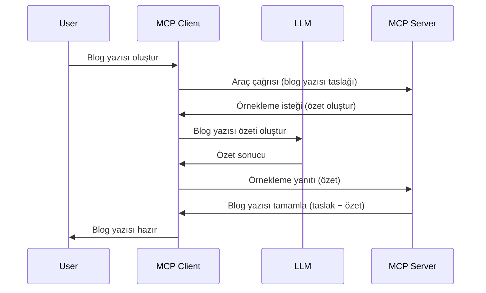

# Örnekleme - Özellikleri İstemciye Devretme

Bazen, MCP İstemcisi ve MCP Sunucusunun ortak bir hedefe ulaşmak için işbirliği yapması gerekir. Sunucunun istemcide bulunan bir LLM'in yardımına ihtiyaç duyduğu bir durumunuz olabilir. Bu durumda, kullanmanız gereken şey örneklemedir.

Hadi bazı kullanım durumlarını ve örneklemeyi içeren bir çözümün nasıl oluşturulacağını keşfedelim.

## Genel Bakış

Bu derste, Örneklemenin ne zaman ve nerede kullanılacağını ve nasıl yapılandırılacağını açıklamaya odaklanacağız.

## Öğrenme Hedefleri

Bu bölümde:

- Örneklemenin ne olduğunu ve ne zaman kullanılması gerektiğini açıklayacağız.
- MCP'de Örnekleme nasıl yapılandırılır göstereceğiz.
- Örneklemenin uygulamada örneklerini sunacağız.

## Örnekleme Nedir ve Neden Kullanılır?

Örnekleme, aşağıdaki şekilde çalışan gelişmiş bir özelliktir:


### Örnekleme isteği

Tamam, şimdi gerçekçi bir senaryoya genel bir bakışımız var, sunucunun istemciye gönderdiği örnekleme isteğinden bahsedelim. Böyle bir isteğin JSON-RPC formatında nasıl görünebileceği şöyle:

```json
{
  "jsonrpc": "2.0",
  "id": 1,
  "method": "sampling/createMessage",
  "params": {
    "messages": [
      {
        "role": "user",
        "content": {
          "type": "text",
          "text": "Create a blog post summary of the following blog post: <BLOG POST>"
        }
      }
    ],
    "modelPreferences": {
      "hints": [
        {
          "name": "claude-3-sonnet"
        }
      ],
      "intelligencePriority": 0.8,
      "speedPriority": 0.5
    },
    "systemPrompt": "You are a helpful assistant.",
    "maxTokens": 100
  }
}
```

Burada vurgulanması gereken birkaç nokta var:

- İçerik -> metin altında bulunan İstek, LLM'in blog gönderisi içeriğini özetlemesi için bir talimattır.

- **modelPreferences**. Bu bölüm tam olarak budur: bir tercih, LLM ile kullanılacak yapılandırma için bir öneri. Kullanıcı bu önerilere uyabilir veya değiştirebilir. Bu durumda, kullanılacak modele ve hız ile zeka önceliğine dair öneriler vardır.
- **systemPrompt**, LLM'inize kişilik veren ve rehberlik talimatları içeren normal sistem isteminizdir.
- **maxTokens**, bu görev için önerilen kullanılacak token sayısını belirtmek için kullanılan başka bir özelliktir.

### Örnekleme yanıtı

Bu yanıt, MCP İstemcisinin MCP Sunucusuna geri gönderdiği ve istemcinin LLM'i çağırıp yanıtı bekledikten sonra oluşturduğu mesajdır. JSON-RPC formatında şöyle görünebilir:

```json
{
  "jsonrpc": "2.0",
  "id": 1,
  "result": {
    "role": "assistant",
    "content": {
      "type": "text",
      "text": "Here's your abstract <ABSTRACT>"
    },
    "model": "gpt-5",
    "stopReason": "endTurn"
  }
}
```

Yanıtın, istediğimiz şekilde blog gönderisi özeti olduğunu fark edin. Ayrıca kullanılan `model`'in istediğimiz değil ama "claude-3-sonnet" yerine "gpt-5" olduğunu görün. Bu, kullanıcının ne kullanacağına kararını değiştirebileceğini ve örnekleme isteğinizin bir öneri olduğunu göstermek içindir.

Tamam, ana akışı ve kullanışlı görevi, "blog gönderisi oluşturma + özet" için anladığımıza göre, bunu çalıştırmak için ne yapmamız gerektiğine bakalım.

### Mesaj türleri

Örnekleme mesajları sadece metinle sınırlı değildir, aynı zamanda resim ve ses de gönderebilirsiniz. JSON-RPC burada nasıl farklı görünür:

**Metin**

```json
{
  "type": "text",
  "text": "The message content"
}
```

**Resim içeriği**

```json
{
  "type": "image",
  "data": "base64-encoded-image-data",
  "mimeType": "image/jpeg"
}
```

**Ses içeriği**

```json
{
  "type": "audio",
  "data": "base64-encoded-audio-data",
  "mimeType": "audio/wav"
}
```

> NOT: Örnekleme hakkında daha detaylı bilgi için [resmi belgelere](https://modelcontextprotocol.io/specification/2025-06-18/client/sampling) göz atabilirsiniz.

## İstemcide Örnekleme Nasıl Yapılandırılır

> Not: Sadece bir sunucu oluşturuyorsanız, burada çok bir şeyi yapmanıza gerek yok.

Bir istemcide aşağıdaki özelliği şu şekilde belirtmeniz gerekir:

```json
{
  "capabilities": {
    "sampling": {}
  }
}
```

Böylece seçilen istemciniz sunucuyla başlatılırken bu özellik alınacaktır.

## Örneklemenin Uygulamadaki Örneği - Blog Gönderisi Yaratma

Bir örnekleme sunucusunu birlikte kodlayalım, aşağıdakileri yapmamız gerekecek:

1. Sunucuda bir araç oluşturun.
1. Bu araç bir örnekleme isteği oluşturmalı
1. Araç, istemcinin örnekleme isteğine yanıt vermesini beklemeli.
1. Sonra araç sonucu üretilmeli.

Adım adım koda bakalım:

### -1- Aracı oluştur

**python**

```python
@mcp.tool()
async def create_blog(title: str, content: str, ctx: Context[ServerSession, None]) -> str:
    """Create a blog post and generate a summary"""

```

### -2- Örnekleme isteği oluştur

Aracınızı aşağıdaki kodla genişletin:

**python**

```python
post = BlogPost(
        id=len(posts) + 1,
        title=title,
        content=content,
        abstract=""
    )

prompt = f"Create an abstract of the following blog post: title: {title} and draft: {content} "

result = await ctx.session.create_message(
        messages=[
            SamplingMessage(
                role="user",
                content=TextContent(type="text", text=prompt),
            )
        ],
        max_tokens=100,
)

```

### -3- Yanıtı bekle ve yanıtı döndür

**python**

```python
post.abstract = result.content.text

posts.append(post)

# tamamlanmış ürünü iade edin
return json.dumps({
    "id": post.title,
    "abstract": post.abstract
})
```

### -4- Tam kod

**python**

```python
from starlette.applications import Starlette
from starlette.routing import Mount, Host

from mcp.server.fastmcp import Context, FastMCP

from mcp.server.session import ServerSession
from mcp.types import SamplingMessage, TextContent

import json


from uuid import uuid4
from typing import List
from pydantic import BaseModel


mcp = FastMCP("Blog post generator")

# app = FastAPI()

posts = []

class BlogPost(BaseModel):
    id: int
    title: str
    content: str
    abstract: str

posts: List[BlogPost] = []

@mcp.tool()
async def create_blog(title: str, content: str, ctx: Context[ServerSession, None]) -> str:
    """Create a blog post and generate a summary"""

    post = BlogPost(
        id=len(posts) + 1,
        title=title,
        content=content,
        abstract=""
    )

    prompt = f"Create an abstract of the following blog post: title: {title} and draft: {content} "

    result = await ctx.session.create_message(
        messages=[
            SamplingMessage(
                role="user",
                content=TextContent(type="text", text=prompt),
            )
        ],
        max_tokens=100,
    )

    post.abstract = result.content.text

    posts.append(post)

    # tam blog yazısını döndür
    return json.dumps({
        "id": post.title,
        "abstract": post.abstract
    })

if __name__ == "__main__":
    print("Starting server...")
    # mcp.run()
    mcp.run(transport="streamable-http")

# uygulamayı çalıştır: python server.py
```

### -5- Visual Studio Code'da test etme

Bunu Visual Studio Code'da test etmek için şu adımları izleyin:

1. Terminalde sunucuyu başlatın
1. *mcp.json* dosyasına ekleyin (ve başlatıldığından emin olun) örneğin şöyle:

   ```json
   "servers": {
      "blog-server": {
        "type": "http",
        "url": "http://localhost:8000/mcp"
      }
   }
   ```

1. Bir istek yazın:

   ```text
   create a blog post named "Where Python comes from", the content is "Python is actually named after Monty Python Flying Circus"
   ```

1. Örnekleme işleminin gerçekleşmesine izin verin. Bunu ilk defa test ettiğinizde ek bir diyaloğun onaylanması istenecek, ardından sizi bir aracı çalıştırmak için normal diyalogla karşılayacaktır.

1. Sonuçları inceleyin. Sonuçları hem GitHub Copilot Sohbet'te güzel şekilde görebilir hem de ham JSON yanıtını inceleyebilirsiniz.

**Bonus**. Visual Studio Code araçları örneklemeyi çok iyi destekler. Örnekleme erişimini kurulu sunucunuzda aşağıdaki şekilde yapılandırabilirsiniz:

1. Uzantılar bölümüne gidin.
1. "MCP SERVERS - INSTALLED" bölümündeki kurulu sunucunuzun dişli ikonunu seçin.
1 "Model Erişimini Yapılandır" seçeneğini seçin, burada GitHub Copilot'un örnekleme yaparken hangi Modelleri kullanabileceğini seçebilirsiniz. Ayrıca son zamanlarda gerçekleşen tüm örnekleme isteklerini "Örnekleme isteklerini göster" seçeneğiyle görebilirsiniz.

## Ödev

Bu ödevde, biraz farklı bir Örnekleme, yani ürün açıklaması oluşturmaya destek veren bir örnekleme entegrasyonu oluşturacaksınız. İşte senaryonuz:

**Senaryo**: E-ticaret ofis çalışanı, ürün açıklaması oluşturmanın çok uzun sürdüğünden yardım istiyor. Bu nedenle, "title" ve "keywords" argümanlarıyla "create_product" adında bir aracı çağırabileceğiniz ve tam bir ürün oluşturacak bir çözüm yapmanız gerekiyor, "description" alanı ise istemcinin LLM'i tarafından doldurulacak.

İPUCU: Daha önce öğrendiklerinizi kullanarak bu sunucuyu ve aracını bir örnekleme isteği kullanarak oluşturun.

## Çözüm

[Çözüm](./solution/README.md)

## Önemli Noktalar

Örnekleme, sunucunun LLM yardımına ihtiyaç duyduğunda görevleri istemciye devretmesini sağlayan güçlü bir özelliktir.

## Sonraki Adımlar

- [Bölüm 4 - Pratik uygulama](../../04-PracticalImplementation/README.md)

---

<!-- CO-OP TRANSLATOR DISCLAIMER START -->
**Feragatname**:  
Bu belge, yapay zeka çeviri hizmeti [Co-op Translator](https://github.com/Azure/co-op-translator) kullanılarak çevrilmiştir. Doğruluk için çaba göstersek de, otomatik çevirilerin hatalar veya yanlışlıklar içerebileceğini lütfen unutmayın. Orijinal belge, kendi özgün dilinde yetkili kaynak olarak kabul edilmelidir. Kritik bilgiler için profesyonel insan çevirisi önerilir. Bu çevirinin kullanımı nedeniyle ortaya çıkan herhangi bir yanlış anlama veya yorumdan sorumlu değiliz.
<!-- CO-OP TRANSLATOR DISCLAIMER END -->