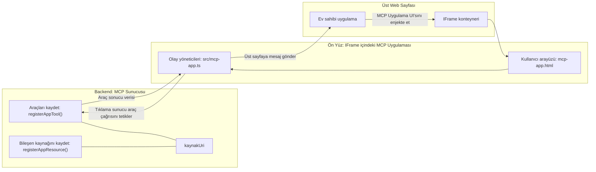

# MCP Uygulamaları

MCP Uygulamaları, MCP'de yeni bir paradigmadır. Fikir, sadece bir araç çağrısından veriyle yanıt vermek değil, aynı zamanda bu bilginin nasıl etkileşime girileceğine dair bilgi sağlamaktır. Bu, araç sonuçlarının artık UI bilgisi içerebileceği anlamına gelir. Peki neden bunu isteriz? Bugün işlerinizi nasıl yaptığınıza bir bakalım. Muhtemelen bir MCP Sunucusunun sonuçlarını tüketmek için önünde bir tür ön yüz kodu yazıyorsunuz ve bunu sürdürmeniz gerekiyor. Bazen istediğiniz budur, ancak bazen veri ve kullanıcı arayüzünü tamamen kapsayan kendine yeten bir bilgi parçasını getirmeniz harika olurdu.

## Genel Bakış

Bu ders, MCP Uygulamaları hakkında pratik rehberlik sağlar, nasıl başlayacağınızı ve mevcut Web Uygulamalarınıza nasıl entegre edeceğinizi açıklar. MCP Uygulamaları, MCP Standardına çok yeni eklenen bir özelliktir.

## Öğrenme Hedefleri

Bu dersin sonunda şunları yapabileceksiniz:

- MCP Uygulamalarının ne olduğunu açıklamak.
- MCP Uygulamalarının ne zaman kullanılacağını.
- Kendi MCP Uygulamalarınızı oluşturup entegre etmeyi.

## MCP Uygulamaları - nasıl çalışır

MCP Uygulamaları ile amaç, temelde render edilmek üzere bir bileşen sağlayan bir yanıt vermektir. Böyle bir bileşen hem görsel hem de etkileşimli olabilir; örneğin düğme tıklamaları, kullanıcı girişi ve daha fazlası. Sunucu tarafı ve MCP Sunucumuzla başlayalım. Bir MCP Uygulaması bileşeni oluşturmak için hem bir araç hem de uygulama kaynağı oluşturmanız gerekir. Bu iki parça, bir resourceUri ile bağlanır.

İşte bir örnek. İlgili parçaları ve işlevlerini görselleştirelim:

```text
server.ts -- responsible for registering tools and the component as a UI component
src/
  mcp-app.ts -- wiring up event handlers
mcp-app.html -- the user interface
```

Bu görsel, bir bileşen ve mantığını oluşturmanın mimarisini anlatıyor.


Sırasıyla backend ve frontend sorumluluklarını tanımlamaya çalışalım.

### Backend

Burada iki şeyi başarmamız gerekiyor:

- Etkileşim kurmak istediğimiz araçları kaydetmek.
- Bileşeni tanımlamak.

**Aracı kaydetmek**

```typescript
registerAppTool(
    server,
    "get-time",
    {
      title: "Get Time",
      description: "Returns the current server time.",
      inputSchema: {},
      _meta: { ui: { resourceUri } }, // Bu aracı UI kaynağına bağlar
    },
    async () => {
      const time = new Date().toISOString();
      return { content: [{ type: "text", text: time }] };
    },
  );

```

Yukarıdaki kod, `get-time` adında bir araç açığa çıkaran davranışı tanımlıyor. Girdi almıyor ama nihayetinde geçerli zamanı üretiyor. Kullanıcı girdisini kabul etmemiz gereken araçlar için `inputSchema` tanımlama imkanımız var.

**Bileşeni kaydetmek**

Aynı dosyada bileşeni de kaydetmemiz gerekiyor:

```typescript
const resourceUri = "ui://get-time/mcp-app.html";

// UI için bir araya getirilmiş HTML/JavaScript'i döndüren kaynağı kaydedin.
registerAppResource(
  server,
  resourceUri,
  resourceUri,
  { mimeType: RESOURCE_MIME_TYPE },
  async () => {
    const html = await fs.readFile(path.join(DIST_DIR, "mcp-app.html"), "utf-8");

    return {
    contents: [
        { uri: resourceUri, mimeType: RESOURCE_MIME_TYPE, text: html },
    ],
    };
  },
);
```

Bileşeni araçlarıyla bağlamak için `resourceUri` kısmına dikkat edin. İlgi çekici olan bir diğer nokta da UI dosyasını yükleyip bileşeni döndüren geri çağrıdır.

### Bileşen ön yüzü

Backend gibi burada da iki parça vardır:

- Saf HTML ile yazılmış bir ön yüz.
- Olayları işleyen ve ne yapılacağını (örneğin, araç çağırma veya üst pencereye mesaj gönderme) kontrol eden kod.

**Kullanıcı arayüzü**

Kullanıcı arayüzüne bakalım.

```html
<!-- mcp-app.html -->
<!DOCTYPE html>
<html lang="en">
  <head>
    <meta charset="UTF-8" />
    <title>Get Time App</title>
  </head>
  <body>
    <p>
      <strong>Server Time:</strong> <code id="server-time">Loading...</code>
    </p>
    <button id="get-time-btn">Get Server Time</button>
    <script type="module" src="/src/mcp-app.ts"></script>
  </body>
</html>
```

**Olay bağlama**

Son parça olayların bağlanmasıdır. Yani UI'da hangi kısımların olay işleyicilere ihtiyacı olduğunu belirleriz ve olaylar tetiklendiğinde ne yapılacağını tanımlarız:

```typescript
// mcp-app.ts

import { App } from "@modelcontextprotocol/ext-apps";

// Eleman referanslarını alın
const serverTimeEl = document.getElementById("server-time")!;
const getTimeBtn = document.getElementById("get-time-btn")!;

// Uygulama örneğini oluşturun
const app = new App({ name: "Get Time App", version: "1.0.0" });

// Sunucudan gelen araç sonuçlarını işleyin. Başlangıç `app.connect()` öncesinde ayarlanmalı ki
// ilk araç sonucu kaçırılmasın.
app.ontoolresult = (result) => {
  const time = result.content?.find((c) => c.type === "text")?.text;
  serverTimeEl.textContent = time ?? "[ERROR]";
};

// Buton tıklamasını bağlayın
getTimeBtn.addEventListener("click", async () => {
  // `app.callServerTool()` arayüzün sunucudan yeni veri talep etmesini sağlar
  const result = await app.callServerTool({ name: "get-time", arguments: {} });
  const time = result.content?.find((c) => c.type === "text")?.text;
  serverTimeEl.textContent = time ?? "[ERROR]";
});

// Ana bilgisayara bağlanın
app.connect();
```

Yukarıdan görebileceğiniz gibi, bu DOM öğelerini olaylara bağlamak için normal koddur. Bahsetmeye değer nokta, arka uçta bir aracı çağıran `callServerTool` çağrısıdır.

## Kullanıcı girdisi ile başa çıkma

Şimdiye kadar, tıklandığında bir aracı çağıran bir düğmesi olan bir bileşen gördük. Daha fazla UI öğesi, mesela bir giriş alanı ekleyip araca argüman göndermeyi deneyelim. Bir FAQ (Sıkça Sorulan Sorular) işlevselliği gerçekleştirelim. Nasıl çalışmalı:

- Bir düğme ve kullanıcı örneğin "Shipping" anahtar kelimesini aramak için yazdığı bir giriş öğesi olmalı. Bu, FAQ verilerinde arama yapan bir aracı arka uçta çağırmalı.
- Belirtilen FAQ aramasını destekleyen bir araç.

Öncelikle arka uca gerekli desteği ekleyelim:

```typescript
const faq: { [key: string]: string } = {
    "shipping": "Our standard shipping time is 3-5 business days.",
    "return policy": "You can return any item within 30 days of purchase.",
    "warranty": "All products come with a 1-year warranty covering manufacturing defects.",
  }

registerAppTool(
    server,
    "get-faq",
    {
      title: "Search FAQ",
      description: "Searches the FAQ for relevant answers.",
      inputSchema: zod.object({
        query: zod.string().default("shipping"),
      }),
      _meta: { ui: { resourceUri: faqResourceUri } }, // Bu aracı UI kaynağına bağlar
    },
    async ({ query }) => {
      const answer: string = faq[query.toLowerCase()] || "Sorry, I don't have an answer for that.";
      return { content: [{ type: "text", text: answer }] };
    },
  );
```

Burada `inputSchema`'yı nasıl doldurduğumuzu ve `zod` şematını şöyle verdiğimizi görüyoruz:

```typescript
inputSchema: zod.object({
  query: zod.string().default("shipping"),
})
```

Yukarıdaki şemada, `query` adlı bir giriş parametresine sahip olduğumuzu ve bunun isteğe bağlı olduğunu "shipping" varsayılan değeriyle bildiriyoruz.

Tamam, şimdi *mcp-app.html* dosyasına geçelim ve oluşturacağımız UI'ye bakalım:

```html
<div class="faq">
    <h1>FAQ response</h1>
    <p>FAQ Response: <code id="faq-response">Loading...</code></p>
    <input type="text" id="faq-query" placeholder="Enter FAQ query" />
    <button id="get-faq-btn">Get FAQ Response</button>
  </div>
```

Harika, artık bir giriş alanımız ve bir düğmemiz var. Şimdi *mcp-app.ts* dosyasına geçip bu olayları bağlayalım:

```typescript
const getFaqBtn = document.getElementById("get-faq-btn")!;
const faqQueryInput = document.getElementById("faq-query") as HTMLInputElement;

getFaqBtn.addEventListener("click", async () => {
  const query = faqQueryInput.value;
  const result = await app.callServerTool({ name: "get-faq", arguments: { query } });
  const faq = result.content?.find((c) => c.type === "text")?.text;
  faqResponseEl.textContent = faq ?? "[ERROR]";
});
```

Yukarıdaki kodda:

- Etkileşimli UI öğelerine referanslar oluşturduk.
- Giriş alanı değerini ayrıştırmak ve `app.callServerTool()`'u `name` ve `arguments` ile çağırmak için düğme tıklamasını işledik; burada argüman olarak `query` değeri gönderiliyor.

Aslında `callServerTool` çağrıldığında, üst pencereye mesaj gönderiyor ve o pencere sonunda MCP Sunucusunu çağırıyor.

### Deneyin

Bunu denediğinizde şunu görmelisiniz:


ve şöyle bir girdi örneği ile "warranty" denemesi yapıyoruz


Bu kodu çalıştırmak için [Kod bölümü](./code/README.md) sayfasına gidin.

## Visual Studio Code'da Test Etme

Visual Studio Code, MCP Uygulamaları için harika destek sunar ve MCP Uygulamalarınızı test etmenin en kolay yollarından biridir. Visual Studio Code'u kullanmak için *mcp.json* dosyasına şu şekilde bir sunucu girişi ekleyin:

```json
"my-mcp-server-7178eca7": {
    "url": "http://localhost:3001/mcp",
    "type": "http"
  }
```

Sonra sunucuyu başlatın, MCP Uygulamanızla sohbet penceresi aracılığıyla iletişim kurabilmelisiniz, tabii GitHub Copilot yüklüyse.

Örneğin "#get-faq" komutuyla tetikleyebilirsiniz:


Web tarayıcısı üzerinden çalıştırdığınızda olduğu gibi aynı şekilde render eder:


## Ödev

Taş-kağıt-makas oyunu oluşturun. Şu bileşenleri içermelidir:

UI:

- seçenekler içeren açılır liste
- bir seçim yapmak için düğme
- kimin ne seçtiğini ve kimin kazandığını gösteren bir etiket

Sunucu:

- "choice" girdisini alan bir taş-kağıt-makas aracı olmalı. Bilgisayar seçimi render edilmeli ve kazanan belirlenmeli

## Çözüm

[Çözüm](./assignment/README.md)

## Özet

Bu yeni paradigma MCP Uygulamaları hakkında bilgi edindik. MCP Sunucularının sadece veri değil, aynı zamanda bu verinin nasıl sunulacağı konusunda da görüş belirtebileceği yeni bir paradigma.

Ayrıca, bu MCP Uygulamalarının bir IFrame içinde barındırıldığını ve MCP Sunucularıyla iletişim kurmak için üst web uygulamasına mesaj göndermeleri gerektiğini öğrendik. Düz JavaScript, React ve daha fazlası için bu iletişimi kolaylaştıran çeşitli kütüphaneler bulunmaktadır.

## Önemli Noktalar

Öğrendikleriniz şunlardır:

- MCP Uygulamaları, hem veri hem de UI özelliklerini göndermek istediğinizde işe yarayan yeni bir standarttır.
- Bu tür uygulamalar güvenlik için bir IFrame içinde çalışır.

## Sonraki Adımlar

- [Bölüm 4](../../04-PracticalImplementation/README.md)

---

<!-- CO-OP TRANSLATOR DISCLAIMER START -->
**Feragatname**:  
Bu belge, [Co-op Translator](https://github.com/Azure/co-op-translator) adlı yapay zeka çeviri hizmeti kullanılarak çevrilmiştir. Doğruluk için çaba sarf etsek de, otomatik çevirilerin hata veya yanlışlık içerebileceğini lütfen unutmayın. Orijinal belge, kendi ana dilinde yetkili kaynak olarak kabul edilmelidir. Kritik bilgiler için profesyonel insan çevirisi önerilir. Bu çevirinin kullanımı sonucunda meydana gelebilecek yanlış anlamalar veya hatalı yorumlamalardan sorumlu değiliz.
<!-- CO-OP TRANSLATOR DISCLAIMER END -->