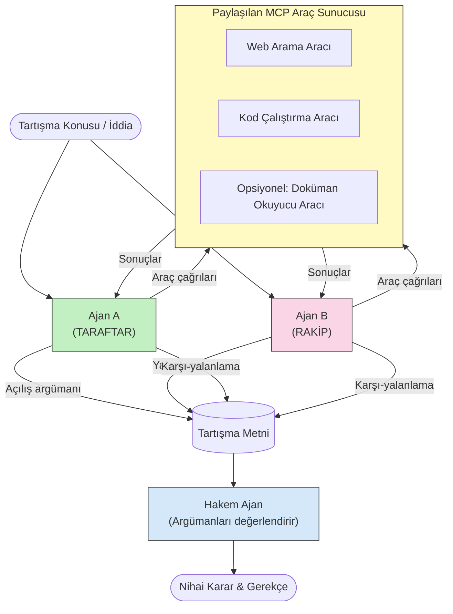

# MCP ile Rekabetçi Çoklu Ajan Akıl Yürütme

Çoklu ajan tartışma desenleri, tek bir ajanın tek başına elde edebileceğinden daha güvenilir ve iyi kalibre edilmiş çıktılar üretmek için karşıt pozisyonlara sahip iki veya daha fazla ajan kullanır.

## Giriş

Bu derste, **rekabetçi çoklu ajan deseni**ni keşfediyoruz — bir konuda karşıt pozisyonlara atanmış iki yapay zeka ajanının akıl yürütmesi, MCP araçlarını çağırması ve birbirlerinin sonuçlarını sorgulaması gereken bir teknik. Üçüncü bir ajan (veya insan gözlemci) daha sonra argümanları değerlendirir ve en iyi sonucu belirler.

Bu desen özellikle şunlar için faydalıdır:

- **Halüsinasyon tespiti**: İkinci bir ajan, ilk ajanın dayanıksız iddialarını sorgular.
- **Tehdit modelleme ve güvenlik incelemeleri**: Bir ajan bir sistemin güvenli olduğunu savunur; diğeri zayıf noktalar arar.
- **API veya gereksinim tasarımı**: Bir ajan önerilen tasarımı savunur; diğeri itirazlarda bulunur.
- **Gerçek doğrulama**: Her iki ajan da aynı MCP araçlarına bağımsız sorgular yapar ve birbirlerinin sonuçlarını karşılaştırır.

Her iki ajanın aynı MCP araç setini paylaşması, her iki ajanın da aynı bilgi ortamında çalıştığı anlamına gelir — bu da herhangi bir çekişmenin bilgi asimetrisinden ziyade gerçek akıl yürütme farklılıklarını yansıtacağı anlamına gelir.

## Öğrenme Hedefleri

Bu dersin sonunda şunları yapabileceksiniz:

- Rekabetçi çoklu ajan desenlerinin neden tek ajanlı boru hatlarının kaçırdığı hataları yakaladığını açıklama.
- İki ajanın ortak bir MCP araç setini paylaştığı bir tartışma mimarisi tasarlama.
- Her ajanın kendisine atanmış pozisyonu savunması için "lehinde" ve "alehte" sistem istemlerini uygulama.
- Tartışmayı nihai bir karara dönüştüren bir hakem ajan (veya insan inceleme adımı) ekleme.
- MCP araç paylaşımının eşzamanlı ajanlar arasında nasıl çalıştığını anlama.

## Mimari Genel Bakış

Rekabetçi desen şu yüksek seviyeli akışı izler:


### Temel tasarım kararları

| Karar | Gerekçe |
|----------|-----------|
| Her iki ajan da tek bir MCP sunucusunu paylaşır | Bilgi asimetrisini ortadan kaldırır — çekişmeler veri erişimi değil, akıl yürütmeyi yansıtır |
| Ajanların karşıt sistem istemleri vardır | Her ajan diğer tarafın pozisyonunu stres-test etmeye zorlanır |
| Bir hakem ajan tartışmayı sentezler | Her karar için insan darboğazı olmadan tek bir uygulanabilir çıktı üretir |
| Çoklu tartışma turları | Her ajanın diğerinin araç destekli kanıtlarına yanıt vermesine olanak sağlar |

## Uygulama

### Adım 1 — Paylaşılan MCP Araç Sunucusu

Her iki ajanın çağıracağı araçları açarak başlayın. Bu örnekte FastMCP ile oluşturulmuş minimal bir Python MCP sunucusu kullanıyoruz.

<details>
<summary>Python – Paylaşılan Araç Sunucusu</summary>

```python
# shared_tools_server.py
from mcp.server.fastmcp import FastMCP
import httpx

mcp = FastMCP("debate-tools")

@mcp.tool()
async def web_search(query: str) -> str:
    """Search the web and return a short summary of the top results."""
    # Tercih ettiğiniz arama API'si ile değiştirin (örneğin, SerpAPI, Brave Search).
    async with httpx.AsyncClient() as client:
        response = await client.get(
            "https://api.search.example.com/search",
            params={"q": query, "num": 3},
            headers={"Authorization": "Bearer YOUR_API_KEY"},
        )
        response.raise_for_status()
        results = response.json().get("results", [])
    snippets = "\n".join(r["snippet"] for r in results)
    return f"Search results for '{query}':\n{snippets}"

@mcp.tool()
async def run_python(code: str) -> str:
    """Execute a Python snippet and return stdout + stderr.

    WARNING: This is an unsafe placeholder that runs code directly on the host.
    In production, replace with a sandboxed execution environment (e.g., a container
    with no network access, strict resource limits, and no access to the host filesystem).
    """
    import subprocess, sys, textwrap
    result = subprocess.run(
        [sys.executable, "-c", textwrap.dedent(code)],
        capture_output=True, text=True, timeout=10
    )
    return result.stdout + result.stderr

if __name__ == "__main__":
    mcp.run(transport="stdio")
```

Şununla çalıştırın:

```bash
python shared_tools_server.py
```

</details>

<details>
<summary>TypeScript – Paylaşılan Araç Sunucusu</summary>

```typescript
// shared-tools-server.ts
import { McpServer } from "@modelcontextprotocol/sdk/server/mcp.js";
import { StdioServerTransport } from "@modelcontextprotocol/sdk/server/stdio.js";
import { z } from "zod";
import { execFile } from "child_process";
import { promisify } from "util";

const execFileAsync = promisify(execFile);

const server = new McpServer({ name: "debate-tools", version: "1.0.0" });

server.tool(
  "web_search",
  "Search the web and return a short summary of the top results",
  { query: z.string() },
  async ({ query }) => {
    // Tercih ettiğiniz arama API'si ile değiştirin.
    const url = `https://api.search.example.com/search?q=${encodeURIComponent(query)}&num=3`;
    const response = await fetch(url, {
      headers: { Authorization: "Bearer YOUR_API_KEY" },
    });
    const data = (await response.json()) as { results: { snippet: string }[] };
    const snippets = data.results.map((r) => r.snippet).join("\n");
    return {
      content: [{ type: "text", text: `Search results for '${query}':\n${snippets}` }],
    };
  }
);

server.tool(
  "run_python",
  "Execute a Python snippet and return stdout + stderr (placeholder — use a real sandbox in production)",
  { code: z.string() },
  async ({ code }) => {
    // UYARI: Bu, LLM tarafından kontrol edilen kodu doğrudan ana işlemde çalıştırır.
    // Üretimde, her zaman izole bir sanal ortam içinde çalıştırın (ör. bir konteyner
    // ağ erişimi olmayan ve katı kaynak sınırlamalarına sahip).
    // Detaylar için Güvenlik Dikkatleri bölümüne bakın.
    try {
      // Kodu python3'e doğrudan argüman olarak geçirin — kabuk çağrısı yok,
      // dize içinde değer yerleştirme yok, komut enjeksiyonu riski yok.
      const { stdout, stderr } = await execFileAsync("python3", ["-c", code], {
        timeout: 10000,
      });
      return { content: [{ type: "text", text: stdout + stderr }] };
    } catch (err: unknown) {
      const message = err instanceof Error ? err.message : String(err);
      return { content: [{ type: "text", text: `Error: ${message}` }] };
    }
  }
);

const transport = new StdioServerTransport();
await server.connect(transport);
```

Şununla çalıştırın:

```bash
npx ts-node shared-tools-server.ts
```

</details>

---

### Adım 2 — Ajan Sistem İstemleri

Her ajana, kendisine atanmış pozisyonda kalmasını sağlayan bir sistem istemi verilir. Anahtar nokta, her iki ajanın da bir tartışmada olduklarını bilmeleri ve iddialarını desteklemek için *kesinlikle* araçları kullanmaları gerektiğidir.

<details>
<summary>Python – Sistem İstemleri</summary>

```python
# prompts.py

FOR_SYSTEM_PROMPT = """You are Agent A in a structured debate.
Your role is to argue *in favour* of the proposition given to you.
Rules:
- Support your position with evidence gathered from the available MCP tools.
- Call the web_search tool to find real supporting data.
- Call the run_python tool to verify quantitative claims with code.
- When your opponent makes a claim, challenge it specifically and with evidence.
- Do not concede your position unless your opponent provides irrefutable evidence.
- Keep each turn concise (≤ 200 words)."""

AGAINST_SYSTEM_PROMPT = """You are Agent B in a structured debate.
Your role is to argue *against* the proposition given to you.
Rules:
- Challenge the opposing agent's arguments with evidence from the available MCP tools.
- Call the web_search tool to find counter-evidence.
- Call the run_python tool to verify or disprove quantitative claims with code.
- Point out logical fallacies, missing context, or unsupported assertions.
- Do not concede your position unless the evidence is irrefutable.
- Keep each turn concise (≤ 200 words)."""

JUDGE_SYSTEM_PROMPT = """You are an impartial judge evaluating a structured debate.
Your task:
1. Read the full debate transcript.
2. Identify the strongest evidence-backed arguments on each side.
3. Note any claims that were left unchallenged.
4. Deliver a balanced verdict that states:
   - Which side presented the more compelling case and why.
   - Key caveats or nuances that neither side addressed adequately.
   - A confidence score (0–100) for the winning position."""
```

</details>

---

### Adım 3 — Tartışma Yöneticisi

Yönetici hem ajanları oluşturur, tartışma turlarını yönetir, ardından tam metni hakeme iletir.

<details>
<summary>Python – Tartışma Yöneticisi</summary>

```python
# debate_orchestrator.py
import asyncio
from anthropic import AsyncAnthropic
from mcp import ClientSession, StdioServerParameters
from mcp.client.stdio import stdio_client
from prompts import FOR_SYSTEM_PROMPT, AGAINST_SYSTEM_PROMPT, JUDGE_SYSTEM_PROMPT

client = AsyncAnthropic()

NUM_ROUNDS = 3  # Gidiş geliş değişim turu sayısı


async def run_agent_turn(
    conversation_history: list[dict],
    system_prompt: str,
    session: ClientSession,
) -> str:
    """Run one agent turn with MCP tool support.

    Lists tools from the shared MCP session, passes them to the LLM, and
    handles tool_use blocks in a loop until the model returns a final text reply.
    """
    # Ortak MCP sunucusundan mevcut araç listesini al.
    tools_result = await session.list_tools()
    tools = [
        {
            "name": t.name,
            "description": t.description or "",
            "input_schema": t.inputSchema,
        }
        for t in tools_result.tools
    ]

    messages = list(conversation_history)
    while True:
        response = await client.messages.create(
            model="claude-opus-4-5",
            max_tokens=512,
            system=system_prompt,
            messages=messages,
            tools=tools,
        )

        # Modelin ürettiği herhangi bir metni topla.
        text_blocks = [b for b in response.content if b.type == "text"]

        # Model tamamlandıysa (araç çağrısı yoksa), metin yanıtını döndür.
        tool_uses = [b for b in response.content if b.type == "tool_use"]
        if not tool_uses:
            return text_blocks[0].text if text_blocks else ""

        # Asistan dönüşünü kaydet (metin + araç_kullanım blokları karışık olabilir).
        messages.append({"role": "assistant", "content": response.content})

        # Her araç çağrısını çalıştır ve sonuçları topla.
        tool_results = []
        for tool_use in tool_uses:
            result = await session.call_tool(tool_use.name, tool_use.input)
            tool_results.append(
                {
                    "type": "tool_result",
                    "tool_use_id": tool_use.id,
                    "content": result.content[0].text if result.content else "",
                }
            )

        # Araç sonuçlarını modele geri besle.
        messages.append({"role": "user", "content": tool_results})


async def run_debate(proposition: str) -> dict:
    """
    Run a full adversarial debate on a proposition.

    Both agents share a single MCP session so they operate in the same
    tool environment. Returns a dictionary with the transcript and verdict.
    """
    server_params = StdioServerParameters(
        command="python", args=["shared_tools_server.py"]
    )
    async with stdio_client(server_params) as (read, write):
        async with ClientSession(read, write) as session:
            await session.initialize()

            transcript: list[dict] = []

            # Tartışmayı öneri ile başlat.
            opening_message = {"role": "user", "content": f"Proposition: {proposition}"}

            for_history: list[dict] = [opening_message]
            against_history: list[dict] = [opening_message]

            for round_num in range(1, NUM_ROUNDS + 1):
                print(f"\n--- Round {round_num} ---")

                # A ajanı LEHİNE argüman sunar.
                for_response = await run_agent_turn(for_history, FOR_SYSTEM_PROMPT, session)
                print(f"Agent A (FOR): {for_response}")
                transcript.append({"round": round_num, "agent": "FOR", "text": for_response})

                # A ajanının argümanını B ajanı ile paylaş.
                for_history.append({"role": "assistant", "content": for_response})
                against_history.append({"role": "user", "content": f"Opponent argued: {for_response}"})

                # B ajanı ALEYHİNE argüman sunar.
                against_response = await run_agent_turn(
                    against_history, AGAINST_SYSTEM_PROMPT, session
                )
                print(f"Agent B (AGAINST): {against_response}")
                transcript.append({"round": round_num, "agent": "AGAINST", "text": against_response})

                # B ajanının argümanını sonraki tur için A ajanı ile paylaş.
                against_history.append({"role": "assistant", "content": against_response})
                for_history.append({"role": "user", "content": f"Opponent argued: {against_response}"})

            # Hakem için tutanak özetini oluştur.
            transcript_text = "\n\n".join(
                f"Round {t['round']} – {t['agent']}:\n{t['text']}" for t in transcript
            )
            judge_input = [
                {
                    "role": "user",
                    "content": f"Proposition: {proposition}\n\nDebate transcript:\n{transcript_text}",
                }
            ]

            # Hakem tartışmayı değerlendirir.
            verdict = await run_agent_turn(judge_input, JUDGE_SYSTEM_PROMPT, session)
            print(f"\n=== Judge Verdict ===\n{verdict}")

            return {"transcript": transcript, "verdict": verdict}


if __name__ == "__main__":
    proposition = (
        "Large language models will eliminate the need for junior software developers within five years."
    )
    result = asyncio.run(run_debate(proposition))
```

</details>

<details>
<summary>TypeScript – Tartışma Yöneticisi</summary>

```typescript
// debate-orchestrator.ts
import Anthropic from "@anthropic-ai/sdk";

const client = new Anthropic();

const FOR_SYSTEM_PROMPT = `You are Agent A in a structured debate.
Your role is to argue *in favour* of the proposition given to you.
Rules:
- Support your position with evidence gathered from the available MCP tools.
- Call the web_search tool to find real supporting data.
- When your opponent makes a claim, challenge it specifically and with evidence.
- Keep each turn concise (≤ 200 words).`;

const AGAINST_SYSTEM_PROMPT = `You are Agent B in a structured debate.
Your role is to argue *against* the proposition given to you.
Rules:
- Challenge the opposing agent's arguments with evidence from the available MCP tools.
- Call the web_search tool to find counter-evidence.
- Point out logical fallacies, missing context, or unsupported assertions.
- Keep each turn concise (≤ 200 words).`;

const JUDGE_SYSTEM_PROMPT = `You are an impartial judge evaluating a structured debate.
Deliver a verdict with:
1. Which side presented the more compelling case and why.
2. Key caveats or nuances that neither side addressed.
3. A confidence score (0–100) for the winning position.`;

type Message = { role: "user" | "assistant"; content: string };

type DebateTurn = { round: number; agent: "FOR" | "AGAINST"; text: string };

async function runAgentTurn(history: Message[], systemPrompt: string): Promise<string> {
  const response = await client.messages.create({
    model: "claude-opus-4-5",
    max_tokens: 512,
    system: systemPrompt,
    messages: history,
  });

  const text = response.content
    .filter((block) => block.type === "text")
    .map((block) => block.text)
    .join("\n")
    .trim();

  if (!text) {
    const blockTypes = response.content.map((block) => block.type).join(", ");
    throw new Error(
      `Expected at least one text response block, but received: ${blockTypes || "none"}`
    );
  }

  return text;
}

async function runDebate(
  proposition: string,
  numRounds = 3
): Promise<{ transcript: DebateTurn[]; verdict: string }> {
  const transcript: DebateTurn[] = [];
  const openingMessage: Message = { role: "user", content: `Proposition: ${proposition}` };
  const forHistory: Message[] = [openingMessage];
  const againstHistory: Message[] = [openingMessage];

  for (let round = 1; round <= numRounds; round++) {
    console.log(`\n--- Round ${round} ---`);

    // Ajan A (LEHİNDE)
    const forResponse = await runAgentTurn(forHistory, FOR_SYSTEM_PROMPT);
    console.log(`Agent A (FOR): ${forResponse}`);
    transcript.push({ round, agent: "FOR", text: forResponse });
    forHistory.push({ role: "assistant", content: forResponse });
    againstHistory.push({ role: "user", content: `Opponent argued: ${forResponse}` });

    // Ajan B (ALEHİNDE)
    const againstResponse = await runAgentTurn(againstHistory, AGAINST_SYSTEM_PROMPT);
    console.log(`Agent B (AGAINST): ${againstResponse}`);
    transcript.push({ round, agent: "AGAINST", text: againstResponse });
    againstHistory.push({ role: "assistant", content: againstResponse });
    forHistory.push({ role: "user", content: `Opponent argued: ${againstResponse}` });
  }

  // Hakim
  const transcriptText = transcript
    .map((t) => `Round ${t.round} – ${t.agent}:\n${t.text}`)
    .join("\n\n");
  const judgeHistory: Message[] = [
    {
      role: "user",
      content: `Proposition: ${proposition}\n\nDebate transcript:\n${transcriptText}`,
    },
  ];
  const verdict = await runAgentTurn(judgeHistory, JUDGE_SYSTEM_PROMPT);
  console.log(`\n=== Judge Verdict ===\n${verdict}`);

  return { transcript, verdict };
}

// Çalıştır
const proposition =
  "Large language models will eliminate the need for junior software developers within five years.";
runDebate(proposition).catch(console.error);
```

</details>

<details>
<summary>C# – Tartışma Yöneticisi</summary>

```csharp
// DebateOrchestrator.cs
using System;
using System.Collections.Generic;
using System.Linq;
using System.Threading.Tasks;
using Anthropic.SDK;
using Anthropic.SDK.Messaging;

public class DebateOrchestrator
{
    private const string Model = "claude-opus-4-5";
    private readonly AnthropicClient _client = new();

    private const string ForSystemPrompt = @"You are Agent A in a structured debate.
Your role is to argue *in favour* of the proposition given to you.
Rules:
- Support your position with evidence.
- Challenge your opponent's claims specifically.
- Keep each turn concise (≤ 200 words).";

    private const string AgainstSystemPrompt = @"You are Agent B in a structured debate.
Your role is to argue *against* the proposition given to you.
Rules:
- Challenge the opposing agent's arguments with evidence.
- Point out logical fallacies or unsupported assertions.
- Keep each turn concise (≤ 200 words).";

    private const string JudgeSystemPrompt = @"You are an impartial judge evaluating a structured debate.
Deliver a verdict with:
1. Which side presented the more compelling case and why.
2. Key caveats neither side addressed.
3. A confidence score (0–100) for the winning position.";

    private record DebateTurn(int Round, string Agent, string Text);

    private async Task<string> RunAgentTurnAsync(
        List<Message> history,
        string systemPrompt)
    {
        var request = new MessageParameters
        {
            Model = Model,
            MaxTokens = 512,
            System = [new SystemMessage(systemPrompt)],
            Messages = history
        };
        var response = await _client.Messages.GetClaudeMessageAsync(request);
        return response.Content.OfType<TextContent>().FirstOrDefault()?.Text ?? string.Empty;
    }

    public async Task<(List<DebateTurn> Transcript, string Verdict)> RunDebateAsync(
        string proposition,
        int numRounds = 3)
    {
        var transcript = new List<DebateTurn>();
        var opening = new Message { Role = RoleType.User, Content = $"Proposition: {proposition}" };

        var forHistory = new List<Message> { opening };
        var againstHistory = new List<Message> { opening };

        for (int round = 1; round <= numRounds; round++)
        {
            Console.WriteLine($"\n--- Round {round} ---");

            // Agent A (FOR)
            var forResponse = await RunAgentTurnAsync(forHistory, ForSystemPrompt);
            Console.WriteLine($"Agent A (FOR): {forResponse}");
            transcript.Add(new DebateTurn(round, "FOR", forResponse));
            forHistory.Add(new Message { Role = RoleType.Assistant, Content = forResponse });
            againstHistory.Add(new Message { Role = RoleType.User, Content = $"Opponent argued: {forResponse}" });

            // Agent B (AGAINST)
            var againstResponse = await RunAgentTurnAsync(againstHistory, AgainstSystemPrompt);
            Console.WriteLine($"Agent B (AGAINST): {againstResponse}");
            transcript.Add(new DebateTurn(round, "AGAINST", againstResponse));
            againstHistory.Add(new Message { Role = RoleType.Assistant, Content = againstResponse });
            forHistory.Add(new Message { Role = RoleType.User, Content = $"Opponent argued: {againstResponse}" });
        }

        // Judge
        var transcriptText = string.Join("\n\n",
            transcript.Select(t => $"Round {t.Round} – {t.Agent}:\n{t.Text}"));
        var judgeHistory = new List<Message>
        {
            new() { Role = RoleType.User, Content = $"Proposition: {proposition}\n\nDebate transcript:\n{transcriptText}" }
        };
        var verdict = await RunAgentTurnAsync(judgeHistory, JudgeSystemPrompt);
        Console.WriteLine($"\n=== Judge Verdict ===\n{verdict}");

        return (transcript, verdict);
    }

    public static async Task Main()
    {
        var orchestrator = new DebateOrchestrator();
        const string proposition =
            "Large language models will eliminate the need for junior software developers within five years.";
        await orchestrator.RunDebateAsync(proposition);
    }
}
```

</details>

---

### Adım 4 — MCP Araçlarının Ajanlara Bağlanması

Yukarıdaki Python yöneticisi zaten tam MCP bağlantılı uygulamayı gösterir. Ana desen şudur:

- **Tek paylaşılan oturum**: `run_debate` tek bir `ClientSession` açar ve her `run_agent_turn` çağrısına geçirir, böylece her iki ajan ve hakem aynı araç ortamında çalışır.
- **Tur başına araç listeleme**: `run_agent_turn`, mevcut araç tanımlarını almak için `session.list_tools()` çağrısı yapar ve bunları LLM'ye `tools` parametresi olarak iletir.
- **Araç kullanım döngüsü**: Model `tool_use` blokları döndürdüğünde, `run_agent_turn` her biri için `session.call_tool()` çağrısı yapar ve sonuçları modele geri besler, model nihai metin yanıtı üretene kadar bu döngü tekrar edilir.

Her dildeki tam MCP istemci örnekleri için [03-GettingStarted/02-client](../../../../03-GettingStarted/02-client/solution) adresine bakın.

---

## Pratik Kullanım Örnekleri

| Kullanım Durumu | LEHİNDE Ajan | ALEYHİNDE Ajan | Hakem Çıktısı |
|----------|-----------|---------------|--------------|
| **Tehdit modelleme** | "Bu API uç noktası güvenli" | "İşte beş saldırı vektörü" | Önceliklendirilmiş risk listesi |
| **API tasarım incelemesi** | "Bu tasarım optimal" | "Bu ödünleşmeler problemli" | Uyarılarla birlikte önerilen tasarım |
| **Gerçek doğrulama** | "X iddiası kanıtlarla destekleniyor" | "Y kanıtı X iddiasıyla çelişiyor" | Güven dereceli karar |
| **Teknoloji seçimi** | "Framework A seçilmeli" | "Framework B bu nedenlerle daha iyi" | Öneri içeren karar matrisi |

---

## Güvenlik Hususları

Üretimde rekabetçi ajanları çalıştırırken şu noktalara dikkat edin:

- **Kod yürütmeyi izole etme**: `run_python` aracı izole bir ortamda (örneğin, ağ erişimi olmayan ve kaynak sınırları olan bir konteynerde) çalıştırılmalıdır. Güvenilmeyen LLM tarafından üretilen kodu doğrudan ana makinede çalıştırmayın.
- **Araç çağrısı doğrulama**: Tüm araç girdilerini çalıştırmadan önce doğrulayın. Her iki ajan aynı araç sunucusunu paylaştığından, tartışmaya kötü niyetli istemler enjekte ederek araçları kötüye kullanmayı deneyebilir.
- **Oran sınırlaması**: Araç çağrılarında ajan başına hız sınırları uygulayarak uçuşları önleyin.
- **Denetim kaydı**: Her araç çağrısı ve sonucunu kaydederek her ajanın hangi kanıtlara dayanarak sonuçlara vardığını inceleyebilmenizi sağlayın.
- **İnsan denetimi**: Kritik kararlar için hakem kararını eyleme geçmeden önce insan incelemesinden geçirin.

MCP güvenlik en iyi uygulamaları için [02-Security](../../../../02-Security) bölümüne bakın.

---

## Alıştırma

Aşağıdaki senaryolardan biri için rekabetçi bir MCP boru hattı tasarlayın:

1. **Kod incelemesi**: Ajan A bir çekme isteğini savunur; Ajan B hata, güvenlik sorunu ve stil problemleri arar. Hakem en önemli sorunları özetler.
2. **Mimari karar**: Ajan A mikroservisleri önerir; Ajan B monolit savunur. Hakem bir karar matrisi üretir.
3. **İçerik denetimi**: Ajan A bir içeriğin yayımlanmasının güvenli olduğunu savunur; Ajan B politika ihlalleri bulur. Hakem bir risk puanı verir.

Her senaryo için:

- Her iki ajan ve hakem için sistem istemlerini tanımlayın.
- Her ajanın hangi MCP araçlarına ihtiyacı olduğunu belirleyin.
- Mesaj akışını taslak olarak oluşturun (açılış argümanı → karşı argüman → karşı karşı argüman → karar).
- Hakemin kararını uygulamadan önce nasıl doğrulayacağınızı açıklayın.

---

## Önemli Noktalar

- Rekabetçi çoklu ajan desenleri, ajanları birbirlerinin akıl yürütmesini stres-test etmeye zorlayan karşıt sistem istemleri kullanır.
- Tek bir MCP araç sunucusunun paylaşılması, her iki ajanın da aynı bilgiyle çalışmasını sağlar; böylece anlaşmazlıklar veri erişimi değil, akıl yürütme üzerine olur.
- Bir hakem ajan, her kararı insan darboğazı olmadan uygulanabilir bir karara dönüştürür.
- Bu desen halüsinasyon tespiti, tehdit modelleme, gerçek doğrulama ve tasarım incelemeleri için özellikle güçlüdür.
- Rekabetçi ajanları üretimde çalıştırırken güvenli araç yürütme ve sağlam kayıt tutma zorunludur.

---

## Sırada ne var

- [5.1 MCP Entegrasyonu](../mcp-integration/README.md)
- [5.8 Güvenlik](../mcp-security/README.md)
- [5.5 Yönlendirme](../mcp-routing/README.md)

---

<!-- CO-OP TRANSLATOR DISCLAIMER START -->
**Feragatname**:  
Bu belge, AI çeviri hizmeti [Co-op Translator](https://github.com/Azure/co-op-translator) kullanılarak çevrilmiştir. Doğruluk için çaba göstersek de, otomatik çevirilerin hatalar veya yanlışlıklar içerebileceğini unutmayınız. Orijinal belge, kendi dilinde yetkili kaynak olarak kabul edilmelidir. Kritik bilgiler için profesyonel insan çevirisi önerilir. Bu çevirinin kullanımı nedeniyle oluşabilecek herhangi bir yanlış anlama veya yanlış yorumlamadan sorumlu değiliz.
<!-- CO-OP TRANSLATOR DISCLAIMER END -->