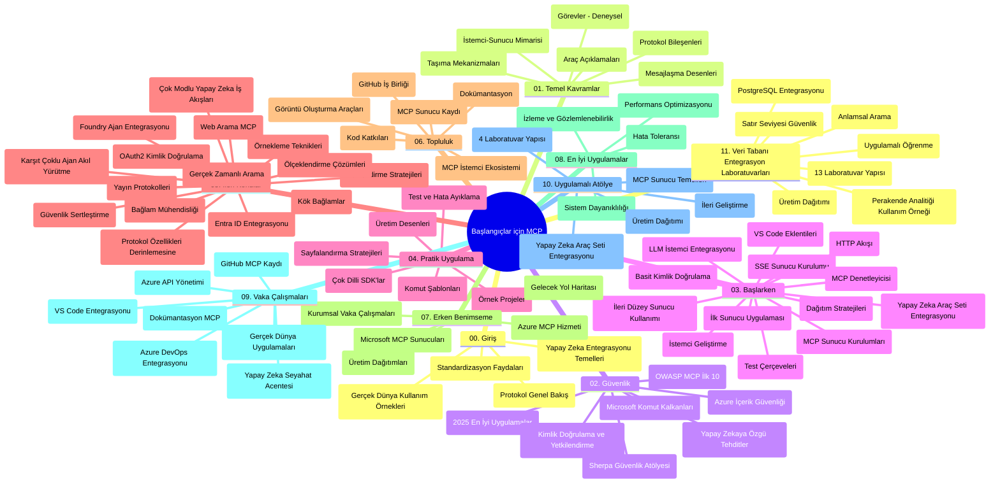

# Yeni Başlayanlar için Model Context Protocol (MCP) - Çalışma Rehberi

Bu çalışma rehberi, "Yeni Başlayanlar için Model Context Protocol (MCP)" müfredatının depo yapısı ve içeriğine genel bir bakış sunar. Depoyu verimli bir şekilde gezinmek ve mevcut kaynaklardan en iyi şekilde yararlanmak için bu rehberi kullanın.

## Depo Genel Bakışı

Model Context Protocol (MCP), yapay zeka modelleri ile istemci uygulamaları arasındaki etkileşimler için standartlaştırılmış bir çerçevedir. Başlangıçta Anthropic tarafından oluşturulan MCP, şu anda resmi GitHub organizasyonu aracılığıyla daha geniş MCP topluluğu tarafından sürdürülmektedir. Bu depo, AI geliştiricileri, sistem mimarları ve yazılım mühendisleri için C#, Java, JavaScript, Python ve TypeScript'te uygulamalı kod örnekleri içeren kapsamlı bir müfredat sağlar.

## Görsel Müfredat Haritası

## Depo Yapısı

Depo, MCP’nin farklı yönlerine odaklanan on bir ana bölüme düzenlenmiştir:

1. **Giriş (00-Introduction/)**
   - Model Context Protocol genel bakışı
   - AI boru hatlarında standartlaşmanın önemi
   - Pratik kullanım örnekleri ve faydalar

2. **Temel Kavramlar (01-CoreConcepts/)**
   - İstemci-sunucu mimarisi
   - Ana protokol bileşenleri
   - MCP’de mesajlaşma desenleri

3. **Güvenlik (02-Security/)**
   - MCP tabanlı sistemlerde güvenlik tehditleri
   - Uygulamanın güvence altına alınması için en iyi uygulamalar
   - Kimlik doğrulama ve yetkilendirme stratejileri
   - **Kapsamlı Güvenlik Belgeleri**:
     - MCP Güvenlik En İyi Uygulamaları 2025
     - Azure İçerik Güvenliği Uygulama Kılavuzu
     - MCP Güvenlik Kontrolleri ve Teknikleri
     - MCP En İyi Uygulamalar Hızlı Referans
   - **Önemli Güvenlik Konuları**:
     - İstem enjeksiyonu ve araç zehirleme saldırıları
     - Oturum kaçırma ve karışık temsil problemleri
     - Token geçişi açıkları
     - Aşırı izinler ve erişim kontrolü
     - AI bileşenleri için tedarik zinciri güvenliği
     - Microsoft İstem Kalkanları entegrasyonu

4. **Başlarken (03-GettingStarted/)**
   - Ortam kurulumu ve yapılandırma
   - Temel MCP sunucuları ve istemcilerinin oluşturulması
   - Mevcut uygulamalarla entegrasyon
   - Şu bölümleri içerir:
     - İlk sunucu uygulaması
     - İstemci geliştirme
     - LLM istemci entegrasyonu
     - VS Code entegrasyonu
     - Sunucu-Tarafından Gönderilen Olaylar (SSE) sunucusu
     - İleri seviye sunucu kullanımı
     - HTTP akışı
     - AI Araç Kiti entegrasyonu
     - Test stratejileri
     - Dağıtım yönergeleri

5. **Pratik Uygulama (04-PracticalImplementation/)**
   - Farklı programlama dillerinde SDK kullanımı
   - Hata ayıklama, test ve doğrulama teknikleri
   - Yeniden kullanılabilir istem şablonları ve iş akışları oluşturma
   - Uygulama örnekleri içeren örnek projeler

6. **İleri Konular (05-AdvancedTopics/)**
   - Bağlam mühendisliği teknikleri
   - Foundry ajan entegrasyonu
   - Çok modlu AI iş akışları
   - OAuth2 kimlik doğrulama demoları
   - Gerçek zamanlı arama yetenekleri
   - Gerçek zamanlı akış
   - Kök bağlamların uygulanması
   - Yönlendirme stratejileri
   - Örnekleme teknikleri
   - Ölçeklendirme yaklaşımları
   - Güvenlik hususları
   - Entra ID güvenlik entegrasyonu
   - Web arama entegrasyonu
   - Karşıt çok ajanlı akıl yürütme (tartışma desenleri)

7. **Topluluk Katkıları (06-CommunityContributions/)**
   - Kod ve dokümantasyon katkısı yapma yolları
   - GitHub üzerinden iş birliği
   - Topluluk kaynaklı iyileştirmeler ve geri bildirimler
   - Çeşitli MCP istemcilerinin kullanımı (Claude Desktop, Cline, VSCode)
   - Popüler MCP sunucularıyla çalışma, görüntü oluşturma dahil

8. **Erken Benimsemeden Dersler (07-LessonsfromEarlyAdoption/)**
   - Gerçek dünya uygulamaları ve başarı hikayeleri
   - MCP tabanlı çözümlerin oluşturulması ve dağıtımı
   - Trendler ve gelecek yol haritası
   - **Microsoft MCP Sunucuları Kılavuzu**: 10 üretime hazır Microsoft MCP sunucusunu kapsayan kapsamlı rehber:
     - Microsoft Learn Docs MCP Sunucusu
     - Azure MCP Sunucusu (15+ özel bağlayıcı)
     - GitHub MCP Sunucusu
     - Azure DevOps MCP Sunucusu
     - MarkItDown MCP Sunucusu
     - SQL Server MCP Sunucusu
     - Playwright MCP Sunucusu
     - Dev Box MCP Sunucusu
     - Azure AI Foundry MCP Sunucusu
     - Microsoft 365 Agents Toolkit MCP Sunucusu

9. **En İyi Uygulamalar (08-BestPractices/)**
   - Performans ayarlama ve optimizasyon
   - Hata toleranslı MCP sistemleri tasarımı
   - Test ve dayanıklılık stratejileri

10. **Vaka Çalışmaları (09-CaseStudy/)**
    - MCP’nin çok yönlülüğünü gösteren **yedisi kapsamlı vaka çalışması**:
    - **Azure AI Seyahat Acenteleri**: Azure OpenAI ve AI Arama ile çoklu ajan orkestrasyonu
    - **Azure DevOps Entegrasyonu**: YouTube veri güncellemeleriyle iş akışı otomasyonu
    - **Gerçek Zamanlı Dokümantasyon Getirme**: Streaming HTTP destekli Python konsol istemcisi
    - **Etkileşimli Çalışma Planı Üretici**: Chainlit web uygulaması ve konuşmalı AI
    - **Düzenleyicide Dokümantasyon**: GitHub Copilot iş akışları ile VS Code entegrasyonu
    - **Azure API Yönetimi**: Kurumsal API entegrasyonu ve MCP sunucu oluşturma
    - **GitHub MCP Kayıt Defteri**: Ekosistem geliştirme ve ajan bazlı entegrasyon platformu
    - Kurumsal entegrasyon, geliştirici verimliliği ve ekosistem geliştirme alanlarında uygulama örnekleri

11. **Uygulamalı Atölye (10-StreamliningAIWorkflowsBuildingAnMCPServerWithAIToolkit/)**
    - MCP ve AI Araç Kiti’ni birleştiren kapsamlı uygulamalı atölye
    - AI modelleri ile gerçek dünya araçlarını bağlayan akıllı uygulamalar oluşturma
    - Temeller, özel sunucu geliştirme ve üretim dağıtım stratejilerini kapsayan pratik modüller
    - **Atölye Yapısı**:
      - Atölye 1: MCP Sunucu Temelleri
      - Atölye 2: İleri MCP Sunucu Geliştirme
      - Atölye 3: AI Araç Kiti Entegrasyonu
      - Atölye 4: Üretim Dağıtımı ve Ölçeklendirme
    - Adım adım talimatlarla laboratuvar tabanlı öğrenme yaklaşımı

12. **MCP Sunucu Veritabanı Entegrasyon Laboratuvarları (11-MCPServerHandsOnLabs/)**
    - PostgreSQL entegrasyonuyla üretime hazır MCP sunucuları oluşturmak için **kapsamlı 13-lab öğrenme yolu**
    - Zava Retail kullanım senaryosu ile gerçek dünya perakende analitiği uygulaması
    - Satır Seviyesi Güvenlik (RLS), anlamsal arama ve çok kiracılı veri erişimi gibi kurumsal desenler
    - **Tam Laboratuvar Yapısı**:
      - **Lab 00-03: Temeller** - Giriş, Mimari, Güvenlik, Ortam Kurulumu
      - **Lab 04-06: MCP Sunucu Oluşturma** - Veritabanı Tasarımı, MCP Sunucu Uygulaması, Araç Geliştirme
      - **Lab 07-09: İleri Özellikler** - Anlamsal Arama, Test & Hata Ayıklama, VS Code Entegrasyonu
      - **Lab 10-12: Üretim & En İyi Uygulamalar** - Dağıtım, İzleme, Optimizasyon
    - **Kullanılan Teknolojiler**: FastMCP framework, PostgreSQL, Azure OpenAI, Azure Container Apps, Application Insights
    - **Öğrenim Çıktıları**: Üretime hazır MCP sunucuları, veritabanı entegrasyon desenleri, yapay zeka destekli analizler, kurumsal güvenlik

## Ek Kaynaklar

Depoda destekleyici kaynaklar şunları içerir:

- **Images klasörü**: Müfredat boyunca kullanılan diyagramlar ve görseller
- **Çeviriler**: Dokümantasyonun çok dilli destek ve otomatik çevirileri
- **Resmi MCP Kaynakları**:
  - [MCP Dokümantasyonu](https://modelcontextprotocol.io/)
  - [MCP Spesifikasyonu](https://spec.modelcontextprotocol.io/)
  - [MCP GitHub Deposu](https://github.com/modelcontextprotocol)

## Bu Depo Nasıl Kullanılır

1. **Sıralı Öğrenme**: Yapılandırılmış öğrenme deneyimi için bölümleri sırayla (00'dan 11'e) takip edin.
2. **Dil Odaklı İnceleme**: Belirli bir programlama diline ilgi duyuyorsanız, örnekler klasörlerinde tercih ettiğiniz dildeki uygulamaları keşfedin.
3. **Pratik Uygulama**: Ortamınızı kurmak ve ilk MCP sunucu ile istemcinizi oluşturmak için "Başlarken" bölümünden başlayın.
4. **İleri Düzey Keşif**: Temelleri öğrendikten sonra bilgilerinizi genişletmek için ileri konulara dalın.
5. **Topluluk Katılımı**: MCP topluluğuna GitHub tartışmaları ve Discord kanalları aracılığıyla katılarak uzmanlar ve diğer geliştiricilerle bağlantı kurun.

## MCP İstemcileri ve Araçları

Müfredat, çeşitli MCP istemcileri ve araçlarını kapsar:

1. **Resmi İstemciler**:
   - Visual Studio Code
   - Visual Studio Code'da MCP
   - Claude Desktop
   - VSCode’da Claude
   - Claude API

2. **Topluluk İstemcileri**:
   - Cline (terminal tabanlı)
   - Cursor (kod editörü)
   - ChatMCP
   - Windsurf

3. **MCP Yönetim Araçları**:
   - MCP CLI
   - MCP Manager
   - MCP Linker
   - MCP Router

## Popüler MCP Sunucuları

Depoda tanıtılan çeşitli MCP sunucuları şunlardır:

1. **Resmi Microsoft MCP Sunucuları**:
   - Microsoft Learn Docs MCP Sunucusu
   - Azure MCP Sunucusu (15+ özel bağlayıcı)
   - GitHub MCP Sunucusu
   - Azure DevOps MCP Sunucusu
   - MarkItDown MCP Sunucusu
   - SQL Server MCP Sunucusu
   - Playwright MCP Sunucusu
   - Dev Box MCP Sunucusu
   - Azure AI Foundry MCP Sunucusu
   - Microsoft 365 Agents Toolkit MCP Sunucusu

2. **Resmi Referans Sunucuları**:
   - Dosya Sistemi
   - Fetch
   - Bellek
   - Ardışık Düşünme

3. **Görüntü Oluşturma**:
   - Azure OpenAI DALL-E 3
   - Stable Diffusion WebUI
   - Replicate

4. **Geliştirme Araçları**:
   - Git MCP
   - Terminal Kontrolü
   - Kod Asistanı

5. **Uzmanlaşmış Sunucular**:
   - Salesforce
   - Microsoft Teams
   - Jira & Confluence

## Katkıda Bulunma

Bu depo, topluluk katkılarına açıktır. MCP ekosistemine etkili katkıda bulunmak için Topluluk Katkıları bölümüne bakınız.

----

*Bu çalışma rehberi, en son MCP Spesifikasyonu 2025-11-25'i yansıtarak 5 Şubat 2026 tarihinde güncellenmiş olup, o tarihteki depo genel görünümünü sağlar. Depo içeriği bu tarihten sonra güncellenmiş olabilir.*

---

<!-- CO-OP TRANSLATOR DISCLAIMER START -->
**Feragatnamenin**:
Bu belge, [Co-op Translator](https://github.com/Azure/co-op-translator) adlı AI çeviri hizmeti kullanılarak çevrilmiştir. Doğruluk için çaba göstersek de, otomatik çevirilerin hatalar veya yanlışlıklar içerebileceğini lütfen unutmayın. Orijinal belge, kendi ana dilinde yetkili kaynak olarak kabul edilmelidir. Kritik bilgiler için profesyonel insan çevirisi önerilir. Bu çevirinin kullanımı sonucu oluşabilecek yanlış anlamalar veya yorum hatalarından sorumlu değiliz.
<!-- CO-OP TRANSLATOR DISCLAIMER END -->