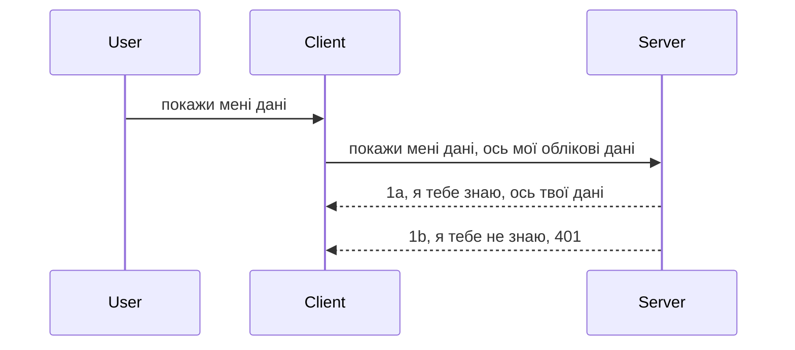

# Простий автентифікація

SDK MCP підтримують використання OAuth 2.1, що, чесно кажучи, є досить складним процесом, який включає такі поняття, як сервер автентифікації, ресурсний сервер, надсилання облікових даних, отримання коду, обмін коду на токен-переносник, доки нарешті ви не отримаєте доступ до ваших ресурсів. Якщо ви не звикли до OAuth, який є чудовим рішенням для реалізації, то добре почати з базового рівня автентифікації і поступово нарощувати безпеку. Ось чому існує ця глава, щоб допомогти вам перейти до більш просунутої автентифікації.

## Автентифікація, що ми маємо на увазі?

Автентифікація — це скорочення від аутентифікації та авторизації. Ідея полягає в тому, що нам потрібно зробити дві речі:

- **Аутентифікація**, процес визначення, чи дозволяємо ми людині увійти в наш дім, чи вона має право бути "тут", тобто мати доступ до нашого ресурсного сервера, на якому працюють функції MCP Server.
- **Авторизація**, процес визначення, чи повинен користувач мати доступ до конкретних ресурсів, які він запитує, наприклад, до цих замовлень чи цих товарів, або чи дозволено йому лише читати вміст, але не видаляти його.

## Облікові дані: як ми повідомляємо системі, хто ми

Більшість веб-розробників починають думати у термінах надання облікових даних серверу, зазвичай секрету, який каже, чи дозволено їм бути тут — це і є автентифікація. Цей обліковий запис зазвичай — це base64-кодована версія імені користувача та пароля або ключ API, який унікально ідентифікує певного користувача.

Зазвичай його передають у заголовку під назвою "Authorization" так:

```json
{ "Authorization": "secret123" }
```
  
Це зазвичай називають базовою автентифікацією. Загальний потік тоді працює наступним чином:


Тепер, коли ми розуміємо, як це працює з точки зору потоку, як ми це реалізуємо? Більшість веб-серверів мають концепцію middleware — шматок коду, що виконується в частині запиту, який може перевіряти облікові дані, і якщо вони дійсні, пропускає запит далі. Якщо запит не має дійсних облікових даних, ви отримуєте помилку автентифікації. Подивимось, як це можна реалізувати:

**Python**

```python
class AuthMiddleware(BaseHTTPMiddleware):
    async def dispatch(self, request, call_next):

        has_header = request.headers.get("Authorization")
        if not has_header:
            print("-> Missing Authorization header!")
            return Response(status_code=401, content="Unauthorized")

        if not valid_token(has_header):
            print("-> Invalid token!")
            return Response(status_code=403, content="Forbidden")

        print("Valid token, proceeding...")
       
        response = await call_next(request)
        # додати будь-які користувацькі заголовки або змінити відповідь якимось чином
        return response


starlette_app.add_middleware(CustomHeaderMiddleware)
```
  
Тут ми:

- Створили middleware під назвою `AuthMiddleware`, де метод `dispatch` викликається веб-сервером.
- Додали middleware до веб-сервера:

    ```python
    starlette_app.add_middleware(AuthMiddleware)
    ```
  
- Написали логіку валідації, яка перевіряє наявність заголовка Authorization і чи переданий секрет дійсний:

    ```python
    has_header = request.headers.get("Authorization")
    if not has_header:
        print("-> Missing Authorization header!")
        return Response(status_code=401, content="Unauthorized")

    if not valid_token(has_header):
        print("-> Invalid token!")
        return Response(status_code=403, content="Forbidden")
    ```
  
    Якщо секрет присутній і дійсний, ми пропускаємо запит, викликаючи `call_next` і повертаємо відповідь.

    ```python
    response = await call_next(request)
    # додати будь-які заголовки клієнта або змінити відповідь якимось чином
    return response
    ```
  
Як це працює: якщо веб-запит надійде до сервера, middleware буде викликаний і з реалізації він або пропустить запит, або поверне помилку, яка вказує, що клієнту не дозволено продовжувати.

**TypeScript**

Тут ми створюємо middleware з популярним фреймворком Express і перехоплюємо запит до того, як він досягає MCP Server. Ось код:

```typescript
function isValid(secret) {
    return secret === "secret123";
}

app.use((req, res, next) => {
    // 1. Заголовок авторизації присутній?
    if(!req.headers["Authorization"]) {
        res.status(401).send('Unauthorized');
    }
    
    let token = req.headers["Authorization"];

    // 2. Перевірте дійсність.
    if(!isValid(token)) {
        res.status(403).send('Forbidden');
    }

   
    console.log('Middleware executed');
    // 3. Передає запит до наступного кроку в конвеєрі запитів.
    next();
});
```
  
У цьому коді ми:

1. Перевіряємо, чи є заголовок Authorization, якщо ні — відправляємо помилку 401.
2. Переконуємося, що облікові дані / токен дійсні, якщо ні — відправляємо помилку 403.
3. Нарешті пропускаємо запит у конвеєрі і повертаємо потрібний ресурс.

## Вправа: Реалізувати автентифікацію

Візьмемо наші знання і спробуємо реалізувати це на практиці. План такий:

Сервер

- Створити веб-сервер і екземпляр MCP.
- Реалізувати middleware для сервера.

Клієнт

- Надіслати веб-запит з обліковими даними через заголовок.

### -1- Створити веб-сервер і екземпляр MCP

На першому кроці нам потрібно створити екземпляр веб-сервера та MCP Server.

**Python**

Тут ми створюємо екземпляр MCP Server, створюємо starlette веб-додаток і хостимо його з допомогою uvicorn.

```python
# створення MCP сервера

app = FastMCP(
    name="MCP Resource Server",
    instructions="Resource Server that validates tokens via Authorization Server introspection",
    host=settings["host"],
    port=settings["port"],
    debug=True
)

# створення веб-додатку starlette
starlette_app = app.streamable_http_app()

# запуск додатку через uvicorn
async def run(starlette_app):
    import uvicorn
    config = uvicorn.Config(
            starlette_app,
            host=app.settings.host,
            port=app.settings.port,
            log_level=app.settings.log_level.lower(),
        )
    server = uvicorn.Server(config)
    await server.serve()

run(starlette_app)
```
  
У цьому коді ми:

- Створюємо MCP Server.
- Конструюємо starlette веб-додаток з MCP Server — `app.streamable_http_app()`.
- Хостимо і сервісимо веб-додаток за допомогою uvicorn `server.serve()`.

**TypeScript**

Тут ми створюємо екземпляр MCP Server.

```typescript
const server = new McpServer({
      name: "example-server",
      version: "1.0.0"
    });

    // ... налаштувати серверні ресурси, інструменти та підказки ...
```
  
Це створення MCP Server має відбуватися в межах визначення маршруту POST /mcp, тож перенесемо код відповідним чином:

```typescript
import express from "express";
import { randomUUID } from "node:crypto";
import { McpServer } from "@modelcontextprotocol/sdk/server/mcp.js";
import { StreamableHTTPServerTransport } from "@modelcontextprotocol/sdk/server/streamableHttp.js";
import { isInitializeRequest } from "@modelcontextprotocol/sdk/types.js"

const app = express();
app.use(express.json());

// Карта для збереження транспортів за ідентифікатором сесії
const transports: { [sessionId: string]: StreamableHTTPServerTransport } = {};

// Обробка POST-запитів для клієнт-серверної комунікації
app.post('/mcp', async (req, res) => {
  // Перевірка наявності існуючого ідентифікатора сесії
  const sessionId = req.headers['mcp-session-id'] as string | undefined;
  let transport: StreamableHTTPServerTransport;

  if (sessionId && transports[sessionId]) {
    // Повторне використання існуючого транспорту
    transport = transports[sessionId];
  } else if (!sessionId && isInitializeRequest(req.body)) {
    // Новий запит на ініціалізацію
    transport = new StreamableHTTPServerTransport({
      sessionIdGenerator: () => randomUUID(),
      onsessioninitialized: (sessionId) => {
        // Збереження транспорту за ідентифікатором сесії
        transports[sessionId] = transport;
      },
      // Захист від DNS rebinding за замовчуванням вимкнений для забезпечення сумісності з попередніми версіями. Якщо ви запускаєте цей сервер
      // локально, обов’язково встановіть:
      // enableDnsRebindingProtection: true,
      // allowedHosts: ['127.0.0.1'],
    });

    // Очищення транспорту при закритті
    transport.onclose = () => {
      if (transport.sessionId) {
        delete transports[transport.sessionId];
      }
    };
    const server = new McpServer({
      name: "example-server",
      version: "1.0.0"
    });

    // ... налаштування серверних ресурсів, інструментів і підказок ...

    // Підключення до MCP-сервера
    await server.connect(transport);
  } else {
    // Некоректний запит
    res.status(400).json({
      jsonrpc: '2.0',
      error: {
        code: -32000,
        message: 'Bad Request: No valid session ID provided',
      },
      id: null,
    });
    return;
  }

  // Обробка запиту
  await transport.handleRequest(req, res, req.body);
});

// Повторно використовуваний обробник для GET і DELETE-запитів
const handleSessionRequest = async (req: express.Request, res: express.Response) => {
  const sessionId = req.headers['mcp-session-id'] as string | undefined;
  if (!sessionId || !transports[sessionId]) {
    res.status(400).send('Invalid or missing session ID');
    return;
  }
  
  const transport = transports[sessionId];
  await transport.handleRequest(req, res);
};

// Обробка GET-запитів для повідомлень сервер-клієнт через SSE
app.get('/mcp', handleSessionRequest);

// Обробка DELETE-запитів для завершення сесії
app.delete('/mcp', handleSessionRequest);

app.listen(3000);
```
  
Тепер ви бачите, що створення MCP Server перенесено всередину `app.post("/mcp")`.

Переходимо до наступного кроку — створення middleware для перевірки облікових даних.

### -2- Реалізувати middleware для сервера

Наступна частина — middleware, який шукає облікові дані у заголовку `Authorization` і перевіряє їх. Якщо вони прийнятні, запит проходить далі, виконуючи необхідні дії (наприклад, перелік інструментів, читання ресурсу або іншу функціональність MCP, яку запрошував клієнт).

**Python**

Для створення middleware потрібно створити клас, що наслідує `BaseHTTPMiddleware`. Є два цікаві елементи:

- Запит `request`, з якого ми читаємо інформацію із заголовка.
- `call_next` — зворотній виклик, який треба викликати, якщо клієнт подав прийнятні облікові дані.

Спочатку обробимо випадок відсутності заголовка Authorization:

```python
has_header = request.headers.get("Authorization")

# заголовок відсутній, відмовити з кодом 401, інакше продовжити.
if not has_header:
    print("-> Missing Authorization header!")
    return Response(status_code=401, content="Unauthorized")
```
  
Тут ми відправляємо повідомлення 401 unauthorized, оскільки клієнт не пройшов автентифікацію.

Далі, якщо облікові дані подані, перевіряємо їх дійсність наступним чином:

```python
 if not valid_token(has_header):
    print("-> Invalid token!")
    return Response(status_code=403, content="Forbidden")
```
  
Зверніть увагу, що тут ми відправляємо повідомлення 403 forbidden. Нижче повна реалізація middleware, що включає всі описані моменти:

```python
class AuthMiddleware(BaseHTTPMiddleware):
    async def dispatch(self, request, call_next):

        has_header = request.headers.get("Authorization")
        if not has_header:
            print("-> Missing Authorization header!")
            return Response(status_code=401, content="Unauthorized")

        if not valid_token(has_header):
            print("-> Invalid token!")
            return Response(status_code=403, content="Forbidden")

        print("Valid token, proceeding...")
        print(f"-> Received {request.method} {request.url}")
        response = await call_next(request)
        response.headers['Custom'] = 'Example'
        return response

```
  
Чудово, але що таке функція `valid_token`? Ось вона:

```python
# НЕ використовуйте для виробництва - покращте це !!
def valid_token(token: str) -> bool:
    # видалити префікс "Bearer "
    if token.startswith("Bearer "):
        token = token[7:]
        return token == "secret-token"
    return False
```
  
Це, звісно, можна покращити.

ВАЖЛИВО: Ніколи не тримайте такі секрети в коді. Найкраще отримувати значення для порівняння з джерела даних або від постачальника ідентифікації (IDP), або краще — дозволити IDP виконувати валідацію.

**TypeScript**

Щоб реалізувати це на Express, потрібно викликати метод `use`, який приймає middleware функції.

Нам потрібно:

- Взаємодіяти з об’єктом запиту, щоб перевірити облікові дані в властивості `Authorization`.
- Валідувати облікові дані, і якщо вони прийнятні, пропустити запит далі і нарешті клієнт отримає доступ до функціональності MCP (наприклад, перелік інструментів, читання ресурсу або інше).

Тут ми перевіряємо, чи є заголовок Authorization, і якщо ні — припиняємо обробку з помилкою:

```typescript
if(!req.headers["authorization"]) {
    res.status(401).send('Unauthorized');
    return;
}
```
  
Якщо заголовок не надісланий, отримуємо 401.

Далі перевіряємо валідність облікових даних, якщо ні — знову зупиняємо запит, але з помилкою 403:

```typescript
if(!isValid(token)) {
    res.status(403).send('Forbidden');
    return;
} 
```
  
Тепер отримуємо 403 помилку.

Ось повний код:

```typescript
app.use((req, res, next) => {
    console.log('Request received:', req.method, req.url, req.headers);
    console.log('Headers:', req.headers["authorization"]);
    if(!req.headers["authorization"]) {
        res.status(401).send('Unauthorized');
        return;
    }
    
    let token = req.headers["authorization"];

    if(!isValid(token)) {
        res.status(403).send('Forbidden');
        return;
    }  

    console.log('Middleware executed');
    next();
});
```
  
Ми налаштували веб-сервер приймати middleware для перевірки облікових даних, які клієнт надсилає. А як щодо самого клієнта?

### -3- Надіслати веб-запит з обліковими даними через заголовок

Потрібно переконатися, що клієнт передає облікові дані через заголовок. Оскільки ми будемо використовувати MCP клієнт, треба зрозуміти, як це зробити.

**Python**

Для клієнта потрібно передати заголовок з обліковими даними так:

```python
# НЕ прописуйте значення в коді, зберігайте його щонайменше у змінній середовища або в більш безпечному сховищі
token = "secret-token"

async with streamablehttp_client(
        url = f"http://localhost:{port}/mcp",
        headers = {"Authorization": f"Bearer {token}"}
    ) as (
        read_stream,
        write_stream,
        session_callback,
    ):
        async with ClientSession(
            read_stream,
            write_stream
        ) as session:
            await session.initialize()
      
            # TODO, що ви хочете реалізувати на клієнті, наприклад, перелік інструментів, виклик інструментів тощо.
```
  
Зверніть увагу, як ми заповнюємо `headers`, наприклад `headers = {"Authorization": f"Bearer {token}"}`.

**TypeScript**

Це можна зробити у два кроки:

1. Заповнити конфігураційний об’єкт обліковими даними.
2. Передати конфігураційний об’єкт в транспорт.

```typescript

// НЕ жорстко кодуйте значення, як показано тут. Як мінімум, зробіть його змінною середовища і використовуйте щось на кшталт dotenv (у режимі розробки).
let token = "secret123"

// визначте об'єкт опцій транспорту клієнта
let options: StreamableHTTPClientTransportOptions = {
  sessionId: sessionId,
  requestInit: {
    headers: {
      "Authorization": "secret123"
    }
  }
};

// передайте об'єкт опцій до транспорту
async function main() {
   const transport = new StreamableHTTPClientTransport(
      new URL(serverUrl),
      options
   );
```
  
Тут ви бачите, як ми створили об’єкт `options` і розмістили заголовки у властивості `requestInit`.

ВАЖЛИВО: Як же покращити це? Перш за все, передача облікових даних таким чином є ризикованою, якщо нема HTTPS. Навіть з HTTPS облікові дані можуть бути вкрадені, тому потрібна система, де можна легко відкликати токен і додати додаткові перевірки: звідки він прийшов, чи не надто часто відбуваються запити (бот-поведінка), загалом, ціла низка питань.

Тим не менш, для дуже простих API, де ви не хочете, щоб будь-хто дзвонив у ваш API без автентифікації, це хороша база.

Враховуючи це, давайте посилимо безпеку, використовуючи стандартизований формат JSON Web Token, також відомий як JWT або "JOT" токени.

## JSON Web Tokens, JWT

Отже, ми намагаємося покращити просту автентифікацію. Які негайні переваги дає впровадження JWT?

- **Покращення безпеки**. У базовій автентифікації ви постійно надсилаєте ім'я користувача та пароль у вигляді base64 токена (або API ключ), що збільшує ризики. За JWT ви надсилаєте ім'я користувача і пароль один раз, отримуєте токен у відповідь, який має термін дії. JWT дозволяє легко впроваджувати детальний контроль доступу за ролями, областями та правами.
- **Безстанність та масштабованість**. JWT самодостатні, несуть усю інформацію про користувача і усувають потребу зберігати дані сесії на сервері. Токен можна валідовувати локально.
- **Інтероперабельність та федерація**. JWT є центральним компонентом Open ID Connect, використовується з відомими постачальниками ідентичності на кшталт Entra ID, Google Identity і Auth0. Вони також забезпечують можливість єдиного входу та багато іншого, що робить їх корпоративним рішенням.
- **Модульність і гнучкість**. JWT також можна використовувати з API-шлюзами, такими як Azure API Management, NGINX тощо. Підтримує випадки аутентифікації і сервер-сервер з комунікацією, включно з імперсонацією та делегуванням.
- **Продуктивність та кешування**. JWT можна кешувати після декодування, що зменшує потребу в повторній обробці. Це корисно для високонавантажених застосунків і покращує пропускну спроможність та знижує навантаження на інфраструктуру.
- **Розширені функції**. Підтримує інспекцію (перевірку валідності на сервері) та відкликання (робить токен недійсним).

З усіма цими перевагами дивимось, як підняти нашу реалізацію на новий рівень.

## Перетворення базової автентифікації у JWT

Отже, загалом нам потрібно:

- **Навчитись конструювати JWT токен** і підготувати його для передачі від клієнта до сервера.
- **Валідувати JWT токен**, і якщо він валідний, надати клієнту ресурс.
- **Безпечно зберігати токен**.
- **Захистити маршрути**. Нам потрібно захистити маршрути та конкретні функції MCP.
- **Додати токени оновлення**. Гарантувати створення короткоживучих токенів і довгоживучих токенів оновлення, які можна використовувати для отримання нових токенів після закінчення терміну дії. Забезпечити наявність endpoint для оновлення та стратегії ротації.

### -1- Конструюємо JWT токен

Спочатку JWT токен має такі частини:

- **header** — алгоритм і тип токена.
- **payload** — клейми, наприклад sub (користувач або сутність, яку представляє токен, у сценарії автентифікації зазвичай userId), exp (час закінчення дії), role (роль).
- **signature** — підписаний секретом чи приватним ключем.

Для цього ми створимо header, payload і закодований токен.

**Python**

```python

import jwt
import jwt
from jwt.exceptions import ExpiredSignatureError, InvalidTokenError
import datetime

# Секретний ключ, який використовується для підпису JWT
secret_key = 'your-secret-key'

header = {
    "alg": "HS256",
    "typ": "JWT"
}

# інформація про користувача, його претензії та час дії
payload = {
    "sub": "1234567890",               # Предмет (ID користувача)
    "name": "User Userson",                # Користувацька претензія
    "admin": True,                     # Користувацька претензія
    "iat": datetime.datetime.utcnow(),# Час видачі
    "exp": datetime.datetime.utcnow() + datetime.timedelta(hours=1)  # Термін дії
}

# закодувати це
encoded_jwt = jwt.encode(payload, secret_key, algorithm="HS256", headers=header)
```
  
У коді вище ми:

- Визначили header з використанням алгоритму HS256 і типу JWT.
- Побудували payload, який містить суб’єкт або userId, ім’я користувача, роль, час видачі і час закінчення дії, таким чином реалізуючи термін дії.

**TypeScript**

Тут нам потрібні залежності, які допоможуть створити JWT токен.

Залежності

```sh

npm install jsonwebtoken
npm install --save-dev @types/jsonwebtoken
```
  
Коли це налаштовано, створимо header, payload і закодований токен.

```typescript
import jwt from 'jsonwebtoken';

const secretKey = 'your-secret-key'; // Використовуйте змінні оточення у продакшені

// Визначте корисне навантаження
const payload = {
  sub: '1234567890',
  name: 'User usersson',
  admin: true,
  iat: Math.floor(Date.now() / 1000), // Видано о
  exp: Math.floor(Date.now() / 1000) + 60 * 60 // Термін дії закінчується через 1 годину
};

// Визначте заголовок (опційно, jsonwebtoken встановлює за замовчуванням)
const header = {
  alg: 'HS256',
  typ: 'JWT'
};

// Створіть токен
const token = jwt.sign(payload, secretKey, {
  algorithm: 'HS256',
  header: header
});

console.log('JWT:', token);
```
  
Цей токен:

Підписаний HS256  
Дійсний 1 годину  
Містить клейми sub, name, admin, iat та exp.

### -2- Валідуємо токен

Потрібно також валідувати токен на сервері, щоб переконатися, що те, що клієнт надсилає, справді валідне. Потрібно перевіряти багато аспектів: структуру, зберігання, права тощо. Рекомендується додавати перевірки на те, чи є користувач у вашій системі, і чи має він потрібні права.

Для валідації токена треба розкодувати його, щоб прочитати і почати перевірку:

**Python**

```python

# Декодувати та перевірити JWT
try:
    decoded = jwt.decode(token, secret_key, algorithms=["HS256"])
    print("✅ Token is valid.")
    print("Decoded claims:")
    for key, value in decoded.items():
        print(f"  {key}: {value}")
except ExpiredSignatureError:
    print("❌ Token has expired.")
except InvalidTokenError as e:
    print(f"❌ Invalid token: {e}")

```
  
У цьому коді ми викликаємо `jwt.decode` із токеном, секретним ключем і обраним алгоритмом. Зверніть увагу, що ми використовуємо конструкцію try-catch, оскільки при невдалій валідації виникає виняток.

**TypeScript**

Тут викликаємо `jwt.verify`, щоб отримати розкодований токен для подальшого аналізу. Якщо виклик помилковий — структура токена неправильна або він недійсний.

```typescript

try {
  const decoded = jwt.verify(token, secretKey);
  console.log('Decoded Payload:', decoded);
} catch (err) {
  console.error('Token verification failed:', err);
}
```
  
ПРИМІТКА: Як уже згадувалося, потрібно додатково перевіряти, чи посилає токен користувача з вашої системи і чи має цей користувач потрібні права.

Далі розглянемо контроль доступу на основі ролей, також відомий як RBAC.
## Додавання контролю доступу на основі ролей

Ідея полягає в тому, що ми хочемо виразити, що різні ролі мають різні права доступу. Наприклад, ми припускаємо, що адміністратор може робити все, звичайний користувач може читати/писати, а гість може лише читати. Отже, ось декілька можливих рівнів дозволів:

- Admin.Write  
- User.Read  
- Guest.Read  

Давайте подивимось, як ми можемо реалізувати такий контроль за допомогою middleware. Middleware можна додавати для кожного маршруту, а також для всіх маршрутів.

**Python**

```python
from starlette.middleware.base import BaseHTTPMiddleware
from starlette.responses import JSONResponse
import jwt

# НЕ зберігайте секрет у коді, це лише для демонстрації. Зчитайте його з безпечного місця.
SECRET_KEY = "your-secret-key" # помістіть це у змінну середовища
REQUIRED_PERMISSION = "User.Read"

class JWTPermissionMiddleware(BaseHTTPMiddleware):
    async def dispatch(self, request, call_next):
        auth_header = request.headers.get("Authorization")
        if not auth_header or not auth_header.startswith("Bearer "):
            return JSONResponse({"error": "Missing or invalid Authorization header"}, status_code=401)

        token = auth_header.split(" ")[1]
        try:
            decoded = jwt.decode(token, SECRET_KEY, algorithms=["HS256"])
        except jwt.ExpiredSignatureError:
            return JSONResponse({"error": "Token expired"}, status_code=401)
        except jwt.InvalidTokenError:
            return JSONResponse({"error": "Invalid token"}, status_code=401)

        permissions = decoded.get("permissions", [])
        if REQUIRED_PERMISSION not in permissions:
            return JSONResponse({"error": "Permission denied"}, status_code=403)

        request.state.user = decoded
        return await call_next(request)


```
  
Є кілька різних способів додати middleware, як нижче:

```python

# Варіант 1: додати middleware під час створення застосунку starlette
middleware = [
    Middleware(JWTPermissionMiddleware)
]

app = Starlette(routes=routes, middleware=middleware)

# Варіант 2: додати middleware після того, як застосунок starlette вже створено
starlette_app.add_middleware(JWTPermissionMiddleware)

# Варіант 3: додати middleware для кожного маршруту
routes = [
    Route(
        "/mcp",
        endpoint=..., # обробник
        middleware=[Middleware(JWTPermissionMiddleware)]
    )
]
```
  
**TypeScript**

Ми можемо використовувати `app.use` та middleware, яке буде виконуватись для всіх запитів.

```typescript
app.use((req, res, next) => {
    console.log('Request received:', req.method, req.url, req.headers);
    console.log('Headers:', req.headers["authorization"]);

    // 1. Перевірте, чи був надісланий заголовок авторизації

    if(!req.headers["authorization"]) {
        res.status(401).send('Unauthorized');
        return;
    }
    
    let token = req.headers["authorization"];

    // 2. Перевірте, чи є токен дійсним
    if(!isValid(token)) {
        res.status(403).send('Forbidden');
        return;
    }  

    // 3. Перевірте, чи користувач токена існує в нашій системі
    if(!isExistingUser(token)) {
        res.status(403).send('Forbidden');
        console.log("User does not exist");
        return;
    }
    console.log("User exists");

    // 4. Перевірте, чи має токен відповідні дозволи
    if(!hasScopes(token, ["User.Read"])){
        res.status(403).send('Forbidden - insufficient scopes');
    }

    console.log("User has required scopes");

    console.log('Middleware executed');
    next();
});

```
  
Є досить багато речей, які ми можемо дозволити нашому middleware і які НАШ middleware МАЄ робити, а саме:

1. Перевірити, чи є заголовок авторизації  
2. Перевірити, чи дійсний токен, ми викликаємо `isValid`, який є методом, який ми написали для перевірки цілісності та дійсності JWT токена.  
3. Перевірити, що користувач існує в нашій системі, це потрібно перевірити.

   ```typescript
    // користувачі в базі даних
   const users = [
     "user1",
     "User usersson",
   ]

   function isExistingUser(token) {
     let decodedToken = verifyToken(token);

     // TODO, перевірити, чи існує користувач у базі даних
     return users.includes(decodedToken?.name || "");
   }
   ```
  
   Вище ми створили дуже простий список `users`, який, звичайно, має бути збережений у базі даних.

4. Крім того, ми також повинні перевірити, чи має токен правильні дозволи.

   ```typescript
   if(!hasScopes(token, ["User.Read"])){
        res.status(403).send('Forbidden - insufficient scopes');
   }
   ```
  
   У цьому коді middleware ми перевіряємо, що токен містить дозвіл User.Read, якщо ні — відправляємо помилку 403. Нижче наведено допоміжний метод `hasScopes`.

   ```typescript
   function hasScopes(scope: string, requiredScopes: string[]) {
     let decodedToken = verifyToken(scope);
    return requiredScopes.every(scope => decodedToken?.scopes.includes(scope));
  }  
   ```

Have a think which additional checks you should be doing, but these are the absolute minimum of checks you should be doing.

Using Express as a web framework is a common choice. There are helpers library when you use JWT so you can write less code.

- `express-jwt`, helper library that provides a middleware that helps decode your token.
- `express-jwt-permissions`, this provides a middleware `guard` that helps check if a certain permission is on the token.

Here's what these libraries can look like when used:

```typescript
const express = require('express');
const jwt = require('express-jwt');
const guard = require('express-jwt-permissions')();

const app = express();
const secretKey = 'your-secret-key'; // put this in env variable

// Decode JWT and attach to req.user
app.use(jwt({ secret: secretKey, algorithms: ['HS256'] }));

// Check for User.Read permission
app.use(guard.check('User.Read'));

// multiple permissions
// app.use(guard.check(['User.Read', 'Admin.Access']));

app.get('/protected', (req, res) => {
  res.json({ message: `Welcome ${req.user.name}` });
});

// Error handler
app.use((err, req, res, next) => {
  if (err.code === 'permission_denied') {
    return res.status(403).send('Forbidden');
  }
  next(err);
});

```
  
Тепер ви бачили, як middleware може використовуватись для автентифікації та авторизації. А що з MCP? Чи змінює це, як ми виконуємо аутентифікацію? Давайте дізнаємось у наступному розділі.

### -3- Додавання RBAC до MCP

До цього ви бачили, як можна додати RBAC через middleware, однак для MCP немає простого способу додати RBAC на рівні функціоналу MCP, тож що робити? Просто треба додати код, який перевіряє, чи має клієнт право викликати конкретний інструмент:

У вас є кілька варіантів, як реалізувати RBAC на рівні окремої функції, ось деякі з них:

- Додати перевірку для кожного інструмента, ресурсу, запиту, де потрібно перевірити рівень доступу.  

   **python**

   ```python
   @tool()
   def delete_product(id: int):
      try:
          check_permissions(role="Admin.Write", request)
      catch:
        pass # клієнт не пройшов авторизацію, викликати помилку авторизації
   ```
  
   **typescript**

   ```typescript
   server.registerTool(
    "delete-product",
    {
      title: Delete a product",
      description: "Deletes a product",
      inputSchema: { id: z.number() }
    },
    async ({ id }) => {
      
      try {
        checkPermissions("Admin.Write", request);
        // зробити, надіслати ідентифікатор до productService та віддаленого входу
      } catch(Exception e) {
        console.log("Authorization error, you're not allowed");  
      }

      return {
        content: [{ type: "text", text: `Deletected product with id ${id}` }]
      };
    }
   );
   ```


- Використовувати розвинений підхід з сервером та обробниками запитів, щоб мінімізувати кількість місць, де треба проводити перевірку.

   **Python**

   ```python
   
   tool_permission = {
      "create_product": ["User.Write", "Admin.Write"],
      "delete_product": ["Admin.Write"]
   }

   def has_permission(user_permissions, required_permissions) -> bool:
      # user_permissions: список дозволів, які має користувач
      # required_permissions: список дозволів, необхідних для інструменту
      return any(perm in user_permissions for perm in required_permissions)

   @server.call_tool()
   async def handle_call_tool(
     name: str, arguments: dict[str, str] | None
   ) -> list[types.TextContent]:
    # Припустити, що request.user.permissions є списком дозволів користувача
     user_permissions = request.user.permissions
     required_permissions = tool_permission.get(name, [])
     if not has_permission(user_permissions, required_permissions):
        # Викинути помилку "У вас немає дозволу на виклик інструменту {name}"
        raise Exception(f"You don't have permission to call tool {name}")
     # продовжити та викликати інструмент
     # ...
   ```   
   

   **TypeScript**

   ```typescript
   function hasPermission(userPermissions: string[], requiredPermissions: string[]): boolean {
       if (!Array.isArray(userPermissions) || !Array.isArray(requiredPermissions)) return false;
       // Повернути true, якщо користувач має принаймні один необхідний дозвіл
       
       return requiredPermissions.some(perm => userPermissions.includes(perm));
   }
  
   server.setRequestHandler(CallToolRequestSchema, async (request) => {
      const { params: { name } } = request;
  
      let permissions = request.user.permissions;
  
      if (!hasPermission(permissions, toolPermissions[name])) {
         return new Error(`You don't have permission to call ${name}`);
      }
  
      // продовжуй..
   });
   ```
  
   Зверніть увагу, що потрібно переконатись, що middleware призначає розкодований токен властивості user об’єкта запиту, щоб код вище був простим.

### Підсумок

Тепер, коли ми обговорили, як додати підтримку RBAC загалом і для MCP зокрема, час спробувати реалізувати безпеку самостійно, щоб переконатись, що ви зрозуміли представлені концепції.

## Завдання 1: Побудувати MCP сервер та MCP клієнт з базовою автентифікацією

Тут ви використаєте те, що вивчили про передачу облікових даних через заголовки.

## Розв’язок 1

[Розв’язок 1](./code/basic/README.md)

## Завдання 2: Оновити розв’язок із Завдання 1, використовуючи JWT

Візьміть перший розв’язок, але цього разу покращимо його.

Замість Basic Auth використаємо JWT.

## Розв’язок 2

[Розв’язок 2](./solution/jwt-solution/README.md)

## Виклик

Додайте RBAC на рівні інструменту, як описано в розділі "Додавання RBAC до MCP".

## Підсумок

Сподіваюсь, ви багато чого дізналися у цій главі: від відсутності безпеки до базової безпеки, до JWT і того, як його можна додати до MCP.

Ми побудували міцну основу з користувацькими JWT, але з ростом масштабів ми рухаємося до моделі ідентифікації на основі стандартів. Використання IdP, як-от Entra або Keycloak, дозволяє нам делегувати видачу, перевірку та керування життєвим циклом токенів довіреній платформі — даючи змогу зосередитись на логіці додатку і досвіді користувача.

Для цього у нас є більш [просунутий розділ про Entra](../../05-AdvancedTopics/mcp-security-entra/README.md)

## Що далі

- Далі: [Налаштування MCP хостів](../12-mcp-hosts/README.md)

---

<!-- CO-OP TRANSLATOR DISCLAIMER START -->
**Відмова від відповідальності**:
Цей документ було перекладено за допомогою сервісу штучного інтелекту [Co-op Translator](https://github.com/Azure/co-op-translator). Хоча ми прагнемо до точності, просимо враховувати, що автоматизовані переклади можуть містити помилки або неточності. Оригінальний документ рідною мовою слід вважати авторитетним джерелом. Для критичної інформації рекомендується професійний людський переклад. Ми не несемо відповідальності за будь-які непорозуміння або неправильне тлумачення, що виникли внаслідок використання цього перекладу.
<!-- CO-OP TRANSLATOR DISCLAIMER END -->